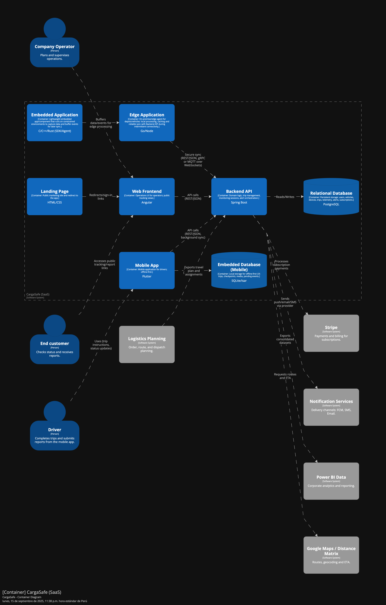

  

     
    
     
    <strong>Universidad Peruana de Ciencias Aplicadas</strong>
      
    <strong>Carrera de ingeniería de Software</strong>
      
    <strong>Ciclo 202520</strong>
      
    1ASI0572 - Desarrollo de Soluciones IOT
      
    <strong>NRC:</strong> 3443   
    <strong>Profesor:</strong> Velásquez Núñez, Angel Augusto   
    <strong>Informe de Trabajo Final</strong>
  

  

    

      <strong>Startup:</strong> Los Parkers 
       
      <strong>Producto:</strong> Macetech
    

  

      <strong>Relación de integrantes</strong>
        
      <table style="width: 60%; margin: 0 auto;   text-align: left">
        <thead>
          <tr>
            <th>Código</th>
            <th>Nombre</th>
          </tr>
        </thead>
        <tbody>
          <tr>
            <td>u20201c410</td>
            <td>Garro Vega, Marcelo Fabian</td>
          </tr>
          <tr>
            <td>u202113324</td>
            <td>Sanchez Ignacio, Jefrey Martin</td>
          </tr>
          <tr>
            <td>u...</td>
            <td>Apellidos, Nombres</td>
          </tr>
        </tbody>
      </table>
      

         
        <strong>Agosto 2025</strong>
      

    

  

---

# Capítulo I: Introducción

## 1.1. Startup Profile

### 1.1.1. Descripción de la Startup

### 1.1.2. Perfiles de integrantes del equipo

## 1.2. Solution Profile

### 1.2.1. Antecedentes y problemática

### 1.2.2. Lean UX Process

#### 1.2.2.1. Lean UX Problem Statements

#### 1.2.2.2. Lean UX Assumptions

#### 1.2.2.3. Lean UX Hypothesis Statements

#### 1.2.2.4. Lean UX Canvas

## 1.3. Segmentos objetivo

# Capítulo II: Requirements Elicitation & Analysis

## 2.1. Competidores

### 2.1.1. Análisis competitivo

### 2.1.2. Estrategias y tácticas frente a competidores

## 2.2. Entrevistas

### 2.2.1. Diseño de entrevistas

### 2.2.2. Registro de entrevistas

### 2.2.3. Análisis de entrevistas

## 2.3. Needfinding

### 2.3.1. User Personas

### 2.3.2. User Task Matrix

### 2.3.3. User Journey Mapping

### 2.3.4. Empathy Mapping

## 2.4. Big Picture EventStorming

## 2.5. Ubiquitous Language

# Capítulo III: Requirements Specification

## 3.1. User Stories

## 3.2. Impact Mapping

## 3.3. Product Backlog

# Capítulo IV: Solution Software Design

## 4.1. Strategic-Level Domain-Driven Design

### 4.1.1. Design-Level EventStorming

## 4.1.1.1 Candidate Context Discovery

Para esta etapa se llevó a cabo una sesión, la sesión tuvo una duración aproximada de 90 minutos y permitió identificar los bounded contexts del sistema CargaSafe. Durante el proceso se aplicaron las técnicas start-with-value, start-with-simple y look-for-pivotal-events, que facilitaron la agrupación de eventos y entidades según su afinidad y valor para el negocio.  

Como resultado, se identificaron ocho bounded contexts:  

- **Identity and Access Management**: administración de usuarios, autenticación y control de accesos.
- **Profiles and Preferences Management**: gestión de perfiles de usuario y configuración de preferencias.
- **Fleet management**: gestión de vehículos y dispositivos IoT.  
- **Execution of the trip**: creación y ejecución de viajes.  
- **Real-time monitoring**: monitoreo de condiciones en tiempo real.
- **Alerts and resolution**: generación de alertas. 
- **Visualization/Analytics**: visualización de métricas y reportes.  
- **Subscriptions and payments**: gestión de suscripciones y pagos con Stripe.  

  

### Leyenda utilizada en el EventStorming  
- 🟧 **Event**: describe algo que ocurrió en el dominio (Viaje iniciado, Alerta generada).  
- 🟦 **Command**: una instrucción o acción que dispara un evento (Registrar viaje).  
- 🟪 **Policy**: regla de negocio que determina qué ocurre ante ciertas condiciones (Si falta dispositivo → bloquear inicio del viaje).  
- 🟨 **Aggregate**: entidad principal que concentra datos y operaciones (Viaje, Suscripción).  
- 🟩 **UI**: vistas o pantallas del sistema que muestran información al usuario (Dashboard de KPIs).  
- ⚪ **Actor**: roles que interactúan con el sistema (Operador, Conductor).  
- ⬛ **Sistema externo**: integraciones con servicios de terceros (Google Maps, Stripe).  

Con esta estructura, el EventStorming permitió organizar y simplificar el dominio de CargaSafe, evidenciando de forma clara los contextos candidatos y la interacción entre actores, procesos y sistemas externos.  

[Ver gráfico en Miro](https://miro.com/app/board/uXjVJMskjeA=/?share_link_id=697373503273)

#### 4.1.1.2. Domain Message Flows Modeling

En esta etapa se desarrolló el **modelado de flujos de mensajes de dominio (Domain Message Flows)** con el objetivo de visualizar cómo colaboran los bounded contexts identificados en el Candidate Context Discovery para resolver los principales casos de negocio del sistema CargaSafe.  

Para la construcción de estos flujos se aplicó la técnica de **Domain Storytelling**, la cual permite describir las interacciones en un lenguaje natural, mostrando cómo un evento generado en un bounded context desencadena comandos o nuevos eventos en otros contextos. De este modo se logra una visión clara de la cooperación entre módulos y del ciclo de vida de la información dentro de la plataforma.  

### Historias de dominio (Domain Stories)

1. **Gestión de identidad y perfiles**  
   - Cuando un *usuario se registra* en **Identity and Access Management**, se genera un evento que es consumido por **Profiles and Preferences**, el cual crea automáticamente el perfil asociado.  
   - Si un *usuario edita sus preferencias*, se guarda la configuración en **Profiles**, y en caso de referirse a notificaciones, estas se utilizan en **Alerts** para personalizar los canales de envío.  

2. **Control de acceso y suscripciones**  
   - Cuando un *pago es procesado exitosamente* en **Subscriptions & Billing**, se envía un evento a **Identity and Access Management**, que habilita el acceso al sistema.  
   - Si un *pago falla*, el mismo flujo comunica a IAM que debe restringir o bloquear el acceso del usuario hasta regularizar su situación.  

3. **Gestión de flota y ejecución de viajes**  
   - Al *registrarse un vehículo o dispositivo IoT* en **Fleet Management**, este queda disponible para **Trip Management**, que puede asignarlo a un viaje planificado.  
   - Cuando un *operador crea e inicia un viaje* en **Trip Management**, se emite un evento que da origen a una sesión de monitoreo en **Monitoring**.  

4. **Monitoreo en tiempo real y alertas**  
   - **Monitoring** recibe continuamente *lecturas de sensores* (temperatura, ubicación, señal). Si se detecta una condición fuera de rango, se genera un evento que es consumido por **Alerts**.  
   - **Alerts** crea la alerta correspondiente y la notifica a los usuarios, aplicando las preferencias definidas en **Profiles** (por ejemplo, envío por SMS, correo o notificación push).  

5. **Analítica y reportes**  
   - Cada *alerta generada o reconocida* en **Alerts** actualiza los indicadores en **Dashboard & Analytics**, alimentando las métricas de cumplimiento y los reportes de incidentes.  
   - Cuando **Dashboard & Analytics** genera un *reporte final*, este puede personalizarse de acuerdo con las preferencias almacenadas en **Profiles**, permitiendo al usuario recibir información ajustada a su rol o necesidades.
  

### Resultados

Los flujos de mensajes de dominio evidencian la cooperación entre los ocho bounded contexts de CargaSafe:  
- **Identity and Access Management**  
- **Profiles and Preferences Management**  
- **Fleet Management**  
- **Execution of the trip**  
- **Real-time monitoring**  
- **Alerts and resolution**  
- **Visualization/Analytics**  
- **Subscriptions and payments**

Este ejercicio permitió comprender cómo un evento local en un contexto puede impactar en otros, asegurando la trazabilidad del negocio y la correcta interacción entre los distintos módulos de la solución.

#### 4.1.1.3. Bounded Context Canvases

En esta sección se elaboraron los Bounded Context Canvases de CargaSafe para los ocho contextos identificados. El objetivo fue delimitar con precisión responsabilidades, lenguaje ubicuo y decisiones de negocio, además de explicitar las comunicaciones (Queries, Commands y Events) y colaboradores (otros BC, sistemas externos y frontend). Cada canvas documenta: Descripción, Clasificación estratégica (core/supporting/generic), Rol de dominio (draft/execution/analysis/gateway), Inbound/Outbound communication, Ubiquitous Language, Business Decisions y Collaborators. Esta definición fija ownership de datos, reduce ambigüedades y prepara los contratos de integración que se implementarán en APIs y mensajería.

[Ver gráfico en Miro](https://miro.com/app/board/uXjVJJ2PHqk=/?share_link_id=762570504671)

### 4.1.2. Context Mapping

En esta etapa se construyó el **Context Map** de CargaSafe con los ocho bounded contexts identificados. El objetivo fue representar las **relaciones estructurales** entre ellos aplicando patrones de Domain-Driven Design como Customer/Supplier, Conformist y Anti-Corruption Layer (ACL).  

### Resultado
El mapa final permitió:
1. **Visualizar las dependencias entre contextos**, mostrando qué módulos proveen información y cuáles la consumen.  
2. **Identificar los contextos core** (Trip Management, Monitoring, Alerts), los de soporte (Fleet, Profiles, Analytics) y los genéricos (IAM, Billing).  
3. **Clasificar las relaciones**:  
   - Customer/Supplier en la mayoría de flujos operativos (Billing → IAM, Trip → Monitoring, Monitoring → Alerts).  
   - Conformist en el consumo de datos por Analytics.  
   - Anti-Corruption Layer en la interacción Analytics → Profiles.  

De esta manera, el Context Mapping consolida una visión global del sistema, mostrando cómo los distintos contextos colaboran para dar soporte al negocio.

### 4.1.3. Software Architecture

#### 4.1.3.1. Software Architecture System Landscape Diagram

El **System Landscape Diagram** ofrece una visión de alto nivel del **ecosistema empresarial** en el que se integra CargaSafe. Este diagrama no se centra únicamente en un sistema, sino que representa **todas las personas y sistemas de software relevantes**, tanto internos como externos, que participan en la operación logística.

### Propósito
El objetivo de este diagrama es:
1. Mostrar el alcance de la organización y cómo conviven sus distintos sistemas.  
2. Identificar a las **personas, sistemas internos, SaaS externos y proveedores** que colaboran en la cadena de valor.  
3. Resaltar cómo **CargaSafe (SaaS)** se conecta dentro de este panorama, en interacción con otros actores y servicios.

### Elementos incluidos
- **Personas**: Customer Service / Operator, Driver, Back Office Staff, End customer y Health Authority.  
- **Sistemas internos**: Logistics ERP, Data Warehouse / BI y Helpdesk / E-mail.  
- **Sistemas y proveedores externos**: CargaSafe (SaaS), Stripe, Google Maps / Distance Matrix, Notification Services e IoT Devices (sensors).  
- **Grupos**: Se organizaron en cuatro dominios principales:  
  - Logistics company
  - Field / Devices
  - Customers and Regulators
  - SaaS and Vendors

### Relaciones principales
- El Logistics ERP exporta a CargaSafe (SaaS) los planes y asignaciones de viaje.  
- Los IoT Devices (sensors) envían telemetría de temperatura y localización a CargaSafe (SaaS).  
- CargaSafe (SaaS) consulta rutas y tiempos estimados a través de Google Maps / Distance Matrix y envía alertas a los usuarios mediante *Notification Services*.  
- Stripe procesa los pagos de suscripción asociados al uso de la plataforma.  
- Data Warehouse / BI recibe datasets consolidados desde CargaSafe (SaaS) para la analítica corporativa.  
- Customer Service / Operator y Driver interactúan con los sistemas para planificar y ejecutar viajes, mientras que End customer y Health Authority reciben información y reportes de cumplimiento.  

### Resultado
El diagrama evidencia que **CargaSafe (SaaS)** es parte de un ecosistema más amplio conformado por actores humanos, sistemas internos de la empresa, servicios externos y autoridades reguladoras. La representación ofrece una **visión integral y clara** de las dependencias y colaboraciones que garantizan la operación logística y la gestión de la cadena de frío.

#### 4.1.3.2. Software Architecture Context Level Diagrams

El **Context Diagram** de CargaSafe muestra una visión de alto nivel del sistema y de cómo se relaciona con los actores humanos y los sistemas externos que lo rodean. 

En el centro se ubica **CargaSafe (SaaS)**, que representa el sistema principal encargado del monitoreo de la cadena de frío, la trazabilidad y la generación de alertas en los viajes logísticos. 

Alrededor del sistema se identifican los siguientes actores:

- **Company Operator**: gestiona viajes, flota y reportes desde la plataforma.
- **Driver**: completa viajes y reporta información desde la aplicación móvil.
- **Support**: realiza consultas internas y acciones de soporte.
- **End customer**: recibe enlaces de estado, alertas y reportes generados por el sistema.

Asimismo, se destacan las interacciones con sistemas externos que complementan las funcionalidades de CargaSafe:

- **Logistics ERP**: exporta planes de viaje y asignaciones.
- **IoT Devices (sensors)**: envían telemetría en tiempo real (temperatura y GPS).
- **Google Maps / Distance Matrix**: provee rutas, geocodificación y cálculo de ETA.
- **Notification Services**: entrega notificaciones por FCM, SMS o Email.
- **Stripe**: procesa pagos y facturación de suscripciones.
- **Data Warehouse / BI**: recibe datasets consolidados para análisis corporativo.
- **Helpdesk / E-mail**: canal opcional para envío de notificaciones y gestión de tickets.

Este diagrama permite visualizar de manera clara las responsabilidades de cada actor y sistema, y cómo CargaSafe se convierte en el núcleo que articula la comunicación entre usuarios, dispositivos IoT y servicios externos, garantizando la operación eficiente y segura de la cadena logística.

#### 4.1.3.2. Software Architecture Container Level Diagrams

En esta parte expandimos el sistema **CargaSafe (SaaS)** para mostrar sus contenedores internos, las tecnologías que utilizamos y cómo se comunican entre sí y con los sistemas externos.

**Contenedores internos**
- **Landing Page (HTML/CSS):** sitio público simple que sirve como carta de presentación y redirige al frontend de la aplicación.
- **Web Frontend (Angular):** interfaz principal que usan los operadores de la empresa y el personal de soporte para gestionar flota, viajes, parámetros y reportes. También aquí se generan los enlaces públicos que recibe el cliente final.
- **Mobile App (Flutter):** aplicación móvil usada por los conductores. Desde aquí reciben instrucciones de viaje, reportan el estado del mismo y pueden registrar incidencias.
- **Backend API (Spring Boot):** Contiene la lógica de negocio, gestiona viajes, dispositivos, alertas, sesiones de monitoreo y también las suscripciones. Expone servicios REST que consumen el frontend y la app móvil.
- **Notification Service (Worker):** servicio independiente que se encarga de enrutar las notificaciones hacia los canales externos (push, SMS o correo electrónico).
- **Relational Database (PostgreSQL):** base de datos transaccional que almacena usuarios, vehículos, dispositivos, viajes, telemetría, alertas y suscripciones.

**Sistemas externos**
- **IoT Devices (sensors):** sensores instalados en los vehículos que envían telemetría de temperatura y ubicación.
- **Logistics ERP:** sistema externo que exporta planes de viaje y asignaciones hacia CargaSafe.
- **Google Maps / Distance Matrix:** servicio usado para geocodificación, cálculo de rutas y tiempos estimados de llegada (ETA).
- **Stripe:** plataforma para pagos y facturación de suscripciones.
- **Notification Services (FCM, SMS, Email):** canales de entrega conectados desde nuestro Notification Service.
- **Data Warehouse / BI:** destino de los datasets consolidados que se exportan para análisis corporativos.
- **Helpdesk / E-mail:** sistema externo que usamos para tickets y, de forma opcional, para notificaciones por correo.

**Comunicación principal**
- El **Web Frontend** y la **Mobile App** consumen la **Backend API** mediante REST/JSON.
- El **Backend API** persiste la información en la base de datos y encola los trabajos de notificación en el **Notification Service**.
- El **Notification Service** se encarga de procesar estos trabajos y enviarlos a los servicios externos de notificación.
- Desde el **Backend API** también se gestionan las integraciones con ERP, IoT, Google Maps, Stripe, Helpdesk y el Data Warehouse.

**Decisiones tecnológicas**
- Se eligió **Angular** para el frontend web por su robustez y facilidad de mantenimiento.
- Para la app móvil, se utilizó **Flutter** por su capacidad de generar aplicaciones multiplataforma de alto rendimiento.
- El **Backend** se desarrolló en **Spring Boot**, que ofrece un ecosistema sólido para microservicios e integraciones.
- La base de datos es **PostgreSQL**, por su confiabilidad y soporte a operaciones transaccionales.
- Finalmente, se separó un **servicio de notificaciones** como worker para mantener desacoplada la lógica de negocio del proceso de envío de mensajes.

**Resultado**
Con esta distribución logramos una arquitectura clara, escalable y flexible. Cada contenedor cumple un rol específico y las integraciones externas se mantienen bien aisladas, lo que facilita la evolución futura de la solución.

#### 4.1.3.3. Software Architecture Deployment Diagrams

En este apartado se presenta el **Deployment Diagram** del sistema **CargaSafe (SaaS)**, correspondiente al entorno de **producción**. Este diagrama muestra cómo los distintos contenedores que conforman la solución se despliegan sobre la infraestructura tecnológica, así como la manera en que interactúan con servicios externos y dispositivos de campo.  

**Clientes**:  
  - Los **usuarios finales** acceden desde navegadores web (SPA y landing page servidos por un **CDN / Static Hosting**) y desde **dispositivos móviles** (aplicación Flutter).  
  - Estos clientes realizan peticiones HTTPS que son redirigidas hacia el **Load Balancer**, encargado de enrutar el tráfico hacia los servicios backend.

**Backend y orquestación**:  
  - El **Backend API** (Spring Boot) y el **Notification Service** (Worker/Service) se despliegan dentro de un **Kubernetes Cluster**, separados en *pods* de aplicaciones y pods de background jobs.  
  - El backend gestiona la lógica de negocio, mientras que el servicio de notificaciones se encarga de enrutar alertas hacia canales externos (FCM, SMS, Email).

**Base de datos**:  
  - El sistema utiliza una **base de datos PostgreSQL gestionada** (AWS RDS/Google Cloud SQL), con una **instancia primaria** para operaciones de escritura y **réplicas de solo lectura** para consultas distribuidas.

**Integraciones externas**:  
  - **IoT Devices (sensores)** envían telemetría (temperatura y GPS) hacia el backend mediante HTTPS/MQTT.  
  - **ERP Logístico** exporta planes de viaje y asignaciones hacia la API.
    
  - El backend consume servicios de terceros:  
    - **Google Maps / Distance Matrix** para rutas y ETA.  
    - **Stripe** para procesamiento de pagos.  
    - **Notification Services** para la entrega de mensajes.  
    - **Data Warehouse / BI** para exportación de datasets.  
    - **Helpdesk / E-mail** para gestión de tickets y notificaciones por correo.

## Resultado

El diagrama de despliegue evidencia que la solución **CargaSafe** se encuentra organizada en una arquitectura **cloud-native**, basada en **Kubernetes** para la orquestación de contenedores, **CDN** para la entrega de contenido estático y una **base de datos gestionada** con capacidad de réplica. Esto permite un sistema altamente escalable, resiliente y preparado para integrarse tanto con dispositivos de campo como con múltiples servicios de terceros.

## 4.2. Tactical-Level Domain-Driven Design

### 4.2.1. Bounded Context: `<Bounded Context Name>`

#### 4.2.1.1. Domain Layer

Responsabilidad: Ingestar y evaluar telemetría (temperatura/GPS/humedad) contra políticas de cadena de frío, generando eventos de dominio para Alertas y resolución y alimentando Visualización/Analytics.

**Agregados y Entidades**

 - Sensor (AR): identidad del dispositivo y estado operativo (online/offline, última calibración).

 - SensorTripBinding: historial de asociación sensor↔viaje (permite auditoría y replay).

 - TelemetryReading: lectura puntual (time-series); modelada como entidad inmutable.

 - DeviceStatus: snapshot operativo (batería, señal, último heartbeat).

**Value Objects** 
 - TemperatureCelsius
 - GeoPoint
 - Thresholds (min/max/hysteresis)
 - TimeWindow

**Servicios de Dominio**
  - EvaluationService: reglas de evaluación (ventanas, anti-ruido, histeresis) → emite eventos.

  - BindingService: lógica para bind/unbind de sensores a viajes.

**Eventos de Dominio**
  - TelemetryReceived
  - TemperatureOutOfRange
  - DeviceOffline
  - GeofenceBreach
  - TimeseriesUpdated (para vistas)

**Repositorios**

  - TelemetryRepository
  - DeviceStatusRepository 
  - SensorBindingRepository 
  - SensorRepository

**Políticas/Reglas Clave**

  - Frecuencia mínima de muestreo por plan
  - Tolerancias por producto
  - Ventana de evaluación deslizante
  - Reconciliación de lecturas offline.

**Diagrama de clases (dominio)**  

#### 4.2.1.2. Interface Layer

**Entradas (adapters)**

  - **HTTP Ingestion API:** POST /ingest/telemetry (API-Key/JWT por tenant).

  - **MQTT**: tópico devices/{sensorId}/telemetry para ingesta directa desde edge.

  - **Queries**: 
    - GET /live-status?sensorId= 
    - GET /telemetry?tripId=&from=&to= (paginado por tiempo).

**Salidas (pub/sub y notificaciones)**

  - **Events a Alertas y resolución:** 
    - TemperatureOutOfRange 
    - DeviceOffline 
    - GeofenceBreach

  - **Events a Visualización/Analytics:** 
    - TimeseriesUpdated

**DTOs principales**
  - TelemetryInDTO{ sensorId, ts, tempC, humidityPct, lat, lon, raw } 
  - LiveStatusDTO{ sensorId, lastSeen, batteryPct, signalDbm, tripId }

#### 4.2.1.3. Application Layer

#### 4.2.1.4. Infrastructure Layer

#### 4.2.1.5. Bounded Context Software Architecture Component Level Diagrams

#### 4.2.1.6. Bounded Context Software Architecture Code Level Diagrams

##### 4.2.1.6.1. Bounded Context Domain Layer Class Diagrams

[Ver gráfico en Miro](https://www.mermaidchart.com/app/projects/f9114f89-7e7c-4378-9a7e-53fc0436e622/diagrams/da4a4688-bf70-4195-b82c-b3aee7598cde/version/v0.1/edit)

##### 4.2.1.6.2. Bounded Context Database Design Diagram
