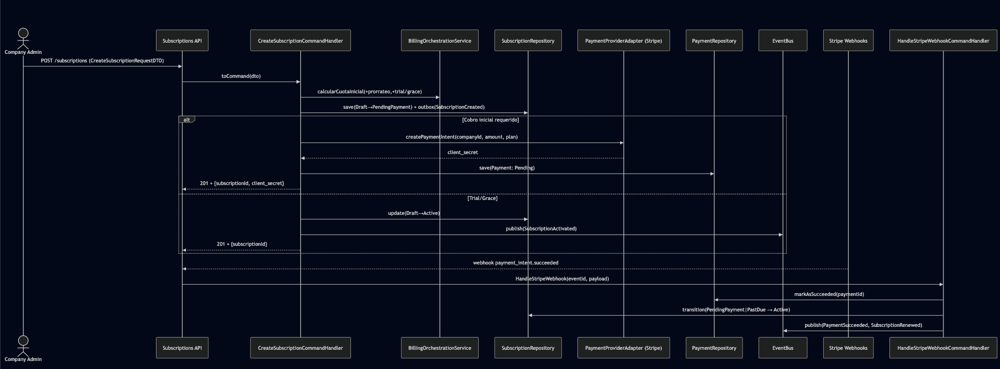
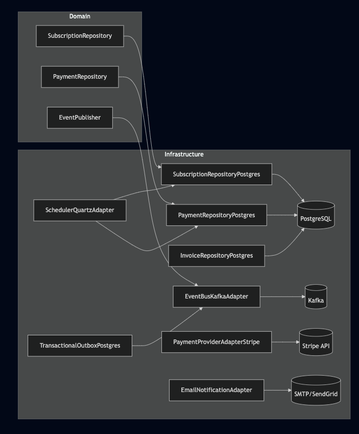
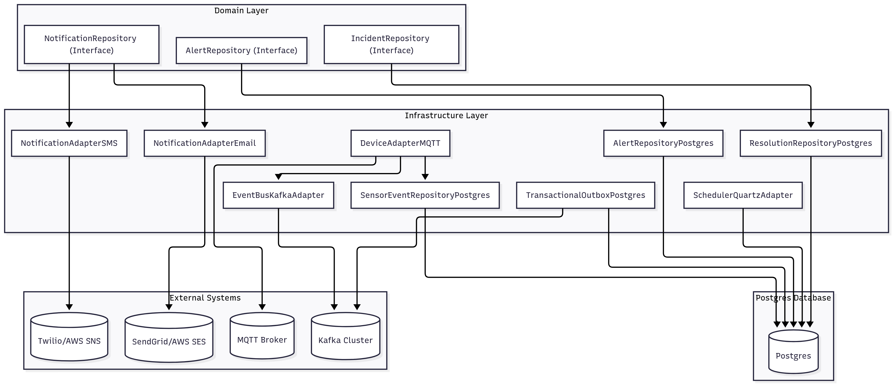

<div style="text-align: center">
  <p align="center">
    <br />
    
    <br />
    <strong>Universidad Peruana de Ciencias Aplicadas</strong>
    <br /><br />
    <strong>Carrera de ingeniería de Software</strong>
    <br /><br />
    <strong>Ciclo 202520</strong>
    <br /><br />
    1ASI0572 - Desarrollo de Soluciones IOT
    <br /><br />
    <strong>NRC:</strong> 3443 <br /><br />
    <strong>Profesor:</strong> Velásquez Núñez, Angel Augusto <br /><br />
    <strong>Informe de Trabajo Final</strong>
  </p>

  <div style="width: 80%; margin: 0 auto; text-align: center">
    <p>
      <strong>Startup:</strong> Los Parkers 
      <br />
      <strong>Producto:</strong> Macetech
    </p>

  <div>
      <strong>Relación de integrantes</strong>
      <br /><br />
      <table style="width: 60%; margin: 0 auto;   text-align: left">
        <thead>
          <tr>
            <th>Código</th>
            <th>Nombre</th>
          </tr>
        </thead>
        <tbody>
          <tr>
            <td>u20201c410</td>
            <td>Garro Vega, Marcelo Fabian</td>
          </tr>
          <tr>
            <td>u202113324</td>
            <td>Sanchez Ignacio, Jefrey Martin</td>
          </tr>
          <tr>
            <td>u...</td>
            <td>Apellidos, Nombres</td>
          </tr>
        </tbody>
      </table>
      <p style="text-align: center">
        <br />
        <strong>Agosto 2025</strong>
      </p>
    </div>

  </div>
</div>

---

# Capítulo I: Introducción

## 1.1. Startup Profile

### 1.1.1. Descripción de la Startup

### 1.1.2. Perfiles de integrantes del equipo

## 1.2. Solution Profile

### 1.2.1. Antecedentes y problemática

### 1.2.2. Lean UX Process

#### 1.2.2.1. Lean UX Problem Statements

#### 1.2.2.2. Lean UX Assumptions

#### 1.2.2.3. Lean UX Hypothesis Statements

#### 1.2.2.4. Lean UX Canvas

## 1.3. Segmentos objetivo

# Capítulo II: Requirements Elicitation & Analysis

## 2.1. Competidores

### 2.1.1. Análisis competitivo

### 2.1.2. Estrategias y tácticas frente a competidores

## 2.2. Entrevistas

### 2.2.1. Diseño de entrevistas

### 2.2.2. Registro de entrevistas

### 2.2.3. Análisis de entrevistas

## 2.3. Needfinding

### 2.3.1. User Personas

### 2.3.2. User Task Matrix

### 2.3.3. User Journey Mapping

### 2.3.4. Empathy Mapping

## 2.4. Big Picture EventStorming

## 2.5. Ubiquitous Language

# Capítulo III: Requirements Specification

## 3.1. User Stories

## 3.2. Impact Mapping

## 3.3. Product Backlog

# Capítulo IV: Solution Software Design

## 4.1. Strategic-Level Domain-Driven Design

### 4.1.1. Design-Level EventStorming

## 4.1.1.1 Candidate Context Discovery

Para esta etapa se llevó a cabo una sesión, la sesión tuvo una duración aproximada de 90 minutos y permitió identificar los bounded contexts del sistema CargaSafe. Durante el proceso se aplicaron las técnicas start-with-value, start-with-simple y look-for-pivotal-events, que facilitaron la agrupación de eventos y entidades según su afinidad y valor para el negocio.  

Como resultado, se identificaron ocho bounded contexts:  

- **Identity and Access Management**: administración de usuarios, autenticación y control de accesos.
- **Profiles and Preferences Management**: gestión de perfiles de usuario y configuración de preferencias.
- **Fleet management**: gestión de vehículos y dispositivos IoT.  
- **Execution of the trip**: creación y ejecución de viajes.  
- **Real-time monitoring**: monitoreo de condiciones en tiempo real.
- **Alerts and resolution**: generación de alertas. 
- **Visualization/Analytics**: visualización de métricas y reportes.  
- **Subscriptions and payments**: gestión de suscripciones y pagos con Stripe.  

  

### Leyenda utilizada en el EventStorming  
- 🟧 **Event**: describe algo que ocurrió en el dominio (Viaje iniciado, Alerta generada).  
- 🟦 **Command**: una instrucción o acción que dispara un evento (Registrar viaje).  
- 🟪 **Policy**: regla de negocio que determina qué ocurre ante ciertas condiciones (Si falta dispositivo → bloquear inicio del viaje).  
- 🟨 **Aggregate**: entidad principal que concentra datos y operaciones (Viaje, Suscripción).  
- 🟩 **UI**: vistas o pantallas del sistema que muestran información al usuario (Dashboard de KPIs).  
- ⚪ **Actor**: roles que interactúan con el sistema (Operador, Conductor).  
- ⬛ **Sistema externo**: integraciones con servicios de terceros (Google Maps, Stripe).  

Con esta estructura, el EventStorming permitió organizar y simplificar el dominio de CargaSafe, evidenciando de forma clara los contextos candidatos y la interacción entre actores, procesos y sistemas externos.  

[Ver gráfico en Miro](https://miro.com/app/board/uXjVJMskjeA=/?share_link_id=697373503273)

#### 4.1.1.2. Domain Message Flows Modeling

En esta etapa se desarrolló el **modelado de flujos de mensajes de dominio (Domain Message Flows)** con el objetivo de visualizar cómo colaboran los bounded contexts identificados en el Candidate Context Discovery para resolver los principales casos de negocio del sistema CargaSafe.  

Para la construcción de estos flujos se aplicó la técnica de **Domain Storytelling**, la cual permite describir las interacciones en un lenguaje natural, mostrando cómo un evento generado en un bounded context desencadena comandos o nuevos eventos en otros contextos. De este modo se logra una visión clara de la cooperación entre módulos y del ciclo de vida de la información dentro de la plataforma.  

### Historias de dominio (Domain Stories)

1. **Gestión de identidad y perfiles**  
   - Cuando un *usuario se registra* en **Identity and Access Management**, se genera un evento que es consumido por **Profiles and Preferences**, el cual crea automáticamente el perfil asociado.  
   - Si un *usuario edita sus preferencias*, se guarda la configuración en **Profiles**, y en caso de referirse a notificaciones, estas se utilizan en **Alerts** para personalizar los canales de envío.  

2. **Control de acceso y suscripciones**  
   - Cuando un *pago es procesado exitosamente* en **Subscriptions & Billing**, se envía un evento a **Identity and Access Management**, que habilita el acceso al sistema.  
   - Si un *pago falla*, el mismo flujo comunica a IAM que debe restringir o bloquear el acceso del usuario hasta regularizar su situación.  

3. **Gestión de flota y ejecución de viajes**  
   - Al *registrarse un vehículo o dispositivo IoT* en **Fleet Management**, este queda disponible para **Trip Management**, que puede asignarlo a un viaje planificado.  
   - Cuando un *operador crea e inicia un viaje* en **Trip Management**, se emite un evento que da origen a una sesión de monitoreo en **Monitoring**.  

4. **Monitoreo en tiempo real y alertas**  
   - **Monitoring** recibe continuamente *lecturas de sensores* (temperatura, ubicación, señal). Si se detecta una condición fuera de rango, se genera un evento que es consumido por **Alerts**.  
   - **Alerts** crea la alerta correspondiente y la notifica a los usuarios, aplicando las preferencias definidas en **Profiles** (por ejemplo, envío por SMS, correo o notificación push).  

5. **Analítica y reportes**  
   - Cada *alerta generada o reconocida* en **Alerts** actualiza los indicadores en **Dashboard & Analytics**, alimentando las métricas de cumplimiento y los reportes de incidentes.  
   - Cuando **Dashboard & Analytics** genera un *reporte final*, este puede personalizarse de acuerdo con las preferencias almacenadas en **Profiles**, permitiendo al usuario recibir información ajustada a su rol o necesidades.
  


### Resultados

Los flujos de mensajes de dominio evidencian la cooperación entre los ocho bounded contexts de CargaSafe:  
- **Identity and Access Management**  
- **Profiles and Preferences Management**  
- **Fleet Management**  
- **Execution of the trip**  
- **Real-time monitoring**  
- **Alerts and resolution**  
- **Visualization/Analytics**  
- **Subscriptions and payments**

Este ejercicio permitió comprender cómo un evento local en un contexto puede impactar en otros, asegurando la trazabilidad del negocio y la correcta interacción entre los distintos módulos de la solución.


#### 4.1.1.3. Bounded Context Canvases

En esta sección se elaboraron los Bounded Context Canvases de CargaSafe para los ocho contextos identificados. El objetivo fue delimitar con precisión responsabilidades, lenguaje ubicuo y decisiones de negocio, además de explicitar las comunicaciones (Queries, Commands y Events) y colaboradores (otros BC, sistemas externos y frontend). Cada canvas documenta: Descripción, Clasificación estratégica (core/supporting/generic), Rol de dominio (draft/execution/analysis/gateway), Inbound/Outbound communication, Ubiquitous Language, Business Decisions y Collaborators. Esta definición fija ownership de datos, reduce ambigüedades y prepara los contratos de integración que se implementarán en APIs y mensajería.


[Ver gráfico en Miro](https://miro.com/app/board/uXjVJJ2PHqk=/?share_link_id=762570504671)

### 4.1.2. Context Mapping

En esta etapa se construyó el **Context Map** de CargaSafe con los ocho bounded contexts identificados. El objetivo fue representar las **relaciones estructurales** entre ellos aplicando patrones de Domain-Driven Design como Customer/Supplier, Conformist y Anti-Corruption Layer (ACL).  

### Resultado
El mapa final permitió:
1. **Visualizar las dependencias entre contextos**, mostrando qué módulos proveen información y cuáles la consumen.  
2. **Identificar los contextos core** (Trip Management, Monitoring, Alerts), los de soporte (Fleet, Profiles, Analytics) y los genéricos (IAM, Billing).  
3. **Clasificar las relaciones**:  
   - Customer/Supplier en la mayoría de flujos operativos (Billing → IAM, Trip → Monitoring, Monitoring → Alerts).  
   - Conformist en el consumo de datos por Analytics.  
   - Anti-Corruption Layer en la interacción Analytics → Profiles.  

De esta manera, el Context Mapping consolida una visión global del sistema, mostrando cómo los distintos contextos colaboran para dar soporte al negocio.


### 4.1.3. Software Architecture

#### 4.1.3.1. Software Architecture System Landscape Diagram

El **System Landscape Diagram** ofrece una visión de alto nivel del **ecosistema empresarial** en el que se integra CargaSafe. Este diagrama no se centra únicamente en un sistema, sino que representa **todas las personas y sistemas de software relevantes**, tanto internos como externos, que participan en la operación logística.

### Propósito
El objetivo de este diagrama es:
1. Mostrar el alcance de la organización y cómo conviven sus distintos sistemas.  
2. Identificar a las **personas, sistemas internos, SaaS externos y proveedores** que colaboran en la cadena de valor.  
3. Resaltar cómo **CargaSafe (SaaS)** se conecta dentro de este panorama, en interacción con otros actores y servicios.


### Elementos incluidos
- **Personas**: Company Operator, Driver and End Customer.  
- **Sistemas internos**: Logistics Planning and Power BI Data.  
- **Sistemas y proveedores externos**: CargaSafe (SaaS), Stripe, Google Maps, Notification Services e IoT Devices (sensors).  
- **Grupos**: Se organizaron en cuatro dominios principales:  
  - Logistics company
  - Field / Devices
  - Customers and Regulators
  - SaaS and Vendors

### Relaciones principales
- Logistics Planning → CargaSafe (SaaS): exporta planes y asignaciones de viaje.
- IoT Devices → CargaSafe (SaaS): envía telemetría (temperatura, humedad, vibración, volcado/inclinación, GPS, energía/baterías).
- CargaSafe (SaaS) → Google Maps: consulta rutas y tiempos estimados.
- CargaSafe (SaaS) → Notification Services: envía alertas a los usuarios.
- CargaSafe (SaaS) → Stripe: procesa pagos de suscripción.
- CargaSafe (SaaS) → Power BI Data: exporta datasets consolidados para analítica.
- Company Operator / Driver ↔ CargaSafe (SaaS): planifican, ejecutan y reportan el estado operativo.
- End customer ← CargaSafe (SaaS): consulta estado y recibe reportes. 

### Resultado
El diagrama muestra a CargaSafe (SaaS) como el núcleo de integración entre operaciones (Company Operator, Driver, Logistics Planning), telemetría IoT (sensores en campo) y servicios externos (ruteo, notificaciones y pagos), además de su aporte a la inteligencia de negocio mediante Power BI Data. Esta representación proporciona una visión clara e integral de las dependencias y colaboraciones que sustentan la operación logística y la gestión de la cadena de frío.


#### 4.1.3.2. Software Architecture Context Level Diagrams

El **Context Diagram** de CargaSafe muestra una visión de alto nivel del sistema y de cómo se relaciona con los actores humanos y los sistemas externos que lo rodean. 


En el centro se ubica CargaSafe (SaaS), que representa el sistema principal encargado del monitoreo de la cadena de frío, la trazabilidad y la generación de alertas en los viajes logísticos.

Alrededor del sistema se identifican los siguientes actores:
- *Company Operator*: gestiona viajes, flota y reportes desde la plataforma.
- *Driver*: completa viajes y reporta información desde la aplicación móvil.
- *End customer*: recibe enlaces de estado, alertas y reportes generados por el sistema.

Asimismo, se destacan las interacciones con sistemas externos que complementan las funcionalidades de CargaSafe:

- Google Maps: provee rutas, geocodificación y cálculo de ETA.
- Firebase Cloud Messaging: entrega notificaciones push.
Stripe: procesa pagos y facturación de suscripciones.
Este diagrama permite visualizar de manera clara las responsabilidades de cada actor y sistema, y cómo CargaSafe se convierte en el núcleo que articula la comunicación entre usuarios, dispositivos IoT y servicios externos, garantizando la operación eficiente y segura de la cadena logística.


#### 4.1.3.2. Software Architecture Container Level Diagrams

En esta parte expandimos el sistema **CargaSafe (SaaS)** para mostrar sus contenedores internos, las tecnologías que utilizamos y cómo se comunican entre sí y con los sistemas externos.


El diagrama de contenedores muestra cómo se organiza internamente CargaSafe (SaaS) y cómo se relaciona con los actores y sistemas externos.

Dentro de la plataforma tenemos varios contenedores:

- *Landing Page:* sitio público que sirve para marketing y como punto de acceso, redirigiendo tanto a la Web App, al Single Web como a la Mobile App (descarga o deeplinks).
- *Web Frontend:* aplicación usada por los operadores para gestionar viajes, flota y reportes.
- *Single Web:* vista pública en línea donde los clientes finales pueden consultar estados y reportes sin necesidad de autenticarse.
- *Mobile App:* aplicación móvil para los conductores, con soporte offline-first. Se conecta a su propia base de datos embebida SQLite para cache y operación sin conexión.
- *Backend API:* núcleo de la lógica de negocio, responsable de gestionar viajes, monitoreo, alertas y suscripciones.
- *Relational Database (PostgreSQL):* base de datos principal donde se almacenan usuarios, vehículos, dispositivos, viajes, telemetría, alertas y suscripciones.
- *Edge Application (Python):* agente que corre en instalaciones o vehículos, con capacidad de procesamiento local, cache y sincronización confiable con el backend. Usa su propia Edge Database local para tolerar desconexiones.
- *Embedded Application (C++):* componente ligero que corre en dispositivos restringidos, captura datos y los envía hacia la aplicación edge para su posterior sincronización.

Los actores principales interactúan con los contenedores:
- Company Operator usa la Web App para planificar y supervisar operaciones.
- Driver utiliza la Mobile App para recibir instrucciones y reportar estado de los viajes.
- End Customer accede tanto a la Single Web (para reportes públicos) como a la Mobile App (para recibir notificaciones y links de estado).

Además, CargaSafe se integra con varios sistemas externos:
- *Google Maps*: para rutas, geocodificación y cálculo de ETA.
- *Stripe*: para pagos y facturación de suscripciones.
- *Firebase Cloud Messaging (FCM)*: para notificaciones push hacia aplicaciones móviles y web.
En conjunto, el diagrama muestra cómo CargaSafe se estructura en contenedores especializados que soportan las necesidades de operadores, conductores y clientes, asegurando tanto la operación online como offline en distintos puntos de la cadena logística.


#### 4.1.3.3. Software Architecture Deployment Diagrams

El Deployment Diagram de CargaSafe muestra cómo se despliega la solución en un entorno de producción real, representando los nodos de infraestructura, los contenedores de software y las interacciones entre ellos.


**Clientes:**
- Los usuarios finales acceden desde navegadores web, donde la Landing Page y el Web Frontend se sirven por separado desde CDNs independientes (CloudFlare/AWS CloudFront) para optimizar la entrega de contenido.
- Los conductores utilizan una aplicación móvil Flutter en dispositivos Android/iOS, que incluye una base de datos SQLite local para almacenamiento offline y sincronización de datos.
- Todas las peticiones de API se realizan mediante HTTPS y son redirigidas hacia el Load Balancer, encargado de enrutar el tráfico hacia los servicios backend.

**Backend y orquestación**
- El Backend API (Spring Boot) se despliega dentro de un Kubernetes Cluster en múltiples pods de aplicaciones para alta disponibilidad y escalabilidad.
- El backend centraliza la lógica de negocio, gestiona operaciones de viajes, monitoreo de cadena de frío y orquestación de alertas en tiempo real.

**Base de datos**
- El sistema utiliza una base de datos PostgreSQL gestionada (AWS RDS/Google Cloud SQL), con una instancia primaria para operaciones de escritura y réplicas de solo lectura para consultas distribuidas y balanceo de carga.
- Los dispositivos móviles mantienen datos críticos localmente en SQLite para funcionamiento offline durante los viajes.

**Integraciones externas**
El backend consume servicios de terceros para extender sus capacidades:
- Google Maps para rutas, geocodificación y cálculo de ETA en tiempo real.
- Stripe para procesamiento de pagos y facturación de subscripciones.
- Firebase Cloud Messaging (FCM) para la entrega de notificaciones push directamente a los dispositivos móviles de los conductores.

**Resultado**
El diagrama de despliegue muestra que la solución CargaSafe está organizada bajo una arquitectura cloud-native optimizada, con:
- Separación de responsabilidades: Landing page y aplicación web servidas independientemente
- Capacidades offline: Base de datos local SQLite en dispositivos móviles
- Kubernetes para la orquestación de contenedores del backend
- CDNs separados para optimizar la entrega de contenido estático
- Base de datos gestionada con réplicas para mejorar el rendimiento y disponibilidad
- Notificaciones push nativas a través de FCM

Esta infraestructura permite un sistema escalable, resiliente y con capacidades offline críticas para la operación de conductores en campo, garantizando la continuidad operativa en la gestión de la cadena de frío incluso sin conectividad permanente.

## 4.2. Tactical-Level Domain-Driven Design

### 4.2.1. Bounded Context: `<Bounded Context Name>`

#### 4.2.1.1. Domain Layer

Responsabilidad: Ingestar y evaluar telemetría (temperatura/GPS/humedad) contra políticas de cadena de frío, generando eventos de dominio para Alertas y resolución y alimentando Visualización/Analytics.

**Agregados y Entidades**

 - Sensor (AR): identidad del dispositivo y estado operativo (online/offline, última calibración).

 - SensorTripBinding: historial de asociación sensor↔viaje (permite auditoría y replay).

 - TelemetryReading: lectura puntual (time-series); modelada como entidad inmutable.

 - DeviceStatus: snapshot operativo (batería, señal, último heartbeat).

**Value Objects** 
 - TemperatureCelsius
 - GeoPoint
 - Thresholds (min/max/hysteresis)
 - TimeWindow

**Servicios de Dominio**
  - EvaluationService: reglas de evaluación (ventanas, anti-ruido, histeresis) → emite eventos.

  - BindingService: lógica para bind/unbind de sensores a viajes.

**Eventos de Dominio**
  - TelemetryReceived
  - TemperatureOutOfRange
  - DeviceOffline
  - GeofenceBreach
  - TimeseriesUpdated (para vistas)

**Repositorios**

  - TelemetryRepository
  - DeviceStatusRepository 
  - SensorBindingRepository 
  - SensorRepository


**Políticas/Reglas Clave**

  - Frecuencia mínima de muestreo por plan
  - Tolerancias por producto
  - Ventana de evaluación deslizante
  - Reconciliación de lecturas offline.


**Diagrama de clases (dominio)**  

#### 4.2.1.2. Interface Layer

**Entradas (adapters)**

  - **HTTP Ingestion API:** POST /ingest/telemetry (API-Key/JWT por tenant).

  - **MQTT**: tópico devices/{sensorId}/telemetry para ingesta directa desde edge.

  - **Queries**: 
    - GET /live-status?sensorId= 
    - GET /telemetry?tripId=&from=&to= (paginado por tiempo).

**Salidas (pub/sub y notificaciones)**

  - **Events a Alertas y resolución:** 
    - TemperatureOutOfRange 
    - DeviceOffline 
    - GeofenceBreach

  - **Events a Visualización/Analytics:** 
    - TimeseriesUpdated

**DTOs principales**
  - TelemetryInDTO{ sensorId, ts, tempC, humidityPct, lat, lon, raw } 
  - LiveStatusDTO{ sensorId, lastSeen, batteryPct, signalDbm, tripId }


#### 4.2.1.3. Application Layer

**Command Handlers**

- IngestTelemetryCommandHandler: Valida TelemetryInDTO, persiste lectura (y outbox), emite TelemetryReceived.

- BindSensorToTripCommandHandler: Gestiona historia de bind/unbind y emite SensorBoundToTrip.

- EvaluateTelemetryCommandHandler: Usa EvaluationService (ventana + histéresis) y publica TemperatureOutOfRange | DeviceOffline | GeofenceBreach.

- UpdateDeviceStatusCommandHandler: Actualiza snapshot y cache en vivo.

**Event Handlers**

- TripStartedEventHandler: Precarga políticas/umbrales activos para la sesión del viaje.

- TelemetryReceivedEventHandler: Encadena evaluación y proyección a timeseries para vistas.

- PolicyUpdatedEventHandler: Refresca umbrales en memoria / caché.

**Application Services (capabilities)**

- LiveViewService — GetLiveStatus(sensorId) y cola corta de lecturas recientes.

- TimeseriesQueryService: Consulta paginada por rango {from,to}.

- AnomalyDetectionService: Hook para modelos (opt-in según plan).

**Transaccionalidad & resiliencia**

- Outbox + publicador para garantizar at-least-once de eventos.

- Idempotencia por (sensorId, ts).

- Sagas livianas para bind/unbind.

**Secuencia** 


[Ver gráfico en Mermaid](https://www.mermaidchart.com/app/projects/f9114f89-7e7c-4378-9a7e-53fc0436e622/diagrams/b984e287-826d-49b5-9eae-3e6cee59ba42/version/v0.1/edit)

#### 4.2.1.4. Infrastructure Layer

**Adapters / Implementaciones**

  - HttpIngestionController (REST)

  - MqttIngestionConsumer (tópico devices/{sensorId}/telemetry)

  - KafkaEventBus (tópicos: monitoring.alerts, monitoring.viz)

  - PostgresTelemetryRepository (TimescaleDB)

  - PostgresDeviceStatusRepository

  - PostgresSensorBindingRepository

  - RedisLiveCache (clave live:{sensorId} TTL corto)

  - OutboxPublisher (lee event_outbox y publica a Kafka)

**Cross-cutting**

  - RLS/tenancy por tenant_id, observabilidad (metrics/logs/traces). rate-limit, validación de payloads, DLQ.

#### 4.2.1.5. Bounded Context Software Architecture Component Level Diagrams

[Ver gráfico en Mermaid](https://www.mermaidchart.com/app/projects/f9114f89-7e7c-4378-9a7e-53fc0436e622/diagrams/2b56cea5-6f35-4228-b70e-2052df1785b7/version/v0.1/edit)

#### 4.2.1.6. Bounded Context Software Architecture Code Level Diagrams

##### 4.2.1.6.1. Bounded Context Domain Layer Class Diagrams


[Ver gráfico en Mermaid](https://www.mermaidchart.com/app/projects/f9114f89-7e7c-4378-9a7e-53fc0436e622/diagrams/da4a4688-bf70-4195-b82c-b3aee7598cde/version/v0.1/edit)


##### 4.2.1.6.2. Bounded Context Database Design Diagram


### 4.2.2. Bounded Context: *Subscriptions and Billing*

#### 4.2.2.1. Domain Layer

#### Entidades (Entities)

- **Subscription**: Representa el contrato activo de servicio de una empresa. Contiene información sobre plan, estado, fechas de inicio y expiración.
- **Payment**: Registra los pagos asociados a una suscripción, con monto, fecha, método y estado (exitoso o fallido).
- **Company**: Entidad que consume el servicio y a la cual se asigna la suscripción. Cada empresa tiene un plan activo y el límite de vehículos depende de ese plan.

#### Objetos de Valor (Value Objects)

- **Plan**: Define los límites de uso, costo y beneficios de cada suscripción. En este caso:
  - *Plan Básico*: hasta 2 vehículos.
  - *Plan Estándar*: hasta 5 vehículos.
  - *Plan Premium*: de 5 vehículos en adelante (sin límite superior).
- **BillingCycle**: Periodo de facturación (mensual, anual, etc.).
- **GracePeriod**: Tiempo adicional de tolerancia tras el vencimiento de pago (ej. 7 días).

#### Agregados (Aggregates)

- **SubscriptionAggregate**: Raíz que coordina las entidades Subscription, Payment y la relación con Company. Aplica las siguientes reglas:
  - Una empresa no puede registrar más vehículos de los permitidos por su plan.
  - Una suscripción no se activa sin un pago válido.
  - Se bloquea automáticamente el acceso tras fallar el pago y terminar el período de gracia.

#### Servicios de Dominio (Domain Services)

- **BillingService**: Calcula montos, aplica planes y valida períodos de gracia.
- **PaymentProcessingService**: Coordina la recepción de eventos de Stripe (PaymentSucceeded, PaymentFailed) y actualiza el estado de la suscripción.

#### Fábricas (Factories)

- **SubscriptionFactory**: Construye nuevas suscripciones con valores iniciales (plan, ciclo de facturación, empresa asociada).

#### Repositorios (Interfaces)

- **SubscriptionRepository**: Abstracción para acceder y persistir datos de suscripción.
- **PaymentRepository**: Abstracción para manejar registros de pagos.

#### Reglas Clave (Business Rules)

- Plan Básico: máximo 2 vehículos por empresa.
- Plan Estándar: máximo 5 vehículos por empresa.
- Plan Premium: de 5 vehículos en adelante (sin límite superior).
- Período de gracia de 7 días para regularizar pagos antes de bloquear acceso.
- Bloqueo automático de acceso si no se recibe pago válido después del período de gracia.


#### 4.2.2.2. Interface Layer

Aquí se definen **Controllers (REST)**, **Consumers (mensajería/webhooks)**, **DTOs asociados**, además de políticas de validación, errores y seguridad.

# A. Controllers (REST — Spring Web)

### SubscriptionController  
**Base path:** `/api/v1/billing/subscriptions`

|Método|Ruta|Descripción|Request DTO|Response DTO|Código HTTP|
|---|---|---|---|---|---|
|POST|/|Crea suscripción para una empresa y plan|CreateSubscriptionRequestDTO|SubscriptionDTO|201 Created|
|POST|/{subscriptionId}/cancel|Cancela la suscripción al final del ciclo o inmediata según política|—|SubscriptionDTO|200 OK|
|GET|/{subscriptionId}|Obtiene detalle de la suscripción|—|SubscriptionDTO|200 OK|
|GET|/by-company/{companyId}|Retorna la suscripción activa de la empresa|—|SubscriptionDTO|200 OK|
|PATCH|/{subscriptionId}/plan|Cambia de plan (prorrateo si aplica)|ChangePlanRequestDTO|SubscriptionDTO|200 OK|

### PlanController  
**Base path:** `/api/v1/billing/plans`

|Método|Ruta|Descripción|Request DTO|Response DTO|Código HTTP|
|---|---|---|---|---|---|
|GET|/|Lista planes (Básico, Estándar, Premium)|—|Listado de planes|200 OK|
|GET|/{planCode}|Obtiene detalle de un plan específico|—|PlanDTO|200 OK|

### PaymentController  
**Base path:** `/api/v1/billing/payments`

|Método|Ruta|Descripción|Request DTO|Response DTO|Código HTTP|
|---|---|---|---|---|---|
|POST|/intent|Inicia pago vía Stripe, front usa clientSecret|CreatePaymentIntentRequestDTO|PaymentIntentDTO|200 OK|
|GET|/{paymentId}|Obtiene detalle de un pago|—|PaymentDTO|200 OK|
|GET|/by-subscription/{subscriptionId}|Lista pagos asociados a una suscripción|—|Listado de pagos|200 OK|

### CompanyAccessController
**Base path:** `/api/v1/billing/access`

|Método|Ruta|Descripción|Request DTO|Response DTO|Código HTTP|
|---|---|---|---|---|---|
|GET|/company/{companyId}/status|Obtiene estado de acceso (BLOCKED/UNBLOCKED y motivo)|—|AccessStatusDTO|200 OK|
|POST|/company/{companyId}/unblock|Desbloqueo manual (solo rol autorizado; auditable)|—|-|200 OK|

# B. Consumers (Webhooks / Mensajería)

### StripeWebhookController 
**Base path:** `/api/v1/billing/webhooks/stripe`  
*Endpoint público*

|Método|Ruta|Descripción
|---|---|---|
|POST|/events|Recibe y procesa eventos Stripe:

- payment_intent.succeeded → PaymentSucceeded
- payment_intent.payment_failed → PaymentFailed
- customer.subscription.created → sincroniza SubscriptionCreated
- customer.subscription.updated / ...deleted → reflejo de cambios/cancelación

Respuesta: 2xx si se aceptó (idempotente por eventId).

### IamConsumer (mensajería interna, ej. Kafka/RabbitMQ)
**Base path:** `/api/v1/billing/access`

|Topic|Acción|
|---|---|
|iam.company.created|Crea o espeja Company mínima para asociar suscripción|
|iam.company.deactivated|Bloquea acceso o marca para cancelación al cierre de ciclo|

### DomainEventsPublisher (salida)

Publica eventos a otros Bounded Contexts:
- `billing.subscription.created`
- `billing.subscription.plan.changed`
- `billing.company.access.blocked`
- `billing.company.access.unblocked`

# C. DTOs (principales)

|DTO|Campos Principales|
|---|---|
|CreateSubscriptionRequestDTO|companyId (UUID), planCode (ENUM: BASIC|
|SubscriptionDTO|/id, companyId, planCode, status (ACTIVE|
|ChangePlanRequestDTO|newPlanCode, effectiveAt (IMMEDIATE|
|CreatePaymentIntentRequestDTO|subscriptionId, amountCents, currency (ISO), paymentMethodType (e.g., CARD)|
|PaymentIntentDTO|paymentIntentId, clientSecret, status|
|PaymentDTO|id, subscriptionId, amountCents, currency, status (SUCCEEDED|  

Nota: vehicleLimit se deriva del plan: Básico=2, Estándar=5, Premium=5+ (sin tope).

# D. Validación y reglas en la interfaz

##### Plan vs. límite de vehículos:
Al crear o cambiar plan, responder 422 Unprocessable Entity si el número de vehículos registrados por la empresa supera el límite del plan destino.

##### Idempotencia:
Encabezado Idempotency-Key obligatorio en POST /subscriptions y POST /payments/intent.

##### Webhook safety:
Verificación de firma Stripe; rechazo 400/401 si inválida; deduplicación por eventId.

# E. Errores (contratos comunes)

|Código HTTP|Descripción|
|---|---|
|400|Bad Request — validación de DTOs|
|401 / 403|Unauthorized / Forbidden — autenticación/roles|
|404|Not Found — subscriptionId, companyId, paymentId inexistentes|
|409|Conflict — cambios concurrentes en suscripción/plan|
|422|Unprocessable Entity — violación de políticas (ej. límite de vehículos por plan)|
|503|Service Unavailable — dependencia externa (Stripe) no disponible|

# F. Seguridad y políticas

- **AuthN/AuthZ**: JWT (OAuth2/OIDC). Scopes sugeridos: `billing:read`, `billing:write`, `billing:manage-access`.
- **Multi-tenant**: encabezado `X-Tenant-Id` (o `companyId` en path) con control de acceso por tenant.
- **Rate limiting**: endpoints públicos (webhooks) y de creación de intentos de pago.
- **API Versioning**: prefijo `/api/v1/....`
- **Observabilidad**: trazas con `X-Request-Id`, métricas por endpoint, auditoría en cambios de plan/acceso.

# G. Contratos de ejemplo (OpenAPI sketch)
``` 
paths:
  /api/v1/billing/subscriptions:
    post:
      summary: Create Subscription
      operationId: createSubscription
      requestBody:
        $ref: '#/components/requestBodies/CreateSubscriptionRequest'
      responses:
        '201':
          $ref: '#/components/responses/Subscription'
        '422':
          $ref: '#/components/responses/BusinessRuleViolation'

  /api/v1/billing/webhooks/stripe/events:
    post:
      summary: Stripe Webhook
      operationId: stripeWebhook
      responses:
        '200':
          description: Accepted
``` 

#### 4.2.2.3. Application Layer

La capa expone capabilities transaccionales y garantiza idempotencia, consistencia eventual y reintentos seguros frente a fallos de infraestructura.

## Command Handlers

*CreateSubscriptionCommandHandler*
- Valida CreateSubscriptionRequestDTO.
- Invoca SubscriptionFactory y BillingService (prorrateo/grace).
- Persiste aggregate + outbox (SubscriptionCreated).
- Si requiere cobro inicial: inicia PaymentIntent (Stripe) vía PaymentProviderAdapter.

*ChangePlanCommandHandler*
- Verifica elegibilidad (límite de vehículos, prorrateo, downgrade rules).
- Recalcula ciclo y cargos (crédito/débito prorrateado).
- Persiste cambios + outbox (PlanChanged).

*CancelSubscriptionCommandHandler*
- Soporta cancel_at_period_end | immediate.
- Aplica reglas de gracia y bloqueo.
- Persiste + outbox (SubscriptionCanceled).

*RecordPaymentCommandHandler*
- Registra intento/confirmación de pago iniciada desde UI Admin (sin Webhook).
- Actualiza Payment + Subscription (Active/PastDue → Active).
- Emite PaymentRecorded | SubscriptionRenewed (según caso).

*HandleStripeWebhookCommandHandler*
- Normaliza eventos (payment_intent.succeeded/failed, charge.refunded, invoice.paid).
- Idempotencia por (eventId).
- Publica eventos de dominio (PaymentSucceeded, PaymentFailed, PaymentRefunded).

*RenewSubscriptionCommandHandler*
- Dispara ciclo de facturación (programado o manual).
- Genera Invoice/PaymentIntent; transición a Active/PastDue.
- Emite SubscriptionRenewed | SubscriptionPastDue.

*BlockCompanyAccessCommandHandler / UnblockCompanyAccessCommandHandler*
- Aplica políticas de bloqueo (grace expirado, deuda).
- Sincroniza con IAM (CompanyAccessController vía Application).
- Emite CompanyBlocked | CompanyUnblocked.

*IssueRefundCommandHandler*
- Valida condiciones (ventana de reembolso, policy del plan).
- Orquesta refund en Stripe y estado de Payment.
- Emite PaymentRefunded.

## Event Handlers

*SubscriptionCreatedEventHandler*
- Provisiona límites de plan (vehículos) y prepara primer ciclo.
- Puede iniciar "trial/grace" según configuración.

*PaymentSucceededEventHandler*
- Marca Payment como settled y la Subscription como Active.
- Limpia flags de deuda, publica DomainEvent: SubscriptionInGoodStanding.

*PaymentFailedEventHandler*
- Incrementa retry_count y programa reintento exponencial.
- Transición a PastDue; si excede política → Blocked; emite SubscriptionPastDue.

*PlanChangedEventHandler*
- Recalcula cuota pro-rata y ajusta renovaciones futuras.
- Actualiza snapshots de acceso (CompanyAccess).

*InvoiceGeneratedEventHandler*
- Dispara envío de comprobante/boleta (integración fiscal si aplica).
- Publica InvoiceSent (para notificaciones).

*SubscriptionCanceledEventHandler*
- Revoca accesos al final del ciclo o inmediato.
- Detiene jobs/schedulers de renovación.
  
## Application Services (Capabilities)

*BillingOrchestrationService*
- Cálculo prorrateos, trial/grace, tax/IGV, redondeos y cupones.
- Interfaz anti-corrupción con Domain BillingService.

*PaymentApplicationService*
- Abstracción de Stripe (PaymentProviderAdapter).
- Gestión de PaymentIntent, captura, reintentos y refunds.

*RenewalService*
- Lote diario de renovaciones (scheduler).
- Política de reintentos (exponencial con jitter) y ventana de gracia.

*AccessControlSyncService*
- Sincroniza estado de Subscription con IAM (bloqueo/desbloqueo a nivel compañía).
- Cache de snapshot para consultas rápidas (GetCompanyAccessStatus).

*QueryServices (lectura)*
- SubscriptionQueryService: por companyId, estado, plan, próximos vencimientos.
- PaymentQueryService: estado, rango temporal, conciliación.
- InvoiceQueryService: por ciclo, por compañía, por estado fiscal.

## Transaccionalidad & Resiliencia

*Outbox + Publisher*
- Todo cambio relevante de Aggregate escribe en outbox (at-least-once).
- Publicador asíncrono con deduplicación por (aggregateId, version).

*Idempotencia*
- Clave idempotente por (companyId, externalReference) para comandos desde UI.
- Webhooks Stripe: idempotencia por eventId.

*Reintentos y Sagas*
- Reintentos de cobro con backoff exponencial (configurable por plan).
- Sagas livianas: ChangePlan (prorrateo + ajuste de límites + cobro), Refund (Stripe → dominio).

*Consistencia*
- Estados permitidos por diagrama (Draft → Active → PastDue → Blocked → Canceled).
- Regla: no se desbloquea si existe deuda abierta o retry pendiente.



#### Explicación del Diagrama

El diagrama de secuencia muestra el flujo completo del caso de uso **“Alta de suscripción con cobro inicial”** en el bounded context **Subscriptions & Billing**.

El proceso inicia cuando el **Company Admin** invoca la API de suscripciones, la cual transforma la solicitud en un comando y lo delega al **CreateSubscriptionCommandHandler**. Este orquesta el cálculo de la cuota inicial a través del **BillingOrchestrationService**, persiste el estado de la suscripción en el **SubscriptionRepository** y registra el evento de dominio en el **Transactional Outbox**.

En caso de requerir cobro inmediato, se genera un **PaymentIntent** en Stripe mediante el **PaymentProviderAdapter**, quedando el pago en estado *Pending*. Alternativamente, si aplica un período de prueba o gracia, la suscripción transiciona directamente a estado *Active*.

Posteriormente, Stripe notifica el resultado del pago a través de un webhook. Este es procesado por el **HandleStripeWebhookCommandHandler**, que actualiza los repositorios de pagos y suscripciones, y publica eventos de dominio (**PaymentSucceeded**, **SubscriptionRenewed**) en el **EventBus**. Dichos eventos permiten la sincronización con otros bounded contexts, como el de control de accesos.


#### 4.2.2.4. Infrastructure Layer

## Componentes principales

*SubscriptionRepositoryPostgres*
- Implementación concreta de SubscriptionRepository.  
- Gestiona persistencia de suscripciones en PostgreSQL (estado, ciclo, plan).  
- Uso de ORM/SQL (ej. Hibernate/JPA o Dapper) con versionado optimista.  

*PaymentRepositoryPostgres*  
- Implementación concreta de PaymentRepository.  
- Registra intentos, confirmaciones y reembolsos de pagos.  
- Persiste referencias externas (Stripe payment_intent_id).  

*InvoiceRepositoryPostgres*  
- Permite almacenar facturas emitidas, estados fiscales y comprobantes electrónicos.  
- Relación con SubscriptionId y PaymentId.  

*PaymentProviderAdapterStripe*  
- Patrón Adapter sobre el SDK de Stripe.  
- Normaliza operaciones de creación de PaymentIntent, confirmación y reembolso.  
- Maneja idempotencia por eventId y errores de red.  

*TransactionalOutboxPostgres*  
- Tabla outbox asociada a transacciones de dominio.  
- Worker/scheduler lee eventos confirmados y los publica en EventBus.  
- Garantiza “at-least-once delivery” y evita inconsistencias entre DB y mensajería.  

*EventBusKafkaAdapter*  
- Implementación concreta de DomainEventPublisher.  
- Publica mensajes en tópicos Kafka (ej. `subscriptions`, `payments`).  
- Maneja serialización JSON/Avro y control de particiones.  

*SchedulerQuartzAdapter*  
- Agenda tareas recurrentes (ej. batch de renovaciones a las 03:00 AM).  
- Administra reintentos en cascada (exponencial con jitter).  
- Encapsula lógica técnica fuera del dominio.  

*EmailNotificationAdapter*  
- Integración con servicio SMTP o API externa (SendGrid, AWS SES).  
- Envío de comprobantes, alertas de pago fallido y avisos de bloqueo.  



#### Explicación del Diagrama

El diagrama de infraestructura muestra la forma en que el bounded context **Subscriptions & Billing** implementa las interfaces definidas en el **Domain Layer** y las conecta con servicios externos. De este modo, se evidencia la aplicación de patrones de diseño como **Repository** y **Adapter**, garantizando un bajo acoplamiento entre la lógica de negocio y la infraestructura técnica.

Los repositorios (`SubscriptionRepositoryPostgres`, `PaymentRepositoryPostgres`, `InvoiceRepositoryPostgres`) persisten el estado de las suscripciones, pagos e invoices en una base de datos **PostgreSQL**, asegurando versionado y consistencia de datos. A su vez, el `TransactionalOutboxPostgres` registra los eventos de dominio confirmados para luego ser publicados de manera confiable en **Kafka** a través del `EventBusKafkaAdapter`.

La integración con servicios externos se realiza mediante adaptadores específicos:  
- `PaymentProviderAdapterStripe` encapsula las operaciones de la API de **Stripe**.  
- `EmailNotificationAdapter` permite el envío de notificaciones por **SMTP/SendGrid**.  

Finalmente, el `SchedulerQuartzAdapter` administra procesos periódicos, como la renovación automática de suscripciones, apoyándose en los repositorios para garantizar la correcta ejecución de los ciclos de facturación.

#### 4.2.2.5. Bounded Context Software Architecture Component Level Diagrams

*Diagrama de componentes - Backend - Subscriptions and Billing*  


El backend del bounded context Subscriptions & Billing está formado por varios componentes que trabajan juntos: 
- Las APIs de suscripciones y consultas
- El Webhook de Stripe
- Worker de renovaciones

Todos ellos envían las solicitudes a la *Application Layer*, que se encarga de coordinar cada caso de uso y decidir qué reglas aplicar.

Las reglas de negocio viven en la Domain Layer, donde están las entidades y servicios principales. Para guardar la información usamos *Postgres*, y gracias a la **Transactional Outbox** podemos asegurarnos de que los mensajes se envíen de forma confiable hacia **Kafka (eventos de integración)** y **SendGrid (emails de facturación y avisos)**. La parte de pagos la maneja el *Stripe Adapter*, que conecta con Stripe sin que el dominio dependa directamente de él.

En resumen, la idea es tener responsabilidades bien separadas:
	•	Las APIs, el webhook y el worker reciben las peticiones.
	•	La capa de aplicación coordina el flujo.
	•	El dominio aplica las reglas de negocio.
	•	La infraestructura se encarga de guardar datos y comunicarse con sistemas externos.

*Diagrama de componentes - Application Web - Subscriptions and Billing*  

  

La aplicación web se conecta al bounded context **Subscriptions & Billing** únicamente a través de las APIs: la *Subscriptions API* (para enviar comandos como crear o cancelar una suscripción) y la *Query API* (para consultar datos como facturas o planes activos).

En el lado del cliente, la app se organiza en tres partes:
	•	**UI (interfaz de usuario)**: pantallas de suscripciones, facturación y pagos.
	•	**Estado de aplicación:** maneja la sesión del usuario, el cache de consultas y el control de autenticación.
	•	**Servicios de datos:** cliente HTTP que llama a las APIs, agrega el token de seguridad y gestiona reintentos o errores.
 
La aplicación web no implementa lógica de negocio propia, solo muestra la información y envía las intenciones del usuario al backend. Todo lo que es reglas, validaciones o persistencia está en el backend.

*Diagrama de componentes - Mobile Application - Subscriptions and Billing*  

  

La aplicación móvil de **Subscriptions & Billing** es muy parecido a la versión web, ya que también se conecta al backend por la *Subscriptions API* y la *Query API*. La diferencia es que en el móvil contamos con una base de datos local (SQLite), que nos permite trabajar en modo offline: la app guarda datos y puede seguir operando aunque no haya conexión, y luego sincroniza cuando vuelve el internet.

La app se organiza en pantallas de suscripciones y facturación, un estado de aplicación que maneja la sesión y el cache, y un API Client que envía las solicitudes al backend siempre agregando el token de autenticación. Toda la lógica de negocio sigue estando en el backend; en el cliente solo mostramos información y enviamos las acciones que hace el usuario.

#### 4.2.2.6. Bounded Context Software Architecture Code Level Diagrams

##### 4.2.2.6.1. Bounded Context Domain Layer Class Diagrams


##### Explicación del diagrama
El diagrama de clases del Domain Layer muestra a **Subscription** como *Aggregate Root*, con su ciclo de vida gestionado a través de estados (**SubscriptionStatus**) y la relación con múltiples Payment, cada uno asociado a su propio estado (**PaymentStatus**). Los Value Objects Plan y Money encapsulan reglas de negocio como límites de vehículos y montos monetarios. Asimismo, el modelo se apoya en la *SubscriptionFactory* para la creación controlada de agregados, en los *Repositories* para la persistencia de entidades y en el **PaymentProcessingService* para la integración con Stripe y la gestión de pagos. En conjunto, este diseño asegura encapsulamiento, consistencia e independencia tecnológica en el dominio.

##### 4.2.2.6.2. Bounded Context Database Design Diagram


##### Explicación del diagrama
Define la persistencia mínima y suficiente para gestionar compañías, suscripciones y pagos integrados con Stripe. La tabla companies centraliza la información de cada cliente. 
Sobre ella, la tabla *subscriptions* modela el ciclo de vida de la suscripción, incluyendo plan, estado y próxima renovación, con la restricción de que solo puede existir una suscripción activa por compañía. 
La tabla *payments* registra cada intento de cobro asociado a una suscripción, asegurando unicidad mediante el identificador del proveedor (provider_ref).
Finalmente, la tabla **stripe_webhook_events** almacena los eventos recibidos desde Stripe y se vincula con los pagos para garantizar trazabilidad e idempotencia en el procesamiento de transacciones.

### 4.2.3. Bounded Context: *Alerts & Resolution*

#### 4.2.3.1. Domain Layer

### Entidades (Entities)
- Alert: representa un evento crítico detectado (desvío de ruta, dispositivo desconectado, etc). Mantiene su estado (abierto, reconocido, cerrado) y registra su ciclo de vida.
- Notification: mensaje enviado al usuario a través de un canal (FCM, Email, SMS) para informar sobre una alerta.
- Incident: evento relacionado con un viaje que se crea a partir de una alerta. Contiene detalles adicionales para análisis y resolución.
### Objetos de Valor (Value Objects)
- AlertType: clasifica los tipos de alertas (OutOfRange, Offline, RouteDeviation).
- AlertStatus: define en qué etapa se encuentra la alerta (Open, Acknowledged, Closed).
- NotificationChannel: indica el medio de comunicación usado (Email, SMS, FCM).
- PersistenceWindow: define el tiempo mínimo que debe cumplirse para que un evento se considere válido como alerta.
- SensorType: clasifica la fuente de monitoreo (TEMPERATURE, HUMIDITY, VIBRATION, TILT, LOCATION, BATTERY).
### Agregados (Aggregates)
- AlertAggregate: conjunto que agrupa a la alerta con sus notificaciones e incidentes. Garantiza que todas las operaciones sobre alertas se hagan de manera coherente.
### Servicios de Dominio (Domain Services)
- AlertEscalationService: aplica reflas de escalamiento cuando una alerta no ha sido reconocida en el tiempo límite.
- NotificationService: selecciona los canales de notificación adecuados según las preferencias de usuario o empresa.
- DeduplicationService: previene la generación de alertas duplicadas mediante períodos de enfriamiento.
### Fábricas (Factories)
- AlertFactory: encapsula la lógica de creación de una alerta a partir de eventos recibidos (ejemplo: sensor fuera de rango).
- IncidentFactory: crea incidentes asociados a un viaje cuando una alerta lo requiere.
### Repositorios (Interfaces)
- AlertRepository: interfaz para guardar, actualizar y recuperar alertas.
- NotificationRepository: interfaz para manejar el historial y el estado de notificaciones.
- IncidentRepository: interfaz para registrar incidentes asociados a viajes
### Reglas Clave (Business Rules)
- Persistence Window: no se genera alerta hasta que la condición anómala se mantenga por cierto tiempo.
- No duplicación: no se permiten alertas repetidas durante un período de enfriamiento.
- Escalamiento: si una alerta no es reconocida en el tiempo condigurado, se aumenta su criticidad.
- Flujo de estados: una alerta solo puede cerrarse si fue previamente reconocida.
- Preferencias de notificación: el canal de comunicación depende de la configuración del usuario o de la compañía.
- Consistencia: toda alerta debe estar vinculada a un evento detectado en el sistema de monitoreo.

#### 4.2.3.2. Interface Layer
En esta capa se definen **Controllers (REST)**, **Consumers (mensajería/webhooks)**, los **DTOs asociados**, además de las **políticas de validación, errores y seguridad**.

# A. Controllers (REST — Spring Web)

### AlertController

**Base path:** `/api/v1/alerts`

| Método | Ruta                     | Descripción                                           | Request DTO             | Response DTO        | Código HTTP |
| ------ | ------------------------ | ----------------------------------------------------- | ----------------------- | ------------------- | ----------- |
| POST   | `/`                      | Crea una nueva alerta a partir de un evento detectado | `CreateAlertRequestDTO` | `AlertDTO`          | 201 Created |
| PATCH  | `/{alertId}/acknowledge` | Reconoce (ACK) una alerta activa                      | —                       | `AlertDTO`          | 200 OK      |
| PATCH  | `/{alertId}/close`       | Cierra una alerta reconocida                          | —                       | `AlertDTO`          | 200 OK      |
| GET    | `/{alertId}`             | Obtiene detalle de una alerta                         | —                       | `AlertDTO`          | 200 OK      |
| GET    | `/active`                | Lista alertas activas (estado OPEN o ACKNOWLEDGED)    | —                       | Lista de `AlertDTO` | 200 OK      |

### NotificationController

**Base path:** `/api/v1/notifications`

| Método | Ruta                    | Descripción                                        | Request DTO                        | Response DTO                 | Código HTTP |
| ------ | ----------------------- | -------------------------------------------------- | ---------------------------------- | ---------------------------- | ----------- |
| GET    | `/preferences/{userId}` | Obtiene preferencias de notificación de un usuario | —                                  | `NotificationPreferencesDTO` | 200 OK      |
| PATCH  | `/preferences/{userId}` | Actualiza preferencias de notificación             | `UpdateNotificationPreferencesDTO` | `NotificationPreferencesDTO` | 200 OK      |

### IncidentController

**Base path:** `/api/v1/incidents`

| Método | Ruta            | Descripción                                         | Request DTO                | Response DTO  | Código HTTP |
| ------ | --------------- | --------------------------------------------------- | -------------------------- | ------------- | ----------- |
| POST   | `/`             | Crea un incidente vinculado a una alerta y un viaje | `CreateIncidentRequestDTO` | `IncidentDTO` | 201 Created |
| GET    | `/{incidentId}` | Obtiene detalle de un incidente                     | —                          | `IncidentDTO` | 200 OK      |

# B. Consumers (Webhooks / Mensajería)

### MonitoringConsumer (entrada)

Procesa eventos entrantes de sistemas de monitoreo:

| Evento                   | Acción                                         |
| ------------------------ | ---------------------------------------------- |
| `OutOfRangeDetected`     | Genera nueva alerta tipo **OutOfRange**        |
| `DeviceOfflineDetected`  | Genera alerta por **dispositivo desconectado** |
| `RouteDeviationDetected` | Genera alerta por **desviación de ruta**       |

### DomainEventsPublisher (salida)

Publica eventos a otros Bounded Contexts:

* `alerts.alert.generated`
* `alerts.alert.acknowledged`
* `alerts.alert.closed`
* `alerts.incident.created`
* `alerts.notification.sent`

# C. DTOs (principales)

| DTO                                | Campos principales                                                                          |
| ---------------------------------- | ------------------------------------------------------------------------------------------- |
| `CreateAlertRequestDTO`            | `eventId`, `type` (ENUM: OUT\_OF\_RANGE, OFFLINE, ROUTE\_DEVIATION), `source`, `detectedAt` |
| `AlertDTO`                         | `id`, `type`, `status` (OPEN, ACK, CLOSED), `timestamps` (createdAt, ackAt, closedAt)       |
| `NotificationPreferencesDTO`       | `userId`, `channels` (ARRAY: EMAIL, SMS, FCM), `escalationTimeMinutes`                      |
| `UpdateNotificationPreferencesDTO` | `channels`, `escalationTimeMinutes`                                                         |
| `NotificationDTO`                  | `id`, `alertId`, `channel`, `status` (PENDING, SENT, FAILED)                                |
| `CreateIncidentRequestDTO`         | `alertId`, `tripId`, `details`                                                              |
| `IncidentDTO`                      | `id`, `alertId`, `tripId`, `details`, `createdAt`                                           |

# D. Validación y reglas en la interfaz

* **Flujo de estados**:

  * No se puede cerrar una alerta sin haber sido reconocida previamente → retorna `422 Unprocessable Entity`.
* **Preferencias válidas**:

  * Validar que los canales de notificación estén soportados (`EMAIL`, `SMS`, `FCM`).
* **Idempotencia**:

  * En la creación de alertas vía `POST /alerts`, se permite `Idempotency-Key` para evitar duplicados por reintentos.

# E. Errores (contratos comunes)

| Código HTTP | Descripción                                                                                 |
| ----------- | ------------------------------------------------------------------------------------------- |
| 400         | **Bad Request** — validación de DTOs inválidos                                              |
| 401 / 403   | **Unauthorized / Forbidden** — autenticación o falta de permisos                            |
| 404         | **Not Found** — alerta, notificación o incidente inexistente                                |
| 409         | **Conflict** — transición de estado inválida o concurrencia                                 |
| 422         | **Unprocessable Entity** — violación de reglas de negocio (ej. cerrar alerta no reconocida) |
| 503         | **Service Unavailable** — fallo en sistema externo (ej. FCM, SMS Gateway)                   |


# F. Seguridad y políticas

* **AuthN/AuthZ**: JWT (OAuth2/OIDC). Roles: `user`, `monitoring-system`, `admin`.
* **Rate limiting**: evita abuso en APIs de reconocimiento/cierre de alertas.
* **API Versioning**: prefijo `/api/v1/...`.
* **Observabilidad**: trazabilidad con `X-Request-Id`, métricas por endpoint y auditoría de cambios de estado.

# G. Contratos de ejemplo (OpenAPI sketch)

```yaml
paths:
  /api/v1/alerts/{alertId}/acknowledge:
    patch:
      summary: Acknowledge Alert
      operationId: acknowledgeAlert
      responses:
        '200':
          description: Alert acknowledged successfully
          content:
            application/json:
              schema:
                $ref: '#/components/schemas/AlertDTO'
        '422':
          description: Invalid state transition

  /api/v1/notifications/preferences/{userId}:
    get:
      summary: Get Notification Preferences
      operationId: getPreferences
      responses:
        '200':
          description: User notification preferences
          content:
            application/json:
              schema:
                $ref: '#/components/schemas/NotificationPreferencesDTO'
```


#### 4.2.3.3. Application Layer

## Command Handlers
- AcknowledgeAlertCommandHandler: procesa el reconocimiento de una alerta.
- CloseAlertCommandHandler: gestiona el cierre de una alerta.
- CreateAlertCommandHandler: crea una nueva alerta a partir de un evento recibido.

## Event Handlers
- OutOfRangeDetectedHandler: maneja eventos de sensores fuera de rango.
- DeviceOfflineDetectedHandler: maneja eventos de desconexión de dispositivos.
- RouteDeviationDetectedHandler: maneja desvíos de ruta.
- AlertAcknowledgedHandler: actúa tras el reconocimiento de una alerta (ejemplo: detener escalamiento).
- AlertClosedHandler: actúa tras el cierre de una alerta (ejemplo: notificar a analíticas).
- TemperatureOutOfRangeHandler: crea alerta de temperatura.
- HumidityOutOfRangeHandler: crea alerta de humedad.
- VibrationDetectedHandler: maneja vibración anómala.
- TiltOrDumpDetectedHandler: maneja vuelcos o inclinaciones.
- LowBatteryDetectedHandler: maneja alerta de energía.

## Application Services (Capabilities)
- AlertAppService: coordina el ciclo de vida de las alertas.
- NotificationAppService: orquesta el envío de notificaciones a través de canales externos.
- IncidentAppService: integra el contexto de alertas con el contexto de viajes para crear incidentes relacionados.

## Transaccionalidad & Resilencia
- Uso de transacciones al actualizar estados de alerta.
- Outbox Pattern para publicar eventos de dominio de forma confiable y evitar pérdida de mensajes.
- Reintentos automáticos con backoff exponencial al enviar notificaciones externas.
- Circuit breakers para evitar caídas en cascada si los sistemas de terceros (FCM, SMS, Email) no responden.

#### 4.2.3.4. Infrastructure Layer

## Componentes principales

AlertRepositoryPostgres

- Implementación concreta de AlertRepository.
- Gestiona persistencia de alertas (estado, severidad, timestamps, resolución).
- Uso de ORM/SQL (Hibernate/JPA).
- Soporta queries de búsqueda por dispositivo, rango de fechas y tipo de alerta.

ResolutionRepositoryPostgres

- Implementación concreta de ResolutionRepository.
- Persiste acciones correctivas aplicadas a las alertas (ej. revisión técnica, cierre manual).
- Relaciona resoluciones con AlertId.
- Garantiza histórico de auditoría y trazabilidad.

SensorEventRepositoryPostgres

- Permite almacenar lecturas brutas de sensores (temperatura, humedad, vibración, etc.).
- Útil para análisis forense y generación de reportes.
- Optimizado para escrituras masivas y consultas por rango temporal.

DeviceAdapterMQTT

- Patrón Adapter sobre protocolo MQTT para consumir mensajes de sensores en tiempo real.
- Transforma eventos en SensorEvent y los envía al EventBus.
- Maneja reconexiones y QoS configurable.

NotificationAdapterEmail/SMS

- Integración con servicios externos (SendGrid, Twilio, AWS SNS).
- Envía notificaciones automáticas al personal cuando se dispara una alerta crítica.
- Plantillas parametrizadas según tipo de alerta.

EventBusKafkaAdapter

- Implementación concreta de DomainEventPublisher.
- Publica eventos como AlertCreated, AlertEscalated, AlertResolved.
- Serialización en JSON/Avro, garantizando compatibilidad entre servicios.
- Maneja particionado por deviceId o routeId.

TransactionalOutboxPostgres

- Tabla outbox asociada a transacciones de dominio (alertas y resoluciones).
- Worker/scheduler lee eventos confirmados y los publica en Kafka.
- Evita inconsistencias entre DB y mensajería.

SchedulerQuartzAdapter

- Agenda tareas periódicas (ej. limpiar alertas resueltas mayores a 1 año).
- También permite monitorear “alertas pendientes sin resolución” y escalar a SLA.
- Configuración de reintentos en cascada.



#### 4.2.3.5. Bounded Context Software Architecture Component Level Diagrams

#### 4.2.3.6. Bounded Context Software Architecture Code Level Diagrams
##### 4.2.3.6.1. Bounded Context Domain Layer Class Diagrams

##### 4.2.3.6.2. Bounded Context Database Design Diagram


