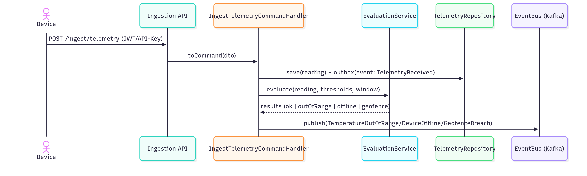
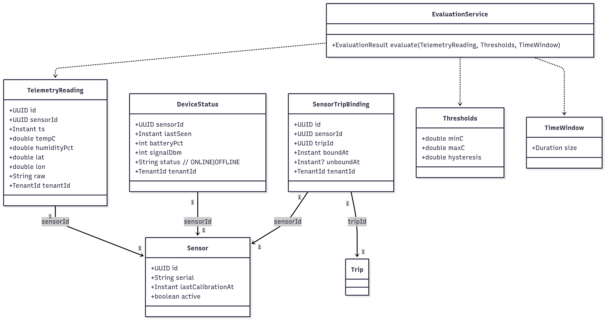
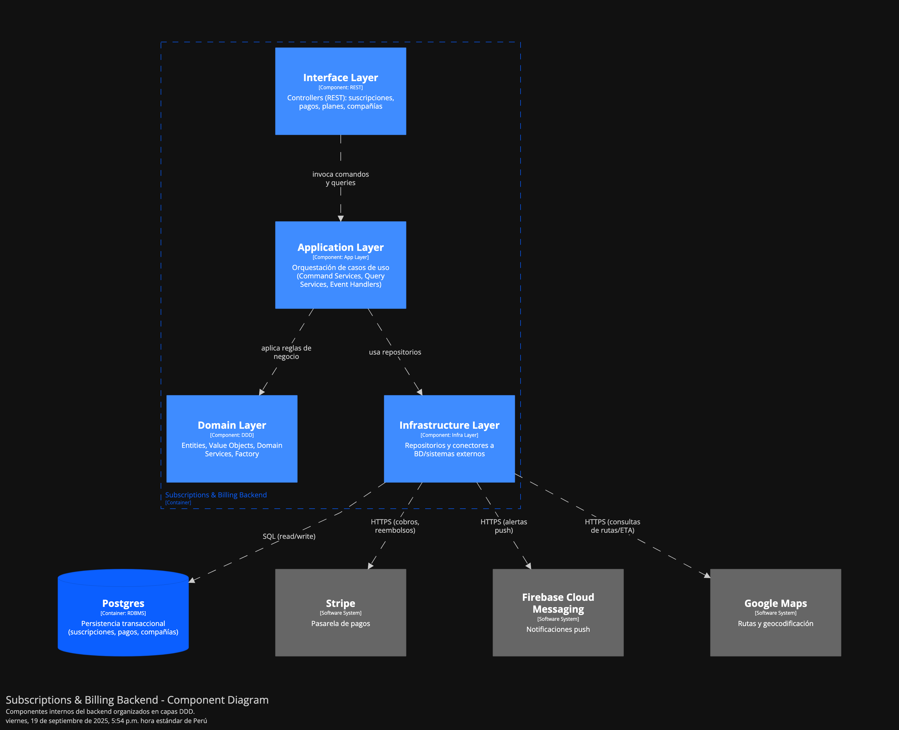
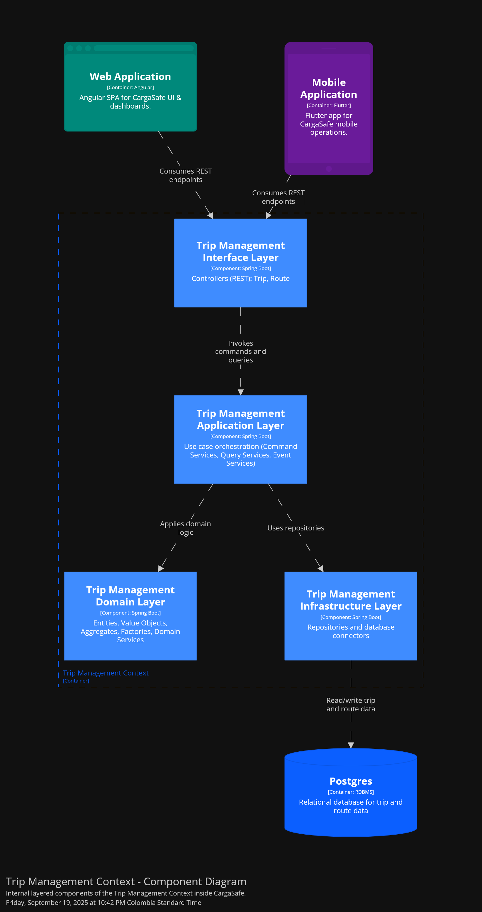

  

     
    
     
    <strong>Universidad Peruana de Ciencias Aplicadas</strong>
      
    <strong>Carrera de ingeniería de Software</strong>
      
    <strong>Ciclo 202520</strong>
      
    1ASI0572 - Desarrollo de Soluciones IOT
      
    <strong>NRC:</strong> 3443   
    <strong>Profesor:</strong> Velásquez Núñez, Angel Augusto   
    <strong>Informe de Trabajo Final</strong>
  

  

    

      <strong>Startup:</strong> Los Parkers 
       
      <strong>Producto:</strong> Macetech
    

  

      <strong>Relación de integrantes</strong>
        
      <table style="width: 60%; margin: 0 auto;   text-align: left">
        <thead>
          <tr>
            <th>Código</th>
            <th>Nombre</th>
          </tr>
        </thead>
        <tbody>
          <tr>
            <td>u20201c410</td>
            <td>Garro Vega, Marcelo Fabian</td>
          </tr>
          <tr>
            <td>u202113324</td>
            <td>Sanchez Ignacio, Jefrey Martin</td>
          </tr>
          <tr>
            <td>u...</td>
            <td>Apellidos, Nombres</td>
          </tr>
        </tbody>
      </table>
      

         
        <strong>Agosto 2025</strong>
      

    

  

---

# Capítulo I: Introducción

## 1.1. Startup Profile

### 1.1.1. Descripción de la Startup

### 1.1.2. Perfiles de integrantes del equipo

## 1.2. Solution Profile

### 1.2.1. Antecedentes y problemática

### 1.2.2. Lean UX Process

#### 1.2.2.1. Lean UX Problem Statements

#### 1.2.2.2. Lean UX Assumptions

#### 1.2.2.3. Lean UX Hypothesis Statements

#### 1.2.2.4. Lean UX Canvas

## 1.3. Segmentos objetivo

# Capítulo II: Requirements Elicitation & Analysis

## 2.1. Competidores

### 2.1.1. Análisis competitivo

### 2.1.2. Estrategias y tácticas frente a competidores

## 2.2. Entrevistas

### 2.2.1. Diseño de entrevistas

### 2.2.2. Registro de entrevistas

### 2.2.3. Análisis de entrevistas

## 2.3. Needfinding

### 2.3.1. User Personas

### 2.3.2. User Task Matrix

### 2.3.3. User Journey Mapping

### 2.3.4. Empathy Mapping

## 2.4. Big Picture EventStorming

## 2.5. Ubiquitous Language

# Capítulo III: Requirements Specification

## 3.1. User Stories

## 3.2. Impact Mapping

## 3.3. Product Backlog

# Capítulo IV: Solution Software Design

## 4.1. Strategic-Level Domain-Driven Design

### 4.1.1. Design-Level EventStorming

## 4.1.1.1 Candidate Context Discovery

Para esta etapa se llevó a cabo una sesión, la sesión tuvo una duración aproximada de 90 minutos y permitió identificar los bounded contexts del sistema CargaSafe. Durante el proceso se aplicaron las técnicas start-with-value, start-with-simple y look-for-pivotal-events, que facilitaron la agrupación de eventos y entidades según su afinidad y valor para el negocio.

Como resultado, se identificaron ocho bounded contexts:

- **Identity and Access Management**: administración de usuarios, autenticación y control de accesos.
- **Profiles and Preferences Management**: gestión de perfiles de usuario y configuración de preferencias.
- **Fleet management**: gestión de vehículos y dispositivos IoT.
- **Execution of the trip**: creación y ejecución de viajes.
- **Real-time monitoring**: monitoreo de condiciones en tiempo real.
- **Alerts and resolution**: generación de alertas.
- **Visualization/Analytics**: visualización de métricas y reportes.
- **Subscriptions and payments**: gestión de suscripciones y pagos con Stripe.

### Leyenda utilizada en el EventStorming

- 🟧 **Event**: describe algo que ocurrió en el dominio (Viaje iniciado, Alerta generada).
- 🟦 **Command**: una instrucción o acción que dispara un evento (Registrar viaje).
- 🟪 **Policy**: regla de negocio que determina qué ocurre ante ciertas condiciones (Si falta dispositivo → bloquear inicio del viaje).
- 🟨 **Aggregate**: entidad principal que concentra datos y operaciones (Viaje, Suscripción).
- 🟩 **UI**: vistas o pantallas del sistema que muestran información al usuario (Dashboard de KPIs).
- ⚪ **Actor**: roles que interactúan con el sistema (Operador, Conductor).
- ⬛ **Sistema externo**: integraciones con servicios de terceros (Google Maps, Stripe).

Con esta estructura, el EventStorming permitió organizar y simplificar el dominio de CargaSafe, evidenciando de forma clara los contextos candidatos y la interacción entre actores, procesos y sistemas externos.

[Ver gráfico en Miro](https://miro.com/app/board/uXjVJMskjeA=/?share_link_id=697373503273)

#### 4.1.1.2. Domain Message Flows Modeling

En esta etapa se desarrolló el **modelado de flujos de mensajes de dominio (Domain Message Flows)** con el objetivo de visualizar cómo colaboran los bounded contexts identificados en el Candidate Context Discovery para resolver los principales casos de negocio del sistema CargaSafe.

Para la construcción de estos flujos se aplicó la técnica de **Domain Storytelling**, la cual permite describir las interacciones en un lenguaje natural, mostrando cómo un evento generado en un bounded context desencadena comandos o nuevos eventos en otros contextos. De este modo se logra una visión clara de la cooperación entre módulos y del ciclo de vida de la información dentro de la plataforma.

### Historias de dominio (Domain Stories)

1. **Gestión de identidad y perfiles**

   - Cuando un _usuario se registra_ en **Identity and Access Management**, se genera un evento que es consumido por **Profiles and Preferences**, el cual crea automáticamente el perfil asociado.
   - Si un _usuario edita sus preferencias_, se guarda la configuración en **Profiles**, y en caso de referirse a notificaciones, estas se utilizan en **Alerts** para personalizar los canales de envío.

2. **Control de acceso y suscripciones**

   - Cuando un _pago es procesado exitosamente_ en **Subscriptions & Billing**, se envía un evento a **Identity and Access Management**, que habilita el acceso al sistema.
   - Si un _pago falla_, el mismo flujo comunica a IAM que debe restringir o bloquear el acceso del usuario hasta regularizar su situación.

3. **Gestión de flota y ejecución de viajes**

   - Al _registrarse un vehículo o dispositivo IoT_ en **Fleet Management**, este queda disponible para **Trip Management**, que puede asignarlo a un viaje planificado.
   - Cuando un _operador crea e inicia un viaje_ en **Trip Management**, se emite un evento que da origen a una sesión de monitoreo en **Monitoring**.

4. **Monitoreo en tiempo real y alertas**

   - **Monitoring** recibe continuamente _lecturas de sensores_ (temperatura, ubicación, señal). Si se detecta una condición fuera de rango, se genera un evento que es consumido por **Alerts**.
   - **Alerts** crea la alerta correspondiente y la notifica a los usuarios, aplicando las preferencias definidas en **Profiles** (por ejemplo, envío por SMS, correo o notificación push).

5. **Analítica y reportes**
   - Cada _alerta generada o reconocida_ en **Alerts** actualiza los indicadores en **Dashboard & Analytics**, alimentando las métricas de cumplimiento y los reportes de incidentes.
   - Cuando **Dashboard & Analytics** genera un _reporte final_, este puede personalizarse de acuerdo con las preferencias almacenadas en **Profiles**, permitiendo al usuario recibir información ajustada a su rol o necesidades.

### Resultados

Los flujos de mensajes de dominio evidencian la cooperación entre los ocho bounded contexts de CargaSafe:

- **Identity and Access Management**
- **Profiles and Preferences Management**
- **Fleet Management**
- **Execution of the trip**
- **Real-time monitoring**
- **Alerts and resolution**
- **Visualization/Analytics**
- **Subscriptions and payments**

Este ejercicio permitió comprender cómo un evento local en un contexto puede impactar en otros, asegurando la trazabilidad del negocio y la correcta interacción entre los distintos módulos de la solución.

#### 4.1.1.3. Bounded Context Canvases

En esta sección se elaboraron los Bounded Context Canvases de CargaSafe para los ocho contextos identificados. El objetivo fue delimitar con precisión responsabilidades, lenguaje ubicuo y decisiones de negocio, además de explicitar las comunicaciones (Queries, Commands y Events) y colaboradores (otros BC, sistemas externos y frontend). Cada canvas documenta: Descripción, Clasificación estratégica (core/supporting/generic), Rol de dominio (draft/execution/analysis/gateway), Inbound/Outbound communication, Ubiquitous Language, Business Decisions y Collaborators. Esta definición fija ownership de datos, reduce ambigüedades y prepara los contratos de integración que se implementarán en APIs y mensajería.

[Ver gráfico en Miro](https://miro.com/app/board/uXjVJJ2PHqk=/?share_link_id=762570504671)

### 4.1.2. Context Mapping

En esta etapa se construyó el **Context Map** de CargaSafe con los ocho bounded contexts identificados. El objetivo fue representar las **relaciones estructurales** entre ellos aplicando patrones de Domain-Driven Design como Customer/Supplier, Conformist y Anti-Corruption Layer (ACL).

### Resultado

El mapa final permitió:

1. **Visualizar las dependencias entre contextos**, mostrando qué módulos proveen información y cuáles la consumen.
2. **Identificar los contextos core** (Trip Management, Monitoring, Alerts), los de soporte (Fleet, Profiles, Analytics) y los genéricos (IAM, Billing).
3. **Clasificar las relaciones**:
   - Customer/Supplier en la mayoría de flujos operativos (Billing → IAM, Trip → Monitoring, Monitoring → Alerts).
   - Conformist en el consumo de datos por Analytics.
   - Anti-Corruption Layer en la interacción Analytics → Profiles.

De esta manera, el Context Mapping consolida una visión global del sistema, mostrando cómo los distintos contextos colaboran para dar soporte al negocio.

### 4.1.3. Software Architecture

#### 4.1.3.1. Software Architecture System Landscape Diagram

El **System Landscape Diagram** ofrece una visión de alto nivel del **ecosistema empresarial** en el que se integra CargaSafe. Este diagrama no se centra únicamente en un sistema, sino que representa **todas las personas y sistemas de software relevantes**, tanto internos como externos, que participan en la operación logística.

### Propósito

El objetivo de este diagrama es:

1. Mostrar el alcance de la organización y cómo conviven sus distintos sistemas.
2. Identificar a las **personas, sistemas internos, SaaS externos y proveedores** que colaboran en la cadena de valor.
3. Resaltar cómo **CargaSafe (SaaS)** se conecta dentro de este panorama, en interacción con otros actores y servicios.

### Elementos incluidos

- **Personas**: Company Operator, Driver and End Customer.
- **Sistemas internos**: Logistics Planning and Power BI Data.
- **Sistemas y proveedores externos**: CargaSafe (SaaS), Stripe, Google Maps, Notification Services e IoT Devices (sensors).
- **Grupos**: Se organizaron en cuatro dominios principales:
  - Logistics company
  - Field / Devices
  - Customers and Regulators
  - SaaS and Vendors

### Relaciones principales

- Logistics Planning → CargaSafe (SaaS): exporta planes y asignaciones de viaje.
- IoT Devices → CargaSafe (SaaS): envía telemetría (temperatura, humedad, vibración, volcado/inclinación, GPS, energía/baterías).
- CargaSafe (SaaS) → Google Maps: consulta rutas y tiempos estimados.
- CargaSafe (SaaS) → Notification Services: envía alertas a los usuarios.
- CargaSafe (SaaS) → Stripe: procesa pagos de suscripción.
- CargaSafe (SaaS) → Power BI Data: exporta datasets consolidados para analítica.
- Company Operator / Driver ↔ CargaSafe (SaaS): planifican, ejecutan y reportan el estado operativo.
- End customer ← CargaSafe (SaaS): consulta estado y recibe reportes.

### Resultado

El diagrama muestra a CargaSafe (SaaS) como el núcleo de integración entre operaciones (Company Operator, Driver, Logistics Planning), telemetría IoT (sensores en campo) y servicios externos (ruteo, notificaciones y pagos), además de su aporte a la inteligencia de negocio mediante Power BI Data. Esta representación proporciona una visión clara e integral de las dependencias y colaboraciones que sustentan la operación logística y la gestión de la cadena de frío.

#### 4.1.3.2. Software Architecture Context Level Diagrams

El **Context Diagram** de CargaSafe muestra una visión de alto nivel del sistema y de cómo se relaciona con los actores humanos y los sistemas externos que lo rodean.

En el centro se ubica CargaSafe (SaaS), que representa el sistema principal encargado del monitoreo de la cadena de frío, la trazabilidad y la generación de alertas en los viajes logísticos.

Alrededor del sistema se identifican los siguientes actores:

- _Company Operator_: gestiona viajes, flota y reportes desde la plataforma.
- _Driver_: completa viajes y reporta información desde la aplicación móvil.
- _End customer_: recibe enlaces de estado, alertas y reportes generados por el sistema.

Asimismo, se destacan las interacciones con sistemas externos que complementan las funcionalidades de CargaSafe:

- Google Maps: provee rutas, geocodificación y cálculo de ETA.
- Firebase Cloud Messaging: entrega notificaciones push.
  Stripe: procesa pagos y facturación de suscripciones.
  Este diagrama permite visualizar de manera clara las responsabilidades de cada actor y sistema, y cómo CargaSafe se convierte en el núcleo que articula la comunicación entre usuarios, dispositivos IoT y servicios externos, garantizando la operación eficiente y segura de la cadena logística.

#### 4.1.3.2. Software Architecture Container Level Diagrams

En esta parte expandimos el sistema **CargaSafe (SaaS)** para mostrar sus contenedores internos, las tecnologías que utilizamos y cómo se comunican entre sí y con los sistemas externos.

El diagrama de contenedores muestra cómo se organiza internamente CargaSafe (SaaS) y cómo se relaciona con los actores y sistemas externos.

Dentro de la plataforma tenemos varios contenedores:

- _Landing Page:_ sitio público que sirve para marketing y como punto de acceso, redirigiendo tanto a la Web App, al Single Web como a la Mobile App (descarga o deeplinks).
- _Web Frontend:_ aplicación usada por los operadores para gestionar viajes, flota y reportes.
- _Single Web:_ vista pública en línea donde los clientes finales pueden consultar estados y reportes sin necesidad de autenticarse.
- _Mobile App:_ aplicación móvil para los conductores, con soporte offline-first. Se conecta a su propia base de datos embebida SQLite para cache y operación sin conexión.
- _Backend API:_ núcleo de la lógica de negocio, responsable de gestionar viajes, monitoreo, alertas y suscripciones.
- _Relational Database (PostgreSQL):_ base de datos principal donde se almacenan usuarios, vehículos, dispositivos, viajes, telemetría, alertas y suscripciones.
- _Edge Application (Python):_ agente que corre en instalaciones o vehículos, con capacidad de procesamiento local, cache y sincronización confiable con el backend. Usa su propia Edge Database local para tolerar desconexiones.
- _Embedded Application (C++):_ componente ligero que corre en dispositivos restringidos, captura datos y los envía hacia la aplicación edge para su posterior sincronización.

Los actores principales interactúan con los contenedores:

- Company Operator usa la Web App para planificar y supervisar operaciones.
- Driver utiliza la Mobile App para recibir instrucciones y reportar estado de los viajes.
- End Customer accede tanto a la Single Web (para reportes públicos) como a la Mobile App (para recibir notificaciones y links de estado).

Además, CargaSafe se integra con varios sistemas externos:

- _Google Maps_: para rutas, geocodificación y cálculo de ETA.
- _Stripe_: para pagos y facturación de suscripciones.
- _Firebase Cloud Messaging (FCM)_: para notificaciones push hacia aplicaciones móviles y web.
  En conjunto, el diagrama muestra cómo CargaSafe se estructura en contenedores especializados que soportan las necesidades de operadores, conductores y clientes, asegurando tanto la operación online como offline en distintos puntos de la cadena logística.

#### 4.1.3.3. Software Architecture Deployment Diagrams

El Deployment Diagram de CargaSafe muestra cómo se despliega la solución en un entorno de producción real, representando los nodos de infraestructura, los contenedores de software y las interacciones entre ellos.

**Clientes:**

- Los usuarios finales acceden desde navegadores web, donde la Landing Page y el Web Frontend se sirven por separado desde CDNs independientes (CloudFlare/AWS CloudFront) para optimizar la entrega de contenido.
- Los conductores utilizan una aplicación móvil Flutter en dispositivos Android/iOS, que incluye una base de datos SQLite local para almacenamiento offline y sincronización de datos.
- Todas las peticiones de API se realizan mediante HTTPS y son redirigidas hacia el Load Balancer, encargado de enrutar el tráfico hacia los servicios backend.

**Backend y orquestación**

- El Backend API (Spring Boot) se despliega dentro de un Kubernetes Cluster en múltiples pods de aplicaciones para alta disponibilidad y escalabilidad.
- El backend centraliza la lógica de negocio, gestiona operaciones de viajes, monitoreo de cadena de frío y orquestación de alertas en tiempo real.

**Base de datos**

- El sistema utiliza una base de datos PostgreSQL gestionada (AWS RDS/Google Cloud SQL), con una instancia primaria para operaciones de escritura y réplicas de solo lectura para consultas distribuidas y balanceo de carga.
- Los dispositivos móviles mantienen datos críticos localmente en SQLite para funcionamiento offline durante los viajes.

**Integraciones externas**
El backend consume servicios de terceros para extender sus capacidades:

- Google Maps para rutas, geocodificación y cálculo de ETA en tiempo real.
- Stripe para procesamiento de pagos y facturación de subscripciones.
- Firebase Cloud Messaging (FCM) para la entrega de notificaciones push directamente a los dispositivos móviles de los conductores.

**Resultado**
El diagrama de despliegue muestra que la solución CargaSafe está organizada bajo una arquitectura cloud-native optimizada, con:

- Separación de responsabilidades: Landing page y aplicación web servidas independientemente
- Capacidades offline: Base de datos local SQLite en dispositivos móviles
- Kubernetes para la orquestación de contenedores del backend
- CDNs separados para optimizar la entrega de contenido estático
- Base de datos gestionada con réplicas para mejorar el rendimiento y disponibilidad
- Notificaciones push nativas a través de FCM

Esta infraestructura permite un sistema escalable, resiliente y con capacidades offline críticas para la operación de conductores en campo, garantizando la continuidad operativa en la gestión de la cadena de frío incluso sin conectividad permanente.

## 4.2. Tactical-Level Domain-Driven Design

### 4.2.1. Bounded Context: `<Bounded Context Name>`

#### 4.2.1.1. Domain Layer

Responsabilidad: Ingestar y evaluar telemetría (temperatura/GPS/humedad) contra políticas de cadena de frío, generando eventos de dominio para Alertas y resolución y alimentando Visualización/Analytics.

**Agregados y Entidades**

- Sensor (AR): identidad del dispositivo y estado operativo (online/offline, última calibración).

- SensorTripBinding: historial de asociación sensor↔viaje (permite auditoría y replay).

- TelemetryReading: lectura puntual (time-series); modelada como entidad inmutable.

- DeviceStatus: snapshot operativo (batería, señal, último heartbeat).

**Value Objects**

- TemperatureCelsius
- GeoPoint
- Thresholds (min/max/hysteresis)
- TimeWindow

**Servicios de Dominio**

- EvaluationService: reglas de evaluación (ventanas, anti-ruido, histeresis) → emite eventos.

- BindingService: lógica para bind/unbind de sensores a viajes.

**Eventos de Dominio**

- TelemetryReceived
- TemperatureOutOfRange
- DeviceOffline
- GeofenceBreach
- TimeseriesUpdated (para vistas)

**Repositorios**

- TelemetryRepository
- DeviceStatusRepository
- SensorBindingRepository
- SensorRepository

**Políticas/Reglas Clave**

- Frecuencia mínima de muestreo por plan
- Tolerancias por producto
- Ventana de evaluación deslizante
- Reconciliación de lecturas offline.

**Diagrama de clases (dominio)**

#### 4.2.1.2. Interface Layer

**Entradas (adapters)**

- **HTTP Ingestion API:** POST /ingest/telemetry (API-Key/JWT por tenant).

- **MQTT**: tópico devices/{sensorId}/telemetry para ingesta directa desde edge.

- **Queries**:
  - GET /live-status?sensorId=
  - GET /telemetry?tripId=&from=&to= (paginado por tiempo).

**Salidas (pub/sub y notificaciones)**

- **Events a Alertas y resolución:**

  - TemperatureOutOfRange
  - DeviceOffline
  - GeofenceBreach

- **Events a Visualización/Analytics:**
  - TimeseriesUpdated

**DTOs principales**

- TelemetryInDTO{ sensorId, ts, tempC, humidityPct, lat, lon, raw }
- LiveStatusDTO{ sensorId, lastSeen, batteryPct, signalDbm, tripId }

#### 4.2.1.3. Application Layer

**Command Handlers**

- IngestTelemetryCommandHandler: Valida TelemetryInDTO, persiste lectura (y outbox), emite TelemetryReceived.

- BindSensorToTripCommandHandler: Gestiona historia de bind/unbind y emite SensorBoundToTrip.

- EvaluateTelemetryCommandHandler: Usa EvaluationService (ventana + histéresis) y publica TemperatureOutOfRange | DeviceOffline | GeofenceBreach.

- UpdateDeviceStatusCommandHandler: Actualiza snapshot y cache en vivo.

**Event Handlers**

- TripStartedEventHandler: Precarga políticas/umbrales activos para la sesión del viaje.

- TelemetryReceivedEventHandler: Encadena evaluación y proyección a timeseries para vistas.

- PolicyUpdatedEventHandler: Refresca umbrales en memoria / caché.

**Application Services (capabilities)**

- LiveViewService — GetLiveStatus(sensorId) y cola corta de lecturas recientes.

- TimeseriesQueryService: Consulta paginada por rango {from,to}.

- AnomalyDetectionService: Hook para modelos (opt-in según plan).

**Transaccionalidad & resiliencia**

- Outbox + publicador para garantizar at-least-once de eventos.

- Idempotencia por (sensorId, ts).

- Sagas livianas para bind/unbind.

**Secuencia**

[Ver gráfico en Mermaid](https://www.mermaidchart.com/app/projects/f9114f89-7e7c-4378-9a7e-53fc0436e622/diagrams/b984e287-826d-49b5-9eae-3e6cee59ba42/version/v0.1/edit)

#### 4.2.1.4. Infrastructure Layer

**Adapters / Implementaciones**

- HttpIngestionController (REST)

- MqttIngestionConsumer (tópico devices/{sensorId}/telemetry)

- KafkaEventBus (tópicos: monitoring.alerts, monitoring.viz)

- PostgresTelemetryRepository (TimescaleDB)

- PostgresDeviceStatusRepository

- PostgresSensorBindingRepository

- RedisLiveCache (clave live:{sensorId} TTL corto)

- OutboxPublisher (lee event_outbox y publica a Kafka)

**Cross-cutting**

- RLS/tenancy por tenant_id, observabilidad (metrics/logs/traces). rate-limit, validación de payloads, DLQ.

#### 4.2.1.5. Bounded Context Software Architecture Component Level Diagrams

[Ver gráfico en Mermaid](https://www.mermaidchart.com/app/projects/f9114f89-7e7c-4378-9a7e-53fc0436e622/diagrams/2b56cea5-6f35-4228-b70e-2052df1785b7/version/v0.1/edit)

#### 4.2.1.6. Bounded Context Software Architecture Code Level Diagrams

##### 4.2.1.6.1. Bounded Context Domain Layer Class Diagrams

[Ver gráfico en Mermaid](https://www.mermaidchart.com/app/projects/f9114f89-7e7c-4378-9a7e-53fc0436e622/diagrams/da4a4688-bf70-4195-b82c-b3aee7598cde/version/v0.1/edit)

##### 4.2.1.6.2. Bounded Context Database Design Diagram

### 4.2.2. Bounded Context: _Subscriptions and Billing_

### 4.2.2.1. Domain Layer

_Entities_

**Subscription**

- **Propósito**: Gestionar el ciclo de vida de la suscripción de una empresa.
- **Atributos principales**: subscriptionId, companyId, plan, billingCycle, status (ACTIVE, CANCELED), startedAt, expiresAt.
- **Métodos principales**: activate(), changePlan(newPlan), renew(), cancel().

**Payment**

- **Propósito**: Representar pagos asociados a una suscripción.
- **Atributos principales**: paymentId, subscriptionId, amount, status (PENDING, SUCCEEDED, FAILED), date.
- **Métodos principales**: markSucceeded(), markFailed().

**Company**

- **Propósito**: Entidad que consume el servicio y depende de su suscripción activa.
- **Atributos principales**: companyId, name, vehicleCount.
- **Métodos principales**: canFitPlan(plan).

**Value Objects**

- **Plan**: Define límites y beneficios (code, vehicleLimit, price).
- **BillingCycle**: Periodo de facturación (type, startDate, endDate).
- **GracePeriod**: Tolerancia tras vencimiento (days).

**Domain Services**

- **BillingService**: Calcula montos y renovaciones.
- **PaymentPolicy**: Aplica reglas de activación y cancelación según pagos.

**Factory**

- **SubscriptionFactory**: Crea una suscripción válida con plan y ciclo inicial.

**Commands**

- **CreateSubscriptionCommand**: Crea una nueva suscripción.
- **ChangePlanCommand**: Cambia de plan.
- **CancelSubscriptionCommand**: Cancela una suscripción.
- **RenewSubscriptionCommand**: Renueva periodo.
- **RecordPaymentCommand**: Registra un pago.

**Queries**

**GetSubscriptionByIdQuery**: Consulta suscripción por ID.
**GetActiveSubscriptionByCompanyQuery**: Consulta suscripción activa de una compañía.
**ListPaymentsBySubscriptionQuery**: Lista pagos de una suscripción.

**Events**

**SubscriptionCreated**: Suscripción creada.
**PlanChanged**: Cambio de plan.
**SubscriptionRenewed**: Renovación realizada.
**SubscriptionCanceled**: Suscripción cancelada.
**PaymentSucceeded / PaymentFailed**: Resultado de pago.

### 4.2.2.2. Interface Layer

**Controllers**

- **SubscriptionController**: Endpoints para crear, renovar, cambiar plan y cancelar suscripciones.
- **PaymentController**: Endpoints para registrar y consultar pagos.
- **PlanController**: Endpoints para listar planes disponibles.
- **CompanyAccessController**: Endpoints para consultar estado de acceso de una empresa.

### 4.2.2.3. Application Layer

**Command Services**

- **SubscriptionCommandService**: Ejecuta comandos de suscripción (crear, cambiar, renovar, cancelar).
- **PaymentCommandService**: Registra pagos y actualiza estado de suscripción.

**Query Services**

**SubscriptionQueryService**: Consulta suscripciones por id, estado o compañía.
**PaymentQueryService**: Consulta pagos por suscripción o estado.

**Event Handlers**

- **SubscriptionEventHandler**: Reacciona a eventos de suscripción (creada, renovada, cancelada, cambio de plan).
- **PaymentEventHandler**: Reacciona a pagos exitosos o fallidos.

### 4.2.2.4. Infrastructure Layer

**Repositories (Interfaces)**

- **ISubscriptionRepository**: Acceso a datos de suscripciones.
- **IPaymentRepository**: Acceso a datos de pagos.
- **ICompanyRepository**: Acceso a datos de compañías.

#### 4.2.2.5. Bounded Context Software Architecture Component Level Diagrams

_Diagrama de componentes - Backend - Subscriptions and Billing_

El backend del bounded context de Suscripciones y Pagos está organizado en cuatro capas principales:

- **Interface Layer**: expone los controladores REST que atienden operaciones de suscripciones, pagos, planes y compañías. Es la puerta de entrada para los usuarios y sistemas que consumen la API.
- **Application Layer**: orquesta los casos de uso mediante Command Services, Query Services y Event Handlers. Aquí se coordinan las operaciones y se invocan las reglas de negocio.
- **Domain Layer**: concentra la lógica de negocio del contexto, con entidades, objetos de valor, servicios de dominio y fábricas. Define las reglas que rigen el ciclo de vida de suscripciones y pagos.
- **Infrastructure Layer**: implementa repositorios y conectores hacia la base de datos y sistemas externos. Se encarga de la persistencia y de la integración técnica.

Las conexiones externas son:

- Postgres para persistencia transaccional (suscripciones, pagos, compañías).
- Stripe para procesamiento de pagos.
- Firebase Cloud Messaging (FCM) para envío de notificaciones push.
- Google Maps para consultas de rutas y tiempos estimados (ETA).

_Diagrama de componentes - Application Web - Subscriptions and Billing_

La aplicación web se conecta al bounded context **Subscriptions & Billing** únicamente a través de las APIs: la _Subscriptions API_ (para enviar comandos como crear o cancelar una suscripción) y la _Query API_ (para consultar datos como facturas o planes activos).

En el lado del cliente, la app se organiza en tres partes:
• **UI (interfaz de usuario)**: pantallas de suscripciones, facturación y pagos.
• **Estado de aplicación:** maneja la sesión del usuario, el cache de consultas y el control de autenticación.
• **Servicios de datos:** cliente HTTP que llama a las APIs, agrega el token de seguridad y gestiona reintentos o errores.

La aplicación web no implementa lógica de negocio propia, solo muestra la información y envía las intenciones del usuario al backend. Todo lo que es reglas, validaciones o persistencia está en el backend.

_Diagrama de componentes - Mobile Application - Subscriptions and Billing_

La aplicación móvil de **Subscriptions & Billing** es muy parecido a la versión web, ya que también se conecta al backend por la _Subscriptions API_ y la _Query API_. La diferencia es que en el móvil contamos con una base de datos local (SQLite), que nos permite trabajar en modo offline: la app guarda datos y puede seguir operando aunque no haya conexión, y luego sincroniza cuando vuelve el internet.

La app se organiza en pantallas de suscripciones y facturación, un estado de aplicación que maneja la sesión y el cache, y un API Client que envía las solicitudes al backend siempre agregando el token de autenticación. Toda la lógica de negocio sigue estando en el backend; en el cliente solo mostramos información y enviamos las acciones que hace el usuario.

#### 4.2.2.6. Bounded Context Software Architecture Code Level Diagrams

##### 4.2.2.6.1. Bounded Context Domain Layer Class Diagrams

##### Explicación del diagrama

El diagrama de clases del Domain Layer muestra a Subscription como Aggregate Root, cuyo ciclo de vida se gestiona a través de estados definidos en SubscriptionStatus (Active y Canceled) y su relación con múltiples Payment, cada uno con su propio PaymentStatus (Pending, Succeeded, Failed). Los Value Objects Plan y Money encapsulan reglas de negocio como límites de vehículos y montos monetarios. El modelo incluye la SubscriptionFactory para la creación controlada de agregados, los Repositories para la persistencia de entidades y el PaymentProcessingService como servicio de dominio para la gestión de pagos. En conjunto, este diseño asegura encapsulamiento, claridad en las reglas del negocio e independencia tecnológica en el dominio.

##### 4.2.2.6.2. Bounded Context Database Design Diagram

##### Explicación del diagrama

Define la persistencia mínima y suficiente para gestionar compañías, suscripciones y pagos integrados con Stripe. La tabla companies centraliza la información de cada cliente.
Sobre ella, la tabla _subscriptions_ modela el ciclo de vida de la suscripción, incluyendo plan, estado y próxima renovación, con la restricción de que solo puede existir una suscripción activa por compañía.
La tabla _payments_ registra cada intento de cobro asociado a una suscripción, asegurando unicidad mediante el identificador del proveedor (provider_ref).
Finalmente, la tabla **stripe_webhook_events** almacena los eventos recibidos desde Stripe y se vincula con los pagos para garantizar trazabilidad e idempotencia en el procesamiento de transacciones.

### 4.2.3. Bounded Context: _Alerts & Resolution_

#### 4.2.3.1. Domain Layer

**Entidades (Entities)**

**Entity: Alert (Aggregate Root)**  
**Propósito principal**  
Centralizar la gestión del ciclo de vida de una alerta y garantizar que se cumplan las reglas de negocio.  
**Atributos principales**

- alertId: Identificador único de la alerta.
- type: Tipo de alerta (OutOfRange, Offline, RouteDeviation).
- status: Estado actual de la alerta (OPEN, ACKNOWLEDGED, CLOSED).
- sensorType: Tipo de sensor que la generó (TEMPERATURE, HUMIDITY, VIBRATION, TILT, LOCATION, BATTERY).
- createdAt: Fecha y hora de creación de la alerta.
- acknowledgedAt: Momento en que fue reconocida.
- closedAt: Momento en que fue cerrada.  
  **Métodos principales**
- acknowledge(): Marca la alerta como reconocida.
- close(): Cierra la alerta si ya fue reconocida.
- escalate(): Incrementa la criticidad si no fue atendida a tiempo.

**Entity: Notification**  
**Propósito principal**  
Representar un mensaje enviado a un usuario sobre una alerta.  
**Atributos principales**

- notificationId: Identificador único de la notificación.
- alertId: Referencia a la alerta asociada.
- channel: Canal de comunicación (EMAIL, SMS, FCM).
- message: Contenido del mensaje.
- sentAt: Fecha y hora de envío.  
  **Métodos principales**
- markAsSent(): Actualiza el estado de la notificación como enviada.

**Entity: Incident**  
**Propósito principal**  
Registrar un evento relacionado con un viaje que se crea a partir de una alerta.  
**Atributos principales**

- incidentId: Identificador único del incidente.
- alertId: Referencia a la alerta origen.
- tripId: Identificador del viaje asociado.
- description: Detalle del incidente.
- createdAt: Fecha y hora de creación.  
  **Métodos principales**
- resolve(description): Marca el incidente como resuelto con detalles.

**Objetos de Valor (Value Objects)**

- AlertType: clasifica los tipos de alertas (OutOfRange, Offline, RouteDeviation).
- AlertStatus: define en qué etapa se encuentra la alerta (Open, Acknowledged, Closed).
- NotificationChannel: indica el medio de comunicación usado (Email, SMS, FCM).
- PersistenceWindow: define el tiempo mínimo que debe cumplirse para que un evento se considere válido como alerta.
- SensorType: clasifica la fuente de monitoreo (TEMPERATURE, HUMIDITY, VIBRATION, TILT, LOCATION, BATTERY).

**Commands**

**Command: CreateAlertCommand**  
**Parámetros**

- type, sensorType, createdAt.  
  **Cómo funciona**  
  Se ejecuta al detectar un evento anómalo. Crea una nueva alerta validando reglas como la ventana de persistencia y evitando duplicación.

**Command: AcknowledgeAlertCommand**  
**Parámetros**

- alertId.  
  **Cómo funciona**  
  Permite a un operador reconocer la alerta. Cambia su estado a _ACKNOWLEDGED_ y registra la hora.

**Command: CloseAlertCommand**  
**Parámetros**

- alertId.  
  **Cómo funciona**  
  Cierra una alerta reconocida, cambiando su estado a _CLOSED_ y registrando la fecha de cierre.

**Command: EscalateAlertCommand**  
**Parámetros**

- alertId.  
  **Cómo funciona**  
  Incrementa la criticidad de una alerta que lleva demasiado tiempo sin ser reconocida, generando un evento de escalamiento.

**Command: CreateIncidentFromAlertCommand**  
**Parámetros**

- alertId, tripId, description.  
  **Cómo funciona**  
  Crea un incidente asociado a un viaje a partir de una alerta específica, permitiendo registrar el detalle del evento.

**Command: SendNotificationCommand**  
**Parámetros**

- alertId, channel, message.  
  **Cómo funciona**  
  Ordena enviar una notificación al canal definido (Email, SMS, FCM) para informar al usuario o empresa sobre la alerta.

**Queries**

**Query: GetAlertByIdQuery**  
**Parámetros**

- alertId.  
  **Cómo funciona**  
  Recupera los detalles de una alerta específica, incluyendo su estado, tipo y fechas clave.

**Query: GetAlertsByStatusQuery**  
**Parámetros**

- status.  
  **Cómo funciona**  
  Devuelve todas las alertas con un estado determinado (ej. abiertas, reconocidas, cerradas).

**Query: GetAlertsByTypeQuery**  
**Parámetros**

- type.  
  **Cómo funciona**  
  Recupera todas las alertas de un tipo específico (ej. RouteDeviation).

**Query: GetNotificationsByAlertIdQuery**  
**Parámetros**

- alertId.  
  **Cómo funciona**  
  Devuelve todas las notificaciones emitidas en relación con una alerta.

**Query: GetIncidentsByAlertIdQuery**  
**Parámetros**

- alertId.  
  **Cómo funciona**  
  Obtiene todos los incidentes generados a partir de una alerta determinada.

**Events**

**Event: AlertCreatedEvent**  
Se emite cuando una nueva alerta es registrada en el sistema.

**Event: AlertAcknowledgedEvent**  
Se emite cuando una alerta es reconocida.

**Event: AlertClosedEvent**  
Se emite cuando una alerta se cierra exitosamente.

**Event: AlertEscalatedEvent**  
Se emite cuando una alerta aumenta de criticidad por falta de respuesta.

**Event: NotificationSentEvent**  
Se emite al enviar una notificación a un usuario o empresa.

**Event: IncidentCreatedEvent**  
Se emite cuando se genera un incidente a partir de una alerta.

**Fábricas (Factories)**

- AlertFactory: encapsula la lógica de creación de una alerta a partir de eventos recibidos (ejemplo: sensor fuera de rango).
- IncidentFactory: crea incidentes asociados a un viaje cuando una alerta lo requiere.

#### 4.2.3.2. Interface Layer

En esta capa se definen **Controllers (REST)**.

**Controllers (REST — Spring Web)**

**AlertController**  
Este controlador permite crear nuevas alertas a partir de eventos detectados, reconocer (ACK) alertas activas, cerrarlas una vez reconocidas, y obtener tanto el detalle de una alerta específica como la lista de alertas activas (estados OPEN o ACKNOWLEDGED).

**NotificationController**  
Su responsabilidad es consultar y actualizar las preferencias de notificación de los usuarios, por ejemplo, los canales permitidos (EMAIL, SMS o FCM) y los tiempos de escalamiento configurados.

**IncidentController**  
Permite crear incidentes vinculados a una alerta y un viaje, y consultar el detalle de incidentes registrados.

#### 4.2.3.3. Application Layer

**Command Services**

- AlertCommandService: Ejecuta todos los comandos de las alertas.

**Event Services**

- OutOfRangeDetectedEvent: maneja eventos de sensores fuera de rango.
- DeviceOfflineDetectedEvent: maneja eventos de desconexión de dispositivos.
- RouteDeviationDetectedEvent: maneja desvíos de ruta.
- AlertAcknowledgedEvent: actúa tras el reconocimiento de una alerta (ejemplo: detener escalamiento).
- AlertClosedEvent: actúa tras el cierre de una alerta (ejemplo: notificar a analíticas).
- TemperatureOutOfRangeEvent: crea alerta de temperatura.
- HumidityOutOfRangeEvent: crea alerta de humedad.
- VibrationDetectedEvent: maneja vibración anómala.
- TiltOrDumpDetectedEvent: maneja vuelcos o inclinaciones.
- LowBatteryDetectedEvent: maneja alerta de energía.

**Query Services**

- AlertQueryService: Consulta las alertas.

#### 4.2.3.4. Infrastructure Layer

- Notification Repository: Repositorio para acceder a las notificaciones.
- Alert Repository: Repositorio para acceder a las alertas.
- Incident Repository: Repositorio para acceder a los incidentes.

#### 4.2.3.5. Bounded Context Software Architecture Component Level Diagrams

Diagrama de componentes - Backend - Alerts & Resolution

Diagrama de componentes - Application Web - Alerts & Resolution

Diagrama de componentes - Mobile App - Alerts & Resolution

#### 4.2.3.6. Bounded Context Software Architecture Code Level Diagrams

##### 4.2.3.6.1. Bounded Context Domain Layer Class Diagrams

##### 4.2.3.6.2. Bounded Context Database Design Diagram

### 4.2.4. Bounded Context: _Real-Time Monitoring_

#### 4.2.4.1. Domain Layer.

**Entities**

- **MonitoringSession**: Representa una sesión de monitoreo para un viaje específico. Almacena el estado de la sesión, los parámetros de referencia (`TemperatureRange`) y las lecturas recibidas.
- **TelemetryData**: Registra una única lectura de un sensor, incluyendo temperatura, humedad, vibración, ubicación y la hora de la lectura.

**Value Objects**

- **SensorReading**: Encapsula los datos de una lectura específica (ej. temperatura, humedad).
- **TemperatureRange**: Define los límites mínimos y máximos de temperatura aceptables.
- **Location**: Representa las coordenadas geográficas (latitud, longitud).
- **SignalStatus**: Indica el estado de la conexión del dispositivo (ONLINE, OFFLINE).
- **SessionStatus**: Describe el estado de una sesión (ACTIVE, INACTIVE, COMPLETED).

**Agregados (Aggregates)**

- **MonitoringSessionAggregate**: Agrupa la `MonitoringSession` con sus `TelemetryData` relacionadas, asegurando que todas las lecturas de un viaje estén coherentemente gestionadas bajo una única sesión.

**Factories**

- **MonitoringSessionFactory**: Crea una nueva sesión de monitoreo a partir de los datos de un viaje.

**Domain Services**

- **DataIngestionService**: Procesa y valida las lecturas de telemetría entrantes desde los dispositivos IoT.
- **RuleEvaluationService**: Analiza las lecturas en tiempo real para detectar violaciones de parámetros.
- **DataEnrichmentService**: Enriquece los datos de telemetría con información adicional (ej. ruta).

**Repositories (interfaces)**

- **IMonitoringSessionRepository**: Contrato para guardar y recuperar sesiones de monitoreo.
- **ITelemetryDataRepository**: Contrato para persistir y consultar las lecturas de telemetría.

**Commands**

- **StartMonitoringSessionCommand**: Orden para iniciar una nueva sesión de monitoreo para un viaje.
- **EndMonitoringSessionCommand**: Orden para cerrar una sesión de monitoreo.

**Queries**

- **GetMonitoringSessionByIdQuery**: Consulta que devuelve el estado actual de una sesión de monitoreo.
- **GetTelemetryDataBySessionQuery**: Consulta que devuelve lecturas de telemetría de una sesión.

**Events**

- **MonitoringSessionStartedEvent**: Evento que se emite cuando se inicia una sesión de monitoreo.
- **MonitoringSessionCompletedEvent**: Evento que se emite cuando una sesión se completa.
- **OutOfRangeDetectedEvent**: Evento que se emite cuando una lectura de sensor está fuera de rango.
- **DeviceOfflineDetectedEvent**: Evento que se emite cuando un dispositivo IoT deja de enviar datos.
- **TelemetryDataReceivedEvent**: Evento que se emite con cada lectura de sensor procesada.

---

#### 4.2.4.2. Interface Layer.

**Controllers**

- **MonitoringController**: Expone endpoints REST para consultas de estado de monitoreo. Recibe solicitudes del cliente y las convierte en comandos o queries para el Application Layer.
  - getSessionDetails: permite obtener el estado actual de una sesión de monitoreo.
  - getTelemetryData: consulta las lecturas de telemetría de una sesión.
  - getLiveMapData: provee datos en tiempo real para la visualización en el mapa.
  - getChartData: provee datos de temperatura para gráficos.

**Consumers**

- **TelemetryConsumer**: Consume eventos de telemetría provenientes de los dispositivos IoT.
- **TripEventsConsumer**: Consume eventos como `TripStartedEvent` y `TripCompletedEvent` del contexto de `Trip management` para orquestar la sesión de monitoreo.

---

#### 4.2.4.3. Application Layer.

**Command Handlers**

- **StartMonitoringSessionCommandHandler**: Procesa la orden para iniciar una sesión de monitoreo, creando una nueva instancia de `MonitoringSession` y persistiendo los datos.
- **EndMonitoringSessionCommandHandler**: Procesa la orden para finalizar una sesión, actualizando su estado a `COMPLETED` y deteniendo el procesamiento de datos.

**Query Handlers**

- **GetMonitoringSessionByIdQueryHandler**: Procesa la consulta para obtener los detalles de una sesión de monitoreo.
- **GetTelemetryDataBySessionQueryHandler**: Procesa la consulta para obtener las lecturas de telemetría de una sesión.

**Event Handlers**

- **TripStartedHandler**: Reacciona al evento `TripStarted` para iniciar una nueva sesión de monitoreo.
- **TripCompletedHandler**: Reacciona al evento `TripCompleted` para finalizar la sesión de monitoreo.
- **TelemetryDataReceivedHandler**: Procesa las lecturas de sensores entrantes, valida los datos, los enriquece y, si es necesario, genera eventos de alerta.

---

#### 4.2.4.4. Infrastructure Layer.

**Repositories (implementaciones)**

- **MonitoringSessionRepository**: Implementación de `IMonitoringSessionRepository` para interactuar con la base de datos (ej. PostgreSQL).
- **TelemetryDataRepository**: Implementación de `ITelemetryDataRepository` optimizada para escrituras masivas (ej. base de datos de series de tiempo).

**Components**

- **IoTMQTTAdapter**: Adapta el protocolo MQTT para consumir mensajes de telemetría de los dispositivos.
- **TripManagementAPIAdapter**: Adapta la API del contexto de Trip Management para recibir notificaciones de eventos.
- **GoogleMapsAdapter**: Adapta la API de Google Maps para obtener información de geolocalización y rutas.
- **AlertsAPIAdapter**: Adapta la API del contexto de Alerts & Resolution para enviar eventos de alerta.

  
#### 4.2.4.5. Bounded Context Software Architecture Component Level Diagrams

#### 4.2.4.6. Bounded Context Software Architecture Code Level Diagrams

##### 4.2.4.6.1. Bounded Context Domain Layer Class Diagrams

##### 4.2.4.6.2. Bounded Context Database Design Diagram

### 4.2.5. Bounded Context: _Trip management_

#### 4.2.5.1. Domain Layer.

**Entity: Trip (Aggregate Root)**

**Propósito principal**  
Representar un viaje y centralizar su ciclo de vida, asegurando que se cumplan las reglas de negocio relacionadas con cliente, conductor, vehículo y ruta.

**Atributos principales**

- tripId: Identificador único del viaje.
- clientId: Identificador del cliente.
- driverId: Identificador del conductor.
- vehicleId: Identificador del vehículo.
- route: Ruta definida para el trayecto.
- status: Estado del viaje (CREATED, IN_PROGRESS, COMPLETED, CANCELLED).
- requestedAt: Fecha y hora de la solicitud.

**Métodos principales**

- assignDriver(driverId): Asigna un conductor al viaje.
- assignVehicle(vehicleId): Vincula un vehículo al viaje.
- startTrip(): Inicia el viaje y cambia su estado a “En curso”.
- completeTrip(): Finaliza el viaje y cambia su estado a “Completado”.
- cancelTrip(reason): Cancela el viaje y registra el motivo.

---

**Entity: Route**

**Propósito principal**  
Representar la ruta de un viaje como una entidad con identidad propia, capaz de almacenar y gestionar la información de los tramos, distancias y duración total.

**Atributos principales**

- routeId: Identificador único de la ruta.
- origin: Punto de inicio.
- destination: Punto final.
- segments: Lista de tramos de la ruta.
- totalDistance: Distancia total del viaje.
- totalDuration: Duración total estimada.

**Métodos principales**

- addSegment(segment): Agrega un tramo adicional a la ruta.
- updateDestination(newDestination): Cambia el destino de la ruta antes de iniciar el viaje.
- recalculateTotals(): Recalcula la distancia y la duración total a partir de los segmentos actuales.

---

**Value Object: GeoCoordinate**

**Propósito principal**  
Representar un punto geográfico inmutable.

**Atributos principales**

- latitude: Latitud válida.
- longitude: Longitud válida.

---

**Value Object: RouteSegment**

**Propósito principal**  
Modelar un tramo de ruta entre dos puntos.

**Atributos principales**

- coordinates: Lista de coordenadas que forman el tramo.
- distance: Distancia recorrida en el segmento.
- duration: Tiempo estimado del segmento.

---

**Value Object: Distance**

**Propósito principal**  
Expresar una magnitud de distancia.

**Atributos principales**

- value: Cantidad numérica de la distancia.
- unit: Unidad de medida (ej. km).

---

**Value Object: Duration**

**Propósito principal**  
Expresar un intervalo de tiempo.

**Atributos principales**

- value: Cantidad numérica de tiempo.
- unit: Unidad de medida (ej. minutos).

---

**Value Object: TripStatus**

**Propósito principal**  
Representar el estado del viaje en su ciclo de vida.

**Atributos principales**

- status: Valor posible (PENDING, IN_PROGRESS, COMPLETED, CANCELLED).

---

**Aggregate: TripAggregate**

**Propósito principal**  
Asegurar la consistencia de un viaje como unidad de negocio.

**Métodos principales**

- validateTripReady(): Verifica que el viaje tenga cliente, conductor, vehículo y ruta antes de iniciar.

---

**Factory: TripFactory**

**Propósito principal**  
Crear instancias de **Trip** en estado inicial válido.

**Métodos principales**

- createTrip(clientId, driverId, vehicleId, route): Genera un viaje en estado PENDING con todos los datos requeridos.

---

**Domain Service: RoutePlanningService**

**Propósito principal**  
Encapsular la lógica de planificación de rutas.

**Métodos principales**

- generateRoute(origin, destination): Construye una ruta válida con segmentos, distancia y duración.

---

**Domain Service: TripSchedulerService**

**Propósito principal**  
Validar disponibilidad de recursos antes de asignarlos a un viaje.

**Métodos principales**

- checkDriverAvailability(driverId, timeRange): Verifica si un conductor está libre.
- checkVehicleAvailability(vehicleId, timeRange): Verifica si un vehículo está disponible.

---

**Command: CreateTripCommand**

**Propósito**  
Crear un nuevo viaje en estado PENDING con las referencias de cliente, conductor, vehículo y ruta.

**Parámetros**

- clientId: Identificador del cliente.
- driverId: Identificador del conductor.
- vehicleId: Identificador del vehículo.
- route: Ruta completa del viaje.

---

**Command: AssignDriverToTripCommand**

**Propósito**  
Asignar un conductor disponible a un viaje existente y actualizar la referencia correspondiente.

**Parámetros**

- tripId: Identificador único del viaje.
- driverId: Identificador del conductor.

---

**Command: AssignVehicleToTripCommand**

**Propósito**  
Asignar un vehículo disponible a un viaje existente y actualizar la referencia correspondiente.

**Parámetros**

- tripId: Identificador único del viaje.
- vehicleId: Identificador del vehículo.

---

**Command: StartTripCommand**

**Propósito**  
Iniciar un viaje, cambiando su estado a EN CURSO y registrando la hora exacta de inicio.

**Parámetros**

- tripId: Identificador único del viaje.

---

**Command: CompleteTripCommand**

**Propósito**  
Finalizar un viaje, cambiando su estado a COMPLETADO y registrando la hora de cierre.

**Parámetros**

- tripId: Identificador único del viaje.

---

**Command: CancelTripCommand**

**Propósito**  
Cancelar un viaje, actualizar su estado a CANCELADO y guardar la razón de la cancelación.

**Parámetros**

- tripId: Identificador único del viaje.
- reason: Motivo de la cancelación.

---

**Command: UpdateRouteForTripCommand**

**Propósito**  
Actualizar la ruta de un viaje antes de que inicie, garantizando que la información sea válida y actualizada.

**Parámetros**

- tripId: Identificador único del viaje.
- newRoute: Nueva ruta a asociar.

**Query: GetTripByIdQuery**

**Propósito**  
Obtener la información completa de un viaje específico mediante su identificador único.

**Parámetros**

- tripId: Identificador único del viaje.

---

**Query: GetTripsByStatusQuery**

**Propósito**  
Listar los viajes filtrados por su estado (Pendiente, En curso, Completado o Cancelado).

**Parámetros**

- status: Estado de los viajes a consultar.

---

**Query: GetTripsByClientIdQuery**

**Propósito**  
Obtener todos los viajes asociados a un cliente específico.

**Parámetros**

- clientId: Identificador único del cliente.

---

**Query: GetAllTripsQuery**

**Propósito**  
Recuperar todos los viajes registrados en el sistema, sin aplicar filtros.

**Parámetros**  
_(No requiere parámetros)_

---

**Event: TripCreatedEvent**

**Propósito**  
Notificar que un nuevo viaje ha sido creado en el sistema.

**Parámetros**

- tripId: Identificador único del viaje.
- clientId: Identificador del cliente.
- driverId: Identificador del conductor asignado.
- vehicleId: Identificador del vehículo asignado.
- route: Ruta definida para el viaje.
- createdAt: Fecha y hora en que se creó el viaje.

---

**Event: DriverAssignedEvent**

**Propósito**  
Notificar que un conductor fue asignado a un viaje.

**Parámetros**

- tripId: Identificador único del viaje.
- driverId: Identificador del conductor asignado.
- assignedAt: Fecha y hora de la asignación.

---

**Event: VehicleAssignedEvent**

**Propósito**  
Notificar que un vehículo fue asignado a un viaje.

**Parámetros**

- tripId: Identificador único del viaje.
- vehicleId: Identificador del vehículo asignado.
- assignedAt: Fecha y hora de la asignación.

---

**Event: TripStartedEvent**

**Propósito**  
Notificar que un viaje ha iniciado oficialmente.

**Parámetros**

- tripId: Identificador único del viaje.
- startedAt: Fecha y hora de inicio del viaje.

---

**Event: TripCompletedEvent**

**Propósito**  
Notificar que un viaje se ha completado satisfactoriamente.

**Parámetros**

- tripId: Identificador único del viaje.
- completedAt: Fecha y hora de finalización del viaje.

---

**Event: TripCancelledEvent**

**Propósito**  
Notificar que un viaje ha sido cancelado.

**Parámetros**

- tripId: Identificador único del viaje.
- reason: Motivo de la cancelación.
- cancelledAt: Fecha y hora en que se canceló el viaje.

#### 4.2.5.2. Interface Layer.

**Controllers**

- TripController: Controlador que maneja las solicitudes relacionadas con los viajes. Atiende operaciones como crear un nuevo viaje, asignar un conductor, actualizar la ruta, iniciar, completar o cancelar un viaje, así como consultar información de viajes por identificador, estado, cliente o recuperar todos los viajes registrados.

- RouteController: Controlador que maneja las solicitudes relacionadas con las rutas de los viajes. Permite registrar una nueva ruta, actualizarla antes del inicio de un viaje y consultar la información de rutas específicas o asociadas a un viaje.

#### 4.2.5.3. Application Layer.

**Command Services**

- TripCommandService: Se encarga de recibir y coordinar los comandos relacionados a un viaje. Dentro de él se manejan distintos handlers, cada uno especializado en ejecutar un comando específico como iniciar, completar, cancelar o asignar recursos al viaje.

- RouteCommandService: Se encarga de coordinar los comandos relacionados con rutas. Administra la creación, actualización y recalculo de rutas para garantizar que los trayectos estén completos y actualizados antes de iniciar un viaje.

---

**Query Services**

- TripQueryService: Se encarga de atender las consultas relacionadas a los viajes. Contiene handlers que procesan queries para obtener información, por ejemplo: consultar un viaje por su identificador, listar viajes por estado o recuperar todos los viajes de un cliente.

- RouteQueryService: Atiende las consultas relacionadas a las rutas de los viajes. Permite obtener información de rutas específicas o de las rutas asociadas a un viaje.

---

**Event Services**

- TripEventService: Se encarga de atender los eventos relacionados a un viaje. Dentro de él se gestionan distintos servicios especializados que reaccionan a cada evento, como creación, asignación de recursos, inicio, finalización o cancelación del viaje, ejecutando las acciones necesarias después de que ocurren.

#### 4.2.5.4. Infrastructure Layer.

**Repositories**

- ITripRepository: Repositorio que define las operaciones de acceso a los viajes, como guardar, actualizar y recuperar información de un viaje.
- IRouteRepository: Repositorio que define las operaciones de acceso a las rutas, como registrar nuevas rutas, actualizarlas y consultarlas en relación con un viaje.

#### 4.2.5.5. Bounded Context Software Architecture Component Level Diagrams.

Diagrama de componentes - Backend - Trip Management

Diagrama de componentes - Application Web - Trip Management

<!--  -->

Diagrama de componentes - Mobile App - Trip Management

<!--  -->

#### 4.2.5.6. Bounded Context Software Architecture Code Level Diagrams.

##### 4.2.5.6.1. Bounded Context Domain Layer Class Diagrams.

##### 4.2.5.6.2. Bounded Context Database Design Diagram.
