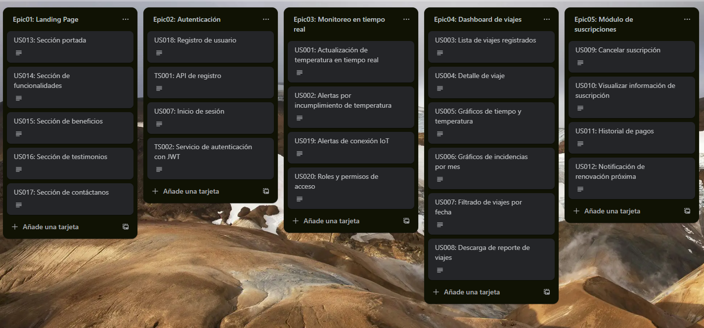

  

     
    
     
    <strong>Universidad Peruana de Ciencias Aplicadas</strong>
      
    <strong>Carrera de ingeniería de Software</strong>
      
    <strong>Ciclo 202520</strong>
      
    1ASI0572 - Desarrollo de Soluciones IOT
      
    <strong>NRC:</strong> 3443   
    <strong>Profesor:</strong> Velásquez Núñez, Angel Augusto   
    <strong>Informe de Trabajo Final</strong>
  

  

    

      <strong>Startup:</strong> Los Parkers 
       
      <strong>Producto:</strong> Macetech
    

  

      <strong>Relación de integrantes</strong>
        
      <table style="width: 60%; margin: 0 auto;   text-align: left">
        <thead>
          <tr>
            <th>Código</th>
            <th>Nombre</th>
          </tr>
        </thead>
        <tbody>
          <tr>
            <td>u20201c410</td>
            <td>Garro Vega, Marcelo Fabian</td>
          </tr>
          <tr>
            <td>u202113324</td>
            <td>Sanchez Ignacio, Jefrey Martin</td>
          </tr>
          <tr>
            <td>u...</td>
            <td>Apellidos, Nombres</td>
          </tr>
        </tbody>
      </table>
      

         
        <strong>Agosto 2025</strong>
      

    

  

---

# Capítulo I: Introducción

## 1.1. Startup Profile

### 1.1.1. Descripción de la Startup

### 1.1.2. Perfiles de integrantes del equipo

## 1.2. Solution Profile

### 1.2.1. Antecedentes y problemática

### 1.2.2. Lean UX Process

#### 1.2.2.1. Lean UX Problem Statements

#### 1.2.2.2. Lean UX Assumptions

#### 1.2.2.3. Lean UX Hypothesis Statements

#### 1.2.2.4. Lean UX Canvas

## 1.3. Segmentos objetivo

# Capítulo II: Requirements Elicitation & Analysis

## 2.1. Competidores

### 2.1.1. Análisis competitivo

### 2.1.2. Estrategias y tácticas frente a competidores

## 2.2. Entrevistas

### 2.2.1. Diseño de entrevistas

### 2.2.2. Registro de entrevistas

### 2.2.3. Análisis de entrevistas

## 2.3. Needfinding

### 2.3.1. User Personas

### 2.3.2. User Task Matrix

### 2.3.3. User Journey Mapping

### 2.3.4. Empathy Mapping

## 2.4. Big Picture EventStorming

## 2.5. Ubiquitous Language

# Capítulo III: Requirements Specification

## 3.1. User Stories

| Epic / Story ID | Título                                        | Descripción                                                                                                                                                                                                                  | Criterios de Aceptación                                                                                                                                                                                                                                                                                                                                                                                                                                                                                                                                                                                                                                                                                                                                                                                                                                                                                                                                                                                                                                                                                                                                                                                                                                                                                                                                                                                                                                                                                                                                                                                                                                                                                                                                                                                                                                                                                                                                                                                  | Relacionado con (Epic ID) |
| --------------- | --------------------------------------------- | ---------------------------------------------------------------------------------------------------------------------------------------------------------------------------------------------------------------------------- | -------------------------------------------------------------------------------------------------------------------------------------------------------------------------------------------------------------------------------------------------------------------------------------------------------------------------------------------------------------------------------------------------------------------------------------------------------------------------------------------------------------------------------------------------------------------------------------------------------------------------------------------------------------------------------------------------------------------------------------------------------------------------------------------------------------------------------------------------------------------------------------------------------------------------------------------------------------------------------------------------------------------------------------------------------------------------------------------------------------------------------------------------------------------------------------------------------------------------------------------------------------------------------------------------------------------------------------------------------------------------------------------------------------------------------------------------------------------------------------------------------------------------------------------------------------------------------------------------------------------------------------------------------------------------------------------------------------------------------------------------------------------------------------------------------------------------------------------------------------------------------------------------------------------------------------------------------------------------------------------------------- | ------------------------- |
| E1              | Landing Page                                  | Página principal con secciones informativas y de contacto para captar y orientar a los visitantes.                                                                                                                           |                                                                                                                                                                                                                                                                                                                                                                                                                                                                                                                                                                                                                                                                                                                                                                                                                                                                                                                                                                                                                                                                                                                                                                                                                                                                                                                                                                                                                                                                                                                                                                                                                                                                                                                                                                                                                                                                                                                                                                                                          |                           |
| E2              | Autenticación                                 | Módulo de registro e inicio de sesión seguro para usuarios.                                                                                                                                                                  |                                                                                                                                                                                                                                                                                                                                                                                                                                                                                                                                                                                                                                                                                                                                                                                                                                                                                                                                                                                                                                                                                                                                                                                                                                                                                                                                                                                                                                                                                                                                                                                                                                                                                                                                                                                                                                                                                                                                                                                                          |                           |
| E3              | Gestión de flota                              | Administración de la flota: registro, actualización y baja de vehículos.                                                                                                                                                     |                                                                                                                                                                                                                                                                                                                                                                                                                                                                                                                                                                                                                                                                                                                                                                                                                                                                                                                                                                                                                                                                                                                                                                                                                                                                                                                                                                                                                                                                                                                                                                                                                                                                                                                                                                                                                                                                                                                                                                                                          |                           |
| E4              | Planificador de viajes                        | Creación y actualización de estados de los viajes.                                                                                                                                                                           |                                                                                                                                                                                                                                                                                                                                                                                                                                                                                                                                                                                                                                                                                                                                                                                                                                                                                                                                                                                                                                                                                                                                                                                                                                                                                                                                                                                                                                                                                                                                                                                                                                                                                                                                                                                                                                                                                                                                                                                                          |                           |
| E5              | Monitoreo en tiempo real                      | Engloba funcionalidades de monitoreo de temperatura en tiempo real y alertas.                                                                                                                                                |                                                                                                                                                                                                                                                                                                                                                                                                                                                                                                                                                                                                                                                                                                                                                                                                                                                                                                                                                                                                                                                                                                                                                                                                                                                                                                                                                                                                                                                                                                                                                                                                                                                                                                                                                                                                                                                                                                                                                                                                          |                           |
| E6              | Dashboard de viajes                           | Engloba pantallas, gráficos e informes relacionados a los viajes.                                                                                                                                                            |                                                                                                                                                                                                                                                                                                                                                                                                                                                                                                                                                                                                                                                                                                                                                                                                                                                                                                                                                                                                                                                                                                                                                                                                                                                                                                                                                                                                                                                                                                                                                                                                                                                                                                                                                                                                                                                                                                                                                                                                          |                           |
| E7              | Módulo de suscripciones                       | Engloba funcionalidades de pago, manejo y control de suscripciones.                                                                                                                                                          |                                                                                                                                                                                                                                                                                                                                                                                                                                                                                                                                                                                                                                                                                                                                                                                                                                                                                                                                                                                                                                                                                                                                                                                                                                                                                                                                                                                                                                                                                                                                                                                                                                                                                                                                                                                                                                                                                                                                                                                                          |                           |
| US001           | Navegación en landing page                    | **Como** visitante  **quiero** navegar entre las secciones de la landing page  **para** acceder fácilmente a la información sobre el servicio.                                                                         | Scenario: Visualización del menú  Given un visitante ingresa a la landing page  When visualiza la parte superior de la página  Then encuentra un menú con secciones principales (Inicio, Características, Planes, Contacto)  Scenario: Navegación entre secciones  Given un visitante hace clic en un enlace del menú  When la página carga la sección correspondiente  Then el visitante accede al contenido correcto  And el menú permanece accesible en todo momento                                                                                                                                                                                                                                                                                                                                                                                                                                                                                                                                                                                                                                                                                                                                                                                                                                                                                                                                                                                                                                                                                                                                                                                                                                                                                                                                                                                                                                                                                                       | E1                        |
| US002           | Sección portada                               | Como visitante,  quiero ver una portada con mensaje principal,  para entender rápidamente el propósito de la plataforma.                                                                                               | Scenario: Visualizar mensaje principal Given un visitante accede a la Landing Page When la portada se muestra Then el visitante visualiza un mensaje claro sobre el servicio                                                                                                                                                                                                                                                                                                                                                                                                                                                                                                                                                                                                                                                                                                                                                                                                                                                                                                                                                                                                                                                                                                                                                                                                                                                                                                                                                                                                                                                                                                                                                                                                                                                                                                                                                                                                                    | E1                        |
| US003           | Sección de funcionalidades                    | Como visitante,  quiero visualizar una sección con las funcionalidades principales,  para conocer qué ofrece la plataforma.                                                                                            | Scenario: Visualizar funcionalidades Given un visitante accede a la Landing Page When navega a la sección de funcionalidades Then se muestran al menos tres funcionalidades principales de la plataforma                                                                                                                                                                                                                                                                                                                                                                                                                                                                                                                                                                                                                                                                                                                                                                                                                                                                                                                                                                                                                                                                                                                                                                                                                                                                                                                                                                                                                                                                                                                                                                                                                                                                                                                                                                                        | E1                        |
| US004           | Sección de beneficios                         | **Como** visitante,  **quiero** ver una sección con beneficios,  **para** entender qué valor obtengo al usar la plataforma.                                                                                            | Scenario: Visualizar beneficios Given un visitante accede a la Landing Page When navega a la sección de beneficios Then se muestran los beneficios de la plataforma en formato claro y resumido                                                                                                                                                                                                                                                                                                                                                                                                                                                                                                                                                                                                                                                                                                                                                                                                                                                                                                                                                                                                                                                                                                                                                                                                                                                                                                                                                                                                                                                                                                                                                                                                                                                                                                                                                                                                 | E1                        |
| US005           | Sección de testimonios                        | Como visitante,  quiero ver testimonios de otros clientes,  para ganar confianza en el servicio.                                                                                                                       | Scenario: Visualizar testimonios Given un visitante accede a la Landing Page When navega a la sección de testimonios Then se muestran al menos dos opiniones de clientes con sus nombres o cargos                                                                                                                                                                                                                                                                                                                                                                                                                                                                                                                                                                                                                                                                                                                                                                                                                                                                                                                                                                                                                                                                                                                                                                                                                                                                                                                                                                                                                                                                                                                                                                                                                                                                                                                                                                                               | E1                        |
| US006           | Sección de contáctanos                        | Como visitante,  quiero acceder a un formulario de contacto,  para comunicarme con la empresa y solicitar más información.                                                                                             | Scenario: Enviar mensaje de contacto válido Given un visitante completa el formulario con nombre, correo y mensaje válidos When envía la información Then el sistema confirma el envío exitoso  Scenario: Enviar mensaje con datos inválidos Given un visitante omite el correo electrónico When intenta enviar el formulario Then el sistema rechaza el envío y muestra un error de validación                                                                                                                                                                                                                                                                                                                                                                                                                                                                                                                                                                                                                                                                                                                                                                                                                                                                                                                                                                                                                                                                                                                                                                                                                                                                                                                                                                                                                                                                                                                                                                                  | E1                        |
| US007           | Call to Action a la aplicación web            | **Como** visitante  **quiero** encontrar un botón de acceso a la aplicación web  **para** registrarme o iniciar sesión y usar el servicio desde un navegador.                                                          | Scenario: Visualización del call to action  Given un visitante navega por la landing page  When llega a la sección principal  Then encuentra un botón de acceso a la aplicación web  Scenario: Redirección a la app web  Given un visitante hace clic en el botón de acceso a la aplicación web  When el sistema procesa la acción  Then el visitante es redirigido a la URL de la aplicación web                                                                                                                                                                                                                                                                                                                                                                                                                                                                                                                                                                                                                                                                                                                                                                                                                                                                                                                                                                                                                                                                                                                                                                                                                                                                                                                                                                                                                                                                                                                                                                                | E1                        |
| US008           | Call to Action de descarga de App Móvil       | **Como** visitante  **quiero** encontrar botones de descarga de la aplicación móvil  **para** instalar la app en mi dispositivo iOS o Android.                                                                         | Scenario: Visualización de botones de descarga  Given un visitante navega por la landing page  When accede a la sección de descarga  Then visualiza botones con enlaces a App Store y Google Play  Scenario: Redirección a la tienda correspondiente  Given un visitante hace clic en un botón de descarga  When el sistema procesa la acción  Then se abre la tienda de aplicaciones correspondiente (App Store o Google Play)                                                                                                                                                                                                                                                                                                                                                                                                                                                                                                                                                                                                                                                                                                                                                                                                                                                                                                                                                                                                                                                                                                                                                                                                                                                                                                                                                                                                                                                                                                                                                  | E1                        |
| US009           | Registro de usuario                           | **Como** usuario **quiero** registrarme en la plataforma **para** acceder a mi cuenta y funcionalidades personalizadas.                                                                                                | Scenario: Registro de cuenta válida Given un usuario se registra When ingresa sus credenciales en el registro Then el sistema autentica y permite acceso  Scenario: Registro de cuenta inválido Given un usuario se registra When ingresa credenciales en el registro incorrectas Then el sistema rechaza la autenticación y muestra error                                                                                                                                                                                                                                                                                                                                                                                                                                                                                                                                                                                                                                                                                                                                                                                                                                                                                                                                                                                                                                                                                                                                                                                                                                                                                                                                                                                                                                                                                                                                                                                                                                       | E2                        |
| US010           | Inicio de sesión                              | **Como** usuario **quiero** iniciar sesión en la plataforma **para** acceder a mi cuenta y funcionalidades personalizadas.                                                                                             | Scenario: Inicio de sesión válido Given un usuario registrado When ingresa credenciales correctas Then el sistema autentica y permite acceso  Scenario: Inicio de sesión inválido Given un usuario registrado When ingresa credenciales incorrectas Then el sistema rechaza la autenticación y muestra error                                                                                                                                                                                                                                                                                                                                                                                                                                                                                                                                                                                                                                                                                                                                                                                                                                                                                                                                                                                                                                                                                                                                                                                                                                                                                                                                                                                                                                                                                                                                                                                                                                                                     | E2                        |
| US011           | Cerrar sesión                                 | **Como** usuario autenticado **quiero** cerrar sesión desde la aplicación  **para** que mi cuenta deje de estar accesible en el dispositivo actual.                                                                    | Scenario 1: Cierre de sesión exitoso  Given que el usuario tiene un token válido y está autenticado When solicita cerrar sesión Then se elimina el token del lado del cliente And los siguientes intentos de acceder a recursos requieren autenticación nuevamente                                                                                                                                                                                                                                                                                                                                                                                                                                                                                                                                                                                                                                                                                                                                                                                                                                                                                                                                                                                                                                                                                                                                                                                                                                                                                                                                                                                                                                                                                                                                                                                                                                                                                                                        | E2                        |
| US012           | Recuperar contraseña                          | **Como** usuario **quiero** recuperar el acceso a mi cuenta mediante un proceso de restablecimiento de contraseña  **para** poder ingresar nuevamente en caso de olvidar mis credenciales.                       | **Scenario 1: Solicitud de recuperación**  Given un cliente no recuerda su contraseña  When solicita la recuperación en la pantalla de inicio de sesión e ingresa su correo registrado  Then el sistema envía un correo electrónico con un enlace seguro para restablecer la contraseña   **Scenario 2: Enlace válido y único**  Given el cliente recibe un enlace de restablecimiento  When hace clic en el enlace dentro del tiempo de validez (ej. 15 minutos)  Then el sistema muestra un formulario para crear una nueva contraseña  And valida que el enlace no haya sido usado previamente  **Scenario 3: Enlace expirado**  Given un cliente recibe un enlace de restablecimiento  When intenta usarlo después del tiempo de validez  Then el sistema rechaza el intento  And muestra el mensaje “El enlace ha expirado, solicita nuevamente la recuperación de contraseña”  **Scenario 4: Contraseña actualizada correctamente**  Given el cliente ingresa una nueva contraseña válida  When confirma el restablecimiento  Then el sistema actualiza la contraseña en la base de datos  And notifica al cliente que el cambio se realizó con éxito                                                                                                                                                                                                                                                                                                                                                                                                                                                                                                                                                                                                                                                                                                                                                                            | E2                        |
| US013           | Registro de vehículos de carga                | **Como** administrador logístico,  **quiero** registrar vehículos en la plataforma,  **para** mantener un inventario actualizado de la flota.                                                                          | Scenario: Registrar un vehículo válido Given el administrador cuenta con los datos de marca, modelo, placa, capacidad y dimensiones When el administrador registra el vehículo en la plataforma Then el sistema guarda el vehículo como parte de la flota activa  Scenario: Registro sin datos obligatorios Given el administrador omite campos requeridos como marca, modelo o placa When intenta registrar el vehículo Then el sistema rechaza el registro y muestra un error de validación  Scenario: Validar formato de placa Given el administrador ingresa un formato de placa incorrecto When intenta registrar el vehículo Then el sistema rechaza el registro y solicita un formato válido  Scenario: Validar dimensiones del vehículo Given el administrador ingresa dimensiones físicas del vehículo (alto, ancho, largo) When las dimensiones son numéricas y positivas Then el sistema acepta los valores y guarda la información  Scenario: Validar capacidad de carga Given el administrador ingresa capacidad de carga en kilogramos When la capacidad es mayor a 0 Then el sistema guarda el valor correctamente And el sistema rechaza valores negativos o nulos                                                                                                                                                                                                                                                                                                                                                                                                                                                                                                                                                                                                                                                                                                                                               | E3                        |
| US014           | Actualización de datos de vehículos de carga  | **Como** administrador logístico, **quiero** editar la información de los vehículos, **para** mantener actualizado su estado operativo.                                                                                      | Scenario: Actualizar información básica del vehículo Given existe un vehículo registrado en la plataforma When el administrador modifica la marca, modelo o dimensiones Then el sistema actualiza la información y guarda los cambios en el historial  Scenario: Validar actualización de placa duplicada Given un vehículo ya tiene registrada una placa única When el administrador intenta asignar esa misma placa a otro vehículo Then el sistema rechaza la actualización y muestra un error de duplicidad  Scenario: Mantener consistencia en datos obligatorios Given existe un vehículo registrado When el administrador elimina un dato obligatorio como marca o modelo Then el sistema rechaza la actualización y mantiene los datos anteriores                                                                                                                                                                                                                                                                                                                                                                                                                                                                                                                                                                                                                                                                                                                                                                                                                                                                                                                                                                                                                                                                                                                                                                                                         | E3                        |
| US015           | Eliminación de vehículos de carga             | **Como** administrador logístico, **quiero** eliminar vehículos de la plataforma, **para** mantener un inventario actualizado y evitar registros obsoletos.                                                                  | Scenario: Eliminar vehículo activo Given un vehículo está registrado en la flota When el administrador elimina el vehículo Then el sistema cambia su estado a "inactivo" And conserva su historial de viajes y mantenimientos  Scenario: Intentar eliminar vehículo con viaje en curso Given un vehículo tiene un viaje activo When el administrador intenta eliminarlo Then el sistema rechaza la eliminación And muestra un mensaje indicando que el vehículo tiene viajes pendientes  Scenario: Eliminación exitosa de vehículo sin viajes en curso Given un vehículo no tiene viajes activos When el administrador lo elimina Then el sistema lo marca como eliminado And ya no aparece en el inventario activo de la flota                                                                                                                                                                                                                                                                                                                                                                                                                                                                                                                                                                                                                                                                                                                                                                                                                                                                                                                                                                                                                                                                                                                                                                                                                          | E3                        |
| US016           | Registro de dispositivos IoT                  | **Como** Administrador Logístico  **quiero** registrar un dispositivo IoT en la plataforma  **para** asociarlo a la flota y comenzar a recibir sus datos.                                                              | Scenario: Registro exitoso de dispositivo nuevo  Given un dispositivo IoT con un ID único  When el administrador lo registra en la plataforma  Then el sistema almacena el dispositivo en la base de datos  And queda disponible para asignarlo a un vehículo de carga  Scenario: Intentar registrar dispositivo duplicado  Given un dispositivo IoT con un ID ya registrado  When el administrador intenta registrarlo nuevamente  Then el sistema rechaza el registro  And muestra un mensaje "El dispositivo ya está registrado"  Scenario: Validación de campos obligatorios  Given un administrador intenta registrar un dispositivo sin datos requeridos como deviceId o tipo  When envía la solicitud de registro  Then el sistema rechaza el registro  And muestra un mensaje indicando los campos faltantes                                                                                                                                                                                                                                                                                                                                                                                                                                                                                                                                                                                                                                                                                                                                                                                                                                                                                                                                                                                                                                                                                                                                     | E3                        |
| US017           | Eliminar dispositivo IoT                      | **Como** Administrador Logístico,  **quiero** eliminar un dispositivo IoT de la plataforma,  **para** darlo de baja en caso de falla o reemplazo.                                                                      | **Scenario: Eliminar dispositivo inactivo**  **Given** un dispositivo IoT está registrado en la plataforma y no transmite datos  **When** el administrador elimina el dispositivo  **Then** el sistema cambia su estado a _“inactivo”_  **And** conserva su historial de transmisiones y alertas  **Scenario: Intentar eliminar dispositivo activo**  **Given** un dispositivo está enviando datos en tiempo real  **When** el administrador intenta eliminarlo  **Then** el sistema rechaza la eliminación  **And** muestra un mensaje indicando que el dispositivo sigue activo  **Scenario: Eliminación exitosa de dispositivo sin actividad reciente**  **Given** un dispositivo no transmite datos desde hace más de 24h  **When** el administrador lo elimina  **Then** el sistema lo marca como _“eliminado”_  **And** ya no aparece en la lista de dispositivos activos                                                                                                                                                                                                                                                                                                                                                                                                                                                                                                                                                                                                                                                                                                                                                                                                                                                                                                                                                                                                                                                                          | E3                        |
| US018           | Asignar dispositivo a vehiculo de carga       | **Como** Administrador Logístico  **quiero** asignar un dispositivo IoT a un vehículo de carga  **para** identificar a qué unidad pertenece cada transmisión de datos                                            | Scenario: Asignar dispositivo a vehículo disponible  Given un dispositivo IoT registrado y sin asignar  When el administrador selecciona un vehículo de la flota  Then el sistema vincula el dispositivo a ese vehículo  And las próximas transmisiones aparecen bajo ese vehículo  Scenario: Intentar asignar dispositivo ya vinculado  Given un dispositivo IoT ya asignado a un vehículo  When el administrador intenta asignarlo a otro sin liberar la relación  Then el sistema rechaza la acción  And muestra el mensaje "Dispositivo ya vinculado"                                                                                                                                                                                                                                                                                                                                                                                                                                                                                                                                                                                                                                                                                                                                                                                                                                                                                                                                                                                                                                                                                                                                                                                                                                                                                                                                                                                                                  | E3                        |
| US019           | Cambiar dispositvo de vehiculo                | **Como** Administrador Logístico  **quiero** reasignar un dispositivo IoT de un vehículo a otro  **para** reutilizarlo en caso de mantenimiento o rotación de la flota.                                                | Scenario: Reasignar dispositivo a otro vehículo  Given un dispositivo IoT asignado a un vehículo  When el administrador lo reasigna a un vehículo diferente  Then el sistema actualiza la relación  And las transmisiones futuras aparecen bajo el nuevo vehículo  Scenario: Confirmar cambio en inventario  Given un dispositivo IoT reasignado de un vehículo a otro  When el administrador consulta el vehículo anterior  Then el dispositivo ya no aparece en su lista de dispositivos asociados                                                                                                                                                                                                                                                                                                                                                                                                                                                                                                                                                                                                                                                                                                                                                                                                                                                                                                                                                                                                                                                                                                                                                                                                                                                                                                                                                                                                                                                                          | E3                        |
| US020           | Ver vehículos de carga                        | **Como** Administrador Logístico  **quiero** visualizar la lista de vehículos de carga registrados en la plataforma  **para** supervisar y gestionar el inventario de transporte.                                      | **Scenario: Consulta de lista de vehículos**  Given existen vehículos registrados en la base de datos  When el administrador accede a la sección de vehículos  Then el sistema muestra la lista con placa, modelo, estado y capacidad de cada vehículo  **Scenario: Lista vacía de vehículos**  Given no existen vehículos registrados en la base de datos  When el administrador consulta la sección de vehículos  Then el sistema muestra un mensaje “No hay vehículos registrados”  **Scenario: Consulta de detalle de vehículo**  Given un vehículo está registrado en la base de datos  When el administrador selecciona un vehículo de la lista  Then el sistema muestra su información completa                                                                                                                                                                                                                                                                                                                                                                                                                                                                                                                                                                                                                                                                                                                                                                                                                                                                                                                                                                                                                                                                                                                                                                                                                                                            | E3                        |
| US021           | Ver dispositivos IoT                          | **Como** Administrador Logístico  **quiero** visualizar la lista de dispositivos IoT registrados en la plataforma  **para** supervisar su estado y administración en la flota.                                         | **Scenario: Consulta de lista de dispositivos**  Given existen dispositivos IoT registrados en la base de datos  When el administrador accede a la sección de dispositivos  Then el sistema muestra la lista con ID, tipo, estado y vehículo asignado de cada dispositivo  **Scenario: Lista vacía de dispositivos**  Given no existen dispositivos IoT registrados en la base de datos  When el administrador consulta la sección de dispositivos  Then el sistema muestra un mensaje “No hay dispositivos registrados”  **Scenario: Consulta de detalle de dispositivo**  Given un dispositivo IoT está registrado en la base de datos  When el administrador selecciona un dispositivo de la lista  Then el sistema muestra su información completa                                                                                                                                                                                                                                                                                                                                                                                                                                                                                                                                                                                                                                                                                                                                                                                                                                                                                                                                                                                                                                                                                                                                                                                                            | E3                        |
| US022           | Ver estado de dispositivo por vehiculo        | **Como** Administrador Logístico  **quiero** visualizar el estado de todos los dispositivos asociados a un vehículo en el dashboard  **para** monitorear su conectividad y funcionamiento.                             | Scenario: Ver dispositivos conectados  Given un vehículo con dispositivos asignados  When el administrador lo selecciona en el dashboard  Then se listan los dispositivos con estado online u offline  Scenario: Detectar dispositivo desconectado  Given un dispositivo deja de transmitir datos por más de 5 minutos  When el sistema verifica su estado  Then lo marca como "Desconectado"  Scenario: Recuperar estado conectado  Given un dispositivo previamente desconectado  When transmite datos nuevamente  Then la plataforma actualiza su estado a "Conectado"                                                                                                                                                                                                                                                                                                                                                                                                                                                                                                                                                                                                                                                                                                                                                                                                                                                                                                                                                                                                                                                                                                                                                                                                                                                                                                                                                                                         | E3                        |
| US023           | Ver estado de dispositivo en el módulo fisico | **Como** usuario del dispositivo **quiero** que el dispositivo tenga un indicador físico de estado (ej. LED)  **para** verificar rápidamente si funciona sin depender de la aplicación.                                | Scenario: Dispositivo encendido y conectado  Given el dispositivo está encendido y con conexión activa  When el conductor observa el módulo físico  Then el LED verde permanece encendido  Scenario: Dispositivo sin conexión  Given el dispositivo pierde conectividad  When el conductor observa el módulo físico  Then el LED rojo parpadea cada 2 segundos  Scenario: Batería baja  Given el dispositivo tiene nivel de batería inferior al 20%  When el conductor observa el módulo físico  Then el LED amarillo permanece encendido  Scenario: Dispositivo apagado  Given el dispositivo ha sido apagado manualmente  When el conductor observa el módulo físico  Then todos los indicadores permanecen apagados                                                                                                                                                                                                                                                                                                                                                                                                                                                                                                                                                                                                                                                                                                                                                                                                                                                                                                                                                                                                                                                                                                                                                                                                                             | E3                        |
| US024           | Creación de viajes                            | **Como** administrador logístico,  **quiero** crear viajes asignando vehículo y ruta,  **para** planificar el transporte de mercancías.                                                                                | Scenario: Crear viaje válido Given existe un vehículo disponible When el administrador crea un viaje con origen y destino Then el sistema registra el viaje con estado "Pendiente"                                                                                                                                                                                                                                                                                                                                                                                                                                                                                                                                                                                                                                                                                                                                                                                                                                                                                                                                                                                                                                                                                                                                                                                                                                                                                                                                                                                                                                                                                                                                                                                                                                                                                                                                                                                                              | E4                        |
| US025           | Actualización de estados de viaje             | **Como** administrador logístico,  **quiero** actualizar el estado de un viaje,  **para** mantener informados a gerentes y clientes sobre el progreso de la entrega.                                                   | Scenario: Cambiar estado de viaje a "En ruta" Given existe un viaje con estado "Pendiente" When el administrador cambia su estado a "En ruta" Then el sistema actualiza el estado del viaje a "En ruta" And notifica a los clientes asociados  Scenario: Cambiar estado de viaje a "Finalizado" Given existe un viaje en estado "En ruta" When el administrador cambia el estado a "Finalizado" Then el sistema marca el viaje como finalizado And registra la fecha y hora de finalización  Scenario: Intentar cambiar estado de un viaje cancelado Given un viaje está en estado "Cancelado" When el administrador intenta modificar el estado Then el sistema rechaza la actualización And muestra un mensaje de restricción                                                                                                                                                                                                                                                                                                                                                                                                                                                                                                                                                                                                                                                                                                                                                                                                                                                                                                                                                                                                                                                                                                                                                                                                                          | E4                        |
| US026           | Reprogramación de viajes                      | **Como** administrador logístico,  **quiero** reprogramar un viaje ya creado,  **para** ajustar fechas y horarios en caso de cambios operativos.                                                                       | Scenario: Reprogramar un viaje válido Given existe un viaje programado con estado “Pendiente” When el administrador modifica la fecha y hora de inicio Then el sistema actualiza la información del viaje y guarda el cambio en el historial  Scenario: Intentar reprogramar un viaje en curso Given existe un viaje con estado “En ruta” When el administrador intenta cambiar la fecha u hora de inicio Then el sistema rechaza la reprogramación y muestra un mensaje de restricción                                                                                                                                                                                                                                                                                                                                                                                                                                                                                                                                                                                                                                                                                                                                                                                                                                                                                                                                                                                                                                                                                                                                                                                                                                                                                                                                                                                                                                                                                          | E4                        |
| US027           | Código de viaje para cliente                  | **Como** cliente final,  **quiero** recibir un código único de viaje,  **para** poder consultar fácilmente el estado de mi pedido.                                                                                     | Scenario: Generar código de viaje al crear pedido Given el administrador crea un viaje nuevo When el sistema registra el viaje Then se genera un código único y se envía al cliente por correo o notificación en la aplicación  Scenario: Consultar estado con código de viaje Given un cliente cuenta con el código de su viaje When ingresa el código en la aplicación Then el sistema muestra el estado actual del viaje en tiempo real                                                                                                                                                                                                                                                                                                                                                                                                                                                                                                                                                                                                                                                                                                                                                                                                                                                                                                                                                                                                                                                                                                                                                                                                                                                                                                                                                                                                                                                                                                                                       | E4                        |
| US028           | Reprogramación de viajes                      | **Como** administrador logístico,  **quiero** reprogramar un viaje ya creado,  **para** ajustar fechas y horarios en caso de cambios operativos.                                                                       | Scenario: Reprogramar un viaje válido Given existe un viaje programado con estado “Pendiente” When el administrador modifica la fecha y hora de inicio Then el sistema actualiza la información del viaje y guarda el cambio en el historial  Scenario: Intentar reprogramar un viaje en curso Given existe un viaje con estado “En ruta” When el administrador intenta cambiar la fecha u hora de inicio Then el sistema rechaza la reprogramación y muestra un mensaje de restricción                                                                                                                                                                                                                                                                                                                                                                                                                                                                                                                                                                                                                                                                                                                                                                                                                                                                                                                                                                                                                                                                                                                                                                                                                                                                                                                                                                                                                                                                                          | E4                        |
| US029           | Actualización de temperatura en tiempo real   | Como empresa,  quiero recibir la temperatura en tiempo real de mis dispositivos IoT,  para supervisar la cadena de frío de los viajes.                                                                                 | Given un sensor IoT transmite datos de temperatura When el sistema recibe los datos Then la temperatura se actualiza en la plataforma sin retrasos.  Given un dispositivo pierde conexión When intenta enviar datos Then el sistema muestra la última lectura disponible y marca estado de conexión.                                                                                                                                                                                                                                                                                                                                                                                                                                                                                                                                                                                                                                                                                                                                                                                                                                                                                                                                                                                                                                                                                                                                                                                                                                                                                                                                                                                                                                                                                                                                                                                                                                                                                   | E4                        |
| US030           | Alertas por incumplimiento de temperatura     | Como cliente final,  quiero recibir alertas cuando la temperatura sobrepasa los límites definidos,  para tomar acciones correctivas.                                                                                   | Given la temperatura excede el rango permitido When el sistema procesa la lectura Then se genera una alerta y se notifica al usuario.  Given un usuario tiene notificaciones activadas When recibe una alerta Then visualiza el mensaje en el sistema o correo/SMS.                                                                                                                                                                                                                                                                                                                                                                                                                                                                                                                                                                                                                                                                                                                                                                                                                                                                                                                                                                                                                                                                                                                                                                                                                                                                                                                                                                                                                                                                                                                                                                                                                                                                                                                    | E5                        |
| US031           | Alertas de conexión IoT                       | Como empresa,  quiero recibir alertas cuando un dispositivo IoT deja de enviar datos,  para actuar de inmediato.                                                                                                       | Given un dispositivo deja de transmitir por más de X minutos When el sistema detecta la ausencia Then genera una alerta para la empresa.                                                                                                                                                                                                                                                                                                                                                                                                                                                                                                                                                                                                                                                                                                                                                                                                                                                                                                                                                                                                                                                                                                                                                                                                                                                                                                                                                                                                                                                                                                                                                                                                                                                                                                                                                                                                                                                           | E5                        |
| US032           | Roles y permisos de acceso                    | Como empresa,  quiero que el sistema gestione roles y permisos de usuarios (admin, cliente, operador),  para controlar accesos.                                                                                        | Given un usuario con rol administrador When accede al panel de gestión Then puede realizar todas las operaciones.  Given un usuario con rol cliente When accede al sistema Then solo puede ver información de sus viajes y suscripciones.                                                                                                                                                                                                                                                                                                                                                                                                                                                                                                                                                                                                                                                                                                                                                                                                                                                                                                                                                                                                                                                                                                                                                                                                                                                                                                                                                                                                                                                                                                                                                                                                                                                                                                                                              | E5                        |
| US033           | Lista de viajes registrados                   | Como empresa,  quiero ver una lista de todos los viajes registrados  para gestionarlos de forma rápida.                                                                                                                | Given un usuario autenticado accede al dashboard When solicita la lista de viajes Then el sistema muestra todos los viajes con sus datos principales.                                                                                                                                                                                                                                                                                                                                                                                                                                                                                                                                                                                                                                                                                                                                                                                                                                                                                                                                                                                                                                                                                                                                                                                                                                                                                                                                                                                                                                                                                                                                                                                                                                                                                                                                                                                                                                              | E6                        |
| US034           | Detalle de viaje                              | Como cliente final,  quiero consultar el detalle de un viaje,  para verificar información específica como ruta, estado y temperatura.                                                                                  | Given un viaje está registrado When el usuario selecciona un viaje de la lista Then se muestran todos sus detalles asociados.                                                                                                                                                                                                                                                                                                                                                                                                                                                                                                                                                                                                                                                                                                                                                                                                                                                                                                                                                                                                                                                                                                                                                                                                                                                                                                                                                                                                                                                                                                                                                                                                                                                                                                                                                                                                                                                                      | E6                        |
| US035           | Gráficos de tiempo y temperatura              | Como cliente final,  quiero ver gráficos de evolución de la temperatura durante el viaje,  para verificar el cumplimiento de parámetros.                                                                               | Given un viaje cuenta con datos de temperatura When se consulta el detalle Then el sistema despliega un gráfico de línea con los valores.                                                                                                                                                                                                                                                                                                                                                                                                                                                                                                                                                                                                                                                                                                                                                                                                                                                                                                                                                                                                                                                                                                                                                                                                                                                                                                                                                                                                                                                                                                                                                                                                                                                                                                                                                                                                                                                          | E6                        |
| US036           | Gráficos de incidencias por mes               | Como empresa,  quiero ver un gráfico mensual de incidencias  para identificar patrones de fallos.                                                                                                                      | Given existen incidencias en el histórico When el usuario consulta el dashboard Then se muestra un gráfico con número de incidencias por mes.                                                                                                                                                                                                                                                                                                                                                                                                                                                                                                                                                                                                                                                                                                                                                                                                                                                                                                                                                                                                                                                                                                                                                                                                                                                                                                                                                                                                                                                                                                                                                                                                                                                                                                                                                                                                                                                      | E6                        |
| US037           | Filtrado de viajes por fecha                  | Como empresa,  quiero filtrar la lista de viajes por rango de fechas,  para analizar un periodo específico.                                                                                                            | Given un usuario aplica un filtro de fechas When el sistema procesa la consulta Then se muestran solo los viajes que cumplen el criterio.                                                                                                                                                                                                                                                                                                                                                                                                                                                                                                                                                                                                                                                                                                                                                                                                                                                                                                                                                                                                                                                                                                                                                                                                                                                                                                                                                                                                                                                                                                                                                                                                                                                                                                                                                                                                                                                          | E6                        |
| US038           | Descarga de reporte de viajes                 | Como cliente final,  quiero descargar un reporte en PDF de un viaje con su información y gráficos,  para archivarlo o compartirlo.                                                                                     | Given un usuario selecciona un viaje When solicita la exportación Then el sistema genera y entrega un archivo PDF con la información del viaje.                                                                                                                                                                                                                                                                                                                                                                                                                                                                                                                                                                                                                                                                                                                                                                                                                                                                                                                                                                                                                                                                                                                                                                                                                                                                                                                                                                                                                                                                                                                                                                                                                                                                                                                                                                                                                                                    | E6                        |
| US039           | Cancelar suscripción                          | Como cliente final,  quiero cancelar mi suscripción,  para detener los cobros futuros.                                                                                                                                 | Given un cliente con suscripción activa When solicita la cancelación Then el sistema marca la suscripción como cancelada y detiene próximos pagos.                                                                                                                                                                                                                                                                                                                                                                                                                                                                                                                                                                                                                                                                                                                                                                                                                                                                                                                                                                                                                                                                                                                                                                                                                                                                                                                                                                                                                                                                                                                                                                                                                                                                                                                                                                                                                                                 | E7                        |
| US040           | Visualizar información de suscripción         | Como cliente final,  quiero ver mi estado de suscripción y fecha de expiración,  para gestionar mi acceso al servicio.                                                                                                 | Given un cliente autenticado accede a la sección de suscripción When consulta su información Then el sistema muestra el plan, estado y fecha de expiración.                                                                                                                                                                                                                                                                                                                                                                                                                                                                                                                                                                                                                                                                                                                                                                                                                                                                                                                                                                                                                                                                                                                                                                                                                                                                                                                                                                                                                                                                                                                                                                                                                                                                                                                                                                                                                                        | E7                        |
| US041           | Historial de pagos                            | Como empresa,  quiero que los clientes consulten su historial de pagos,  para brindar transparencia.                                                                                                                   | Given un cliente autenticado When accede al historial de pagos Then el sistema muestra todas las transacciones registradas con fecha y monto.                                                                                                                                                                                                                                                                                                                                                                                                                                                                                                                                                                                                                                                                                                                                                                                                                                                                                                                                                                                                                                                                                                                                                                                                                                                                                                                                                                                                                                                                                                                                                                                                                                                                                                                                                                                                                                                      | E7                        |
| US042           | Notificación de renovación próxima            | Como cliente final,  quiero recibir una notificación antes de que mi suscripción se renueve,  para decidir si continúo o cancelo.                                                                                      | Given una suscripción está próxima a renovarse (ej. 3 días antes) When el sistema procesa la fecha Then envía una notificación al cliente.                                                                                                                                                                                                                                                                                                                                                                                                                                                                                                                                                                                                                                                                                                                                                                                                                                                                                                                                                                                                                                                                                                                                                                                                                                                                                                                                                                                                                                                                                                                                                                                                                                                                                                                                                                                                                                                         | E7                        |
| TS001           | API de autenticación                          | **Como** developer  **quiero** implementar múltiples endpoints de autenticación (login, logout, refresh y validación de sesión)  **para** que los usuarios puedan gestionar de forma segura su acceso a la plataforma. | **Scenario: Login exitoso**  Given un usuario envía credenciales válidas al endpoint de login  When el backend valida usuario y contraseña  Then el sistema responde con código **200 OK**  And devuelve un token de acceso y un refresh token  **Scenario: Login fallido**  Given un usuario envía credenciales inválidas al endpoint de login  When el backend intenta validarlas  Then el sistema responde con código **401 Unauthorized**  And devuelve un mensaje de error de autenticación  **Scenario: Logout exitoso**  Given un usuario tiene sesión activa con un refresh token válido  When envía solicitud al endpoint de logout  Then el backend responde con código **200 OK**  And el refresh token queda invalidado  **Scenario: Registro exitoso de usuario**  Given un nuevo usuario envía datos válidos (correo, contraseña y nombre) al endpoint de registro  When el backend valida la información y la almacena en la base de datos  Then el sistema responde con código **201 Created**  And devuelve un mensaje confirmando la creación del usuario  **Scenario: Registro con correo duplicado**  Given un correo ya existe en la base de datos  When un usuario intenta registrarse con ese mismo correo  Then el sistema responde con código **409 Conflict**  And devuelve un mensaje “El correo ya está registrado”  **Scenario: Refresh token válido**  Given un usuario tiene un refresh token válido  When envía solicitud al endpoint de refresh  Then el backend responde con código **200 OK**  And devuelve un nuevo par de tokens de acceso y refresh  **Scenario: Token inválido o expirado en validación**  Given un usuario envía un token inválido o expirado al endpoint de validación  When el backend procesa el token  Then el sistema responde con código **401 Unauthorized**  And devuelve un mensaje “Token inválido o expirado” | E2                        |
| TS002           | Servicio de autenticación con JWT             | **Como** developer,  **quiero** implementar autenticación basada en JWT,  **para** asegurar la comunicación entre cliente y servidor.                                                                                  | **Scenario: Generación de token JWT**  Given un usuario inicia sesión exitosamente  When el backend autentica sus credenciales  Then genera un token JWT con payload que incluye `userId`, `rol` y fecha de expiración  **Scenario: Verificación de token JWT válido**  Given un cliente envía un token JWT válido en la cabecera Authorization  When el backend lo verifica con la clave secreta  Then acepta la solicitud  And permite acceso al recurso protegido  **Scenario: Verificación de token JWT inválido**  Given un cliente envía un token JWT alterado o mal formado  When el backend lo valida  Then rechaza la solicitud  And devuelve un error 401 Unauthorized  **Scenario: Token expirado**  Given un cliente envía un token JWT expirado  When el backend intenta validarlo  Then rechaza la solicitud  And devuelve un error 401 Unauthorized con mensaje “Token expirado”  **Scenario: Renovación de sesión con refresh token**  Given un access token está expirado  When el cliente envía un refresh token válido  Then el backend genera un nuevo JWT de acceso  And responde con los nuevos tokens                                                                                                                                                                                                                                                                                                                                                                                                                                                                                                                                                                                                                                                                                                                                                                                            | E2                        |
| TS003           | API de vehículos de carga                     | **Como** developer,  **quiero** exponer un endpoint para registrar,  modificar y consultar vehículos de carga, **para** que el backend gestione el inventario de la flota.                                             | Scenario: Registro exitoso de vehículo  Given un vehículo con datos válidos (placa, modelo, año, capacidad)  When se envía una solicitud POST al endpoint de vehículos  Then el sistema almacena el vehículo en la base de datos  And devuelve un código 201 con el detalle del vehículo registrado  Scenario: Intentar registrar vehículo duplicado  Given un vehículo con una placa ya existente en el sistema  When el developer intenta registrarlo nuevamente  Then el sistema rechaza la solicitud  And devuelve un código 409 con el mensaje "El vehículo ya está registrado"  Scenario: Modificar datos de un vehículo existente  Given un vehículo registrado en la base de datos  When se envía una solicitud PUT con los campos actualizados  Then el sistema actualiza los datos del vehículo  And devuelve un código 200 con el detalle actualizado  Scenario: Consultar vehículo por ID  Given un vehículo registrado en la base de datos  When se envía una solicitud GET al endpoint con su identificador  Then el sistema devuelve un código 200  And muestra los datos completos del vehículo  Scenario: Consultar lista de vehículos  Given existen varios vehículos registrados en la base de datos  When se envía una solicitud GET al endpoint de vehículos  Then el sistema devuelve un código 200  And muestra la lista completa de vehículos disponibles en el inventario                                                                                                                                                                                                                                                                                                                                                                                                                                                                                                                   | E3                        |
| TS004           | API de dispositivos IoT                       | Como developer quiero exponer un endpoint de dispositivos  para que la plataforma pueda registrar y administrar los dispositivos IoT.                                                                                  | Scenario: Registro exitoso de dispositivo  Given un dispositivo IoT con datos válidos (deviceId, tipo, estado inicial)  When se envía una solicitud POST al endpoint de dispositivos  Then el sistema almacena el dispositivo en la base de datos  And devuelve un código 201 con el detalle del dispositivo registrado  Scenario: Intentar registrar dispositivo duplicado  Given un dispositivo IoT con un deviceId ya existente en la base de datos  When se intenta registrarlo nuevamente  Then el sistema rechaza la solicitud  And devuelve un código 409 con el mensaje "El dispositivo ya está registrado"  Scenario: Consultar dispositivo por ID  Given un dispositivo IoT registrado en la base de datos  When se envía una solicitud GET al endpoint con su identificador  Then el sistema devuelve un código 200  And muestra los datos completos del dispositivo  Scenario: Consultar lista de dispositivos  Given existen varios dispositivos IoT registrados en la base de datos  When se envía una solicitud GET al endpoint de dispositivos  Then el sistema devuelve un código 200  And muestra la lista completa de dispositivos registrados  Scenario: Modificar datos de un dispositivo  Given un dispositivo IoT registrado en la base de datos  When se envía una solicitud PUT con campos actualizados (ej. nombre, estado, vehículo asignado)  Then el sistema actualiza los datos del dispositivo  And devuelve un código 200 con el detalle actualizado  Scenario: Eliminar dispositivo registrado  Given un dispositivo IoT existe en la base de datos y no tiene transmisiones activas  When se envía una solicitud DELETE al endpoint de dispositivos  Then el sistema cambia su estado a "inactivo"  And conserva su historial de transmisiones y eventos                                                                                                         | E3                        |
| TS005           | API de viajes                                 | **Como** developer,  **quiero** exponer un endpoint RESTful para registrar viajes,  **para** que la aplicación guarde y gestione la información.                                                                       | **Scenario: Registro exitoso de viaje**  Given un cliente envía los datos válidos de un viaje (vehículo, dispositivo IoT, fecha de inicio, destino) al endpoint de viajes  When el backend valida la información  Then el sistema responde con código **201 Created**  And almacena el viaje en la base de datos  **Scenario: Registro con datos incompletos**  Given un cliente envía una solicitud de registro sin todos los campos obligatorios  When el backend procesa la solicitud  Then el sistema responde con código **400 Bad Request**  And devuelve un mensaje indicando los campos faltantes  **Scenario: Registro con vehículo no existente**  Given el identificador de vehículo no existe en la base de datos  When el cliente intenta registrar un viaje con ese vehículo  Then el sistema responde con código **404 Not Found**  And devuelve un mensaje “Vehículo no encontrado”  **Scenario: Registro con dispositivo IoT no existente**  Given el identificador de dispositivo IoT no existe en la base de datos  When el cliente intenta registrar un viaje con ese dispositivo  Then el sistema responde con código **404 Not Found**  And devuelve un mensaje “Dispositivo IoT no encontrado”  **Scenario: Validación de solapamiento de viajes**  Given un vehículo ya tiene un viaje activo en la base de datos  When se intenta registrar un nuevo viaje con el mismo vehículo en paralelo  Then el sistema responde con código **409 Conflict**  And devuelve un mensaje “El vehículo ya tiene un viaje activo”                                                                                                                                                                                                                                                                                                                                                                          | E4                        |

## 3.2. Impact Mapping

### Empresa (Gestores de transporte)

### Clientes Finales (Consumidores finales)

## 3.3. Product Backlog

| # Orden | User Story ID | Título                                      | Descripción                                                                                                                                                 | Story Points |
| ------- | ------------- | ------------------------------------------- | ----------------------------------------------------------------------------------------------------------------------------------------------------------- | ------------ |
| 1       | US013         | Sección portada                             | Como visitante, quiero ver una portada con mensaje principal, para entender rápidamente el propósito de la plataforma.                                      | 3            |
| 2       | US014         | Sección de funcionalidades                  | Como visitante, quiero visualizar una sección con las funcionalidades principales, para conocer qué ofrece la plataforma.                                   | 3            |
| 3       | US015         | Sección de beneficios                       | Como visitante, quiero ver una sección con beneficios, para entender qué valor obtengo al usar la plataforma.                                               | 2            |
| 4       | US016         | Sección de testimonios                      | Como visitante, quiero ver testimonios de otros clientes, para ganar confianza en el servicio.                                                              | 2            |
| 5       | US017         | Sección de contáctanos                      | Como visitante, quiero acceder a un formulario de contacto, para comunicarme con la empresa y solicitar más información.                                    | 3            |
| 6       | US018         | Registro de usuario                         | Como usuario, quiero registrarme en la plataforma, para acceder a mi cuenta y funcionalidades personalizadas.                                               | 3            |
| 7       | TS001         | API de registro                             | Como developer, quiero implementar autenticación basada en JWT, para asegurar la comunicación entre cliente y servidor.                                     | 8            |
| 8       | US007         | Inicio de sesión                            | Como usuario registrado, quiero iniciar sesión en la plataforma, para acceder a mi cuenta y funcionalidades personalizadas.                                 | 3            |
| 9       | TS002         | Servicio de autenticación con JWT           | Como developer, quiero implementar autenticación basada en JWT, para asegurar la comunicación entre cliente y servidor.                                     | 8            |
| 10      | US001         | Actualización de temperatura en tiempo real | Como empresa, quiero recibir la temperatura en tiempo real de mis dispositivos IoT, para supervisar la cadena de frío de los viajes.                        | 8            |
| 11      | US002         | Alertas por incumplimiento de temperatura   | Como cliente final, quiero recibir alertas cuando la temperatura sobrepasa los límites definidos, para tomar acciones correctivas.                          | 5            |
| 12      | US019         | Alertas de conexión IoT                     | Como empresa, quiero recibir alertas cuando un dispositivo IoT deja de enviar datos, para actuar de inmediato.                                              | 5            |
| 13      | US020         | Roles y permisos de acceso                  | Como empresa, quiero que el sistema gestione roles y permisos de usuarios (admin, cliente, operador), para controlar accesos.                               | 8            |
| 14      | US003         | Lista de viajes registrados                 | Como empresa, quiero ver una lista de todos los viajes registrados para gestionarlos de forma rápida.                                                       | 3            |
| 15      | US004         | Detalle de viaje                            | Como cliente final, quiero consultar el detalle de un viaje, para verificar información específica como ruta, estado y temperatura.                         | 3            |
| 16      | US005         | Gráficos de tiempo y temperatura            | Como cliente final, quiero ver gráficos de evolución de la temperatura durante el viaje, para verificar el cumplimiento de parámetros.                      | 5            |
| 17      | US006         | Gráficos de incidencias por mes             | Como empresa, quiero ver un gráfico mensual de incidencias para identificar patrones de fallos.                                                             | 5            |
| 18      | US007         | Filtrado de viajes por fecha                | Como empresa, quiero filtrar la lista de viajes por rango de fechas, para analizar un periodo específico.                                                   | 3            |
| 19      | US008         | Descarga de reporte de viajes               | Como cliente final, quiero descargar un reporte en PDF de un viaje con su información y gráficos, para archivarlo o compartirlo.                            | 5            |
| 20      | US009         | Cancelar suscripción                        | Como cliente final, quiero cancelar mi suscripción, para detener los cobros futuros.                                                                        | 2            |
| 21      | US010         | Visualizar información de suscripción       | Como cliente final, quiero ver mi estado de suscripción y fecha de expiración, para gestionar mi acceso al servicio.                                        | 2            |
| 22      | US011         | Historial de pagos                          | Como empresa, quiero que los clientes consulten su historial de pagos, para brindar transparencia.                                                          | 3            |
| 23      | US012         | Notificación de renovación próxima          | Como cliente final, quiero recibir una notificación antes de que mi suscripción se renueve, para decidir si continúo o cancelo.                             | 3            |
| 24      | US023         | Registro de vehículos                       | Como administrador logístico, quiero registrar vehículos en la plataforma, para mantener un inventario actualizado de la flota.                             | 5            |
| 25      | US024         | Actualización de datos de vehículos         | Como administrador logístico, quiero editar la información de los vehículos, para mantener actualizado su estado operativo.                                 | 3            |
| 26      | US025         | Eliminación de vehículos                    | Como administrador logístico, quiero eliminar vehículos de la plataforma, para mantener un inventario actualizado y evitar registros obsoletos.             | 3            |
| 27      | TS003         | API de vehículos                            | Como developer, quiero exponer un endpoint para registrar, modificar y consultar vehículos, para que el backend gestione el inventario de la flota.         | 8            |
| 28      | US026         | Creación de viajes                          | Como administrador logístico, quiero crear viajes asignando vehículo y ruta, para planificar el transporte de mercancías.                                   | 5            |
| 29      | US027         | Actualización de estados de viaje           | Como administrador logístico, quiero actualizar el estado de un viaje, para mantener informados a gerentes y clientes sobre el progreso de la entrega.      | 5            |
| 30      | TS004         | API de viajes                               | Como developer, quiero exponer un endpoint RESTful para registrar viajes, para que la aplicación guarde y gestione la información.                          | 8            |
| 31      | US028         | Visualización de viajes                     | Como cliente final, quiero visualizar el estado de mis pedidos en tiempo real, para tener transparencia en la entrega.                                      | 5            |
| 32      | TS005         | API de tracking de viajes                   | Como developer, quiero exponer un endpoint que devuelva el estado actual de un viaje, para que los clientes puedan consultar el seguimiento en tiempo real. | 8            |
| 33      | US029         | Reprogramación de viajes                    | Como administrador logístico, quiero reprogramar un viaje ya creado, para ajustar fechas y horarios en caso de cambios operativos.                          | 5            |
| 34      | US030         | Código de viaje para cliente                | Como cliente final, quiero recibir un código único de viaje, para poder consultar fácilmente el estado de mi pedido.                                        | 5            |
| 35      | US031         | Formulario de soporte y reclamos            | Como cliente final, quiero acceder a un formulario de soporte y reclamos, para comunicar incidencias o problemas con mis viajes.                            | 3            |
| 36      | US032         | Recepción de reclamos por viajes            | Como administrador logístico, quiero recibir los reclamos enviados por los clientes, para analizarlos y dar respuesta oportuna.                             | 3            |

**Link del Trello:** https://trello.com/invite/b/68c988fa65c37d7ded09248f/ATTId7fe8515afa46ad0ba2a3eb460ca5c06BCFF0CFB/losparkersiot-productbacklog

# Capítulo IV: Solution Software Design

## 4.1. Strategic-Level Domain-Driven Design

### 4.1.1. Design-Level EventStorming

## 4.1.1.1 Candidate Context Discovery

Para esta etapa se llevó a cabo una sesión, la sesión tuvo una duración aproximada de 90 minutos y permitió identificar los bounded contexts del sistema CargaSafe. Durante el proceso se aplicaron las técnicas start-with-value, start-with-simple y look-for-pivotal-events, que facilitaron la agrupación de eventos y entidades según su afinidad y valor para el negocio.

Como resultado, se identificaron ocho bounded contexts:

- **Identity and Access Management**: administración de usuarios, autenticación y control de accesos.
- **Profiles and Preferences Management**: gestión de perfiles de usuario y configuración de preferencias.
- **Fleet management**: gestión de vehículos y dispositivos IoT.
- **Execution of the trip**: creación y ejecución de viajes.
- **Real-time monitoring**: monitoreo de condiciones en tiempo real.
- **Alerts and resolution**: generación de alertas.
- **Visualization/Analytics**: visualización de métricas y reportes.
- **Subscriptions and payments**: gestión de suscripciones y pagos con Stripe.

### Leyenda utilizada en el EventStorming

- 🟧 **Event**: describe algo que ocurrió en el dominio (Viaje iniciado, Alerta generada).
- 🟦 **Command**: una instrucción o acción que dispara un evento (Registrar viaje).
- 🟪 **Policy**: regla de negocio que determina qué ocurre ante ciertas condiciones (Si falta dispositivo → bloquear inicio del viaje).
- 🟨 **Aggregate**: entidad principal que concentra datos y operaciones (Viaje, Suscripción).
- 🟩 **UI**: vistas o pantallas del sistema que muestran información al usuario (Dashboard de KPIs).
- ⚪ **Actor**: roles que interactúan con el sistema (Operador, Conductor).
- ⬛ **Sistema externo**: integraciones con servicios de terceros (Google Maps, Stripe).

Con esta estructura, el EventStorming permitió organizar y simplificar el dominio de CargaSafe, evidenciando de forma clara los contextos candidatos y la interacción entre actores, procesos y sistemas externos.

[Ver gráfico en Miro](https://miro.com/app/board/uXjVJMskjeA=/?share_link_id=697373503273)

#### 4.1.1.2. Domain Message Flows Modeling

En esta etapa se desarrolló el **modelado de flujos de mensajes de dominio (Domain Message Flows)** con el objetivo de visualizar cómo colaboran los bounded contexts identificados en el Candidate Context Discovery para resolver los principales casos de negocio del sistema CargaSafe.

Para la construcción de estos flujos se aplicó la técnica de **Domain Storytelling**, la cual permite describir las interacciones en un lenguaje natural, mostrando cómo un evento generado en un bounded context desencadena comandos o nuevos eventos en otros contextos. De este modo se logra una visión clara de la cooperación entre módulos y del ciclo de vida de la información dentro de la plataforma.

### Historias de dominio (Domain Stories)

1. **Gestión de identidad y perfiles**

   - Cuando un _usuario se registra_ en **Identity and Access Management**, se genera un evento que es consumido por **Profiles and Preferences**, el cual crea automáticamente el perfil asociado.
   - Si un _usuario edita sus preferencias_, se guarda la configuración en **Profiles**, y en caso de referirse a notificaciones, estas se utilizan en **Alerts** para personalizar los canales de envío.

2. **Control de acceso y suscripciones**

   - Cuando un _pago es procesado exitosamente_ en **Subscriptions & Billing**, se envía un evento a **Identity and Access Management**, que habilita el acceso al sistema.
   - Si un _pago falla_, el mismo flujo comunica a IAM que debe restringir o bloquear el acceso del usuario hasta regularizar su situación.

3. **Gestión de flota y ejecución de viajes**

   - Al _registrarse un vehículo o dispositivo IoT_ en **Fleet Management**, este queda disponible para **Trip Management**, que puede asignarlo a un viaje planificado.
   - Cuando un _operador crea e inicia un viaje_ en **Trip Management**, se emite un evento que da origen a una sesión de monitoreo en **Monitoring**.

4. **Monitoreo en tiempo real y alertas**

   - **Monitoring** recibe continuamente _lecturas de sensores_ (temperatura, ubicación, señal). Si se detecta una condición fuera de rango, se genera un evento que es consumido por **Alerts**.
   - **Alerts** crea la alerta correspondiente y la notifica a los usuarios, aplicando las preferencias definidas en **Profiles** (por ejemplo, envío por SMS, correo o notificación push).

5. **Analítica y reportes**
   - Cada _alerta generada o reconocida_ en **Alerts** actualiza los indicadores en **Dashboard & Analytics**, alimentando las métricas de cumplimiento y los reportes de incidentes.
   - Cuando **Dashboard & Analytics** genera un _reporte final_, este puede personalizarse de acuerdo con las preferencias almacenadas en **Profiles**, permitiendo al usuario recibir información ajustada a su rol o necesidades.

### Resultados

Los flujos de mensajes de dominio evidencian la cooperación entre los ocho bounded contexts de CargaSafe:

- **Identity and Access Management**
- **Profiles and Preferences Management**
- **Fleet Management**
- **Execution of the trip**
- **Real-time monitoring**
- **Alerts and resolution**
- **Visualization/Analytics**
- **Subscriptions and payments**

Este ejercicio permitió comprender cómo un evento local en un contexto puede impactar en otros, asegurando la trazabilidad del negocio y la correcta interacción entre los distintos módulos de la solución.

#### 4.1.1.3. Bounded Context Canvases

### 4.1.2. Context Mapping

### 4.1.3. Software Architecture

#### 4.1.3.1. Software Architecture System Landscape Diagram

#### 4.1.3.2. Software Architecture Context Level Diagrams

#### 4.1.3.2. Software Architecture Container Level Diagrams

#### 4.1.3.3. Software Architecture Deployment Diagrams

## 4.2. Tactical-Level Domain-Driven Design

### 4.2.1. Bounded Context: `<Bounded Context Name>`

#### 4.2.1.1. Domain Layer

#### 4.2.1.2. Interface Layer

#### 4.2.1.3. Application Layer

#### 4.2.1.4. Infrastructure Layer

#### 4.2.1.5. Bounded Context Software Architecture Component Level Diagrams

#### 4.2.1.6. Bounded Context Software Architecture Code Level Diagrams

##### 4.2.1.6.1. Bounded Context Domain Layer Class Diagrams

##### 4.2.1.6.2. Bounded Context Database Design Diagram
