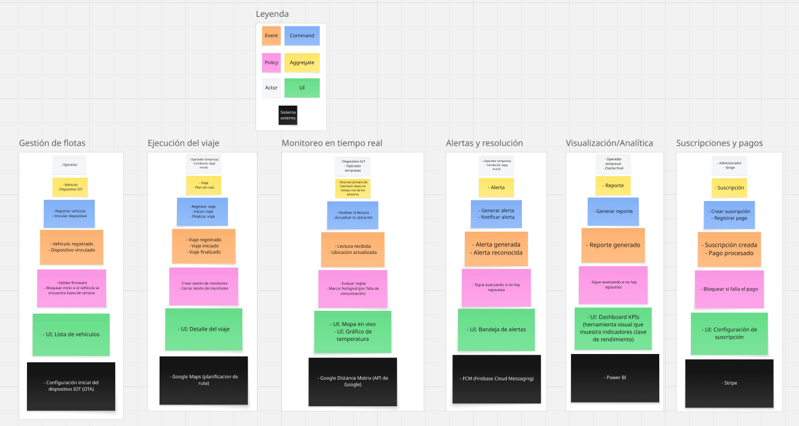

  

     
    
     
    <strong>Universidad Peruana de Ciencias Aplicadas</strong>
      
    <strong>Carrera de ingeniería de Software</strong>
      
    <strong>Ciclo 202520</strong>
      
    1ASI0572 - Desarrollo de Soluciones IOT
      
    <strong>NRC:</strong> 3443   
    <strong>Profesor:</strong> Velásquez Núñez, Angel Augusto   
    <strong>Informe de Trabajo Final</strong>
  

  

    

      <strong>Startup:</strong> Los Parkers 
       
      <strong>Producto:</strong> Macetech
    

  

      <strong>Relación de integrantes</strong>
        
      <table style="width: 60%; margin: 0 auto;   text-align: left">
        <thead>
          <tr>
            <th>Código</th>
            <th>Nombre</th>
          </tr>
        </thead>
        <tbody>
          <tr>
            <td>u20201c410</td>
            <td>Garro Vega, Marcelo Fabian</td>
          </tr>
          <tr>
            <td>u202113324</td>
            <td>Sanchez Ignacio, Jefrey Martin</td>
          </tr>
          <tr>
            <td>u20211c273</td>
            <td>Aliaga Pimentel, George Arturo</td>
          </tr>
        </tbody>
      </table>
      

         
        <strong>Agosto 2025</strong>
      

    

  

---

# Capítulo I: Introducción

## 1.1. Startup Profile

### 1.1.1. Descripción de la Startup

### 1.1.2. Perfiles de integrantes del equipo

## 1.2. Solution Profile

### 1.2.1. Antecedentes y problemática

### What (¿Qué?)
El transporte de mercancías sensibles a la temperatura y las condiciones ambientales sigue siendo un desafío logístico global. Una falla en la cadena de frío o la falta de visibilidad en el recorrido de una carga puede resultar en un deterioro significativo del producto. Según estudios recientes, la industria de alimentos y bebidas en Estados Unidos reportó pérdidas de más de $6 millones de dólares anuales por empresa en 2022, principalmente debido a daños, pérdidas y retrasos en el transporte (Flock Freight, 2023). En el sector farmacéutico, se proyecta que el mercado de logística de cadena de frío para productos como vacunas y biológicos crecerá en $12.81 mil millones de dólares entre 2024 y 2028, lo que subraya la criticidad de mantener la integridad de estos productos durante su tránsito (Technavio, 2024).

### Who (¿Quién?)
Este problema impacta a tres actores clave:

1. Empresas transportistas y de logística: Enfrentan el riesgo financiero de pérdidas de carga, reclamos de clientes y el daño a su reputación por entregas fallidas.

2. Productores y distribuidores: Asumen los costos de la mercancía dañada, la ineficiencia operativa y la potencial pérdida de clientes.

3. El cliente final: Se ve afectado al recibir productos en mal estado, caducados o, en el caso de medicamentos, que han perdido su efectividad, lo cual representa un riesgo para la salud y la seguridad.

### Where (¿Dónde?)
La problemática se manifiesta a lo largo de toda la cadena de suministro, desde el almacén de origen hasta la entrega final. Es particularmente crítica en los tramos de larga distancia (transporte terrestre, aéreo y marítimo) y en los "puntos de transferencia" entre diferentes vehículos o almacenes, donde la supervisión manual es más difícil. La adopción de tecnologías de monitoreo es una tendencia global que se acelera en mercados con infraestructura logística desarrollada y una creciente demanda de comercio electrónico.

### When (¿Cuándo?)
La necesidad de visibilidad en tiempo real se ha intensificado desde la pandemia de COVID-19, la cual puso de manifiesto la vulnerabilidad de las cadenas de suministro. El aumento del transporte de productos médicos y la expectativa de los consumidores por entregas rápidas y transparentes han impulsado la demanda de soluciones tecnológicas. Hoy en día, la mayoría de los clientes esperan poder rastrear sus pedidos en tiempo real, lo que convierte la visibilidad de la carga en un estándar de mercado, no solo una ventaja competitiva (Perfect Planner, 2025).

### Why (¿Por qué?)
La principal causa de esta problemática es la falta de información oportuna. Las empresas no tienen acceso a datos críticos sobre la temperatura, ubicación o condiciones de su carga en el momento en que ocurren las desviaciones. Esto impide la toma de acciones correctivas inmediatas, como ajustar el termostato de un camión, cambiar una ruta o notificar al cliente sobre un posible retraso. Sin esta visibilidad, los problemas solo se descubren al final del trayecto, cuando ya es demasiado tarde para evitar la pérdida del producto.

### How (¿Cómo?)
Actualmente, el monitoreo se realiza con métodos ineficientes o no integrados. Muchas empresas aún dependen de registradores de datos manuales que requieren ser revisados al final del viaje o utilizan múltiples sistemas (GPS para ubicación, sensores para temperatura) que no se comunican entre sí. Esta fragmentación reduce la eficiencia operativa y aumenta el riesgo de errores humanos. La falta de una plataforma integral que centralice toda la información limita la capacidad de las empresas para optimizar sus rutas, gestionar riesgos y, en última instancia, ofrecer un servicio de alta calidad (Bogdanov, 2024).

### How much (¿Cuánto?)
El impacto de la falta de un monitoreo efectivo es funcional, operativo y estratégico. Las empresas pierden tiempo y recursos reubicando información o lidiando con problemas logísticos que podrían haberse evitado. Operativamente, esta deficiencia se traduce en mayores costos de seguro y en gastos asociados al desperdicio de productos. Desde una perspectiva de negocio, esta brecha representa una oportunidad clara para monetizar al ofrecer una solución de valor que mejore la fidelización del cliente y construya una reputación de confiabilidad, lo que constituye una ventaja competitiva en el mercado.

### 1.2.2. Lean UX Process

#### 1.2.2.1. Lean UX Problem Statements

Nuestra solución busca proveer a las empresas de transporte y a sus clientes con una plataforma tecnológica integral que les permita monitorear el estado de sus cargas en tiempo real, garantizando la seguridad, calidad y eficiencia de la cadena de suministro. Buscamos que las empresas no sufran pérdidas económicas o daños a su reputación por falta de control, facilitando exponencialmente la supervisión de sus activos críticos, especialmente cuando se trata de productos sensibles que requieren condiciones específicas como temperatura o humedad.

Hemos observado que nuestros usuarios, al no tener una plataforma en la cual puedan monitorear la carga en un solo lugar, tienen un problema para estructurar el control de sus activos y guardarlo en un solo lugar, causando que a través de diferentes plataformas o métodos tradicionales guarden sus diferentes recursos, causando además un desorden e incluso pérdida de algunos de estos datos.

¿Cómo podemos ofrecer una plataforma para que las empresas y sus clientes puedan visualizar de forma organizada la información de la carga?

Hemos notado que las empresas que contratan servicios de transporte refrigerado desean tener visibilidad completa sobre el estado de sus productos. Esta necesidad se presenta normalmente en industrias donde el producto final es perecedero o de alto valor, y el cliente requiere una verificación constante para asegurar que su mercancía llegará en perfectas condiciones.

¿Cómo podemos crear una plataforma que mejore la eficiencia y transparencia para todos los actores de la cadena de suministro?

Hemos notado que las plataformas que usan las empresas para el monitoreo de cargas no están diseñadas para la simplicidad, tienen un diseño poco atractivo y cuentan con interfaces poco intuitivas o limitan las acciones que se pueden realizar dentro de la misma para algunos usuarios.

¿Cómo podemos diseñar una solución que sea intuitiva y fácil de usar, sin importar el nivel de conocimiento tecnológico del usuario?

#### 1.2.2.2. Lean UX Assumptions

#### 1.2.2.3. Lean UX Hypothesis Statements

#### 1.2.2.4. Lean UX Canvas

## 1.3. Segmentos objetivo

# Capítulo II: Requirements Elicitation & Analysis

## 2.1. Competidores

### 2.1.1. Análisis competitivo

### 2.1.2. Estrategias y tácticas frente a competidores

## 2.2. Entrevistas

### 2.2.1. Diseño de entrevistas

### 2.2.2. Registro de entrevistas

### 2.2.3. Análisis de entrevistas

## 2.3. Needfinding

### 2.3.1. User Personas

### 2.3.2. User Task Matrix

### 2.3.3. User Journey Mapping

### 2.3.4. Empathy Mapping

## 2.4. Big Picture EventStorming

## 2.5. Ubiquitous Language

# Capítulo III: Requirements Specification

## 3.1. User Stories

## 3.2. Impact Mapping

## 3.3. Product Backlog

# Capítulo IV: Solution Software Design

## 4.1. Strategic-Level Domain-Driven Design

### 4.1.1. Design-Level EventStorming

## 4.1.1.1 Candidate Context Discovery

Para esta etapa se llevó a cabo una sesión, la sesión tuvo una duración aproximada de 90 minutos y permitió identificar los bounded contexts del sistema CargaSafe. Durante el proceso se aplicaron las técnicas start-with-value, start-with-simple y look-for-pivotal-events, que facilitaron la agrupación de eventos y entidades según su afinidad y valor para el negocio.  

Como resultado, se identificaron cinco bounded contexts:  
- **Gestión de flotas**: gestión de vehículos y dispositivos IoT.  
- **Ejecución del viaje**: creación y ejecución de viajes.  
- **Monitoreo en tiempo real**: monitoreo de condiciones en tiempo real.
- **Alertas y resolución**: generación de alertas. 
- **Dashboard y Analíticas**: visualización de métricas y reportes.  
- **Suscripciones y pagos**: gestión de suscripciones y pagos con Stripe.  

  

### Leyenda utilizada en el EventStorming  
- 🟧 **Event**: describe algo que ocurrió en el dominio (Viaje iniciado, Alerta generada).  
- 🟦 **Command**: una instrucción o acción que dispara un evento (Registrar viaje).  
- 🟪 **Policy**: regla de negocio que determina qué ocurre ante ciertas condiciones (Si falta dispositivo → bloquear inicio del viaje).  
- 🟨 **Aggregate**: entidad principal que concentra datos y operaciones (Viaje, Suscripción).  
- 🟩 **UI**: vistas o pantallas del sistema que muestran información al usuario (Dashboard de KPIs).  
- ⚪ **Actor**: roles que interactúan con el sistema (Operador, Conductor).  
- ⬛ **Sistema externo**: integraciones con servicios de terceros (Google Maps, Stripe).  

Con esta estructura, el EventStorming permitió organizar y simplificar el dominio de CargaSafe, evidenciando de forma clara los contextos candidatos y la interacción entre actores, procesos y sistemas externos.  

[Ver gráfico en Miro](https://miro.com/app/board/uXjVJMskjeA=/?share_link_id=697373503273)

#### 4.1.1.1. Candidate Context Discovery

#### 4.1.1.2. Domain Message Flows Modeling

#### 4.1.1.3. Bounded Context Canvases

### 4.1.2. Context Mapping

### 4.1.3. Software Architecture

#### 4.1.3.1. Software Architecture System Landscape Diagram

#### 4.1.3.2. Software Architecture Context Level Diagrams

#### 4.1.3.2. Software Architecture Container Level Diagrams

#### 4.1.3.3. Software Architecture Deployment Diagrams

## 4.2. Tactical-Level Domain-Driven Design

### 4.2.1. Bounded Context: `<Bounded Context Name>`

#### 4.2.1.1. Domain Layer

#### 4.2.1.2. Interface Layer

#### 4.2.1.3. Application Layer

#### 4.2.1.4. Infrastructure Layer

#### 4.2.1.5. Bounded Context Software Architecture Component Level Diagrams

#### 4.2.1.6. Bounded Context Software Architecture Code Level Diagrams

##### 4.2.1.6.1. Bounded Context Domain Layer Class Diagrams

##### 4.2.1.6.2. Bounded Context Database Design Diagram

# Bibliografía  

Bogdanov, V. (2024, 23 octubre). _Real-Time Supply Chain Visibility: a Game-Changer_. rinf.tech. https://www.rinf.tech/real-time-supply-chain-visibility-a-game-changer/

_Flock Freight | 2023 F&B Research Study._ (s. f.). https://www.flockfreight.com/2023-food-beverage-research-study

Perfectplanner. (2025, 30 enero). _Enhancing Supply Chain Visibility through Real-Time Tracking Technologies._ Perfect Planner. https://perfectplanner.io/enhancing-supply-chain-visibility/

Technavio. (2024, 27 marzo). Cold Chain Logistics Market For Pharmaceuticals Industry size is set to grow by USD 12.81 bn from 2024-2028, Agility Public Warehousing Co. K.S.C.P, Air Canada & AVINEX, and more to emerge as Some of the Key Vendors, Technavio. PR Newswire. https://www.prnewswire.com/news-releases/cold-chain-logistics-market-for-pharmaceuticals-industry-size-is-set-to-grow-by-usd-12-81-bn-from-2024-2028--agility-public-warehousing-co-kscp-air-canada--avinex-and-more-to-emerge-as-some-of-the-key-vendors-technavio-302099252.html
