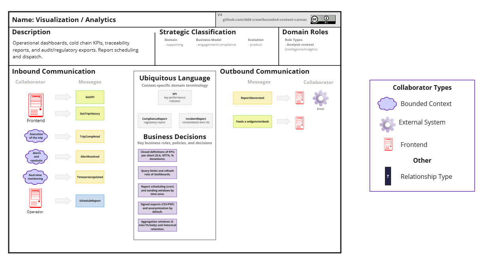
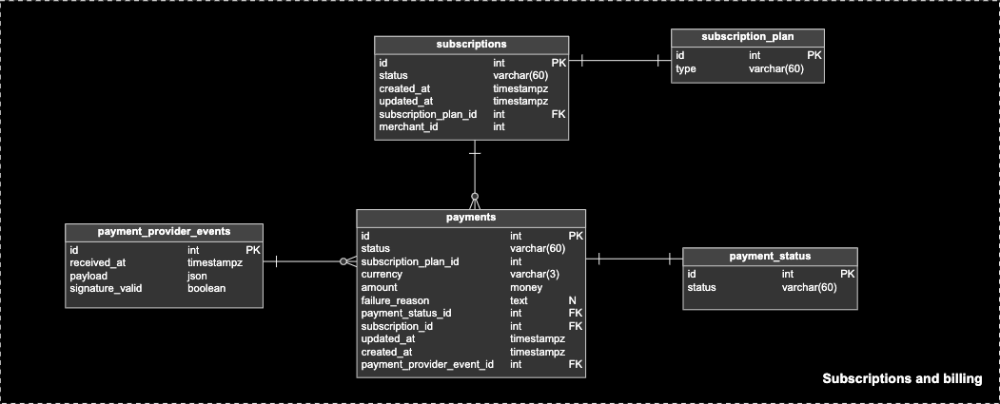
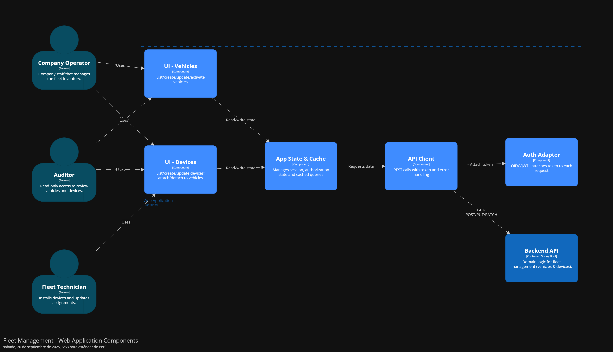
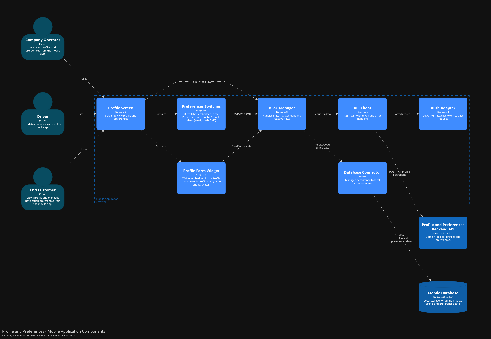

  

     
    
     
    <strong>Universidad Peruana de Ciencias Aplicadas</strong>
      
    <strong>Carrera de ingeniería de Software</strong>
      
    <strong>Ciclo 202520</strong>
      
    1ASI0572 - Desarrollo de Soluciones IOT
      
    <strong>NRC:</strong> 3443   
    <strong>Profesor:</strong> Velásquez Núñez, Angel Augusto   
    <strong>Informe de Trabajo Final</strong>
  

  

    

      <strong>Startup:</strong> Los Parkers 
       
      <strong>Producto:</strong> CargoSafe
    

  

      <strong>Relación de integrantes</strong>
        
      <table style="width: 60%; margin: 0 auto;   text-align: left">
        <thead>
          <tr>
            <th>Código</th>
            <th>Nombre</th>
          </tr>
        </thead>
        <tbody>
          <tr>
            <td>u20201c410</td>
            <td>Garro Vega, Marcelo Fabian</td>
          </tr>
          <tr>
            <td>u202113324</td>
            <td>Sanchez Ignacio, Jefrey Martin</td>
          </tr>
          <tr>
            <td>u20211c273</td>
            <td>Aliaga Pimentel, George Arturo</td>
          </tr>
          <tr>
            <td>u202113640</td>
            <td>Bernardo Eusebio Alessandro Joaquin</td>
          </tr>
          <tr>
            <td>u202019577</td>
            <td>Chirinos Arevalo Daniel Rodrigo</td>
          </tr>
          <tr>
            <td>u202214869</td>
            <td>Vera Nuñez Nicolas Alejandro</td>
          </tr>
        </tbody>
      </table>
      

         
        <strong>Agosto 2025</strong>
      

    

  

# Registro de Versiones del Informe

| Versión | Fecha      | Autor                   | Descripción de modificación                                                                                                                                                                                                                                                                                                                              |
| ------- | ---------- | ----------------------- | -------------------------------------------------------------------------------------------------------------------------------------------------------------------------------------------------------------------------------------------------------------------------------------------------------------------------------------------------------- |
| 1.0     | 20/09/2025 | George | Se entregó una primera entrega del informe con los siguientes apartados: Carátula, Registro de Versiones, Project Report Collaboration Insights, Contenido, Student Outcome, Capítulo I: Introducción, Capítulo II: Requirements Elicitation & Analysis, Capítulo III: Requirements Specification, Capítulo IV: Solution Software Design y Bibliografía. |
| 1.2     | 13/09/2025 | Daniel y Marcelo | Se añadió el capitulo 3 que es en base al product backlog que se trabajará en el proyecto |
| 1.3     | 12/09/2025 | Jefrey y Nicolas | Se añadió el capitulo 4 que es en base a las soluciones en diseño del software que trabajaremos en el proyecto |
---

# Project Report Collaboration Insights

En esta sección, se registra las colaboraciones realizadas por los miembros del equipo durante el desarrollo del informe del proyecto. En primer lugar, se brinda el enlace del repositorio del reporte del proyecto en la plataforma GitHub.

-**Project Report:** https://github.com/Los-Parkers-IoT/LosParkers-report

A continuación, se explicará todo a cerca del desarrollo de activades para la elaboración del informe. Adicionalmente, se presentan las métricas de las acciones del equipo del Project Report de cada entrega correspondiente en forma de contribuciones, commits y network graph registrados en GitHub.

## TB1 Project Report Collaboration Insights

Para la entrega del TB1 se realizaron las actividades necesarias para completar los capítulos I, II, III y IV, resaltando la importancia de la constancia en el trabajo. Como equipo, mantuvimos una frecuencia adecuada de commits y actualizaciones, proyectada como óptima para el desarrollo futuro, y se incluyen en el informe las evidencias de los cambios efectuados.

_Vista general de las contribuciones del equipo_

_Contribuciones de cada miembro del equipo para la TB1_

_Commits_

_Network Graph_

De las contribuciones del equipo y commits se concluye lo siguiente:

- Para esta entrega, se han realizado un total de **262 commits** aproximadamente por parte del equipo.

- La mayor concentración de commits se dio en la semana del 15 de septiembre, alcanzando aproximadamente 200 contribuciones.

- El equipo considera que hubo falta de organización durante la realización de la TB1.

Para el control de versiones, decidimos emplear **6 ramas principales**:

<b> main </b> : Esta rama se mantiene como un reflejo del documento en su última versión estable. El estado del documento será listo para entregar.

<b> chapter-1, chapter-2, chapter-3 y chapter-4 </b>: Estas ramas permiten integrar los artefactos solicitados por capítulo. Se trabaja de esta manera para asegurar una integración controlada, una colaboración enfocada y un aislamiento de cambios.

<b> chapter-1-2-3-4 </b>: Esta rama funciona como zona de integración pre-producción donde se consolidan y revisan todos los capítulos antes de fusionarlos a `main`. Permite realizar pruebas de integración completas, verificar la coherencia entre capítulos y realizar ajustes finales sin afectar la rama principal. Actúa como un paso intermedio de validación antes del merge final.

---

# Student Outcome

El curso contribuye de manera directa al desarrollo y cumplimiento del Student Outcome 5 definido por ABET – EAC, asegurando que los estudiantes alcancen las competencias establecidas en dicho resultado.

Criterio: La capacidad de funcionar efectivamente en un equipo cuyos miembros juntos proporcionan liderazgo, crean un entorno de colaboración e inclusivo, establecen objetivos, planifican tareas y cumplen objetivos. En el siguiente cuadro se describe las acciones realizadas y enunciados de conclusiones por parte del grupo, que permiten sustentar el haber alcanzado el logro del ABET – EAC - Student Outcome 5.

<table>
  <thead>
    <tr>
      <th class="outcome-column">Criterio Específico</th>
      <th class="details-column">
        Acciones Realizadas por Miembro (por Avance)
      </th>
      <th class="final-comment-column">Conclusiones del Equipo</th>
    </tr>
  </thead>
  <tbody>
    <tr>
      <td>Trabaja en equipo para proporcionar liderazgo conjunto</td>
      <td>
        Marcelo Fabian Garro Vega 
        TB1: 
        Durante este avance del proyecto, participé activamente en reuniones presenciales y virtuales, donde contribuí con ideas clave para definir el flujo de negocio, fomentando así la claridad y el consenso entre todos los miembros del equipo. También participé activamente en la elaboración de la arquitectura de software y en el diseño táctico siguiendo los principios de Domain Driven Design.    Jefrey Sanchez Ignacio 
        TB1: 
        Durante este avance contribuí a mantener un entorno colaborativo al apoyar en la documentación del Domain Layer, describiendo de manera clara las entidades, value objects y servicios de dominio. Además, participé en la definición de metas de la iteración y en la organización de tareas, lo que permitió que el equipo trabajara con orden, alcanzara los objetivos propuestos y mantuviera consistencia con las guías establecidas por el líder del grupo.  
         Daniel Rodrigo Chirinos Arevalo 
        TB1: 
        Participé en reuniones virtuales y presenciales, aportando ideas sobre cómo abordar el proyecto y colaborando con mis compañeros para tomar decisiones clave respecto al caso propuesto. Además, elaboré de manera colaborativa los user stories y los diagramas de clase y C4. Para ello, realizamos reuniones de planificación y coordinación para asegurar el acuerdo sobre el desarrollo de estos diagramas.   
         Alessandro Joaquin Bernardo Eusebio 
        TB1: 
        Durante este avance del proyecto, participé activamente en reuniones presenciales y virtuales, aportando ideas clave para definir el flujo de negocio y la estructura de la solución. Colaboré en la elaboración de la arquitectura de software y en el diseño táctico bajo los principios de Domain Driven Design, asegurando claridad y consenso entre los miembros del equipo. Además, contribuí en la documentación de los artefactos de usuario y en la organización de tareas, promoviendo un entorno colaborativo y alineado con los objetivos del proyecto. 
         Vera Nuñez Nicolas Alejandro 
        TB1: 
        Participé de manera activa en reuniones virtuales y presenciales, aportando propuestas relevantes para la definición de la arquitectura de software del Fleet Management. Lideré la elaboración de los diagramas C4 (contexto, contenedores y componentes) y colaboré en el diseño táctico bajo los principios de Domain Driven Design (DDD). Asimismo, contribuí en la identificación y documentación de los Bounded Contexts, garantizando una delimitación clara y consistente del sistema, y elaboré el Bounded Context Canvases, facilitando la comprensión de las responsabilidades y alcances de cada contexto.     
         Sanchez Ignacio, Jefrey Martin 
        TP: 
        Durante esta etapa asumí un rol más activo en la coordinación del equipo. Ayudé a tomar decisiones sobre la estructura del Bounded Context Subscriptions. También estuve pendiente del avance en general, dando sugerencias y asegurándome de que todos sigamos las mismas pautas técnicas. 
      </td>
      <td class="conclusions-column">
      TB1: 
        A lo largo del proyecto asumimos un liderazgo compartido, distribuyendo responsabilidades y tomando decisiones en conjunto. Cada uno de nosotros aportó ideas y conocimientos que permitieron definir con claridad el flujo de negocio, la arquitectura y los artefactos necesarios bajo los principios de Domain Driven Design. Esta forma de trabajo nos ayudó a consolidar una visión común y avanzar con mayor seguridad en cada fase.
      </td>
    </tr>
    <tr>
      <td>
        Crea un entorno colaborativo e inclusivo, establece metas, planifica
        tareas y cumple objetivos.
      </td>
      <td>
        Marcelo Fabian Garro Vega 
        TB1: Durante el desarrollo del proyecto, me enfoqué en fomentar un entorno colaborativo e inclusivo dentro del equipo, promoviendo la participación activa de todos los miembros mediante el envío constante de retroalimentaciones constructivas. Contribuí a la estimación de story points y a la planificación de user y technical stories, considerando el valor que estas aportan al negocio. Para ello, tomé en cuenta las opiniones de mis compañeros, lo cual permitió definir metas claras, planificar de manera efectiva y cumplir con los objetivos propuestos bajo los principios de Domain Driven Design.     Jefrey Sanchez Ignacio 
        TB1: 
        Durante este avance contribuí a mantener un entorno colaborativo al apoyar en la documentación del Domain Layer, describiendo de manera clara las entidades, value objects y servicios de dominio. Además, participé en la definición de metas de la iteración y en la organización de tareas, lo que permitió que el equipo trabajara con orden, alcanzara los objetivos propuestos y mantuviera consistencia con las guías establecidas por el líder del grupo.    Daniel Rodrigo Chirinos Arevalo 
        TB1: 
        Estuve enfocado en fomentar un ambiente de colaboración dentro del equipo. Trabajé en conjunto con mis compañeros para definir los objetivos y tareas del proyecto. Colaboré en el análisis competitivo y en la definición de segmentos clave como el de gestion de transportes y clientes finales. Además, me encargué de crear user stories e impact mapping para estos segmentos, asegurando que el desarrollo del producto estuviera alineado con las necesidades del usuario. Cada semana establecí un límite personal para realizar las secciones de cada capítulo, de esta forma me aseguré de que todas las tareas estuvieran bien organizadas y distribuidas para cumplir con los objetivos establecidos.  
         Alessandro Joaquin Bernardo Eusebio 
        TB1: Durante el desarrollo del proyecto, me enfoqué en fomentar un entorno colaborativo e inclusivo, promoviendo la participación activa de todos los miembros mediante retroalimentación constante y constructiva. Contribuí a la estimación de story points y a la planificación de user y technical stories, considerando el valor que aportan al negocio. Participé en la definición de metas y organización de tareas, asegurando que el equipo trabajara con orden y alcanzara los objetivos propuestos bajo los principios de Domain Driven Design. 
         Vera Nuñez Nicolas Alejandro 
        TB1: 
        Promoví un entorno colaborativo mediante la coordinación de los artefactos de arquitectura y la integración de los diagramas en el informe. Contribuí en la planificación de tareas técnicas vinculadas a la arquitectura de software, asegurando la consistencia de los entregables y su alineación con los objetivos del proyecto. Además, facilité retroalimentación constructiva, incentivando la participación activa de todos los miembros del equipo.     
         Sanchez Ignacio, Jefrey Martin 
        TP: 
        En este trabajo parcial participé en la parte del Bounded Context de CargaSafe, ayudando en la conexión entre la vista y la API con json-server. Me encargué de implementar componentes con Angular Material y asegurar que el diseño se mantenga ordenado y coherente con el resto del proyecto. 
      </td>
      <td class="conclusions-column">
      TB1: 
        Durante el desarrollo creamos un entorno colaborativo e inclusivo en el que cada aporte fue escuchado y valorado. Establecimos metas claras, organizamos tareas de manera conjunta y planificamos los avances para asegurar el cumplimiento de los objetivos. Gracias a la comunicación constante y al compromiso colectivo, conseguimos mantener la cohesión del grupo, garantizar la calidad de los entregables y alcanzar los resultados propuestos.
      </td>
    </tr>
  </tbody>
</table>

---

# Capítulo I: Introducción

## 1.1. Startup Profile

### 1.1.1. Descripción de la Startup

Los Parkers es una startup innovadora, especializada en el desarrollo de soluciones tecnológicas de monitoreo y trazabilidad para el sector logístico y de transporte. Surge de la iniciativa de un equipo multidisciplinario de estudiantes de la Universidad Peruana de Ciencias Aplicadas, quienes comparten una visión común: transformar la manera en que se gestionan y se supervisan las cadenas de suministro de productos sensibles, utilizando tecnología IoT.

Los Parkers se distingue por su enfoque centrado en el usuario, trabajando de forma colaborativa con profesionales del ámbito de la logística para diseñar plataformas intuitivas, inteligentes y adaptadas a las necesidades reales de la industria. Su equipo combina conocimientos técnicos de vanguardia en IoT con una comprensión profunda de los desafíos actuales en materia de cadena de frío, trazabilidad de productos y gestión de riesgos.

Entre sus principales productos destaca CargaSafe, una solución integral que permite a las empresas de transporte y a sus clientes monitorear en tiempo real las condiciones de sus cargas, generando reportes y alertas automáticas respaldadas por tecnología inteligente. Los Parkers emplea metodologías ágiles y tecnologías modernas para garantizar que sus soluciones sean robustas, escalables y capaces de evolucionar con las necesidades del mercado. Además, la empresa ofrece soporte continuo y mejora constante a sus plataformas, priorizando siempre la experiencia del usuario.

**Visión:** La visión de Los Parkers es convertirse en líder global en el desarrollo de soluciones tecnológicas aplicadas a la logística y la cadena de suministro, empoderando a las empresas para que tomen decisiones más eficientes, informadas y seguras.

**Misión:** La misión de Los Parkers es diseñar y desarrollar herramientas digitales innovadoras, accesibles y personalizadas que contribuyan a mejorar la eficiencia, la transparencia y la seguridad en el transporte de mercancías

### 1.1.2. Perfiles de integrantes del equipo

<table width="100%">
  <tr>
    <td rowspan="4" align="center" width="25%">
      
    </td>
    <td align="left">
      <b>Nombre y Apellido:</b> 
      Marcelo Fabian Garro Vega
    </td>
  </tr>
  <tr>
    <td align="left">
      <b>Código:</b> 
      u20201c410
    </td>
  </tr>
  <tr>
    <td align="left">
      <b>Carrera:</b> 
      Ingeniería de Software
    </td>
  </tr>
  <tr>
    <td align="left">
      <b>Acerca de:</b> 
      Soy un estudiante de 22 años apasionado por el desarrollo web y móvil, con un enfoque especial en la experiencia de usuario y el diseño de interfaces (UX/UI). Me especializo en el desarrollo Frontend, siempre buscando crear aplicaciones intuitivas y funcionales. Mi objetivo es aportar tanto en el ámbito creativo como en el técnico, para contribuir al diseño y construcción de soluciones de software que generen impacto real.
    </td>
  </tr>
</table>

 

<table width="100%">
  <tr>
    <td rowspan="4" align="center" width="25%">
      
    </td>
    <td align="left">
      <b>Nombre y Apellido:</b> 
      Jefrey Martin Sanchez Ignacio
    </td>
  </tr>
  <tr>
    <td align="left">
      <b>Código:</b> 
      U202113324
    </td>
  </tr>
  <tr>
    <td align="left">
      <b>Carrera:</b> 
      Ingeniería de Software
    </td>
  </tr>
  <tr>
    <td align="left">
      <b>Acerca de:</b> 
      Actualmente cursando el octavo ciclo de mi carrera, Soy una persona responsable, proactiva. Espero aprender mucho del curso y sobretodo de este proyecto.
    </td>
  </tr>
</table>

 

<table width="100%">
  <tr>
    <td rowspan="4" align="center" width="25%">
      
    </td>
    <td align="left">
      <b>Nombre y Apellido:</b> 
      George Arturo Aliaga Pimentel
    </td>
  </tr>
  <tr>
    <td align="left">
      <b>Código:</b> 
      U20211c273
    </td>
  </tr>
  <tr>
    <td align="left">
      <b>Carrera:</b> 
      Ingeniería de Software
    </td>
  </tr>
  <tr>
    <td align="left">
      <b>Acerca de:</b> 
      Me llamo George Arturo Aliaga Pimentel y soy de la carrera de Ingeniería de Software. Estoy cursando el septimo ciclo. Me considero una persona cooperativa y responsable, lo cual es totalmente requerido para un proyecto grupal. Tengo la meta de ser un gran ingeniero y espero mejorar cada dia para lograr un buen desempeño en la carrera.
    </td>
  </tr>
</table>

 

<table width="100%">
  <tr>
    <td rowspan="4" align="center" width="25%">
      
    </td>
    <td align="left">
      <b>Nombre y Apellido:</b> 
      Nicolas Alejandro Vera Nuñez
    </td>
  </tr>
  <tr>
    <td align="left">
      <b>Código:</b> 
    u202214869
    </td>
  </tr>
  <tr>
    <td align="left">
      <b>Carrera:</b> 
        Ingeniería de Software
    </td>
  </tr>
  <tr>
    <td align="left">
      <b>Acerca de:</b> 
      Soy estudiante de la UPC, tengo 21 años. Estoy en la carrera de Ingeniería de Software, ya que, siempre me gustó la tecnología, el analisis de datos y el desarrollo web. Estoy cursando el 7mo ciclo de la carrera y mis habilidades son Angular, Java con Springboot, Docker, Python, HTML y JavaScript. También soy una persona analitica y que encuentra soluciones inovadoras a varios problemas.
    </td>
  </tr>
</table>

 

<table width="100%">
  <tr>
    <td rowspan="4" align="center" width="25%">
      
    </td>
    <td align="left">
      <b>Nombre y Apellido:</b> 
      Daniel Rodrigo Chirinos Arevalo
    </td>
  </tr>
  <tr>
    <td align="left">
      <b>Código:</b> 
      202019577
    </td>
  </tr>
  <tr>
    <td align="left">
      <b>Carrera:</b> 
      Ingenería de Software
    </td>
  </tr>
  <tr>
    <td align="left">
      <b>Acerca de:</b> 
      Me llamo Daniel Chirinos Arevalo y soy de la carrera de Ingeniería de 
      Software. Mi experiencia en la universidad es bastante normal y me encuentro 
      cursando el sexto ciclo. A lo largo del tiempo, sí que tuve algunas dificultades 
      con algunos cursos, pero logré enfrentarlos. Mi habilidad es ser líder en 
      algunas ocasiones, trabajar con tiempo y lo más importante, ser siempre 
      amistoso con el equipo.
    </td>
  </tr>
</table>

 

<table width="100%">
  <tr>
    <td rowspan="4" align="center" width="25%">
      
    </td>
    <td align="left">
      <b>Nombre y Apellido:</b> 
      Bernardo Eusebio Alessandro Joaquin
    </td>
  </tr>
  <tr>
    <td align="left">
      <b>Código:</b> 
      u202113640
    </td>
  </tr>
  <tr>
    <td align="left">
      <b>Carrera:</b> 
      Ingenieria de software
    </td>
  </tr>
  <tr>
    <td align="left">
      <b>Acerca de:</b> 
      Soy Alessandro Joaquin Bernardo Eusebio, estudiante de la carrera de Ingeniería de software. Actualmente estoy bastante orgulloso del progreso que tengo actualmente aprendiendo tanto dentro de la facultad como en mi experiencia autonoma y en el trabajo. Me inclino mas a ser un analista de datos y ampliar mis conocimientos sobre Machine Learning, modelos predicitvos y AWS.
    </td>
  </tr>
</table>

## 1.2. Solution Profile

### 1.2.1. Antecedentes y problemática

### What (¿Qué?)

El transporte de mercancías enfrenta un reto transversal: monitorear de forma continua y verificable las condiciones reales del cargamento durante todo el trayecto. Más allá del simple rastreo de ubicación, las cargas pueden sufrir manipulaciones no autorizadas, aperturas de puerta, golpes, vibraciones, humedad, exposición a ambientes no controlados, desvíos de ruta, retrasos y pérdidas de custodia. La ausencia de evidencia objetiva y en tiempo real sobre estos eventos se traduce en daños, mermas, disputas entre actores de la cadena y costos operativos crecientes.
En la práctica, gran parte de la visibilidad actual se limita a hitos administrativos (salida/arribo) o a sistemas aislados de geolocalización. Esto deja zonas ciegas respecto al estado físico y a la integridad del embalaje en tramos críticos (esperas, transbordos y handoffs entre operadores). Para retail, agro, farmacéutico, pesquero y consumo masivo, contar con telemetría de condiciones del cargamento—incluyendo eventos de integridad, incidencias y evidencias auditables—es ya un requisito para reducir pérdidas, acelerar conciliaciones y sostener SLA con clientes y aseguradoras.

### Who (¿Quién?)

Este problema impacta a dos actores clave:

1. Empresas transportistas y de logística: Enfrentan el riesgo financiero de pérdidas de carga, reclamos de clientes y el daño a su reputación por entregas fallidas.

2. El cliente final: Se ve afectado al recibir productos en mal estado, caducados o, en el caso de medicamentos, que han perdido su efectividad, lo cual representa un riesgo para la salud y la seguridad.

### Where (¿Dónde?)

La problemática se manifiesta a lo largo de toda la cadena de suministro, desde el almacén de origen hasta la entrega final. Es particularmente crítica en los tramos de larga distancia (transporte terrestre, aéreo y marítimo) y en los "puntos de transferencia" entre diferentes vehículos o almacenes, donde la supervisión manual es más difícil. La adopción de tecnologías de monitoreo es una tendencia global que se acelera en mercados con infraestructura logística desarrollada y una creciente demanda de comercio electrónico.

### When (¿Cuándo?)

La necesidad de visibilidad en tiempo real se ha intensificado desde la pandemia de COVID-19, la cual puso de manifiesto la vulnerabilidad de las cadenas de suministro. El aumento del transporte de productos médicos y la expectativa de los consumidores por entregas rápidas y transparentes han impulsado la demanda de soluciones tecnológicas. Hoy en día, la mayoría de los clientes esperan poder rastrear sus pedidos en tiempo real, lo que convierte la visibilidad de la carga en un estándar de mercado, no solo una ventaja competitiva (Perfect Planner, 2025).

### Why (¿Por qué?)

La principal causa de esta problemática es la falta de información oportuna. Las empresas no tienen acceso a datos críticos sobre la temperatura, ubicación o condiciones de su carga en el momento en que ocurren las desviaciones. Esto impide la toma de acciones correctivas inmediatas, como ajustar el termostato de un camión, cambiar una ruta o notificar al cliente sobre un posible retraso. Sin esta visibilidad, los problemas solo se descubren al final del trayecto, cuando ya es demasiado tarde para evitar la pérdida del producto.

### How (¿Cómo?)

Actualmente, el monitoreo se realiza con métodos ineficientes o no integrados. Muchas empresas aún dependen de registradores de datos manuales que requieren ser revisados al final del viaje o utilizan múltiples sistemas (GPS para ubicación, sensores para temperatura) que no se comunican entre sí. Esta fragmentación reduce la eficiencia operativa y aumenta el riesgo de errores humanos. La falta de una plataforma integral que centralice toda la información limita la capacidad de las empresas para optimizar sus rutas, gestionar riesgos y, en última instancia, ofrecer un servicio de alta calidad (Bogdanov, 2024).

### How much (¿Cuánto?)

El impacto de la falta de un monitoreo efectivo es funcional, operativo y estratégico. Las empresas pierden tiempo y recursos reubicando información o lidiando con problemas logísticos que podrían haberse evitado. Operativamente, esta deficiencia se traduce en mayores costos de seguro y en gastos asociados al desperdicio de productos. Desde una perspectiva de negocio, esta brecha representa una oportunidad clara para monetizar al ofrecer una solución de valor que mejore la fidelización del cliente y construya una reputación de confiabilidad, lo que constituye una ventaja competitiva en el mercado.

### 1.2.2. Lean UX Process

#### 1.2.2.1. Lean UX Problem Statements

Nuestra solución busca proveer a las empresas de transporte y a sus clientes con una plataforma tecnológica integral que les permita monitorear el estado de sus cargas en tiempo real, garantizando la seguridad, calidad y eficiencia de la cadena de suministro. Buscamos que las empresas no sufran pérdidas económicas o daños a su reputación por falta de control, facilitando exponencialmente la supervisión de sus activos críticos, especialmente cuando se trata de productos sensibles que requieren condiciones específicas como temperatura, humedad, o que son susceptibles a vibración y golpes.

Hemos observado que nuestros usuarios, al no tener una plataforma en la cual puedan monitorear la carga en un solo lugar, tienen un problema para estructurar el control de sus activos y guardarlo en un solo lugar, causando que a través de diferentes plataformas o métodos tradicionales guarden sus diferentes recursos, causando además un desorden e incluso pérdida de algunos de estos datos de temperatura, humedad, vibración y ubicación.

¿Cómo podemos ofrecer una plataforma para que las empresas y sus clientes puedan visualizar de forma organizada la información de la carga, consolidando todos los parámetros críticos?

Hemos notado que las empresas que contratan servicios de transporte desean tener visibilidad completa sobre el estado de sus productos. Esta necesidad se presenta normalmente en industrias donde el producto final es perecedero o de alto valor, y el cliente requiere una verificación constante para asegurar que su mercancía llegará en perfectas condiciones, protegiéndola no solo de cambios de temperatura, sino también de golpes o accidentes.

¿Cómo podemos crear una plataforma que mejore la eficiencia y transparencia para todos los actores de la cadena de suministro, proporcionando visibilidad sobre el estado completo de la carga?

Hemos notado que las plataformas que usan las empresas para el monitoreo de cargas no están diseñadas para la simplicidad, tienen un diseño poco atractivo y cuentan con interfaces poco intuitivas o limitan las acciones que se pueden realizar dentro de la misma para algunos usuarios.

¿Cómo podemos diseñar una solución que sea intuitiva y fácil de usar, sin importar el nivel de conocimiento tecnológico del usuario, a pesar de la complejidad de los múltiples datos que monitoreamos?

#### 1.2.2.2. Lean UX Assumptions

### Business Assumptions:

1. Creemos que hay una demanda significativa de soluciones de monitoreo accesibles que incluyan múltiples parámetros para el sector de transporte en Latinoamérica.

2. Creemos que las empresas estarán dispuestas a pagar una suscripción mensual por una solución que les permita reducir pérdidas y mejorar la confianza de sus clientes al tener control sobre múltiples variables.

3. Creemos que los dispositivos IoT de bajo costo pueden proporcionar la precisión necesaria para el monitoreo de la cadena de frío, además de vibración, ubicación y energía.

4. Creemos que la facilidad de uso es más importante que las funcionalidades avanzadas para nuestro mercado objetivo.

5. Creemos que un modelo de suscripción mensual es más atractivo que la compra de licencias perpetuas para nuestros usuarios.

6. Creemos que la inclusión de parámetros adicionales como humedad, vibración y volcado aumentará el valor percibido de nuestra solución.

### User Assumptions:

1. Nuestros usuarios principales son gerentes de operaciones y conductores de empresas de transporte de productos sensibles.

2. Los usuarios necesitan alertas inmediatas cuando se rompe la cadena de frío, hay vibraciones excesivas, o se detecta un volcado para tomar acciones correctivas.

3. Los usuarios quieren dashboards simples e intuitivos que muestren el estado completo de todos sus vehículos en una sola pantalla.

4. Los usuarios valoran la generación automática de reportes que incluyan todos los parámetros monitoreados para sus clientes.

5. Los usuarios prefieren soluciones que no requieran capacitación técnica extensiva.

### Feature Assumptions:

1. Creemos que el monitoreo en tiempo real de temperatura, humedad, vibración y ubicación es la funcionalidad más crítica.

2. Creemos que las alertas automáticas mediante la aplicación son fundamentales para eventos críticos como volcado y baja energía.

3. Creemos que la gestión de múltiples vehículos y activos desde una sola plataforma es fundamental.

4. Creemos que los reportes históricos son necesarios para el cumplimiento regulatorio y la trazabilidad.

5. Creemos que la integración con dispositivos IoT existentes ampliará nuestro mercado potencial.

#### 1.2.2.3. Lean UX Hypothesis Statements

#### Hypothesis 1:

<b> Creemos que </b> implementar un sistema de alertas en tiempo real por incumplimiento de parámetros de temperatura, humedad y volcado <b> para </b> empresas de transporte <b> resultará en </b> una reducción del 30% en pérdidas de productos y un aumento del 25% en la satisfacción del cliente. _Sabremos que esto es cierto cuando_ veamos una reducción mensurable en reportes de incidentes y recibamos feedback positivo de al menos el 80% de los usuarios.

#### Hypothesis 2:

<b> Creemos que </b> ofrecer dashboards intuitivos con visualización del estado completo de la flota (temperatura, humedad, vibración, ubicación) <b> para </b> gerentes de operaciones <b> resultará en </b> una mejora del 40% en la eficiencia operativa y tiempo de respuesta ante incidentes. _Sabremos que esto es cierto cuando_ observemos una reducción en el tiempo promedio de respuesta a alertas de más de 4 horas a menos de 30 minutos.

#### Hypothesis 3:

<b> Creemos que </b> implementar un modelo de suscripción flexible con diferentes niveles de servicio <b> para </b> PYMEs de transporte <b> resultará en </b> una adopción del 15% del mercado objetivo en el primer año. _Sabremos que esto es cierto cuando_ alcancemos 150 empresas suscritas activamente usando la plataforma.

#### Hypothesis 4:

<b> Creemos que </b> proporcionar reportes automatizados y trazabilidad completa <b> para </b> clientes finales de servicios de transporte <b> resultará en </b> un aumento del 20% en la retención de clientes de nuestros usuarios. _Sabremos que esto es cierto cuando_ nuestros usuarios reporten una reducción en cancelaciones de contratos y solicitudes de nuevos servicios.

#### 1.2.2.4. Lean UX Canvas

<table style="width: 100%; border-collapse: collapse; margin: 20px 0;">
  <tr>
    <td style="border: 2px solid #333; padding: 15px; width: 20%; vertical-align: top;">
      <strong>1. BUSINESS PROBLEM</strong>  
      Las empresas de transporte de productos sensibles necesitan soluciones accesibles para monitorear múltiples parámetros de la carga (temperatura, humedad, vibración, etc.) y evitar pérdidas económicas por incumplimiento de parámetros.
    </td>
    <td style="border: 2px solid #333; padding: 15px; width: 20%; vertical-align: top;">
      <strong>2. SOLUTION IDEAS</strong>  
      • Plataforma IoT de monitoreo en tiempo real (múltiples sensores) 
      • Sistema de alertas automáticas (vibración, volcado, energía, etc.) 
      • Dashboard intuitivo de gestión de flota 
      • Reportes automatizados de trazabilidad completa 
      • Modelo de suscripción escalable
    </td>
    <td style="border: 2px solid #333; padding: 15px; width: 20%; vertical-align: top;">
      <strong>3. BUSINESS OUTCOMES</strong>  
      • 150 empresas suscritas en año 1 
      • Reducción 30% pérdidas de clientes 
      • 80% satisfacción de usuarios 
      • Revenue recurrente de $180K anuales 
      • Expansión a 3 países LATAM
    </td>
  </tr>
  <tr>
    <td style="border: 2px solid #333; padding: 15px; width: 20%; vertical-align: top;">
      <strong>4. USERS</strong>  
      <strong>Primarios:</strong> 
      • Gerentes de operaciones de transporte 
      • Conductores de vehículos  
      <strong>Secundarios:</strong> 
      • Clientes finales de servicios de transporte 
      • Administradores de empresas de transporte
    </td>
    <td style="border: 2px solid #333; padding: 15px; width: 40%; vertical-align: top;">
      <strong>5. USER OUTCOMES & BENEFITS</strong>  
      <strong>Empresas de Transporte:</strong> 
      • Reducción de pérdidas por múltiples factores (temperatura, vibración, etc.) 
      • Mayor confianza de clientes 
      • Cumplimiento regulatorio automatizado 
      • Optimización de rutas y recursos  
      <strong>Clientes Finales:</strong> 
      • Visibilidad completa del estado de sus productos 
      • Reportes de trazabilidad en tiempo real 
      • Reducción de riesgos operativos
    </td>
    <td style="border: 2px solid #333; padding: 15px; width: 20%; vertical-align: top;">
      <strong>6. HYPOTHESES</strong>  
      <strong>Creemos que</strong> las PYMEs de transporte adoptarán una solución de monitoreo multiparamétrico si es accesible y fácil de usar.  
      <strong>Para validar</strong> desarrollaremos un MVP con funcionalidades core (temp, humedad, ubicación) y mediremos adoption rate.
    </td>
  </tr>
  <tr>
    <td style="border: 2px solid #333; padding: 15px; width: 20%; vertical-align: top;">
      <strong>7. WHAT'S THE MOST IMPORTANT THING WE NEED TO LEARN FIRST?</strong>  
      ¿Están las PYMEs de transporte dispuestas a pagar por una solución de monitoreo multiparamétrico IoT y cuál es el precio óptimo que maximiza adopción y rentabilidad?
    </td>
    <td style="border: 2px solid #333; padding: 15px; width: 20%; vertical-align: top;">
      <strong>8. WHAT'S THE LEAST AMOUNT OF WORK WE NEED TO DO TO LEARN THE NEXT MOST IMPORTANT THING?</strong>  
      • Desarrollar landing page con pricing y funcionalidades 
      • Realizar 20 entrevistas con empresas target 
      • Crear prototipo de dashboard con múltiples datos 
      • Validar willingness to pay con pre-orders
    </td>
    <td style="border: 2px solid #333; padding: 15px; width: 20%; vertical-align: top;">
      <strong>9. ASSUMPTIONS</strong>  
      • Demanda existe en mercado LATAM 
      • Precio $ 25-150/mes es aceptable 
      • Facilidad de uso > funcionalidades avanzadas 
      • Dispositivos IoT low-cost son suficientes 
      • Modelo de suscripción preferido vs. CAPEX
    </td>
  </tr>
</table>

## 1.3. Segmentos objetivo

### 1.3.1 Segmento 1: Empresas Clientes

Estas empresas, dedicadas a la logística, distribución o producción de bienes sensibles, necesitan un control exhaustivo sobre sus cargas para asegurar la calidad y evitar pérdidas económicas. Su objetivo es tener una visibilidad completa en tiempo real de sus productos, centralizando toda la información en una sola plataforma para optimizar sus operaciones, cumplir con las normativas y generar confianza en sus propios clientes.

**Caracteristícas:**

- **Rol:** Gerentes o responsables de logística, calidad o distribución.
- **Ubicación:** Empresas ubicadas en zonas con alta actividad logística y acceso a tecnologías de digitalización.
- **Sector de la industria:** Alimentos perecederos, farmacéuticos, químicos, flores y otros productos que requieren condiciones especiales de conservación.

### 1.3.2 Segmento 2: Clientes Finales

Los clientes finales son los consumidores de los productos transportados por las empresas. Su necesidad principal es la transparencia y la seguridad, ya que buscan la tranquilidad de saber que el producto que adquieren ha sido manejado bajo los estándares de calidad correctos. Valoran la capacidad de verificar el estado de su pedido, desde el origen hasta la entrega, a través de una plataforma sencilla y confiable.

**Características:**

- **Edad:** Mayor a 18 años
- **Ubicación:** Lima, Peru
- **Nivel Socioeconomico:** Medio a alto

# Capítulo II: Requirements Elicitation & Analysis

## 2.1. Competidores

### 2.1.1. Análisis competitivo

<table>
<!-- Título -->
  <tr>
    <th colspan="6" valign="top"><b>Análisis Competitivo</b></th>
  </tr>

  <!-- Motivación del análisis -->
  <tr>
    <td rowspan="2" colspan="1" valign="top">¿Por qué llevar a cabo este Análisis?</td>
    <td colspan="5" valign="top">
      Este análisis permite identificar fortalezas, debilidades y oportunidades en el mercado de soluciones IoT para el monitoreo de cadena de frío, de modo que Macetech pueda priorizar características, precios y estrategias de marketing que maximicen su adopción en el mercado peruano y latinoamericano.
    </td>
  </tr>
  <tr></tr>

  <!-- Cabeceras de competidores (logo + nombre) -->
  <tr>
    <td colspan="2" valign="top"></td>
    <td valign="top">
      
<b>Sensitech (Thermo King)</b>

      
    </td>
    <td valign="top">
      
<b>Frigga (China)</b>

      
    </td>
    <td valign="top">
      
<b>Emerson Cargo Solutions</b>

      
    </td>
    <td valign="top">
      
<b>CargoSafe</b>

      
    </td>
  </tr>

  <!-- PERFIL -->
  <tr>
    <td rowspan="2" valign="top">
Perfil
</td>
    <td valign="top">Overview</td>
    <td valign="top">Multinacional estadounidense líder en monitoreo de la cadena de frío con décadas de experiencia.</td>
    <td valign="top">Fabricante global de dispositivos IoT para cadena de frío, con distribución en más de 60 países.</td>
    <td valign="top">División de Emerson Electric dedicada a soluciones de monitoreo de transporte refrigerado.</td>
    <td valign="top">Startup tecnológica latinoamericana que ofrece monitoreo en tiempo real enfocado en la temperatura del transporte de cargas.</td>
  </tr>
  <tr>
    <td valign="top">¿Qué valor ofrece a los clientes?</td>
    <td valign="top">Ofrece confianza, cumplimiento de normativas globales (FDA, OMS), cobertura mundial y tecnología robusta.</td>
    <td valign="top">Ofrece sensores desechables/reutilizables de bajo costo, fáciles de implementar en transporte.</td>
    <td valign="top">Seguridad y precisión en tiempo real con analítica avanzada para grandes corporaciones.</td>
    <td valign="top">Propuesta accesible y flexible que asegura la conservación de productos críticos, con alertas inmediatas y dashboards intuitivos.</td>
  </tr>

  <!-- MARKETING -->
  <tr>
    <td rowspan="2" valign="top">
Perfil de Marketing
</td>
    <td valign="top">Mercado objetivo</td>
    <td valign="top">Multinacionales farmacéuticas, agroexportadoras y grandes retailers.</td>
    <td valign="top">Exportadores agrícolas y farmacéuticos medianos.</td>
    <td valign="top">Corporaciones de alimentos y farmacéuticas multinacionales.</td>
    <td valign="top">Empresas de transporte, agroexportadores medianos, distribuidores locales de alimentos y fármacos.</td>
  </tr>
  <tr>
    <td valign="top">Estrategias de marketing</td>
    <td valign="top">Presencia en ferias globales, contratos con distribuidores y certificaciones internacionales.</td>
    <td valign="top">Marketing digital, distribuidores locales, precios competitivos.</td>
    <td valign="top">Ventas consultivas, certificaciones globales, contratos a largo plazo.</td>
    <td valign="top">Marketing digital, alianzas con cámaras de comercio, programas de suscripción escalables.</td>
  </tr>

  <!-- PRODUCTO -->
  <tr>
    <td rowspan="3" valign="top">
Perfil de Producto
</td>
    <td valign="top">Productos & Servicios</td>
    <td valign="top">Data loggers, sensores IoT, software de análisis predictivo, soporte técnico 24/7.</td>
    <td valign="top">Data loggers, dispositivos de monitoreo en tiempo real, dashboards básicos.</td>
    <td valign="top">Monitoreo en tiempo real, analítica predictiva, dashboards avanzados.</td>
    <td valign="top">Sensores IoT propios o integrados, aplicación web y móvil, dashboards con métricas clave, alertas en tiempo real.</td>
  </tr>
  <tr>
    <td valign="top">Precios y costos</td>
    <td valign="top">Altos; modelo premium con costo por dispositivo y licencias anuales.</td>
    <td valign="top">Muy competitivos; pago por dispositivo + acceso a plataforma.</td>
    <td valign="top">Elevados; modelo enterprise con contratos anuales.</td>
    <td valign="top">Suscripciones flexibles + costo bajo por dispositivo.</td>
  </tr>
  <tr>
    <td valign="top">Canales de distribución</td>
    <td valign="top">Distribuidores autorizados globales, venta directa enterprise, canal online.</td>
    <td valign="top">Marketplace de e-commerce, distribuidores locales, venta directa.</td>
    <td valign="top">Venta directa corporativa, partners certificados, canal enterprise.</td>
    <td valign="top">Venta directa, partnerships con cámaras de comercio, distribuidores especializados en logística.</td>
  </tr>

  <!-- SWOT -->
  <tr>
    <td rowspan="4" valign="top">
Análisis SWOT
</td>
    <td valign="top">Fortalezas</td>
    <td valign="top">• Reputación global • Cumplimiento normativo • Soporte internacional</td>
    <td valign="top">• Precios accesibles • Disponibilidad masiva</td>
    <td valign="top">• Marca reconocida • Integración tecnológica avanzada</td>
    <td valign="top">• Accesibilidad y escalabilidad • Enfoque en empresas de transporte • Software amigable</td>
  </tr>
  <tr>
    <td valign="top">Debilidades</td>
    <td valign="top">• Alto costo • Poca flexibilidad para PYMEs</td>
    <td valign="top">• Limitada personalización de software • Menor soporte local en LATAM</td>
    <td valign="top">• Precio inaccesible para PYMEs • Implementación compleja</td>
    <td valign="top">• Respaldo de marca frente a multinacionales • Mercado nicho especializado</td>
  </tr>
  <tr>
    <td valign="top">Oportunidades</td>
    <td valign="top">• Creciente regulación en transporte farmacéutico y alimentario</td>
    <td valign="top">• Crecimiento del e-commerce y transporte de alimentos</td>
    <td valign="top">• Demanda en mercados regulados (fármacos, vacunas)</td>
    <td valign="top">• Expansión en LATAM donde grandes competidores no tienen presencia fuerte • Crecimiento del e-commerce y transporte</td>
  </tr>
  <tr>
    <td valign="top">Amenazas</td>
    <td valign="top">• Startups ágiles con precios más bajos en LATAM</td>
    <td valign="top">• Competidores regionales con soluciones más adaptadas</td>
    <td valign="top">• Startups regionales con mejor relación costo-beneficio</td>
    <td valign="top">• Copia rápida de modelo por competidores grandes o locales • Regulaciones de transporte cambiantes</td>
  </tr>
</table>

### 2.1.2. Estrategias y tácticas frente a competidores

- **Precios accesibles y modelo de suscripción flexible**  
  Plan básico desde $29/mes por dispositivo con suscripción mensual sin compromisos a largo plazo, contrastando con licencias anuales costosas de Sensitech y Emerson.

- **Soporte local y personalización regional**  
  Equipo técnico en español con horarios LATAM, dashboards personalizables con métricas locales y cumplimiento de normativas regionales (SENASA, DIGESA).

- **Implementación rápida y sin complejidad técnica**  
  Configuración plug-and-play en menos de 24 horas versus semanas de implementación de competidores enterprise, con capacitación incluida.

- **Alianzas estratégicas con el ecosistema local**  
  Partnerships con cámaras de comercio agrícola, asociaciones de transportistas y distribuidores de dispositivos IoT en mercados emergentes.

- **Transparencia de datos y alertas proactivas**  
  API abierta para integración con sistemas ERP locales, reportes en tiempo real y alertas vía WhatsApp/SMS, ventajas sobre dashboards cerrados de competidores.

## 2.2. Entrevistas

### 2.2.1. Diseño de entrevistas

### 1. Preguntas generales

- ¿Cuál es tu nombre y cargo?
- ¿Cuántos años tienes?
- ¿En qué sector o industria trabajas? (alimentos, farmacéutica, logística, etc.)

---

### 2. Preguntas — **Segmento: Empresa (Gestores de transporte)**

1. **Proceso actual de monitoreo**

   - ¿Cómo monitoreas actualmente la temperatura durante el transporte de tus productos?

2. **Herramientas y tecnología**

   - ¿Qué dispositivos o sistemas utilizas para el control de cadena de frío y por qué los elegiste?

3. **Gestión de viajes y rutas**

   - ¿Cómo planificas y registras los viajes de transporte? ¿Qué información consideras esencial?

4. **Desafíos principales**

   - ¿Qué problemas enfrentas cuando se rompe la cadena de frío? ¿Cómo impacta en costos y tiempo?

5. **Alertas y respuesta a incidentes**

   - ¿Cómo te enteras cuando hay un problema de temperatura? ¿Qué tan rápido puedes responder?

6. **Reportes y documentación**

   - ¿Qué tipo de reportes necesitas generar para clientes o autoridades regulatorias?

7. **Gestión de dispositivos IoT**

   - Cuéntame sobre tu experiencia gestionando el mantenimiento y configuración de sensores o dispositivos de monitoreo. ¿Qué desafíos has encontrado?

8. **Características ideales**

   - Si pudieras diseñar la plataforma perfecta, ¿qué funciones serían imprescindibles para ti?

9. **Presupuesto y modelo de pago**
   - ¿Cuál sería tu modelo de pago preferido para este tipo de servicios y qué factores influyen en esa decisión?

---

### 3. Preguntas — **Segmento: Clientes Finales (Consumidores finales)**

1. **Experiencia actual de recepción de productos**

   - Cuéntame cómo verificas actualmente que los productos que compras llegaron en condiciones óptimas de temperatura.

2. **Confianza y transparencia en proveedores**

   - Describe tu nivel de confianza en los reportes de temperatura que te proporcionan tus proveedores. ¿Qué factores aumentarían o disminuirían esa confianza?

3. **Información requerida sobre el transporte**

   - ¿Qué información consideras más valiosa tener sobre el transporte de tus productos y cómo te ayudaría en tus operaciones?

4. **Experiencias con productos dañados**

   - Comparte alguna experiencia que hayas tenido rechazando productos por problemas de cadena de frío. ¿Cómo identificaste el problema y qué impacto tuvo?

5. **Preferencias de acceso a información**

   - Describe cómo prefieres recibir y acceder a información sobre tus pedidos. ¿Qué métodos de comunicación funcionan mejor para tu flujo de trabajo?

6. **Alertas y notificaciones proactivas**

   - Cuéntame qué tipo de notificaciones durante el transporte de tus productos serían más útiles para ti y en qué momentos las necesitarías.

7. **Facilidad de uso y comprensión**

   - Describe la importancia que tiene para ti que la información técnica sea presentada de manera comprensible. ¿Qué características valoras en las interfaces que usas?

8. **Características más valoradas**

   - ¿Qué funcionalidades consideras que agregarían más valor a tu proceso de recepción y validación de productos?

9. **Expectativas sobre tecnología IoT**
   - ¿Qué beneficios esperas de un sistema de monitoreo IoT para tus compras de productos sensibles a temperatura y qué preocupaciones tienes al respecto?

### 2.2.2. Registro de entrevistas

### Segmento 1: Empresa

- **Nombre**: Miguel Ruiz
- **Edad**: 28 años
- **Ocupación**: Gestor de transportes - linea de frio
- **Empresa**: Ofertimaq - Distribuidora
- **Enlace**: [Click aquí para ver la entrevista](https://upcedupe-my.sharepoint.com/:v:/g/personal/u20201c410_upc_edu_pe/EQnkVAuczH1LrYiGNF_7JdcBPW2RT-EsqX0thMbMGisRKg?e=KIofFP&nav=eyJyZWZlcnJhbEluZm8iOnsicmVmZXJyYWxBcHAiOiJTdHJlYW1XZWJBcHAiLCJyZWZlcnJhbFZpZXciOiJTaGFyZURpYWxvZy1MaW5rIiwicmVmZXJyYWxBcHBQbGF0Zm9ybSI6IldlYiIsInJlZmVycmFsTW9kZSI6InZpZXcifSwicGxheWJhY2tPcHRpb25zIjp7fX0%3D)
- **Fecha de entrevista**: 10 de Setiembre del 2025
- **Tiempo inicio - tiempo fin**: 00:00:00 - 00:07:28
   
  

**Resumen**  
Monitorea la temperatura de forma manual a través de choferes que revisan el cooler en paradas y con termómetro digital. Usa GPS para validar paradas y kilometraje, no para temperatura. La planificación la hace un asistente considerando tráfico de Lima (Waze) con holguras, y exige verificación de cooler en puntos de parada. La detección de problemas depende de llamadas de choferes; cuando hay incidente, redirigen un vehículo cercano para salvar producto. Gestiona reportes de ruta como evidencia frente a reclamos. No han implementado sensores; demanda una plataforma con monitoreo en tiempo real, alertas automáticas, y reportes simples/dashboards. Prefiere suscripción mensual (mejor aún prepago/largo plazo) y acceso del cliente a un link para seguimiento.

**Rasgos objetivos**  
- *Herramientas*: GPS, termómetro digital, Waze/Mapas.
- *Canales*: Llamadas, mensajería interna.
- *Dispositivos*: Smartphone de choferes + PC oficina.
- *Reportes*: Hoja de ruta; auditorías sanitarias.

**Rasgos subjetivos**  
- Perfil operativo, orientado a continuidad y respuesta rápida.
- Valora trazabilidad visible para clientes.

**Dolores y oportunidades**  
*Pain*: Dependencia de manualidad y llamadas; falta de visibilidad en ruta.
*Need*: Telemetría + alertas; portal cliente; evidencia automática.

**Implicancias para CargaSafe**  
Requisitos: Sensor temperatura; alertas; linea de tiempo por viaje; Link para compartir seguimiento.

   
--------------------------------------------------------------------------------------------------------------------------------------------------------------------------
 

- **Nombre**: Mario Hinostroza
- **Edad**: 22 años
- **Ocupación**: Operador Logístico
- **Empresa**: Urbano - Distribuidora Ecommerces
- **Enlace**: [Click aquí para ver la entrevista](https://upcedupe-my.sharepoint.com/:v:/g/personal/u20201c410_upc_edu_pe/EQnkVAuczH1LrYiGNF_7JdcBPW2RT-EsqX0thMbMGisRKg?e=RHa6s0&nav=eyJyZWZlcnJhbEluZm8iOnsicmVmZXJyYWxBcHAiOiJTdHJlYW1XZWJBcHAiLCJyZWZlcnJhbFZpZXciOiJTaGFyZURpYWxvZy1MaW5rIiwicmVmZXJyYWxBcHBQbGF0Zm9ybSI6IldlYiIsInJlZmVycmFsTW9kZSI6InZpZXcifSwicGxheWJhY2tPcHRpb25zIjp7InN0YXJ0VGltZUluU2Vjb25kcyI6NDQ5LjQ4fX0%3D)
- **Fecha de entrevista**: 11 de Setiembre del 2025
- **Tiempo inicio - tiempo fin**: 00:07:28 - 00:13:36

     

 

**Resumen**  
Controla temperatura con termómetro portátil en paradas y el indicador del camión. El sistema de cadena de frío es nativo del vehículo, elegido por sencillez. Planifica con hojas de ruta y bitácora manual. Cuando falla el frío, se avisa a central; los daños impactan tiempos y reclamos. Emite hoja de viaje firmada con datos de temperatura. Percibe el monitoreo como pesado y manual. Pide una plataforma que integre panel del camión + app móvil con notificaciones cuando se sale del estándar.

**Rasgos objetivos**  
*Herramientas*: Indicador del camión, termómetro, bitácora.
*Canales*: Llamada a central.
*Dispositivo*: Celular personal; cabina camión.

**Rasgos subjetivos**
- Busca simplicidad y automatización de tareas repetitivas.

**Dolores / Oportunidades**
*Pain*: Monitoreo manual constante; reacción tardía.
*Need*: App móvil con push alerts, captura automática de lecturas.

**Implicancias para CargaSafe**
*Requisitos*: App conductor (checklist, lecturas guiadas, foto/nota), notificaciones.

 

--------------------------------------------------------------------------------------------------------------------------------------------------------------------------
 

- **Nombre**: Luis Torres Arevalo
- **Edad**: 58 años
- **Ocupación**: Encargado de gestión logística
- **Empresa**: Urbano . Distribuidor de Alimentos
- **Enlace**: [Click aquí para ver la entrevista](https://upcedupe-my.sharepoint.com/:v:/g/personal/u20201c410_upc_edu_pe/EQnkVAuczH1LrYiGNF_7JdcBPW2RT-EsqX0thMbMGisRKg?e=yULe1a&nav=eyJyZWZlcnJhbEluZm8iOnsicmVmZXJyYWxBcHAiOiJTdHJlYW1XZWJBcHAiLCJyZWZlcnJhbFZpZXciOiJTaGFyZURpYWxvZy1MaW5rIiwicmVmZXJyYWxBcHBQbGF0Zm9ybSI6IldlYiIsInJlZmVycmFsTW9kZSI6InZpZXcifSwicGxheWJhY2tPcHRpb25zIjp7InN0YXJ0VGltZUluU2Vjb25kcyI6ODE2LjY4fX0%3D)
- **Fecha de entrevista**: 10 de Setiembre del 2025
- **Tiempo inicio - tiempo fin**: 00:13:36 - 00:20:51
 
  
 

**Resumen** 
Operaba con dos mediciones (salida/llegada); en ruta no había monitoreo. Control con termómetros en almacén y delivery; registros en papel/Excel. La ruptura de cadena implicaba devoluciones y pérdida de confianza. Respuesta en ruta nula por falta de visibilidad. Autoridades exigían tablas de control de temperatura continua; no podían cumplir plenamente. Considera imprescindibles temperatura en tiempo real, alertas y almacenamiento automático para auditoría. Prefiere suscripción mensual por unidad; clave: que funcione y no genere costos ocultos.

**Rasgos objetivos** 
*Herramientas*: Papel/Excel, termómetros.
*Canales*: Presencial/correo.
*Dispositivos*: PC oficina.

**Rasgos subjetivos** 
- Valora cumplimiento regulatorio y evidencias.

**Dolores / Oportunidades** 
*Pain*: Sin datos en ruta; auditorías exigentes.
*Need*: Historian de temperatura, descargables (PDF/CSV), firmas digitales.

**Implicancias para CargaSafe** 
Requisitos: dispositivo electrónico portátil que mide y registra automáticamente datos de diversas variables como temperatura, retención de datos, rango, desviaciones y firmas.

   

--------------------------------------------------------------------------------------------------------------------------------------------------------------------------
 

### Segmento 2: Clientes Finales (Consumidores finales)

- **Nombre**: Adrián Zapata
- **Edad**: 23 años
- **Ocupación**: Responsable de parrilla en un negocio de comida rápida
- **Empresa/Sector**: Negocio local de comida rápida / Sector alimentario
- **Enlace**: [URL del video de la entrevista](https://upcedupe-my.sharepoint.com/:v:/g/personal/u20201c410_upc_edu_pe/EQnkVAuczH1LrYiGNF_7JdcBPW2RT-EsqX0thMbMGisRKg?e=xwhjks&nav=eyJyZWZlcnJhbEluZm8iOnsicmVmZXJyYWxBcHAiOiJTdHJlYW1XZWJBcHAiLCJyZWZlcnJhbFZpZXciOiJTaGFyZURpYWxvZy1MaW5rIiwicmVmZXJyYWxBcHBQbGF0Zm9ybSI6IldlYiIsInJlZmVycmFsTW9kZSI6InZpZXcifSwicGxheWJhY2tPcHRpb25zIjp7InN0YXJ0VGltZUluU2Vjb25kcyI6MTI1MS44OX19)
- **Fecha de entrevista**: 10 de Setiembre del 2025
- **Tiempo inicio - tiempo fin**: 00:20:51 - 00:30:50
 
  
 

**Resumen**  
*Verifica al recibir*: estado físico, frío al tacto, indicadores simples; desconfía de la cadena previa. Aumenta confianza con datos en tiempo real y trazabilidad. 
*Información valiosa*: tiempo y temperatura en trayecto; notificaciones ante retrasos (tráfico) o temperaturas fuera de rango. Prefiere WhatsApp para avisos y un portal/app para consultar detalles on-demand. Quiere interfaces claras, en °C y tipografía grande. Pide notificaciones al proveedor además del cliente.

**Tecnología & canales**  
- WhatsApp como principal; App/portal web como consulta.
- Smartphone predominante.

**Dolores / Oportunidades**  
*Pain*: Incertidumbre en ruta; impacto de retrasos.
*Need*: ETA (calculo de duracion de ruta) + temperatura en vivo; doble notificación (cliente/proveedor).

**Implicancias para CargaSafe**  
*Requisitos*: Link para seguimiento, push WhatsApp/SMS configurable, UI accesible (alto contraste, números grandes).
   

  --------------------------------------------------------------------------------------------------------------------------------------------------------------------------
 

- **Nombre**: Brenda Calderon
- **Edad**: 20 años
- **Ocupación**: Trabajadora de medio tiempo en un minimarket, responsable de compras de insumos para refrigeración
- **Empresa/Sector**: Retail alimentario local – Consumo final
- **Enlace**: [URL del video de la entrevista](https://upcedupe-my.sharepoint.com/:v:/g/personal/u20201c410_upc_edu_pe/EQnkVAuczH1LrYiGNF_7JdcBPW2RT-EsqX0thMbMGisRKg?e=xwhjks&nav=eyJyZWZlcnJhbEluZm8iOnsicmVmZXJyYWxBcHAiOiJTdHJlYW1XZWJBcHAiLCJyZWZlcnJhbFZpZXciOiJTaGFyZURpYWxvZy1MaW5rIiwicmVmZXJyYWxBcHBQbGF0Zm9ybSI6IldlYiIsInJlZmVycmFsTW9kZSI6InZpZXcifSwicGxheWJhY2tPcHRpb25zIjp7InN0YXJ0VGltZUluU2Vjb25kcyI6MTI1MS44OX19)
- **Fecha de entrevista**: 13 de Setiembre del 2025
- **Tiempo inicio - tiempo fin**: 00:31:00 - 00:37:20
 
  
 

**Resumen**  
*Audita recepción*: integridad del empaque, condensación, frío al tacto, fecha de vencimiento. Confía parcialmente en reportes; requiere datos trazables y consistentes con lo recibido. *Información clave*: temperatura a lo largo del trayecto, eventos fuera de rango, tiempos. Rechazó lote de yogures por tibieza/inflado; proveedor sin justificación. Prefiere portal o app para consultar sin llamadas; notificaciones breves ante retrasos/problemas. Valora interfaces simples con gráficos y reportes descargables para evidencias.

**Tecnología & canales**  
App/portal web, notificaciones breves; móvil como dispositivo principal.

**Dolores / Oportunidades**  
*Pain*: Reportes genéricos; inconsistencias.
*Need*: Logs detallados, exportables y comparables por pedido.

**Implicancias para CargaSafe**  
*Requisitos*: Panel cliente con histórico por pedido, botón Descargar PDF/CSV, alertas de retraso y anomalía térmica.

   

--------------------------------------------------------------------------------------------------------------------------------------------------------------------------
 

- **Nombre**: Gabriel Díaz
- **Edad**: 26 años
- **Ocupación**: Responsable de recepción y control de productos sensibles a temperatura.
- **Empresa/Sector**: Sector de salud
- **Enlace**: [URL del video de la entrevista](https://upcedupe-my.sharepoint.com/:v:/g/personal/u20201c410_upc_edu_pe/EQnkVAuczH1LrYiGNF_7JdcBPW2RT-EsqX0thMbMGisRKg?e=q84dUy&nav=eyJyZWZlcnJhbEluZm8iOnsicmVmZXJyYWxBcHAiOiJTdHJlYW1XZWJBcHAiLCJyZWZlcnJhbFZpZXciOiJTaGFyZURpYWxvZy1MaW5rIiwicmVmZXJyYWxBcHBQbGF0Zm9ybSI6IldlYiIsInJlZmVycmFsTW9kZSI6InZpZXcifSwicGxheWJhY2tPcHRpb25zIjp7InN0YXJ0VGltZUluU2Vjb25kcyI6MjI0MS40NH19)
- **Fecha de entrevista**: 16 de Setiembre del 2025
- **Tiempo inicio - tiempo fin**: 00:37:20 - 00:43:15
 
  
 

**Resumen**  
Revisa empaque e indicadores de temperatura; busca signos de condensación. Confianza media si reporte es básico; aumenta con registro continuo y claro. Necesita alertas en trayecto y pre-aviso de llegada. Ha rechazado lotes por salirse del rango; impacto: retrasos y reprocesos. Prefiere canales digitales (correo/app). Requiere interfaces claras, colores de alerta, validación automática de cumplimiento y reportes de auditoría.

**Tecnología & canales**  
- Email/app; PC y smartphone; sensibilidad a conectividad (preocupación).

**Dolores / Oportunidades**  
*Pain*: Falta de seguimiento y validación automática.
*Need*: Registro de procesos, como una auditoria para prevenir fallos

**Implicancias para CargaSafe**  
*Requisitos*: Motor de validación (rango por perfil de producto), alertas multi-canal.

   

### 2.2.3. Análisis de entrevistas
 
 

 
 

 
 
## 2.3. Needfinding

### 2.3.1. User Personas

- **Segmento: Empresa (Gestores de transporte)**

  

  **Carlos Mendoza - Jefe de Logística**  
  El user persona de Carlos representa al gestor experimentado que prioriza la eficiencia operativa y la minimización de riesgos. Muestra la necesidad de herramientas tecnológicas robustas y precisas que le permitan mantener control total sobre la cadena de frío. Su perfil refleja la importancia de la confiabilidad del sistema, ya que cualquier falla puede resultar en pérdidas económicas significativas y problemas regulatorios. Carlos ejemplifica al usuario que valora los datos en tiempo real, reportes detallados y funcionalidades que le permitan tomar decisiones informadas para proteger productos de alto valor.

   

- **Segmento: Clientes Finales (Consumidores finales)**

  

  **María González - Gerente de Compras de Restaurante**  
  El user persona de María representa al consumidor final que valora la transparencia y la calidad en los productos que adquiere para su negocio. Como responsable de compras de un restaurante, necesita la seguridad de que los alimentos que recibe han mantenido la cadena de frío adecuada durante el transporte. Su perfil ilustra la importancia de contar con información clara y accesible sobre el estado de los productos, reportes de cumplimiento fáciles de entender, y la capacidad de verificar la integridad de los alimentos antes de aceptar las entregas. María ejemplifica al usuario que busca confianza y transparencia en el proceso logístico para proteger la reputación de su negocio.

   

### 2.3.2. User Task Matrix

**Segmento: Empresa (Gestores de transporte)**

| Tarea | Frecuencia | Importancia |
|-------|------------|-------------|
| Llamar a conductores para verificar condiciones de carga manualmente | Alta | Alta |
| Revisar múltiples parámetros (temperatura, humedad, vibración) al final del viaje | Alta | Alta |
| Completar bitácoras en papel con datos de condiciones del cargamento | Alta | Media |
| Buscar información de viajes en múltiples sistemas desintegrados | Alta | Media |
| Coordinar por teléfono cuando hay incidencias en las condiciones de transporte | Media | Alta |
| Recopilar firmas y documentos físicos de entregas | Alta | Media |
| Armar reportes manuales combinando datos de diferentes fuentes | Media | Alta |
| Enviar unidades de emergencia cuando se detecta falla en el transporte | Baja | Alta |
| Atender consultas de clientes por falta de visibilidad en tiempo real | Media | Alta |
| Revisar rutas en GPS básico sin integración con sensores de carga | Alta | Media |
| Capacitar conductores en procedimientos de verificación de carga | Baja | Media |
| Verificar manualmente el funcionamiento de sistemas de conservación | Alta | Alta |
| Consolidar información de múltiples dispositivos y plataformas | Alta | Alta |

**Segmento: Clientes Finales (Consumidores finales)**

| Tarea | Frecuencia | Importancia |
|-------|------------|-------------|
| Verificar productos visualmente al recibirlos | Alta | Alta |
| Inspeccionar condiciones físicas de productos sensibles | Alta | Alta |
| Llamar al proveedor para preguntar estado del envío | Media | Media |
| Examinar empaques buscando señales de deterioro o daños | Alta | Alta |
| Rechazar productos que muestran signos de mal manejo | Media | Alta |
| Solicitar reportes de trazabilidad que suelen ser genéricos o incompletos | Media | Alta |
| Esperar sin información sobre el estado real de sus pedidos | Media | Alta |
| Revisar fechas de vencimiento y condiciones de almacenamiento | Alta | Alta |
| Registrar incidencias de productos que llegan en mal estado | Baja | Alta |
| Aceptar productos sin evidencia objetiva de las condiciones de transporte | Alta | Media |
| Realizar reclamos por productos deteriorados o fuera de especificación | Baja | Alta |
| Archivar documentación física de entregas | Media | Baja |
| Validar cumplimiento de condiciones especiales sin datos verificables | Alta | Alta |

### 2.3.3. User Journey Mapping

## Journey Map: Carlos Mendoza (Gestor de transporte)

El Journey Map de Carlos muestra un proceso de 5 etapas desde la planificación hasta la entrega final. Sus momentos críticos se concentran en la configuración de parámetros correctos y la gestión eficiente de alertas durante el viaje. Las oportunidades principales incluyen simplificar la configuración inicial con plantillas predefinidas, proporcionar dashboards unificados durante el monitoreo, y automatizar la generación de reportes post-viaje. Sus mayores pain points están en la complejidad de configuración y la falta de contexto en las alertas críticas.

 

## Journey Map: María González (Gerente de Compras de Restaurante)

El journey map de María ilustra un proceso enfocado en la verificación y validación de productos desde la solicitud hasta la aceptación final. Sus momentos críticos se centran en la recepción de productos y la verificación de que cumplan con los estándares de calidad requeridos. Las oportunidades principales incluyen proporcionar acceso fácil a reportes de cumplimiento, notificaciones proactivas sobre el estado del transporte, y documentación clara que facilite la toma de decisiones de aceptación. Sus mayores pain points están en la falta de transparencia durante el transporte y la dificultad para verificar la integridad de los productos al momento de la entrega.

 

### 2.3.4. Empathy Mapping

## Segmento: Empresa (Gestores de transporte) - Carlos Mendoza

El empathy map de Carlos revela a un profesional experimentado que busca control total y confiabilidad en los sistemas de monitoreo. Sus principales preocupaciones giran en torno a las pérdidas económicas por fallas en la cadena de frío y la necesidad de mantener la reputación empresarial. Valora la tecnología que le proporcione visibilidad en tiempo real, reportes automáticos y alertas accionables que le permitan responder rápidamente ante incidentes. Su enfoque está en el ROI medible y sistemas que cumplan con regulaciones estrictas.

 

## Segmento: Clientes Finales (Consumidores finales) - María González

El empathy map de María revela a una profesional responsable que prioriza la calidad y la confianza en sus proveedores. Sus principales preocupaciones se centran en la reputación de su negocio y la satisfacción de sus clientes finales. Valora la transparencia en el proceso de transporte, documentación clara de cumplimiento, y la capacidad de tomar decisiones informadas sobre la aceptación de productos. Su dolor principal es la incertidumbre sobre las condiciones de transporte y la falta de información confiable que le permita verificar la calidad de los productos. Su ganancia principal es tener acceso a información transparente y reportes de cumplimiento que le den confianza para aceptar productos y mantener la calidad en su negocio.

 

## 2.4. Big Picture EventStorming

El Big Picture Event Storming es una técnica colaborativa que permitió al equipo comprender el dominio del negocio de monitoreo de transporte de carga sensible de manera visual y participativa. Esta metodología se utilizó como una primera aproximación para mapear los procesos clave, identificar eventos de negocio significativos, analizar la interacción entre actores (gestores de transporte, conductores, clientes finales) y sistemas tecnológicos (sensores IoT, plataforma de monitoreo) y descubrir oportunidades de mejora que guiarán el diseño de la solución. A través de la representación en una línea de tiempo de los eventos, se generó un lenguaje compartido entre todos los participantes, reduciendo ambigüedades y facilitando la alineación estratégica para las siguientes fases del desarrollo.

Link Big Picture Event Storming: [Big Picture Event Storming](https://miro.com/app/board/uXjVJ9KCnxI=/?share_link_id=669250901429)

#### 1. Preparing the Room

El equipo inició la sesión preparando el espacio de trabajo colaborativo. Se creó un tablero compartido en Miro para registrar los eventos a medida que ocurrían y se definió el propósito principal: analizar el dominio del monitoreo de transporte de carga sensible con tecnología IoT, abarcando todo el ciclo de vida del servicio, desde la solicitud inicial hasta la evaluación posterior a la entrega.

#### 2. Energizing the audience

Para involucrar a los participantes, se realizaron actividades de integración que resaltaron la importancia del proceso. También se presentaron ejemplos prácticos de “eventos de negocio” basados en la guía “Step by Step Guide to run your Big Picture Event Storming”, con el fin de ilustrar cómo estos elementos contribuyen a construir una comprensión integral del sistema.

#### 3. Briefing and Presenting the Agenda

Se explicó el alcance de la sesión:

- Analizar cómo interactúan los gestores de transporte, conductores y clientes finales
- Identificar los eventos clave desde que se solicita un servicio de transporte hasta la entrega, monitoreo y análisis de datos
- Identificar a los actores y sistemas externos (sensores IoT, sistema de alertas, plataforma de pagos)

#### 4. Generating Domain Events

Los participantes propusieron todos los eventos posibles sin orden específico, anotándolos en tarjetas.

#### 5. Sorting Domain Events

Se organizó la secuencia de eventos siguiendo una línea de tiempo lógica desde el inicio (solicitud de servicio) hasta el final (cierre de operación y análisis). Esto permitió visualizar de forma clara el flujo completo y detectar posibles cuellos de botella o redundancias.

#### 6. Adding Actors and External Systems

Se identificaron los actores clave que participan en los eventos:

### Actores:
- **Gestor de Transporte** (gestiona operaciones, rutas, costos y SLA)
- **Conductor** (ejecuta el viaje, reporta incidentes)
- **Cliente Final** (recibe productos, valida condiciones)
- **Sistema IoT** (sensores de temperatura, humedad, vibración, GPS, puerta)

### Sistemas Externos:
- **Sistema de Alertas** (notificaciones automáticas)
- **Sistema de Pagos** (facturación y cobros)
- **Plataforma de Monitoreo** (dashboard centralizado)

Además, se incluyeron sistemas como las aplicaciones y servicios de gestión de flotas.

#### 7. Storytelling

El equipo narró la experiencia desde la perspectiva del gestor de transporte:

**Perspectiva del Gestor de Transporte:**

Un gestor de transporte recibe una solicitud de servicio, genera una cotización, acuerda un SLA con el cliente y planifica la ruta considerando paradas, capacidad del vehículo y requisitos especiales. Prepara la documentación, asigna un conductor y un vehículo, y reserva slots en cross-docks. Al llegar el cargamento al muelle, se verifican las mercancías, se asignan etiquetas y se aprueba el plan de carga. Durante el viaje, los sensores IoT monitorean temperatura, humedad, vibración y ubicación en tiempo real. Si se detecta una desviación (temperatura fuera de rango, puerta abierta, vibración excesiva), el sistema genera alertas automáticas que el gestor puede atender inmediatamente. Al finalizar, el sistema genera reportes detallados con toda la trazabilidad del viaje, facilitando la facturación, resolución de disputas y análisis de KPIs.

**Perspectiva del Cliente Final:**

Un cliente final recibe notificaciones sobre el estado del envío en tiempo real. Puede acceder a un portal o recibir un link para consultar la temperatura, humedad y ubicación del cargamento durante todo el trayecto. Al momento de la entrega, verifica las condiciones físicas del producto y valida que los parámetros registrados coincidan con lo esperado. Si hay discrepancias, puede revisar el histórico completo de eventos y generar reportes de trazabilidad para reclamaciones o auditorías. El acceso a información transparente y verificable aumenta su confianza en el proveedor de transporte.

#### 8. Reverse Storytelling

Se utilizó la técnica de narración inversa para verificar la consistencia del flujo: Comenzando desde el cierre de operación y el reporte final del gestor, y retrocediendo paso a paso hasta el evento inicial de solicitud de servicio. Esto ayudó a confirmar que no faltaba ningún evento crítico y que las políticas de negocio estaban correctamente representadas.

#### 9. Closing

Se recopilaron los principales aprendizajes de la sesión:

- El sistema debe manejar eventos críticos en tiempo real (temperatura, humedad, vibración, puerta, ubicación)
- La automatización mediante IoT es la clave diferenciadora frente a soluciones convencionales de solo GPS
- Es importante documentar políticas de negocio claras para evitar conflictos (tiempos de gracia, umbrales de temperatura, tarifas, reembolsos)
- Los sensores IoT deben integrarse seamlessly con la plataforma para proporcionar visibilidad unificada
- Las alertas deben ser accionables y contextualizadas para facilitar la toma de decisiones
- Los reportes automáticos de trazabilidad son fundamentales para cumplimiento regulatorio y resolución de disputas
- La experiencia del cliente final (transparencia, acceso a datos) es tan importante como la del gestor de transporte

## 2.5. Ubiquitous Language

El Ubiquitous Language de CargoSafe establece un vocabulario común y preciso entre el equipo de desarrollo, stakeholders del negocio y usuarios finales, eliminando ambigüedades en la comunicación sobre el dominio de monitoreo de cadena de frío.

### **Términos del Dominio Central**

**Cold Chain (Cadena de Frío)**  
Proceso logístico que mantiene productos perecederos dentro de rangos específicos de temperatura desde el origen hasta el destino final, garantizando su calidad e integridad.

**Shipment(Envio)**  
Conjunto de productos o carga que se transportan desde un punto de origen hacia un destino determinado bajo una misma guía o registro.

**Carrier (Transportista)**  
Conjunto de productos o carga que se transportan desde un punto de origen hacia un destino determinado bajo una misma guía o registro.

**Route Plan (Plan de ruta)**  
Persona o empresa responsable de trasladar los productos y asegurar que se cumplan las condiciones de transporte definidas.

**Delivery Point (Punto de entrega)**  
Itinerario de transporte que define el recorrido, tiempos estimados, puntos de parada y condiciones necesarias para completar la entrega.

**Temperature Range (Rango de temperatura)**  
Margen aceptable de grados dentro del cual debe mantenerse el producto durante el transporte para conservar su calidad.

**Temperature Deviation (Desviacion de temperatura)**  
Diferencia entre la temperatura real de la carga y el rango permitido, que puede afectar la integridad del producto.

### **Términos de Actores**

**Fleet Manager (Gestor de Flota)**  
Usuario responsable de configurar dispositivos, establecer parámetros de viaje, monitorear el estado de múltiples transportes y generar reportes para clientes.

**Driver (Conductor)**  
Usuario operativo que recibe alertas durante el transporte y ejecuta acciones correctivas cuando se detectan problemas en la cadena de frío.

**Final Client (Cliente Final)**  
Receptor de la carga que requiere visibilidad del estado del transporte y documentación de cumplimiento térmico para aceptar o rechazar productos.

### **Términos de Procesos de Negocio**

**Trip Configuration (Configuración de Viaje)**  
Proceso de establecer parámetros específicos antes del inicio del transporte: rangos de temperatura, duración estimada, tipo de carga y responsables.

**Corrective Action (Acción Correctiva)**  
Medidas tomadas por el conductor u operador para resolver violaciones de temperatura: ajuste de refrigeración, cambio de ruta, o notificación a supervisores.

**Temperature Calibration (Calibración de Temperatura)**  
Proceso de verificación y ajuste de sensores para garantizar precisión en las mediciones, realizado periódicamente según estándares de calidad.

**Cold Chain Compliance (Cumplimiento de Cadena de Frío)**  
Estado que confirma que un viaje se completó dentro de todos los parámetros térmicos requeridos, cumpliendo con regulaciones y estándares de calidad.

### **Contexto de Métricas y KPIs**

**Temperature Excursion (Excursión de Temperatura)**  
Período específico durante el cual la temperatura estuvo fuera del rango permitido, medido en minutos u horas según criticidad del producto.

**Compliance Rate (Tasa de Cumplimiento)**  
Porcentaje de viajes que se completaron sin violaciones de temperatura en un período determinado, utilizado como KPI principal del servicio.

**Alert Response Time (Tiempo de Respuesta a Alertas)**  
Métrica que mide el tiempo transcurrido entre la generación de una alerta y la implementación de acciones correctivas por parte del equipo operativo.

# Capítulo III: Requirements Specification

## 3.1. User Stories

| Epic / Story ID | Título                                        | Descripción                                                                                                                                                                                                                  | Criterios de Aceptación                                                                                                                                                                                                                                                                                                                                                                                                                                                                                                                                                                                                                                                                                                                                                                                                                                                                                                                                                                                                                                                                                                                                                                                                                                                                                                                                                                                                                                                                                                                                                                                                                                                                                                                                                                                                                                                                                                                                                                                  | Relacionado con (Epic ID) |
| --------------- | --------------------------------------------- | ---------------------------------------------------------------------------------------------------------------------------------------------------------------------------------------------------------------------------- | -------------------------------------------------------------------------------------------------------------------------------------------------------------------------------------------------------------------------------------------------------------------------------------------------------------------------------------------------------------------------------------------------------------------------------------------------------------------------------------------------------------------------------------------------------------------------------------------------------------------------------------------------------------------------------------------------------------------------------------------------------------------------------------------------------------------------------------------------------------------------------------------------------------------------------------------------------------------------------------------------------------------------------------------------------------------------------------------------------------------------------------------------------------------------------------------------------------------------------------------------------------------------------------------------------------------------------------------------------------------------------------------------------------------------------------------------------------------------------------------------------------------------------------------------------------------------------------------------------------------------------------------------------------------------------------------------------------------------------------------------------------------------------------------------------------------------------------------------------------------------------------------------------------------------------------------------------------------------------------------------------- | ------------------------- |
| E1              | Landing Page                                  | Página principal con secciones informativas y de contacto para captar y orientar a los visitantes.                                                                                                                           |                                                                                                                                                                                                                                                                                                                                                                                                                                                                                                                                                                                                                                                                                                                                                                                                                                                                                                                                                                                                                                                                                                                                                                                                                                                                                                                                                                                                                                                                                                                                                                                                                                                                                                                                                                                                                                                                                                                                                                                                          |                           |
| E2              | Autenticación                                 | Módulo de registro e inicio de sesión seguro para usuarios.                                                                                                                                                                  |                                                                                                                                                                                                                                                                                                                                                                                                                                                                                                                                                                                                                                                                                                                                                                                                                                                                                                                                                                                                                                                                                                                                                                                                                                                                                                                                                                                                                                                                                                                                                                                                                                                                                                                                                                                                                                                                                                                                                                                                          |                           |
| E3              | Gestión de flota                              | Administración de la flota: registro, actualización y baja de vehículos.                                                                                                                                                     |                                                                                                                                                                                                                                                                                                                                                                                                                                                                                                                                                                                                                                                                                                                                                                                                                                                                                                                                                                                                                                                                                                                                                                                                                                                                                                                                                                                                                                                                                                                                                                                                                                                                                                                                                                                                                                                                                                                                                                                                          |                           |
| E4              | Planificador de viajes                        | Creación y actualización de estados de los viajes.                                                                                                                                                                           |                                                                                                                                                                                                                                                                                                                                                                                                                                                                                                                                                                                                                                                                                                                                                                                                                                                                                                                                                                                                                                                                                                                                                                                                                                                                                                                                                                                                                                                                                                                                                                                                                                                                                                                                                                                                                                                                                                                                                                                                          |                           |
| E5              | Monitoreo en tiempo real                      | Engloba funcionalidades de monitoreo de temperatura en tiempo real y alertas.                                                                                                                                                |                                                                                                                                                                                                                                                                                                                                                                                                                                                                                                                                                                                                                                                                                                                                                                                                                                                                                                                                                                                                                                                                                                                                                                                                                                                                                                                                                                                                                                                                                                                                                                                                                                                                                                                                                                                                                                                                                                                                                                                                          |                           |
| E6              | Dashboard de viajes                           | Engloba pantallas, gráficos e informes relacionados a los viajes.                                                                                                                                                            |                                                                                                                                                                                                                                                                                                                                                                                                                                                                                                                                                                                                                                                                                                                                                                                                                                                                                                                                                                                                                                                                                                                                                                                                                                                                                                                                                                                                                                                                                                                                                                                                                                                                                                                                                                                                                                                                                                                                                                                                          |                           |
| E7              | Módulo de suscripciones                       | Engloba funcionalidades de pago, manejo y control de suscripciones.                                                                                                                                                          |                                                                                                                                                                                                                                                                                                                                                                                                                                                                                                                                                                                                                                                                                                                                                                                                                                                                                                                                                                                                                                                                                                                                                                                                                                                                                                                                                                                                                                                                                                                                                                                                                                                                                                                                                                                                                                                                                                                                                                                                          |                           |
| US001         | Navegación en landing page              | **Como** visitante  **quiero** acceder a diferentes secciones del servicio  **para** informarme sobre la plataforma.                       | Scenario: Acceso a información principal Given un visitante accede a la landing page When solicita información sobre el servicio Then obtiene el contenido correspondiente a cada sección (Inicio, Características, Planes, Contacto)  Scenario: Acceso completo a todas las secciones Given un visitante quiere explorar la plataforma When realiza solicitudes de información sobre distintas secciones Then recibe los datos correctos de cada sección sin errores | E1   |
| US002         | Sección portada                         | **Como** visitante,  **quiero** conocer el mensaje principal del servicio,  **para** entender rápidamente el propósito de la plataforma.   | Scenario: Mensaje principal disponible Given un visitante accede a la plataforma When solicita información general sobre el servicio Then recibe un mensaje claro que describe el propósito y la propuesta de valor                                                                                                                                                                                                                                                                  | E1   |
| US003         | Sección de funcionalidades              | **Como** visitante,  **quiero** conocer las funcionalidades principales de la plataforma,  **para** entender qué servicios puedo utilizar. | Scenario: Funcionalidades disponibles Given un visitante accede a la plataforma When solicita información sobre las funcionalidades Then el sistema entrega al menos tres funcionalidades principales de la plataforma                                                                                                                                                                                                                                                               | E1   |
| US004         | Sección de beneficios                   | **Como** visitante,  **quiero** conocer los beneficios de la plataforma,  **para** entender qué valor obtengo al usarla.                   | Scenario: Beneficios disponibles Given un visitante solicita información sobre la plataforma When el sistema procesa la solicitud Then entrega la lista de beneficios disponibles de forma clara y completa                                                                                                                                                                                                                                                                          | E1   |
| US005         | Sección de testimonios                  | **Como** visitante,  **quiero** conocer experiencias de otros clientes,  **para** generar confianza en el servicio.                        | Scenario: Testimonios disponibles Given un visitante solicita información sobre la experiencia de otros usuarios When el sistema procesa la solicitud Then entrega al menos dos testimonios verificados de clientes o usuarios con sus datos generales                                                                                                                                                                                                                               | E1   |
| US006         | Sección de contáctanos                  | **Como** visitante,  **quiero** enviar consultas o solicitudes a la empresa,  **para** recibir información o soporte.                      | Scenario: Envío de mensaje válido Given un visitante proporciona nombre, correo y mensaje válidos When envía la información al sistema Then el sistema registra la solicitud y confirma que fue recibida  Scenario: Envío de mensaje con datos inválidos Given un visitante omite datos requeridos When envía la información Then el sistema rechaza la solicitud y notifica al visitante sobre los campos faltantes o incorrectos                                    | E1   |
| US007         | Call to Action a la aplicación web      | **Como** visitante  **quiero** acceder a la aplicación web  **para** registrarme o iniciar sesión y usar el servicio desde un navegador.   | Scenario: Acceso a la app web Given un visitante quiere usar la plataforma web When solicita iniciar sesión o registrarse Then el sistema le permite autenticarse y acceder a las funcionalidades disponibles                                                                                                                                                                                                                                                                        | E1   |
| US008         | Call to Action de descarga de App Móvil | **Como** visitante  **quiero** descargar la aplicación móvil  **para** instalarla en mi dispositivo y usar la plataforma.                  | Scenario: Descarga de la app móvil Given un visitante desea usar la app móvil When solicita la descarga Then el sistema proporciona los medios correctos para descargar la aplicación según su dispositivo (iOS o Android)                                                                                                                                                                                                                                                           | E1   |
| US009         | Registro de usuario                     | **Como** usuario **quiero** registrarme en la plataforma **para** acceder a mi cuenta y funcionalidades personalizadas.                    | Scenario: Registro exitoso Given un usuario no registrado When proporciona credenciales válidas Then el sistema crea la cuenta y permite acceso a la plataforma  Scenario: Registro inválido Given un usuario no registrado When proporciona credenciales incorrectas o incompletas Then el sistema rechaza la creación de la cuenta y notifica el error                                                                                                              | E2   |
| US010           | Inicio de sesión     | **Como** usuario **quiero** iniciar sesión en la plataforma **para** acceder a mi cuenta y funcionalidades personalizadas.                                                                 | Scenario: Inicio de sesión válido Given un usuario registrado When ingresa credenciales correctas Then el sistema autentica y permite acceso  Scenario: Inicio de sesión inválido Given un usuario registrado When ingresa credenciales incorrectas Then el sistema rechaza la autenticación y muestra error                                                                                                                                                                                                                                                                                                                                                                                                                                                                                                                                                                                                                                                                                                                                                                                                                                                       | E2                        |
| US011           | Cerrar sesión        | **Como** usuario autenticado **quiero** cerrar sesión desde la aplicación  **para** que mi cuenta deje de estar accesible en el dispositivo actual.                                        | Scenario 1: Cierre de sesión exitoso Given que el usuario tiene un token válido y está autenticado When solicita cerrar sesión Then se elimina el token del lado del cliente And los siguientes intentos de acceder a recursos requieren autenticación nuevamente                                                                                                                                                                                                                                                                                                                                                                                                                                                                                                                                                                                                                                                                                                                                                                                                                                                                                                              | E2                        |
| US012           | Recuperar contraseña | **Como** usuario **quiero** recuperar el acceso a mi cuenta mediante un proceso de restablecimiento de contraseña  **para** poder ingresar nuevamente en caso de olvidar mis credenciales. | Scenario 1: Solicitud de recuperación Given un cliente no recuerda su contraseña When solicita la recuperación en la pantalla de inicio de sesión e ingresa su correo registrado Then el sistema envía un correo electrónico con un enlace seguro para restablecer la contraseña  Scenario 2: Enlace válido y único Given el cliente recibe un enlace de restablecimiento When hace clic en el enlace dentro del tiempo de validez (ej. 15 minutos) Then el sistema muestra un formulario para crear una nueva contraseña And valida que el enlace no haya sido usado previamente  Scenario 3: Enlace expirado Given un cliente recibe un enlace de restablecimiento When intenta usarlo después del tiempo de validez Then el sistema rechaza el intento And muestra el mensaje “El enlace ha expirado, solicita nuevamente la recuperación de contraseña”  Scenario 4: Contraseña actualizada correctamente Given el cliente ingresa una nueva contraseña válida When confirma el restablecimiento Then el sistema actualiza la contraseña en la base de datos And notifica al cliente que el cambio se realizó con éxito | E2                        |
| US013           | Registro de vehículos de carga                | **Como** administrador logístico,  **quiero** registrar vehículos en la plataforma,  **para** mantener un inventario actualizado de la flota.                                   | Scenario: Registrar un vehículo válido Given el administrador cuenta con los datos de marca, modelo, placa, capacidad y dimensiones When el administrador registra el vehículo en la plataforma Then el sistema guarda el vehículo como parte de la flota activa  Scenario: Registro sin datos obligatorios Given el administrador omite campos requeridos como marca, modelo o placa When intenta registrar el vehículo Then el sistema rechaza el registro y muestra un error de validación  Scenario: Validar formato de placa Given el administrador ingresa un formato de placa incorrecto When intenta registrar el vehículo Then el sistema rechaza el registro y solicita un formato válido  Scenario: Validar dimensiones del vehículo Given el administrador ingresa dimensiones físicas del vehículo (alto, ancho, largo) When las dimensiones son numéricas y positivas Then el sistema acepta los valores y guarda la información  Scenario: Validar capacidad de carga Given el administrador ingresa capacidad de carga en kilogramos When la capacidad es mayor a 0 Then el sistema guarda el valor correctamente And el sistema rechaza valores negativos o nulos | E3                        |
| US014           | Actualización de datos de vehículos de carga  | **Como** administrador logístico, **quiero** editar la información de los vehículos, **para** mantener actualizado su estado operativo.                                               | Scenario: Actualizar información básica del vehículo Given existe un vehículo registrado en la plataforma When el administrador modifica la marca, modelo o dimensiones Then el sistema actualiza la información y guarda los cambios en el historial  Scenario: Validar actualización de placa duplicada Given un vehículo ya tiene registrada una placa única When el administrador intenta asignar esa misma placa a otro vehículo Then el sistema rechaza la actualización y muestra un error de duplicidad  Scenario: Mantener consistencia en datos obligatorios Given existe un vehículo registrado When el administrador elimina un dato obligatorio como marca o modelo Then el sistema rechaza la actualización y mantiene los datos anteriores                                                                                                                                                                                                                                                                                                                                                                                                                                                           | E3                        |
| US015           | Eliminación de vehículos de carga             | **Como** administrador logístico, **quiero** eliminar vehículos de la plataforma, **para** mantener un inventario actualizado y evitar registros obsoletos.                           | Scenario: Eliminar vehículo activo Given un vehículo está registrado en la flota When el administrador elimina el vehículo Then el sistema cambia su estado a "inactivo" And conserva su historial de viajes y mantenimientos  Scenario: Intentar eliminar vehículo con viaje en curso Given un vehículo tiene un viaje activo When el administrador intenta eliminarlo Then el sistema rechaza la eliminación And muestra un mensaje indicando que el vehículo tiene viajes pendientes  Scenario: Eliminación exitosa de vehículo sin viajes en curso Given un vehículo no tiene viajes activos When el administrador lo elimina Then el sistema lo marca como eliminado And ya no aparece en el inventario activo de la flota                                                                                                                                                                                                                                                                                                                                                                                                                                                                            | E3                        |
| US016           | Registro de dispositivos IoT                  | **Como** Administrador Logístico  **quiero** registrar un dispositivo IoT en la plataforma  **para** asociarlo a la flota y comenzar a recibir sus datos.                       | Scenario: Registro exitoso de dispositivo nuevo  Given un dispositivo IoT con un ID único  When el administrador lo registra en la plataforma  Then el sistema almacena el dispositivo en la base de datos  And queda disponible para asignarlo a un vehículo de carga  Scenario: Intentar registrar dispositivo duplicado  Given un dispositivo IoT con un ID ya registrado  When el administrador intenta registrarlo nuevamente  Then el sistema rechaza el registro  And muestra un mensaje "El dispositivo ya está registrado"  Scenario: Validación de campos obligatorios  Given un administrador intenta registrar un dispositivo sin datos requeridos como deviceId o tipo  When envía la solicitud de registro  Then el sistema rechaza el registro  And muestra un mensaje indicando los campos faltantes                                                                                                                                                                                                                                                                                                                                                                                       | E3                        |
| US017           | Eliminar dispositivo IoT                      | **Como** Administrador Logístico,  **quiero** eliminar un dispositivo IoT de la plataforma,  **para** darlo de baja en caso de falla o reemplazo.                               | Scenario: Eliminar dispositivo inactivo  Given un dispositivo IoT está registrado en la plataforma y no transmite datos  When el administrador elimina el dispositivo  Then el sistema cambia su estado a *“inactivo”*  And conserva su historial de transmisiones y alertas  Scenario: Intentar eliminar dispositivo activo  Given un dispositivo está enviando datos en tiempo real  When el administrador intenta eliminarlo  Then el sistema rechaza la eliminación  And muestra un mensaje indicando que el dispositivo sigue activo  Scenario: Eliminación exitosa de dispositivo sin actividad reciente  Given un dispositivo no transmite datos desde hace más de 24h  When el administrador lo elimina  Then el sistema lo marca como *“eliminado”*  And ya no aparece en la lista de dispositivos activos                                                                                                                                                                                                                                                                                                                                                                                        | E3                        |
| US018           | Asignar dispositivo a vehículo de carga       | **Como** Administrador Logístico  **quiero** asignar un dispositivo IoT a un vehículo de carga  **para** identificar a qué unidad pertenece cada transmisión de datos           | Scenario: Asignar dispositivo a vehículo disponible  Given un dispositivo IoT registrado y sin asignar  When el administrador selecciona un vehículo de la flota  Then el sistema vincula el dispositivo a ese vehículo  And las próximas transmisiones aparecen bajo ese vehículo  Scenario: Intentar asignar dispositivo ya vinculado  Given un dispositivo IoT ya asignado a un vehículo  When el administrador intenta asignarlo a otro sin liberar la relación  Then el sistema rechaza la acción  And muestra el mensaje "Dispositivo ya vinculado"                                                                                                                                                                                                                                                                                                                                                                                                                                                                                                                                                                                                                                                                    | E3                        |
| US019           | Cambiar dispositivo de vehículo               | **Como** Administrador Logístico  **quiero** reasignar un dispositivo IoT de un vehículo a otro  **para** reutilizarlo en caso de mantenimiento o rotación de la flota          | Scenario: Reasignar dispositivo a otro vehículo  Given un dispositivo IoT asignado a un vehículo  When el administrador lo reasigna a un vehículo diferente  Then el sistema actualiza la relación  And las transmisiones futuras aparecen bajo el nuevo vehículo  Scenario: Confirmar cambio en inventario  Given un dispositivo IoT reasignado de un vehículo a otro  When el administrador consulta el vehículo anterior  Then el dispositivo ya no aparece en su lista de dispositivos asociados                                                                                                                                                                                                                                                                                                                                                                                                                                                                                                                                                                                                                                                                                                                            | E3                        |
| US020           | Ver vehículos de carga                        | **Como** Administrador Logístico  **quiero** visualizar la lista de vehículos de carga registrados en la plataforma  **para** supervisar y gestionar el inventario              | Scenario: Consulta de lista de vehículos  Given existen vehículos registrados en la base de datos  When el administrador accede a la sección de vehículos  Then el sistema muestra la lista con placa, modelo, estado y capacidad de cada vehículo  Scenario: Lista vacía de vehículos  Given no existen vehículos registrados en la base de datos  When el administrador consulta la sección de vehículos  Then el sistema muestra un mensaje “No hay vehículos registrados”  Scenario: Consulta de detalle de vehículo  Given un vehículo está registrado en la base de datos  When el administrador selecciona un vehículo de la lista  Then el sistema muestra su información completa                                                                                                                                                                                                                                                                                                                                                                                                                                                                                                                          | E3                        |
| US021           | Ver dispositivos IoT                          | **Como** Administrador Logístico  **quiero** visualizar la lista de dispositivos IoT registrados en la plataforma  **para** supervisar su estado y administración               | Scenario: Consulta de lista de dispositivos  Given existen dispositivos IoT registrados en la base de datos  When el administrador accede a la sección de dispositivos  Then el sistema muestra la lista con ID, tipo, estado y vehículo asignado de cada dispositivo  Scenario: Lista vacía de dispositivos  Given no existen dispositivos IoT registrados en la base de datos  When el administrador consulta la sección de dispositivos  Then el sistema muestra un mensaje “No hay dispositivos registrados”  Scenario: Consulta de detalle de dispositivo  Given un dispositivo IoT está registrado en la base de datos  When el administrador selecciona un dispositivo de la lista  Then el sistema muestra su información completa                                                                                                                                                                                                                                                                                                                                                                                                                                                                          | E3                        |
| US022           | Ver estado de dispositivo por vehículo        | **Como** Administrador Logístico  **quiero** visualizar el estado de todos los dispositivos asociados a un vehículo en el dashboard  **para** monitorear su funcionamiento      | Scenario: Ver dispositivos conectados  Given un vehículo con dispositivos asignados  When el administrador lo selecciona en el dashboard  Then se listan los dispositivos con estado online u offline  Scenario: Detectar dispositivo desconectado  Given un dispositivo deja de transmitir datos por más de 5 minutos  When el sistema verifica su estado  Then lo marca como "Desconectado"  Scenario: Recuperar estado conectado  Given un dispositivo previamente desconectado  When transmite datos nuevamente  Then la plataforma actualiza su estado a "Conectado"                                                                                                                                                                                                                                                                                                                                                                                                                                                                                                                                                                                                                                           | E3                        |
| US023         | Ver estado de dispositivo | **Como** usuario del dispositivo **quiero** conocer el estado del dispositivo  **para** verificar rápidamente si funciona correctamente. | Scenario: Dispositivo activo y funcionando Given el dispositivo está encendido y transmite datos correctamente When el usuario solicita el estado del dispositivo Then el sistema indica que el dispositivo está operativo y conectado  Scenario: Dispositivo sin conexión Given el dispositivo ha perdido conectividad When el usuario solicita el estado del dispositivo Then el sistema indica que el dispositivo no está transmitiendo datos  Scenario: Batería baja Given el dispositivo tiene un nivel de batería inferior al 20% When el usuario solicita el estado del dispositivo Then el sistema alerta sobre el nivel bajo de batería  Scenario: Dispositivo apagado Given el dispositivo ha sido apagado When el usuario solicita el estado del dispositivo Then el sistema indica que el dispositivo está apagado o inactivo | E3   |
| US024           | Creación de viajes                          | **Como** administrador logístico,  **quiero** crear viajes asignando vehículo y ruta,  **para** planificar el transporte de mercancías.                              | Scenario: Crear viaje válido Given existe un vehículo disponible When el administrador crea un viaje con origen y destino Then el sistema registra el viaje con estado "Pendiente"                                                                                                                                                                                                                                                                                                                                                                                                                                                                                                                                                                                     | E4                        |
| US025           | Actualización de estados de viaje           | **Como** administrador logístico,  **quiero** actualizar el estado de un viaje,  **para** mantener informados a gerentes y clientes sobre el progreso de la entrega. | Scenario: Cambiar estado de viaje a "En ruta" Given existe un viaje con estado "Pendiente" When el administrador cambia su estado a "En ruta" Then el sistema actualiza el estado del viaje a "En ruta" And notifica a los clientes asociados  Scenario: Cambiar estado de viaje a "Finalizado" Given existe un viaje en estado "En ruta" When el administrador cambia el estado a "Finalizado" Then el sistema marca el viaje como finalizado And registra la fecha y hora de finalización  Scenario: Intentar cambiar estado de un viaje cancelado Given un viaje está en estado "Cancelado" When el administrador intenta modificar el estado Then el sistema rechaza la actualización And muestra un mensaje de restricción | E4                        |
| US026           | Reprogramación de viajes                    | **Como** administrador logístico,  **quiero** reprogramar un viaje ya creado,  **para** ajustar fechas y horarios en caso de cambios operativos.                     | Scenario: Reprogramar un viaje válido Given existe un viaje programado con estado “Pendiente” When el administrador modifica la fecha y hora de inicio Then el sistema actualiza la información del viaje y guarda el cambio en el historial  Scenario: Intentar reprogramar un viaje en curso Given existe un viaje con estado “En ruta” When el administrador intenta cambiar la fecha u hora de inicio Then el sistema rechaza la reprogramación y muestra un mensaje de restricción                                                                                                                                                                                                                                                                 | E4                        |
| US027           | Código de viaje para cliente                | **Como** cliente final,  **quiero** recibir un código único de viaje,  **para** poder consultar fácilmente el estado de mi pedido.                                   | Scenario: Generar código de viaje al crear pedido Given el administrador crea un viaje nuevo When el sistema registra el viaje Then se genera un código único y se envía al cliente por correo o notificación en la aplicación  Scenario: Consultar estado con código de viaje Given un cliente cuenta con el código de su viaje When ingresa el código en la aplicación Then el sistema muestra el estado actual del viaje en tiempo real                                                                                                                                                                                                                                                                                                              | E4                        |
| US028           | Actualización de temperatura en tiempo real | **Como** empresa,  quiero recibir la temperatura en tiempo real de mis dispositivos IoT,  para supervisar la cadena de frío de los viajes.                           | Given un sensor IoT transmite datos de temperatura When el sistema recibe los datos Then la temperatura se actualiza en la plataforma sin retrasos.  Given un dispositivo pierde conexión When intenta enviar datos Then el sistema muestra la última lectura disponible y marca estado de conexión        | E4                        |
| US029           | Alertas por incumplimiento de temperatura   | **Como** cliente final,  **quiero** recibir alertas cuando la temperatura sobrepasa los límites definidos  **para** tomar acciones correctivas.               | Given la temperatura excede el rango permitido When el sistema procesa la lectura Then se genera una alerta y se notifica al usuario.  Given un usuario tiene notificaciones activadas When recibe una alerta Then visualiza el mensaje en el sistema o correo/SMS                                  | E5                        |
| US030           | Alertas de conexión IoT                     | **Como** empresa,  **quiero** recibir alertas cuando un dispositivo IoT deja de enviar datos  **para** actuar de inmediato.                                   | Given un dispositivo deja de transmitir por más de X minutos When el sistema detecta la ausencia Then genera una alerta para la empresa                                                                                                                                                                         | E5                        |
| US031           | Roles y permisos de acceso                  | **Como** empresa,  **quiero** que el sistema gestione roles y permisos de usuarios (admin, cliente, operador)  **para** controlar accesos.                    | Given un usuario con rol administrador When accede al panel de gestión Then puede realizar todas las operaciones.  Given un usuario con rol cliente When accede al sistema Then solo puede ver información de sus viajes y suscripciones                                                            | E5                        |
| US032           | Lista de viajes registrados      | **Como** empresa,  **quiero** ver una lista de todos los viajes registrados  **para** gestionarlos de forma rápida.                                 | Given un usuario autenticado accede al dashboard When solicita la lista de viajes Then el sistema muestra todos los viajes con sus datos principales. | E6                        |
| US033           | Detalle de viaje                 | **Como** cliente final,  **quiero** consultar el detalle de un viaje  **para** verificar información específica como ruta, estado y temperatura.    | Given un viaje está registrado When el usuario selecciona un viaje de la lista Then se muestran todos sus detalles asociados.                         | E6                        |
| US034           | Gráficos de tiempo y temperatura | **Como** cliente final,  **quiero** ver gráficos de evolución de la temperatura durante el viaje  **para** verificar el cumplimiento de parámetros. | Given un viaje cuenta con datos de temperatura When se consulta el detalle Then el sistema despliega un gráfico de línea con los valores.             | E6                        |
| US035           | Gráficos de incidencias por mes  | **Como** empresa,  **quiero** ver un gráfico mensual de incidencias  **para** identificar patrones de fallos.                                       | Given existen incidencias en el histórico When el usuario consulta el dashboard Then se muestra un gráfico con número de incidencias por mes.         | E6                        |
| US036           | Filtrado de viajes por fecha     | **Como** empresa,  **quiero** filtrar la lista de viajes por rango de fechas  **para** analizar un periodo específico.                              | Given un usuario aplica un filtro de fechas When el sistema procesa la consulta Then se muestran solo los viajes que cumplen el criterio.             | E6                        |
| US037           | Descarga de reporte de viajes    | **Como** cliente final,  **quiero** descargar un reporte en PDF de un viaje con su información y gráficos  **para** archivarlo o compartirlo.       | Given un usuario selecciona un viaje When solicita la exportación Then el sistema genera y entrega un archivo PDF con la información del viaje.       | E6                        |
| US038           | Cancelar suscripción            | **Como** cliente final,  **quiero** cancelar mi suscripción  **para** detener los cobros futuros.                                            | Given un cliente con suscripción activa When solicita la cancelación Then el sistema marca la suscripción como cancelada y detiene próximos pagos.                                                                                          | E7                        |
| US039           | Visualizar información de suscripción | **Como** cliente final,  **quiero** ver mi estado de suscripción y fecha de expiración  **para** gestionar mi acceso al servicio.            | Given un cliente autenticado accede a la sección de suscripción When consulta su información Then el sistema muestra el plan, estado y fecha de expiración.                                                                                 | E7                        |
| US040           | Historial de pagos                    | **Como** cliente final,  **quiero** consultar mi historial de pagos  **para** verificar mis transacciones.                                   | Given un cliente autenticado When accede al historial de pagos Then el sistema muestra todas las transacciones registradas con fecha y monto.                                                                                               | E7                        |
| US041           | Notificación de renovación próxima    | **Como** cliente final,  **quiero** recibir una notificación antes de que mi suscripción se renueve  **para** decidir si continúo o cancelo. | Given una suscripción está próxima a renovarse (ej. 3 días antes) When el sistema procesa la fecha Then envía una notificación al cliente.              |E7        |
| TS001           | API de autenticación                          | **Como** developer  **quiero** implementar múltiples endpoints de autenticación (login, logout, refresh y validación de sesión)  **para** que los usuarios puedan gestionar de forma segura su acceso a la plataforma. | **Scenario: Login exitoso**  Given un usuario envía credenciales válidas al endpoint de login  When el backend valida usuario y contraseña  Then el sistema responde con código **200 OK**  And devuelve un token de acceso y un refresh token  **Scenario: Login fallido**  Given un usuario envía credenciales inválidas al endpoint de login  When el backend intenta validarlas  Then el sistema responde con código **401 Unauthorized**  And devuelve un mensaje de error de autenticación  **Scenario: Logout exitoso**  Given un usuario tiene sesión activa con un refresh token válido  When envía solicitud al endpoint de logout  Then el backend responde con código **200 OK**  And el refresh token queda invalidado  **Scenario: Registro exitoso de usuario**  Given un nuevo usuario envía datos válidos (correo, contraseña y nombre) al endpoint de registro  When el backend valida la información y la almacena en la base de datos  Then el sistema responde con código **201 Created**  And devuelve un mensaje confirmando la creación del usuario  **Scenario: Registro con correo duplicado**  Given un correo ya existe en la base de datos  When un usuario intenta registrarse con ese mismo correo  Then el sistema responde con código **409 Conflict**  And devuelve un mensaje “El correo ya está registrado”  **Scenario: Refresh token válido**  Given un usuario tiene un refresh token válido  When envía solicitud al endpoint de refresh  Then el backend responde con código **200 OK**  And devuelve un nuevo par de tokens de acceso y refresh  **Scenario: Token inválido o expirado en validación**  Given un usuario envía un token inválido o expirado al endpoint de validación  When el backend procesa el token  Then el sistema responde con código **401 Unauthorized**  And devuelve un mensaje “Token inválido o expirado” | E2                        |
| TS002           | Servicio de autenticación con JWT             | **Como** developer,  **quiero** implementar autenticación basada en JWT,  **para** asegurar la comunicación entre cliente y servidor.                                                                                  | **Scenario: Generación de token JWT**  Given un usuario inicia sesión exitosamente  When el backend autentica sus credenciales  Then genera un token JWT con payload que incluye `userId`, `rol` y fecha de expiración  **Scenario: Verificación de token JWT válido**  Given un cliente envía un token JWT válido en la cabecera Authorization  When el backend lo verifica con la clave secreta  Then acepta la solicitud  And permite acceso al recurso protegido  **Scenario: Verificación de token JWT inválido**  Given un cliente envía un token JWT alterado o mal formado  When el backend lo valida  Then rechaza la solicitud  And devuelve un error 401 Unauthorized  **Scenario: Token expirado**  Given un cliente envía un token JWT expirado  When el backend intenta validarlo  Then rechaza la solicitud  And devuelve un error 401 Unauthorized con mensaje “Token expirado”  **Scenario: Renovación de sesión con refresh token**  Given un access token está expirado  When el cliente envía un refresh token válido  Then el backend genera un nuevo JWT de acceso  And responde con los nuevos tokens                                                                                                                                                                                                                                                                                                                                                                                                                                                                                                                                                                                                                                                                                                                                                                                            | E2                        |
| TS003           | API de vehículos de carga                     | **Como** developer,  **quiero** exponer un endpoint para registrar,  modificar y consultar vehículos de carga, **para** que el backend gestione el inventario de la flota.                                             | Scenario: Registro exitoso de vehículo  Given un vehículo con datos válidos (placa, modelo, año, capacidad)  When se envía una solicitud POST al endpoint de vehículos  Then el sistema almacena el vehículo en la base de datos  And devuelve un código 201 con el detalle del vehículo registrado  Scenario: Intentar registrar vehículo duplicado  Given un vehículo con una placa ya existente en el sistema  When el developer intenta registrarlo nuevamente  Then el sistema rechaza la solicitud  And devuelve un código 409 con el mensaje "El vehículo ya está registrado"  Scenario: Modificar datos de un vehículo existente  Given un vehículo registrado en la base de datos  When se envía una solicitud PUT con los campos actualizados  Then el sistema actualiza los datos del vehículo  And devuelve un código 200 con el detalle actualizado  Scenario: Consultar vehículo por ID  Given un vehículo registrado en la base de datos  When se envía una solicitud GET al endpoint con su identificador  Then el sistema devuelve un código 200  And muestra los datos completos del vehículo  Scenario: Consultar lista de vehículos  Given existen varios vehículos registrados en la base de datos  When se envía una solicitud GET al endpoint de vehículos  Then el sistema devuelve un código 200  And muestra la lista completa de vehículos disponibles en el inventario                                                                                                                                                                                                                                                                                                                                                                                                                                                                                                                   | E3                        |
| TS004           | API de dispositivos IoT                       | Como developer quiero exponer un endpoint de dispositivos  para que la plataforma pueda registrar y administrar los dispositivos IoT.                                                                                  | Scenario: Registro exitoso de dispositivo  Given un dispositivo IoT con datos válidos (deviceId, tipo, estado inicial)  When se envía una solicitud POST al endpoint de dispositivos  Then el sistema almacena el dispositivo en la base de datos  And devuelve un código 201 con el detalle del dispositivo registrado  Scenario: Intentar registrar dispositivo duplicado  Given un dispositivo IoT con un deviceId ya existente en la base de datos  When se intenta registrarlo nuevamente  Then el sistema rechaza la solicitud  And devuelve un código 409 con el mensaje "El dispositivo ya está registrado"  Scenario: Consultar dispositivo por ID  Given un dispositivo IoT registrado en la base de datos  When se envía una solicitud GET al endpoint con su identificador  Then el sistema devuelve un código 200  And muestra los datos completos del dispositivo  Scenario: Consultar lista de dispositivos  Given existen varios dispositivos IoT registrados en la base de datos  When se envía una solicitud GET al endpoint de dispositivos  Then el sistema devuelve un código 200  And muestra la lista completa de dispositivos registrados  Scenario: Modificar datos de un dispositivo  Given un dispositivo IoT registrado en la base de datos  When se envía una solicitud PUT con campos actualizados (ej. nombre, estado, vehículo asignado)  Then el sistema actualiza los datos del dispositivo  And devuelve un código 200 con el detalle actualizado  Scenario: Eliminar dispositivo registrado  Given un dispositivo IoT existe en la base de datos y no tiene transmisiones activas  When se envía una solicitud DELETE al endpoint de dispositivos  Then el sistema cambia su estado a "inactivo"  And conserva su historial de transmisiones y eventos                                                                                                         | E3                        |
| TS005           | API de viajes                                 | **Como** developer,  **quiero** exponer un endpoint RESTful para registrar viajes,  **para** que la aplicación guarde y gestione la información.                                                                       | **Scenario: Registro exitoso de viaje**  Given un cliente envía los datos válidos de un viaje (vehículo, dispositivo IoT, fecha de inicio, destino) al endpoint de viajes  When el backend valida la información  Then el sistema responde con código **201 Created**  And almacena el viaje en la base de datos  **Scenario: Registro con datos incompletos**  Given un cliente envía una solicitud de registro sin todos los campos obligatorios  When el backend procesa la solicitud  Then el sistema responde con código **400 Bad Request**  And devuelve un mensaje indicando los campos faltantes  **Scenario: Registro con vehículo no existente**  Given el identificador de vehículo no existe en la base de datos  When el cliente intenta registrar un viaje con ese vehículo  Then el sistema responde con código **404 Not Found**  And devuelve un mensaje “Vehículo no encontrado”  **Scenario: Registro con dispositivo IoT no existente**  Given el identificador de dispositivo IoT no existe en la base de datos  When el cliente intenta registrar un viaje con ese dispositivo  Then el sistema responde con código **404 Not Found**  And devuelve un mensaje “Dispositivo IoT no encontrado”  **Scenario: Validación de solapamiento de viajes**  Given un vehículo ya tiene un viaje activo en la base de datos  When se intenta registrar un nuevo viaje con el mismo vehículo en paralelo  Then el sistema responde con código **409 Conflict**  And devuelve un mensaje “El vehículo ya tiene un viaje activo”                                                                                                                                                                                                                                                                                                                                                                          | E4                        |

## 3.2. Impact Mapping

### Empresa (Gestores de transporte)

### Clientes Finales (Consumidores finales)

## 3.3. Product Backlog

| # Orden | User Story ID | Título                                        | Descripción                                                                                                                                                          | Story Points |
| ------- | ------------- | --------------------------------------------- | -------------------------------------------------------------------------------------------------------------------------------------------------------------------- | ------------ |
| 1      | US028         | Monitoreo de temperatura en tiempo real   | Como empresa, quiero recibir la temperatura en tiempo real de mis dispositivos IoT, para supervisar la cadena de frío de los viajes.                                 | 8            |
| 2      | US029         | Alertas por incumplimiento de temperatura     | Como cliente final, quiero recibir alertas cuando la temperatura sobrepasa los límites definidos, para tomar acciones correctivas.                                   | 5            |
| 3      | US033         | Detalle de viaje                              | Como cliente final, quiero consultar el detalle de un viaje, para verificar información específica como ruta, estado y temperatura.                                  | 3            |
| 4      | US024         | Creación de viajes                            | Como administrador logístico, quiero crear viajes asignando vehículo y ruta, para planificar el transporte de mercancías.                                            | 5            |
| 5      | US032         | Lista de viajes registrados                   | Como empresa, quiero ver una lista de todos los viajes registrados para gestionarlos de forma rápida.                                                                | 3            |
| 6      | US026         | Reprogramación de viajes                      | Como administrador logístico, quiero reprogramar un viaje ya creado, para ajustar fechas y horarios en caso de cambios operativos.                                   | 5            |
| 7      | US027         | Código de viaje para cliente                  | Como cliente final, quiero recibir un código único de viaje, para poder consultar fácilmente el estado de mi pedido.                                                 | 5            |
| 8      | US020         | Ver vehículos de carga                        | Como administrador logístico, quiero visualizar la lista de vehículos de carga registrados en la plataforma, para supervisar y gestionar el inventario.              | 3            |
| 9      | US036         | Filtrado de viajes por fecha                  | Como empresa, quiero filtrar la lista de viajes por rango de fechas, para analizar un periodo específico.                                                            | 3            |
| 10      | US037         | Descarga de reporte de viajes                 | Como cliente final, quiero descargar un reporte en PDF de un viaje con su información y gráficos, para archivarlo o compartirlo.                                     | 5            |
| 11      | US016         | Registro de dispositivos IoT                  | Como administrador logístico, quiero registrar un dispositivo IoT en la plataforma, para asociarlo a la flota y comenzar a recibir sus datos.                        | 5            |
| 12      | US017         | Eliminar dispositivo IoT                      | Como administrador logístico, quiero eliminar un dispositivo IoT de la plataforma, para darlo de baja en caso de falla o reemplazo.                                  | 3            |
| 13      | US021         | Ver dispositivos IoT                          | Como administrador logístico, quiero visualizar la lista de dispositivos IoT registrados en la plataforma, para supervisar su estado y administración.               | 3            |
| 14      | US030         | Alertas de conexión IoT                       | Como empresa, quiero recibir alertas cuando un dispositivo IoT deja de enviar datos, para actuar de inmediato.                                                       | 5            |
| 15      | US022         | Ver estado de dispositivo por vehículo        | Como administrador logístico, quiero visualizar el estado de todos los dispositivos asociados a un vehículo en el dashboard, para monitorear su funcionamiento       | 3            |
| 16      | US023         | Ver estado de dispositivo en el módulo físico | Como usuario del dispositivo, quiero que el dispositivo tenga un indicador físico de estado (ej. LED), para verificar rápidamente si funciona sin depender de la app | 3            |
| 17      | US034         | Gráficos de tiempo y temperatura              | Como cliente final, quiero ver gráficos de evolución de la temperatura durante el viaje, para verificar el cumplimiento de parámetros.                               | 5            |
| 18      | US018         | Asignar dispositivo a vehículo de carga       | Como administrador logístico, quiero asignar un dispositivo IoT a un vehículo de carga, para identificar a qué unidad pertenece cada transmisión de datos            | 3            |
| 19      | US013         | Registro de vehículos de carga                | Como administrador logístico, quiero registrar vehículos en la plataforma, para mantener un inventario actualizado de la flota.                                      | 5            |
| 20      | US014         | Actualización de datos de vehículos de carga  | Como administrador logístico, quiero editar la información de los vehículos, para mantener actualizado su estado operativo.                                          | 3            |
| 21      | US015         | Eliminación de vehículos de carga             | Como administrador logístico, quiero eliminar vehículos de la plataforma, para mantener un inventario actualizado y evitar registros obsoletos.                      | 3            |
| 22      | US019         | Cambiar dispositivo de vehículo               | Como administrador logístico, quiero reasignar un dispositivo IoT de un vehículo a otro, para reutilizarlo en caso de mantenimiento o rotación de la flota           | 3            |
| 23      | US025         | Actualización de estados de viaje             | Como administrador logístico, quiero actualizar el estado de un viaje, para mantener informados a gerentes y clientes sobre el progreso de la entrega.               | 5            |
| 24      | US031         | Roles y permisos de acceso                    | Como empresa, quiero que el sistema gestione roles y permisos de usuarios (admin, cliente, operador), para controlar accesos.                                        | 8            |
| 25      | US035         | Gráficos de incidencias por mes               | Como empresa, quiero ver un gráfico mensual de incidencias para identificar patrones de fallos.                                                                      | 5            |
| 26      | US038         | Cancelar suscripción                          | Como cliente final, quiero cancelar mi suscripción, para detener los cobros futuros.                                                                                 | 2            |
| 27      | US039         | Visualizar información de suscripción         | Como cliente final, quiero ver mi estado de suscripción y fecha de expiración, para gestionar mi acceso al servicio.                                                 | 2            |
| 28      | US040         | Historial de pagos                            | Como cliente final, quiero consultar mi historial de pagos, para verificar mis transacciones.                                                                        | 3            |
| 29      | US041         | Notificación de renovación próxima            | Como cliente final, quiero recibir una notificación antes de que mi suscripción se renueve, para decidir si continúo o cancelo.                                      | 3            |
| 30      | US010         | Visualizar información de suscripción         | Como cliente final, quiero ver mi estado de suscripción y fecha de expiración, para gestionar mi acceso al servicio.                                                 | 2            |
| 31      | US011         | Historial de pagos                            | Como cliente final, quiero consultar mi historial de pagos, para verificar mis transacciones.                                                                        | 3            |
| 32      | US012         | Notificación de renovación próxima            | Como cliente final, quiero recibir una notificación antes de que mi suscripción se renueve, para decidir si continúo o cancelo.                                      | 3            |
| 33      | TS005         | API de tracking de viajes                   | Como developer, quiero exponer un endpoint que devuelva el estado actual de un viaje, para que los clientes puedan consultar el seguimiento en tiempo real. | 8            |
| 34      | TS004         | API de viajes                               | Como developer, quiero exponer un endpoint RESTful para registrar viajes, para que la aplicación guarde y gestione la información.                          | 8            |
| 35      | TS003         | API de vehículos                            | Como developer, quiero exponer un endpoint para registrar, modificar y consultar vehículos, para que el backend gestione el inventario de la flota.         | 8            |
| 36       | US001         | Navegación en landing page                    | Como visitante, quiero navegar entre las secciones de la landing page, para acceder fácilmente a la información sobre el servicio.                                   | 3            |
| 37       | US002         | Sección portada                               | Como visitante, quiero ver una portada con mensaje principal, para entender rápidamente el propósito de la plataforma.                                               | 3            |
| 38       | US003         | Sección de funcionalidades                    | Como visitante, quiero visualizar una sección con las funcionalidades principales, para conocer qué ofrece la plataforma.                                            | 3            |
| 39       | US004         | Sección de beneficios                         | Como visitante, quiero ver una sección con beneficios, para entender qué valor obtengo al usar la plataforma.                                                        | 2            |
| 40       | US005         | Sección de testimonios                        | Como visitante, quiero ver testimonios de otros clientes, para ganar confianza en el servicio.                                                                       | 2            |
| 41       | US006         | Sección de contáctanos                        | Como visitante, quiero acceder a un formulario de contacto, para comunicarme con la empresa y solicitar más información.                                             | 3            |
| 42       | US007         | Call to Action a la aplicación web            | Como visitante, quiero encontrar un botón de acceso a la aplicación web, para registrarme o iniciar sesión y usar el servicio desde un navegador.                    | 3            |
| 43       | US008         | Call to Action de descarga de App Móvil       | Como visitante, quiero encontrar botones de descarga de la aplicación móvil, para instalar la app en mi dispositivo iOS o Android.                                   | 3            |
| 44      | US009         | Cancelar suscripción                          | Como cliente final, quiero cancelar mi suscripción, para detener los cobros futuros.                                                                                 | 2            |
| 45       | TS001         | API de registro                             | Como developer quiero implementar múltiples endpoints de autenticación (login, logout, refresh y validación de sesión) para que los usuarios puedan gestionar de forma segura su acceso a la plataforma.                                    | 5            |
| 46       | US018         | Registro de usuario                           | Como usuario, quiero registrarme en la plataforma, para acceder a mi cuenta y funcionalidades personalizadas.                                                        | 3            |
| 47      | US010         | Inicio de sesión                              | Como usuario registrado, quiero iniciar sesión en la plataforma, para acceder a mi cuenta y funcionalidades personalizadas.                                          | 3            |
| 48      | US011         | Cerrar sesión                                 | Como usuario autenticado, quiero cerrar sesión desde la aplicación, para que mi cuenta deje de estar accesible en el dispositivo actual.                             | 2            |
| 49      | US012         | Recuperar contraseña                          | Como usuario, quiero recuperar el acceso a mi cuenta mediante un proceso de restablecimiento de contraseña, para poder ingresar nuevamente si la olvido.             | 3           |
| 50       | TS002         | Servicio de autenticación con JWT           | Como developer, quiero implementar autenticación basada en JWT, para asegurar la comunicación entre cliente y servidor.                                     | 8            |

**Link del Jira:** https://reales-iot.atlassian.net/jira/software/projects/CS/boards/9/backlog?atlOrigin=eyJpIjoiNzc2ZGE3MGQ2OTk0NGRkZmEyZDczNGE4NDI4MTc1YWUiLCJwIjoiaiJ9 

# Capítulo IV: Solution Software Design

## 4.1. Strategic-Level Domain-Driven Design

### 4.1.1. Design-Level EventStorming

#### 4.1.1.1 Candidate Context Discovery

Para esta etapa se llevó a cabo una sesión, la sesión tuvo una duración aproximada de 90 minutos y permitió identificar los bounded contexts del sistema CargaSafe. Durante el proceso se aplicaron las técnicas start-with-value, start-with-simple y look-for-pivotal-events, que facilitaron la agrupación de eventos y entidades según su afinidad y valor para el negocio.

Como resultado, se identificaron ocho bounded contexts:

- **Identity and Access Management**: administración de usuarios, autenticación y control de accesos.
- **Profiles and Preferences Management**: gestión de perfiles de usuario y configuración de preferencias.
- **Fleet management**: gestión de vehículos y dispositivos IoT.
- **Execution of the trip**: creación y ejecución de viajes.
- **Real-time monitoring**: monitoreo de condiciones en tiempo real.
- **Alerts and resolution**: generación de alertas.
- **Visualization/Analytics**: visualización de métricas y reportes.
- **Subscriptions and payments**: gestión de suscripciones y pagos con Stripe.

### Leyenda utilizada en el EventStorming

- 🟧 **Event**: describe algo que ocurrió en el dominio (Viaje iniciado, Alerta generada).
- 🟦 **Command**: una instrucción o acción que dispara un evento (Registrar viaje).
- 🟪 **Policy**: regla de negocio que determina qué ocurre ante ciertas condiciones (Si falta dispositivo → bloquear inicio del viaje).
- 🟨 **Aggregate**: entidad principal que concentra datos y operaciones (Viaje, Suscripción).
- 🟩 **UI**: vistas o pantallas del sistema que muestran información al usuario (Dashboard de KPIs).
- ⚪ **Actor**: roles que interactúan con el sistema (Operador, Conductor).
- ⬛ **Sistema externo**: integraciones con servicios de terceros (Google Maps, Stripe).

Con esta estructura, el EventStorming permitió organizar y simplificar el dominio de CargaSafe, evidenciando de forma clara los contextos candidatos y la interacción entre actores, procesos y sistemas externos.

[Ver gráfico en Miro](https://miro.com/app/board/uXjVJMskjeA=/?share_link_id=697373503273)

#### 4.1.1.2. Domain Message Flows Modeling

En esta etapa se desarrolló el **modelado de flujos de mensajes de dominio (Domain Message Flows)** con el objetivo de visualizar cómo colaboran los bounded contexts identificados en el Candidate Context Discovery para resolver los principales casos de negocio del sistema CargaSafe.

Para la construcción de estos flujos se aplicó la técnica de **Domain Storytelling**, la cual permite describir las interacciones en un lenguaje natural, mostrando cómo un evento generado en un bounded context desencadena comandos o nuevos eventos en otros contextos. De este modo se logra una visión clara de la cooperación entre módulos y del ciclo de vida de la información dentro de la plataforma.

### Historias de dominio (Domain Stories)

1. **Gestión de identidad y perfiles**

   - Cuando un _usuario se registra_ en **Identity and Access Management**, se genera un evento que es consumido por **Profiles and Preferences**, el cual crea automáticamente el perfil asociado.
   - Si un _usuario edita sus preferencias_, se guarda la configuración en **Profiles**, y en caso de referirse a notificaciones, estas se utilizan en **Alerts** para personalizar los canales de envío.

2. **Control de acceso y suscripciones**

   - Cuando un _pago es procesado exitosamente_ en **Subscriptions & Billing**, se envía un evento a **Identity and Access Management**, que habilita el acceso al sistema.
   - Si un _pago falla_, el mismo flujo comunica a IAM que debe restringir o bloquear el acceso del usuario hasta regularizar su situación.

3. **Gestión de flota y ejecución de viajes**

   - Al _registrarse un vehículo o dispositivo IoT_ en **Fleet Management**, este queda disponible para **Trip Management**, que puede asignarlo a un viaje planificado.
   - Cuando un _operador crea e inicia un viaje_ en **Trip Management**, se emite un evento que da origen a una sesión de monitoreo en **Monitoring**.

4. **Monitoreo en tiempo real y alertas**

   - **Monitoring** recibe continuamente _lecturas de sensores_ (temperatura, ubicación, señal). Si se detecta una condición fuera de rango, se genera un evento que es consumido por **Alerts**.
   - **Alerts** crea la alerta correspondiente y la notifica a los usuarios, aplicando las preferencias definidas en **Profiles** (por ejemplo, envío por SMS, correo o notificación push).

5. **Analítica y reportes**
   - Cada _alerta generada o reconocida_ en **Alerts** actualiza los indicadores en **Dashboard & Analytics**, alimentando las métricas de cumplimiento y los reportes de incidentes.
   - Cuando **Dashboard & Analytics** genera un _reporte final_, este puede personalizarse de acuerdo con las preferencias almacenadas en **Profiles**, permitiendo al usuario recibir información ajustada a su rol o necesidades.

### Resultados

Los flujos de mensajes de dominio evidencian la cooperación entre los ocho bounded contexts de CargaSafe:

- **Identity and Access Management**
- **Profiles and Preferences Management**
- **Fleet Management**
- **Execution of the trip**
- **Real-time monitoring**
- **Alerts and resolution**
- **Visualization/Analytics**
- **Subscriptions and payments**

Este ejercicio permitió comprender cómo un evento local en un contexto puede impactar en otros, asegurando la trazabilidad del negocio y la correcta interacción entre los distintos módulos de la solución.

#### 4.1.1.3. Bounded Context Canvases

En esta sección se elaboraron los Bounded Context Canvases de CargaSafe para los ocho contextos identificados. El objetivo fue delimitar con precisión responsabilidades, lenguaje ubicuo y decisiones de negocio, además de explicitar las comunicaciones (Queries, Commands y Events) y colaboradores (otros BC, sistemas externos y frontend). Cada canvas documenta: Descripción, Clasificación estratégica (core/supporting/generic), Rol de dominio (draft/execution/analysis/gateway), Inbound/Outbound communication, Ubiquitous Language, Business Decisions y Collaborators. Esta definición fija ownership de datos, reduce ambigüedades y prepara los contratos de integración que se implementarán en APIs y mensajería.

[Ver gráfico en Miro](https://miro.com/app/board/uXjVJJ2PHqk=/?share_link_id=762570504671)

### 4.1.2. Context Mapping

En esta etapa se construyó el **Context Map** de CargaSafe con los ocho bounded contexts identificados. El objetivo fue representar las **relaciones estructurales** entre ellos aplicando patrones de Domain-Driven Design como Customer/Supplier, Conformist y Anti-Corruption Layer (ACL).

### Resultado

El mapa final permitió:

1. **Visualizar las dependencias entre contextos**, mostrando qué módulos proveen información y cuáles la consumen.
2. **Identificar los contextos core** (Trip Management, Monitoring, Alerts), los de soporte (Fleet, Profiles, Analytics) y los genéricos (IAM, Billing).
3. **Clasificar las relaciones**:
   - Customer/Supplier en la mayoría de flujos operativos (Billing → IAM, Trip → Monitoring, Monitoring → Alerts).
   - Conformist en el consumo de datos por Analytics.
   - Anti-Corruption Layer en la interacción Analytics → Profiles.

De esta manera, el Context Mapping consolida una visión global del sistema, mostrando cómo los distintos contextos colaboran para dar soporte al negocio.

### 4.1.3. Software Architecture

#### 4.1.3.1. Software Architecture System Landscape Diagram

El **System Landscape Diagram** ofrece una visión de alto nivel del **ecosistema empresarial** en el que se integra CargaSafe. Este diagrama no se centra únicamente en un sistema, sino que representa **todas las personas y sistemas de software relevantes**, tanto internos como externos, que participan en la operación logística.

### Propósito

El objetivo de este diagrama es:

1. Mostrar el alcance de la organización y cómo conviven sus distintos sistemas.
2. Identificar a las **personas, sistemas internos, SaaS externos y proveedores** que colaboran en la cadena de valor.
3. Resaltar cómo **CargaSafe (SaaS)** se conecta dentro de este panorama, en interacción con otros actores y servicios.

### Elementos incluidos

- **Personas**: Company Operator, Driver and End Customer.
- **Sistemas internos**: Logistics Planning and Power BI Data.
- **Sistemas y proveedores externos**: CargaSafe (SaaS), Stripe, Google Maps, Notification Services e IoT Devices (sensors).
- **Grupos**: Se organizaron en cuatro dominios principales:
  - Logistics company
  - Field / Devices
  - Customers and Regulators
  - SaaS and Vendors

### Relaciones principales

- Logistics Planning → CargaSafe (SaaS): exporta planes y asignaciones de viaje.
- IoT Devices → CargaSafe (SaaS): envía telemetría (temperatura, humedad, vibración, volcado/inclinación, GPS, energía/baterías).
- CargaSafe (SaaS) → Google Maps: consulta rutas y tiempos estimados.
- CargaSafe (SaaS) → Notification Services: envía alertas a los usuarios.
- CargaSafe (SaaS) → Stripe: procesa pagos de suscripción.
- CargaSafe (SaaS) → Power BI Data: exporta datasets consolidados para analítica.
- Company Operator / Driver ↔ CargaSafe (SaaS): planifican, ejecutan y reportan el estado operativo.
- End customer ← CargaSafe (SaaS): consulta estado y recibe reportes.

### Resultado

El diagrama muestra a CargaSafe (SaaS) como el núcleo de integración entre operaciones (Company Operator, Driver, Logistics Planning), telemetría IoT (sensores en campo) y servicios externos (ruteo, notificaciones y pagos), además de su aporte a la inteligencia de negocio mediante Power BI Data. Esta representación proporciona una visión clara e integral de las dependencias y colaboraciones que sustentan la operación logística y la gestión de la cadena de frío.

#### 4.1.3.2. Software Architecture Context Level Diagrams

El **Context Diagram** de CargaSafe muestra una visión de alto nivel del sistema y de cómo se relaciona con los actores humanos y los sistemas externos que lo rodean.

En el centro se ubica CargaSafe (SaaS), que representa el sistema principal encargado del monitoreo de la cadena de frío, la trazabilidad y la generación de alertas en los viajes logísticos.

Alrededor del sistema se identifican los siguientes actores:

- _Company Operator_: gestiona viajes, flota y reportes desde la plataforma.
- _Driver_: completa viajes y reporta información desde la aplicación móvil.
- _End customer_: recibe enlaces de estado, alertas y reportes generados por el sistema.

Asimismo, se destacan las interacciones con sistemas externos que complementan las funcionalidades de CargaSafe:

- _Google Maps_: provee servicios de rutas, geocodificación y cálculo de ETA, utilizados tanto por el backend para estimar tiempos y trayectos, como por las aplicaciones web y móviles para la visualización de mapas y direcciones.
- _Firebase Cloud Messaging (FCM)_: entrega notificaciones push a dispositivos móviles y navegadores web para alertas, actualizaciones de viajes y eventos críticos.
- _Stripe_: procesa pagos y gestiona la facturación de las suscripciones dentro de la plataforma.
- _SendGrid_: se utiliza para el envío de correos electrónicos transaccionales, reportes automáticos y notificaciones.
- _CargaSafe Monitoring Device_: dispositivos físicos instalados en vehículos que capturan datos ambientales (temperatura, humedad, vibración, GPS) y los transmiten hacia el ecosistema CargaSafe mediante las aplicaciones embebidas y edge.

#### 4.1.3.2. Software Architecture Container Level Diagrams

En esta parte expandimos el sistema **CargaSafe (SaaS)** para mostrar sus contenedores internos, las tecnologías que utilizamos y cómo se comunican entre sí y con los sistemas externos.

El diagrama de contenedores muestra cómo se organiza internamente CargaSafe (SaaS) y cómo se relaciona con los actores y sistemas externos.

Dentro de la plataforma tenemos varios contenedores:

- _Landing Page_  
  Sitio público de marketing y punto de acceso principal. Redirige a la aplicación web o descarga de la aplicación movil.

- _Web Application_  
  Portal utilizado por los operadores para gestionar flota, viajes, alertas y reportes. Entrega contenido estático y sirve la **Single Page Application**.

- _Single Page Application_  
  Interfaz dinámica en el navegador para operadores y clientes, que ofrece monitoreo en tiempo real, seguimiento de viajes y visualización de datos utilizando el SDK de Google Maps.

- _Mobile App_  
  Aplicación móvil usada por los conductores para recibir instrucciones, actualizar estados y registrar reportes.  
  Soporta modo **offline-first** gracias a una **base de datos embebida (SQLite)**, permitiendo continuar operaciones sin conexión.

- _Mobile Database_  
  Base de datos local embebida utilizada por la **Mobile App** para cache y operación sin conexión (órdenes de viaje, eventos, checkpoints, adjuntos), con colas de sincronización y resolución de conflictos al reconectar.

- _Backend API_  
  Núcleo de la lógica de negocio del sistema.  
  Gestiona usuarios, dispositivos, viajes, alertas, notificaciones, suscripciones y datos de telemetría.  
  Expone endpoints REST/GraphQL y se comunica con servicios externos como **Google Maps**, **Stripe**, **Firebase Cloud Messaging** y **SendGrid**.

- _Relational Database_  
  Base de datos principal que almacena información persistente de usuarios, vehículos, dispositivos IoT, viajes, alertas, reportes y suscripciones.

- _Edge Application_  
  Agente que se ejecuta en instalaciones o vehículos con capacidad de procesamiento local.  
  Permite cachear datos, realizar análisis preliminar y sincronizar con el **Backend API** cuando la conexión está disponible.  
  Utiliza su propia **Edge Database** para resiliencia ante desconexiones.

- _Edge Database_  
  Almacenamiento local de respaldo para los datos capturados por la aplicación Edge, asegurando continuidad operacional incluso en entornos con conectividad limitada.

- _Embedded Application_  
  Componente ligero desplegado en los dispositivos de monitoreo físicos.  
  Captura datos ambientales (temperatura, humedad, GPS) y los envía a la **Edge Application** para su procesamiento y sincronización.

Los actores principales interactúan con los contenedores:

- Company Operator usa la Web App para planificar y supervisar operaciones.
- Driver utiliza la Mobile App para recibir instrucciones y reportar estado de los viajes.
- End Customer accede tanto a la Single Web (para reportes públicos) como a la Mobile App (para recibir notificaciones y links de estado).

Además, CargaSafe se integra con varios sistemas externos:

- _Google Maps_: Provee servicios de geocodificación, cálculo de rutas y estimación de tiempo de llegada (ETA).  
  Es utilizado tanto por el **Backend API** (para procesamiento de rutas) como por la **SPA** y la **Mobile App** (para visualización e interacción con mapas).

- _Stripe_: Maneja los pagos y la facturación de las suscripciones de la plataforma.
- _Firebase Cloud Messaging (FCM)_: para notificaciones push hacia aplicaciones móviles y web.
  En conjunto, el diagrama muestra cómo CargaSafe se estructura en contenedores especializados que soportan las necesidades de operadores, conductores y clientes, asegurando tanto la operación online como offline en distintos puntos de la cadena logística.

- _SendGrid_  
   Servicio de mensajería utilizado para el envío de correos electrónicos transaccionales, reportes y alertas.

#### 4.1.3.3. Software Architecture Deployment Diagrams

El Deployment Diagram de CargaSafe muestra cómo se despliega la solución en un entorno de producción real, representando los nodos de infraestructura, los contenedores de software y las interacciones entre ellos.

**Clientes:**

- Los usuarios finales acceden desde navegadores web, donde la Landing Page y el Web Frontend se sirven por separado desde CDNs independientes (CloudFlare/AWS CloudFront) para optimizar la entrega de contenido.
- Los conductores utilizan una aplicación móvil Flutter en dispositivos Android/iOS, que incluye una base de datos SQLite local para almacenamiento offline y sincronización de datos.
- Todas las peticiones de API se realizan mediante HTTPS y son redirigidas hacia el Load Balancer, encargado de enrutar el tráfico hacia los servicios backend.

**Backend y orquestación**

- El Backend API (Spring Boot) se despliega dentro de un Kubernetes Cluster en múltiples pods de aplicaciones para alta disponibilidad y escalabilidad.
- El backend centraliza la lógica de negocio, gestiona operaciones de viajes, monitoreo de cadena de frío y orquestación de alertas en tiempo real.

**Base de datos**

- El sistema utiliza una base de datos PostgreSQL gestionada (AWS RDS/Google Cloud SQL), con una instancia primaria para operaciones de escritura y réplicas de solo lectura para consultas distribuidas y balanceo de carga.
- Los dispositivos móviles mantienen datos críticos localmente en SQLite para funcionamiento offline durante los viajes.

**Integraciones externas**
El backend consume servicios de terceros para extender sus capacidades:

- Google Maps para rutas, geocodificación y cálculo de ETA en tiempo real.
- Stripe para procesamiento de pagos y facturación de subscripciones.
- Firebase Cloud Messaging (FCM) para la entrega de notificaciones push directamente a los dispositivos móviles de los conductores.

**Resultado**
El diagrama de despliegue muestra que la solución CargaSafe está organizada bajo una arquitectura cloud-native optimizada, con:

- Separación de responsabilidades: Landing page y aplicación web servidas independientemente
- Capacidades offline: Base de datos local SQLite en dispositivos móviles
- Kubernetes para la orquestación de contenedores del backend
- CDNs separados para optimizar la entrega de contenido estático
- Base de datos gestionada con réplicas para mejorar el rendimiento y disponibilidad
- Notificaciones push nativas a través de FCM

Esta infraestructura permite un sistema escalable, resiliente y con capacidades offline críticas para la operación de conductores en campo, garantizando la continuidad operativa en la gestión de la cadena de frío incluso sin conectividad permanente.

## 4.2. Tactical-Level Domain-Driven Design

### 4.2.1. Bounded Context: Identity and Access Management

#### 4.2.1.1. Domain Layer

**Entidades Principales**

**User (Aggregate Root)**

- **Propósito**: Representa un usuario del sistema con capacidades de autenticación y autorización
- **Atributos principales**:
  - `id`: Identificador único
  - `username`: Nombre de usuario único
  - `email`: Correo electrónico único
  - `passwordHash`: Hash seguro de la contraseña
  - `firstName`, `lastName`: Datos personales
  - `isEnabled`: Estado activo/inactivo
  - `createdAt`, `updatedAt`: Timestamps de auditoría
- **Métodos principales**:
  - `authenticate(password)`: Valida credenciales
  - `changePassword(oldPassword, newPassword)`: Cambia contraseña con validación
  - `assignRole(role)`: Asigna rol al usuario
  - `enable()`, `disable()`: Gestión de estado

Role (Entity)

- Propósito: Define roles y permisos en el sistema
- Atributos principales:
  - `id`: Identificador único
  - `name`: Nombre del rol (ADMIN, LOGISTICS_MANAGER, END_CUSTOMER)
  - `description`: Descripción del rol
  - `permissions`: Lista de permisos asociados
- **Métodos principales**:
  - `hasPermission(permission)`: Verifica si el rol tiene un permiso específico
  - `addPermission(permission)`: Agrega permiso al rol

**Token (Entity)**

- **Propósito**: Gestiona tokens de acceso y refresh tokens
- **Atributos principales**:
  - `id`: Identificador único
  - `token`: Token JWT
  - `userId`: Referencia al usuario
  - `expiryDate`: Fecha de expiración
  - `isRevoked`: Estado de revocación
- **Métodos principales**:
  - `isExpired()`: Verifica si el token ha expirado
  - `revoke()`: Revoca el token

**Value Objects**

- **Email**: Valida formato de correo electrónico
- **Password**: Encapsula reglas de contraseñas seguras
- **Permission**: Representa un permiso específico (recurso + acción)
- **TokenClaims**: Información contenida en el JWT

**Domain Services**

- **PasswordService**: Gestión de hash y validación de contraseñas
- **TokenService**: Generación y validación de tokens JWT
- **AuthorizationService**: Lógica de autorización basada en roles

**Commands**

- **LoginCommand**: Comando para autenticación
- **RegisterUserCommand**: Comando para registro de usuario
- **ChangePasswordCommand**: Comando para cambio de contraseña
- **AssignRoleCommand**: Comando para asignación de roles

**Queries**

- **GetUserByIdQuery**: Obtiene usuario por ID
- **GetUserByEmailQuery**: Obtiene usuario por email
- **GetUserRolesQuery**: Obtiene roles de un usuario

**Events**

- **UserRegisteredEvent**: Usuario registrado exitosamente
- **UserLoggedInEvent**: Usuario autenticado
- **PasswordChangedEvent**: Contraseña cambiada
- **UserDisabledEvent**: Usuario deshabilitado

#### 4.2.1.2. Interface Layer

**Controllers Principales**

**AuthController**

- `POST /auth/login`: Autenticación de usuarios
- `POST /auth/logout`: Cierre de sesión
- `POST /auth/refresh`: Renovación de tokens
- `POST /auth/forgot-password`: Solicitud de recuperación de contraseña

**UserController**

- `POST /users/register`: Registro de nuevos usuarios
- `GET /users/profile`: Obtiene perfil del usuario actual
- `PUT /users/profile`: Actualiza perfil del usuario
- `PUT /users/change-password`: Cambio de contraseña
- `GET /users/{id}`: Obtiene usuario por ID (solo admins)

#### 4.2.1.3. Application Layer

**Command Services**

**UserCommandService**

- Maneja comandos de escritura para usuarios
- Coordina operaciones de creación, actualización y eliminación
- Publica eventos de dominio correspondientes

**AuthCommandService**

- Gestiona procesos de autenticación y autorización
- Maneja tokens y sesiones de usuario
- Coordina flujos de recuperación de contraseña

**Query Services**

**UserQueryService**

- Proporciona consultas de solo lectura para usuarios
- Optimizado para vistas y reportes
- Maneja proyecciones de datos de usuario

**AuthQueryService**

- Consultas relacionadas con autenticación
- Validación de tokens y permisos
- Información de sesiones activas

**Event Handlers**

**UserRegisteredEventHandler**

- Procesa eventos de registro de usuario
- Envía emails de bienvenida
- Configura datos iniciales del usuario

#### 4.2.1.4. Infrastructure Layer

**Repositories**

**UserRepository** (implementa IUserRepository)

- Persistencia y consulta de datos de usuarios
- Implementación con Spring Data JPA
- Operaciones CRUD optimizadas

**RoleRepository** (implementa IRoleRepository)

- Gestión de roles y permisos
- Consultas para autorización
- Cache de roles frecuentemente usados

**TokenRepository** (implementa ITokenRepository)

- Gestión de tokens JWT
- Limpieza automática de tokens expirados
- Blacklist de tokens revocados

#### 4.2.1.5. Bounded Context Software Architecture Component Level Diagrams

Diagrama de Componentes - Backend - Identity and Access Management

Este diagrama muestra la arquitectura por capas del bounded context IAM en el backend. La separación clara entre Interface, Application, Domain e Infrastructure layers permite un diseño mantenible y testeable. Los controllers en la Interface Layer reciben requests HTTP y delegan a los command/query services en Application Layer, que utilizan el dominio y persisten através de repositories en Infrastructure Layer.

**Diagrama de Componentes - Frontend Web - Identity and Access Management**

El diagrama del frontend web muestra los componentes Angular organizados por responsabilidades. Las páginas (Login, Register, User Profile) interactúan con services que manejan la lógica de negocio y state management. La comunicación con el backend se realiza através de HTTP services que consumen la API REST.

**Diagrama de Componentes - Mobile - Identity and Access Management**

La aplicación móvil utiliza Flutter con arquitectura BLoC para state management. Las pantallas (screens) envían eventos a BLoCs que manejan el estado y coordinan con services. Los services se comunican tanto con el backend API como con la base de datos local SQLite para funcionalidad offline.

#### 4.2.1.6. Bounded Context Software Architecture Code Level Diagrams

##### 4.2.1.6.1. Bounded Context Domain Layer Class Diagrams

**Backend - Identity & Access Management Domain Layer Class Diagram**

El diagrama de clases del backend muestra las entidades principales del IAM bounded context en la capa de dominio. La entidad User actúa como aggregate root y maneja la lógica de autenticación y autorización. Los roles están conectados através de relaciones many-to-many con usuarios, mientras que los tokens gestionan las sesiones y refresh tokens. La estructura implementa el patrón Repository para la persistencia.

**Frontend - Identity & Access Management Domain Layer Class Diagram**

El diagrama del frontend Angular muestra la arquitectura de componentes y services para el manejo de identidad. Los components (Login, Register, Profile) interactúan con services específicos que manejan el estado de autenticación. El AuthService centraliza la lógica de comunicación con el backend API, mientras que los guards protegen las rutas según permisos.

**Mobile - Identity & Access Management Domain Layer Class Diagram**

La aplicación móvil Flutter implementa BLoC pattern para el manejo de estado de autenticación. Los BLoCs (AuthBloc, UserBloc) coordinan entre las pantallas y los services, mientras que el local storage permite funcionalidad offline. La arquitectura asegura sincronización de credenciales entre la app y el backend.

##### 4.2.1.6.2. Bounded Context Database Design Diagram

El diagrama de base de datos implementa un modelo RBAC (Role-Based Access Control) robusto. Las tablas principales (USERS, ROLES, PERMISSIONS) están conectadas através de tablas de unión que permiten relaciones many-to-many. Se incluyen tablas auxiliares para tokens de sesión, logs de auditoría y tokens de recuperación de contraseña. La estructura está optimizada para consultas frecuentes de autorización y mantiene integridad referencial.

### 4.2.2. Bounded Context: _Subscriptions and Billing_

#### 4.2.2.1. Domain Layer

_Entities_

**Subscription**

- **Propósito**: Gestionar el ciclo de vida de la suscripción de una empresa.
- **Atributos principales**: subscriptionId, companyId, plan, billingCycle, status (ACTIVE, CANCELED), startedAt, expiresAt.
- **Métodos principales**: activate(), changePlan(newPlan), renew(), cancel().

**Payment**

- **Propósito**: Representar pagos asociados a una suscripción.
- **Atributos principales**: paymentId, subscriptionId, amount, status (PENDING, SUCCEEDED, FAILED), date.
- **Métodos principales**: markSucceeded(), markFailed().

**Company**

- **Propósito**: Entidad que consume el servicio y depende de su suscripción activa.
- **Atributos principales**: companyId, name, vehicleCount.
- **Métodos principales**: canFitPlan(plan).

**Value Objects**

- **Plan**: Define límites y beneficios (code, vehicleLimit, price).
- **BillingCycle**: Periodo de facturación (type, startDate, endDate).
- **GracePeriod**: Tolerancia tras vencimiento (days).

**Domain Services**

- **BillingService**: Calcula montos y renovaciones.
- **PaymentPolicy**: Aplica reglas de activación y cancelación según pagos.

**Factory**

- **SubscriptionFactory**: Crea una suscripción válida con plan y ciclo inicial.

**Commands**

- **CreateSubscriptionCommand**: Crea una nueva suscripción.
- **ChangePlanCommand**: Cambia de plan.
- **CancelSubscriptionCommand**: Cancela una suscripción.
- **RenewSubscriptionCommand**: Renueva periodo.
- **RecordPaymentCommand**: Registra un pago.

**Queries**

**GetSubscriptionByIdQuery**: Consulta suscripción por ID.
**GetActiveSubscriptionByCompanyQuery**: Consulta suscripción activa de una compañía.
**ListPaymentsBySubscriptionQuery**: Lista pagos de una suscripción.

**Events**

**SubscriptionCreated**: Suscripción creada.
**PlanChanged**: Cambio de plan.
**SubscriptionRenewed**: Renovación realizada.
**SubscriptionCanceled**: Suscripción cancelada.
**PaymentSucceeded / PaymentFailed**: Resultado de pago.

#### 4.2.2.2. Interface Layer

**Controllers**

- **SubscriptionController**: Endpoints para crear, renovar, cambiar plan y cancelar suscripciones.
- **PaymentController**: Endpoints para registrar y consultar pagos.
- **PlanController**: Endpoints para listar planes disponibles.
- **CompanyAccessController**: Endpoints para consultar estado de acceso de una empresa.

#### 4.2.2.3. Application Layer

**Command Services**

- **SubscriptionCommandService**: Ejecuta comandos de suscripción (crear, cambiar, renovar, cancelar).
- **PaymentCommandService**: Registra pagos y actualiza estado de suscripción.

**Query Services**

**SubscriptionQueryService**: Consulta suscripciones por id, estado o compañía.
**PaymentQueryService**: Consulta pagos por suscripción o estado.

**Event Handlers**

- **SubscriptionEventHandler**: Reacciona a eventos de suscripción (creada, renovada, cancelada, cambio de plan).
- **PaymentEventHandler**: Reacciona a pagos exitosos o fallidos.

#### 4.2.2.4. Infrastructure Layer

**Repositories (Interfaces)**

- **ISubscriptionRepository**: Acceso a datos de suscripciones.
- **IPaymentRepository**: Acceso a datos de pagos.
- **ICompanyRepository**: Acceso a datos de compañías.

#### 4.2.2.5. Bounded Context Software Architecture Component Level Diagrams

_Diagrama de componentes - Backend - Subscriptions and Billing_

El backend del bounded context de Suscripciones y Pagos está organizado en cuatro capas principales:

- **Interface Layer**: expone los controladores REST que atienden operaciones de suscripciones, pagos, planes y compañías. Es la puerta de entrada para los usuarios y sistemas que consumen la API.
- **Application Layer**: orquesta los casos de uso mediante Command Services, Query Services y Event Handlers. Aquí se coordinan las operaciones y se invocan las reglas de negocio.
- **Domain Layer**: concentra la lógica de negocio del contexto, con entidades, objetos de valor, servicios de dominio y fábricas. Define las reglas que rigen el ciclo de vida de suscripciones y pagos.
- **Infrastructure Layer**: implementa repositorios y conectores hacia la base de datos y sistemas externos. Se encarga de la persistencia y de la integración técnica.

Las conexiones externas son:

- Postgres para persistencia transaccional (suscripciones, pagos, compañías).
- Stripe para procesamiento de pagos.
- Firebase Cloud Messaging (FCM) para envío de notificaciones push.
- Google Maps para consultas de rutas y tiempos estimados (ETA).

_Diagrama de componentes - Application Web - Subscriptions and Billing_

La aplicación web se conecta al bounded context **Subscriptions & Billing** únicamente a través de las APIs: la _Subscriptions API_ (para enviar comandos como crear o cancelar una suscripción) y la _Query API_ (para consultar datos como facturas o planes activos).

En el lado del cliente, la app se organiza en tres partes:
• **UI (interfaz de usuario)**: pantallas de suscripciones, facturación y pagos.
• **Estado de aplicación:** maneja la sesión del usuario, el cache de consultas y el control de autenticación.
• **Servicios de datos:** cliente HTTP que llama a las APIs, agrega el token de seguridad y gestiona reintentos o errores.

La aplicación web no implementa lógica de negocio propia, solo muestra la información y envía las intenciones del usuario al backend. Todo lo que es reglas, validaciones o persistencia está en el backend.

_Diagrama de componentes - Mobile Application - Subscriptions and Billing_

La aplicación móvil de **Subscriptions & Billing** es muy parecido a la versión web, ya que también se conecta al backend por la _Subscriptions API_ y la _Query API_. La diferencia es que en el móvil contamos con una base de datos local (SQLite), que nos permite trabajar en modo offline: la app guarda datos y puede seguir operando aunque no haya conexión, y luego sincroniza cuando vuelve el internet.

La app se organiza en pantallas de suscripciones y facturación, un estado de aplicación que maneja la sesión y el cache, y un API Client que envía las solicitudes al backend siempre agregando el token de autenticación. Toda la lógica de negocio sigue estando en el backend; en el cliente solo mostramos información y enviamos las acciones que hace el usuario.

#### 4.2.2.6. Bounded Context Software Architecture Code Level Diagrams

##### 4.2.2.6.1. Bounded Context Domain Layer Class Diagrams

##### Explicación del diagrama

El diagrama de clases del Domain Layer muestra a Subscription como Aggregate Root, cuyo ciclo de vida se gestiona a través de estados definidos en SubscriptionStatus (Active y Canceled) y su relación con múltiples Payment, cada uno con su propio PaymentStatus (Pending, Succeeded, Failed). Los Value Objects Plan y Money encapsulan reglas de negocio como límites de vehículos y montos monetarios. El modelo incluye la SubscriptionFactory para la creación controlada de agregados, los Repositories para la persistencia de entidades y el PaymentProcessingService como servicio de dominio para la gestión de pagos. En conjunto, este diseño asegura encapsulamiento, claridad en las reglas del negocio e independencia tecnológica en el dominio.

##### 4.2.2.6.2. Bounded Context Database Design Diagram

##### Explicación del diagrama

Define la persistencia mínima y suficiente para gestionar compañías, suscripciones y pagos integrados con Stripe. La tabla companies centraliza la información de cada cliente.
Sobre ella, la tabla _subscriptions_ modela el ciclo de vida de la suscripción, incluyendo plan, estado y próxima renovación, con la restricción de que solo puede existir una suscripción activa por compañía.
La tabla _payments_ registra cada intento de cobro asociado a una suscripción, asegurando unicidad mediante el identificador del proveedor (provider_ref).
Finalmente, la tabla **stripe_webhook_events** almacena los eventos recibidos desde Stripe y se vincula con los pagos para garantizar trazabilidad e idempotencia en el procesamiento de transacciones.

### 4.2.3. Bounded Context: _Alerts & Resolution_

#### 4.2.3.1. Domain Layer

**Entidades (Entities)**

**Entity: Alert (Aggregate Root)**  
**Propósito principal**  
Centralizar la gestión del ciclo de vida de una alerta y garantizar que se cumplan las reglas de negocio.  
**Atributos principales**

- alertId: Identificador único de la alerta.
- type: Tipo de alerta (OutOfRange, Offline, RouteDeviation).
- status: Estado actual de la alerta (OPEN, ACKNOWLEDGED, CLOSED).
- sensorType: Tipo de sensor que la generó (TEMPERATURE, HUMIDITY, VIBRATION, TILT, LOCATION, BATTERY).
- createdAt: Fecha y hora de creación de la alerta.
- acknowledgedAt: Momento en que fue reconocida.
- closedAt: Momento en que fue cerrada.  
  **Métodos principales**
- acknowledge(): Marca la alerta como reconocida.
- close(): Cierra la alerta si ya fue reconocida.
- escalate(): Incrementa la criticidad si no fue atendida a tiempo.

**Entity: Notification**  
**Propósito principal**  
Representar un mensaje enviado a un usuario sobre una alerta.  
**Atributos principales**

- notificationId: Identificador único de la notificación.
- alertId: Referencia a la alerta asociada.
- channel: Canal de comunicación (EMAIL, SMS, FCM).
- message: Contenido del mensaje.
- sentAt: Fecha y hora de envío.  
  **Métodos principales**
- markAsSent(): Actualiza el estado de la notificación como enviada.

**Entity: Incident**  
**Propósito principal**  
Registrar un evento relacionado con un viaje que se crea a partir de una alerta.  
**Atributos principales**

- incidentId: Identificador único del incidente.
- alertId: Referencia a la alerta origen.
- tripId: Identificador del viaje asociado.
- description: Detalle del incidente.
- createdAt: Fecha y hora de creación.  
  **Métodos principales**
- resolve(description): Marca el incidente como resuelto con detalles.

**Objetos de Valor (Value Objects)**

- AlertType: clasifica los tipos de alertas (OutOfRange, Offline, RouteDeviation).
- AlertStatus: define en qué etapa se encuentra la alerta (Open, Acknowledged, Closed).
- NotificationChannel: indica el medio de comunicación usado (Email, SMS, FCM).
- PersistenceWindow: define el tiempo mínimo que debe cumplirse para que un evento se considere válido como alerta.
- SensorType: clasifica la fuente de monitoreo (TEMPERATURE, HUMIDITY, VIBRATION, TILT, LOCATION, BATTERY).

**Commands**

**Command: CreateAlertCommand**  
**Parámetros**

- type, sensorType, createdAt.  
  **Cómo funciona**  
  Se ejecuta al detectar un evento anómalo. Crea una nueva alerta validando reglas como la ventana de persistencia y evitando duplicación.

**Command: AcknowledgeAlertCommand**  
**Parámetros**

- alertId.  
  **Cómo funciona**  
  Permite a un operador reconocer la alerta. Cambia su estado a _ACKNOWLEDGED_ y registra la hora.

**Command: CloseAlertCommand**  
**Parámetros**

- alertId.  
  **Cómo funciona**  
  Cierra una alerta reconocida, cambiando su estado a _CLOSED_ y registrando la fecha de cierre.

**Command: EscalateAlertCommand**  
**Parámetros**

- alertId.  
  **Cómo funciona**  
  Incrementa la criticidad de una alerta que lleva demasiado tiempo sin ser reconocida, generando un evento de escalamiento.

**Command: CreateIncidentFromAlertCommand**  
**Parámetros**

- alertId, tripId, description.  
  **Cómo funciona**  
  Crea un incidente asociado a un viaje a partir de una alerta específica, permitiendo registrar el detalle del evento.

**Command: SendNotificationCommand**  
**Parámetros**

- alertId, channel, message.  
  **Cómo funciona**  
  Ordena enviar una notificación al canal definido (Email, SMS, FCM) para informar al usuario o empresa sobre la alerta.

**Queries**

**Query: GetAlertByIdQuery**  
**Parámetros**

- alertId.  
  **Cómo funciona**  
  Recupera los detalles de una alerta específica, incluyendo su estado, tipo y fechas clave.

**Query: GetAlertsByStatusQuery**  
**Parámetros**

- status.  
  **Cómo funciona**  
  Devuelve todas las alertas con un estado determinado (ej. abiertas, reconocidas, cerradas).

**Query: GetAlertsByTypeQuery**  
**Parámetros**

- type.  
  **Cómo funciona**  
  Recupera todas las alertas de un tipo específico (ej. RouteDeviation).

**Query: GetNotificationsByAlertIdQuery**  
**Parámetros**

- alertId.  
  **Cómo funciona**  
  Devuelve todas las notificaciones emitidas en relación con una alerta.

**Query: GetIncidentsByAlertIdQuery**  
**Parámetros**

- alertId.  
  **Cómo funciona**  
  Obtiene todos los incidentes generados a partir de una alerta determinada.

**Events**

**Event: AlertCreatedEvent**  
Se emite cuando una nueva alerta es registrada en el sistema.

**Event: AlertAcknowledgedEvent**  
Se emite cuando una alerta es reconocida.

**Event: AlertClosedEvent**  
Se emite cuando una alerta se cierra exitosamente.

**Event: AlertEscalatedEvent**  
Se emite cuando una alerta aumenta de criticidad por falta de respuesta.

**Event: NotificationSentEvent**  
Se emite al enviar una notificación a un usuario o empresa.

**Event: IncidentCreatedEvent**  
Se emite cuando se genera un incidente a partir de una alerta.

**Fábricas (Factories)**

- AlertFactory: encapsula la lógica de creación de una alerta a partir de eventos recibidos (ejemplo: sensor fuera de rango).
- IncidentFactory: crea incidentes asociados a un viaje cuando una alerta lo requiere.

#### 4.2.3.2. Interface Layer

En esta capa se definen **Controllers (REST)**.

**Controllers (REST — Spring Web)**

**AlertController**  
Este controlador permite crear nuevas alertas a partir de eventos detectados, reconocer (ACK) alertas activas, cerrarlas una vez reconocidas, y obtener tanto el detalle de una alerta específica como la lista de alertas activas (estados OPEN o ACKNOWLEDGED).

**NotificationController**  
Su responsabilidad es consultar y actualizar las preferencias de notificación de los usuarios, por ejemplo, los canales permitidos (EMAIL, SMS o FCM) y los tiempos de escalamiento configurados.

**IncidentController**  
Permite crear incidentes vinculados a una alerta y un viaje, y consultar el detalle de incidentes registrados.

#### 4.2.3.3. Application Layer

**Command Services**

- AlertCommandService: Ejecuta todos los comandos de las alertas.

**Event Services**

- OutOfRangeDetectedEvent: maneja eventos de sensores fuera de rango.
- DeviceOfflineDetectedEvent: maneja eventos de desconexión de dispositivos.
- RouteDeviationDetectedEvent: maneja desvíos de ruta.
- AlertAcknowledgedEvent: actúa tras el reconocimiento de una alerta (ejemplo: detener escalamiento).
- AlertClosedEvent: actúa tras el cierre de una alerta (ejemplo: notificar a analíticas).
- TemperatureOutOfRangeEvent: crea alerta de temperatura.
- HumidityOutOfRangeEvent: crea alerta de humedad.
- VibrationDetectedEvent: maneja vibración anómala.
- TiltOrDumpDetectedEvent: maneja vuelcos o inclinaciones.
- LowBatteryDetectedEvent: maneja alerta de energía.

**Query Services**

- AlertQueryService: Consulta las alertas.

**Outbound Services**

- NotificationService: Servicio para el envío de notificaciones a través de diferentes canales (Email, SMS, Push). Su implementación concreta delega en proveedores externos como Firebase Cloud Messaging (FCM).

#### 4.2.3.4. Infrastructure Layer

- Notification Repository: Repositorio para acceder a las notificaciones.
- Alert Repository: Repositorio para acceder a las alertas.
- Incident Repository: Repositorio para acceder a los incidentes.

#### 4.2.3.5. Bounded Context Software Architecture Component Level Diagrams

Diagrama de componentes - Backend - Alerts & Resolution

Diagrama de componentes - Application Web - Alerts & Resolution

Diagrama de componentes - Mobile App - Alerts & Resolution

#### 4.2.3.6. Bounded Context Software Architecture Code Level Diagrams

##### 4.2.3.6.1. Bounded Context Domain Layer Class Diagrams

**Domain Layer Class Diagram**

**WebApp Class Diagram**

**Mobile App Class Diagram**

##### 4.2.3.6.2. Bounded Context Database Design Diagram

### 4.2.4. Bounded Context: _Real-Time Monitoring_

#### 4.2.4.1. Domain Layer.

**Entity: MonitoringSession (Aggregate Root)**

**Propósito principal**  
Representar una sesión de monitoreo asociada a un viaje y dispositivo, centralizando su ciclo de vida y estado.

**Atributos principales**

- id: Identificador único de la sesión de monitoreo.
- tripId: Identificador del viaje asociado.
- deviceId: Identificador del dispositivo IoT.
- startTime: Fecha y hora de inicio de la sesión.
- endTime: Fecha y hora de finalización de la sesión (nullable).
- createdAt: Fecha y hora de creación de la sesión.
- sessionStatus: Estado actual de la sesión (relación con MonitoringSessionStatus).

**Métodos principales**

- startSession(): Inicia la sesión de monitoreo y cambia su estado a "ACTIVE".
- endSession(): Finaliza la sesión de monitoreo y cambia su estado a "COMPLETED".
- updateStatus(newStatus): Cambia el estado de la sesión (ej. ACTIVE → PAUSED).
- isActive(): Verifica si la sesión está activa.

---

**Entity: TelemetryData**

**Propósito principal**  
Representar una lectura de telemetría tomada durante una sesión de monitoreo.

**Atributos principales**

- id: Identificador único de la lectura de telemetría.
- monitoringSessionId: Identificador de la sesión de monitoreo asociada.
- temperature: Valor de temperatura registrado.
- humidity: Valor de humedad registrado.
- vibration: Valor de vibración registrado.
- latitude: Latitud geográfica registrada.
- longitude: Longitud geográfica registrada.
- createdAt: Fecha y hora de la lectura.

**Métodos principales**

- getTemperature(): Obtiene el valor de temperatura.
- getHumidity(): Obtiene el valor de humedad.
- getVibration(): Obtiene el valor de vibración.
- getLocation(): Retorna la ubicación (latitud, longitud).

---

**Entity: MonitoringSessionStatus**

**Propósito principal**  
Representar el estado de una sesión de monitoreo como entidad independiente.

**Atributos principales**

- id: Identificador único del estado.
- name: Nombre del estado (ej. ACTIVE, COMPLETED, PAUSED).

**Métodos principales**

- isFinal(): Verifica si el estado es terminal (ej. COMPLETED).

---

**Value Object: Location**

**Propósito principal**  
Representar una ubicación geográfica precisa.

**Atributos principales**

- latitude: Latitud de la ubicación.
- longitude: Longitud de la ubicación.

**Métodos principales**

- distanceTo(other): Calcula la distancia a otra ubicación.

---

**Value Object: SessionStatus**

**Propósito principal**  
Encapsular el estado de una sesión en su ciclo de vida.

**Atributos principales**

- status: Valor posible definido en monitoring_session_status (ej. ACTIVE, INACTIVE, COMPLETED, PAUSED).

---

**Aggregate: MonitoringSessionAggregate**

**Propósito principal**  
Garantizar la consistencia de una sesión de monitoreo, agrupando la sesión y sus datos de telemetría relacionados.

**Métodos principales**

- addTelemetryData(data): Agrega una nueva lectura de telemetría.
- validateSessionStatus(): Verifica que la sesión esté en un estado válido antes de aceptar lecturas.

---

**Factory: MonitoringSessionFactory**

**Propósito principal**  
Crear instancias válidas de MonitoringSession.

**Métodos principales**

- createSession(tripId, deviceId): Genera una nueva sesión en estado inicial (ej. INACTIVE).

---

**Domain Service: TelemetryProcessingService**

**Propósito principal**  
Encapsular la lógica de procesamiento de datos de telemetría.

**Métodos principales**

- processTelemetry(rawData): Procesa datos brutos y crea TelemetryData.
- validateTelemetry(data): Valida integridad y consistencia de los datos.

---

**Domain Service: SessionLifecycleService**

**Propósito principal**  
Gestionar el ciclo de vida de una sesión de monitoreo.

**Métodos principales**

- startSession(session): Inicia la sesión.
- endSession(session): Finaliza la sesión.
- pauseSession(session): Pausa una sesión activa.
- resumeSession(session): Reanuda una sesión pausada.

---

**Command: StartMonitoringSessionCommand**

**Propósito**  
Iniciar una nueva sesión de monitoreo.

**Parámetros**

- tripId
- deviceId

---

**Command: EndMonitoringSessionCommand**

**Propósito**  
Finalizar una sesión activa.

**Parámetros**

- sessionId

---

**Command: PauseMonitoringSessionCommand**

**Propósito**  
Pausar temporalmente una sesión de monitoreo.

**Parámetros**

- sessionId

---

**Command: ResumeMonitoringSessionCommand**

**Propósito**  
Reanudar una sesión previamente pausada.

**Parámetros**

- sessionId

---

**Query: GetMonitoringSessionByIdQuery**

**Propósito**  
Obtener información de una sesión específica.

**Parámetros**

- sessionId

---

**Query: GetTelemetryDataBySessionQuery**

**Propósito**  
Obtener lecturas de telemetría de una sesión.

**Parámetros**

- sessionId
- startTime (opcional)
- endTime (opcional)

---

**Query: GetActiveSessionsQuery**

**Propósito**  
Listar todas las sesiones activas.

---

**Query: GetSessionsByTripIdQuery**

**Propósito**  
Obtener todas las sesiones de un viaje.

**Parámetros**

- tripId

---

**Event: MonitoringSessionStartedEvent**

**Propósito**  
Notificar inicio de una sesión.

**Parámetros**

- sessionId
- tripId
- deviceId
- startedAt

---

**Event: MonitoringSessionCompletedEvent**

**Propósito**  
Notificar finalización de una sesión.

**Parámetros**

- sessionId
- completedAt

---

**Event: TelemetryDataReceivedEvent**

**Propósito**  
Notificar recepción de una lectura de telemetría.

**Parámetros**

- sessionId
- telemetryData
- receivedAt

---

#### 4.2.4.2. Interface Layer.

**Controllers**

- **MonitoringController**: Maneja solicitudes de inicio, fin, pausa, reanudación y consulta de sesiones.

- **TelemetryController**: Maneja solicitudes relacionadas con datos de telemetría (consultas, históricos, gráficos).

---

#### 4.2.4.3. Application Layer.

**Command Services**

- **MonitoringCommandService**: Coordina comandos relacionados a las sesiones.

- **TelemetryCommandService**: Coordina el procesamiento de datos de telemetría.

---

**Query Services**

- **MonitoringQueryService**: Atiende consultas sobre sesiones.

- **TelemetryQueryService**: Atiende consultas sobre lecturas de telemetría.

---

**Event Services**

- **MonitoringEventService**: Atiende eventos de sesiones (inicio, fin, recepción de telemetría).

---

#### 4.2.4.4. Infrastructure Layer.

**Repositories**

- **IMonitoringSessionRepository**: Persistencia de sesiones.

- **ITelemetryDataRepository**: Persistencia y consulta de lecturas de telemetría.

- **ISessionStatusRepository**: Acceso a los estados posibles de sesión.ReintentarClaude aún no tiene la capacidad de ejecutar el código que genera.

#### 4.2.4.5. Bounded Context Software Architecture Component Level Diagrams

Diagrama de componentes - Backend - Real-Time Monitoring

Diagrama de componentes - Application Web - Real-Time Monitoring

Diagrama de componentes - Mobile App - Real-Time Monitoring

#### 4.2.4.6. Bounded Context Software Architecture Code Level Diagrams

##### 4.2.4.6.1. Bounded Context Domain Layer Class Diagrams

**WebApp Class Diagram**

**Mobile Class Diagram**

##### 4.2.4.6.2. Bounded Context Database Design Diagram

### 4.2.5. Bounded Context: _Trip management_

#### 4.2.5.1. Domain Layer.

**Entity: Trip (Aggregate Root)**

**Propósito principal**  
Representar un viaje y centralizar su ciclo de vida, asegurando que se cumplan las reglas de negocio relacionadas con cliente, conductor, vehículo y ruta.

**Atributos principales**

- tripId: Identificador único del viaje.
- clientId: Identificador del cliente.
- driverId: Identificador del conductor.
- vehicleId: Identificador del vehículo.
- route: Ruta definida para el trayecto.
- status: Estado del viaje (CREATED, IN_PROGRESS, COMPLETED, CANCELLED).
- requestedAt: Fecha y hora de la solicitud.

**Métodos principales**

- assignDriver(driverId): Asigna un conductor al viaje.
- assignVehicle(vehicleId): Vincula un vehículo al viaje.
- startTrip(): Inicia el viaje y cambia su estado a “En curso”.
- completeTrip(): Finaliza el viaje y cambia su estado a “Completado”.
- cancelTrip(reason): Cancela el viaje y registra el motivo.

---

**Entity: Route**

**Propósito principal**  
Representar la ruta de un viaje como una entidad con identidad propia, capaz de almacenar y gestionar la información de los tramos, distancias y duración total.

**Atributos principales**

- routeId: Identificador único de la ruta.
- origin: Punto de inicio.
- destination: Punto final.
- segments: Lista de tramos de la ruta.
- totalDistance: Distancia total del viaje.
- totalDuration: Duración total estimada.

**Métodos principales**

- addSegment(segment): Agrega un tramo adicional a la ruta.
- updateDestination(newDestination): Cambia el destino de la ruta antes de iniciar el viaje.
- recalculateTotals(): Recalcula la distancia y la duración total a partir de los segmentos actuales.

---

**Value Object: GeoCoordinate**

**Propósito principal**  
Representar un punto geográfico inmutable.

**Atributos principales**

- latitude: Latitud válida.
- longitude: Longitud válida.

---

**Value Object: RouteSegment**

**Propósito principal**  
Modelar un tramo de ruta entre dos puntos.

**Atributos principales**

- coordinates: Lista de coordenadas que forman el tramo.
- distance: Distancia recorrida en el segmento.
- duration: Tiempo estimado del segmento.

---

**Value Object: Distance**

**Propósito principal**  
Expresar una magnitud de distancia.

**Atributos principales**

- value: Cantidad numérica de la distancia.
- unit: Unidad de medida (ej. km).

---

**Value Object: Duration**

**Propósito principal**  
Expresar un intervalo de tiempo.

**Atributos principales**

- value: Cantidad numérica de tiempo.
- unit: Unidad de medida (ej. minutos).

---

**Value Object: TripStatus**

**Propósito principal**  
Representar el estado del viaje en su ciclo de vida.

**Atributos principales**

- status: Valor posible (PENDING, IN_PROGRESS, COMPLETED, CANCELLED).

---

**Aggregate: TripAggregate**

**Propósito principal**  
Asegurar la consistencia de un viaje como unidad de negocio.

**Métodos principales**

- validateTripReady(): Verifica que el viaje tenga cliente, conductor, vehículo y ruta antes de iniciar.

---

**Factory: TripFactory**

**Propósito principal**  
Crear instancias de **Trip** en estado inicial válido.

**Métodos principales**

- createTrip(clientId, driverId, vehicleId, route): Genera un viaje en estado PENDING con todos los datos requeridos.

---

**Domain Service: RoutePlanningService**

**Propósito principal**  
Encapsular la lógica de planificación de rutas.

**Métodos principales**

- generateRoute(origin, destination): Construye una ruta válida con segmentos, distancia y duración.

---

**Domain Service: TripSchedulerService**

**Propósito principal**  
Validar disponibilidad de recursos antes de asignarlos a un viaje.

**Métodos principales**

- checkDriverAvailability(driverId, timeRange): Verifica si un conductor está libre.
- checkVehicleAvailability(vehicleId, timeRange): Verifica si un vehículo está disponible.

---

**Command: CreateTripCommand**

**Propósito**  
Crear un nuevo viaje en estado PENDING con las referencias de cliente, conductor, vehículo y ruta.

**Parámetros**

- clientId: Identificador del cliente.
- driverId: Identificador del conductor.
- vehicleId: Identificador del vehículo.
- route: Ruta completa del viaje.

---

**Command: AssignDriverToTripCommand**

**Propósito**  
Asignar un conductor disponible a un viaje existente y actualizar la referencia correspondiente.

**Parámetros**

- tripId: Identificador único del viaje.
- driverId: Identificador del conductor.

---

**Command: AssignVehicleToTripCommand**

**Propósito**  
Asignar un vehículo disponible a un viaje existente y actualizar la referencia correspondiente.

**Parámetros**

- tripId: Identificador único del viaje.
- vehicleId: Identificador del vehículo.

---

**Command: StartTripCommand**

**Propósito**  
Iniciar un viaje, cambiando su estado a EN CURSO y registrando la hora exacta de inicio.

**Parámetros**

- tripId: Identificador único del viaje.

---

**Command: CompleteTripCommand**

**Propósito**  
Finalizar un viaje, cambiando su estado a COMPLETADO y registrando la hora de cierre.

**Parámetros**

- tripId: Identificador único del viaje.

---

**Command: CancelTripCommand**

**Propósito**  
Cancelar un viaje, actualizar su estado a CANCELADO y guardar la razón de la cancelación.

**Parámetros**

- tripId: Identificador único del viaje.
- reason: Motivo de la cancelación.

---

**Command: UpdateRouteForTripCommand**

**Propósito**  
Actualizar la ruta de un viaje antes de que inicie, garantizando que la información sea válida y actualizada.

**Parámetros**

- tripId: Identificador único del viaje.
- newRoute: Nueva ruta a asociar.

**Query: GetTripByIdQuery**

**Propósito**  
Obtener la información completa de un viaje específico mediante su identificador único.

**Parámetros**

- tripId: Identificador único del viaje.

---

**Query: GetTripsByStatusQuery**

**Propósito**  
Listar los viajes filtrados por su estado (Pendiente, En curso, Completado o Cancelado).

**Parámetros**

- status: Estado de los viajes a consultar.

---

**Query: GetTripsByClientIdQuery**

**Propósito**  
Obtener todos los viajes asociados a un cliente específico.

**Parámetros**

- clientId: Identificador único del cliente.

---

**Query: GetAllTripsQuery**

**Propósito**  
Recuperar todos los viajes registrados en el sistema, sin aplicar filtros.

**Parámetros**  
_(No requiere parámetros)_

---

**Event: TripCreatedEvent**

**Propósito**  
Notificar que un nuevo viaje ha sido creado en el sistema.

**Parámetros**

- tripId: Identificador único del viaje.
- clientId: Identificador del cliente.
- driverId: Identificador del conductor asignado.
- vehicleId: Identificador del vehículo asignado.
- route: Ruta definida para el viaje.
- createdAt: Fecha y hora en que se creó el viaje.

---

**Event: DriverAssignedEvent**

**Propósito**  
Notificar que un conductor fue asignado a un viaje.

**Parámetros**

- tripId: Identificador único del viaje.
- driverId: Identificador del conductor asignado.
- assignedAt: Fecha y hora de la asignación.

---

**Event: VehicleAssignedEvent**

**Propósito**  
Notificar que un vehículo fue asignado a un viaje.

**Parámetros**

- tripId: Identificador único del viaje.
- vehicleId: Identificador del vehículo asignado.
- assignedAt: Fecha y hora de la asignación.

---

**Event: TripStartedEvent**

**Propósito**  
Notificar que un viaje ha iniciado oficialmente.

**Parámetros**

- tripId: Identificador único del viaje.
- startedAt: Fecha y hora de inicio del viaje.

---

**Event: TripCompletedEvent**

**Propósito**  
Notificar que un viaje se ha completado satisfactoriamente.

**Parámetros**

- tripId: Identificador único del viaje.
- completedAt: Fecha y hora de finalización del viaje.

---

**Event: TripCancelledEvent**

**Propósito**  
Notificar que un viaje ha sido cancelado.

**Parámetros**

- tripId: Identificador único del viaje.
- reason: Motivo de la cancelación.
- cancelledAt: Fecha y hora en que se canceló el viaje.

#### 4.2.5.2. Interface Layer.

**Controllers**

- TripController: Controlador que maneja las solicitudes relacionadas con los viajes. Atiende operaciones como crear un nuevo viaje, asignar un conductor, actualizar la ruta, iniciar, completar o cancelar un viaje, así como consultar información de viajes por identificador, estado, cliente o recuperar todos los viajes registrados.

- RouteController: Controlador que maneja las solicitudes relacionadas con las rutas de los viajes. Permite registrar una nueva ruta, actualizarla antes del inicio de un viaje y consultar la información de rutas específicas o asociadas a un viaje.

#### 4.2.5.3. Application Layer.

**Command Services**

- TripCommandService: Se encarga de recibir y coordinar los comandos relacionados a un viaje. Dentro de él se manejan distintos handlers, cada uno especializado en ejecutar un comando específico como iniciar, completar, cancelar o asignar recursos al viaje.

- RouteCommandService: Se encarga de coordinar los comandos relacionados con rutas. Administra la creación, actualización y recalculo de rutas para garantizar que los trayectos estén completos y actualizados antes de iniciar un viaje.

---

**Query Services**

- TripQueryService: Se encarga de atender las consultas relacionadas a los viajes. Contiene handlers que procesan queries para obtener información, por ejemplo: consultar un viaje por su identificador, listar viajes por estado o recuperar todos los viajes de un cliente.

- RouteQueryService: Atiende las consultas relacionadas a las rutas de los viajes. Permite obtener información de rutas específicas o de las rutas asociadas a un viaje.

---

**Event Services**

- TripEventService: Se encarga de atender los eventos relacionados a un viaje. Dentro de él se gestionan distintos servicios especializados que reaccionan a cada evento, como creación, asignación de recursos, inicio, finalización o cancelación del viaje, ejecutando las acciones necesarias después de que ocurren.

#### 4.2.5.4. Infrastructure Layer.

**Repositories**

- ITripRepository: Repositorio que define las operaciones de acceso a los viajes, como guardar, actualizar y recuperar información de un viaje.
- IRouteRepository: Repositorio que define las operaciones de acceso a las rutas, como registrar nuevas rutas, actualizarlas y consultarlas en relación con un viaje.

#### 4.2.5.5. Bounded Context Software Architecture Component Level Diagrams.

Diagrama de componentes - Backend - Trip Management

Diagrama de componentes - Application Web - Trip Management

<!--  -->

Diagrama de componentes - Mobile App - Trip Management

<!--  -->

#### 4.2.5.6. Bounded Context Software Architecture Code Level Diagrams.

##### 4.2.5.6.1. Bounded Context Domain Layer Class Diagrams.

##### 4.2.5.6.2. Bounded Context Database Design Diagram.

### 4.2.6. Bounded Context: Fleet Management

#### 4.2.6.1. Domain Layer

**Entidades Principales**

**Vehicle (Aggregate Root)**

- Propósito: Representa una unidad de transporte registrada en el sistema de flota.

- Atributos principales:

  - id (UUID)
  - plate (única)
  - make
  - model
  - active (bool)
  - tenantId
  - createdAt
  - updatedAt

- Métodos principales:

  - register(data), update(data)
  - deactivate() / activate()

**Device (Entity)**

- Propósito: Registrar y administrar dispositivos/sensores instalados en unidades.

- Atributos:

  - id,
  - type (temp|gps|humidity|door…)
  - serial (único)
  - lastCalibrationAt?
  - active
  - vehicleId?
  - tenantId
  - createdAt

- Métodos:
  - create(data)
  - update(data)
  - attachToVehicle(vehicleId)
  - detach(),
  - activate()
  - deactivate()

**Value Objects**

- Plate (formato y unicidad por país/tenant).

**Domain Services**

- DeviceAttachmentService: valida que el vehículo exista y pertenezca al mismo tenantId antes de asociar/desasociar.

**Commands**

- RegisterVehicleCommand
- UpdateVehicleCommand
- ActivateVehicleCommand
- DeactivateVehicleCommand

- CreateDeviceCommand
- UpdateDeviceCommand
- AttachDeviceCommand
- DetachDeviceCommand
- ActivateDeviceCommand
- DeactivateDeviceCommand

**Queries**

- GetVehicleByIdQuery
- ListVehiclesQuery
- GetDeviceByIdQuery
- ListDevicesQuery (con filtro por vehicleId)

### 4.2.6.2. Interface Layer

#### Controllers Principales (HTTP REST)

**VehicleController**

- POST /vehicles : Registrar vehículo

- PUT /vehicles/{id} : Actualizar datos

- PATCH /vehicles/{id}/activate | /deactivate

- GET /vehicles/{id} | GET /vehicles?search=&page=&size=

**DeviceController**

- POST /devices : Crear sensor

- PUT /devices/{id}

- POST /devices/{id}/attach/{vehicleId}

- POST /devices/{id}/detach

- PATCH /devices/{id}/activate | /deactivate

- GET /devices/{id} | GET /devices?vehicleId=&page=&size=

**Seguridad (ACLs)**

- OIDC/JWT con IAM; scopes: fleet:read, fleet:write, fleet:admin.

### 4.2.6.3. Application Layer

**Command Services**

**VehicleCommandServiceImpl**

- Propósito: gestionar creación/actualización/activación de vehículos.

- Métodos:

  - handle(RegisterVehicleCommand)

  - handle(UpdateVehicleCommand)

  - handle(ActivateVehicleCommand) / handle(DeactivateVehicleCommand)

- Validaciones: fleet:write/fleet:admin; unicidad plate por tenantId; existencia de vehículo en updates.

- Dependencias: VehicleRepository, IAMClient.

**DeviceCommandServiceImpl**

- Propósito: ciclo de vida de dispositivos y asociación a vehículos.

- Métodos:

  - handle(CreateDeviceCommand)

  - handle(UpdateDeviceCommand)

  - handle(AttachDeviceCommand) / handle(DetachDeviceCommand)

  - handle(ActivateDeviceCommand) / handle(DeactivateDeviceCommand)

- Validaciones: fleet:write/fleet:admin; unicidad serial por tenantId; en attach: vehículo existe y mismo tenantId, dispositivo no asociado; en detach: dispositivo asociado.

- Dependencias:
  - DeviceRepository
  - VehicleRepository
  - IAMClient

**Query Services**

**FleetQueryServiceImpl**

- Propósito: consultas de solo lectura para vehículos y dispositivos.

- Métodos:

  - handle(GetVehicleByIdQuery) / handle(ListVehiclesQuery)

  - handle(GetDeviceByIdQuery) / handle(ListDevicesQuery) (filtros por vehicleId)

- Dependencias:
  - VehicleRepository
  - DeviceRepository
  - IAMClient (scope fleet:read, resolución de tenantId)

**Outbound Services (ACL)**

**IAMClient**

- assertScope(token, scope) — valida fleet:read|write|admin.

- getTenantId(token) — scoping multi-tenant.

- getUserId(token) — auditoría

**Consideraciones transversales**

- Transacciones: 1 comando = 1 transacción (implementada por Infra, p. ej. @Transactional).

- Idempotencia: RegisterVehicle por (tenantId, plate); CreateDevice por (tenantId, serial).

- Auditoría: createdAt/updatedAt (y opcional createdBy/updatedBy).

- Errores estándar: Forbidden (ACL), NotFound, Conflict, ValidationError.

### 4.2.6.4. Infrastructure Layer

**Repositories**

- VehicleRepository (PostgreSQL)
- DeviceRepository (PostgreSQL)

**Integraciones y seguridad**

- IAMClient para validar JWT/claims (ACLs).

#### 4.2.6.5. Bounded Context Software Architecture Component Level Diagrams.

Diagrama de componentes - Backend - Fleet Management

Diagrama de componentes - Application Web - Fleet Management

Diagrama de componentes - Mobile App - Fleet Management

#### 4.2.5.6. Bounded Context Software Architecture Code Level Diagrams.

##### 4.2.5.6.1. Bounded Context Domain Layer Class Diagrams.

##### 4.2.5.6.2. Bounded Context Database Design Diagram.

### 4.2.7. Bounded Context: Profile and Preferences Management

#### 4.2.7.1. Domain Layer.

**Entity: Profile (Aggregate Root)**

**Propósito principal**  
Representar el perfil dentro del sistema, siempre asociado a un `userId`.

**Atributos principales**

- id: Identificador único del perfil.
- userId: Identificador externo obligatorio asociado al perfil.
- fullName: Nombre completo.
- phoneNumber: Número de contacto (opcional).
- avatarUrl: Imagen de perfil o avatar (opcional).
- createdAt: Fecha de creación.
- updatedAt: Fecha de última actualización.

**Métodos principales**

- updateContactInfo(newPhone)
- updateAvatar(newAvatarUrl)
- updateName(newName)

---

**Entity: Preferences**

**Propósito principal**  
Almacenar configuraciones personalizadas de idioma, zona horaria y notificaciones de alertas.

**Atributos principales**

- id: Identificador único de las preferencias.
- profileId: Identificador del perfil asociado.
- language: Idioma preferido.
- timeZone: Zona horaria configurada.
- alertEmailEnabled: Recibir alertas por correo electrónico.
- alertPushEnabled: Recibir alertas como notificaciones push en la aplicación.
- alertSmsEnabled: Recibir alertas vía SMS (opcional).

**Métodos principales**

- updateLanguage(language)
- updateTimeZone(timeZone)
- enableEmailAlerts(flag)
- enablePushAlerts(flag)
- enableSmsAlerts(flag)

---

**Value Object: PhoneNumber**

- countryCode
- number

**Value Object: Language**

- code (ej. "es", "en")
- name

**Value Object: TimeZone**

- code (ej. "UTC-5")

---

**Aggregate: ProfileAggregate**

- updateProfileAndPreferences(profile, preferences)

---

**Factory: ProfileFactory**

- createProfile(fullName, userId)

---

**Domain Service: PreferencesValidationService**

- validateNotificationSettings(emailFlag, pushFlag, smsFlag)
- validateLanguage(language)

---

**Command: CreateProfileCommand**

- fullName
- phoneNumber
- avatarUrl
- userId

**Command: UpdateProfileCommand**

- id
- newName
- newPhone
- newAvatarUrl

**Command: UpdatePreferencesCommand**

- id
- language
- timeZone
- alertEmailEnabled
- alertPushEnabled
- alertSmsEnabled

---

**Query: GetProfileByIdQuery**

- id

**Query: GetPreferencesByProfileIdQuery**

- profileId

---

**Event: ProfileCreatedEvent**

- id
- userId
- createdAt

**Event: ProfileUpdatedEvent**

- id
- updatedAt

**Event: PreferencesUpdatedEvent**

- id
- updatedAt
- changes

---

#### 4.2.7.2. Interface Layer.

**Controllers**

- **ProfileController**: Maneja las solicitudes para crear, actualizar y consultar perfiles.
- **PreferencesController**: Maneja las solicitudes para modificar y consultar preferencias (idioma, zona horaria, notificaciones).

#### 4.2.7.3. Application Layer.

**Command Services**

- **ProfileCommandService**: Coordina la ejecución de comandos relacionados con perfiles (creación y actualización).
- **PreferencesCommandService**: Coordina la ejecución de comandos relacionados con preferencias (idioma, zona horaria, notificaciones).

---

**Query Services**

- **ProfileQueryService**: Atiende consultas sobre perfiles.
- **PreferencesQueryService**: Atiende consultas sobre las preferencias de un perfil.

---

**Event Services**

- **ProfileEventService**: Gestiona eventos relacionados con la creación y actualización de perfiles.
- **PreferencesEventService**: Gestiona eventos relacionados con la actualización de preferencias y su propagación a otros componentes.

#### 4.2.7.4. Infrastructure Layer.

**Repositories**

- **IProfileRepository**: Define operaciones de acceso y persistencia para los perfiles.
- **IPreferencesRepository**: Define operaciones de acceso y persistencia para las preferencias.

#### 4.2.7.5. Bounded Context Software Architecture Component Level Diagrams.

Diagrama de componentes - Backend - Profiles and Preferences Management

Diagrama de componentes - Application Web - Profiles and Preferences Management

Diagrama de componentes - Mobile App - Profiles and Preferences Management

#### 4.2.7.6. Bounded Context Software Architecture Code Level Diagrams.

##### 4.2.7.6.1. Bounded Context Domain Layer Class Diagrams.

##### 4.2.7.6.2. Bounded Context Database Design Diagram

### 4.2.8. Bounded Context: Visualization Analytics

#### 4.2.8.1. Domain Layer

**Entidades Principales**

**Dashboard (Aggregate Root)**

- **Propósito**: Representa un dashboard personalizable con widgets y métricas específicas
- **Atributos principales**:
  - `id`: Identificador único
  - `name`: Nombre del dashboard
  - `userId`: Propietario del dashboard
  - `layout`: Configuración de layout de widgets
  - `isDefault`: Indica si es dashboard por defecto
  - `createdAt`, `updatedAt`: Timestamps de auditoría
- **Métodos principales**:
  - `addWidget(widget)`: Agrega widget al dashboard
  - `removeWidget(widgetId)`: Remueve widget
  - `updateLayout(layout)`: Actualiza disposición de widgets
  - `clone()`: Crea copia del dashboard

**Widget (Entity)**

- **Propósito**: Componente visual que muestra métricas específicas
- **Atributos principales**:
  - `id`: Identificador único
  - `type`: Tipo de widget (CHART, KPI, TABLE, MAP)
  - `title`: Título del widget
  - `dataSource`: Fuente de datos
  - `configuration`: Configuración específica del widget
  - `position`: Posición en el dashboard
- **Métodos principales**:
  - `updateConfiguration(config)`: Actualiza configuración
  - `refresh()`: Refresca datos del widget
  - `validateConfiguration()`: Valida configuración del widget

**Report (Entity)**

- **Propósito**: Reporte generado con datos históricos y métricas
- **Atributos principales**:
  - `id`: Identificador único
  - `name`: Nombre del reporte
  - `type`: Tipo de reporte (TRIP_SUMMARY, COMPLIANCE, PERFORMANCE)
  - `parameters`: Parámetros del reporte
  - `generatedAt`: Fecha de generación
  - `format`: Formato del reporte (PDF, EXCEL, CSV)
- **Métodos principales**:
  - `generate()`: Genera el reporte
  - `schedule(frequency)`: Programa generación automática
  - `export(format)`: Exporta en formato específico

**ChartData (Entity)**

- **Propósito**: Datos procesados para visualización en charts
- **Atributos principales**:
  - `id`: Identificador único
  - `chartType`: Tipo de gráfico (LINE, BAR, PIE, SCATTER)
  - `dataPoints`: Puntos de datos
  - `labels`: Etiquetas de los ejes
  - `metadata`: Metadatos adicionales
- **Métodos principales**:
  - `addDataPoint(point)`: Agrega punto de dato
  - `aggregate(groupBy)`: Agrupa datos
  - `filter(criteria)`: Filtra datos

**Value Objects**

- **TimeRange**: Rango de tiempo para consultas
- **ChartConfiguration**: Configuración específica de gráficos
- **KPIMetric**: Métrica de rendimiento clave
- **DataFilter**: Filtros aplicados a datos
- **ColorSchema**: Esquema de colores para visualizaciones

**Domain Services**

- **DataAggregationService**: Agregación y cálculo de métricas
- **ChartRenderingService**: Lógica de renderizado de gráficos
- **ReportGenerationService**: Generación de reportes complejos
- **MetricsCalculationService**: Cálculo de KPIs y métricas derivadas

**Commands**

- **CreateDashboardCommand**: Comando para crear dashboard
- **UpdateWidgetCommand**: Comando para actualizar widget
- **GenerateReportCommand**: Comando para generar reporte
- **RefreshDataCommand**: Comando para refrescar datos

**Queries**

- **GetDashboardQuery**: Obtiene dashboard por ID
- **GetTripMetricsQuery**: Obtiene métricas de viajes
- **GetComplianceDataQuery**: Obtiene datos de cumplimiento
- **GetTemperatureHistoryQuery**: Obtiene historial de temperatura

**Events**

- **DashboardCreatedEvent**: Dashboard creado
- **ReportGeneratedEvent**: Reporte generado
- **DataRefreshedEvent**: Datos refrescados
- **AlertThresholdExceededEvent**: Umbral de alerta excedido

#### 4.2.8.2. Interface Layer

**Controllers Principales**

**DashboardController**

- `GET /dashboards`: Lista dashboards del usuario
- `POST /dashboards`: Crea nuevo dashboard
- `PUT /dashboards/{id}`: Actualiza dashboard
- `DELETE /dashboards/{id}`: Elimina dashboard
- `GET /dashboards/{id}/data`: Obtiene datos del dashboard

**AnalyticsController**

- `GET /analytics/trips`: Métricas de viajes
- `GET /analytics/compliance`: Datos de cumplimiento
- `GET /analytics/performance`: Métricas de rendimiento
- `GET /analytics/temperature-history`: Historial de temperatura

**ReportController**

- `POST /reports/generate`: Genera reporte bajo demanda
- `GET /reports`: Lista reportes generados
- `GET /reports/{id}/download`: Descarga reporte
- `POST /reports/schedule`: Programa reporte automático

**VisualizationController**

- `GET /visualizations/chart-data`: Datos para gráficos
- `POST /visualizations/custom-chart`: Genera gráfico personalizado
- `GET /visualizations/kpis`: Obtiene KPIs calculados

#### 4.2.8.3. Application Layer

**Command Services**

**DashboardCommandService**

- Maneja creación y modificación de dashboards
- Coordina actualización de widgets
- Gestiona permisos de acceso a dashboards

**ReportCommandService**

- Gestiona generación de reportes
- Maneja programación de reportes automáticos
- Coordina exportación en diferentes formatos

**Query Services**

**AnalyticsQueryService**

- Proporciona métricas y KPIs calculados
- Optimizado para consultas complejas de análisis
- Maneja agregaciones temporales

**VisualizationQueryService**

- Consultas optimizadas para gráficos
- Transformación de datos para visualización
- Cache de datos frecuentemente consultados

**Event Handlers**

**TripCompletedEventHandler**

- Procesa finalización de viajes
- Actualiza métricas de rendimiento
- Genera alertas si es necesario

**TemperatureViolationEventHandler**

- Procesa violaciones de temperatura
- Actualiza métricas de cumplimiento
- Notifica a dashboards relevantes

#### 4.2.8.4. Infrastructure Layer

**Repositories**

**DashboardRepository** (implementa IDashboardRepository)

- Persistencia de dashboards y configuraciones
- Optimizado para consultas por usuario
- Cache de dashboards frecuentemente accedidos

**ReportRepository** (implementa IReportRepository)

- Almacenamiento de reportes generados
- Gestión de archivos de reporte
- Limpieza automática de reportes antiguos

**MetricsRepository** (implementa IMetricsRepository)

- Consultas optimizadas para métricas agregadas
- Conexión con base de datos de time-series
- Cache de métricas calculadas

**ChartDataRepository** (implementa IChartDataRepository)

- Transformación de datos para visualización
- Consultas optimizadas para gráficos
- Manejo de grandes volúmenes de datos temporales

#### 4.2.8.5. Bounded Context Software Architecture Component Level Diagrams

**Diagrama de Componentes - Backend - Visualization Analytics**

Este diagrama ilustra la arquitectura del bounded context de Visualization Analytics en el backend. Los controllers manejan requests relacionados con dashboards, reportes y análisis. Los services en Application Layer coordinan la lógica de negocio, mientras que los repositories optimizan el acceso a datos tanto transaccionales como de time-series para métricas y visualizaciones.

**Diagrama de Componentes - Frontend Web - Visualization Analytics**

El frontend web del módulo de analytics utiliza componentes especializados para visualización de datos. Los chart components renderizarán gráficos interactivos, mientras que dashboard components gestionarán la composición y layout de widgets. Los services manejan la comunicación con APIs de datos y el cache local de métricas.

**Diagrama de Componentes - Mobile - Visualization Analytics**

La aplicación móvil prioriza visualizaciones optimizadas para pantallas pequeñas. Los components incluyen widgets responsivos y gráficos touch-friendly. El state management através de BLoC coordina la actualización de datos en tiempo real y gestiona el cache local para funcionalidad offline.

#### 4.2.8.6. Bounded Context Software Architecture Code Level Diagrams

##### 4.2.8.6.1. Bounded Context Domain Layer Class Diagrams

**Backend - Visualization Analytics Domain Layer Class Diagram**

El diagrama de clases del backend de Analytics muestra las entidades principales para visualización y análisis de datos. Dashboard actúa como aggregate root conteniendo múltiples Widgets. Los Reports están asociados a usuarios y pueden ser programados para generación automática. ChartData encapsula la información procesada para visualizaciones, mientras que los services coordinan la agregación y cálculo de métricas.

**Frontend - Visualization Analytics Domain Layer Class Diagram**

El diagrama del frontend Angular muestra los componentes especializados para visualización de datos. Los chart components renderizan gráficos interactivos usando librerías como Chart.js o D3.js, mientras que dashboard components gestionan la composición y layout de widgets. Los services manejan la comunicación con APIs de datos y el cache local de métricas para optimizar rendimiento.

**Mobile - Visualization Analytics Domain Layer Class Diagram**

La aplicación móvil Flutter prioriza visualizaciones optimizadas para pantallas pequeñas. Los components incluyen widgets responsivos y gráficos touch-friendly. El state management através de BLoC coordina la actualización de datos en tiempo real y gestiona el cache local para funcionalidad offline, permitiendo consulta de métricas básicas sin conectividad.

##### 4.2.8.6.2. Bounded Context Database Design Diagram

El diseño de base de datos del módulo Analytics está optimizado para consultas analíticas y agregaciones. Las tablas principales (DASHBOARDS, WIDGETS, REPORTS) mantienen configuraciones de usuario, mientras que las tablas de métricas están desnormalizadas para consultas rápidas. Se incluyen índices especializados para consultas temporales y agregaciones frecuentes.

# Bibliografía

Bogdanov, V. (2024, 23 octubre). _Real-Time Supply Chain Visibility: a Game-Changer_. rinf.tech. https://www.rinf.tech/real-time-supply-chain-visibility-a-game-changer/

_Flock Freight | 2023 F&B Research Study._ (s. f.). https://www.flockfreight.com/2023-food-beverage-research-study

Perfectplanner. (2025, 30 enero). _Enhancing Supply Chain Visibility through Real-Time Tracking Technologies._ Perfect Planner. https://perfectplanner.io/enhancing-supply-chain-visibility/

Technavio. (2024, 27 marzo). Cold Chain Logistics Market For Pharmaceuticals Industry size is set to grow by USD 12.81 bn from 2024-2028, Agility Public Warehousing Co. K.S.C.P, Air Canada & AVINEX, and more to emerge as Some of the Key Vendors, Technavio. PR Newswire. https://www.prnewswire.com/news-releases/cold-chain-logistics-market-for-pharmaceuticals-industry-size-is-set-to-grow-by-usd-12-81-bn-from-2024-2028--agility-public-warehousing-co-kscp-air-canada--avinex-and-more-to-emerge-as-some-of-the-key-vendors-technavio-302099252.html
