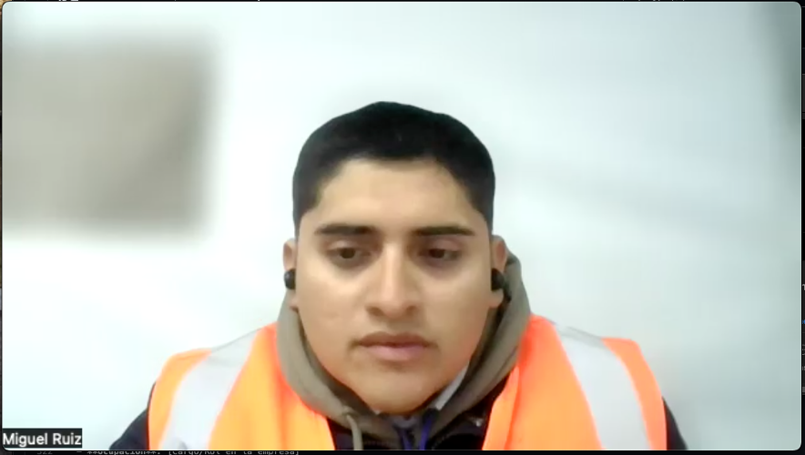
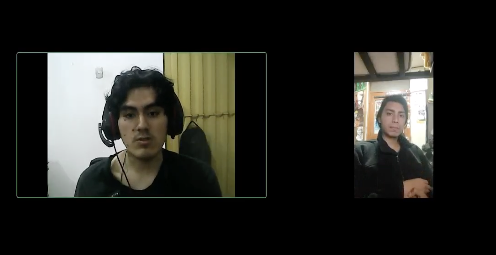

  

     
    
     
    <strong>Universidad Peruana de Ciencias Aplicadas</strong>
      
    <strong>Carrera de ingeniería de Software</strong>
      
    <strong>Ciclo 202520</strong>
      
    1ASI0572 - Desarrollo de Soluciones IOT
      
    <strong>NRC:</strong> 3443   
    <strong>Profesor:</strong> Velásquez Núñez, Angel Augusto   
    <strong>Informe de Trabajo Final</strong>
  

  

    

      <strong>Startup:</strong> Los Parkers 
       
      <strong>Producto:</strong> Macetech
    

  

      <strong>Relación de integrantes</strong>
        
      <table style="width: 60%; margin: 0 auto;   text-align: left">
        <thead>
          <tr>
            <th>Código</th>
            <th>Nombre</th>
          </tr>
        </thead>
        <tbody>
          <tr>
            <td>u20201c410</td>
            <td>Garro Vega, Marcelo Fabian</td>
          </tr>
          <tr>
            <td>u...</td>
            <td>Apellidos, Nombres</td>
          </tr>
        </tbody>
      </table>
      

         
        <strong>Agosto 2025</strong>
      

    

  

---

# Capítulo I: Introducción

## 1.1. Startup Profile

### 1.1.1. Descripción de la Startup

### 1.1.2. Perfiles de integrantes del equipo

## 1.2. Solution Profile

### 1.2.1. Antecedentes y problemática

### 1.2.2. Lean UX Process

#### 1.2.2.1. Lean UX Problem Statements

#### 1.2.2.2. Lean UX Assumptions

#### 1.2.2.3. Lean UX Hypothesis Statements

#### 1.2.2.4. Lean UX Canvas

## 1.3. Segmentos objetivo

# Capítulo II: Requirements Elicitation & Analysis

## 2.1. Competidores

### 2.1.1. Análisis competitivo

<table>
<!-- Título -->
  <tr>
    <th colspan="6" valign="top"><b>Análisis Competitivo</b></th>
  </tr>

  <!-- Motivación del análisis -->
  <tr>
    <td rowspan="2" colspan="1" valign="top">¿Por qué llevar a cabo este Análisis?</td>
    <td colspan="5" valign="top">
      Este análisis permite identificar fortalezas, debilidades y oportunidades en el mercado de soluciones IoT para el monitoreo de cadena de frío, de modo que Macetech pueda priorizar características, precios y estrategias de marketing que maximicen su adopción en el mercado peruano y latinoamericano.
    </td>
  </tr>
  <tr></tr>

  <!-- Cabeceras de competidores (logo + nombre) -->
  <tr>
    <td colspan="2" valign="top"></td>
    <td valign="top">
      
<b>Sensitech (Thermo King)</b>

      
    </td>
    <td valign="top">
      
<b>Frigga (China)</b>

      
    </td>
    <td valign="top">
      
<b>Emerson Cargo Solutions</b>

      
    </td>
    <td valign="top">
      
<b>CargoSafe</b>

      
    </td>
  </tr>

  <!-- PERFIL -->
  <tr>
    <td rowspan="2" valign="top">
Perfil
</td>
    <td valign="top">Overview</td>
    <td valign="top">Multinacional estadounidense líder en monitoreo de la cadena de frío con décadas de experiencia.</td>
    <td valign="top">Fabricante global de dispositivos IoT para cadena de frío, con distribución en más de 60 países.</td>
    <td valign="top">División de Emerson Electric dedicada a soluciones de monitoreo de transporte refrigerado.</td>
    <td valign="top">Startup tecnológica latinoamericana que ofrece monitoreo en tiempo real enfocado en la temperatura del transporte de cargas.</td>
  </tr>
  <tr>
    <td valign="top">¿Qué valor ofrece a los clientes?</td>
    <td valign="top">Ofrece confianza, cumplimiento de normativas globales (FDA, OMS), cobertura mundial y tecnología robusta.</td>
    <td valign="top">Ofrece sensores desechables/reutilizables de bajo costo, fáciles de implementar en transporte.</td>
    <td valign="top">Seguridad y precisión en tiempo real con analítica avanzada para grandes corporaciones.</td>
    <td valign="top">Propuesta accesible y flexible que asegura la conservación de productos críticos, con alertas inmediatas y dashboards intuitivos.</td>
  </tr>

  <!-- MARKETING -->
  <tr>
    <td rowspan="2" valign="top">
Perfil de Marketing
</td>
    <td valign="top">Mercado objetivo</td>
    <td valign="top">Multinacionales farmacéuticas, agroexportadoras y grandes retailers.</td>
    <td valign="top">Exportadores agrícolas y farmacéuticos medianos.</td>
    <td valign="top">Corporaciones de alimentos y farmacéuticas multinacionales.</td>
    <td valign="top">Empresas de transporte, agroexportadores medianos, distribuidores locales de alimentos y fármacos.</td>
  </tr>
  <tr>
    <td valign="top">Estrategias de marketing</td>
    <td valign="top">Presencia en ferias globales, contratos con distribuidores y certificaciones internacionales.</td>
    <td valign="top">Marketing digital, distribuidores locales, precios competitivos.</td>
    <td valign="top">Ventas consultivas, certificaciones globales, contratos a largo plazo.</td>
    <td valign="top">Marketing digital, alianzas con cámaras de comercio, programas de suscripción escalables.</td>
  </tr>

  <!-- PRODUCTO -->
  <tr>
    <td rowspan="3" valign="top">
Perfil de Producto
</td>
    <td valign="top">Productos & Servicios</td>
    <td valign="top">Data loggers, sensores IoT, software de análisis predictivo, soporte técnico 24/7.</td>
    <td valign="top">Data loggers, dispositivos de monitoreo en tiempo real, dashboards básicos.</td>
    <td valign="top">Monitoreo en tiempo real, analítica predictiva, dashboards avanzados.</td>
    <td valign="top">Sensores IoT propios o integrados, aplicación web y móvil, dashboards con métricas clave, alertas en tiempo real.</td>
  </tr>
  <tr>
    <td valign="top">Precios y costos</td>
    <td valign="top">Altos; modelo premium con costo por dispositivo y licencias anuales.</td>
    <td valign="top">Muy competitivos; pago por dispositivo + acceso a plataforma.</td>
    <td valign="top">Elevados; modelo enterprise con contratos anuales.</td>
    <td valign="top">Suscripciones flexibles + costo bajo por dispositivo.</td>
  </tr>
  <tr>
    <td valign="top">Canales de distribución</td>
    <td valign="top">Distribuidores autorizados globales, venta directa enterprise, canal online.</td>
    <td valign="top">Marketplace de e-commerce, distribuidores locales, venta directa.</td>
    <td valign="top">Venta directa corporativa, partners certificados, canal enterprise.</td>
    <td valign="top">Venta directa, partnerships con cámaras de comercio, distribuidores especializados en logística.</td>
  </tr>

  <!-- SWOT -->
  <tr>
    <td rowspan="4" valign="top">
Análisis SWOT
</td>
    <td valign="top">Fortalezas</td>
    <td valign="top">• Reputación global • Cumplimiento normativo • Soporte internacional</td>
    <td valign="top">• Precios accesibles • Disponibilidad masiva</td>
    <td valign="top">• Marca reconocida • Integración tecnológica avanzada</td>
    <td valign="top">• Accesibilidad y escalabilidad • Enfoque en empresas de transporte • Software amigable</td>
  </tr>
  <tr>
    <td valign="top">Debilidades</td>
    <td valign="top">• Alto costo • Poca flexibilidad para PYMEs</td>
    <td valign="top">• Limitada personalización de software • Menor soporte local en LATAM</td>
    <td valign="top">• Precio inaccesible para PYMEs • Implementación compleja</td>
    <td valign="top">• Respaldo de marca frente a multinacionales • Mercado nicho especializado</td>
  </tr>
  <tr>
    <td valign="top">Oportunidades</td>
    <td valign="top">• Creciente regulación en transporte farmacéutico y alimentario</td>
    <td valign="top">• Crecimiento del e-commerce y transporte de alimentos</td>
    <td valign="top">• Demanda en mercados regulados (fármacos, vacunas)</td>
    <td valign="top">• Expansión en LATAM donde grandes competidores no tienen presencia fuerte • Crecimiento del e-commerce y transporte</td>
  </tr>
  <tr>
    <td valign="top">Amenazas</td>
    <td valign="top">• Startups ágiles con precios más bajos en LATAM</td>
    <td valign="top">• Competidores regionales con soluciones SaaS más adaptadas</td>
    <td valign="top">• Startups regionales con mejor relación costo-beneficio</td>
    <td valign="top">• Copia rápida de modelo por competidores grandes o locales • Regulaciones de transporte cambiantes</td>
  </tr>
</table>

### 2.1.2. Estrategias y tácticas frente a competidores

- **Precios accesibles y modelo SaaS flexible**  
  Plan básico desde $29/mes por dispositivo con suscripción mensual sin compromisos a largo plazo, contrastando con licencias anuales costosas de Sensitech y Emerson.

- **Soporte local y personalización regional**  
  Equipo técnico en español con horarios LATAM, dashboards personalizables con métricas locales y cumplimiento de normativas regionales (SENASA, DIGESA).

- **Implementación rápida y sin complejidad técnica**  
  Configuración plug-and-play en menos de 24 horas versus semanas de implementación de competidores enterprise, con capacitación incluida.

- **Alianzas estratégicas con el ecosistema local**  
  Partnerships con cámaras de comercio agrícola, asociaciones de transportistas y distribuidores de dispositivos IoT en mercados emergentes.

- **Transparencia de datos y alertas proactivas**  
  API abierta para integración con sistemas ERP locales, reportes en tiempo real y alertas vía WhatsApp/SMS, ventajas sobre dashboards cerrados de competidores.

## 2.2. Entrevistas

### 2.2.1. Diseño de entrevistas

### 1. Preguntas generales

- ¿Cuál es tu nombre y cargo?
- ¿Cuántos años tienes?
- ¿En qué sector o industria trabajas? (alimentos, farmacéutica, logística, etc.)

---

### 2. Preguntas — **Segmento: Empresa (Gestores de transporte)**

1. **Proceso actual de monitoreo**

   - ¿Cómo monitoreas actualmente la temperatura durante el transporte de tus productos?

2. **Herramientas y tecnología**

   - ¿Qué dispositivos o sistemas utilizas para el control de cadena de frío y por qué los elegiste?

3. **Gestión de viajes y rutas**

   - ¿Cómo planificas y registras los viajes de transporte? ¿Qué información consideras esencial?

4. **Desafíos principales**

   - ¿Qué problemas enfrentas cuando se rompe la cadena de frío? ¿Cómo impacta en costos y tiempo?

5. **Alertas y respuesta a incidentes**

   - ¿Cómo te enteras cuando hay un problema de temperatura? ¿Qué tan rápido puedes responder?

6. **Reportes y documentación**

   - ¿Qué tipo de reportes necesitas generar para clientes o autoridades regulatorias?

7. **Gestión de dispositivos IoT**

   - Cuéntame sobre tu experiencia gestionando el mantenimiento y configuración de sensores o dispositivos de monitoreo. ¿Qué desafíos has encontrado?

8. **Características ideales**

   - Si pudieras diseñar la plataforma perfecta, ¿qué funciones serían imprescindibles para ti?

9. **Presupuesto y modelo de pago**
   - ¿Cuál sería tu modelo de pago preferido para este tipo de servicios y qué factores influyen en esa decisión?

---

### 3. Preguntas — **Segmento: Clientes Finales (Consumidores finales)**

1. **Experiencia actual de recepción de productos**

   - Cuéntame cómo verificas actualmente que los productos que compras llegaron en condiciones óptimas de temperatura.

2. **Confianza y transparencia en proveedores**

   - Describe tu nivel de confianza en los reportes de temperatura que te proporcionan tus proveedores. ¿Qué factores aumentarían o disminuirían esa confianza?

3. **Información requerida sobre el transporte**

   - ¿Qué información consideras más valiosa tener sobre el transporte de tus productos y cómo te ayudaría en tus operaciones?

4. **Experiencias con productos dañados**

   - Comparte alguna experiencia que hayas tenido rechazando productos por problemas de cadena de frío. ¿Cómo identificaste el problema y qué impacto tuvo?

5. **Preferencias de acceso a información**

   - Describe cómo prefieres recibir y acceder a información sobre tus pedidos. ¿Qué métodos de comunicación funcionan mejor para tu flujo de trabajo?

6. **Alertas y notificaciones proactivas**

   - Cuéntame qué tipo de notificaciones durante el transporte de tus productos serían más útiles para ti y en qué momentos las necesitarías.

7. **Facilidad de uso y comprensión**

   - Describe la importancia que tiene para ti que la información técnica sea presentada de manera comprensible. ¿Qué características valoras en las interfaces que usas?

8. **Características más valoradas**

   - ¿Qué funcionalidades consideras que agregarían más valor a tu proceso de recepción y validación de productos?

9. **Expectativas sobre tecnología IoT**
   - ¿Qué beneficios esperas de un sistema de monitoreo IoT para tus compras de productos sensibles a temperatura y qué preocupaciones tienes al respecto?

### 2.2.2. Registro de entrevistas

### Segmento 1: Empresa (Gestores de transporte)

- **Nombre**: Miguel Ruiz
- **Edad**: 28 años
- **Ocupación**: Supervisor
- **Empresa**: Ofertimaq - Distribuidora
- **Enlace**: [[Click aquí para ver la entrevista](https://upcedupe-my.sharepoint.com/:v:/g/personal/u20201c410_upc_edu_pe/ER0ImJYYarNDpK11odR8b0gB1yAHBcte3ss8JSkB8lTqSA?nav=eyJyZWZlcnJhbEluZm8iOnsicmVmZXJyYWxBcHAiOiJPbmVEcml2ZUZvckJ1c2luZXNzIiwicmVmZXJyYWxBcHBQbGF0Zm9ybSI6IldlYiIsInJlZmVycmFsTW9kZSI6InZpZXciLCJyZWZlcnJhbFZpZXciOiJNeUZpbGVzTGlua0NvcHkifX0&e=eydJDA)]

  

   

- **Nombre**: Mario Hernandez
- **Edad**: 22 años
- **Ocupación**: Operador Logístico
- **Empresa**: Urbano - Distribuidora Ecommerces
- **Enlace**: [Click aquí para ver la entrevista](https://upcedupe-my.sharepoint.com/:v:/g/personal/u20201c410_upc_edu_pe/Ea3nawSxes5HpXpXNXpmntkBArT4L5c45yFoHVFv6A-TYQ?nav=eyJyZWZlcnJhbEluZm8iOnsicmVmZXJyYWxBcHAiOiJPbmVEcml2ZUZvckJ1c2luZXNzIiwicmVmZXJyYWxBcHBQbGF0Zm9ybSI6IldlYiIsInJlZmVycmFsTW9kZSI6InZpZXciLCJyZWZlcnJhbFZpZXciOiJNeUZpbGVzTGlua0NvcHkifX0&e=IPrKED)

    

     

- **Nombre**: [Nombre del entrevistado]
- **Edad**: [Edad] años
- **Ocupación**: [Cargo/Rol en la empresa]
- **Empresa**: [Nombre de la empresa/Sector]
- **Enlace**: [URL del video de la entrevista]

  

   

### Segmento 2: Clientes Finales (Consumidores finales)

- **Nombre**: Adrián Zapata
- **Edad**: 23 años
- **Ocupación**: Responsable de parrilla en un negocio de comida rápida
- **Empresa/Sector**: Negocio local de comida rápida / Sector alimentario
- **Enlace**: [URL del video de la entrevista]

  

   

- **Nombre**: Brenda Calderon
- **Edad**: 20 años
- **Ocupación**: Trabajadora de medio tiempo en un minimarket, responsable de compras de insumos para refrigeración
- **Empresa/Sector**: Retail alimentario local – Consumo final
- **Enlace**: https://upcedupe-my.sharepoint.com/:v:/g/personal/u20201c410_upc_edu_pe/ETZJCs5-UXdFnmhsbphFM7gBm-D9N0q1TO-57qQHVY9bNg?e=2AZjQ6&nav=eyJyZWZlcnJhbEluZm8iOnsicmVmZXJyYWxBcHAiOiJTdHJlYW1XZWJBcHAiLCJyZWZlcnJhbFZpZXciOiJTaGFyZURpYWxvZy1MaW5rIiwicmVmZXJyYWxBcHBQbGF0Zm9ybSI6IldlYiIsInJlZmVycmFsTW9kZSI6InZpZXcifX0%3D

  

   

- **Nombre**: Gabriel Díaz
- **Edad**: 26 años
- **Ocupación**: Responsable de recepción y control de productos sensibles a temperatura.
- **Empresa/Sector**: Sector de salud
- **Enlace**: https://upcedupe-my.sharepoint.com/:v:/g/personal/u20201c410_upc_edu_pe/EcMuUYlqskNEqzaICMJSTwIBwtDXay1luNLbNZm9ulDSZw?nav=eyJyZWZlcnJhbEluZm8iOnsicmVmZXJyYWxBcHAiOiJTdHJlYW1XZWJBcHAiLCJyZWZlcnJhbFZpZXciOiJTaGFyZURpYWxvZy1MaW5rIiwicmVmZXJyYWxBcHBQbGF0Zm9ybSI6IldlYiIsInJlZmVycmFsTW9kZSI6InZpZXcifX0%3D&e=nQqEpO 

  

   

### 2.2.3. Análisis de entrevistas

### Segmento 1: Empresa (Gestores de transporte)

- **Nombre**: Miguel Ruiz

- **Entrevistador**: Jefrey Sanchez Ignacio

**Situación Actual:** Miguel Ruiz Sánchez es gestor de transporte de coolers en una empresa logística. Actualmente manejan el monitoreo de temperatura de forma completamente manual - los conductores verifican los coolers durante las paradas usando termómetros digitales y reportan problemas por teléfono. Solo cuentan con GPS básico que no es muy preciso.

**Principales Problemas:** No tienen monitoreo en tiempo real, las alertas dependen de que los conductores llamen cuando algo falla, y esto genera retrasos en las entregas que molestan a los clientes. Cuando un cooler se daña, tienen que enviar otro transporte de emergencia para salvar el producto. Para justificarse ante clientes molestos, solo pueden mostrar reportes de ruta básicos.

**Necesidades Identificadas:** Miguel necesita urgentemente un sistema de monitoreo en tiempo real, alertas automáticas cuando la temperatura llegue a niveles críticos, y reportes sencillos. También mencionó que le gustaría tener un dashboard, aunque no está muy seguro del concepto. Quiere que los clientes puedan verificar remotamente el estado de sus pedidos desde una computadora.

**Disposición de Pago:** Está dispuesto a contratar un servicio que solucione estos problemas, preferiblemente con suscripción mensual o mejor aún, un pago anual para evitar gestiones mensuales. Ve esto como una inversión para recuperar la confianza de los clientes y tener soporte 24/7.
   

- **Nombre**: [Nombre del entrevistado]

- **Entrevistador**: [Nombre del entrevistador]

  [...]

   

- **Nombre**: [Nombre del entrevistado]

- **Entrevistador**: [Nombre del entrevistador]

  [...]

### Segmento 2: Clientes Finales (Consumidores finales)

- **Nombre**: Adrian Zapata

- **Entrevistador**: George Aliaga

  Nuestro entrevistado Adrián Zapata, encargado de la parrilla en un negocio de comida rápida, expone una problemática clave en la recepción de productos sensibles a temperatura: la falta de control y visibilidad durante el transporte. Actualmente depende de inspecciones visuales y táctiles, lo que limita la precisión y genera incertidumbre. Señala la importancia del tiempo de entrega, la temperatura constante y la comunicación oportuna, idealmente a través de notificaciones por WhatsApp. También destaca la necesidad de interfaces claras y datos legibles, especialmente en grados Celsius. Su interés en un sistema IoT revela el valor que asigna a la trazabilidad, el monitoreo en tiempo real y la posibilidad de actuar preventivamente ante fallas en la cadena de frío.

   

- **Nombre**: Brenda Calderon

- **Entrevistador**: Nicolas Vera

  La entrevistada Brenda Carolina, compradora frecuente de alimentos online, manifiesta que al recibir productos sensibles a temperatura verifica el empaque, la ausencia de humedad, que los alimentos lleguen fríos al tacto y que la fecha de vencimiento esté visible, ya que ha tenido experiencias negativas como rechazar un lote de yogures en mal estado. Señala que los reportes de temperatura que recibe de los proveedores suelen ser genéricos y poco confiables, por lo que considera fundamental contar con registros más detallados y trazables en tiempo real. Para ella, la información más valiosa incluye la temperatura a lo largo del trayecto, retrasos o eventos que afecten la cadena de frío, y prefiere acceder a estos datos mediante un portal o aplicación con notificaciones breves y claras. Valora interfaces simples con gráficos fáciles de interpretar, así como funcionalidades como alertas en tiempo real, reportes descargables e historial de pedidos, y espera que un sistema IoT le brinde mayor seguridad y control en sus compras, aunque le preocupa el costo de implementación y la confiabilidad técnica de los equipos.

   

- **Nombre**: Gabriel Díaz

- **Entrevistador**: Daniel Arevalo

  El entrevistado Gabriel Díaz, responsable de recepción y control de productos sensibles a temperatura en el sector salud, expone la problemática de confiar únicamente en reportes básicos y revisiones visuales al recibir insumos médicos, lo que genera incertidumbre sobre la cadena de frío. Destaca la necesidad de contar con un monitoreo continuo y alertas en tiempo real para actuar preventivamente, ya que ha debido rechazar pedidos por fallas en la temperatura. Su interés en un sistema IoT refleja la importancia que le asigna a la trazabilidad, la seguridad y la eficiencia, aunque expresa preocupación por los costos y la dependencia de la conectividad.

## 2.3. Needfinding

### 2.3.1. User Personas

- **Segmento: Empresa (Gestores de transporte)**

  

  **Carlos Mendoza - Jefe de Logística**  
  El user persona de Carlos representa al gestor experimentado que prioriza la eficiencia operativa y la minimización de riesgos. Muestra la necesidad de herramientas tecnológicas robustas y precisas que le permitan mantener control total sobre la cadena de frío. Su perfil refleja la importancia de la confiabilidad del sistema, ya que cualquier falla puede resultar en pérdidas económicas significativas y problemas regulatorios. Carlos ejemplifica al usuario que valora los datos en tiempo real, reportes detallados y funcionalidades que le permitan tomar decisiones informadas para proteger productos de alto valor.

   

- **Segmento: Clientes Finales (Consumidores finales)**

  

  **María González - Gerente de Compras de Restaurante**  
  El user persona de María representa al consumidor final que valora la transparencia y la calidad en los productos que adquiere para su negocio. Como responsable de compras de un restaurante, necesita la seguridad de que los alimentos que recibe han mantenido la cadena de frío adecuada durante el transporte. Su perfil ilustra la importancia de contar con información clara y accesible sobre el estado de los productos, reportes de cumplimiento fáciles de entender, y la capacidad de verificar la integridad de los alimentos antes de aceptar las entregas. María ejemplifica al usuario que busca confianza y transparencia en el proceso logístico para proteger la reputación de su negocio.

   

### 2.3.2. User Task Matrix

**Segmento: Empresa (Gestores de transporte)**

| Tarea                                                  | Frecuencia | Importancia |
| ------------------------------------------------------ | ---------- | ----------- |
| Configurar dispositivos IoT para nuevos vehículos      | Media      | Alta        |
| Registrar nuevos viajes y establecer parámetros        | Alta       | Alta        |
| Monitorear temperatura en tiempo real durante viajes   | Alta       | Alta        |
| Recibir y gestionar alertas de incumplimiento          | Media      | Alta        |
| Revisar dashboards de estado de flota                  | Alta       | Alta        |
| Generar reportes de viajes para clientes               | Media      | Alta        |
| Analizar gráficos de incidencias mensuales             | Baja       | Media       |
| Gestionar suscripciones y pagos del sistema            | Baja       | Media       |
| Actualizar parámetros de temperatura según producto    | Media      | Alta        |
| Coordinar respuesta ante emergencias de cadena de frío | Baja       | Alta        |

**Segmento: Clientes Finales (Consumidores finales)**

| Tarea                                            | Frecuencia | Importancia |
| ------------------------------------------------ | ---------- | ----------- |
| Verificar estado de pedidos en tránsito          | Alta       | Alta        |
| Consultar certificados de cadena de frío         | Media      | Alta        |
| Revisar reportes de cumplimiento de temperatura  | Media      | Alta        |
| Rastrear ubicación y progreso de entrega         | Alta       | Media       |
| Recibir alertas sobre problemas en el transporte | Media      | Alta        |
| Validar condiciones del producto al recibirlo    | Alta       | Alta        |
| Descargar documentación oficial de cumplimiento  | Media      | Alta        |
| Consultar historial de entregas anteriores       | Baja       | Media       |
| Reportar productos rechazados por incumplimiento | Baja       | Alta        |
| Acceder a soporte para resolver incidencias      | Baja       | Media       |

### 2.3.3. User Journey Mapping

## Journey Map: Carlos Mendoza (Gestor de transporte)

El journey map de Carlos muestra un proceso de 5 etapas desde la planificación hasta la entrega final. Sus momentos críticos se concentran en la configuración de parámetros correctos y la gestión eficiente de alertas durante el viaje. Las oportunidades principales incluyen simplificar la configuración inicial con plantillas predefinidas, proporcionar dashboards unificados durante el monitoreo, y automatizar la generación de reportes post-viaje. Sus mayores pain points están en la complejidad de configuración y la falta de contexto en las alertas críticas.

 

## Journey Map: María González (Gerente de Compras de Restaurante)

El journey map de María ilustra un proceso enfocado en la verificación y validación de productos desde la solicitud hasta la aceptación final. Sus momentos críticos se centran en la recepción de productos y la verificación de que cumplan con los estándares de calidad requeridos. Las oportunidades principales incluyen proporcionar acceso fácil a reportes de cumplimiento, notificaciones proactivas sobre el estado del transporte, y documentación clara que facilite la toma de decisiones de aceptación. Sus mayores pain points están en la falta de transparencia durante el transporte y la dificultad para verificar la integridad de los productos al momento de la entrega.

 

### 2.3.4. Empathy Mapping

## Segmento: Empresa (Gestores de transporte) - Carlos Mendoza

El empathy map de Carlos revela a un profesional experimentado que busca control total y confiabilidad en los sistemas de monitoreo. Sus principales preocupaciones giran en torno a las pérdidas económicas por fallas en la cadena de frío y la necesidad de mantener la reputación empresarial. Valora la tecnología que le proporcione visibilidad en tiempo real, reportes automáticos y alertas accionables que le permitan responder rápidamente ante incidentes. Su enfoque está en el ROI medible y sistemas que cumplan con regulaciones estrictas.

 

## Segmento: Clientes Finales (Consumidores finales) - María González

El empathy map de María revela a una profesional responsable que prioriza la calidad y la confianza en sus proveedores. Sus principales preocupaciones se centran en la reputación de su negocio y la satisfacción de sus clientes finales. Valora la transparencia en el proceso de transporte, documentación clara de cumplimiento, y la capacidad de tomar decisiones informadas sobre la aceptación de productos. Su dolor principal es la incertidumbre sobre las condiciones de transporte y la falta de información confiable que le permita verificar la calidad de los productos. Su ganancia principal es tener acceso a información transparente y reportes de cumplimiento que le den confianza para aceptar productos y mantener la calidad en su negocio.

 

## 2.4. Big Picture EventStorming

El Big Picture Event Storming es una técnica colaborativa de Domain-Driven Design que permitió al equipo identificar y mapear todos los eventos de dominio relevantes para el core business de CargoSafe. Durante el proceso de brainstorming, se siguió una metodología estructurada donde el equipo utilizó sticky notes naranjas para representar eventos de dominio, azules para comandos, amarillas para agregados, y rosadas para hot spots o áreas problemáticas.

El proceso comenzó con una lluvia de ideas donde todos los participantes escribieron eventos que consideraban importantes para el monitoreo de cadena de frío, siguiendo la regla de usar verbos en infinitivo en inglés. Posteriormente, se organizaron temporalmente los eventos de izquierda a derecha, formando el flujo cronológico natural del negocio. Se identificaron actores clave, sistemas externos y se marcaron los hot spots donde existían incertidumbres, riesgos o complejidades que requerían atención especial.

**Descripción del Event Storming de CargoSafe:**

El Event Storming resultante se enfoca exclusivamente en el core business del monitoreo de cadena de frío durante el transporte. Los eventos están organizados en un flujo cronológico que abarca desde la creación del viaje hasta la generación del reporte final de cumplimiento. Los 10 eventos de dominio identificados representan las actividades críticas que agregan valor al negocio y que deben ser soportadas por la plataforma tecnológica.

## 2.5. Ubiquitous Language

El Ubiquitous Language de CargoSafe establece un vocabulario común y preciso entre el equipo de desarrollo, stakeholders del negocio y usuarios finales, eliminando ambigüedades en la comunicación sobre el dominio de monitoreo de cadena de frío.

### **Términos del Dominio Central**

**Cold Chain (Cadena de Frío)**  
Proceso logístico que mantiene productos perecederos dentro de rangos específicos de temperatura desde el origen hasta el destino final, garantizando su calidad e integridad.

**Trip (Viaje)**  
Instancia de transporte que incluye origen, destino, carga específica, parámetros térmicos requeridos y duración estimada. Representa la unidad básica de monitoreo en el sistema.

**Temperature Range (Rango de Temperatura)**  
Límites mínimos y máximos de temperatura permitidos para una carga específica durante el transporte. Se define según el tipo de producto (farmacéutico, alimentario, etc.).

**IoT Sensor (Sensor IoT)**  
Dispositivo físico que mide y transmite automáticamente lecturas de temperatura en intervalos regulares durante el viaje. Puede ser integrado al vehículo o portable.

**Temperature Violation (Violación de Temperatura)**  
Evento que ocurre cuando las lecturas del sensor salen del rango permitido por un período determinado, comprometiendo potencialmente la integridad del producto.

**Cold Chain Alert (Alerta de Cadena de Frío)**  
Notificación automática generada por el sistema cuando se detecta una violación de temperatura, enviada inmediatamente a los responsables para acción correctiva.

**Compliance Report (Reporte de Cumplimiento)**  
Documento oficial que certifica que el transporte se realizó dentro de los parámetros térmicos requeridos, utilizado para auditorías y certificaciones regulatorias.

### **Términos de Actores**

**Fleet Manager (Gestor de Flota)**  
Usuario responsable de configurar dispositivos, establecer parámetros de viaje, monitorear el estado de múltiples transportes y generar reportes para clientes.

**Driver (Conductor)**  
Usuario operativo que recibe alertas durante el transporte y ejecuta acciones correctivas cuando se detectan problemas en la cadena de frío.

**Final Client (Cliente Final)**  
Receptor de la carga que requiere visibilidad del estado del transporte y documentación de cumplimiento térmico para aceptar o rechazar productos.

### **Términos Técnicos**

**Real-time Monitoring (Monitoreo en Tiempo Real)**  
Capacidad del sistema de recibir, procesar y mostrar datos de temperatura de manera continua con latencia mínima durante el transporte.

**Temperature Log (Registro de Temperatura)**  
Secuencia cronológica de todas las lecturas de temperatura capturadas durante un viaje, almacenada para análisis posterior y generación de reportes.

**Incident (Incidencia)**  
Registro oficial de cualquier evento que comprometa la cadena de frío, incluyendo duración, causa probable y acciones tomadas para su resolución.

**Dashboard**  
Interfaz visual que presenta en tiempo real el estado de múltiples viajes, alertas activas, métricas de rendimiento y resúmenes de cumplimiento.

### **Términos de Procesos de Negocio**

**Trip Configuration (Configuración de Viaje)**  
Proceso de establecer parámetros específicos antes del inicio del transporte: rangos de temperatura, duración estimada, tipo de carga y responsables.

**Corrective Action (Acción Correctiva)**  
Medidas tomadas por el conductor u operador para resolver violaciones de temperatura: ajuste de refrigeración, cambio de ruta, o notificación a supervisores.

**Temperature Calibration (Calibración de Temperatura)**  
Proceso de verificación y ajuste de sensores para garantizar precisión en las mediciones, realizado periódicamente según estándares de calidad.

**Cold Chain Compliance (Cumplimiento de Cadena de Frío)**  
Estado que confirma que un viaje se completó dentro de todos los parámetros térmicos requeridos, cumpliendo con regulaciones y estándares de calidad.

### **Contexto de Métricas y KPIs**

**Temperature Excursion (Excursión de Temperatura)**  
Período específico durante el cual la temperatura estuvo fuera del rango permitido, medido en minutos u horas según criticidad del producto.

**Compliance Rate (Tasa de Cumplimiento)**  
Porcentaje de viajes que se completaron sin violaciones de temperatura en un período determinado, utilizado como KPI principal del servicio.

**Alert Response Time (Tiempo de Respuesta a Alertas)**  
Métrica que mide el tiempo transcurrido entre la generación de una alerta y la implementación de acciones correctivas por parte del equipo operativo.

# Capítulo III: Requirements Specification

## 3.1. User Stories

## 3.2. Impact Mapping

## 3.3. Product Backlog

# Capítulo IV: Solution Software Design

## 4.1. Strategic-Level Domain-Driven Design

### 4.1.1. Design-Level EventStorming

#### 4.1.1.1. Candidate Context Discovery

#### 4.1.1.2. Domain Message Flows Modeling

#### 4.1.1.3. Bounded Context Canvases

### 4.1.2. Context Mapping

### 4.1.3. Software Architecture

#### 4.1.3.1. Software Architecture System Landscape Diagram

#### 4.1.3.2. Software Architecture Context Level Diagrams

#### 4.1.3.2. Software Architecture Container Level Diagrams

#### 4.1.3.3. Software Architecture Deployment Diagrams

## 4.2. Tactical-Level Domain-Driven Design

### 4.2.1. Bounded Context: `<Bounded Context Name>`

#### 4.2.1.1. Domain Layer

#### 4.2.1.2. Interface Layer

#### 4.2.1.3. Application Layer

#### 4.2.1.4. Infrastructure Layer

#### 4.2.1.5. Bounded Context Software Architecture Component Level Diagrams

#### 4.2.1.6. Bounded Context Software Architecture Code Level Diagrams

##### 4.2.1.6.1. Bounded Context Domain Layer Class Diagrams

##### 4.2.1.6.2. Bounded Context Database Design Diagram
