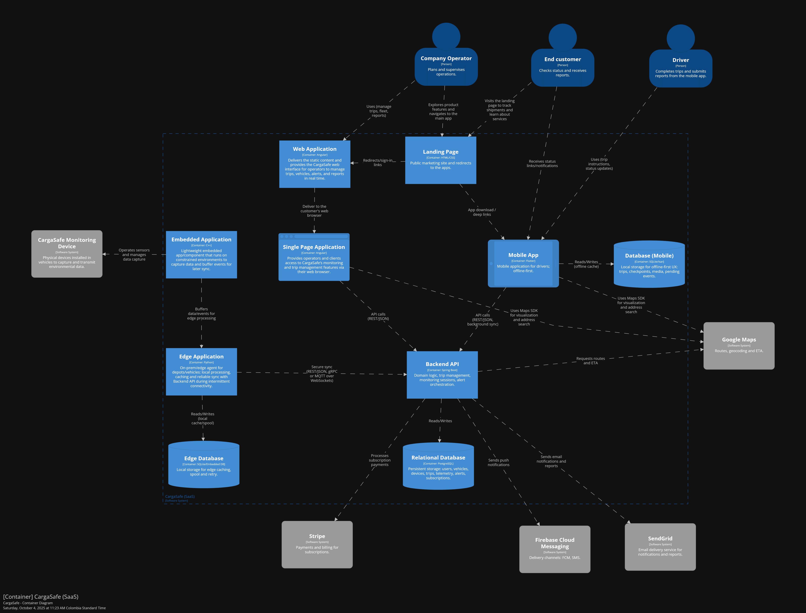
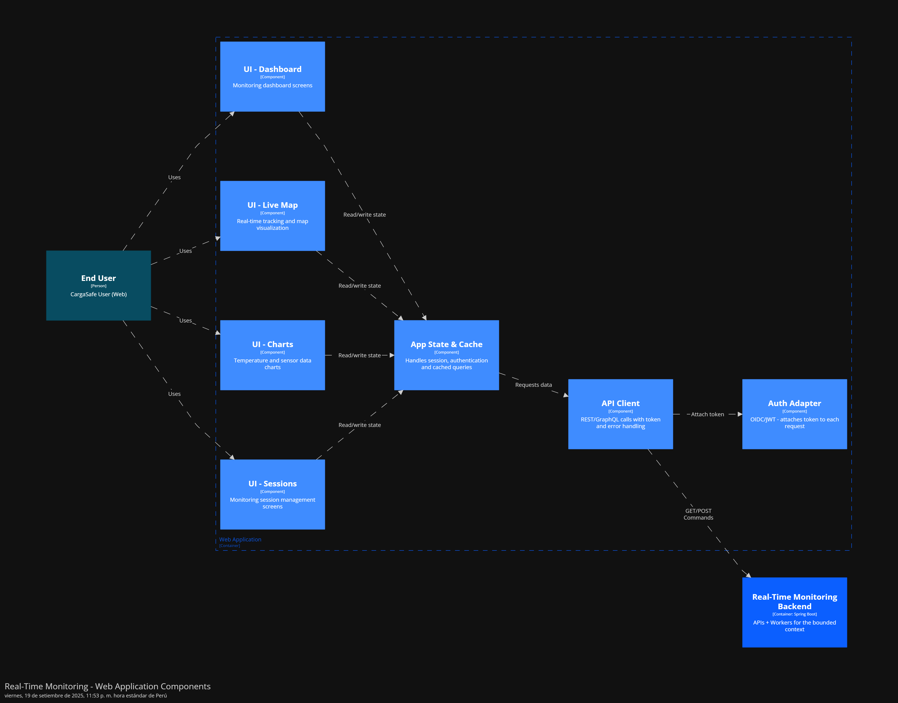
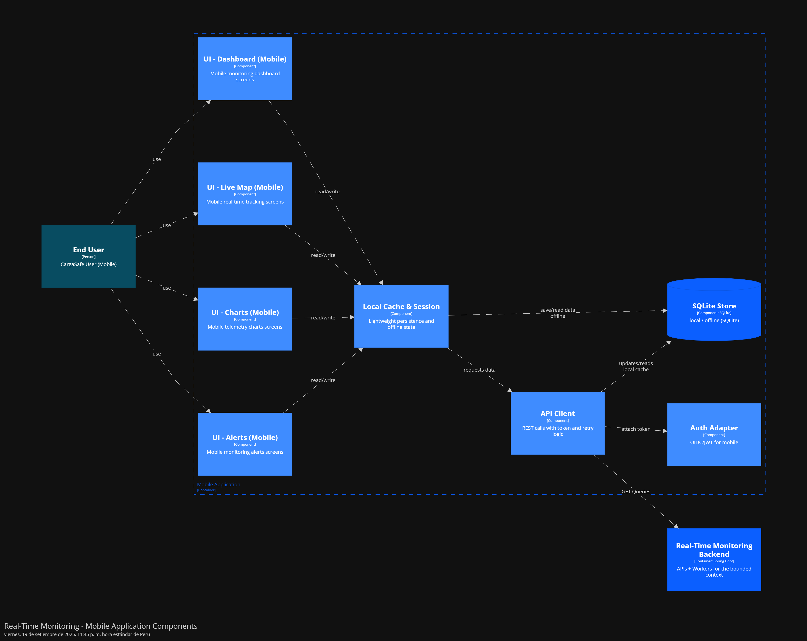
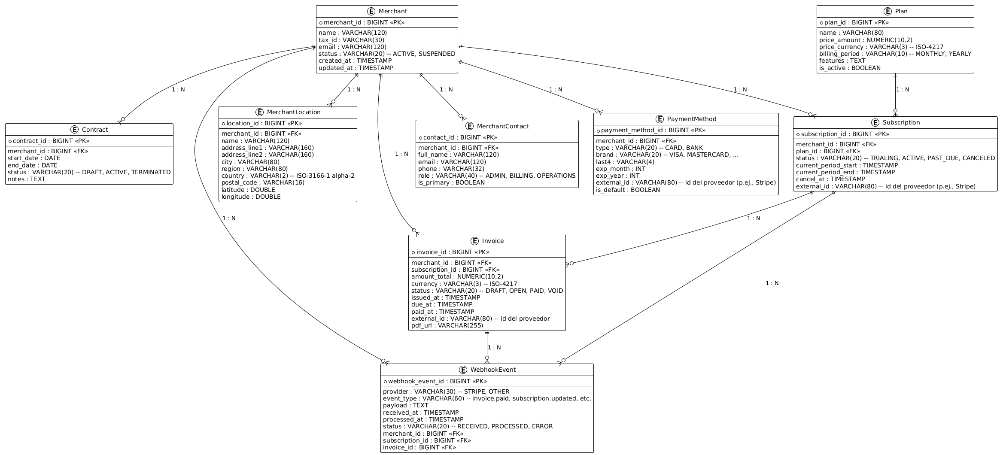
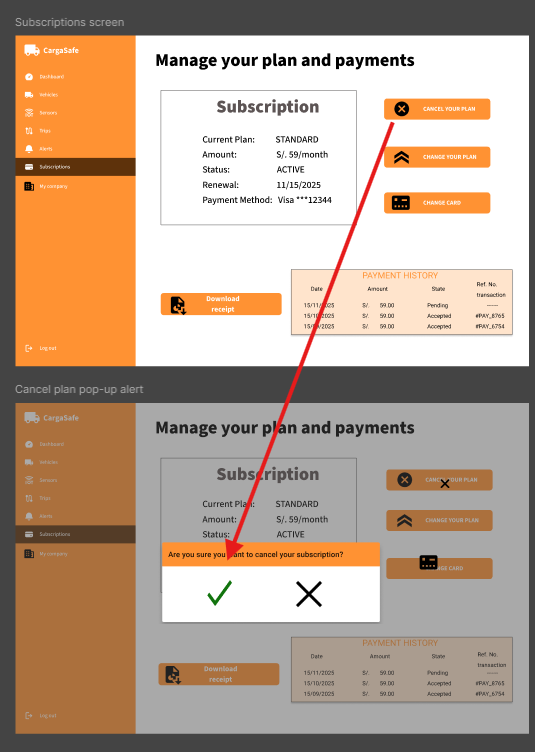
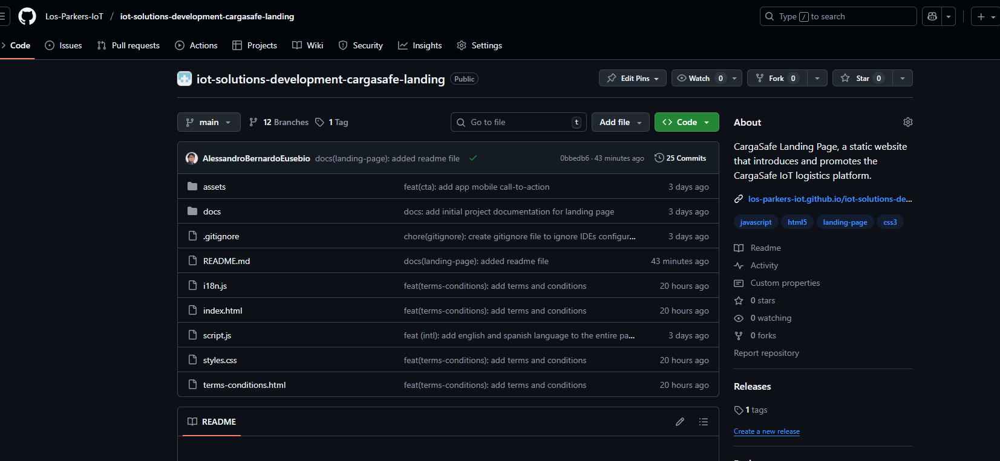

<div style="text-align: center">
  <p align="center">
    <br />
    
    <br />
    <strong>Universidad Peruana de Ciencias Aplicadas</strong>
    <br /><br />
    <strong>Carrera de ingeniería de Software</strong>
    <br /><br />
    <strong>Ciclo 202520</strong>
    <br /><br />
    1ASI0572 - Desarrollo de Soluciones IOT
    <br /><br />
    <strong>NRC:</strong> 3443 <br /><br />
    <strong>Profesor:</strong> Velásquez Núñez, Angel Augusto <br /><br />
    <strong>Informe de Trabajo Final</strong>
  </p>

  <div style="width: 80%; margin: 0 auto; text-align: center">
    <p>
      <strong>Startup:</strong> Los Parkers 
      <br />
      <strong>Producto:</strong> CargaSafe
    </p>

  <div>
      <strong>Relación de integrantes</strong>
      <br /><br />
      <table style="width: 60%; margin: 0 auto;   text-align: left">
        <thead>
          <tr>
            <th>Código</th>
            <th>Nombre</th>
          </tr>
        </thead>
        <tbody>
          <tr>
            <td>u20201c410</td>
            <td>Garro Vega, Marcelo Fabian</td>
          </tr>
          <tr>
            <td>u202113324</td>
            <td>Sanchez Ignacio, Jefrey Martin</td>
          </tr>
          <tr>
            <td>u20211c273</td>
            <td>Aliaga Pimentel, George Arturo</td>
          </tr>
          <tr>
            <td>u202113640</td>
            <td>Bernardo Eusebio Alessandro Joaquin</td>
          </tr>
          <tr>
            <td>u202019577</td>
            <td>Chirinos Arevalo Daniel Rodrigo</td>
          </tr>
          <tr>
            <td>u202214869</td>
            <td>Vera Nuñez Nicolas Alejandro</td>
          </tr>
        </tbody>
      </table>
      <p style="text-align: center">
        <br />
        <strong>Octubre 2025</strong>
      </p>
    </div>

  </div>
</div>

# Registro de Versiones del Informe

| Versión | Fecha      | Autor            | Descripción de modificación                                                                                                                                                                                                                                                                                                                              |
| ------- | ---------- | ---------------- | -------------------------------------------------------------------------------------------------------------------------------------------------------------------------------------------------------------------------------------------------------------------------------------------------------------------------------------------------------- |
| 1.0     | 20/09/2025 | George           | Se entregó una primera entrega del informe con los siguientes apartados: Carátula, Registro de Versiones, Project Report Collaboration Insights, Contenido, Student Outcome, Capítulo I: Introducción, Capítulo II: Requirements Elicitation & Analysis, Capítulo III: Requirements Specification, Capítulo IV: Solution Software Design y Bibliografía. |
| 1.2     | 12/09/2025 | Daniel y Marcelo | Se añadió el capitulo 3 que es en base al product backlog que se trabajará en el proyecto                                                                                                                                                                                                                                                                |
| 1.3     | 13/09/2025 | Jefrey y Nicolas | Se añadió el capitulo 4 que es en base a las soluciones en diseño del software que trabajaremos en el proyecto                                                                                                                                                                                                                                           |
| 2.0     | 09/10/2025 | Jefrey           | Se añadió el capitulo 6.2.1.4 que es en base evidencias del trabajo durante el proyecto                                                                                                                                                                                                                                                                  |
| 2.1     | 09/10/2025 | Daniel           | Se realizaron las correciones y se añadió el capitulo 6 que es la configuración y el uso de las herramientas que se utilizaran durante el ciclo.                                                                                                                                                                                                         |
| 2.2     | 09/10/2025 | Marcelo          | Se agrego proceso de event storming con sus resultados finales                   |
| 3.0     | 14/11/2025 | Daniel          | Se añadió un nuevo Sprint sobre el desarrollo de los productos                    |

---


# Project Report Collaboration Insights

En esta sección, se registra las colaboraciones realizadas por los miembros del equipo durante el desarrollo del informe del proyecto. En primer lugar, se brinda el enlace del repositorio del reporte del proyecto en la plataforma GitHub.

-**Project Report:** https://github.com/Los-Parkers-IoT/LosParkers-report

A continuación, se explicará todo a cerca del desarrollo de activades para la elaboración del informe. Adicionalmente, se presentan las métricas de las acciones del equipo del Project Report de cada entrega correspondiente en forma de contribuciones, commits y network graph registrados en GitHub.

## TB1 Project Report Collaboration Insights

Para la entrega del TB1 se realizaron las actividades necesarias para completar los capítulos I, II, III y IV, resaltando la importancia de la constancia en el trabajo. Como equipo, mantuvimos una frecuencia adecuada de commits y actualizaciones, proyectada como óptima para el desarrollo futuro, y se incluyen en el informe las evidencias de los cambios efectuados.

_Vista general de las contribuciones del equipo_


_Contribuciones de cada miembro del equipo para la TB1_


_Commits_


_Network Graph_


De las contribuciones del equipo y commits se concluye lo siguiente:

- Para esta entrega, se han realizado un total de **262 commits** aproximadamente por parte del equipo.

- La mayor concentración de commits se dio en la semana del 15 de septiembre, alcanzando aproximadamente 200 contribuciones.

- El equipo considera que hubo falta de organización durante la realización de la TB1.

Para el control de versiones, decidimos emplear **6 ramas principales**:

<b> main </b> : Esta rama se mantiene como un reflejo del documento en su última versión estable. El estado del documento será listo para entregar.

<b> chapter-1, chapter-2, chapter-3 y chapter-4 </b>: Estas ramas permiten integrar los artefactos solicitados por capítulo. Se trabaja de esta manera para asegurar una integración controlada, una colaboración enfocada y un aislamiento de cambios.

<b> chapter-1-2-3-4 </b>: Esta rama funciona como zona de integración pre-producción donde se consolidan y revisan todos los capítulos antes de fusionarlos a `main`. Permite realizar pruebas de integración completas, verificar la coherencia entre capítulos y realizar ajustes finales sin afectar la rama principal. Actúa como un paso intermedio de validación antes del merge final.


## TP Project Report Collaboration Insights

Para la entrega del TP se realizaron las actividades necesarias para corregir y completar los capítulos I, II, III,IV,V y VI resaltando la importancia de la constancia en el trabajo. Como equipo, mantuvimos una frecuencia adecuada de commits y actualizaciones, proyectada como óptima para el desarrollo futuro, y se incluyen en el informe las evidencias de los cambios efectuados.

_Vista general de las contribuciones del equipo_


_Contribuciones de cada miembro del equipo para la TB1_


_Commits_


De las contribuciones del equipo y commits se concluye lo siguiente:

- Para esta entrega, se han realizado un total de **390 commits** aproximadamente por parte del equipo.

- El equipo considera que hubo una ligera mejor organización durante la realización de la TP1.

Para el control de versiones, decidimos emplear **6 ramas principales**:

<b> main </b> : Esta rama se mantiene como un reflejo del documento en su última versión estable. El estado del documento será listo para entregar.

<b> chapter-1, chapter-2, chapter-3, chapter-4, chapter-5, chapter-6 </b>: Estas ramas permiten integrar los artefactos solicitados por capítulo. Se trabaja de esta manera para asegurar una integración controlada, una colaboración enfocada y un aislamiento de cambios.

## TB2 Project Report Collaboration Insights


---

# Contenido

_Tabla de contenidos_

- [Registro de Versiones del Informe](#registro-de-versiones-del-informe)
- [Project Report Collaboration Insights](#project-report-collaboration-insights)
  - [TB1 Project Report Collaboration Insights](#tb1-project-report-collaboration-insights)
- [Contenido](#contenido)
- [Student Outcome](#student-outcome)
- [Capítulo I: Introducción](#capítulo-i-introducción)
  - [1.1. Startup Profile](#11-startup-profile)
    - [1.1.1. Descripción de la Startup](#111-descripción-de-la-startup)
    - [1.1.2. Perfiles de integrantes del equipo](#112-perfiles-de-integrantes-del-equipo)
  - [1.2. Solution Profile](#12-solution-profile)
    - [1.2.1. Antecedentes y problemática](#121-antecedentes-y-problemática)
    - [What (¿Qué?)](#what-qué)
    - [Who (¿Quién?)](#who-quién)
    - [Where (¿Dónde?)](#where-dónde)
    - [When (¿Cuándo?)](#when-cuándo)
    - [Why (¿Por qué?)](#why-por-qué)
    - [How (¿Cómo?)](#how-cómo)
    - [How much (¿Cuánto?)](#how-much-cuánto)
    - [1.2.2. Lean UX Process](#122-lean-ux-process)
      - [1.2.2.1. Lean UX Problem Statements](#1221-lean-ux-problem-statements)
      - [1.2.2.2. Lean UX Assumptions](#1222-lean-ux-assumptions)
    - [Business Assumptions](#business-assumptions)
    - [Business Outcome Assumptions](#business-outcome-assumptions)
    - [User Assumptions](#user-assumptions)
    - [User Outcomes \& Benefits Assumptions](#user-outcomes--benefits-assumptions)
    - [Feature Assumptions](#feature-assumptions)
      - [1.2.2.3. Lean UX Hypothesis Statements](#1223-lean-ux-hypothesis-statements)
      - [Hipótesis 1](#hipótesis-1)
      - [Hipótesis 2](#hipótesis-2)
      - [Hipótesis 3](#hipótesis-3)
      - [Hipótesis 4](#hipótesis-4)
      - [1.2.2.4. Lean UX Canvas](#1224-lean-ux-canvas)
  - [1.3. Segmentos objetivo](#13-segmentos-objetivo)
    - [1.3.1 Segmento 1: Empresas Clientes](#131-segmento-1-empresas-clientes)
    - [1.3.2 Segmento 2: Clientes Finales](#132-segmento-2-clientes-finales)
- [Capítulo II: Requirements Elicitation \& Analysis](#capítulo-ii-requirements-elicitation--analysis)
  - [2.1. Competidores](#21-competidores)
    - [2.1.1. Análisis competitivo](#211-análisis-competitivo)
    - [2.1.2. Estrategias y tácticas frente a competidores](#212-estrategias-y-tácticas-frente-a-competidores)
  - [2.2. Entrevistas](#22-entrevistas)
    - [2.2.1. Diseño de entrevistas](#221-diseño-de-entrevistas)
    - [1. Preguntas generales](#1-preguntas-generales)
    - [2. Preguntas — **Segmento: Empresa (Gestores de transporte)**](#2-preguntas--segmento-empresa-gestores-de-transporte)
    - [3. Preguntas — **Segmento: Clientes Finales (Consumidores finales)**](#3-preguntas--segmento-clientes-finales-consumidores-finales)
    - [2.2.2. Registro de entrevistas](#222-registro-de-entrevistas)
    - [Segmento 1: Empresa](#segmento-1-empresa)
  - [](#)
    - [Segmento 2: Clientes Finales (Consumidores finales)](#segmento-2-clientes-finales-consumidores-finales)
    - [2.2.3. Análisis de entrevistas](#223-análisis-de-entrevistas)
  - [2.3. Needfinding](#23-needfinding)
    - [2.3.1. User Personas](#231-user-personas)
    - [2.3.2. User Task Matrix](#232-user-task-matrix)
    - [2.3.3. User Journey Mapping](#233-user-journey-mapping)
  - [Journey Map: Carlos Mendoza (Gestor de transporte)](#journey-map-carlos-mendoza-gestor-de-transporte)
  - [Journey Map: María González (Gerente de Compras de Restaurante)](#journey-map-maría-gonzález-gerente-de-compras-de-restaurante)
    - [2.3.4. Empathy Mapping](#234-empathy-mapping)
  - [Segmento: Empresa (Gestores de transporte) - Carlos Mendoza](#segmento-empresa-gestores-de-transporte---carlos-mendoza)
  - [Segmento: Clientes Finales (Consumidores finales) - María González](#segmento-clientes-finales-consumidores-finales---maría-gonzález)
  - [2.4. Big Picture EventStorming](#24-big-picture-eventstorming)
      - [1. Preparing the Room](#1-preparing-the-room)
      - [2. Energizing the audience](#2-energizing-the-audience)
      - [3. Briefing and Presenting the Agenda](#3-briefing-and-presenting-the-agenda)
      - [4. Generating Domain Events](#4-generating-domain-events)
      - [5. Sorting Domain Events](#5-sorting-domain-events)
      - [6. Adding Actors and External Systems](#6-adding-actors-and-external-systems)
    - [Actores:](#actores)
    - [Sistemas Externos:](#sistemas-externos)
      - [7. Storytelling](#7-storytelling)
      - [8. Reverse Storytelling](#8-reverse-storytelling)
      - [9. Closing](#9-closing)
  - [2.5. Ubiquitous Language](#25-ubiquitous-language)
    - [**Términos del Dominio Central**](#términos-del-dominio-central)
    - [**Términos de Actores**](#términos-de-actores)
    - [**Términos de Procesos de Negocio**](#términos-de-procesos-de-negocio)
    - [**Contexto de Métricas y KPIs**](#contexto-de-métricas-y-kpis)
- [Capítulo III: Requirements Specification](#capítulo-iii-requirements-specification)
  - [3.1. User Stories](#31-user-stories)
  - [3.2. Impact Mapping](#32-impact-mapping)
    - [Empresa (Gestores de transporte)](#empresa-gestores-de-transporte)
    - [Clientes Finales (Consumidores finales)](#clientes-finales-consumidores-finales)
  - [3.3. Product Backlog](#33-product-backlog)
- [Capítulo IV: Solution Software Design](#capítulo-iv-solution-software-design)
  - [4.1. Strategic-Level Domain-Driven Design](#41-strategic-level-domain-driven-design)
    - [4.1.1. Design-Level EventStorming](#411-design-level-eventstorming)
      - [4.1.1.1 Candidate Context Discovery](#4111-candidate-context-discovery)
    - [Leyenda utilizada en el EventStorming](#leyenda-utilizada-en-el-eventstorming)
      - [4.1.1.2. Domain Message Flows Modeling](#4112-domain-message-flows-modeling)
    - [Historias de dominio (Domain Stories)](#historias-de-dominio-domain-stories)
    - [Resultados](#resultados)
      - [4.1.1.3. Bounded Context Canvases](#4113-bounded-context-canvases)
    - [4.1.2. Context Mapping](#412-context-mapping)
    - [Resultado](#resultado)
    - [4.1.3. Software Architecture](#413-software-architecture)
      - [4.1.3.1. Software Architecture System Landscape Diagram](#4131-software-architecture-system-landscape-diagram)
    - [Propósito](#propósito)
    - [Elementos incluidos](#elementos-incluidos)
    - [Relaciones principales](#relaciones-principales)
    - [Resultado](#resultado-1)
      - [4.1.3.2. Software Architecture Context Level Diagrams](#4132-software-architecture-context-level-diagrams)
      - [4.1.3.2. Software Architecture Container Level Diagrams](#4132-software-architecture-container-level-diagrams)
      - [4.1.3.3. Software Architecture Deployment Diagrams](#4133-software-architecture-deployment-diagrams)
  - [4.2. Tactical-Level Domain-Driven Design](#42-tactical-level-domain-driven-design)
    - [4.2.1. Bounded Context: Identity and Access Management](#421-bounded-context-identity-and-access-management)
      - [4.2.1.1. Domain Layer](#4211-domain-layer)
      - [4.2.1.2. Interface Layer](#4212-interface-layer)
      - [4.2.1.3. Application Layer](#4213-application-layer)
      - [4.2.1.4. Infrastructure Layer](#4214-infrastructure-layer)
      - [4.2.1.5. Bounded Context Software Architecture Component Level Diagrams](#4215-bounded-context-software-architecture-component-level-diagrams)
      - [4.2.1.6. Bounded Context Software Architecture Code Level Diagrams](#4216-bounded-context-software-architecture-code-level-diagrams)
        - [4.2.1.6.1. Bounded Context Domain Layer Class Diagrams](#42161-bounded-context-domain-layer-class-diagrams)
        - [4.2.1.6.2. Bounded Context Database Design Diagram](#42162-bounded-context-database-design-diagram)
    - [4.2.2. Bounded Context: _Subscriptions and Billing_](#422-bounded-context-subscriptions-and-billing)
      - [4.2.2.1. Domain Layer](#4221-domain-layer)
      - [4.2.2.2. Interface Layer](#4222-interface-layer)
      - [4.2.2.3. Application Layer](#4223-application-layer)
      - [4.2.2.4. Infrastructure Layer](#4224-infrastructure-layer)
      - [4.2.2.5. Bounded Context Software Architecture Component Level Diagrams](#4225-bounded-context-software-architecture-component-level-diagrams)
      - [4.2.2.6. Bounded Context Software Architecture Code Level Diagrams](#4226-bounded-context-software-architecture-code-level-diagrams)
        - [4.2.2.6.1. Bounded Context Domain Layer Class Diagrams](#42261-bounded-context-domain-layer-class-diagrams)
        - [Explicación del diagrama](#explicación-del-diagrama)
        - [4.2.2.6.2. Bounded Context Database Design Diagram](#42262-bounded-context-database-design-diagram)
        - [Explicación del diagrama](#explicación-del-diagrama-1)
    - [4.2.3. Bounded Context: _Alerts \& Resolution_](#423-bounded-context-alerts--resolution)
      - [4.2.3.1. Domain Layer](#4231-domain-layer)
      - [4.2.3.2. Interface Layer](#4232-interface-layer)
      - [4.2.3.3. Application Layer](#4233-application-layer)
      - [4.2.3.4. Infrastructure Layer](#4234-infrastructure-layer)
      - [4.2.3.5. Bounded Context Software Architecture Component Level Diagrams](#4235-bounded-context-software-architecture-component-level-diagrams)
      - [4.2.3.6. Bounded Context Software Architecture Code Level Diagrams](#4236-bounded-context-software-architecture-code-level-diagrams)
        - [4.2.3.6.1. Bounded Context Domain Layer Class Diagrams](#42361-bounded-context-domain-layer-class-diagrams)
        - [4.2.3.6.2. Bounded Context Database Design Diagram](#42362-bounded-context-database-design-diagram)
    - [4.2.4. Bounded Context: _Real-Time Monitoring_](#424-bounded-context-real-time-monitoring)
      - [4.2.4.1. Domain Layer.](#4241-domain-layer)
      - [4.2.4.2. Interface Layer.](#4242-interface-layer)
      - [4.2.4.3. Application Layer.](#4243-application-layer)
      - [4.2.4.4. Infrastructure Layer.](#4244-infrastructure-layer)
      - [4.2.4.5. Bounded Context Software Architecture Component Level Diagrams](#4245-bounded-context-software-architecture-component-level-diagrams)
      - [4.2.4.6. Bounded Context Software Architecture Code Level Diagrams](#4246-bounded-context-software-architecture-code-level-diagrams)
        - [4.2.4.6.1. Bounded Context Domain Layer Class Diagrams](#42461-bounded-context-domain-layer-class-diagrams)
        - [4.2.4.6.2. Bounded Context Database Design Diagram](#42462-bounded-context-database-design-diagram)
    - [4.2.5. Bounded Context: _Trip management_](#425-bounded-context-trip-management)
      - [4.2.5.1. Domain Layer.](#4251-domain-layer)
      - [4.2.5.2. Interface Layer.](#4252-interface-layer)
      - [4.2.5.3. Application Layer.](#4253-application-layer)
      - [4.2.5.4. Infrastructure Layer.](#4254-infrastructure-layer)
      - [4.2.5.5. Bounded Context Software Architecture Component Level Diagrams.](#4255-bounded-context-software-architecture-component-level-diagrams)
      - [4.2.5.6. Bounded Context Software Architecture Code Level Diagrams.](#4256-bounded-context-software-architecture-code-level-diagrams)
        - [4.2.5.6.1. Bounded Context Domain Layer Class Diagrams.](#42561-bounded-context-domain-layer-class-diagrams)
        - [4.2.5.6.2. Bounded Context Database Design Diagram.](#42562-bounded-context-database-design-diagram)
    - [4.2.6. Bounded Context: Fleet Management](#426-bounded-context-fleet-management)
      - [4.2.6.1. Domain Layer](#4261-domain-layer)
    - [4.2.6.2. Interface Layer](#4262-interface-layer)
      - [Controllers Principales (HTTP REST)](#controllers-principales-http-rest)
    - [4.2.6.3. Application Layer](#4263-application-layer)
    - [4.2.6.4. Infrastructure Layer](#4264-infrastructure-layer)
      - [4.2.6.5. Bounded Context Software Architecture Component Level Diagrams.](#4265-bounded-context-software-architecture-component-level-diagrams)
      - [4.2.5.6. Bounded Context Software Architecture Code Level Diagrams.](#4256-bounded-context-software-architecture-code-level-diagrams-1)
        - [4.2.5.6.1. Bounded Context Domain Layer Class Diagrams.](#42561-bounded-context-domain-layer-class-diagrams-1)
        - [4.2.5.6.2. Bounded Context Database Design Diagram.](#42562-bounded-context-database-design-diagram-1)
    - [4.2.7. Bounded Context: Profile and Preferences Management](#427-bounded-context-profile-and-preferences-management)
      - [4.2.7.1. Domain Layer.](#4271-domain-layer)
      - [4.2.7.2. Interface Layer.](#4272-interface-layer)
      - [4.2.7.3. Application Layer.](#4273-application-layer)
      - [4.2.7.4. Infrastructure Layer.](#4274-infrastructure-layer)
      - [4.2.7.5. Bounded Context Software Architecture Component Level Diagrams.](#4275-bounded-context-software-architecture-component-level-diagrams)
      - [4.2.7.6. Bounded Context Software Architecture Code Level Diagrams.](#4276-bounded-context-software-architecture-code-level-diagrams)
        - [4.2.7.6.1. Bounded Context Domain Layer Class Diagrams.](#42761-bounded-context-domain-layer-class-diagrams)
        - [4.2.7.6.2. Bounded Context Database Design Diagram](#42762-bounded-context-database-design-diagram)
    - [4.2.8. Bounded Context: Visualization Analytics](#428-bounded-context-visualization-analytics)
      - [4.2.8.1. Domain Layer](#4281-domain-layer)
      - [4.2.8.2. Interface Layer](#4282-interface-layer)
      - [4.2.8.3. Application Layer](#4283-application-layer)
      - [4.2.8.4. Infrastructure Layer](#4284-infrastructure-layer)
      - [4.2.8.5. Bounded Context Software Architecture Component Level Diagrams](#4285-bounded-context-software-architecture-component-level-diagrams)
      - [4.2.8.6. Bounded Context Software Architecture Code Level Diagrams](#4286-bounded-context-software-architecture-code-level-diagrams)
        - [4.2.8.6.1. Bounded Context Domain Layer Class Diagrams](#42861-bounded-context-domain-layer-class-diagrams)
        - [4.2.8.6.2. Bounded Context Database Design Diagram](#42862-bounded-context-database-design-diagram)
    - [4.2.9. Bounded Context: Merchant](#429-bounded-context-merchant)
      - [4.2.9.1. Domain Layer](#4291-domain-layer)
      - [4.2.9.2. Interface Layer](#4292-interface-layer)
      - [4.2.9.3. Application Layer](#4293-application-layer)
      - [4.2.9.4. Infrastructure Layer](#4294-infrastructure-layer)
      - [4.2.9.5. Bounded Context Software Architecture Component Level Diagrams](#4295-bounded-context-software-architecture-component-level-diagrams)
      - [4.2.9.6. Bounded Context Software Architecture Code Level Diagrams](#4296-bounded-context-software-architecture-code-level-diagrams)
        - [4.2.9.6.1. Bounded Context Domain Layer Class Diagrams](#42961-bounded-context-domain-layer-class-diagrams)
        - [4.2.9.6.2. Bounded Context Database Design Diagram](#42962-bounded-context-database-design-diagram)
- [Capítulo V: Solution UI/UX Design](#capítulo-v-solution-uiux-design)
  - [5.1. Style Guidelines.](#51-style-guidelines)
    - [5.1.1. General Style Guidelines.](#511-general-style-guidelines)
    - [5.1.2. Web, Mobile and IoT Style Guidelines.](#512-web-mobile-and-iot-style-guidelines)
  - [5.2. Information Architecture.](#52-information-architecture)
    - [5.2.1. Organization Systems.](#521-organization-systems)
    - [5.2.2. Labeling Systems.](#522-labeling-systems)
    - [5.2.3. SEO Tags and Meta Tags](#523-seo-tags-and-meta-tags)
    - [5.2.4. Searching Systems.](#524-searching-systems)
    - [5.2.5. Navigation Systems.](#525-navigation-systems)
  - [5.3. Landing Page UI Design.](#53-landing-page-ui-design)
    - [5.3.1. Landing Page Wireframe.](#531-landing-page-wireframe)
    - [5.3.2. Landing Page Mock-up.](#532-landing-page-mock-up)
  - [5.4. Applications UX/UI Design.](#54-applications-uxui-design)
    - [5.4.1. Applications Wireframes.](#541-applications-wireframes)
    - [5.4.2. Applications Wireflow Diagrams.](#542-applications-wireflow-diagrams)
    - [5.4.2. Applications Mock-ups.](#542-applications-mock-ups)
    - [5.4.3. Applications User Flow Diagrams.](#543-applications-user-flow-diagrams)
  - [5.5. Applications Prototyping.](#55-applications-prototyping)
- [Capítulo VI: Product Implementation, Validation \& Deployment](#capítulo-vi-product-implementation-validation--deployment)
  - [6.1. Software Configuration Management.](#61-software-configuration-management)
    - [6.1.1. Software Development Environment Configuration.](#611-software-development-environment-configuration)
    - [6.1.2. Source Code Management.](#612-source-code-management)
    - [6.1.3. Source Code Style Guide \& Conventions.](#613-source-code-style-guide--conventions)
    - [6.1.4. Software Deployment Configuration.](#614-software-deployment-configuration)
  - [6.2. Landing Page, Services \& Applications Implementation.](#62-landing-page-services--applications-implementation)
    - [6.2.1. Sprint 1](#621-sprint-1)
      - [6.2.1.1. Sprint Planning 1.](#6211-sprint-planning-1)
      - [6.2.1.2. Aspect Leaders and Collaborators.](#6212-aspect-leaders-and-collaborators)
      - [6.2.1.3. Sprint Backlog 1.](#6213-sprint-backlog-1)
      - [6.2.1.4. Development Evidence for Sprint Review](#6214-development-evidence-for-sprint-review)
      - [6.2.1.5. Testing Suite Evidence for Sprint Review.](#6215-testing-suite-evidence-for-sprint-review)
      - [6.2.1.6. Execution Evidence for Sprint Review.](#6216-execution-evidence-for-sprint-review)
      - [6.2.1.7. Services Documentation Evidence for Sprint Review](#6217-services-documentation-evidence-for-sprint-review)
      - [6.2.1.8. Software Deployment Evidence for Sprint Review](#6218-software-deployment-evidence-for-sprint-review)
      - [6.2.1.9. Team Collaboration Insights during Sprint.](#6219-team-collaboration-insights-during-sprint)
      - [6.2.2. Sprint 2](#622-sprint-2)
      - [6.2.2.1. Sprint Planning 2.](#6221-sprint-planning-2)
      - [6.2.2.2. Aspect Leaders and Collaborators.](#6222-aspect-leaders-and-collaborators)
      - [6.2.2.3. Sprint Backlog 2.](#6223-sprint-backlog-2)
      - [6.2.2.4. Development Evidence for Sprint Review](#6224-development-evidence-for-sprint-review)
      - [6.2.2.5. Testing Suite Evidence for Sprint Review.](#6225-testing-suite-evidence-for-sprint-review)
      - [6.2.2.6. Execution Evidence for Sprint Review.](#6226-execution-evidence-for-sprint-review)
      - [6.2.2.7. Services Documentation Evidence for Sprint Review](#6227-services-documentation-evidence-for-sprint-review)
      - [6.2.2.8. Software Deployment Evidence for Sprint Review](#6228-software-deployment-evidence-for-sprint-review)
      - [6.2.2.9. Team Collaboration Insights during Sprint.](#6229-team-collaboration-insights-during-sprint)
  - [6.3. Validation Interviews](#63-validation-interviews)
    - [6.3.1. Diseño de Entrevistas](#63-diseno-de-entrevistas)
    - [6.3.2. Registro de Entrevistas](#632-registro-de-entrevistas)
    - [6.3.3. Evaluaciones según heurísticas](#633-evaluaciones-segun-heurísticas)
  - [6.4. Video About-the-Product](#64-about-the-product)
- [Bibliografía](#bibliografía)

# Student Outcome

El curso contribuye de manera directa al desarrollo y cumplimiento del Student Outcome 5 definido por ABET – EAC, asegurando que los estudiantes alcancen las competencias establecidas en dicho resultado.

Criterio: La capacidad de funcionar efectivamente en un equipo cuyos miembros juntos proporcionan liderazgo, crean un entorno de colaboración e inclusivo, establecen objetivos, planifican tareas y cumplen objetivos. En el siguiente cuadro se describe las acciones realizadas y enunciados de conclusiones por parte del grupo, que permiten sustentar el haber alcanzado el logro del ABET – EAC - Student Outcome 5.

<table>
  <thead>
    <tr>
      <th class="outcome-column">Criterio Específico</th>
      <th class="details-column">
        Acciones Realizadas por Miembro (por Avance)
      </th>
      <th class="final-comment-column">Conclusiones del Equipo</th>
    </tr>
  </thead>
  <tbody>
    <tr>
      <td>Trabaja en equipo para proporcionar liderazgo conjunto</td>
      <td>
        <span class="person">Marcelo Fabian Garro Vega</span><br />
        <span class="entry-order">TB1:</span><br/>
          Durante este avance del proyecto, participé activamente en reuniones presenciales y virtuales, donde contribuí con ideas clave para definir el flujo de negocio, fomentando así la claridad y el consenso entre todos los miembros del equipo. También participé activamente en la elaboración de la arquitectura de software y en el diseño táctico siguiendo los principios de Domain Driven Design. 
        </span>
        <span class="entry-order">TP1:</span><br/>
          En esta entrega, demostré liderazgo colaborativo al delegar tareas SMART a mis compañeros, guiarlos en la resolución de dudas técnicas y establecer un flujo de trabajo transparente que promovió la coordinación y el cumplimiento de los objetivos del equipo.
        </span>
        <br /> <br><span class="person">George Arturo Aliaga Pimentel</span><br />
        <span class="entry-order">TB1:</span><br/>
        Durante este avance contribuí a mantener un entorno colaborativo al apoyar en la documentación del Domain Layer, describiendo de manera clara las entidades, value objects y servicios de dominio. Además, participé en la definición de metas de la iteración y en la organización de tareas, lo que permitió que el equipo trabajara con orden, alcanzara los objetivos propuestos y mantuviera consistencia con las guías establecidas por el líder del grupo. <br />
        <br><span class="person">Daniel Rodrigo Chirinos Arevalo</span><br />
        <span class="entry-order">TB1:</span><br/>
        Participé en reuniones virtuales y presenciales, aportando ideas sobre cómo abordar el proyecto y colaborando con mis compañeros para tomar decisiones clave respecto al caso propuesto. Además, elaboré de manera colaborativa los user stories y los diagramas de clase y C4. Para ello, realizamos reuniones de planificación y coordinación para asegurar el acuerdo sobre el desarrollo de estos diagramas.  <br />
        <span class="entry-order">TP:</span><br/>
        Trabajé activamente en la planificación y estructuración de los productos, colaborando con los miembros del equipo para poder definir y actualizar las correciones que se dejaron en la anterior entrega. Además, se realizó la primera versión de la web application y la landing page.  <br />
        <span class="entry-order">TB2:</span><br/>
        Trabajé activamente en la planificación y estructuración de los productos, colaborando con los miembros del equipo para poder definir y actualizar las correciones que se dejaron en la anterior entrega. Además, se realizaron correctamente todos los productos que están dentro de nuestro alcance  <br />
        <br><span class="person">Alessandro Joaquin Bernardo Eusebio</span><br />
        <span class="entry-order">TB1:</span><br/>
        Durante este avance del proyecto, participé activamente en reuniones presenciales y virtuales, aportando ideas clave para definir el flujo de negocio y la estructura de la solución. Colaboré en la elaboración de la arquitectura de software y en el diseño táctico bajo los principios de Domain Driven Design, asegurando claridad y consenso entre los miembros del equipo. Además, contribuí en la documentación de los artefactos de usuario y en la organización de tareas, promoviendo un entorno colaborativo y alineado con los objetivos del proyecto.<br />
        <span class="entry-order">TP1:</span><br/>
        Durante este avance, asumí un rol activo de liderazgo en la elaboración del bounded context de Visualization and Analytics, contribuyendo con propuestas técnicas y coordinando con el equipo para asegurar su correcta integración con los demás contextos del sistema. Además, lideré el diseño y desarrollo de los prototipos en Figma, tanto para la versión web como móvil, garantizando una experiencia de usuario coherente y alineada con los objetivos del proyecto. También participé activamente en la construcción del landing page, colaborando en decisiones de estructura, diseño visual y optimización para conversión.<br />
        <br><span class="person">Vera Nuñez Nicolas Alejandro</span><br />
        <span class="entry-order">TB1:</span><br/>
        Participé de manera activa en reuniones virtuales y presenciales, aportando propuestas relevantes para la definición de la arquitectura de software del Fleet Management. Lideré la elaboración de los diagramas C4 (contexto, contenedores y componentes) y colaboré en el diseño táctico bajo los principios de Domain Driven Design (DDD). Asimismo, contribuí en la identificación y documentación de los Bounded Contexts, garantizando una delimitación clara y consistente del sistema, y elaboré el Bounded Context Canvases, facilitando la comprensión de las responsabilidades y alcances de cada contexto.<br /> <br> <br>
        <span class="entry-order">TP:</span><br/>
        En esta iteración ejercimos un liderazgo compartido orientado a la experiencia de usuario y a la solidez de la arquitectura. La colaboración del equipo permitió integrar los bounded contexts de Vehicles y Devices, levantar prototipos funcionales del CRUD, y mantener una interfaz coherente con la identidad del producto. Este liderazgo conjunto agilizó decisiones técnicas y visuales (diagramado C4, alineación DDD e integración del cliente API con autenticación), garantizando que cada entregable cumpliera los objetivos del sprint y empujara el avance del proyecto con calidad y trazabilidad (PRs revisados y build verificado).<br /> <br> <br>
        <br><span class="person">Sanchez Ignacio, Jefrey Martin</span><br />
        <span class="entry-order">TP:</span><br/>
        Durante esta etapa asumí un rol más activo en la coordinación del equipo. Ayudé a tomar decisiones sobre la estructura del Bounded Context Subscriptions. También estuve pendiente del avance en general, dando sugerencias y asegurándome de que todos sigamos las mismas pautas técnicas.<br />
         <br><span class="person">Sanchez Ignacio, Jefrey Martin</span><br />
        <span class="entry-order">TB2:</span><br/>
        Durante esta entrega asumí un rol de liderazgo colaborativo dentro del desarrollo del Bounded Context de Trips. Coordiné con mis compañeros la definición de la estructura del front y la creación de los endpoints necesarios para asegurar la comunicación adecuada con el backend. Además, apoyé en la toma de decisiones técnicas, brindando lineamientos sobre el diseño de componentes. <br />
        </td>
      <td class="conclusions-column">
      <span class="entry-order">TB1:</span><br/>
        A lo largo del proyecto asumimos un liderazgo compartido, distribuyendo responsabilidades y tomando decisiones en conjunto. Cada uno de nosotros aportó ideas y conocimientos que permitieron definir con claridad el flujo de negocio, la arquitectura y los artefactos necesarios bajo los principios de Domain Driven Design. Esta forma de trabajo nos ayudó a consolidar una visión común y avanzar con mayor seguridad en cada fase.<br/><br/>
      <span class="entry-order">TP1:</span><br/>
        En esta iteración demostramos un liderazgo conjunto enfocado en el diseño de la experiencia de usuario y la arquitectura de información. La colaboración entre los miembros permitió integrar los bounded contexts, desarrollar prototipos funcionales y construir un landing page coherente con la identidad del producto. El liderazgo compartido facilitó la toma de decisiones técnicas y visuales, asegurando que cada entregable cumpliera con los objetivos del sprint y contribuyera al avance del proyecto.<br/><br/>
      <span class="entry-order">TB2:</span><br/>
        Texto<br/><br/>
      </td>
    </tr>
    <tr>
      <td>
        Crea un entorno colaborativo e inclusivo, establece metas, planifica
        tareas y cumple objetivos.
      </td>
      <td>
        <span class="person">Marcelo Fabian Garro Vega</span><br />
        <span class="entry-order">TB1:</span> Durante el desarrollo del proyecto, me enfoqué en fomentar un entorno colaborativo e inclusivo dentro del equipo, promoviendo la participación activa de todos los miembros mediante el envío constante de retroalimentaciones constructivas. Contribuí a la estimación de story points y a la planificación de user y technical stories, considerando el valor que estas aportan al negocio. Para ello, tomé en cuenta las opiniones de mis compañeros, lo cual permitió definir metas claras, planificar de manera efectiva y cumplir con los objetivos propuestos bajo los principios de Domain Driven Design. <br />
        <span class="entry-order">TP1:</span> En esta entrega, fomenté un entorno colaborativo e inclusivo al asignar tareas del sprint backlog y coordinar sesiones de trabajo síncronas, tanto remotas como presenciales, para definir conjuntamente los objetivos y asegurar el cumplimiento de la entrega. <br />
        </span> <br> 
        <span class="person">George Arturo Aliaga Pimentel</span><br />
        <span class="entry-order">TB1:</span><br/>
        Durante este avance contribuí a mantener un entorno colaborativo al apoyar en la documentación del Domain Layer, describiendo de manera clara las entidades, value objects y servicios de dominio. Además, participé en la definición de metas de la iteración y en la organización de tareas, lo que permitió que el equipo trabajara con orden, alcanzara los objetivos propuestos y mantuviera consistencia con las guías establecidas por el líder del grupo. <br /> <br><span class="person">Daniel Rodrigo Chirinos Arevalo</span><br />
        <span class="entry-order">TB1:</span><br/>
        Estuve enfocado en fomentar un ambiente de colaboración dentro del equipo. Trabajé en conjunto con mis compañeros para definir los objetivos y tareas del proyecto. Colaboré en el análisis competitivo y en la definición de segmentos clave como el de gestion de transportes y clientes finales. Además, me encargué de crear user stories e impact mapping para estos segmentos, asegurando que el desarrollo del producto estuviera alineado con las necesidades del usuario. Cada semana establecí un límite personal para realizar las secciones de cada capítulo, de esta forma me aseguré de que todas las tareas estuvieran bien organizadas y distribuidas para cumplir con los objetivos establecidos. <br />
        <span class="entry-order">TP:</span><br/>
        Colaboré en la elaboración de mi bounded context "Alerts and resolutions", tambien apoyé con las correciones de la anterior entrega y en la organización de las tareas.  <br />
        <br><span class="person">Alessandro Joaquin Bernardo Eusebio</span><br />
        <span class="entry-order">TB1:</span> Durante el desarrollo del proyecto, me enfoqué en fomentar un entorno colaborativo e inclusivo, promoviendo la participación activa de todos los miembros mediante retroalimentación constante y constructiva. Contribuí a la estimación de story points y a la planificación de user y technical stories, considerando el valor que aportan al negocio. Participé en la definición de metas y organización de tareas, asegurando que el equipo trabajara con orden y alcanzara los objetivos propuestos bajo los principios de Domain Driven Design.<br />
        <span class="entry-order">TP1:</span> Durante este avance, establecí metas claras de diseño y prototipado, planificando las tareas técnicas relacionadas con la elaboración del bounded context de Visualization and Analytics y la creación de los prototipos interactivos. Fomenté un ambiente inclusivo mediante sesiones de revisión colaborativa del diseño en Figma, donde recibí y di retroalimentación constructiva para mejorar la experiencia de usuario. Asimismo, coordiné con el equipo para asegurar que el landing page cumpliera con los estándares de usabilidad, accesibilidad y alineación con la identidad visual del proyecto, cumpliendo con los objetivos establecidos en el sprint.<br />
        <br><span class="person">Vera Nuñez Nicolas Alejandro</span><br />
        <span class="entry-order">TB1:</span><br/>
        Promoví un entorno colaborativo mediante la coordinación de los artefactos de arquitectura y la integración de los diagramas en el informe. Contribuí en la planificación de tareas técnicas vinculadas a la arquitectura de software, asegurando la consistencia de los entregables y su alineación con los objetivos del proyecto. Además, facilité retroalimentación constructiva, incentivando la participación activa de todos los miembros del equipo.<br /> <br> <br>
        <br><span class="person">Sanchez Ignacio, Jefrey Martin</span><br />
        <span class="entry-order">TP:</span><br/>
        En este trabajo parcial participé en la parte del Bounded Context de CargaSafe, ayudando en la conexión entre la vista y la API con json-server. Me encargué de implementar componentes con Angular Material y asegurar que el diseño se mantenga ordenado y coherente con el resto del proyecto.<br />
        <br><span class="person">Sanchez Ignacio, Jefrey Martin</span><br />
        <span class="entry-order">TB2:</span><br/>
        En esta iteración contribuí activamente a fortalecer un entorno colaborativo al participar en la planificación del trabajo del Bounded Context de Trips. Aporté en la definición de metas técnicas, como la creación de los endpoints necesarios y la implementación del front asociada, asegurando que el flujo de información fuera claro entre la API y la interfaz. Trabajé de manera coordinada con el equipo, apoyando en la organización de tareas y manteniendo comunicación constante para resolver dudas y evitar bloqueos. Gracias a esta planificación conjunta y al seguimiento continuo, logramos cumplir los objetivos planteados y avanzar de forma alineada con la arquitectura general del proyecto.<br />
 </td>
      <td class="conclusions-column">
      <span class="entry-order">TB1:</span><br/>
        Durante el desarrollo creamos un entorno colaborativo e inclusivo en el que cada aporte fue escuchado y valorado. Establecimos metas claras, organizamos tareas de manera conjunta y planificamos los avances para asegurar el cumplimiento de los objetivos. Gracias a la comunicación constante y al compromiso colectivo, conseguimos mantener la cohesión del grupo, garantizar la calidad de los entregables y alcanzar los resultados propuestos.<br/><br/>
      <span class="entry-order">TP1:</span><br/>
        En esta iteración fortalecimos el entorno colaborativo mediante sesiones de trabajo conjunto en el diseño de prototipos y la definición de bounded contexts. Establecimos metas específicas relacionadas con la experiencia de usuario, la arquitectura de información y el desarrollo del landing page. La planificación conjunta y la retroalimentación constante nos permitieron cumplir con los objetivos establecidos, asegurando que cada componente (prototipos, bounded contexts, landing page) estuviera alineado con la visión del producto y las expectativas de los usuarios finales.
      <span class="entry-order">TB2:</span><br/>
        Texto<br/><br/>
      </td>
    </tr>
  </tbody>
</table>

---

# Capítulo I: Introducción

## 1.1. Startup Profile

### 1.1.1. Descripción de la Startup

Los Parkers es una startup innovadora, especializada en el desarrollo de soluciones tecnológicas de monitoreo y trazabilidad para el sector logístico y de transporte. Surge de la iniciativa de un equipo multidisciplinario de estudiantes de la Universidad Peruana de Ciencias Aplicadas, quienes comparten una visión común: transformar la manera en que se gestionan y se supervisan las cadenas de suministro de productos sensibles, utilizando tecnología IoT.

Los Parkers se distingue por su enfoque centrado en el usuario, trabajando de forma colaborativa con profesionales del ámbito de la logística para diseñar plataformas intuitivas, inteligentes y adaptadas a las necesidades reales de la industria. Su equipo combina conocimientos técnicos de vanguardia en IoT con una comprensión profunda de los desafíos actuales en materia de cadena de frío, trazabilidad de productos y gestión de riesgos.

Entre sus principales productos destaca CargaSafe, una solución integral que permite a las empresas de transporte y a sus clientes monitorear en tiempo real las condiciones de sus cargas, generando reportes y alertas automáticas respaldadas por tecnología inteligente. Los Parkers emplea metodologías ágiles y tecnologías modernas para garantizar que sus soluciones sean robustas, escalables y capaces de evolucionar con las necesidades del mercado. Además, la empresa ofrece soporte continuo y mejora constante a sus plataformas, priorizando siempre la experiencia del usuario.

**Visión:** La visión de Los Parkers es convertirse en líder global en el desarrollo de soluciones tecnológicas aplicadas a la logística y la cadena de suministro, empoderando a las empresas para que tomen decisiones más eficientes, informadas y seguras.

**Misión:** La misión de Los Parkers es diseñar y desarrollar herramientas digitales innovadoras, accesibles y personalizadas que contribuyan a mejorar la eficiencia, la transparencia y la seguridad en el transporte de mercancías

### 1.1.2. Perfiles de integrantes del equipo

<table width="100%">
  <tr>
    <td rowspan="4" align="center" width="25%">
      
    </td>
    <td align="left">
      <b>Nombre y Apellido:</b><br>
      Marcelo Fabian Garro Vega
    </td>
  </tr>
  <tr>
    <td align="left">
      <b>Código:</b><br>
      u20201c410
    </td>
  </tr>
  <tr>
    <td align="left">
      <b>Carrera:</b><br>
      Ingeniería de Software
    </td>
  </tr>
  <tr>
    <td align="left">
      <b>Acerca de:</b><br>
      Soy un estudiante de 22 años apasionado por el desarrollo web y móvil, con un enfoque especial en la experiencia de usuario y el diseño de interfaces (UX/UI). Me especializo en el desarrollo Frontend, siempre buscando crear aplicaciones intuitivas y funcionales. Mi objetivo es aportar tanto en el ámbito creativo como en el técnico, para contribuir al diseño y construcción de soluciones de software que generen impacto real.
    </td>
  </tr>
</table>

<br>

<table width="100%">
  <tr>
    <td rowspan="4" align="center" width="25%">
      
    </td>
    <td align="left">
      <b>Nombre y Apellido:</b><br>
      Jefrey Martin Sanchez Ignacio
    </td>
  </tr>
  <tr>
    <td align="left">
      <b>Código:</b><br>
      U202113324
    </td>
  </tr>
  <tr>
    <td align="left">
      <b>Carrera:</b><br>
      Ingeniería de Software
    </td>
  </tr>
  <tr>
    <td align="left">
      <b>Acerca de:</b><br>
      Actualmente cursando el octavo ciclo de mi carrera, Soy una persona responsable, proactiva. Espero aprender mucho del curso y sobretodo de este proyecto.
    </td>
  </tr>
</table>

<br>

<table width="100%">
  <tr>
    <td rowspan="4" align="center" width="25%">
      
    </td>
    <td align="left">
      <b>Nombre y Apellido:</b><br>
      George Arturo Aliaga Pimentel
    </td>
  </tr>
  <tr>
    <td align="left">
      <b>Código:</b><br>
      U20211c273
    </td>
  </tr>
  <tr>
    <td align="left">
      <b>Carrera:</b><br>
      Ingeniería de Software
    </td>
  </tr>
  <tr>
    <td align="left">
      <b>Acerca de:</b><br>
      Me llamo George Arturo Aliaga Pimentel y soy de la carrera de Ingeniería de Software. Estoy cursando el septimo ciclo. Me considero una persona cooperativa y responsable, lo cual es totalmente requerido para un proyecto grupal. Tengo la meta de ser un gran ingeniero y espero mejorar cada dia para lograr un buen desempeño en la carrera.
    </td>
  </tr>
</table>

<br>

<table width="100%">
  <tr>
    <td rowspan="4" align="center" width="25%">
      
    </td>
    <td align="left">
      <b>Nombre y Apellido:</b><br>
      Nicolas Alejandro Vera Nuñez
    </td>
  </tr>
  <tr>
    <td align="left">
      <b>Código:</b><br>
    u202214869
    </td>
  </tr>
  <tr>
    <td align="left">
      <b>Carrera:</b><br>
        Ingeniería de Software
    </td>
  </tr>
  <tr>
    <td align="left">
      <b>Acerca de:</b><br>
      Soy estudiante de la UPC, tengo 21 años. Estoy en la carrera de Ingeniería de Software, ya que, siempre me gustó la tecnología, el analisis de datos y el desarrollo web. Estoy cursando el 7mo ciclo de la carrera y mis habilidades son Angular, Java con Springboot, Docker, Python, HTML y JavaScript. También soy una persona analitica y que encuentra soluciones inovadoras a varios problemas.
    </td>
  </tr>
</table>

<br>

<table width="100%">
  <tr>
    <td rowspan="4" align="center" width="25%">
      
    </td>
    <td align="left">
      <b>Nombre y Apellido:</b><br>
      Daniel Rodrigo Chirinos Arevalo
    </td>
  </tr>
  <tr>
    <td align="left">
      <b>Código:</b><br>
      202019577
    </td>
  </tr>
  <tr>
    <td align="left">
      <b>Carrera:</b><br>
      Ingenería de Software
    </td>
  </tr>
  <tr>
    <td align="left">
      <b>Acerca de:</b><br>
      Me llamo Daniel Chirinos Arevalo y soy de la carrera de Ingeniería de 
      Software. Mi experiencia en la universidad es bastante normal y me encuentro 
      cursando el sexto ciclo. A lo largo del tiempo, sí que tuve algunas dificultades 
      con algunos cursos, pero logré enfrentarlos. Mi habilidad es ser líder en 
      algunas ocasiones, trabajar con tiempo y lo más importante, ser siempre 
      amistoso con el equipo.
    </td>
  </tr>
</table>

<br>

<table width="100%">
  <tr>
    <td rowspan="4" align="center" width="25%">
      
    </td>
    <td align="left">
      <b>Nombre y Apellido:</b><br>
      Bernardo Eusebio Alessandro Joaquin
    </td>
  </tr>
  <tr>
    <td align="left">
      <b>Código:</b><br>
      u202113640
    </td>
  </tr>
  <tr>
    <td align="left">
      <b>Carrera:</b><br>
      Ingenieria de software
    </td>
  </tr>
  <tr>
    <td align="left">
      <b>Acerca de:</b><br>
      Soy Alessandro Joaquin Bernardo Eusebio, estudiante de la carrera de Ingeniería de software. Actualmente estoy bastante orgulloso del progreso que tengo actualmente aprendiendo tanto dentro de la facultad como en mi experiencia autonoma y en el trabajo. Me inclino mas a ser un analista de datos y ampliar mis conocimientos sobre Machine Learning, modelos predicitvos y AWS.
    </td>
  </tr>
</table>

## 1.2. Solution Profile

### 1.2.1. Antecedentes y problemática

### What (¿Qué?)

El transporte de mercancías enfrenta un reto transversal: monitorear de forma continua y verificable las condiciones reales del cargamento durante todo el trayecto. Más allá del simple rastreo de ubicación, las cargas pueden sufrir manipulaciones no autorizadas, aperturas de puerta, golpes, vibraciones, humedad, exposición a ambientes no controlados, desvíos de ruta, retrasos y pérdidas de custodia. La ausencia de evidencia objetiva y en tiempo real sobre estos eventos se traduce en daños, mermas, disputas entre actores de la cadena y costos operativos crecientes.
En la práctica, gran parte de la visibilidad actual se limita a hitos administrativos (salida/arribo) o a sistemas aislados de geolocalización. Esto deja zonas ciegas respecto al estado físico y a la integridad del embalaje en tramos críticos (esperas, transbordos y handoffs entre operadores). Para retail, agro, farmacéutico, pesquero y consumo masivo, contar con telemetría de condiciones del cargamento—incluyendo eventos de integridad, incidencias y evidencias auditables—es ya un requisito para reducir pérdidas, acelerar conciliaciones y sostener SLA con clientes y aseguradoras.

### Who (¿Quién?)

Este problema impacta a dos actores clave:

1. Empresas transportistas y de logística: Enfrentan el riesgo financiero de pérdidas de carga, reclamos de clientes y el daño a su reputación por entregas fallidas.

2. El cliente final: Se ve afectado al recibir productos en mal estado, caducados o, en el caso de medicamentos, que han perdido su efectividad, lo cual representa un riesgo para la salud y la seguridad.

### Where (¿Dónde?)

La problemática se manifiesta a lo largo de toda la cadena de suministro, desde el almacén de origen hasta la entrega final. Es particularmente crítica en los tramos de larga distancia (transporte terrestre, aéreo y marítimo) y en los "puntos de transferencia" entre diferentes vehículos o almacenes, donde la supervisión manual es más difícil. La adopción de tecnologías de monitoreo es una tendencia global que se acelera en mercados con infraestructura logística desarrollada y una creciente demanda de comercio electrónico.

### When (¿Cuándo?)

La necesidad de visibilidad en tiempo real se ha intensificado desde la pandemia de COVID-19, la cual puso de manifiesto la vulnerabilidad de las cadenas de suministro. El aumento del transporte de productos médicos y la expectativa de los consumidores por entregas rápidas y transparentes han impulsado la demanda de soluciones tecnológicas. Hoy en día, la mayoría de los clientes esperan poder rastrear sus pedidos en tiempo real, lo que convierte la visibilidad de la carga en un estándar de mercado, no solo una ventaja competitiva (Perfect Planner, 2025).

### Why (¿Por qué?)

La principal causa de esta problemática es la falta de información oportuna. Las empresas no tienen acceso a datos críticos sobre la temperatura, ubicación o condiciones de su carga en el momento en que ocurren las desviaciones. Esto impide la toma de acciones correctivas inmediatas, como ajustar el termostato de un camión, cambiar una ruta o notificar al cliente sobre un posible retraso. Sin esta visibilidad, los problemas solo se descubren al final del trayecto, cuando ya es demasiado tarde para evitar la pérdida del producto.

### How (¿Cómo?)

Actualmente, el monitoreo se realiza con métodos ineficientes o no integrados. Muchas empresas aún dependen de registradores de datos manuales que requieren ser revisados al final del viaje o utilizan múltiples sistemas (GPS para ubicación, sensores para temperatura) que no se comunican entre sí. Esta fragmentación reduce la eficiencia operativa y aumenta el riesgo de errores humanos. La falta de una plataforma integral que centralice toda la información limita la capacidad de las empresas para optimizar sus rutas, gestionar riesgos y, en última instancia, ofrecer un servicio de alta calidad (Bogdanov, 2024).

### How much (¿Cuánto?)

El impacto de la falta de un monitoreo efectivo es funcional, operativo y estratégico. Las empresas pierden tiempo y recursos reubicando información o lidiando con problemas logísticos que podrían haberse evitado. Operativamente, esta deficiencia se traduce en mayores costos de seguro y en gastos asociados al desperdicio de productos. Desde una perspectiva de negocio, esta brecha representa una oportunidad clara para monetizar al ofrecer una solución de valor que mejore la fidelización del cliente y construya una reputación de confiabilidad, lo que constituye una ventaja competitiva en el mercado.

### 1.2.2. Lean UX Process

#### 1.2.2.1. Lean UX Problem Statements

**Domain**

El proyecto se enmarca en el sector logístico y de transporte de carga, específicamente en el control y monitoreo de condiciones de mercancías sensibles durante su traslado. En este dominio, la información en tiempo real sobre el estado de la carga resulta esencial para garantizar la trazabilidad, la seguridad y el cumplimiento de normativas relacionadas con la cadena de frío, productos farmacéuticos y bienes perecibles.

**Customer Segments**

Empresas de transporte y operadores logísticos: responsables de gestionar flotas y garantizar la integridad de los productos durante el traslado.

Clientes corporativos o distribuidores de productos sensibles: demandan transparencia, control y evidencia del cumplimiento de condiciones óptimas de transporte.

Estos segmentos comparten la necesidad de contar con información precisa, en tiempo real, y herramientas que les permitan actuar de forma proactiva ante incidentes.

**Pain Points**

Falta de visibilidad en tiempo real de las condiciones de temperatura, humedad y localización de la carga.

Pérdida económica por ruptura de la cadena de frío o manipulación inadecuada.

Comunicación deficiente entre transportistas y clientes frente a incidentes.

Ausencia de trazabilidad digital que permita auditar condiciones y responsabilidades.

Procesos manuales y fragmentados que dificultan la gestión operativa y la toma de decisiones.

**Gap**

Actualmente, las empresas del sector utilizan herramientas aisladas —como GPS o registradores de temperatura— que no ofrecen una integración completa entre monitoreo, trazabilidad y comunicación.
Existe una brecha entre la información disponible y la capacidad de reaccionar ante eventos críticos, lo que impide una gestión eficiente y preventiva.

**Vision / Strategy**

La visión de Los Parkers con CargaSafe es transformar el monitoreo logístico tradicional en un proceso inteligente, preventivo y conectado.
La estrategia consiste en desarrollar una plataforma IoT integral, donde sensores embarcados recopilan datos de las condiciones ambientales y los transmiten a un sistema central que analiza, alerta y visualiza la información en tiempo real.
De esta manera, las empresas podrán anticiparse a riesgos, reducir pérdidas y aumentar la confianza de sus clientes mediante reportes automáticos y trazabilidad verificable.

**Initial Segment**

El proyecto iniciará su implementación con empresas de transporte de productos perecibles y farmacéuticos que operan en Lima Metropolitana.
Este segmento fue seleccionado por su alta sensibilidad a las condiciones ambientales y su interés demostrado en la digitalización de procesos logísticos, representando un entorno ideal para validar la propuesta tecnológica y de negocio.

**Resumen del enfoque:**
Este conjunto de Problem Statements establece las bases para las siguientes etapas del Lean UX Process, en las que se derivarán las Assumptions, Hypothesis Statements y el Lean UX Canvas, alineando los objetivos de negocio con las necesidades reales de los usuarios.

#### 1.2.2.2. Lean UX Assumptions

### Business Assumptions

1. Creemos que existe demanda significativa en transporte LATAM por monitoreo accesible con múltiples parámetros (frío, vibración, ubicación, energía).
   Validamos cuando ≥15 entrevistas B2B y ≥30% de respuestas en encuesta indiquen "intención de evaluar" o mayor.

2. Creemos que las empresas pagan una suscripción mensual por una solución que reduce pérdidas y mejora confianza del cliente.
   Validamos cuando obtenemos ≥5 cartas de intención con rango de precio mensual especificado.

3. Creemos que dispositivos IoT de bajo costo alcanzan la precisión necesaria para cadena de frío, vibración, ubicación y energía.
   Validamos cuando las pruebas de campo muestran ±0.5 °C en temperatura, detección de vibración y GPS dentro de 10 m en ≥95% de lecturas.

4. Creemos que el modelo de suscripción resulta más atractivo que licencias perpetuas en el segmento meta.
   Validamos cuando el ≥70% de decisiones simuladas o cotizaciones reales eligen suscripción sobre perpetuo, dado el mismo alcance.

5. Creemos que incluir parámetros adicionales (humedad, vibración, volcado) eleva el valor percibido.
   Validamos cuando las pruebas de pricing A/B muestran disposición a pagar ≥15% más por el paquete multiparámetro.

### Business Outcome Assumptions

1. Creemos que reducir incidentes de cadena de frío disminuye costos de merma para clientes.
   Validamos cuando los conductores muestran ≥20% menos eventos críticos/mes vs. línea base.

2. Creemos que visibilidad en tiempo real acorta el ciclo de cobro por menos disputas.
   Validamos cuando el DSO (days sales outstanding) baja ≥10% en 2 meses de uso.

3. Creemos que el producto acelera ventas en el segmento objetivo.
   Validamos cuando la conversión piloto pago es ≥40% y ciclo de venta ≤60 días.

4. Creemos que el servicio retiene cuentas con valor sostenido.
   Validamos cuando la retención mensual ≤3% y NRR (net revenue retention) ≥100% a 6 meses.

5. Creemos que la propuesta escala con márgenes sanos.
   Validamos cuando margen bruto de servicio IoT ≥60% a partir de 50 dispositivos activos/cliente.

### User Assumptions

1. Creemos que los usuarios principales son gerentes de operaciones y conductores de transporte de productos sensibles.
   Validamos cuando el ≥80% de entrevistas y sesiones sombra confirman estos roles como usuarios frecuentes.

2. Creemos que los usuarios necesitan alertas inmediatas ante ruptura de frío, vibración excesiva o volcado para actuar.
   Validamos cuando el ≥70% prioriza "alertas en tiempo real" en ejercicios de priorización (MoSCoW/stack ranking).

3. Creemos que los usuarios quieren un dashboard simple con estado de toda la flota en una sola vista.
   Validamos cuando las pruebas de usabilidad logran "localizar vehículo en riesgo" en <10 s por ≥80% de participantes.

4. Creemos que los usuarios valoran reportes automáticos que integran todos los parámetros para sus clientes.
   Validamos cuando el ≥60% selecciona "reportes automáticos" dentro de su top-3 beneficios en encuesta.

5. Creemos que los usuarios prefieren baja necesidad de capacitación frente a mayor complejidad funcional.
   Validamos cuando el onboarding autoguiado (sin formación formal) obtiene SUS ≥70 y tareas clave completadas por ≥80% en la primera sesión.

### User Outcomes & Benefits Assumptions

1. Creemos que con alertas y vista unificada, los equipos responden más rápido a eventos críticos.
   Validamos cuando tiempo de respuesta medio baja ≥30% vs. línea base en 4 semanas.

2. Creemos que con práctica operativa guiada, los conductores cometen menos incidencias (puertas abiertas, detenciones no planificadas).
   Validamos cuando incidencias por 1,000 km bajan ≥15% en 8 semanas.

3. Creemos que con reportes automáticos, los gerentes ahorran tiempo en auditorías y atención de reclamos.
   Validamos cuando tiempo semanal en compilación/reportes baja ≥50% medido por time-tracking.

4. Creemos que con trazabilidad histórica, aumenta la tasa de auditorías aprobadas.
   Validamos cuando tasa de auditoría/cliente sube ≥10 pp en el primer trimestre.

5. Creemos que con visibilidad y control, mejora la confianza del cliente final.
   Validamos cuando NPS de clientes finales sube ≥10 puntos a los 3 meses.

### Feature Assumptions

1. Creemos que el monitoreo en tiempo real de temperatura, humedad, vibración y ubicación es crítico.
   Validamos cuando ≥80% de cuentas activas mantiene dispositivos online >95% del tiempo y consulta la vista en tiempo real semanalmente.

2. Creemos que alertas automática para volcado, baja energía y ruptura de frío son fundamentales.
   Validamos cuando ≥70% de eventos críticos genera apertura de alerta y ≥40% desencadena acción registrada.

3. Creemos que la gestión multi-vehículo en una sola plataforma es necesaria.
   Validamos cuando usuarios gestionan ≥20 vehículos por cuenta sin caída de rendimiento percibido (tiempos <2 s por acción).

4. Creemos que reportes históricos son necesarios para cumplimiento y trazabilidad.
   Validamos cuando ≥60% programa reportes recurrentes y consulta históricos ≥1 vez/semana.

5. Creemos que la integración con IoT existente amplía mercado.
   Validamos cuando al menos 2 integraciones con hardware de terceros se usan en producción y representan ≥25% de dispositivos activos.

#### 1.2.2.3. Lean UX Hypothesis Statements

#### Hipótesis 1

Creemos que reducir en 30% las pérdidas de producto y aumentar en 25% la satisfacción del cliente se logrará si las empresas de transporte logran responder a tiempo a eventos críticos (ruptura de frío, humedad fuera de rango, volcado) con un sistema de alertas en tiempo real.
Lo sabremos cuando los incidentes reportados bajen ≥30% y el CSAT/NPS suba ≥10 puntos en 8 semanas de piloto, con ≥80% de feedback positivo.

#### Hipótesis 2

Creemos que mejorar en 40% la eficiencia operativa se logrará si los gerentes de operaciones logran detectar y priorizar incidentes en minutos con un dashboard intuitivo que muestra el estado completo de la flota (temperatura, humedad, vibración, ubicación).
Lo sabremos cuando el tiempo medio de respuesta baje de >4 h a <30 min y el tiempo para identificar el vehículo en riesgo sea <10 s para ≥80% de usuarios en 4 semanas.

#### Hipótesis 3

Creemos que alcanzar 15% de adopción del mercado objetivo en 12 meses se logrará si los decisores de las empresas de transporte logran seleccionar el plan adecuado a su valor percibido con un modelo de suscripción flexible por niveles.
Lo sabremos cuando tengamos ≥150 empresas activas, conversión piloto→pago ≥40% y churn mensual ≤3% dentro de 12 meses.

#### Hipótesis 4

Creemos que aumentar en 20% la retención de clientes de nuestros usuarios se logrará si los gerentes de operaciones logran demostrar trazabilidad completa a sus clientes con reportes automáticos e historial auditado.
Lo sabremos cuando la tasa de renovación suba ≥20%, el tiempo de preparación de auditorías baje ≥50%, y se programen reportes recurrentes en ≥60% de cuentas en 1 trimestre.

#### 1.2.2.4. Lean UX Canvas


## 1.3. Segmentos objetivo

### 1.3.1 Segmento 1: Empresas Clientes

Estas empresas, dedicadas a la logística, distribución o producción de bienes sensibles, necesitan un control exhaustivo sobre sus cargas para asegurar la calidad y evitar pérdidas económicas. Su objetivo es tener una visibilidad completa en tiempo real de sus productos, centralizando toda la información en una sola plataforma para optimizar sus operaciones, cumplir con las normativas y generar confianza en sus propios clientes.

**Caracteristícas:**

- **Rol:** Gerentes o responsables de logística, calidad o distribución.
- **Ubicación:** Empresas ubicadas en zonas con alta actividad logística y acceso a tecnologías de digitalización.
- **Sector de la industria:** Alimentos perecederos, farmacéuticos, químicos, flores y otros productos que requieren condiciones especiales de conservación.

### 1.3.2 Segmento 2: Clientes Finales

Los clientes finales son los consumidores de los productos transportados por las empresas. Su necesidad principal es la transparencia y la seguridad, ya que buscan la tranquilidad de saber que el producto que adquieren ha sido manejado bajo los estándares de calidad correctos. Valoran la capacidad de verificar el estado de su pedido, desde el origen hasta la entrega, a través de una plataforma sencilla y confiable.

**Características:**

- **Edad:** Mayor a 18 años
- **Ubicación:** Lima, Peru
- **Nivel Socioeconomico:** Medio a alto

# Capítulo II: Requirements Elicitation & Analysis

## 2.1. Competidores

### 2.1.1. Análisis competitivo

<table>
<!-- Título -->
  <tr>
    <th colspan="6" valign="top"><b>Análisis Competitivo</b></th>
  </tr>

  <!-- Motivación del análisis -->
  <tr>
    <td rowspan="2" colspan="1" valign="top">¿Por qué llevar a cabo este Análisis?</td>
    <td colspan="5" valign="top">
      Este análisis permite identificar fortalezas, debilidades y oportunidades en el mercado de soluciones IoT para el monitoreo de cadena de frío, de modo que Macetech pueda priorizar características, precios y estrategias de marketing que maximicen su adopción en el mercado peruano y latinoamericano.
    </td>
  </tr>
  <tr></tr>

  <!-- Cabeceras de competidores (logo + nombre) -->
  <tr>
    <td colspan="2" valign="top"></td>
    <td valign="top">
      <p><b>Sensitech (Thermo King)</b></p>
      
    </td>
    <td valign="top">
      <p><b>Frigga (China)</b></p>
      
    </td>
    <td valign="top">
      <p><b>Emerson Cargo Solutions</b></p>
      
    </td>
    <td valign="top">
      <p><b>CargaSafe</b></p>
      
    </td>
  </tr>

  <!-- PERFIL -->
  <tr>
    <td rowspan="2" valign="top"><p>Perfil</p></td>
    <td valign="top">Overview</td>
    <td valign="top">Multinacional estadounidense líder en monitoreo de la cadena de frío con décadas de experiencia.</td>
    <td valign="top">Fabricante global de dispositivos IoT para cadena de frío, con distribución en más de 60 países.</td>
    <td valign="top">División de Emerson Electric dedicada a soluciones de monitoreo de transporte refrigerado.</td>
    <td valign="top">Startup tecnológica latinoamericana que ofrece monitoreo en tiempo real enfocado en la temperatura del transporte de cargas.</td>
  </tr>
  <tr>
    <td valign="top">¿Qué valor ofrece a los clientes?</td>
    <td valign="top">Ofrece confianza, cumplimiento de normativas globales (FDA, OMS), cobertura mundial y tecnología robusta.</td>
    <td valign="top">Ofrece sensores desechables/reutilizables de bajo costo, fáciles de implementar en transporte.</td>
    <td valign="top">Seguridad y precisión en tiempo real con analítica avanzada para grandes corporaciones.</td>
    <td valign="top">Propuesta accesible y flexible que asegura la conservación de productos críticos, con alertas inmediatas y dashboards intuitivos.</td>
  </tr>

  <!-- MARKETING -->
  <tr>
    <td rowspan="2" valign="top"><p>Perfil de Marketing</p></td>
    <td valign="top">Mercado objetivo</td>
    <td valign="top">Multinacionales farmacéuticas, agroexportadoras y grandes retailers.</td>
    <td valign="top">Exportadores agrícolas y farmacéuticos medianos.</td>
    <td valign="top">Corporaciones de alimentos y farmacéuticas multinacionales.</td>
    <td valign="top">Empresas de transporte, agroexportadores medianos, distribuidores locales de alimentos y fármacos.</td>
  </tr>
  <tr>
    <td valign="top">Estrategias de marketing</td>
    <td valign="top">Presencia en ferias globales, contratos con distribuidores y certificaciones internacionales.</td>
    <td valign="top">Marketing digital, distribuidores locales, precios competitivos.</td>
    <td valign="top">Ventas consultivas, certificaciones globales, contratos a largo plazo.</td>
    <td valign="top">Marketing digital, alianzas con cámaras de comercio, programas de suscripción escalables.</td>
  </tr>

  <!-- PRODUCTO -->
  <tr>
    <td rowspan="3" valign="top"><p>Perfil de Producto</p></td>
    <td valign="top">Productos & Servicios</td>
    <td valign="top">Data loggers, sensores IoT, software de análisis predictivo, soporte técnico 24/7.</td>
    <td valign="top">Data loggers, dispositivos de monitoreo en tiempo real, dashboards básicos.</td>
    <td valign="top">Monitoreo en tiempo real, analítica predictiva, dashboards avanzados.</td>
    <td valign="top">Sensores IoT propios o integrados, aplicación web y móvil, dashboards con métricas clave, alertas en tiempo real.</td>
  </tr>
  <tr>
    <td valign="top">Precios y costos</td>
    <td valign="top">Altos; modelo premium con costo por dispositivo y licencias anuales.</td>
    <td valign="top">Muy competitivos; pago por dispositivo + acceso a plataforma.</td>
    <td valign="top">Elevados; modelo enterprise con contratos anuales.</td>
    <td valign="top">Suscripciones flexibles + costo bajo por dispositivo.</td>
  </tr>
  <tr>
    <td valign="top">Canales de distribución</td>
    <td valign="top">Distribuidores autorizados globales, venta directa enterprise, canal online.</td>
    <td valign="top">Marketplace de e-commerce, distribuidores locales, venta directa.</td>
    <td valign="top">Venta directa corporativa, partners certificados, canal enterprise.</td>
    <td valign="top">Venta directa, partnerships con cámaras de comercio, distribuidores especializados en logística.</td>
  </tr>

  <!-- SWOT -->
  <tr>
    <td rowspan="4" valign="top"><p>Análisis SWOT</p></td>
    <td valign="top">Fortalezas</td>
    <td valign="top">• Reputación global<br/>• Cumplimiento normativo<br/>• Soporte internacional</td>
    <td valign="top">• Precios accesibles<br/>• Disponibilidad masiva</td>
    <td valign="top">• Marca reconocida<br/>• Integración tecnológica avanzada</td>
    <td valign="top">• Accesibilidad y escalabilidad<br/>• Enfoque en empresas de transporte<br/>• Software amigable</td>
  </tr>
  <tr>
    <td valign="top">Debilidades</td>
    <td valign="top">• Alto costo<br/>• Poca flexibilidad para PYMEs</td>
    <td valign="top">• Limitada personalización de software<br/>• Menor soporte local en LATAM</td>
    <td valign="top">• Precio inaccesible para PYMEs<br/>• Implementación compleja</td>
    <td valign="top">• Respaldo de marca frente a multinacionales<br/>• Mercado nicho especializado</td>
  </tr>
  <tr>
    <td valign="top">Oportunidades</td>
    <td valign="top">• Creciente regulación en transporte farmacéutico y alimentario</td>
    <td valign="top">• Crecimiento del e-commerce y transporte de alimentos</td>
    <td valign="top">• Demanda en mercados regulados (fármacos, vacunas)</td>
    <td valign="top">• Expansión en LATAM donde grandes competidores no tienen presencia fuerte<br/>• Crecimiento del e-commerce y transporte</td>
  </tr>
  <tr>
    <td valign="top">Amenazas</td>
    <td valign="top">• Startups ágiles con precios más bajos en LATAM</td>
    <td valign="top">• Competidores regionales con soluciones más adaptadas</td>
    <td valign="top">• Startups regionales con mejor relación costo-beneficio</td>
    <td valign="top">• Copia rápida de modelo por competidores grandes o locales<br/>• Regulaciones de transporte cambiantes</td>
  </tr>
</table>

### 2.1.2. Estrategias y tácticas frente a competidores

- **Precios accesibles y modelo de suscripción flexible**  
  Plan básico desde $29/mes por dispositivo con suscripción mensual sin compromisos a largo plazo, contrastando con licencias anuales costosas de Sensitech y Emerson.

- **Soporte local y personalización regional**  
  Equipo técnico en español con horarios LATAM, dashboards personalizables con métricas locales y cumplimiento de normativas regionales (SENASA, DIGESA).

- **Implementación rápida y sin complejidad técnica**  
  Configuración plug-and-play en menos de 24 horas versus semanas de implementación de competidores enterprise, con capacitación incluida.

- **Alianzas estratégicas con el ecosistema local**  
  Partnerships con cámaras de comercio agrícola, asociaciones de transportistas y distribuidores de dispositivos IoT en mercados emergentes.

- **Transparencia de datos y alertas proactivas**  
  API abierta para integración con sistemas ERP locales, reportes en tiempo real y alertas vía WhatsApp/SMS, ventajas sobre dashboards cerrados de competidores.

## 2.2. Entrevistas

### 2.2.1. Diseño de entrevistas

### 1. Preguntas generales

- ¿Cuál es tu nombre y cargo?
- ¿Cuántos años tienes?
- ¿En qué sector o industria trabajas? (alimentos, farmacéutica, logística, etc.)

---

### 2. Preguntas — **Segmento: Empresa (Gestores de transporte)**

1. **Proceso actual de monitoreo**

   - ¿Cómo monitoreas actualmente la temperatura durante el transporte de tus productos?

2. **Herramientas y tecnología**

   - ¿Qué dispositivos o sistemas utilizas para el control de cadena de frío y por qué los elegiste?

3. **Gestión de viajes y rutas**

   - ¿Cómo planificas y registras los viajes de transporte? ¿Qué información consideras esencial?

4. **Desafíos principales**

   - ¿Qué problemas enfrentas cuando se rompe la cadena de frío? ¿Cómo impacta en costos y tiempo?

5. **Alertas y respuesta a incidentes**

   - ¿Cómo te enteras cuando hay un problema de temperatura? ¿Qué tan rápido puedes responder?

6. **Reportes y documentación**

   - ¿Qué tipo de reportes necesitas generar para clientes o autoridades regulatorias?

7. **Gestión de dispositivos IoT**

   - Cuéntame sobre tu experiencia gestionando el mantenimiento y configuración de sensores o dispositivos de monitoreo. ¿Qué desafíos has encontrado?

8. **Características ideales**

   - Si pudieras diseñar la plataforma perfecta, ¿qué funciones serían imprescindibles para ti?

9. **Presupuesto y modelo de pago**
   - ¿Cuál sería tu modelo de pago preferido para este tipo de servicios y qué factores influyen en esa decisión?

---

### 3. Preguntas — **Segmento: Clientes Finales (Consumidores finales)**

1. **Experiencia actual de recepción de productos**

   - Cuéntame cómo verificas actualmente que los productos que compras llegaron en condiciones óptimas de temperatura.

2. **Confianza y transparencia en proveedores**

   - Describe tu nivel de confianza en los reportes de temperatura que te proporcionan tus proveedores. ¿Qué factores aumentarían o disminuirían esa confianza?

3. **Información requerida sobre el transporte**

   - ¿Qué información consideras más valiosa tener sobre el transporte de tus productos y cómo te ayudaría en tus operaciones?

4. **Experiencias con productos dañados**

   - Comparte alguna experiencia que hayas tenido rechazando productos por problemas de cadena de frío. ¿Cómo identificaste el problema y qué impacto tuvo?

5. **Preferencias de acceso a información**

   - Describe cómo prefieres recibir y acceder a información sobre tus pedidos. ¿Qué métodos de comunicación funcionan mejor para tu flujo de trabajo?

6. **Alertas y notificaciones proactivas**

   - Cuéntame qué tipo de notificaciones durante el transporte de tus productos serían más útiles para ti y en qué momentos las necesitarías.

7. **Facilidad de uso y comprensión**

   - Describe la importancia que tiene para ti que la información técnica sea presentada de manera comprensible. ¿Qué características valoras en las interfaces que usas?

8. **Características más valoradas**

   - ¿Qué funcionalidades consideras que agregarían más valor a tu proceso de recepción y validación de productos?

9. **Expectativas sobre tecnología IoT**
   - ¿Qué beneficios esperas de un sistema de monitoreo IoT para tus compras de productos sensibles a temperatura y qué preocupaciones tienes al respecto?

### 2.2.2. Registro de entrevistas

### Segmento 1: Empresa

- **Nombre**: Miguel Ruiz
- **Edad**: 28 años
- **Ocupación**: Gestor de transportes - linea de frio
- **Empresa**: Ofertimaq - Distribuidora
- **Enlace**: [Click aquí para ver la entrevista](https://upcedupe-my.sharepoint.com/:v:/g/personal/u20201c410_upc_edu_pe/EQnkVAuczH1LrYiGNF_7JdcBPW2RT-EsqX0thMbMGisRKg?e=KIofFP&nav=eyJyZWZlcnJhbEluZm8iOnsicmVmZXJyYWxBcHAiOiJTdHJlYW1XZWJBcHAiLCJyZWZlcnJhbFZpZXciOiJTaGFyZURpYWxvZy1MaW5rIiwicmVmZXJyYWxBcHBQbGF0Zm9ybSI6IldlYiIsInJlZmVycmFsTW9kZSI6InZpZXcifSwicGxheWJhY2tPcHRpb25zIjp7fX0%3D)
- **Fecha de entrevista**: 10 de Setiembre del 2025
- **Tiempo inicio - tiempo fin**: 00:00:00 - 00:07:28
  <br/>
  <br/>

**Resumen** <br/>
Monitorea la temperatura de forma manual a través de choferes que revisan el cooler en paradas y con termómetro digital. Usa GPS para validar paradas y kilometraje, no para temperatura. La planificación la hace un asistente considerando tráfico de Lima (Waze) con holguras, y exige verificación de cooler en puntos de parada. La detección de problemas depende de llamadas de choferes; cuando hay incidente, redirigen un vehículo cercano para salvar producto. Gestiona reportes de ruta como evidencia frente a reclamos. No han implementado sensores; demanda una plataforma con monitoreo en tiempo real, alertas automáticas, y reportes simples/dashboards. Prefiere suscripción mensual (mejor aún prepago/largo plazo) y acceso del cliente a un link para seguimiento.

**Rasgos objetivos** <br/>

- _Herramientas_: GPS, termómetro digital, Waze/Mapas.
- _Canales_: Llamadas, mensajería interna.
- _Dispositivos_: Smartphone de choferes + PC oficina.
- _Reportes_: Hoja de ruta; auditorías sanitarias.

**Rasgos subjetivos** <br/>

- Perfil operativo, orientado a continuidad y respuesta rápida.
- Valora trazabilidad visible para clientes.

**Dolores y oportunidades** <br/>
_Pain_: Dependencia de manualidad y llamadas; falta de visibilidad en ruta.
_Need_: Telemetría + alertas; portal cliente; evidencia automática.

**Implicancias para CargaSafe** <br/>
Requisitos: Sensor temperatura; alertas; linea de tiempo por viaje; Link para compartir seguimiento.

## <br/>

<br/>

**Resumen** <br/>
Monitorea la temperatura de forma manual a través de choferes que revisan el cooler en paradas y con termómetro digital. Usa GPS para validar paradas y kilometraje, no para temperatura. La planificación la hace un asistente considerando tráfico de Lima (Waze) con holguras, y exige verificación de cooler en puntos de parada. La detección de problemas depende de llamadas de choferes; cuando hay incidente, redirigen un vehículo cercano para salvar producto. Gestiona reportes de ruta como evidencia frente a reclamos. No han implementado sensores; demanda una plataforma con monitoreo en tiempo real, alertas automáticas, y reportes simples/dashboards. Prefiere suscripción mensual (mejor aún prepago/largo plazo) y acceso del cliente a un link para seguimiento.

**Rasgos objetivos** <br/>

- _Herramientas_: GPS, termómetro digital, Waze/Mapas.
- _Canales_: Llamadas, mensajería interna.
- _Dispositivos_: Smartphone de choferes + PC oficina.
- _Reportes_: Hoja de ruta; auditorías sanitarias.

**Rasgos subjetivos** <br/>

- Perfil operativo, orientado a continuidad y respuesta rápida.
- Valora trazabilidad visible para clientes.

**Dolores y oportunidades** <br/>
_Pain_: Dependencia de manualidad y llamadas; falta de visibilidad en ruta.
_Need_: Telemetría + alertas; portal cliente; evidencia automática.

**Implicancias para CargaSafe** <br/>
Requisitos: Sensor temperatura; alertas; linea de tiempo por viaje; Link para compartir seguimiento.

<br/>

- **Nombre**: Mario Hinostroza
- **Edad**: 22 años
- **Ocupación**: Operador Logístico
- **Empresa**: Urbano - Distribuidora Ecommerces
- **Enlace**: [Click aquí para ver la entrevista](https://upcedupe-my.sharepoint.com/:v:/g/personal/u20201c410_upc_edu_pe/EQnkVAuczH1LrYiGNF_7JdcBPW2RT-EsqX0thMbMGisRKg?e=RHa6s0&nav=eyJyZWZlcnJhbEluZm8iOnsicmVmZXJyYWxBcHAiOiJTdHJlYW1XZWJBcHAiLCJyZWZlcnJhbFZpZXciOiJTaGFyZURpYWxvZy1MaW5rIiwicmVmZXJyYWxBcHBQbGF0Zm9ybSI6IldlYiIsInJlZmVycmFsTW9kZSI6InZpZXcifSwicGxheWJhY2tPcHRpb25zIjp7InN0YXJ0VGltZUluU2Vjb25kcyI6NDQ5LjQ4fX0%3D)
- **Fecha de entrevista**: 11 de Setiembre del 2025
- **Tiempo inicio - tiempo fin**: 00:07:28 - 00:13:36

<br/>

<br/>

**Resumen** <br/>
Controla temperatura con termómetro portátil en paradas y el indicador del camión. El sistema de cadena de frío es nativo del vehículo, elegido por sencillez. Planifica con hojas de ruta y bitácora manual. Cuando falla el frío, se avisa a central; los daños impactan tiempos y reclamos. Emite hoja de viaje firmada con datos de temperatura. Percibe el monitoreo como pesado y manual. Pide una plataforma que integre panel del camión + app móvil con notificaciones cuando se sale del estándar.

**Rasgos objetivos** <br/>
_Herramientas_: Indicador del camión, termómetro, bitácora.
_Canales_: Llamada a central.
_Dispositivo_: Celular personal; cabina camión.

**Rasgos subjetivos**

- Busca simplicidad y automatización de tareas repetitivas.

**Dolores / Oportunidades**
_Pain_: Monitoreo manual constante; reacción tardía.
_Need_: App móvil con push alerts, captura automática de lecturas.

**Implicancias para CargaSafe**
_Requisitos_: App conductor (checklist, lecturas guiadas, foto/nota), notificaciones.

<br/>

---

 <br/>

- **Nombre**: Luis Torres Arevalo
- **Edad**: 58 años
- **Ocupación**: Encargado de gestión logística
- **Empresa**: Urbano . Distribuidor de Alimentos
- **Enlace**: [Click aquí para ver la entrevista](https://upcedupe-my.sharepoint.com/:v:/g/personal/u20201c410_upc_edu_pe/EQnkVAuczH1LrYiGNF_7JdcBPW2RT-EsqX0thMbMGisRKg?e=yULe1a&nav=eyJyZWZlcnJhbEluZm8iOnsicmVmZXJyYWxBcHAiOiJTdHJlYW1XZWJBcHAiLCJyZWZlcnJhbFZpZXciOiJTaGFyZURpYWxvZy1MaW5rIiwicmVmZXJyYWxBcHBQbGF0Zm9ybSI6IldlYiIsInJlZmVycmFsTW9kZSI6InZpZXcifSwicGxheWJhY2tPcHRpb25zIjp7InN0YXJ0VGltZUluU2Vjb25kcyI6ODE2LjY4fX0%3D)
- **Fecha de entrevista**: 10 de Setiembre del 2025
- **Tiempo inicio - tiempo fin**: 00:13:36 - 00:20:51
  <br/>
  
  <br/>

**Resumen**<br/>
Operaba con dos mediciones (salida/llegada); en ruta no había monitoreo. Control con termómetros en almacén y delivery; registros en papel/Excel. La ruptura de cadena implicaba devoluciones y pérdida de confianza. Respuesta en ruta nula por falta de visibilidad. Autoridades exigían tablas de control de temperatura continua; no podían cumplir plenamente. Considera imprescindibles temperatura en tiempo real, alertas y almacenamiento automático para auditoría. Prefiere suscripción mensual por unidad; clave: que funcione y no genere costos ocultos.

**Rasgos objetivos**<br/>
_Herramientas_: Papel/Excel, termómetros.
_Canales_: Presencial/correo.
_Dispositivos_: PC oficina.

**Rasgos subjetivos**<br/>

- Valora cumplimiento regulatorio y evidencias.

**Dolores / Oportunidades**<br/>
_Pain_: Sin datos en ruta; auditorías exigentes.
_Need_: Historian de temperatura, descargables (PDF/CSV), firmas digitales.

**Implicancias para CargaSafe**<br/>
Requisitos: dispositivo electrónico portátil que mide y registra automáticamente datos de diversas variables como temperatura, retención de datos, rango, desviaciones y firmas.

  <br/>

 <br/>

### Segmento 2: Clientes Finales (Consumidores finales)

- **Nombre**: Adrián Zapata
- **Edad**: 23 años
- **Ocupación**: Responsable de parrilla en un negocio de comida rápida
- **Empresa/Sector**: Negocio local de comida rápida / Sector alimentario
- **Enlace**: [URL del video de la entrevista](https://upcedupe-my.sharepoint.com/:v:/g/personal/u20201c410_upc_edu_pe/EQnkVAuczH1LrYiGNF_7JdcBPW2RT-EsqX0thMbMGisRKg?e=xwhjks&nav=eyJyZWZlcnJhbEluZm8iOnsicmVmZXJyYWxBcHAiOiJTdHJlYW1XZWJBcHAiLCJyZWZlcnJhbFZpZXciOiJTaGFyZURpYWxvZy1MaW5rIiwicmVmZXJyYWxBcHBQbGF0Zm9ybSI6IldlYiIsInJlZmVycmFsTW9kZSI6InZpZXcifSwicGxheWJhY2tPcHRpb25zIjp7InN0YXJ0VGltZUluU2Vjb25kcyI6MTI1MS44OX19)
- **Fecha de entrevista**: 10 de Setiembre del 2025
- **Tiempo inicio - tiempo fin**: 00:20:51 - 00:30:50
  <br/>
  
  <br/>

**Resumen** <br/>
_Verifica al recibir_: estado físico, frío al tacto, indicadores simples; desconfía de la cadena previa. Aumenta confianza con datos en tiempo real y trazabilidad.
_Información valiosa_: tiempo y temperatura en trayecto; notificaciones ante retrasos (tráfico) o temperaturas fuera de rango. Prefiere WhatsApp para avisos y un portal/app para consultar detalles on-demand. Quiere interfaces claras, en °C y tipografía grande. Pide notificaciones al proveedor además del cliente.

**Tecnología & canales** <br/>

- WhatsApp como principal; App/portal web como consulta.
- Smartphone predominante.

**Dolores / Oportunidades** <br/>
_Pain_: Incertidumbre en ruta; impacto de retrasos.
_Need_: ETA (calculo de duracion de ruta) + temperatura en vivo; doble notificación (cliente/proveedor).

**Implicancias para CargaSafe** <br/>
_Requisitos_: Link para seguimiento, push WhatsApp/SMS configurable, UI accesible (alto contraste, números grandes).

---

<br/>

---

<br/>

- **Nombre**: Brenda Calderon
- **Edad**: 20 años
- **Ocupación**: Trabajadora de medio tiempo en un minimarket, responsable de compras de insumos para refrigeración
- **Empresa/Sector**: Retail alimentario local – Consumo final
- **Enlace**: [URL del video de la entrevista](https://upcedupe-my.sharepoint.com/:v:/g/personal/u20201c410_upc_edu_pe/EQnkVAuczH1LrYiGNF_7JdcBPW2RT-EsqX0thMbMGisRKg?e=xwhjks&nav=eyJyZWZlcnJhbEluZm8iOnsicmVmZXJyYWxBcHAiOiJTdHJlYW1XZWJBcHAiLCJyZWZlcnJhbFZpZXciOiJTaGFyZURpYWxvZy1MaW5rIiwicmVmZXJyYWxBcHBQbGF0Zm9ybSI6IldlYiIsInJlZmVycmFsTW9kZSI6InZpZXcifSwicGxheWJhY2tPcHRpb25zIjp7InN0YXJ0VGltZUluU2Vjb25kcyI6MTI1MS44OX19)
- **Fecha de entrevista**: 13 de Setiembre del 2025
- **Tiempo inicio - tiempo fin**: 00:31:00 - 00:37:20
  <br/>
  
  <br/>

**Resumen** <br/>
_Audita recepción_: integridad del empaque, condensación, frío al tacto, fecha de vencimiento. Confía parcialmente en reportes; requiere datos trazables y consistentes con lo recibido. _Información clave_: temperatura a lo largo del trayecto, eventos fuera de rango, tiempos. Rechazó lote de yogures por tibieza/inflado; proveedor sin justificación. Prefiere portal o app para consultar sin llamadas; notificaciones breves ante retrasos/problemas. Valora interfaces simples con gráficos y reportes descargables para evidencias.

**Tecnología & canales** <br/>
App/portal web, notificaciones breves; móvil como dispositivo principal.

**Dolores / Oportunidades** <br/>
_Pain_: Reportes genéricos; inconsistencias.
_Need_: Logs detallados, exportables y comparables por pedido.

**Implicancias para CargaSafe** <br/>
_Requisitos_: Panel cliente con histórico por pedido, botón Descargar PDF/CSV, alertas de retraso y anomalía térmica.

  <br/>

---

 <br/>

- **Nombre**: Gabriel Díaz
- **Edad**: 26 años
- **Ocupación**: Responsable de recepción y control de productos sensibles a temperatura.
- **Empresa/Sector**: Sector de salud
- **Enlace**: [URL del video de la entrevista](https://upcedupe-my.sharepoint.com/:v:/g/personal/u20201c410_upc_edu_pe/EQnkVAuczH1LrYiGNF_7JdcBPW2RT-EsqX0thMbMGisRKg?e=q84dUy&nav=eyJyZWZlcnJhbEluZm8iOnsicmVmZXJyYWxBcHAiOiJTdHJlYW1XZWJBcHAiLCJyZWZlcnJhbFZpZXciOiJTaGFyZURpYWxvZy1MaW5rIiwicmVmZXJyYWxBcHBQbGF0Zm9ybSI6IldlYiIsInJlZmVycmFsTW9kZSI6InZpZXcifSwicGxheWJhY2tPcHRpb25zIjp7InN0YXJ0VGltZUluU2Vjb25kcyI6MjI0MS40NH19)
- **Fecha de entrevista**: 16 de Setiembre del 2025
- **Tiempo inicio - tiempo fin**: 00:37:20 - 00:43:15
  <br/>
  
  <br/>

**Resumen** <br/>
Revisa empaque e indicadores de temperatura; busca signos de condensación. Confianza media si reporte es básico; aumenta con registro continuo y claro. Necesita alertas en trayecto y pre-aviso de llegada. Ha rechazado lotes por salirse del rango; impacto: retrasos y reprocesos. Prefiere canales digitales (correo/app). Requiere interfaces claras, colores de alerta, validación automática de cumplimiento y reportes de auditoría.

**Tecnología & canales** <br/>

- Email/app; PC y smartphone; sensibilidad a conectividad (preocupación).

**Dolores / Oportunidades** <br/>
_Pain_: Falta de seguimiento y validación automática.
_Need_: Registro de procesos, como una auditoria para prevenir fallos

**Implicancias para CargaSafe** <br/>
_Requisitos_: Motor de validación (rango por perfil de producto), alertas multi-canal.

  <br/>

### 2.2.3. Análisis de entrevistas


<br/>
<br/>


<br/>
<br/>

## 2.3. Needfinding

### 2.3.1. User Personas

- **Segmento: Empresa (Gestores de transporte)**

  

  **Carlos Mendoza - Jefe de Logística**  
  El user persona de Carlos representa al gestor experimentado que prioriza la eficiencia operativa y la minimización de riesgos. Muestra la necesidad de herramientas tecnológicas robustas y precisas que le permitan mantener control total sobre la cadena de frío. Su perfil refleja la importancia de la confiabilidad del sistema, ya que cualquier falla puede resultar en pérdidas económicas significativas y problemas regulatorios. Carlos ejemplifica al usuario que valora los datos en tiempo real, reportes detallados y funcionalidades que le permitan tomar decisiones informadas para proteger productos de alto valor.

  <br/>

- **Segmento: Clientes Finales (Consumidores finales)**

  

  **María González - Gerente de Compras de Restaurante**  
  El user persona de María representa al consumidor final que valora la transparencia y la calidad en los productos que adquiere para su negocio. Como responsable de compras de un restaurante, necesita la seguridad de que los alimentos que recibe han mantenido la cadena de frío adecuada durante el transporte. Su perfil ilustra la importancia de contar con información clara y accesible sobre el estado de los productos, reportes de cumplimiento fáciles de entender, y la capacidad de verificar la integridad de los alimentos antes de aceptar las entregas. María ejemplifica al usuario que busca confianza y transparencia en el proceso logístico para proteger la reputación de su negocio.

  <br/>

### 2.3.2. User Task Matrix

**Segmento: Empresa (Gestores de transporte)**

| Tarea                                                                             | Frecuencia | Importancia |
| --------------------------------------------------------------------------------- | ---------- | ----------- |
| Llamar a conductores para verificar condiciones de carga manualmente              | Alta       | Alta        |
| Revisar múltiples parámetros (temperatura, humedad, vibración) al final del viaje | Alta       | Alta        |
| Completar bitácoras en papel con datos de condiciones del cargamento              | Alta       | Media       |
| Buscar información de viajes en múltiples sistemas desintegrados                  | Alta       | Media       |
| Coordinar por teléfono cuando hay incidencias en las condiciones de transporte    | Media      | Alta        |
| Recopilar firmas y documentos físicos de entregas                                 | Alta       | Media       |
| Armar reportes manuales combinando datos de diferentes fuentes                    | Media      | Alta        |
| Enviar unidades de emergencia cuando se detecta falla en el transporte            | Baja       | Alta        |
| Atender consultas de clientes por falta de visibilidad en tiempo real             | Media      | Alta        |
| Revisar rutas en GPS básico sin integración con sensores de carga                 | Alta       | Media       |
| Capacitar conductores en procedimientos de verificación de carga                  | Baja       | Media       |
| Verificar manualmente el funcionamiento de sistemas de conservación               | Alta       | Alta        |
| Consolidar información de múltiples dispositivos y plataformas                    | Alta       | Alta        |

**Segmento: Clientes Finales (Consumidores finales)**

| Tarea                                                                     | Frecuencia | Importancia |
| ------------------------------------------------------------------------- | ---------- | ----------- |
| Verificar productos visualmente al recibirlos                             | Alta       | Alta        |
| Inspeccionar condiciones físicas de productos sensibles                   | Alta       | Alta        |
| Llamar al proveedor para preguntar estado del envío                       | Media      | Media       |
| Examinar empaques buscando señales de deterioro o daños                   | Alta       | Alta        |
| Rechazar productos que muestran signos de mal manejo                      | Media      | Alta        |
| Solicitar reportes de trazabilidad que suelen ser genéricos o incompletos | Media      | Alta        |
| Esperar sin información sobre el estado real de sus pedidos               | Media      | Alta        |
| Revisar fechas de vencimiento y condiciones de almacenamiento             | Alta       | Alta        |
| Registrar incidencias de productos que llegan en mal estado               | Baja       | Alta        |
| Aceptar productos sin evidencia objetiva de las condiciones de transporte | Alta       | Media       |
| Realizar reclamos por productos deteriorados o fuera de especificación    | Baja       | Alta        |
| Archivar documentación física de entregas                                 | Media      | Baja        |
| Validar cumplimiento de condiciones especiales sin datos verificables     | Alta       | Alta        |

### 2.3.3. User Journey Mapping

## Journey Map: Carlos Mendoza (Gestor de transporte)


El Journey Map de Carlos muestra un proceso de 5 etapas desde la planificación hasta la entrega final. Sus momentos críticos se concentran en la configuración de parámetros correctos y la gestión eficiente de alertas durante el viaje. Las oportunidades principales incluyen simplificar la configuración inicial con plantillas predefinidas, proporcionar dashboards unificados durante el monitoreo, y automatizar la generación de reportes post-viaje. Sus mayores pain points están en la complejidad de configuración y la falta de contexto en las alertas críticas.

<br/>

## Journey Map: María González (Gerente de Compras de Restaurante)


El journey map de María ilustra un proceso enfocado en la verificación y validación de productos desde la solicitud hasta la aceptación final. Sus momentos críticos se centran en la recepción de productos y la verificación de que cumplan con los estándares de calidad requeridos. Las oportunidades principales incluyen proporcionar acceso fácil a reportes de cumplimiento, notificaciones proactivas sobre el estado del transporte, y documentación clara que facilite la toma de decisiones de aceptación. Sus mayores pain points están en la falta de transparencia durante el transporte y la dificultad para verificar la integridad de los productos al momento de la entrega.

<br/>

### 2.3.4. Empathy Mapping

## Segmento: Empresa (Gestores de transporte) - Carlos Mendoza


El empathy map de Carlos revela a un profesional experimentado que busca control total y confiabilidad en los sistemas de monitoreo. Sus principales preocupaciones giran en torno a las pérdidas económicas por fallas en la cadena de frío y la necesidad de mantener la reputación empresarial. Valora la tecnología que le proporcione visibilidad en tiempo real, reportes automáticos y alertas accionables que le permitan responder rápidamente ante incidentes. Su enfoque está en el ROI medible y sistemas que cumplan con regulaciones estrictas.

<br/>

## Segmento: Clientes Finales (Consumidores finales) - María González


El empathy map de María revela a una profesional responsable que prioriza la calidad y la confianza en sus proveedores. Sus principales preocupaciones se centran en la reputación de su negocio y la satisfacción de sus clientes finales. Valora la transparencia en el proceso de transporte, documentación clara de cumplimiento, y la capacidad de tomar decisiones informadas sobre la aceptación de productos. Su dolor principal es la incertidumbre sobre las condiciones de transporte y la falta de información confiable que le permita verificar la calidad de los productos. Su ganancia principal es tener acceso a información transparente y reportes de cumplimiento que le den confianza para aceptar productos y mantener la calidad en su negocio.

<br/>

## 2.4. Big Picture EventStorming

El Big Picture Event Storming es una técnica colaborativa que permitió al equipo comprender el dominio del negocio de monitoreo de transporte de carga sensible de manera visual y participativa. Esta metodología se utilizó como una primera aproximación para mapear los procesos clave, identificar eventos de negocio significativos, analizar la interacción entre actores (gestores de transporte, conductores, clientes finales) y sistemas tecnológicos (sensores IoT, plataforma de monitoreo) y descubrir oportunidades de mejora que guiarán el diseño de la solución. A través de la representación en una línea de tiempo de los eventos, se generó un lenguaje compartido entre todos los participantes, reduciendo ambigüedades y facilitando la alineación estratégica para las siguientes fases del desarrollo.

Link Big Picture Event Storming: [Big Picture Event Storming](https://miro.com/app/board/uXjVJ9KCnxI=/?share_link_id=669250901429)

#### 1. Preparing the Room

El equipo inició la sesión preparando el espacio de trabajo colaborativo. Se creó un tablero compartido en Miro para registrar los eventos a medida que ocurrían y se definió el propósito principal: analizar el dominio del monitoreo de transporte de carga sensible, abarcando todo el ciclo de vida del servicio, desde la solicitud inicial hasta la evaluación posterior a la entrega.

#### 2. Energizing the audience

Para involucrar a los participantes, se realizaron actividades de integración que resaltaron la importancia del proceso. También se presentaron ejemplos prácticos de “eventos de negocio” basados en la guía “Step by Step Guide to run your Big Picture Event Storming”, con el fin de ilustrar cómo estos elementos contribuyen a construir una comprensión integral del sistema.

#### 3. Briefing and Presenting the Agenda

Se explicó el alcance de la sesión:

- Analizar cómo interactúan los gestores de transporte, conductores y clientes finales
- Identificar los eventos clave desde que se solicita un servicio de transporte hasta la entrega, monitoreo y análisis de datos
- Identificar a los actores y sistemas externos

#### 4. Generating Domain Events

Los participantes propusieron todos los eventos posibles sin orden específico, anotándolos en tarjetas.


#### 5. Sorting Domain Events

Se organizó la secuencia de eventos siguiendo una línea de tiempo lógica desde el inicio (solicitud de envios) hasta el final (cierre de operación). Esto permitió visualizar de forma clara el flujo completo y detectar posibles cuellos de botella o redundancias.


#### 6. Adding Actors and External Systems

Se identificaron los actores clave que participan en los eventos:

### Actores:

- **Transport Manager (Gestor de Transporte)** : Gestiona operaciones, rutas, costos y SLA
- **Dock Staff (Personal del Muelle)** : Encargado de la carga, descarga y verificación de mercancía en el muelle. Asegura que los productos correctos se carguen en los vehículos apropiados.
- **Driver (Conductor)** : Encargado de ejecutar el viaje
- **Logistic Staff (Personal Logístico)** : Coordina el flujo de mercancías desde el origen hasta el destino. Gestiona el inventario, el almacenamiento y la documentación

### Sistemas Externos:

- **Route Planning System** : Sistema encargado de calcular las rutas más eficientes para la flota de transporte, considerando variables como la distancia, el tiempo estimado de viaje, las ventanas de entrega (SLAs), la capacidad del vehículo y los costos asociados.


#### 7. Storytelling

El equipo narró la experiencia desde dos perspectivas:

**Perspectiva del Gestor de Transporte:**

Un gestor de transporte recibe una solicitud de servicio, genera una cotización, acuerda un SLA con el cliente y planifica la ruta considerando paradas, capacidad del vehículo y requisitos especiales. Prepara la documentación, asigna un conductor y un vehículo, y reserva slots en cross-docks. Al llegar el cargamento al muelle, se verifican las mercancías, se asignan etiquetas y se aprueba el plan de carga. Durante el viaje, el gestor no tiene visibilidad real, pues depende de las llamadas esporádicas del conductor para saber la ubicación y el estado de la carga. Si hay un problema de temperatura o desvío, solo se entera después del hecho.

**Perspectiva del Cliente Final:**

El cliente no recibe notificaciones de estado ni puede rastrear su envío en tiempo real. Al recibir la mercancía, solo puede hacer una inspección visual, pues no hay datos de temperatura o vibración para validar. La falta de datos históricos y verificables complica la confianza y hace que la resolución de cualquier problema o reclamo sea lenta y dependiente del papeleo.

#### 8. Reverse Storytelling

Se utilizó la técnica de narración inversa para verificar la consistencia del flujo de transporte manual. Comenzando desde el cierre de la operación (recepción de la mercancía por el Cliente Final con inspección visual) y la lenta resolución de reclamos, y retrocediendo paso a paso hasta el evento inicial de solicitud de servicio. Esto ayudó a confirmar que no faltaba ningún evento crítico, que las políticas de negocio estaban correctamente representadas y que los puntos ciegos (falta de visibilidad en tránsito) y la dependencia del papeleo eran la causa principal de la ineficiencia en el modelo actual.

#### 9. Closing

Se recopilaron los principales aprendizajes y las necesidades de mejora no cubiertas por el proceso manual:

- La dependencia del factor humano (llamadas del conductor, papeleo) introduce puntos ciegos críticos en la visibilidad del transporte.
- Existe una necesidad fundamental de manejar eventos críticos (temperatura, humedad, vibración, puerta, ubicación) en tiempo real para permitir una acción correctiva proactiva del gestor.
- La trazabilidad y la validación de la condición de la carga son insuficientes; la inspección visual al final del trayecto no es una prueba de cumplimiento para la mercancía sensible.
- Es crucial documentar políticas de negocio claras sobre las desviaciones (tiempos de gracia, umbrales de temperatura, tarifas) para evitar conflictos y largas disputas.
- La experiencia del cliente final es pobre debido a la falta de transparencia y el nulo acceso a datos del envío, lo cual deteriora la confianza en el proveedor.
- La resolución de disputas y el cumplimiento normativo se ven severamente obstaculizados por la ausencia de reportes automáticos y datos históricos verificables.

## 2.5. Ubiquitous Language

El Ubiquitous Language de CargoSafe establece un vocabulario común y preciso entre el equipo de desarrollo, stakeholders del negocio y usuarios finales, eliminando ambigüedades en la comunicación sobre el dominio de monitoreo de cadena de frío.

### **Términos del Dominio Central**

**Cold Chain (Cadena de Frío)**  
Proceso logístico que mantiene productos perecederos dentro de rangos específicos de temperatura desde el origen hasta el destino final, garantizando su calidad e integridad.

**Shipment(Envio)**  
Conjunto de productos o carga que se transportan desde un punto de origen hacia un destino determinado bajo una misma guía o registro.

**Carrier (Transportista)**  
Conjunto de productos o carga que se transportan desde un punto de origen hacia un destino determinado bajo una misma guía o registro.

**Route Plan (Plan de ruta)**  
Persona o empresa responsable de trasladar los productos y asegurar que se cumplan las condiciones de transporte definidas.

**Delivery Point (Punto de entrega)**  
Itinerario de transporte que define el recorrido, tiempos estimados, puntos de parada y condiciones necesarias para completar la entrega.

**Temperature Range (Rango de temperatura)**  
Margen aceptable de grados dentro del cual debe mantenerse el producto durante el transporte para conservar su calidad.

**Temperature Deviation (Desviacion de temperatura)**  
Diferencia entre la temperatura real de la carga y el rango permitido, que puede afectar la integridad del producto.

### **Términos de Actores**

**Fleet Manager (Gestor de Flota)**  
Usuario responsable de configurar dispositivos, establecer parámetros de viaje, monitorear el estado de múltiples transportes y generar reportes para clientes.

**Driver (Conductor)**  
Usuario operativo que recibe alertas durante el transporte y ejecuta acciones correctivas cuando se detectan problemas en la cadena de frío.

**Final Client (Cliente Final)**  
Receptor de la carga que requiere visibilidad del estado del transporte y documentación de cumplimiento térmico para aceptar o rechazar productos.

### **Términos de Procesos de Negocio**

**Trip Configuration (Configuración de Viaje)**  
Proceso de establecer parámetros específicos antes del inicio del transporte: rangos de temperatura, duración estimada, tipo de carga y responsables.

**Corrective Action (Acción Correctiva)**  
Medidas tomadas por el conductor u operador para resolver violaciones de temperatura: ajuste de refrigeración, cambio de ruta, o notificación a supervisores.

**Temperature Calibration (Calibración de Temperatura)**  
Proceso de verificación y ajuste de sensores para garantizar precisión en las mediciones, realizado periódicamente según estándares de calidad.

**Cold Chain Compliance (Cumplimiento de Cadena de Frío)**  
Estado que confirma que un viaje se completó dentro de todos los parámetros térmicos requeridos, cumpliendo con regulaciones y estándares de calidad.

### **Contexto de Métricas y KPIs**

**Temperature Excursion (Excursión de Temperatura)**  
Período específico durante el cual la temperatura estuvo fuera del rango permitido, medido en minutos u horas según criticidad del producto.

**Compliance Rate (Tasa de Cumplimiento)**  
Porcentaje de viajes que se completaron sin violaciones de temperatura en un período determinado, utilizado como KPI principal del servicio.

**Alert Response Time (Tiempo de Respuesta a Alertas)**  
Métrica que mide el tiempo transcurrido entre la generación de una alerta y la implementación de acciones correctivas por parte del equipo operativo.

# Capítulo III: Requirements Specification

## 3.1. User Stories

| Epic / Story ID | Título                                       | Descripción                                                                                                                                                                                                                  | Criterios de Aceptación                                                                                                                                                                                                                                                                                                                                                                                                                                                                                                                                                                                                                                                                                                                                                                                                                                                                                                                                                                                                                                                                                                                                                                                                                                                                                                                                                                                                                                                                                                                                                                                                                                                                                                                                                                                                                                                                                                                                                                                  | Relacionado con (Epic ID) |
| --------------- | -------------------------------------------- | ---------------------------------------------------------------------------------------------------------------------------------------------------------------------------------------------------------------------------- | -------------------------------------------------------------------------------------------------------------------------------------------------------------------------------------------------------------------------------------------------------------------------------------------------------------------------------------------------------------------------------------------------------------------------------------------------------------------------------------------------------------------------------------------------------------------------------------------------------------------------------------------------------------------------------------------------------------------------------------------------------------------------------------------------------------------------------------------------------------------------------------------------------------------------------------------------------------------------------------------------------------------------------------------------------------------------------------------------------------------------------------------------------------------------------------------------------------------------------------------------------------------------------------------------------------------------------------------------------------------------------------------------------------------------------------------------------------------------------------------------------------------------------------------------------------------------------------------------------------------------------------------------------------------------------------------------------------------------------------------------------------------------------------------------------------------------------------------------------------------------------------------------------------------------------------------------------------------------------------------------------- | ------------------------- |
| E1              | Landing Page                                 | Página principal con secciones informativas y de contacto para captar y orientar a los visitantes.                                                                                                                           |                                                                                                                                                                                                                                                                                                                                                                                                                                                                                                                                                                                                                                                                                                                                                                                                                                                                                                                                                                                                                                                                                                                                                                                                                                                                                                                                                                                                                                                                                                                                                                                                                                                                                                                                                                                                                                                                                                                                                                                                          |                           |
| E2              | Autenticación                                | Módulo de registro e inicio de sesión seguro para usuarios.                                                                                                                                                                  |                                                                                                                                                                                                                                                                                                                                                                                                                                                                                                                                                                                                                                                                                                                                                                                                                                                                                                                                                                                                                                                                                                                                                                                                                                                                                                                                                                                                                                                                                                                                                                                                                                                                                                                                                                                                                                                                                                                                                                                                          |                           |
| E3              | Gestión de flota                             | Administración de la flota: registro, actualización y baja de vehículos.                                                                                                                                                     |                                                                                                                                                                                                                                                                                                                                                                                                                                                                                                                                                                                                                                                                                                                                                                                                                                                                                                                                                                                                                                                                                                                                                                                                                                                                                                                                                                                                                                                                                                                                                                                                                                                                                                                                                                                                                                                                                                                                                                                                          |                           |
| E4              | Planificador de viajes                       | Creación y actualización de estados de los viajes.                                                                                                                                                                           |                                                                                                                                                                                                                                                                                                                                                                                                                                                                                                                                                                                                                                                                                                                                                                                                                                                                                                                                                                                                                                                                                                                                                                                                                                                                                                                                                                                                                                                                                                                                                                                                                                                                                                                                                                                                                                                                                                                                                                                                          |                           |
| E5              | Monitoreo en tiempo real                     | Engloba funcionalidades de monitoreo de temperatura en tiempo real y alertas.                                                                                                                                                |                                                                                                                                                                                                                                                                                                                                                                                                                                                                                                                                                                                                                                                                                                                                                                                                                                                                                                                                                                                                                                                                                                                                                                                                                                                                                                                                                                                                                                                                                                                                                                                                                                                                                                                                                                                                                                                                                                                                                                                                          |                           |
| E6              | Dashboard de viajes                          | Engloba pantallas, gráficos e informes relacionados a los viajes.                                                                                                                                                            |                                                                                                                                                                                                                                                                                                                                                                                                                                                                                                                                                                                                                                                                                                                                                                                                                                                                                                                                                                                                                                                                                                                                                                                                                                                                                                                                                                                                                                                                                                                                                                                                                                                                                                                                                                                                                                                                                                                                                                                                          |                           |
| E7              | Módulo de suscripciones                      | Engloba funcionalidades de pago, manejo y control de suscripciones.                                                                                                                                                          |                                                                                                                                                                                                                                                                                                                                                                                                                                                                                                                                                                                                                                                                                                                                                                                                                                                                                                                                                                                                                                                                                                                                                                                                                                                                                                                                                                                                                                                                                                                                                                                                                                                                                                                                                                                                                                                                                                                                                                                                          |                           |
| US001           | Navegación en landing page                   | **Como** visitante <br>**quiero** acceder a diferentes secciones del servicio <br>**para** informarme sobre la plataforma.                                                                                                   | Scenario: Acceso a información principal<br>Given un visitante accede a la landing page<br>When solicita información sobre el servicio<br>Then obtiene el contenido correspondiente a cada sección (Inicio, Características, Planes, Contacto)<br><br>Scenario: Acceso completo a todas las secciones<br>Given un visitante quiere explorar la plataforma<br>When realiza solicitudes de información sobre distintas secciones<br>Then recibe los datos correctos de cada sección sin errores                                                                                                                                                                                                                                                                                                                                                                                                                                                                                                                                                                                                                                                                                                                                                                                                                                                                                                                                                                                                                                                                                                                                                                                                                                                                                                                                                                                                                                                                                                            | E1                        |
| US002           | Sección portada                              | **Como** visitante, <br>**quiero** conocer el mensaje principal del servicio, <br>**para** entender rápidamente el propósito de la plataforma.                                                                               | Scenario: Mensaje principal disponible<br>Given un visitante accede a la plataforma<br>When solicita información general sobre el servicio<br>Then recibe un mensaje claro que describe el propósito y la propuesta de valor                                                                                                                                                                                                                                                                                                                                                                                                                                                                                                                                                                                                                                                                                                                                                                                                                                                                                                                                                                                                                                                                                                                                                                                                                                                                                                                                                                                                                                                                                                                                                                                                                                                                                                                                                                             | E1                        |
| US003           | Sección de funcionalidades                   | **Como** visitante, <br>**quiero** conocer las funcionalidades principales de la plataforma, <br>**para** entender qué servicios puedo utilizar.                                                                             | Scenario: Funcionalidades disponibles<br>Given un visitante accede a la plataforma<br>When solicita información sobre las funcionalidades<br>Then el sistema entrega al menos tres funcionalidades principales de la plataforma                                                                                                                                                                                                                                                                                                                                                                                                                                                                                                                                                                                                                                                                                                                                                                                                                                                                                                                                                                                                                                                                                                                                                                                                                                                                                                                                                                                                                                                                                                                                                                                                                                                                                                                                                                          | E1                        |
| US004           | Sección de beneficios                        | **Como** visitante, <br>**quiero** conocer los beneficios de la plataforma, <br>**para** entender qué valor obtengo al usarla.                                                                                               | Scenario: Beneficios disponibles<br>Given un visitante solicita información sobre la plataforma<br>When el sistema procesa la solicitud<br>Then entrega la lista de beneficios disponibles de forma clara y completa                                                                                                                                                                                                                                                                                                                                                                                                                                                                                                                                                                                                                                                                                                                                                                                                                                                                                                                                                                                                                                                                                                                                                                                                                                                                                                                                                                                                                                                                                                                                                                                                                                                                                                                                                                                     | E1                        |
| US005           | Sección de testimonios                       | **Como** visitante, <br>**quiero** conocer experiencias de otros clientes, <br>**para** generar confianza en el servicio.                                                                                                    | Scenario: Testimonios disponibles<br>Given un visitante solicita información sobre la experiencia de otros usuarios<br>When el sistema procesa la solicitud<br>Then entrega al menos dos testimonios verificados de clientes o usuarios con sus datos generales                                                                                                                                                                                                                                                                                                                                                                                                                                                                                                                                                                                                                                                                                                                                                                                                                                                                                                                                                                                                                                                                                                                                                                                                                                                                                                                                                                                                                                                                                                                                                                                                                                                                                                                                          | E1                        |
| US006           | Sección de contáctanos                       | **Como** visitante, <br>**quiero** enviar consultas o solicitudes a la empresa, <br>**para** recibir información o soporte.                                                                                                  | Scenario: Envío de mensaje válido<br>Given un visitante proporciona nombre, correo y mensaje válidos<br>When envía la información al sistema<br>Then el sistema registra la solicitud y confirma que fue recibida<br><br>Scenario: Envío de mensaje con datos inválidos<br>Given un visitante omite datos requeridos<br>When envía la información<br>Then el sistema rechaza la solicitud y notifica al visitante sobre los campos faltantes o incorrectos                                                                                                                                                                                                                                                                                                                                                                                                                                                                                                                                                                                                                                                                                                                                                                                                                                                                                                                                                                                                                                                                                                                                                                                                                                                                                                                                                                                                                                                                                                                                               | E1                        |
| US007           | Call to Action a la aplicación web           | **Como** visitante <br>**quiero** acceder a la aplicación web <br>**para** registrarme o iniciar sesión y usar el servicio desde un navegador.                                                                               | Scenario: Acceso a la app web<br>Given un visitante quiere usar la plataforma web<br>When solicita iniciar sesión o registrarse<br>Then el sistema le permite autenticarse y acceder a las funcionalidades disponibles                                                                                                                                                                                                                                                                                                                                                                                                                                                                                                                                                                                                                                                                                                                                                                                                                                                                                                                                                                                                                                                                                                                                                                                                                                                                                                                                                                                                                                                                                                                                                                                                                                                                                                                                                                                   | E1                        |
| US008           | Call to Action de descarga de App Móvil      | **Como** visitante <br>**quiero** descargar la aplicación móvil <br>**para** instalarla en mi dispositivo y usar la plataforma.                                                                                              | Scenario: Descarga de la app móvil<br>Given un visitante desea usar la app móvil<br>When solicita la descarga<br>Then el sistema proporciona los medios correctos para descargar la aplicación según su dispositivo (iOS o Android)                                                                                                                                                                                                                                                                                                                                                                                                                                                                                                                                                                                                                                                                                                                                                                                                                                                                                                                                                                                                                                                                                                                                                                                                                                                                                                                                                                                                                                                                                                                                                                                                                                                                                                                                                                      | E1                        |
| US009           | Registro de usuario                          | **Como** usuario<br>**quiero** registrarme en la plataforma<br>**para** acceder a mi cuenta y funcionalidades personalizadas.                                                                                                | Scenario: Registro exitoso<br>Given un usuario no registrado<br>When proporciona credenciales válidas<br>Then el sistema crea la cuenta y permite acceso a la plataforma<br><br>Scenario: Registro inválido<br>Given un usuario no registrado<br>When proporciona credenciales incorrectas o incompletas<br>Then el sistema rechaza la creación de la cuenta y notifica el error                                                                                                                                                                                                                                                                                                                                                                                                                                                                                                                                                                                                                                                                                                                                                                                                                                                                                                                                                                                                                                                                                                                                                                                                                                                                                                                                                                                                                                                                                                                                                                                                                         | E2                        |
| US010           | Inicio de sesión                             | **Como** usuario<br>**quiero** iniciar sesión en la plataforma<br>**para** acceder a mi cuenta y funcionalidades personalizadas.                                                                                             | Scenario: Inicio de sesión válido<br>Given un usuario registrado<br>When ingresa credenciales correctas<br>Then el sistema autentica y permite acceso<br><br>Scenario: Inicio de sesión inválido<br>Given un usuario registrado<br>When ingresa credenciales incorrectas<br>Then el sistema rechaza la autenticación y muestra error                                                                                                                                                                                                                                                                                                                                                                                                                                                                                                                                                                                                                                                                                                                                                                                                                                                                                                                                                                                                                                                                                                                                                                                                                                                                                                                                                                                                                                                                                                                                                                                                                                                                     | E2                        |
| US011           | Cerrar sesión                                | **Como** usuario autenticado<br>**quiero** cerrar sesión desde la aplicación <br>**para** que mi cuenta deje de estar accesible en el dispositivo actual.                                                                    | Scenario 1: Cierre de sesión exitoso<br>Given que el usuario tiene un token válido y está autenticado<br>When solicita cerrar sesión<br>Then se elimina el token del lado del cliente<br>And los siguientes intentos de acceder a recursos requieren autenticación nuevamente                                                                                                                                                                                                                                                                                                                                                                                                                                                                                                                                                                                                                                                                                                                                                                                                                                                                                                                                                                                                                                                                                                                                                                                                                                                                                                                                                                                                                                                                                                                                                                                                                                                                                                                            | E2                        |
| US012           | Recuperar contraseña                         | **Como** usuario<br>**quiero** recuperar el acceso a mi cuenta mediante un proceso de restablecimiento de contraseña <br>**para** poder ingresar nuevamente en caso de olvidar mis credenciales.                             | Scenario 1: Solicitud de recuperación<br>Given un cliente no recuerda su contraseña<br>When solicita la recuperación en la pantalla de inicio de sesión e ingresa su correo registrado<br>Then el sistema envía un correo electrónico con un enlace seguro para restablecer la contraseña<br><br>Scenario 2: Enlace válido y único<br>Given el cliente recibe un enlace de restablecimiento<br>When hace clic en el enlace dentro del tiempo de validez (ej. 15 minutos)<br>Then el sistema muestra un formulario para crear una nueva contraseña<br>And valida que el enlace no haya sido usado previamente<br><br>Scenario 3: Enlace expirado<br>Given un cliente recibe un enlace de restablecimiento<br>When intenta usarlo después del tiempo de validez<br>Then el sistema rechaza el intento<br>And muestra el mensaje “El enlace ha expirado, solicita nuevamente la recuperación de contraseña”<br><br>Scenario 4: Contraseña actualizada correctamente<br>Given el cliente ingresa una nueva contraseña válida<br>When confirma el restablecimiento<br>Then el sistema actualiza la contraseña en la base de datos<br>And notifica al cliente que el cambio se realizó con éxito                                                                                                                                                                                                                                                                                                                                                                                                                                                                                                                                                                                                                                                                                                                                                                                                               | E2                        |
| US013           | Registro de vehículos de carga               | **Como** administrador logístico, <br>**quiero** registrar vehículos en la plataforma, <br>**para** mantener un inventario actualizado de la flota.                                                                          | Scenario: Registrar un vehículo válido<br>Given el administrador cuenta con los datos de marca, modelo, placa, capacidad y dimensiones<br>When el administrador registra el vehículo en la plataforma<br>Then el sistema guarda el vehículo como parte de la flota activa<br><br>Scenario: Registro sin datos obligatorios<br>Given el administrador omite campos requeridos como marca, modelo o placa<br>When intenta registrar el vehículo<br>Then el sistema rechaza el registro y muestra un error de validación<br><br>Scenario: Validar formato de placa<br>Given el administrador ingresa un formato de placa incorrecto<br>When intenta registrar el vehículo<br>Then el sistema rechaza el registro y solicita un formato válido<br><br>Scenario: Validar dimensiones del vehículo<br>Given el administrador ingresa dimensiones físicas del vehículo (alto, ancho, largo)<br>When las dimensiones son numéricas y positivas<br>Then el sistema acepta los valores y guarda la información<br><br>Scenario: Validar capacidad de carga<br>Given el administrador ingresa capacidad de carga en kilogramos<br>When la capacidad es mayor a 0<br>Then el sistema guarda el valor correctamente<br>And el sistema rechaza valores negativos o nulos                                                                                                                                                                                                                                                                                                                                                                                                                                                                                                                                                                                                                                                                                                                                               | E3                        |
| US014           | Actualización de datos de vehículos de carga | **Como** administrador logístico, **quiero** editar la información de los vehículos, **para** mantener actualizado su estado operativo.                                                                                      | Scenario: Actualizar información básica del vehículo<br>Given existe un vehículo registrado en la plataforma<br>When el administrador modifica la marca, modelo o dimensiones<br>Then el sistema actualiza la información y guarda los cambios en el historial<br><br>Scenario: Validar actualización de placa duplicada<br>Given un vehículo ya tiene registrada una placa única<br>When el administrador intenta asignar esa misma placa a otro vehículo<br>Then el sistema rechaza la actualización y muestra un error de duplicidad<br><br>Scenario: Mantener consistencia en datos obligatorios<br>Given existe un vehículo registrado<br>When el administrador elimina un dato obligatorio como marca o modelo<br>Then el sistema rechaza la actualización y mantiene los datos anteriores                                                                                                                                                                                                                                                                                                                                                                                                                                                                                                                                                                                                                                                                                                                                                                                                                                                                                                                                                                                                                                                                                                                                                                                                         | E3                        |
| US015           | Eliminación de vehículos de carga            | **Como** administrador logístico, **quiero** eliminar vehículos de la plataforma, **para** mantener un inventario actualizado y evitar registros obsoletos.                                                                  | Scenario: Eliminar vehículo activo<br>Given un vehículo está registrado en la flota<br>When el administrador elimina el vehículo<br>Then el sistema cambia su estado a "inactivo"<br>And conserva su historial de viajes y mantenimientos<br><br>Scenario: Intentar eliminar vehículo con viaje en curso<br>Given un vehículo tiene un viaje activo<br>When el administrador intenta eliminarlo<br>Then el sistema rechaza la eliminación<br>And muestra un mensaje indicando que el vehículo tiene viajes pendientes<br><br>Scenario: Eliminación exitosa de vehículo sin viajes en curso<br>Given un vehículo no tiene viajes activos<br>When el administrador lo elimina<br>Then el sistema lo marca como eliminado<br>And ya no aparece en el inventario activo de la flota                                                                                                                                                                                                                                                                                                                                                                                                                                                                                                                                                                                                                                                                                                                                                                                                                                                                                                                                                                                                                                                                                                                                                                                                                          | E3                        |
| US016           | Registro de dispositivos IoT                 | **Como** Administrador Logístico <br>**quiero** registrar un dispositivo IoT en la plataforma <br>**para** asociarlo a la flota y comenzar a recibir sus datos.                                                              | Scenario: Registro exitoso de dispositivo nuevo <br>Given un dispositivo IoT con un ID único <br>When el administrador lo registra en la plataforma <br>Then el sistema almacena el dispositivo en la base de datos <br>And queda disponible para asignarlo a un vehículo de carga<br><br>Scenario: Intentar registrar dispositivo duplicado <br>Given un dispositivo IoT con un ID ya registrado <br>When el administrador intenta registrarlo nuevamente <br>Then el sistema rechaza el registro <br>And muestra un mensaje "El dispositivo ya está registrado"<br><br>Scenario: Validación de campos obligatorios <br>Given un administrador intenta registrar un dispositivo sin datos requeridos como deviceId o tipo <br>When envía la solicitud de registro <br>Then el sistema rechaza el registro <br>And muestra un mensaje indicando los campos faltantes                                                                                                                                                                                                                                                                                                                                                                                                                                                                                                                                                                                                                                                                                                                                                                                                                                                                                                                                                                                                                                                                                                                                     | E3                        |
| US017           | Eliminar dispositivo IoT                     | **Como** Administrador Logístico, <br>**quiero** eliminar un dispositivo IoT de la plataforma, <br>**para** darlo de baja en caso de falla o reemplazo.                                                                      | Scenario: Eliminar dispositivo inactivo <br>Given un dispositivo IoT está registrado en la plataforma y no transmite datos <br>When el administrador elimina el dispositivo <br>Then el sistema cambia su estado a _“inactivo”_ <br>And conserva su historial de transmisiones y alertas<br><br>Scenario: Intentar eliminar dispositivo activo <br>Given un dispositivo está enviando datos en tiempo real <br>When el administrador intenta eliminarlo <br>Then el sistema rechaza la eliminación <br>And muestra un mensaje indicando que el dispositivo sigue activo<br><br>Scenario: Eliminación exitosa de dispositivo sin actividad reciente <br>Given un dispositivo no transmite datos desde hace más de 24h <br>When el administrador lo elimina <br>Then el sistema lo marca como _“eliminado”_ <br>And ya no aparece en la lista de dispositivos activos                                                                                                                                                                                                                                                                                                                                                                                                                                                                                                                                                                                                                                                                                                                                                                                                                                                                                                                                                                                                                                                                                                                                      | E3                        |
| US018           | Asignar dispositivo a vehículo de carga      | **Como** Administrador Logístico <br>**quiero** asignar un dispositivo IoT a un vehículo de carga <br>**para** identificar a qué unidad pertenece cada transmisión de datos                                                  | Scenario: Asignar dispositivo a vehículo disponible <br>Given un dispositivo IoT registrado y sin asignar <br>When el administrador selecciona un vehículo de la flota <br>Then el sistema vincula el dispositivo a ese vehículo <br>And las próximas transmisiones aparecen bajo ese vehículo<br><br>Scenario: Intentar asignar dispositivo ya vinculado <br>Given un dispositivo IoT ya asignado a un vehículo <br>When el administrador intenta asignarlo a otro sin liberar la relación <br>Then el sistema rechaza la acción <br>And muestra el mensaje "Dispositivo ya vinculado"                                                                                                                                                                                                                                                                                                                                                                                                                                                                                                                                                                                                                                                                                                                                                                                                                                                                                                                                                                                                                                                                                                                                                                                                                                                                                                                                                                                                                  | E3                        |
| US019           | Cambiar dispositivo de vehículo              | **Como** Administrador Logístico <br>**quiero** reasignar un dispositivo IoT de un vehículo a otro <br>**para** reutilizarlo en caso de mantenimiento o rotación de la flota                                                 | Scenario: Reasignar dispositivo a otro vehículo <br>Given un dispositivo IoT asignado a un vehículo <br>When el administrador lo reasigna a un vehículo diferente <br>Then el sistema actualiza la relación <br>And las transmisiones futuras aparecen bajo el nuevo vehículo<br><br>Scenario: Confirmar cambio en inventario <br>Given un dispositivo IoT reasignado de un vehículo a otro <br>When el administrador consulta el vehículo anterior <br>Then el dispositivo ya no aparece en su lista de dispositivos asociados                                                                                                                                                                                                                                                                                                                                                                                                                                                                                                                                                                                                                                                                                                                                                                                                                                                                                                                                                                                                                                                                                                                                                                                                                                                                                                                                                                                                                                                                          | E3                        |
| US020           | Ver vehículos de carga                       | **Como** Administrador Logístico <br>**quiero** visualizar la lista de vehículos de carga registrados en la plataforma <br>**para** supervisar y gestionar el inventario                                                     | Scenario: Consulta de lista de vehículos <br>Given existen vehículos registrados en la base de datos <br>When el administrador accede a la sección de vehículos <br>Then el sistema muestra la lista con placa, modelo, estado y capacidad de cada vehículo<br><br>Scenario: Lista vacía de vehículos <br>Given no existen vehículos registrados en la base de datos <br>When el administrador consulta la sección de vehículos <br>Then el sistema muestra un mensaje “No hay vehículos registrados”<br><br>Scenario: Consulta de detalle de vehículo <br>Given un vehículo está registrado en la base de datos <br>When el administrador selecciona un vehículo de la lista <br>Then el sistema muestra su información completa                                                                                                                                                                                                                                                                                                                                                                                                                                                                                                                                                                                                                                                                                                                                                                                                                                                                                                                                                                                                                                                                                                                                                                                                                                                                        | E3                        |
| US021           | Ver dispositivos IoT                         | **Como** Administrador Logístico <br>**quiero** visualizar la lista de dispositivos IoT registrados en la plataforma <br>**para** supervisar su estado y administración                                                      | Scenario: Consulta de lista de dispositivos <br>Given existen dispositivos IoT registrados en la base de datos <br>When el administrador accede a la sección de dispositivos <br>Then el sistema muestra la lista con ID, tipo, estado y vehículo asignado de cada dispositivo<br><br>Scenario: Lista vacía de dispositivos <br>Given no existen dispositivos IoT registrados en la base de datos <br>When el administrador consulta la sección de dispositivos <br>Then el sistema muestra un mensaje “No hay dispositivos registrados”<br><br>Scenario: Consulta de detalle de dispositivo <br>Given un dispositivo IoT está registrado en la base de datos <br>When el administrador selecciona un dispositivo de la lista <br>Then el sistema muestra su información completa                                                                                                                                                                                                                                                                                                                                                                                                                                                                                                                                                                                                                                                                                                                                                                                                                                                                                                                                                                                                                                                                                                                                                                                                                        | E3                        |
| US022           | Ver estado de dispositivo por vehículo       | **Como** Administrador Logístico <br>**quiero** visualizar el estado de todos los dispositivos asociados a un vehículo en el dashboard <br>**para** monitorear su funcionamiento                                             | Scenario: Ver dispositivos conectados <br>Given un vehículo con dispositivos asignados <br>When el administrador lo selecciona en el dashboard <br>Then se listan los dispositivos con estado online u offline<br><br>Scenario: Detectar dispositivo desconectado <br>Given un dispositivo deja de transmitir datos por más de 5 minutos <br>When el sistema verifica su estado <br>Then lo marca como "Desconectado"<br><br>Scenario: Recuperar estado conectado <br>Given un dispositivo previamente desconectado <br>When transmite datos nuevamente <br>Then la plataforma actualiza su estado a "Conectado"                                                                                                                                                                                                                                                                                                                                                                                                                                                                                                                                                                                                                                                                                                                                                                                                                                                                                                                                                                                                                                                                                                                                                                                                                                                                                                                                                                                         | E3                        |
| US023           | Ver estado de dispositivo                    | **Como** usuario del dispositivo<br>**quiero** conocer el estado del dispositivo <br>**para** verificar rápidamente si funciona correctamente.                                                                               | Scenario: Dispositivo activo y funcionando<br>Given el dispositivo está encendido y transmite datos correctamente<br>When el usuario solicita el estado del dispositivo<br>Then el sistema indica que el dispositivo está operativo y conectado<br><br>Scenario: Dispositivo sin conexión<br>Given el dispositivo ha perdido conectividad<br>When el usuario solicita el estado del dispositivo<br>Then el sistema indica que el dispositivo no está transmitiendo datos<br><br>Scenario: Batería baja<br>Given el dispositivo tiene un nivel de batería inferior al 20%<br>When el usuario solicita el estado del dispositivo<br>Then el sistema alerta sobre el nivel bajo de batería<br><br>Scenario: Dispositivo apagado<br>Given el dispositivo ha sido apagado<br>When el usuario solicita el estado del dispositivo<br>Then el sistema indica que el dispositivo está apagado o inactivo                                                                                                                                                                                                                                                                                                                                                                                                                                                                                                                                                                                                                                                                                                                                                                                                                                                                                                                                                                                                                                                                                                          | E3                        |
| US024           | Creación de viajes                           | **Como** administrador logístico, <br>**quiero** crear viajes asignando vehículo y ruta, <br>**para** planificar el transporte de mercancías.                                                                                | Scenario: Crear viaje válido<br>Given existe un vehículo disponible<br>When el administrador crea un viaje con origen y destino<br>Then el sistema registra el viaje con estado "Pendiente"                                                                                                                                                                                                                                                                                                                                                                                                                                                                                                                                                                                                                                                                                                                                                                                                                                                                                                                                                                                                                                                                                                                                                                                                                                                                                                                                                                                                                                                                                                                                                                                                                                                                                                                                                                                                              | E4                        |
| US025           | Actualización de estados de viaje            | **Como** administrador logístico, <br>**quiero** actualizar el estado de un viaje, <br>**para** mantener informados a gerentes y clientes sobre el progreso de la entrega.                                                   | Scenario: Cambiar estado de viaje a "En ruta"<br>Given existe un viaje con estado "Pendiente"<br>When el administrador cambia su estado a "En ruta"<br>Then el sistema actualiza el estado del viaje a "En ruta"<br>And notifica a los clientes asociados<br><br>Scenario: Cambiar estado de viaje a "Finalizado"<br>Given existe un viaje en estado "En ruta"<br>When el administrador cambia el estado a "Finalizado"<br>Then el sistema marca el viaje como finalizado<br>And registra la fecha y hora de finalización<br><br>Scenario: Intentar cambiar estado de un viaje cancelado<br>Given un viaje está en estado "Cancelado"<br>When el administrador intenta modificar el estado<br>Then el sistema rechaza la actualización<br>And muestra un mensaje de restricción                                                                                                                                                                                                                                                                                                                                                                                                                                                                                                                                                                                                                                                                                                                                                                                                                                                                                                                                                                                                                                                                                                                                                                                                                          | E4                        |
| US026           | Reprogramación de viajes                     | **Como** administrador logístico, <br>**quiero** reprogramar un viaje ya creado, <br>**para** ajustar fechas y horarios en caso de cambios operativos.                                                                       | Scenario: Reprogramar un viaje válido<br>Given existe un viaje programado con estado “Pendiente”<br>When el administrador modifica la fecha y hora de inicio<br>Then el sistema actualiza la información del viaje y guarda el cambio en el historial<br><br>Scenario: Intentar reprogramar un viaje en curso<br>Given existe un viaje con estado “En ruta”<br>When el administrador intenta cambiar la fecha u hora de inicio<br>Then el sistema rechaza la reprogramación y muestra un mensaje de restricción                                                                                                                                                                                                                                                                                                                                                                                                                                                                                                                                                                                                                                                                                                                                                                                                                                                                                                                                                                                                                                                                                                                                                                                                                                                                                                                                                                                                                                                                                          | E4                        |
| US027           | Código de viaje para cliente                 | **Como** cliente final, <br>**quiero** recibir un código único de viaje, <br>**para** poder consultar fácilmente el estado de mi pedido.                                                                                     | Scenario: Generar código de viaje al crear pedido<br>Given el administrador crea un viaje nuevo<br>When el sistema registra el viaje<br>Then se genera un código único y se envía al cliente por correo o notificación en la aplicación<br><br>Scenario: Consultar estado con código de viaje<br>Given un cliente cuenta con el código de su viaje<br>When ingresa el código en la aplicación<br>Then el sistema muestra el estado actual del viaje en tiempo real                                                                                                                                                                                                                                                                                                                                                                                                                                                                                                                                                                                                                                                                                                                                                                                                                                                                                                                                                                                                                                                                                                                                                                                                                                                                                                                                                                                                                                                                                                                                       | E4                        |
| US028           | Actualización de temperatura en tiempo real  | **Como** empresa, <br>quiero recibir la temperatura en tiempo real de mis dispositivos IoT, <br>para supervisar la cadena de frío de los viajes.                                                                             | Given un sensor IoT transmite datos de temperatura<br>When el sistema recibe los datos<br>Then la temperatura se actualiza en la plataforma sin retrasos.<br><br>Given un dispositivo pierde conexión<br>When intenta enviar datos<br>Then el sistema muestra la última lectura disponible y marca estado de conexión                                                                                                                                                                                                                                                                                                                                                                                                                                                                                                                                                                                                                                                                                                                                                                                                                                                                                                                                                                                                                                                                                                                                                                                                                                                                                                                                                                                                                                                                                                                                                                                                                                                                                    | E4                        |
| US029           | Alertas por incumplimiento de temperatura    | **Como** cliente final, <br>**quiero** recibir alertas cuando la temperatura sobrepasa los límites definidos <br>**para** tomar acciones correctivas.                                                                        | Given la temperatura excede el rango permitido<br>When el sistema procesa la lectura<br>Then se genera una alerta y se notifica al usuario.<br><br>Given un usuario tiene notificaciones activadas<br>When recibe una alerta<br>Then visualiza el mensaje en el sistema o correo/SMS                                                                                                                                                                                                                                                                                                                                                                                                                                                                                                                                                                                                                                                                                                                                                                                                                                                                                                                                                                                                                                                                                                                                                                                                                                                                                                                                                                                                                                                                                                                                                                                                                                                                                                                     | E5                        |
| US030           | Alertas de conexión IoT                      | **Como** empresa, <br>**quiero** recibir alertas cuando un dispositivo IoT deja de enviar datos <br>**para** actuar de inmediato.                                                                                            | Given un dispositivo deja de transmitir por más de X minutos<br>When el sistema detecta la ausencia<br>Then genera una alerta para la empresa                                                                                                                                                                                                                                                                                                                                                                                                                                                                                                                                                                                                                                                                                                                                                                                                                                                                                                                                                                                                                                                                                                                                                                                                                                                                                                                                                                                                                                                                                                                                                                                                                                                                                                                                                                                                                                                            | E5                        |
| US031           | Roles y permisos de acceso                   | **Como** empresa, <br>**quiero** que el sistema gestione roles y permisos de usuarios (admin, cliente, operador) <br>**para** controlar accesos.                                                                             | Given un usuario con rol administrador<br>When accede al panel de gestión<br>Then puede realizar todas las operaciones.<br><br>Given un usuario con rol cliente<br>When accede al sistema<br>Then solo puede ver información de sus viajes y suscripciones                                                                                                                                                                                                                                                                                                                                                                                                                                                                                                                                                                                                                                                                                                                                                                                                                                                                                                                                                                                                                                                                                                                                                                                                                                                                                                                                                                                                                                                                                                                                                                                                                                                                                                                                               | E5                        |
| US032           | Lista de viajes registrados                  | **Como** empresa, <br>**quiero** ver una lista de todos los viajes registrados <br>**para** gestionarlos de forma rápida.                                                                                                    | Given un usuario autenticado accede al dashboard<br>When solicita la lista de viajes<br>Then el sistema muestra todos los viajes con sus datos principales.                                                                                                                                                                                                                                                                                                                                                                                                                                                                                                                                                                                                                                                                                                                                                                                                                                                                                                                                                                                                                                                                                                                                                                                                                                                                                                                                                                                                                                                                                                                                                                                                                                                                                                                                                                                                                                              | E6                        |
| US033           | Detalle de viaje                             | **Como** cliente final, <br>**quiero** consultar el detalle de un viaje <br>**para** verificar información específica como ruta, estado y temperatura.                                                                       | Given un viaje está registrado<br>When el usuario selecciona un viaje de la lista<br>Then se muestran todos sus detalles asociados.                                                                                                                                                                                                                                                                                                                                                                                                                                                                                                                                                                                                                                                                                                                                                                                                                                                                                                                                                                                                                                                                                                                                                                                                                                                                                                                                                                                                                                                                                                                                                                                                                                                                                                                                                                                                                                                                      | E6                        |
| US034           | Gráficos de tiempo y temperatura             | **Como** cliente final, <br>**quiero** ver gráficos de evolución de la temperatura durante el viaje <br>**para** verificar el cumplimiento de parámetros.                                                                    | Given un viaje cuenta con datos de temperatura<br>When se consulta el detalle<br>Then el sistema despliega un gráfico de línea con los valores.                                                                                                                                                                                                                                                                                                                                                                                                                                                                                                                                                                                                                                                                                                                                                                                                                                                                                                                                                                                                                                                                                                                                                                                                                                                                                                                                                                                                                                                                                                                                                                                                                                                                                                                                                                                                                                                          | E6                        |
| US035           | Gráficos de incidencias por mes              | **Como** empresa, <br>**quiero** ver un gráfico mensual de incidencias <br>**para** identificar patrones de fallos.                                                                                                          | Given existen incidencias en el histórico<br>When el usuario consulta el dashboard<br>Then se muestra un gráfico con número de incidencias por mes.                                                                                                                                                                                                                                                                                                                                                                                                                                                                                                                                                                                                                                                                                                                                                                                                                                                                                                                                                                                                                                                                                                                                                                                                                                                                                                                                                                                                                                                                                                                                                                                                                                                                                                                                                                                                                                                      | E6                        |
| US036           | Filtrado de viajes por fecha                 | **Como** empresa, <br>**quiero** filtrar la lista de viajes por rango de fechas <br>**para** analizar un periodo específico.                                                                                                 | Given un usuario aplica un filtro de fechas<br>When el sistema procesa la consulta<br>Then se muestran solo los viajes que cumplen el criterio.                                                                                                                                                                                                                                                                                                                                                                                                                                                                                                                                                                                                                                                                                                                                                                                                                                                                                                                                                                                                                                                                                                                                                                                                                                                                                                                                                                                                                                                                                                                                                                                                                                                                                                                                                                                                                                                          | E6                        |
| US037           | Descarga de reporte de viajes                | **Como** cliente final, <br>**quiero** descargar un reporte en PDF de un viaje con su información y gráficos <br>**para** archivarlo o compartirlo.                                                                          | Given un usuario selecciona un viaje<br>When solicita la exportación<br>Then el sistema genera y entrega un archivo PDF con la información del viaje.                                                                                                                                                                                                                                                                                                                                                                                                                                                                                                                                                                                                                                                                                                                                                                                                                                                                                                                                                                                                                                                                                                                                                                                                                                                                                                                                                                                                                                                                                                                                                                                                                                                                                                                                                                                                                                                    | E6                        |
| US038           | Cancelar suscripción                         | **Como** cliente final, <br>**quiero** cancelar mi suscripción <br>**para** detener los cobros futuros.                                                                                                                      | Given un cliente con suscripción activa<br>When solicita la cancelación<br>Then el sistema marca la suscripción como cancelada y detiene próximos pagos.                                                                                                                                                                                                                                                                                                                                                                                                                                                                                                                                                                                                                                                                                                                                                                                                                                                                                                                                                                                                                                                                                                                                                                                                                                                                                                                                                                                                                                                                                                                                                                                                                                                                                                                                                                                                                                                 | E7                        |
| US039           | Visualizar información de suscripción        | **Como** cliente final, <br>**quiero** ver mi estado de suscripción y fecha de expiración <br>**para** gestionar mi acceso al servicio.                                                                                      | Given un cliente autenticado accede a la sección de suscripción<br>When consulta su información<br>Then el sistema muestra el plan, estado y fecha de expiración.                                                                                                                                                                                                                                                                                                                                                                                                                                                                                                                                                                                                                                                                                                                                                                                                                                                                                                                                                                                                                                                                                                                                                                                                                                                                                                                                                                                                                                                                                                                                                                                                                                                                                                                                                                                                                                        | E7                        |
| US040           | Historial de pagos                           | **Como** cliente final, <br>**quiero** consultar mi historial de pagos <br>**para** verificar mis transacciones.                                                                                                             | Given un cliente autenticado<br>When accede al historial de pagos<br>Then el sistema muestra todas las transacciones registradas con fecha y monto.                                                                                                                                                                                                                                                                                                                                                                                                                                                                                                                                                                                                                                                                                                                                                                                                                                                                                                                                                                                                                                                                                                                                                                                                                                                                                                                                                                                                                                                                                                                                                                                                                                                                                                                                                                                                                                                      | E7                        |
| US041           | Notificación de renovación próxima           | **Como** cliente final, <br>**quiero** recibir una notificación antes de que mi suscripción se renueve <br>**para** decidir si continúo o cancelo.                                                                           | Given una suscripción está próxima a renovarse (ej. 3 días antes)<br>When el sistema procesa la fecha<br>Then envía una notificación al cliente.                                                                                                                                                                                                                                                                                                                                                                                                                                                                                                                                                                                                                                                                                                                                                                                                                                                                                                                                                                                                                                                                                                                                                                                                                                                                                                                                                                                                                                                                                                                                                                                                                                                                                                                                                                                                                                                         | E7                        |
| TS001           | API de autenticación                         | **Como** developer <br>**quiero** implementar múltiples endpoints de autenticación (login, logout, refresh y validación de sesión) <br>**para** que los usuarios puedan gestionar de forma segura su acceso a la plataforma. | **Scenario: Login exitoso** <br>Given un usuario envía credenciales válidas al endpoint de login <br>When el backend valida usuario y contraseña <br>Then el sistema responde con código **200 OK** <br>And devuelve un token de acceso y un refresh token<br><br>**Scenario: Login fallido** <br>Given un usuario envía credenciales inválidas al endpoint de login <br>When el backend intenta validarlas <br>Then el sistema responde con código **401 Unauthorized** <br>And devuelve un mensaje de error de autenticación<br><br>**Scenario: Logout exitoso** <br>Given un usuario tiene sesión activa con un refresh token válido <br>When envía solicitud al endpoint de logout <br>Then el backend responde con código **200 OK** <br>And el refresh token queda invalidado<br><br>**Scenario: Registro exitoso de usuario** <br>Given un nuevo usuario envía datos válidos (correo, contraseña y nombre) al endpoint de registro <br>When el backend valida la información y la almacena en la base de datos <br>Then el sistema responde con código **201 Created** <br>And devuelve un mensaje confirmando la creación del usuario<br><br>**Scenario: Registro con correo duplicado** <br>Given un correo ya existe en la base de datos <br>When un usuario intenta registrarse con ese mismo correo <br>Then el sistema responde con código **409 Conflict** <br>And devuelve un mensaje “El correo ya está registrado”<br><br>**Scenario: Refresh token válido** <br>Given un usuario tiene un refresh token válido <br>When envía solicitud al endpoint de refresh <br>Then el backend responde con código **200 OK** <br>And devuelve un nuevo par de tokens de acceso y refresh<br><br>**Scenario: Token inválido o expirado en validación** <br>Given un usuario envía un token inválido o expirado al endpoint de validación <br>When el backend procesa el token <br>Then el sistema responde con código **401 Unauthorized** <br>And devuelve un mensaje “Token inválido o expirado” | E2                        |
| TS002           | Servicio de autenticación con JWT            | **Como** developer, <br>**quiero** implementar autenticación basada en JWT, <br>**para** asegurar la comunicación entre cliente y servidor.                                                                                  | **Scenario: Generación de token JWT** <br>Given un usuario inicia sesión exitosamente <br>When el backend autentica sus credenciales <br>Then genera un token JWT con payload que incluye `userId`, `rol` y fecha de expiración<br><br>**Scenario: Verificación de token JWT válido** <br>Given un cliente envía un token JWT válido en la cabecera Authorization <br>When el backend lo verifica con la clave secreta <br>Then acepta la solicitud <br>And permite acceso al recurso protegido<br><br>**Scenario: Verificación de token JWT inválido** <br>Given un cliente envía un token JWT alterado o mal formado <br>When el backend lo valida <br>Then rechaza la solicitud <br>And devuelve un error 401 Unauthorized<br><br>**Scenario: Token expirado** <br>Given un cliente envía un token JWT expirado <br>When el backend intenta validarlo <br>Then rechaza la solicitud <br>And devuelve un error 401 Unauthorized con mensaje “Token expirado”<br><br>**Scenario: Renovación de sesión con refresh token** <br>Given un access token está expirado <br>When el cliente envía un refresh token válido <br>Then el backend genera un nuevo JWT de acceso <br>And responde con los nuevos tokens                                                                                                                                                                                                                                                                                                                                                                                                                                                                                                                                                                                                                                                                                                                                                                                            | E2                        |
| TS003           | API de vehículos de carga                    | **Como** developer, <br>**quiero** exponer un endpoint para registrar, <br>modificar y consultar vehículos de carga, **para** que el backend gestione el inventario de la flota.                                             | Scenario: Registro exitoso de vehículo <br>Given un vehículo con datos válidos (placa, modelo, año, capacidad) <br>When se envía una solicitud POST al endpoint de vehículos <br>Then el sistema almacena el vehículo en la base de datos <br>And devuelve un código 201 con el detalle del vehículo registrado<br><br>Scenario: Intentar registrar vehículo duplicado <br>Given un vehículo con una placa ya existente en el sistema <br>When el developer intenta registrarlo nuevamente <br>Then el sistema rechaza la solicitud <br>And devuelve un código 409 con el mensaje "El vehículo ya está registrado"<br><br>Scenario: Modificar datos de un vehículo existente <br>Given un vehículo registrado en la base de datos <br>When se envía una solicitud PUT con los campos actualizados <br>Then el sistema actualiza los datos del vehículo <br>And devuelve un código 200 con el detalle actualizado<br><br>Scenario: Consultar vehículo por ID <br>Given un vehículo registrado en la base de datos <br>When se envía una solicitud GET al endpoint con su identificador <br>Then el sistema devuelve un código 200 <br>And muestra los datos completos del vehículo<br><br>Scenario: Consultar lista de vehículos <br>Given existen varios vehículos registrados en la base de datos <br>When se envía una solicitud GET al endpoint de vehículos <br>Then el sistema devuelve un código 200 <br>And muestra la lista completa de vehículos disponibles en el inventario                                                                                                                                                                                                                                                                                                                                                                                                                                                                                                                   | E3                        |
| TS004           | API de dispositivos IoT                      | Como developer<br>quiero exponer un endpoint de dispositivos <br>para que la plataforma pueda registrar y administrar los dispositivos IoT.                                                                                  | Scenario: Registro exitoso de dispositivo <br>Given un dispositivo IoT con datos válidos (deviceId, tipo, estado inicial) <br>When se envía una solicitud POST al endpoint de dispositivos <br>Then el sistema almacena el dispositivo en la base de datos <br>And devuelve un código 201 con el detalle del dispositivo registrado<br><br>Scenario: Intentar registrar dispositivo duplicado <br>Given un dispositivo IoT con un deviceId ya existente en la base de datos <br>When se intenta registrarlo nuevamente <br>Then el sistema rechaza la solicitud <br>And devuelve un código 409 con el mensaje "El dispositivo ya está registrado"<br><br>Scenario: Consultar dispositivo por ID <br>Given un dispositivo IoT registrado en la base de datos <br>When se envía una solicitud GET al endpoint con su identificador <br>Then el sistema devuelve un código 200 <br>And muestra los datos completos del dispositivo<br><br>Scenario: Consultar lista de dispositivos <br>Given existen varios dispositivos IoT registrados en la base de datos <br>When se envía una solicitud GET al endpoint de dispositivos <br>Then el sistema devuelve un código 200 <br>And muestra la lista completa de dispositivos registrados<br><br>Scenario: Modificar datos de un dispositivo <br>Given un dispositivo IoT registrado en la base de datos <br>When se envía una solicitud PUT con campos actualizados (ej. nombre, estado, vehículo asignado) <br>Then el sistema actualiza los datos del dispositivo <br>And devuelve un código 200 con el detalle actualizado<br><br>Scenario: Eliminar dispositivo registrado <br>Given un dispositivo IoT existe en la base de datos y no tiene transmisiones activas <br>When se envía una solicitud DELETE al endpoint de dispositivos <br>Then el sistema cambia su estado a "inactivo" <br>And conserva su historial de transmisiones y eventos                                                                                                         | E3                        |
| TS005           | API de viajes                                | **Como** developer, <br>**quiero** exponer un endpoint RESTful para registrar viajes, <br>**para** que la aplicación guarde y gestione la información.                                                                       | **Scenario: Registro exitoso de viaje** <br>Given un cliente envía los datos válidos de un viaje (vehículo, dispositivo IoT, fecha de inicio, destino) al endpoint de viajes <br>When el backend valida la información <br>Then el sistema responde con código **201 Created** <br>And almacena el viaje en la base de datos<br><br>**Scenario: Registro con datos incompletos** <br>Given un cliente envía una solicitud de registro sin todos los campos obligatorios <br>When el backend procesa la solicitud <br>Then el sistema responde con código **400 Bad Request** <br>And devuelve un mensaje indicando los campos faltantes<br><br>**Scenario: Registro con vehículo no existente** <br>Given el identificador de vehículo no existe en la base de datos <br>When el cliente intenta registrar un viaje con ese vehículo <br>Then el sistema responde con código **404 Not Found** <br>And devuelve un mensaje “Vehículo no encontrado”<br><br>**Scenario: Registro con dispositivo IoT no existente** <br>Given el identificador de dispositivo IoT no existe en la base de datos <br>When el cliente intenta registrar un viaje con ese dispositivo <br>Then el sistema responde con código **404 Not Found** <br>And devuelve un mensaje “Dispositivo IoT no encontrado”<br><br>**Scenario: Validación de solapamiento de viajes** <br>Given un vehículo ya tiene un viaje activo en la base de datos <br>When se intenta registrar un nuevo viaje con el mismo vehículo en paralelo <br>Then el sistema responde con código **409 Conflict** <br>And devuelve un mensaje “El vehículo ya tiene un viaje activo”                                                                                                                                                                                                                                                                                                                                                                          | E4                        |

## 3.2. Impact Mapping

### Empresa (Gestores de transporte)


### Clientes Finales (Consumidores finales)


## 3.3. Product Backlog

| # Orden | User Story ID | Título                                        | Descripción                                                                                                                                                                                              | Story Points |
| ------- | ------------- | --------------------------------------------- | -------------------------------------------------------------------------------------------------------------------------------------------------------------------------------------------------------- | ------------ |
| 1       | US028         | Monitoreo de temperatura en tiempo real       | Como empresa, quiero recibir la temperatura en tiempo real de mis dispositivos IoT, para supervisar la cadena de frío de los viajes.                                                                     | 8            |
| 2       | US029         | Alertas por incumplimiento de temperatura     | Como cliente final, quiero recibir alertas cuando la temperatura sobrepasa los límites definidos, para tomar acciones correctivas.                                                                       | 5            |
| 3       | US033         | Detalle de viaje                              | Como cliente final, quiero consultar el detalle de un viaje, para verificar información específica como ruta, estado y temperatura.                                                                      | 3            |
| 4       | US024         | Creación de viajes                            | Como administrador logístico, quiero crear viajes asignando vehículo y ruta, para planificar el transporte de mercancías.                                                                                | 5            |
| 5       | US032         | Lista de viajes registrados                   | Como empresa, quiero ver una lista de todos los viajes registrados para gestionarlos de forma rápida.                                                                                                    | 3            |
| 6       | US026         | Reprogramación de viajes                      | Como administrador logístico, quiero reprogramar un viaje ya creado, para ajustar fechas y horarios en caso de cambios operativos.                                                                       | 5            |
| 7       | US027         | Código de viaje para cliente                  | Como cliente final, quiero recibir un código único de viaje, para poder consultar fácilmente el estado de mi pedido.                                                                                     | 5            |
| 8       | US020         | Ver vehículos de carga                        | Como administrador logístico, quiero visualizar la lista de vehículos de carga registrados en la plataforma, para supervisar y gestionar el inventario.                                                  | 3            |
| 9       | US036         | Filtrado de viajes por fecha                  | Como empresa, quiero filtrar la lista de viajes por rango de fechas, para analizar un periodo específico.                                                                                                | 3            |
| 10      | US037         | Descarga de reporte de viajes                 | Como cliente final, quiero descargar un reporte en PDF de un viaje con su información y gráficos, para archivarlo o compartirlo.                                                                         | 5            |
| 11      | US016         | Registro de dispositivos IoT                  | Como administrador logístico, quiero registrar un dispositivo IoT en la plataforma, para asociarlo a la flota y comenzar a recibir sus datos.                                                            | 5            |
| 12      | US017         | Eliminar dispositivo IoT                      | Como administrador logístico, quiero eliminar un dispositivo IoT de la plataforma, para darlo de baja en caso de falla o reemplazo.                                                                      | 3            |
| 13      | US021         | Ver dispositivos IoT                          | Como administrador logístico, quiero visualizar la lista de dispositivos IoT registrados en la plataforma, para supervisar su estado y administración.                                                   | 3            |
| 14      | US030         | Alertas de conexión IoT                       | Como empresa, quiero recibir alertas cuando un dispositivo IoT deja de enviar datos, para actuar de inmediato.                                                                                           | 5            |
| 15      | US022         | Ver estado de dispositivo por vehículo        | Como administrador logístico, quiero visualizar el estado de todos los dispositivos asociados a un vehículo en el dashboard, para monitorear su funcionamiento                                           | 3            |
| 16      | US023         | Ver estado de dispositivo en el módulo físico | Como usuario del dispositivo, quiero que el dispositivo tenga un indicador físico de estado (ej. LED), para verificar rápidamente si funciona sin depender de la app                                     | 3            |
| 17      | US034         | Gráficos de tiempo y temperatura              | Como cliente final, quiero ver gráficos de evolución de la temperatura durante el viaje, para verificar el cumplimiento de parámetros.                                                                   | 5            |
| 18      | US018         | Asignar dispositivo a vehículo de carga       | Como administrador logístico, quiero asignar un dispositivo IoT a un vehículo de carga, para identificar a qué unidad pertenece cada transmisión de datos                                                | 3            |
| 19      | US013         | Registro de vehículos de carga                | Como administrador logístico, quiero registrar vehículos en la plataforma, para mantener un inventario actualizado de la flota.                                                                          | 5            |
| 20      | US014         | Actualización de datos de vehículos de carga  | Como administrador logístico, quiero editar la información de los vehículos, para mantener actualizado su estado operativo.                                                                              | 3            |
| 21      | US015         | Eliminación de vehículos de carga             | Como administrador logístico, quiero eliminar vehículos de la plataforma, para mantener un inventario actualizado y evitar registros obsoletos.                                                          | 3            |
| 22      | US019         | Cambiar dispositivo de vehículo               | Como administrador logístico, quiero reasignar un dispositivo IoT de un vehículo a otro, para reutilizarlo en caso de mantenimiento o rotación de la flota                                               | 3            |
| 23      | US025         | Actualización de estados de viaje             | Como administrador logístico, quiero actualizar el estado de un viaje, para mantener informados a gerentes y clientes sobre el progreso de la entrega.                                                   | 5            |
| 24      | US031         | Roles y permisos de acceso                    | Como empresa, quiero que el sistema gestione roles y permisos de usuarios (admin, cliente, operador), para controlar accesos.                                                                            | 8            |
| 25      | US035         | Gráficos de incidencias por mes               | Como empresa, quiero ver un gráfico mensual de incidencias para identificar patrones de fallos.                                                                                                          | 5            |
| 26      | US038         | Cancelar suscripción                          | Como cliente final, quiero cancelar mi suscripción, para detener los cobros futuros.                                                                                                                     | 2            |
| 27      | US039         | Visualizar información de suscripción         | Como cliente final, quiero ver mi estado de suscripción y fecha de expiración, para gestionar mi acceso al servicio.                                                                                     | 2            |
| 28      | US040         | Historial de pagos                            | Como cliente final, quiero consultar mi historial de pagos, para verificar mis transacciones.                                                                                                            | 3            |
| 29      | US041         | Notificación de renovación próxima            | Como cliente final, quiero recibir una notificación antes de que mi suscripción se renueve, para decidir si continúo o cancelo.                                                                          | 3            |
| 30      | US010         | Visualizar información de suscripción         | Como cliente final, quiero ver mi estado de suscripción y fecha de expiración, para gestionar mi acceso al servicio.                                                                                     | 2            |
| 31      | US011         | Historial de pagos                            | Como cliente final, quiero consultar mi historial de pagos, para verificar mis transacciones.                                                                                                            | 3            |
| 32      | US012         | Notificación de renovación próxima            | Como cliente final, quiero recibir una notificación antes de que mi suscripción se renueve, para decidir si continúo o cancelo.                                                                          | 3            |
| 33      | TS005         | API de tracking de viajes                     | Como developer, quiero exponer un endpoint que devuelva el estado actual de un viaje, para que los clientes puedan consultar el seguimiento en tiempo real.                                              | 8            |
| 34      | TS004         | API de viajes                                 | Como developer, quiero exponer un endpoint RESTful para registrar viajes, para que la aplicación guarde y gestione la información.                                                                       | 8            |
| 35      | TS003         | API de vehículos                              | Como developer, quiero exponer un endpoint para registrar, modificar y consultar vehículos, para que el backend gestione el inventario de la flota.                                                      | 8            |
| 36      | US001         | Navegación en landing page                    | Como visitante, quiero navegar entre las secciones de la landing page, para acceder fácilmente a la información sobre el servicio.                                                                       | 3            |
| 37      | US002         | Sección portada                               | Como visitante, quiero ver una portada con mensaje principal, para entender rápidamente el propósito de la plataforma.                                                                                   | 3            |
| 38      | US003         | Sección de funcionalidades                    | Como visitante, quiero visualizar una sección con las funcionalidades principales, para conocer qué ofrece la plataforma.                                                                                | 3            |
| 39      | US004         | Sección de beneficios                         | Como visitante, quiero ver una sección con beneficios, para entender qué valor obtengo al usar la plataforma.                                                                                            | 2            |
| 40      | US005         | Sección de testimonios                        | Como visitante, quiero ver testimonios de otros clientes, para ganar confianza en el servicio.                                                                                                           | 2            |
| 41      | US006         | Sección de contáctanos                        | Como visitante, quiero acceder a un formulario de contacto, para comunicarme con la empresa y solicitar más información.                                                                                 | 3            |
| 42      | US007         | Call to Action a la aplicación web            | Como visitante, quiero encontrar un botón de acceso a la aplicación web, para registrarme o iniciar sesión y usar el servicio desde un navegador.                                                        | 3            |
| 43      | US008         | Call to Action de descarga de App Móvil       | Como visitante, quiero encontrar botones de descarga de la aplicación móvil, para instalar la app en mi dispositivo iOS o Android.                                                                       | 3            |
| 44      | US009         | Cancelar suscripción                          | Como cliente final, quiero cancelar mi suscripción, para detener los cobros futuros.                                                                                                                     | 2            |
| 45      | TS001         | API de registro                               | Como developer quiero implementar múltiples endpoints de autenticación (login, logout, refresh y validación de sesión) para que los usuarios puedan gestionar de forma segura su acceso a la plataforma. | 5            |
| 46      | US018         | Registro de usuario                           | Como usuario, quiero registrarme en la plataforma, para acceder a mi cuenta y funcionalidades personalizadas.                                                                                            | 3            |
| 47      | US010         | Inicio de sesión                              | Como usuario registrado, quiero iniciar sesión en la plataforma, para acceder a mi cuenta y funcionalidades personalizadas.                                                                              | 3            |
| 48      | US011         | Cerrar sesión                                 | Como usuario autenticado, quiero cerrar sesión desde la aplicación, para que mi cuenta deje de estar accesible en el dispositivo actual.                                                                 | 2            |
| 49      | US012         | Recuperar contraseña                          | Como usuario, quiero recuperar el acceso a mi cuenta mediante un proceso de restablecimiento de contraseña, para poder ingresar nuevamente si la olvido.                                                 | 3            |
| 50      | TS002         | Servicio de autenticación con JWT             | Como developer, quiero implementar autenticación basada en JWT, para asegurar la comunicación entre cliente y servidor.                                                                                  | 8            |


**Link del Jira:** [Click aquí para ver el jira](https://reales-iot.atlassian.net/jira/software/projects/CS/boards/9/backlog?atlOrigin=eyJpIjoiNzc2ZGE3MGQ2OTk0NGRkZmEyZDczNGE4NDI4MTc1YWUiLCJwIjoiaiJ9)

# Capítulo IV: Solution Software Design

## 4.1. Strategic-Level Domain-Driven Design

### 4.1.1. Design-Level EventStorming

En esta sección se realizó un Event Storming detallado para modelar y analizar el dominio del sistema CargaSafe. Se llevó a cabo en varias sesiones colaborativas donde se identificaron eventos, comandos, agregados y políticas clave del negocio. Este ejercicio permitió descubrir los bounded contexts candidatos y mapear los flujos de mensajes entre ellos, sentando las bases para el diseño de la arquitectura del sistema.

**Step 1: Unstructured Exploration**  
Se identificaron todos los eventos clave del sistema mediante una lluvia de ideas sin orden definido, abarcando registro, monitoreo, alertas, viajes y pagos.  


**Step 2: Timeline**  
Los eventos fueron organizados cronológicamente para representar los principales flujos de negocio y dependencias entre procesos.  


**Step 3: Pain Points**  
Se identificaron los puntos críticos y posibles fallas dentro de los flujos, como errores de comunicación o validación.  


**Step 4: Pivotal Points**  
Se marcaron los eventos que generan un cambio de contexto significativo dentro del sistema, como inicios o cierres de procesos.  


**Step 5: Commands**  
Se definieron los comandos que ejecutan los actores del sistema y que originan los eventos, representando las intenciones de acción.  


**Step 6: Policies**  
Se establecieron reglas automáticas que vinculan eventos con nuevos comandos, automatizando respuestas del sistema.  


**Step 7: Read Models**  
Se definieron vistas de datos que reflejan el estado actual del sistema para consulta o monitoreo en tiempo real.  


**Step 8: External Systems**  
Se identificaron los servicios externos integrados, como APIs, pasarelas de pago y plataformas de notificación.  


**Step 9: Aggregates**  
Se agruparon comandos y eventos bajo agregados que aseguran la coherencia en cada bounded context.  


#### 4.1.1.1 Candidate Context Discovery

Para esta etapa se llevó a cabo una sesión, la sesión tuvo una duración aproximada de 90 minutos y permitió identificar los bounded contexts del sistema CargaSafe. Durante el proceso se aplicaron las técnicas start-with-value, start-with-simple y look-for-pivotal-events, que facilitaron la agrupación de eventos y entidades según su afinidad y valor para el negocio.

Como resultado, se identificaron ocho bounded contexts:

- **Identity and Access Management**: administración de usuarios, autenticación y control de accesos.
- **Profiles and Preferences Management**: gestión de perfiles de usuario y configuración de preferencias.
- **Fleet management**: gestión de vehículos y dispositivos IoT.
- **Trip management**: creación y ejecución de viajes.
- **Real-time monitoring**: monitoreo de condiciones en tiempo real.
- **Alerts and resolution**: generación de alertas.
- **Visualization/Analytics**: visualización de métricas y reportes.
- **Subscriptions and payments**: gestión de suscripciones y pagos con Stripe.


### Leyenda utilizada en el EventStorming

- 🟧 **Event**: describe algo que ocurrió en el dominio (Viaje iniciado, Alerta generada).
- 🟦 **Command**: una instrucción o acción que dispara un evento (Registrar viaje).
- 🟪 **Policy**: regla de negocio que determina qué ocurre ante ciertas condiciones (Si falta dispositivo → bloquear inicio del viaje).
- 🟨 **Aggregate**: entidad principal que concentra datos y operaciones (Viaje, Suscripción).
- 🟩 **UI**: vistas o pantallas del sistema que muestran información al usuario (Dashboard de KPIs).
- ⚪ **Actor**: roles que interactúan con el sistema (Operador, Conductor).
- ⬛ **Sistema externo**: integraciones con servicios de terceros (Google Maps, Stripe).

Con esta estructura, el EventStorming permitió organizar y simplificar el dominio de CargaSafe, evidenciando de forma clara los contextos candidatos y la interacción entre actores, procesos y sistemas externos.

[Ver gráfico en Miro](https://miro.com/app/board/uXjVJMskjeA=/?share_link_id=697373503273)

#### 4.1.1.2. Domain Message Flows Modeling

En esta etapa se desarrolló el **modelado de flujos de mensajes de dominio (Domain Message Flows)** con el objetivo de visualizar cómo colaboran los bounded contexts identificados en el Candidate Context Discovery para resolver los principales casos de negocio del sistema CargaSafe.

Para la construcción de estos flujos se aplicó la técnica de **Domain Storytelling**, la cual permite describir las interacciones en un lenguaje natural, mostrando cómo un evento generado en un bounded context desencadena comandos o nuevos eventos en otros contextos. De este modo se logra una visión clara de la cooperación entre módulos y del ciclo de vida de la información dentro de la plataforma.

### Historias de dominio (Domain Stories)

1. **Gestión de identidad y perfiles**

   - Cuando un _usuario se registra_ en **Identity and Access Management**, se genera un evento que es consumido por **Profiles and Preferences**, el cual crea automáticamente el perfil asociado.
   - Si un _usuario edita sus preferencias_, se guarda la configuración en **Profiles**, y en caso de referirse a notificaciones, estas se utilizan en **Alerts** para personalizar los canales de envío.

2. **Control de acceso y suscripciones**

   - Cuando un _pago es procesado exitosamente_ en **Subscriptions & Billing**, se envía un evento a **Identity and Access Management**, que habilita el acceso al sistema.
   - Si un _pago falla_, el mismo flujo comunica a IAM que debe restringir o bloquear el acceso del usuario hasta regularizar su situación.

3. **Gestión de flota y ejecución de viajes**

   - Al _registrarse un vehículo o dispositivo IoT_ en **Fleet Management**, este queda disponible para **Trip Management**, que puede asignarlo a un viaje planificado.
   - Cuando un _operador crea e inicia un viaje_ en **Trip Management**, se emite un evento que da origen a una sesión de monitoreo en **Monitoring**.

4. **Monitoreo en tiempo real y alertas**

   - **Monitoring** recibe continuamente _lecturas de sensores_ (temperatura, ubicación, señal). Si se detecta una condición fuera de rango, se genera un evento que es consumido por **Alerts**.
   - **Alerts** crea la alerta correspondiente y la notifica a los usuarios, aplicando las preferencias definidas en **Profiles** (por ejemplo, envío por SMS, correo o notificación push).

5. **Analítica y reportes**
   - Cada _alerta generada o reconocida_ en **Alerts** actualiza los indicadores en **Dashboard & Analytics**, alimentando las métricas de cumplimiento y los reportes de incidentes.
   - Cuando **Dashboard & Analytics** genera un _reporte final_, este puede personalizarse de acuerdo con las preferencias almacenadas en **Profiles**, permitiendo al usuario recibir información ajustada a su rol o necesidades.


### Resultados

Los flujos de mensajes de dominio evidencian la cooperación entre los ocho bounded contexts de CargaSafe:

- **Identity and Access Management**
- **Profiles and Preferences Management**
- **Fleet Management**
- **Trip management**
- **Real-time monitoring**
- **Alerts and resolution**
- **Visualization/Analytics**
- **Subscriptions and payments**

Este ejercicio permitió comprender cómo un evento local en un contexto puede impactar en otros, asegurando la trazabilidad del negocio y la correcta interacción entre los distintos módulos de la solución.

#### 4.1.1.3. Bounded Context Canvases

En esta sección se elaboraron los Bounded Context Canvases de CargaSafe para los ocho contextos identificados. El objetivo fue delimitar con precisión responsabilidades, lenguaje ubicuo y decisiones de negocio, además de explicitar las comunicaciones (Queries, Commands y Events) y colaboradores (otros BC, sistemas externos y frontend). Cada canvas documenta: Descripción, Clasificación estratégica (core/supporting/generic), Rol de dominio (draft/execution/analysis/gateway), Inbound/Outbound communication, Ubiquitous Language, Business Decisions y Collaborators. Esta definición fija ownership de datos, reduce ambigüedades y prepara los contratos de integración que se implementarán en APIs y mensajería.


[Ver gráfico en Miro](https://miro.com/app/board/uXjVJ8W56f8=/?share_link_id=323586946145)

### 4.1.2. Context Mapping

En esta etapa se construyó el **Context Map** de CargaSafe con los ocho bounded contexts identificados. El objetivo fue representar las **relaciones estructurales** entre ellos aplicando patrones de Domain-Driven Design como Customer/Supplier, Conformist y Anti-Corruption Layer (ACL).

### Resultado

El mapa final permitió:

1. **Visualizar las dependencias entre contextos**, mostrando qué módulos proveen información y cuáles la consumen.
2. **Identificar los contextos core** (Trip Management, Monitoring, Alerts), los de soporte (Fleet, Profiles, Analytics) y los genéricos (IAM, Billing).
3. **Clasificar las relaciones**:
   - Customer/Supplier en la mayoría de flujos operativos (Billing → IAM, Trip → Monitoring, Monitoring → Alerts).
   - Conformist en el consumo de datos por Analytics.
   - Anti-Corruption Layer en la interacción Analytics → Profiles.

De esta manera, el Context Mapping consolida una visión global del sistema, mostrando cómo los distintos contextos colaboran para dar soporte al negocio.


### 4.1.3. Software Architecture

#### 4.1.3.1. Software Architecture System Landscape Diagram

El **System Landscape Diagram** ofrece una visión de alto nivel del **ecosistema empresarial** en el que se integra CargaSafe. Este diagrama no se centra únicamente en un sistema, sino que representa **todas las personas y sistemas de software relevantes**, tanto internos como externos, que participan en la operación logística.

### Propósito

El objetivo de este diagrama es:

1. Mostrar el alcance de la organización y cómo conviven sus distintos sistemas.
2. Identificar a las **personas, sistemas internos, SaaS externos y proveedores** que colaboran en la cadena de valor.
3. Resaltar cómo **CargaSafe (SaaS)** se conecta dentro de este panorama, en interacción con otros actores y servicios.


### Elementos incluidos

- **Personas**: Company Operator, Driver and End Customer.
- **Sistemas internos**: Logistics Planning and Power BI Data.
- **Sistemas y proveedores externos**: CargaSafe (SaaS), Stripe, Google Maps, Notification Services e IoT Devices (sensors).
- **Grupos**: Se organizaron en cuatro dominios principales:
  - Logistics company
  - Field / Devices
  - Customers and Regulators
  - SaaS and Vendors

### Relaciones principales

- Logistics Planning → CargaSafe (SaaS): exporta planes y asignaciones de viaje.
- IoT Devices → CargaSafe (SaaS): envía telemetría (temperatura, humedad, vibración, volcado/inclinación, GPS, energía/baterías).
- CargaSafe (SaaS) → Google Maps: consulta rutas y tiempos estimados.
- CargaSafe (SaaS) → Notification Services: envía alertas a los usuarios.
- CargaSafe (SaaS) → Stripe: procesa pagos de suscripción.
- CargaSafe (SaaS) → Power BI Data: exporta datasets consolidados para analítica.
- Company Operator / Driver ↔ CargaSafe (SaaS): planifican, ejecutan y reportan el estado operativo.
- End customer ← CargaSafe (SaaS): consulta estado y recibe reportes.

### Resultado

El diagrama muestra a CargaSafe (SaaS) como el núcleo de integración entre operaciones (Company Operator, Driver, Logistics Planning), telemetría IoT (sensores en campo) y servicios externos (ruteo, notificaciones y pagos), además de su aporte a la inteligencia de negocio mediante Power BI Data. Esta representación proporciona una visión clara e integral de las dependencias y colaboraciones que sustentan la operación logística y la gestión de la cadena de frío.

#### 4.1.3.2. Software Architecture Context Level Diagrams

El **Context Diagram** de CargaSafe muestra una visión de alto nivel del sistema y de cómo se relaciona con los actores humanos y los sistemas externos que lo rodean.


En el centro se ubica CargaSafe (SaaS), que representa el sistema principal encargado del monitoreo de la cadena de frío, la trazabilidad y la generación de alertas en los viajes logísticos.

Alrededor del sistema se identifican los siguientes actores:

- _Company Operator_: gestiona viajes, flota y reportes desde la plataforma.
- _Driver_: completa viajes y reporta información desde la aplicación móvil.
- _End customer_: recibe enlaces de estado, alertas y reportes generados por el sistema.

Asimismo, se destacan las interacciones con sistemas externos que complementan las funcionalidades de CargaSafe:

- _Google Maps_: provee servicios de rutas, geocodificación y cálculo de ETA, utilizados tanto por el backend para estimar tiempos y trayectos, como por las aplicaciones web y móviles para la visualización de mapas y direcciones.
- _Firebase Cloud Messaging (FCM)_: entrega notificaciones push a dispositivos móviles y navegadores web para alertas, actualizaciones de viajes y eventos críticos.
- _Stripe_: procesa pagos y gestiona la facturación de las suscripciones dentro de la plataforma.
- _SendGrid_: se utiliza para el envío de correos electrónicos transaccionales, reportes automáticos y notificaciones.
- _CargaSafe Monitoring Device_: dispositivos físicos instalados en vehículos que capturan datos ambientales (temperatura, humedad, vibración, GPS) y los transmiten hacia el ecosistema CargaSafe mediante las aplicaciones embebidas y edge.

#### 4.1.3.2. Software Architecture Container Level Diagrams

En esta parte expandimos el sistema **CargaSafe (SaaS)** para mostrar sus contenedores internos, las tecnologías que utilizamos y cómo se comunican entre sí y con los sistemas externos.



El diagrama de contenedores muestra cómo se organiza internamente CargaSafe (SaaS) y cómo se relaciona con los actores y sistemas externos.

Dentro de la plataforma tenemos varios contenedores:

- _Landing Page_  
  Sitio público de marketing y punto de acceso principal. Redirige a la aplicación web o descarga de la aplicación movil.

- _Web Application_  
  Portal utilizado por los operadores para gestionar flota, viajes, alertas y reportes. Entrega contenido estático y sirve la **Single Page Application**.

- _Single Page Application_  
  Interfaz dinámica en el navegador para operadores y clientes, que ofrece monitoreo en tiempo real, seguimiento de viajes y visualización de datos utilizando el SDK de Google Maps.

- _Mobile App_  
  Aplicación móvil usada por los conductores para recibir instrucciones, actualizar estados y registrar reportes.  
  Soporta modo **offline-first** gracias a una **base de datos embebida (SQLite)**, permitiendo continuar operaciones sin conexión.

- _Mobile Database_  
  Base de datos local embebida utilizada por la **Mobile App** para cache y operación sin conexión (órdenes de viaje, eventos, checkpoints, adjuntos), con colas de sincronización y resolución de conflictos al reconectar.

- _Backend API_  
  Núcleo de la lógica de negocio del sistema.  
  Gestiona usuarios, dispositivos, viajes, alertas, notificaciones, suscripciones y datos de telemetría.  
  Expone endpoints REST/GraphQL y se comunica con servicios externos como **Google Maps**, **Stripe**, **Firebase Cloud Messaging** y **SendGrid**.

- _Relational Database_  
  Base de datos principal que almacena información persistente de usuarios, vehículos, dispositivos IoT, viajes, alertas, reportes y suscripciones.

- _Edge Application_  
  Agente que se ejecuta en instalaciones o vehículos con capacidad de procesamiento local.  
  Permite cachear datos, realizar análisis preliminar y sincronizar con el **Backend API** cuando la conexión está disponible.  
  Utiliza su propia **Edge Database** para resiliencia ante desconexiones.

- _Edge Database_  
  Almacenamiento local de respaldo para los datos capturados por la aplicación Edge, asegurando continuidad operacional incluso en entornos con conectividad limitada.

- _Embedded Application_  
  Componente ligero desplegado en los dispositivos de monitoreo físicos.  
  Captura datos ambientales (temperatura, humedad, GPS) y los envía a la **Edge Application** para su procesamiento y sincronización.

Los actores principales interactúan con los contenedores:

- Company Operator usa la Web App para planificar y supervisar operaciones.
- Driver utiliza la Mobile App para recibir instrucciones y reportar estado de los viajes.
- End Customer accede tanto a la Single Web (para reportes públicos) como a la Mobile App (para recibir notificaciones y links de estado).

Además, CargaSafe se integra con varios sistemas externos:

- _Google Maps_: Provee servicios de geocodificación, cálculo de rutas y estimación de tiempo de llegada (ETA).  
  Es utilizado tanto por el **Backend API** (para procesamiento de rutas) como por la **SPA** y la **Mobile App** (para visualización e interacción con mapas).

- _Stripe_: Maneja los pagos y la facturación de las suscripciones de la plataforma.
- _Firebase Cloud Messaging (FCM)_: para notificaciones push hacia aplicaciones móviles y web.
  En conjunto, el diagrama muestra cómo CargaSafe se estructura en contenedores especializados que soportan las necesidades de operadores, conductores y clientes, asegurando tanto la operación online como offline en distintos puntos de la cadena logística.

- _SendGrid_  
   Servicio de mensajería utilizado para el envío de correos electrónicos transaccionales, reportes y alertas.

#### 4.1.3.3. Software Architecture Deployment Diagrams

El Deployment Diagram de CargaSafe muestra cómo se despliega la solución en un entorno de producción real, representando los nodos de infraestructura, los contenedores de software y las interacciones entre ellos.


**Clientes:**

- Los usuarios finales acceden desde navegadores web, donde la Landing Page y el Web Frontend se sirven por separado desde CDNs independientes (CloudFlare/AWS CloudFront) para optimizar la entrega de contenido.
- Los conductores utilizan una aplicación móvil Flutter en dispositivos Android/iOS, que incluye una base de datos SQLite local para almacenamiento offline y sincronización de datos.
- Todas las peticiones de API se realizan mediante HTTPS y son redirigidas hacia el Load Balancer, encargado de enrutar el tráfico hacia los servicios backend.

**Backend y orquestación**

- El Backend API (Spring Boot) se despliega dentro de un Kubernetes Cluster en múltiples pods de aplicaciones para alta disponibilidad y escalabilidad.
- El backend centraliza la lógica de negocio, gestiona operaciones de viajes, monitoreo de cadena de frío y orquestación de alertas en tiempo real.

**Base de datos**

- El sistema utiliza una base de datos PostgreSQL gestionada (AWS RDS/Google Cloud SQL), con una instancia primaria para operaciones de escritura y réplicas de solo lectura para consultas distribuidas y balanceo de carga.
- Los dispositivos móviles mantienen datos críticos localmente en SQLite para funcionamiento offline durante los viajes.

**Integraciones externas**
El backend consume servicios de terceros para extender sus capacidades:

- Google Maps para rutas, geocodificación y cálculo de ETA en tiempo real.
- Stripe para procesamiento de pagos y facturación de subscripciones.
- Firebase Cloud Messaging (FCM) para la entrega de notificaciones push directamente a los dispositivos móviles de los conductores.

**Resultado**
El diagrama de despliegue muestra que la solución CargaSafe está organizada bajo una arquitectura cloud-native optimizada, con:

- Separación de responsabilidades: Landing page y aplicación web servidas independientemente
- Capacidades offline: Base de datos local SQLite en dispositivos móviles
- Kubernetes para la orquestación de contenedores del backend
- CDNs separados para optimizar la entrega de contenido estático
- Base de datos gestionada con réplicas para mejorar el rendimiento y disponibilidad
- Notificaciones push nativas a través de FCM

Esta infraestructura permite un sistema escalable, resiliente y con capacidades offline críticas para la operación de conductores en campo, garantizando la continuidad operativa en la gestión de la cadena de frío incluso sin conectividad permanente.

## 4.2. Tactical-Level Domain-Driven Design

### 4.2.1. Bounded Context: Identity and Access Management

#### 4.2.1.1. Domain Layer

**Entidades Principales**

**User (Aggregate Root)**

- **Propósito**: Representa un usuario del sistema con capacidades de autenticación y autorización
- **Atributos principales**:
  - `id`: Identificador único
  - `username`: Nombre de usuario único
  - `email`: Correo electrónico único
  - `passwordHash`: Hash seguro de la contraseña
  - `firstName`, `lastName`: Datos personales
  - `isEnabled`: Estado activo/inactivo
  - `createdAt`, `updatedAt`: Timestamps de auditoría
- **Métodos principales**:
  - `authenticate(password)`: Valida credenciales
  - `changePassword(oldPassword, newPassword)`: Cambia contraseña con validación
  - `assignRole(role)`: Asigna rol al usuario
  - `enable()`, `disable()`: Gestión de estado

Role (Entity)

- Propósito: Define roles y permisos en el sistema
- Atributos principales:
  - `id`: Identificador único
  - `name`: Nombre del rol (ADMIN, LOGISTICS_MANAGER, END_CUSTOMER)
  - `description`: Descripción del rol
  - `permissions`: Lista de permisos asociados
- **Métodos principales**:
  - `hasPermission(permission)`: Verifica si el rol tiene un permiso específico
  - `addPermission(permission)`: Agrega permiso al rol

**Token (Entity)**

- **Propósito**: Gestiona tokens de acceso y refresh tokens
- **Atributos principales**:
  - `id`: Identificador único
  - `token`: Token JWT
  - `userId`: Referencia al usuario
  - `expiryDate`: Fecha de expiración
  - `isRevoked`: Estado de revocación
- **Métodos principales**:
  - `isExpired()`: Verifica si el token ha expirado
  - `revoke()`: Revoca el token

**Value Objects**

- **Email**: Valida formato de correo electrónico
- **Password**: Encapsula reglas de contraseñas seguras
- **Permission**: Representa un permiso específico (recurso + acción)
- **TokenClaims**: Información contenida en el JWT

**Domain Services**

- **PasswordService**: Gestión de hash y validación de contraseñas
- **TokenService**: Generación y validación de tokens JWT
- **AuthorizationService**: Lógica de autorización basada en roles

**Commands**

- **LoginCommand**: Comando para autenticación
- **RegisterUserCommand**: Comando para registro de usuario
- **ChangePasswordCommand**: Comando para cambio de contraseña
- **AssignRoleCommand**: Comando para asignación de roles

**Queries**

- **GetUserByIdQuery**: Obtiene usuario por ID
- **GetUserByEmailQuery**: Obtiene usuario por email
- **GetUserRolesQuery**: Obtiene roles de un usuario

**Events**

- **UserRegisteredEvent**: Usuario registrado exitosamente
- **UserLoggedInEvent**: Usuario autenticado
- **PasswordChangedEvent**: Contraseña cambiada
- **UserDisabledEvent**: Usuario deshabilitado

#### 4.2.1.2. Interface Layer

**Controllers Principales**

**AuthController**

- `POST /auth/login`: Autenticación de usuarios
- `POST /auth/logout`: Cierre de sesión
- `POST /auth/refresh`: Renovación de tokens
- `POST /auth/forgot-password`: Solicitud de recuperación de contraseña

**UserController**

- `POST /users/register`: Registro de nuevos usuarios
- `GET /users/profile`: Obtiene perfil del usuario actual
- `PUT /users/profile`: Actualiza perfil del usuario
- `PUT /users/change-password`: Cambio de contraseña
- `GET /users/{id}`: Obtiene usuario por ID (solo admins)

#### 4.2.1.3. Application Layer

**Command Services**

**UserCommandService**

- Maneja comandos de escritura para usuarios
- Coordina operaciones de creación, actualización y eliminación
- Publica eventos de dominio correspondientes

**AuthCommandService**

- Gestiona procesos de autenticación y autorización
- Maneja tokens y sesiones de usuario
- Coordina flujos de recuperación de contraseña

**Query Services**

**UserQueryService**

- Proporciona consultas de solo lectura para usuarios
- Optimizado para vistas y reportes
- Maneja proyecciones de datos de usuario

**AuthQueryService**

- Consultas relacionadas con autenticación
- Validación de tokens y permisos
- Información de sesiones activas

**Event Handlers**

**UserRegisteredEventHandler**

- Procesa eventos de registro de usuario
- Envía emails de bienvenida
- Configura datos iniciales del usuario

#### 4.2.1.4. Infrastructure Layer

**Repositories**

**UserRepository** (implementa IUserRepository)

- Persistencia y consulta de datos de usuarios
- Implementación con Spring Data JPA
- Operaciones CRUD optimizadas

**RoleRepository** (implementa IRoleRepository)

- Gestión de roles y permisos
- Consultas para autorización
- Cache de roles frecuentemente usados

**TokenRepository** (implementa ITokenRepository)

- Gestión de tokens JWT
- Limpieza automática de tokens expirados
- Blacklist de tokens revocados

#### 4.2.1.5. Bounded Context Software Architecture Component Level Diagrams

Diagrama de Componentes - Backend - Identity and Access Management


Este diagrama muestra la arquitectura por capas del bounded context IAM en el backend. La separación clara entre Interface, Application, Domain e Infrastructure layers permite un diseño mantenible y testeable. Los controllers en la Interface Layer reciben requests HTTP y delegan a los command/query services en Application Layer, que utilizan el dominio y persisten através de repositories en Infrastructure Layer.

**Diagrama de Componentes - Frontend Web - Identity and Access Management**


El diagrama del frontend web muestra los componentes Angular organizados por responsabilidades. Las páginas (Login, Register, User Profile) interactúan con services que manejan la lógica de negocio y state management. La comunicación con el backend se realiza através de HTTP services que consumen la API REST.

**Diagrama de Componentes - Mobile - Identity and Access Management**


La aplicación móvil utiliza Flutter con arquitectura BLoC para state management. Las pantallas (screens) envían eventos a BLoCs que manejan el estado y coordinan con services. Los services se comunican tanto con el backend API como con la base de datos local SQLite para funcionalidad offline.

#### 4.2.1.6. Bounded Context Software Architecture Code Level Diagrams

##### 4.2.1.6.1. Bounded Context Domain Layer Class Diagrams

**Backend - Identity & Access Management Domain Layer Class Diagram**


El diagrama de clases del backend muestra las entidades principales del IAM bounded context en la capa de dominio. La entidad User actúa como aggregate root y maneja la lógica de autenticación y autorización. Los roles están conectados através de relaciones many-to-many con usuarios, mientras que los tokens gestionan las sesiones y refresh tokens. La estructura implementa el patrón Repository para la persistencia.

**Frontend - Identity & Access Management Domain Layer Class Diagram**


El diagrama del frontend Angular muestra la arquitectura de componentes y services para el manejo de identidad. Los components (Login, Register, Profile) interactúan con services específicos que manejan el estado de autenticación. El AuthService centraliza la lógica de comunicación con el backend API, mientras que los guards protegen las rutas según permisos.

**Mobile - Identity & Access Management Domain Layer Class Diagram**


La aplicación móvil Flutter implementa BLoC pattern para el manejo de estado de autenticación. Los BLoCs (AuthBloc, UserBloc) coordinan entre las pantallas y los services, mientras que el local storage permite funcionalidad offline. La arquitectura asegura sincronización de credenciales entre la app y el backend.

##### 4.2.1.6.2. Bounded Context Database Design Diagram


El diagrama de base de datos implementa un modelo RBAC (Role-Based Access Control) robusto. Las tablas principales (USERS, ROLES, PERMISSIONS) están conectadas através de tablas de unión que permiten relaciones many-to-many. Se incluyen tablas auxiliares para tokens de sesión, logs de auditoría y tokens de recuperación de contraseña. La estructura está optimizada para consultas frecuentes de autorización y mantiene integridad referencial.

### 4.2.2. Bounded Context: _Subscriptions and Billing_

#### 4.2.2.1. Domain Layer

_Entities_

**Plan**

- **Propósito**: Representar los distintos planes de suscripción disponibles.
- **Atributos principales**: planId, name, limits, price, description.
- **Métodos principales**: Creación mediante 'CreatePlanCommand', Getters y setters para sus atributos.

**Subscription**

- **Propósito**: Gestionar el ciclo de vida de una suscripción asociada a un usuario.
- **Atributos principales**: subscriptionId, userId, plan, status (ACTIVE, REVOKED, SUSPENDED), renewal, paymentMethod.
- **Métodos principales**: changePlan(newPlan): permite cambiar de plan si el estado actual es ACTIVE, delete(): elimina la suscripción si existe, Creación mediante CreateSubscriptionCommand.

**Payment**

- **Propósito**: Registrar los pagos efectuados por los usuarios asociados a sus suscripciones.
- **Atributos principales**: paymentId, userId, transactionId, amount, receiptUrl, status (PENDING, SUCCEEDED, FAILED), paymentDate.
- **Métodos principales**: Creación mediante CreatePaymentCommand, Actualización automática del estado a SUCCEEDED al registrarse el pago.

**Commands**

- **CreatePlanCommand**
- **CreateSubscriptionCommand**
- **ChangePlanCommand**
- **DeleteSubscriptionCommand**
- **CreatePaymentCommand**

**Queries**

**GetAllPlansQuery**
**GetPlanByIdQuery**
**GetSubscriptionByUserIdQuery**
**GetPaymentsByUserIdQuery**


#### 4.2.2.2. Interface Layer

**PlanController**

- **POST /api/v1/plans**: Crea un nuevo plan de suscripción.
- **GET /api/v1/plans**: Lista todos los planes disponibles.

**SubscriptionController**

- **POST /api/v1/subscriptions**: Crea una nueva suscripción para un usuario.
- **PATCH /api/v1/subscriptions/{subscriptionId}/plan**: Cambia el plan actual (solo si la suscripción está ACTIVA).
- **DELETE /api/v1/subscriptions/{subscriptionId}**: Elimina una suscripción existente.
- **GET /api/v1/subscriptions/user-id/{userId}**: Consulta la suscripción activa de un usuario.

**PaymentController**

- **POST /api/v1/payments**: Registra un nuevo pago asociado a un usuario.
- **GET /api/v1/payments/user-id/{userId}**: Lista los pagos de un usuario.

#### 4.2.2.3. Application Layer

**Command Services**

- **PlanCommandService**: Crea nuevos planes validando que no se repitan nombres.
- **SubscriptionCommandService**: Gestiona creación, cambio y eliminación de suscripciones y valida que un usuario no tenga más de una suscripción activa.
- **PaymentCommandService**: Registra pagos nuevos, validando unicidad de transactionId y marca automáticamente el estado del pago como SUCCEEDED.

**Query Services**

**PlanQueryService**: Obtiene planes por ID o lista completa.
**SubscriptionQueryService**: Recupera suscripción por userId.
**PaymentQueryService**: Lista pagos por usuario.


#### 4.2.2.4. Infrastructure Layer

**Repositories (Interfaces)**

- **PlanRepository**: Maneja persistencia de planes (existsByName, findAll).
- **SubscriptionRepository**: Maneja suscripciones (existsByUserId, findByUserId).
- **PaymentRepository**: Maneja pagos (existsByTransactionId, findAllByUserId).

**Persistence & Configuration**

- **Base de datos**: PostgreSQL (configurada vía application.properties).
- **Estrategia de nombres**: SnakeCasePhysicalNamingStrategy.
- **Variables de entorno preparadas para Stripe**: (STRIPE_SECRET_KEY, STRIPE_WEBHOOK_SECRET).

#### 4.2.2.5. Bounded Context Software Architecture Component Level Diagrams

_Diagrama de componentes - Backend - Subscriptions and Billing_


El backend del bounded context de Suscripciones y Pagos está estructurado siguiendo el enfoque de Domain-Driven Design (DDD), y se organiza en cuatro capas principales:

- **Interface Layer**: expone los controladores REST que atienden las operaciones de planes, suscripciones y pagos.
Es la puerta de entrada para los usuarios o sistemas que consumen la API.

- **Application Layer**: orquesta los casos de uso mediante Command Services, Query Services y, potencialmente, Event Handlers.
En esta capa se coordinan las operaciones y se aplican las reglas de negocio definidas en el dominio.

- **Domain Layer**: concentra la lógica de negocio del contexto, incluyendo las entidades Plan, Subscription y Payment.
Define los estados y comportamientos que rigen el ciclo de vida de las suscripciones y los pagos.

- **Infrastructure Layer**: implementa los repositorios JPA y conectores hacia la base de datos y posibles servicios externos.
Se encarga de la persistencia y de la integración técnica con sistemas externos.

Conexiones externas actuales:
	•	**Postgres**: persistencia transaccional de planes, suscripciones y pagos.
	•	**Stripe**: pasarela de pagos (configurada mediante variables de entorno, preparada para integración futura).
	•	**SendGrid**: servicio de envío de correos electrónicos (reservado para notificaciones de facturación y confirmaciones).

_Diagrama de componentes - Application Web - Subscriptions and Billing_


La aplicación web se comunica con el bounded context Subscriptions exclusivamente a través de endpoints REST del backend (mismo API para commands y queries). No existe un módulo separado de “Billing” ni una “Query API” independiente.

**Estructura de la Web Application:**

**UI – Subscriptions**: alta de suscripción, cambio de plan, visualización del plan vigente y lista de pagos del usuario.
**App State & Cache**: gestiona sesión/autenticación, almacén de estado y caché de consultas.
**API Client**: cliente HTTP que invoca la Subscriptions REST API, agrega el token (vía Auth Adapter) y maneja errores/reintentos.
**Auth Adapter**: integra OIDC/JWT para adjuntar credenciales en cada request. (Si la autenticación aún no está implementada en el backend de este BC, se mantiene como integración prevista).

**Alcance funcional en el cliente**:
La aplicación web no implementa lógica de negocio, solo presenta datos y envía intenciones del usuario (crear suscripción, cambiar plan, eliminar, registrar pago).

*Conexiones externas representadas en el backend*:
	•	**Postgres** (persistencia transaccional de planes, suscripciones y pagos).
	•	**Stripe** (pasarela de pagos — integración planificada).
	•	**SendGrid** (correos transaccionales — integración planificada).

_Diagrama de componentes - Mobile Application - Subscriptions and Billing_


La aplicación móvil de Subscriptions mantiene una arquitectura muy similar a la versión web, ya que también se conecta al backend a través de la Subscriptions REST API, utilizando comandos (POST/PUT) para ejecutar acciones y consultas (GET) para obtener datos de planes, suscripciones y pagos.

La principal diferencia con respecto a la versión web es que en el entorno móvil se incorpora una base de datos local SQLite, la cual permite el funcionamiento offline.
Gracias a esta base local, la aplicación puede continuar operando aun sin conexión, guardando temporalmente los datos y sincronizándolos cuando se restablece el acceso a internet.

*La app se organiza en los siguientes componentes*:
	•	**UI – Subscriptions**: pantallas de gestión de suscripción, cambio de plan y visualización del estado actual.
	•	**UI – Payments**: pantallas de pagos o facturación, integradas dentro del mismo módulo.
	•	**App State & Cache**: administra la sesión, autenticación y almacenamiento temporal de datos.
	•	**SQLite**: guarda información localmente para permitir modo offline.
	•	**API Client**: maneja las solicitudes HTTP al backend, incluyendo reintentos y gestión de errores.
	•	**Auth Adapter**: adjunta el token de autenticación (OIDC/JWT) a cada petición al backend.

#### 4.2.2.6. Bounded Context Software Architecture Code Level Diagrams

##### 4.2.2.6.1. Bounded Context Domain Layer Class Diagrams


##### Explicación del diagrama

El diagrama de clases del Domain Layer se centra en tres entidades: Subscription (aggregate), Plan (entity) y Payment(entity).


*Subscription* actúa como agregado principal y gestiona su ciclo de vida mediante el estado status, con los valores ACTIVE, REVOKED y SUSPENDED. La operación principal de negocio implementada es changePlan(newPlan), que solo procede cuando la suscripción está ACTIVE.

*Plan* modela las ofertas disponibles y persiste atributos como name, limits, price y description.


*Payment* registra transacciones asociadas a un usuario (userId) con transactionId único, amount, receiptUrl, paymentDate y status (PENDING, SUCCEEDED, FAILED). 

##### 4.2.2.6.2. Bounded Context Database Design Diagram


##### Explicación del diagrama

El diseño de base de datos está compuesto por tres tablas principales: **plans, subscriptions y payments**. Este modelo representa la persistencia mínima necesaria para gestionar los planes disponibles, el ciclo de vida de las suscripciones y el registro de pagos asociados a los usuarios.

La tabla plans almacena los planes disponibles dentro del sistema, incluye el identificador del *plan (id)*, el *nombre (name)*, los límites o características del plan (limits, en formato JSON), el precio (price) y una descripción (description). El campo name se encuentra definido como único con el fin de evitar duplicados en la configuración de planes.

La tabla subscriptions representa la suscripción activa o histórica de cada usuario. Contiene el identificador de la suscripción (id), el identificador del usuario (user_id), el plan al que se encuentra asociado (plan_id), el estado de la suscripción (status, cuyos valores posibles son ACTIVE, REVOKED o SUSPENDED), la fecha de renovación (renewal) y el método de pago (payment_method). Además, almacena marcas de auditoría como created_at y updated_at. La relación con la tabla plans se establece mediante la clave foránea plan_id → plans.id, que garantiza que toda suscripción referencia un plan válido. La restricción de que un usuario solo puede mantener una suscripción en estado ACTIVE es aplicada a nivel de la capa de aplicación.

La tabla payments registra los pagos realizados por los usuarios. Cada registro incluye el identificador del pago (id), el usuario asociado (user_id), el identificador único de transacción (transaction_id), el monto (amount), la URL del comprobante (receipt_url), la fecha del pago (payment_date) y el estado del pago (status, con valores permitidos PENDING, SUCCEEDED o FAILED). El campo transaction_id se define como único para garantizar idempotencia en el procesamiento de transacciones, evitando duplicidad de cobros.

### 4.2.3. Bounded Context: _Alerts & Resolution_

#### 4.2.3.1. Domain Layer

**Entidades (Entities)**

**Entity: Alert (Aggregate Root)**  
**Propósito principal**  
Centralizar la gestión del ciclo de vida de una alerta y garantizar que se cumplan las reglas de negocio.  
**Atributos principales**

- alertId: Identificador único de la alerta.
- type: Tipo de alerta (OutOfRange, Offline, RouteDeviation).
- status: Estado actual de la alerta (OPEN, ACKNOWLEDGED, CLOSED).
- sensorType: Tipo de sensor que la generó (TEMPERATURE, HUMIDITY, VIBRATION, TILT, LOCATION, BATTERY).
- createdAt: Fecha y hora de creación de la alerta.
- acknowledgedAt: Momento en que fue reconocida.
- closedAt: Momento en que fue cerrada.  
  **Métodos principales**
- acknowledge(): Marca la alerta como reconocida.
- close(): Cierra la alerta si ya fue reconocida.
- escalate(): Incrementa la criticidad si no fue atendida a tiempo.

**Entity: Notification**  
**Propósito principal**  
Representar un mensaje enviado a un usuario sobre una alerta.  
**Atributos principales**

- notificationId: Identificador único de la notificación.
- alertId: Referencia a la alerta asociada.
- channel: Canal de comunicación (EMAIL, SMS, FCM).
- message: Contenido del mensaje.
- sentAt: Fecha y hora de envío.  
  **Métodos principales**
- markAsSent(): Actualiza el estado de la notificación como enviada.

**Entity: Incident**  
**Propósito principal**  
Registrar un evento relacionado con un viaje que se crea a partir de una alerta.  
**Atributos principales**

- incidentId: Identificador único del incidente.
- alertId: Referencia a la alerta origen.
- tripId: Identificador del viaje asociado.
- description: Detalle del incidente.
- createdAt: Fecha y hora de creación.  
  **Métodos principales**
- resolve(description): Marca el incidente como resuelto con detalles.

**Objetos de Valor (Value Objects)**

- AlertType: clasifica los tipos de alertas (OutOfRange, Offline, RouteDeviation).
- AlertStatus: define en qué etapa se encuentra la alerta (Open, Acknowledged, Closed).
- NotificationChannel: indica el medio de comunicación usado (Email, SMS, FCM).
- PersistenceWindow: define el tiempo mínimo que debe cumplirse para que un evento se considere válido como alerta.
- SensorType: clasifica la fuente de monitoreo (TEMPERATURE, HUMIDITY, VIBRATION, TILT, LOCATION, BATTERY).

**Commands**

**Command: CreateAlertCommand**  
**Parámetros**

- type, sensorType, createdAt.  
  **Cómo funciona**  
  Se ejecuta al detectar un evento anómalo. Crea una nueva alerta validando reglas como la ventana de persistencia y evitando duplicación.

**Command: AcknowledgeAlertCommand**  
**Parámetros**

- alertId.  
  **Cómo funciona**  
  Permite a un operador reconocer la alerta. Cambia su estado a _ACKNOWLEDGED_ y registra la hora.

**Command: CloseAlertCommand**  
**Parámetros**

- alertId.  
  **Cómo funciona**  
  Cierra una alerta reconocida, cambiando su estado a _CLOSED_ y registrando la fecha de cierre.

**Command: EscalateAlertCommand**  
**Parámetros**

- alertId.  
  **Cómo funciona**  
  Incrementa la criticidad de una alerta que lleva demasiado tiempo sin ser reconocida, generando un evento de escalamiento.

**Command: CreateIncidentFromAlertCommand**  
**Parámetros**

- alertId, tripId, description.  
  **Cómo funciona**  
  Crea un incidente asociado a un viaje a partir de una alerta específica, permitiendo registrar el detalle del evento.

**Command: SendNotificationCommand**  
**Parámetros**

- alertId, channel, message.  
  **Cómo funciona**  
  Ordena enviar una notificación al canal definido (Email, SMS, FCM) para informar al usuario o empresa sobre la alerta.

**Queries**

**Query: GetAlertByIdQuery**  
**Parámetros**

- alertId.  
  **Cómo funciona**  
  Recupera los detalles de una alerta específica, incluyendo su estado, tipo y fechas clave.

**Query: GetAlertsByStatusQuery**  
**Parámetros**

- status.  
  **Cómo funciona**  
  Devuelve todas las alertas con un estado determinado (ej. abiertas, reconocidas, cerradas).

**Query: GetAlertsByTypeQuery**  
**Parámetros**

- type.  
  **Cómo funciona**  
  Recupera todas las alertas de un tipo específico (ej. RouteDeviation).

**Query: GetNotificationsByAlertIdQuery**  
**Parámetros**

- alertId.  
  **Cómo funciona**  
  Devuelve todas las notificaciones emitidas en relación con una alerta.

**Query: GetIncidentsByAlertIdQuery**  
**Parámetros**

- alertId.  
  **Cómo funciona**  
  Obtiene todos los incidentes generados a partir de una alerta determinada.

**Events**

**Event: AlertCreatedEvent**  
Se emite cuando una nueva alerta es registrada en el sistema.

**Event: AlertAcknowledgedEvent**  
Se emite cuando una alerta es reconocida.

**Event: AlertClosedEvent**  
Se emite cuando una alerta se cierra exitosamente.

**Event: AlertEscalatedEvent**  
Se emite cuando una alerta aumenta de criticidad por falta de respuesta.

**Event: NotificationSentEvent**  
Se emite al enviar una notificación a un usuario o empresa.

**Event: IncidentCreatedEvent**  
Se emite cuando se genera un incidente a partir de una alerta.

**Fábricas (Factories)**

- AlertFactory: encapsula la lógica de creación de una alerta a partir de eventos recibidos (ejemplo: sensor fuera de rango).
- IncidentFactory: crea incidentes asociados a un viaje cuando una alerta lo requiere.

#### 4.2.3.2. Interface Layer

En esta capa se definen **Controllers (REST)**.

**Controllers (REST — Spring Web)**

**AlertController**  
Este controlador permite crear nuevas alertas a partir de eventos detectados, reconocer (ACK) alertas activas, cerrarlas una vez reconocidas, y obtener tanto el detalle de una alerta específica como la lista de alertas activas (estados OPEN o ACKNOWLEDGED).

**NotificationController**  
Su responsabilidad es consultar y actualizar las preferencias de notificación de los usuarios, por ejemplo, los canales permitidos (EMAIL, SMS o FCM) y los tiempos de escalamiento configurados.

**IncidentController**  
Permite crear incidentes vinculados a una alerta y un viaje, y consultar el detalle de incidentes registrados.

#### 4.2.3.3. Application Layer

**Command Services**

- AlertCommandService: Ejecuta todos los comandos de las alertas.

**Event Services**

- OutOfRangeDetectedEvent: maneja eventos de sensores fuera de rango.
- DeviceOfflineDetectedEvent: maneja eventos de desconexión de dispositivos.
- RouteDeviationDetectedEvent: maneja desvíos de ruta.
- AlertAcknowledgedEvent: actúa tras el reconocimiento de una alerta (ejemplo: detener escalamiento).
- AlertClosedEvent: actúa tras el cierre de una alerta (ejemplo: notificar a analíticas).
- TemperatureOutOfRangeEvent: crea alerta de temperatura.
- HumidityOutOfRangeEvent: crea alerta de humedad.
- VibrationDetectedEvent: maneja vibración anómala.
- TiltOrDumpDetectedEvent: maneja vuelcos o inclinaciones.
- LowBatteryDetectedEvent: maneja alerta de energía.

**Query Services**

- AlertQueryService: Consulta las alertas.

**Outbound Services**

- NotificationService: Servicio para el envío de notificaciones a través de diferentes canales (Email, SMS, Push). Su implementación concreta delega en proveedores externos como Firebase Cloud Messaging (FCM).

#### 4.2.3.4. Infrastructure Layer

- Notification Repository: Repositorio para acceder a las notificaciones.
- Alert Repository: Repositorio para acceder a las alertas.
- Incident Repository: Repositorio para acceder a los incidentes.

#### 4.2.3.5. Bounded Context Software Architecture Component Level Diagrams

Diagrama de componentes - Backend - Alerts & Resolution


Diagrama de componentes - Application Web - Alerts & Resolution


Diagrama de componentes - Mobile App - Alerts & Resolution


#### 4.2.3.6. Bounded Context Software Architecture Code Level Diagrams

##### 4.2.3.6.1. Bounded Context Domain Layer Class Diagrams

**Domain Layer Class Diagram**


**WebApp Class Diagram**


**Mobile App Class Diagram**


##### 4.2.3.6.2. Bounded Context Database Design Diagram


### 4.2.4. Bounded Context: _Real-Time Monitoring_

#### 4.2.4.1. Domain Layer.

**Entity: MonitoringSession (Aggregate Root)**

**Propósito principal**  
Representar una sesión de monitoreo asociada a un viaje y dispositivo, centralizando su ciclo de vida y estado.

**Atributos principales**

- id: Identificador único de la sesión de monitoreo.
- tripId: Identificador del viaje asociado.
- deviceId: Identificador del dispositivo IoT.
- startTime: Fecha y hora de inicio de la sesión.
- endTime: Fecha y hora de finalización de la sesión (nullable).
- createdAt: Fecha y hora de creación de la sesión.
- sessionStatus: Estado actual de la sesión (relación con MonitoringSessionStatus).

**Métodos principales**

- startSession(): Inicia la sesión de monitoreo y cambia su estado a "ACTIVE".
- endSession(): Finaliza la sesión de monitoreo y cambia su estado a "COMPLETED".
- updateStatus(newStatus): Cambia el estado de la sesión (ej. ACTIVE → PAUSED).
- isActive(): Verifica si la sesión está activa.

---

**Entity: TelemetryData**

**Propósito principal**  
Representar una lectura de telemetría tomada durante una sesión de monitoreo.

**Atributos principales**

- id: Identificador único de la lectura de telemetría.
- monitoringSessionId: Identificador de la sesión de monitoreo asociada.
- temperature: Valor de temperatura registrado.
- humidity: Valor de humedad registrado.
- vibration: Valor de vibración registrado.
- latitude: Latitud geográfica registrada.
- longitude: Longitud geográfica registrada.
- createdAt: Fecha y hora de la lectura.

**Métodos principales**

- getTemperature(): Obtiene el valor de temperatura.
- getHumidity(): Obtiene el valor de humedad.
- getVibration(): Obtiene el valor de vibración.
- getLocation(): Retorna la ubicación (latitud, longitud).

---

**Entity: MonitoringSessionStatus**

**Propósito principal**  
Representar el estado de una sesión de monitoreo como entidad independiente.

**Atributos principales**

- id: Identificador único del estado.
- name: Nombre del estado (ej. ACTIVE, COMPLETED, PAUSED).

**Métodos principales**

- isFinal(): Verifica si el estado es terminal (ej. COMPLETED).

---

**Value Object: Location**

**Propósito principal**  
Representar una ubicación geográfica precisa.

**Atributos principales**

- latitude: Latitud de la ubicación.
- longitude: Longitud de la ubicación.

**Métodos principales**

- distanceTo(other): Calcula la distancia a otra ubicación.

---

**Value Object: SessionStatus**

**Propósito principal**  
Encapsular el estado de una sesión en su ciclo de vida.

**Atributos principales**

- status: Valor posible definido en monitoring_session_status (ej. ACTIVE, INACTIVE, COMPLETED, PAUSED).

---

**Aggregate: MonitoringSessionAggregate**

**Propósito principal**  
Garantizar la consistencia de una sesión de monitoreo, agrupando la sesión y sus datos de telemetría relacionados.

**Métodos principales**

- addTelemetryData(data): Agrega una nueva lectura de telemetría.
- validateSessionStatus(): Verifica que la sesión esté en un estado válido antes de aceptar lecturas.

---

**Factory: MonitoringSessionFactory**

**Propósito principal**  
Crear instancias válidas de MonitoringSession.

**Métodos principales**

- createSession(tripId, deviceId): Genera una nueva sesión en estado inicial (ej. INACTIVE).

---

**Domain Service: TelemetryProcessingService**

**Propósito principal**  
Encapsular la lógica de procesamiento de datos de telemetría.

**Métodos principales**

- processTelemetry(rawData): Procesa datos brutos y crea TelemetryData.
- validateTelemetry(data): Valida integridad y consistencia de los datos.

---

**Domain Service: SessionLifecycleService**

**Propósito principal**  
Gestionar el ciclo de vida de una sesión de monitoreo.

**Métodos principales**

- startSession(session): Inicia la sesión.
- endSession(session): Finaliza la sesión.
- pauseSession(session): Pausa una sesión activa.
- resumeSession(session): Reanuda una sesión pausada.

---

**Command: StartMonitoringSessionCommand**

**Propósito**  
Iniciar una nueva sesión de monitoreo.

**Parámetros**

- tripId
- deviceId

---

**Command: EndMonitoringSessionCommand**

**Propósito**  
Finalizar una sesión activa.

**Parámetros**

- sessionId

---

**Command: PauseMonitoringSessionCommand**

**Propósito**  
Pausar temporalmente una sesión de monitoreo.

**Parámetros**

- sessionId

---

**Command: ResumeMonitoringSessionCommand**

**Propósito**  
Reanudar una sesión previamente pausada.

**Parámetros**

- sessionId

---

**Query: GetMonitoringSessionByIdQuery**

**Propósito**  
Obtener información de una sesión específica.

**Parámetros**

- sessionId

---

**Query: GetTelemetryDataBySessionQuery**

**Propósito**  
Obtener lecturas de telemetría de una sesión.

**Parámetros**

- sessionId
- startTime (opcional)
- endTime (opcional)

---

**Query: GetActiveSessionsQuery**

**Propósito**  
Listar todas las sesiones activas.

---

**Query: GetSessionsByTripIdQuery**

**Propósito**  
Obtener todas las sesiones de un viaje.

**Parámetros**

- tripId

---

**Event: MonitoringSessionStartedEvent**

**Propósito**  
Notificar inicio de una sesión.

**Parámetros**

- sessionId
- tripId
- deviceId
- startedAt

---

**Event: MonitoringSessionCompletedEvent**

**Propósito**  
Notificar finalización de una sesión.

**Parámetros**

- sessionId
- completedAt

---

**Event: TelemetryDataReceivedEvent**

**Propósito**  
Notificar recepción de una lectura de telemetría.

**Parámetros**

- sessionId
- telemetryData
- receivedAt

---

#### 4.2.4.2. Interface Layer.

**Controllers**

- **MonitoringController**: Maneja solicitudes de inicio, fin, pausa, reanudación y consulta de sesiones.

- **TelemetryController**: Maneja solicitudes relacionadas con datos de telemetría (consultas, históricos, gráficos).

---

#### 4.2.4.3. Application Layer.

**Command Services**

- **MonitoringCommandService**: Coordina comandos relacionados a las sesiones.

- **TelemetryCommandService**: Coordina el procesamiento de datos de telemetría.

---

**Query Services**

- **MonitoringQueryService**: Atiende consultas sobre sesiones.

- **TelemetryQueryService**: Atiende consultas sobre lecturas de telemetría.

---

**Event Services**

- **MonitoringEventService**: Atiende eventos de sesiones (inicio, fin, recepción de telemetría).

---

#### 4.2.4.4. Infrastructure Layer.

**Repositories**

- **IMonitoringSessionRepository**: Persistencia de sesiones.

- **ITelemetryDataRepository**: Persistencia y consulta de lecturas de telemetría.

- **ISessionStatusRepository**: Acceso a los estados posibles de sesión.ReintentarClaude aún no tiene la capacidad de ejecutar el código que genera.

#### 4.2.4.5. Bounded Context Software Architecture Component Level Diagrams

Diagrama de componentes - Backend - Real-Time Monitoring


Diagrama de componentes - Application Web - Real-Time Monitoring



Diagrama de componentes - Mobile App - Real-Time Monitoring



#### 4.2.4.6. Bounded Context Software Architecture Code Level Diagrams

##### 4.2.4.6.1. Bounded Context Domain Layer Class Diagrams


**WebApp Class Diagram**


**Mobile Class Diagram**


##### 4.2.4.6.2. Bounded Context Database Design Diagram


### 4.2.5. Bounded Context: _Trip management_

#### 4.2.5.1. Domain Layer.

**Entity: Trip (Aggregate Root)**

**Propósito principal**  
Representar un viaje y centralizar su ciclo de vida, asegurando que se cumplan las reglas de negocio relacionadas con cliente, conductor, vehículo y ruta.

**Atributos principales**

- tripId: Identificador único del viaje.
- clientId: Identificador del cliente.
- driverId: Identificador del conductor.
- vehicleId: Identificador del vehículo.
- route: Ruta definida para el trayecto.
- status: Estado del viaje (CREATED, IN_PROGRESS, COMPLETED, CANCELLED).
- requestedAt: Fecha y hora de la solicitud.

**Métodos principales**

- assignDriver(driverId): Asigna un conductor al viaje.
- assignVehicle(vehicleId): Vincula un vehículo al viaje.
- startTrip(): Inicia el viaje y cambia su estado a “En curso”.
- completeTrip(): Finaliza el viaje y cambia su estado a “Completado”.
- cancelTrip(reason): Cancela el viaje y registra el motivo.

---

**Entity: Route**

**Propósito principal**  
Representar la ruta de un viaje como una entidad con identidad propia, capaz de almacenar y gestionar la información de los tramos, distancias y duración total.

**Atributos principales**

- routeId: Identificador único de la ruta.
- origin: Punto de inicio.
- destination: Punto final.
- segments: Lista de tramos de la ruta.
- totalDistance: Distancia total del viaje.
- totalDuration: Duración total estimada.

**Métodos principales**

- addSegment(segment): Agrega un tramo adicional a la ruta.
- updateDestination(newDestination): Cambia el destino de la ruta antes de iniciar el viaje.
- recalculateTotals(): Recalcula la distancia y la duración total a partir de los segmentos actuales.

---

**Value Object: GeoCoordinate**

**Propósito principal**  
Representar un punto geográfico inmutable.

**Atributos principales**

- latitude: Latitud válida.
- longitude: Longitud válida.

---

**Value Object: RouteSegment**

**Propósito principal**  
Modelar un tramo de ruta entre dos puntos.

**Atributos principales**

- coordinates: Lista de coordenadas que forman el tramo.
- distance: Distancia recorrida en el segmento.
- duration: Tiempo estimado del segmento.

---

**Value Object: Distance**

**Propósito principal**  
Expresar una magnitud de distancia.

**Atributos principales**

- value: Cantidad numérica de la distancia.
- unit: Unidad de medida (ej. km).

---

**Value Object: Duration**

**Propósito principal**  
Expresar un intervalo de tiempo.

**Atributos principales**

- value: Cantidad numérica de tiempo.
- unit: Unidad de medida (ej. minutos).

---

**Value Object: TripStatus**

**Propósito principal**  
Representar el estado del viaje en su ciclo de vida.

**Atributos principales**

- status: Valor posible (PENDING, IN_PROGRESS, COMPLETED, CANCELLED).

---

**Aggregate: TripAggregate**

**Propósito principal**  
Asegurar la consistencia de un viaje como unidad de negocio.

**Métodos principales**

- validateTripReady(): Verifica que el viaje tenga cliente, conductor, vehículo y ruta antes de iniciar.

---

**Factory: TripFactory**

**Propósito principal**  
Crear instancias de **Trip** en estado inicial válido.

**Métodos principales**

- createTrip(clientId, driverId, vehicleId, route): Genera un viaje en estado PENDING con todos los datos requeridos.

---

**Domain Service: RoutePlanningService**

**Propósito principal**  
Encapsular la lógica de planificación de rutas.

**Métodos principales**

- generateRoute(origin, destination): Construye una ruta válida con segmentos, distancia y duración.

---

**Domain Service: TripSchedulerService**

**Propósito principal**  
Validar disponibilidad de recursos antes de asignarlos a un viaje.

**Métodos principales**

- checkDriverAvailability(driverId, timeRange): Verifica si un conductor está libre.
- checkVehicleAvailability(vehicleId, timeRange): Verifica si un vehículo está disponible.

---

**Command: CreateTripCommand**

**Propósito**  
Crear un nuevo viaje en estado PENDING con las referencias de cliente, conductor, vehículo y ruta.

**Parámetros**

- clientId: Identificador del cliente.
- driverId: Identificador del conductor.
- vehicleId: Identificador del vehículo.
- route: Ruta completa del viaje.

---

**Command: AssignDriverToTripCommand**

**Propósito**  
Asignar un conductor disponible a un viaje existente y actualizar la referencia correspondiente.

**Parámetros**

- tripId: Identificador único del viaje.
- driverId: Identificador del conductor.

---

**Command: AssignVehicleToTripCommand**

**Propósito**  
Asignar un vehículo disponible a un viaje existente y actualizar la referencia correspondiente.

**Parámetros**

- tripId: Identificador único del viaje.
- vehicleId: Identificador del vehículo.

---

**Command: StartTripCommand**

**Propósito**  
Iniciar un viaje, cambiando su estado a EN CURSO y registrando la hora exacta de inicio.

**Parámetros**

- tripId: Identificador único del viaje.

---

**Command: CompleteTripCommand**

**Propósito**  
Finalizar un viaje, cambiando su estado a COMPLETADO y registrando la hora de cierre.

**Parámetros**

- tripId: Identificador único del viaje.

---

**Command: CancelTripCommand**

**Propósito**  
Cancelar un viaje, actualizar su estado a CANCELADO y guardar la razón de la cancelación.

**Parámetros**

- tripId: Identificador único del viaje.
- reason: Motivo de la cancelación.

---

**Command: UpdateRouteForTripCommand**

**Propósito**  
Actualizar la ruta de un viaje antes de que inicie, garantizando que la información sea válida y actualizada.

**Parámetros**

- tripId: Identificador único del viaje.
- newRoute: Nueva ruta a asociar.

**Query: GetTripByIdQuery**

**Propósito**  
Obtener la información completa de un viaje específico mediante su identificador único.

**Parámetros**

- tripId: Identificador único del viaje.

---

**Query: GetTripsByStatusQuery**

**Propósito**  
Listar los viajes filtrados por su estado (Pendiente, En curso, Completado o Cancelado).

**Parámetros**

- status: Estado de los viajes a consultar.

---

**Query: GetTripsByClientIdQuery**

**Propósito**  
Obtener todos los viajes asociados a un cliente específico.

**Parámetros**

- clientId: Identificador único del cliente.

---

**Query: GetAllTripsQuery**

**Propósito**  
Recuperar todos los viajes registrados en el sistema, sin aplicar filtros.

**Parámetros**  
_(No requiere parámetros)_

---

**Event: TripCreatedEvent**

**Propósito**  
Notificar que un nuevo viaje ha sido creado en el sistema.

**Parámetros**

- tripId: Identificador único del viaje.
- clientId: Identificador del cliente.
- driverId: Identificador del conductor asignado.
- vehicleId: Identificador del vehículo asignado.
- route: Ruta definida para el viaje.
- createdAt: Fecha y hora en que se creó el viaje.

---

**Event: DriverAssignedEvent**

**Propósito**  
Notificar que un conductor fue asignado a un viaje.

**Parámetros**

- tripId: Identificador único del viaje.
- driverId: Identificador del conductor asignado.
- assignedAt: Fecha y hora de la asignación.

---

**Event: VehicleAssignedEvent**

**Propósito**  
Notificar que un vehículo fue asignado a un viaje.

**Parámetros**

- tripId: Identificador único del viaje.
- vehicleId: Identificador del vehículo asignado.
- assignedAt: Fecha y hora de la asignación.

---

**Event: TripStartedEvent**

**Propósito**  
Notificar que un viaje ha iniciado oficialmente.

**Parámetros**

- tripId: Identificador único del viaje.
- startedAt: Fecha y hora de inicio del viaje.

---

**Event: TripCompletedEvent**

**Propósito**  
Notificar que un viaje se ha completado satisfactoriamente.

**Parámetros**

- tripId: Identificador único del viaje.
- completedAt: Fecha y hora de finalización del viaje.

---

**Event: TripCancelledEvent**

**Propósito**  
Notificar que un viaje ha sido cancelado.

**Parámetros**

- tripId: Identificador único del viaje.
- reason: Motivo de la cancelación.
- cancelledAt: Fecha y hora en que se canceló el viaje.

#### 4.2.5.2. Interface Layer.

**Controllers**

- TripController: Controlador que maneja las solicitudes relacionadas con los viajes. Atiende operaciones como crear un nuevo viaje, asignar un conductor, actualizar la ruta, iniciar, completar o cancelar un viaje, así como consultar información de viajes por identificador, estado, cliente o recuperar todos los viajes registrados.

- RouteController: Controlador que maneja las solicitudes relacionadas con las rutas de los viajes. Permite registrar una nueva ruta, actualizarla antes del inicio de un viaje y consultar la información de rutas específicas o asociadas a un viaje.

#### 4.2.5.3. Application Layer.

**Command Services**

- TripCommandService: Se encarga de recibir y coordinar los comandos relacionados a un viaje. Dentro de él se manejan distintos handlers, cada uno especializado en ejecutar un comando específico como iniciar, completar, cancelar o asignar recursos al viaje.

- RouteCommandService: Se encarga de coordinar los comandos relacionados con rutas. Administra la creación, actualización y recalculo de rutas para garantizar que los trayectos estén completos y actualizados antes de iniciar un viaje.

---

**Query Services**

- TripQueryService: Se encarga de atender las consultas relacionadas a los viajes. Contiene handlers que procesan queries para obtener información, por ejemplo: consultar un viaje por su identificador, listar viajes por estado o recuperar todos los viajes de un cliente.

- RouteQueryService: Atiende las consultas relacionadas a las rutas de los viajes. Permite obtener información de rutas específicas o de las rutas asociadas a un viaje.

---

**Event Services**

- TripEventService: Se encarga de atender los eventos relacionados a un viaje. Dentro de él se gestionan distintos servicios especializados que reaccionan a cada evento, como creación, asignación de recursos, inicio, finalización o cancelación del viaje, ejecutando las acciones necesarias después de que ocurren.

#### 4.2.5.4. Infrastructure Layer.

**Repositories**

- ITripRepository: Repositorio que define las operaciones de acceso a los viajes, como guardar, actualizar y recuperar información de un viaje.
- IRouteRepository: Repositorio que define las operaciones de acceso a las rutas, como registrar nuevas rutas, actualizarlas y consultarlas en relación con un viaje.

#### 4.2.5.5. Bounded Context Software Architecture Component Level Diagrams.

Diagrama de componentes - Backend - Trip Management


Diagrama de componentes - Application Web - Trip Management

<!--  -->

Diagrama de componentes - Mobile App - Trip Management

<!--  -->

#### 4.2.5.6. Bounded Context Software Architecture Code Level Diagrams.

##### 4.2.5.6.1. Bounded Context Domain Layer Class Diagrams.


##### 4.2.5.6.2. Bounded Context Database Design Diagram.


### 4.2.6. Bounded Context: Fleet Management

#### 4.2.6.1. Domain Layer

**Entidades Principales**

**Vehicle (Aggregate Root)**

- Propósito: Representa una unidad de transporte registrada en el sistema de flota.

- Atributos principales:

  - id (UUID)
  - plate (única)
  - make
  - model
  - active (bool)
  - tenantId
  - createdAt
  - updatedAt

- Métodos principales:

  - register(data), update(data)
  - deactivate() / activate()

**Device (Entity)**

- Propósito: Registrar y administrar dispositivos/sensores instalados en unidades.

- Atributos:

  - id,
  - type (temp|gps|humidity|door…)
  - serial (único)
  - lastCalibrationAt?
  - active
  - vehicleId?
  - tenantId
  - createdAt

- Métodos:
  - create(data)
  - update(data)
  - attachToVehicle(vehicleId)
  - detach(),
  - activate()
  - deactivate()

**Value Objects**

- Plate (formato y unicidad por país/tenant).

**Domain Services**

- DeviceAttachmentService: valida que el vehículo exista y pertenezca al mismo tenantId antes de asociar/desasociar.

**Commands**

- RegisterVehicleCommand
- UpdateVehicleCommand
- ActivateVehicleCommand
- DeactivateVehicleCommand

- CreateDeviceCommand
- UpdateDeviceCommand
- AttachDeviceCommand
- DetachDeviceCommand
- ActivateDeviceCommand
- DeactivateDeviceCommand

**Queries**

- GetVehicleByIdQuery
- ListVehiclesQuery
- GetDeviceByIdQuery
- ListDevicesQuery (con filtro por vehicleId)

### 4.2.6.2. Interface Layer

#### Controllers Principales (HTTP REST)

**VehicleController**

- POST /vehicles : Registrar vehículo

- PUT /vehicles/{id} : Actualizar datos

- PATCH /vehicles/{id}/activate | /deactivate

- GET /vehicles/{id} | GET /vehicles?search=&page=&size=

**DeviceController**

- POST /devices : Crear sensor

- PUT /devices/{id}

- POST /devices/{id}/attach/{vehicleId}

- POST /devices/{id}/detach

- PATCH /devices/{id}/activate | /deactivate

- GET /devices/{id} | GET /devices?vehicleId=&page=&size=

**Seguridad (ACLs)**

- OIDC/JWT con IAM; scopes: fleet:read, fleet:write, fleet:admin.

### 4.2.6.3. Application Layer

**Command Services**

**VehicleCommandServiceImpl**

- Propósito: gestionar creación/actualización/activación de vehículos.

- Métodos:

  - handle(RegisterVehicleCommand)

  - handle(UpdateVehicleCommand)

  - handle(ActivateVehicleCommand) / handle(DeactivateVehicleCommand)

- Validaciones: fleet:write/fleet:admin; unicidad plate por tenantId; existencia de vehículo en updates.

- Dependencias: VehicleRepository, IAMClient.

**DeviceCommandServiceImpl**

- Propósito: ciclo de vida de dispositivos y asociación a vehículos.

- Métodos:

  - handle(CreateDeviceCommand)

  - handle(UpdateDeviceCommand)

  - handle(AttachDeviceCommand) / handle(DetachDeviceCommand)

  - handle(ActivateDeviceCommand) / handle(DeactivateDeviceCommand)

- Validaciones: fleet:write/fleet:admin; unicidad serial por tenantId; en attach: vehículo existe y mismo tenantId, dispositivo no asociado; en detach: dispositivo asociado.

- Dependencias:
  - DeviceRepository
  - VehicleRepository
  - IAMClient

**Query Services**

**FleetQueryServiceImpl**

- Propósito: consultas de solo lectura para vehículos y dispositivos.

- Métodos:

  - handle(GetVehicleByIdQuery) / handle(ListVehiclesQuery)

  - handle(GetDeviceByIdQuery) / handle(ListDevicesQuery) (filtros por vehicleId)

- Dependencias:
  - VehicleRepository
  - DeviceRepository
  - IAMClient (scope fleet:read, resolución de tenantId)

**Outbound Services (ACL)**

**IAMClient**

- assertScope(token, scope) — valida fleet:read|write|admin.

- getTenantId(token) — scoping multi-tenant.

- getUserId(token) — auditoría

**Consideraciones transversales**

- Transacciones: 1 comando = 1 transacción (implementada por Infra, p. ej. @Transactional).

- Idempotencia: RegisterVehicle por (tenantId, plate); CreateDevice por (tenantId, serial).

- Auditoría: createdAt/updatedAt (y opcional createdBy/updatedBy).

- Errores estándar: Forbidden (ACL), NotFound, Conflict, ValidationError.

### 4.2.6.4. Infrastructure Layer

**Repositories**

- VehicleRepository (PostgreSQL)
- DeviceRepository (PostgreSQL)

**Integraciones y seguridad**

- IAMClient para validar JWT/claims (ACLs).

#### 4.2.6.5. Bounded Context Software Architecture Component Level Diagrams.

Diagrama de componentes - Backend - Fleet Management


Diagrama de componentes - Application Web - Fleet Management


Diagrama de componentes - Mobile App - Fleet Management


#### 4.2.5.6. Bounded Context Software Architecture Code Level Diagrams.

##### 4.2.5.6.1. Bounded Context Domain Layer Class Diagrams.


##### 4.2.5.6.2. Bounded Context Database Design Diagram.


### 4.2.7. Bounded Context: Profile and Preferences Management

#### 4.2.7.1. Domain Layer.

**Entity: Profile (Aggregate Root)**

**Propósito principal**  
Representar el perfil dentro del sistema, siempre asociado a un `userId`.

**Atributos principales**

- id: Identificador único del perfil.
- userId: Identificador externo obligatorio asociado al perfil.
- fullName: Nombre completo.
- phoneNumber: Número de contacto (opcional).
- avatarUrl: Imagen de perfil o avatar (opcional).
- createdAt: Fecha de creación.
- updatedAt: Fecha de última actualización.

**Métodos principales**

- updateContactInfo(newPhone)
- updateAvatar(newAvatarUrl)
- updateName(newName)

---

**Entity: Preferences**

**Propósito principal**  
Almacenar configuraciones personalizadas de idioma, zona horaria y notificaciones de alertas.

**Atributos principales**

- id: Identificador único de las preferencias.
- profileId: Identificador del perfil asociado.
- language: Idioma preferido.
- timeZone: Zona horaria configurada.
- alertEmailEnabled: Recibir alertas por correo electrónico.
- alertPushEnabled: Recibir alertas como notificaciones push en la aplicación.
- alertSmsEnabled: Recibir alertas vía SMS (opcional).

**Métodos principales**

- updateLanguage(language)
- updateTimeZone(timeZone)
- enableEmailAlerts(flag)
- enablePushAlerts(flag)
- enableSmsAlerts(flag)

---

**Value Object: PhoneNumber**

- countryCode
- number

**Value Object: Language**

- code (ej. "es", "en")
- name

**Value Object: TimeZone**

- code (ej. "UTC-5")

---

**Aggregate: ProfileAggregate**

- updateProfileAndPreferences(profile, preferences)

---

**Factory: ProfileFactory**

- createProfile(fullName, userId)

---

**Domain Service: PreferencesValidationService**

- validateNotificationSettings(emailFlag, pushFlag, smsFlag)
- validateLanguage(language)

---

**Command: CreateProfileCommand**

- fullName
- phoneNumber
- avatarUrl
- userId

**Command: UpdateProfileCommand**

- id
- newName
- newPhone
- newAvatarUrl

**Command: UpdatePreferencesCommand**

- id
- language
- timeZone
- alertEmailEnabled
- alertPushEnabled
- alertSmsEnabled

---

**Query: GetProfileByIdQuery**

- id

**Query: GetPreferencesByProfileIdQuery**

- profileId

---

**Event: ProfileCreatedEvent**

- id
- userId
- createdAt

**Event: ProfileUpdatedEvent**

- id
- updatedAt

**Event: PreferencesUpdatedEvent**

- id
- updatedAt
- changes

---

#### 4.2.7.2. Interface Layer.

**Controllers**

- **ProfileController**: Maneja las solicitudes para crear, actualizar y consultar perfiles.
- **PreferencesController**: Maneja las solicitudes para modificar y consultar preferencias (idioma, zona horaria, notificaciones).

#### 4.2.7.3. Application Layer.

**Command Services**

- **ProfileCommandService**: Coordina la ejecución de comandos relacionados con perfiles (creación y actualización).
- **PreferencesCommandService**: Coordina la ejecución de comandos relacionados con preferencias (idioma, zona horaria, notificaciones).

---

**Query Services**

- **ProfileQueryService**: Atiende consultas sobre perfiles.
- **PreferencesQueryService**: Atiende consultas sobre las preferencias de un perfil.

---

**Event Services**

- **ProfileEventService**: Gestiona eventos relacionados con la creación y actualización de perfiles.
- **PreferencesEventService**: Gestiona eventos relacionados con la actualización de preferencias y su propagación a otros componentes.

#### 4.2.7.4. Infrastructure Layer.

**Repositories**

- **IProfileRepository**: Define operaciones de acceso y persistencia para los perfiles.
- **IPreferencesRepository**: Define operaciones de acceso y persistencia para las preferencias.

#### 4.2.7.5. Bounded Context Software Architecture Component Level Diagrams.

Diagrama de componentes - Backend - Profiles and Preferences Management


Diagrama de componentes - Application Web - Profiles and Preferences Management


Diagrama de componentes - Mobile App - Profiles and Preferences Management


#### 4.2.7.6. Bounded Context Software Architecture Code Level Diagrams.

##### 4.2.7.6.1. Bounded Context Domain Layer Class Diagrams.


##### 4.2.7.6.2. Bounded Context Database Design Diagram


### 4.2.8. Bounded Context: Visualization Analytics

#### 4.2.8.1. Domain Layer

**Entidades Principales**

**Dashboard (Aggregate Root)**

- **Propósito**: Representa un dashboard personalizable con widgets y métricas específicas
- **Atributos principales**:
  - `id`: Identificador único
  - `name`: Nombre del dashboard
  - `userId`: Propietario del dashboard
  - `layout`: Configuración de layout de widgets
  - `isDefault`: Indica si es dashboard por defecto
  - `createdAt`, `updatedAt`: Timestamps de auditoría
- **Métodos principales**:
  - `addWidget(widget)`: Agrega widget al dashboard
  - `removeWidget(widgetId)`: Remueve widget
  - `updateLayout(layout)`: Actualiza disposición de widgets
  - `clone()`: Crea copia del dashboard

**Widget (Entity)**

- **Propósito**: Componente visual que muestra métricas específicas
- **Atributos principales**:
  - `id`: Identificador único
  - `type`: Tipo de widget (CHART, KPI, TABLE, MAP)
  - `title`: Título del widget
  - `dataSource`: Fuente de datos
  - `configuration`: Configuración específica del widget
  - `position`: Posición en el dashboard
- **Métodos principales**:
  - `updateConfiguration(config)`: Actualiza configuración
  - `refresh()`: Refresca datos del widget
  - `validateConfiguration()`: Valida configuración del widget

**Report (Entity)**

- **Propósito**: Reporte generado con datos históricos y métricas
- **Atributos principales**:
  - `id`: Identificador único
  - `name`: Nombre del reporte
  - `type`: Tipo de reporte (TRIP_SUMMARY, COMPLIANCE, PERFORMANCE)
  - `parameters`: Parámetros del reporte
  - `generatedAt`: Fecha de generación
  - `format`: Formato del reporte (PDF, EXCEL, CSV)
- **Métodos principales**:
  - `generate()`: Genera el reporte
  - `schedule(frequency)`: Programa generación automática
  - `export(format)`: Exporta en formato específico

**ChartData (Entity)**

- **Propósito**: Datos procesados para visualización en charts
- **Atributos principales**:
  - `id`: Identificador único
  - `chartType`: Tipo de gráfico (LINE, BAR, PIE, SCATTER)
  - `dataPoints`: Puntos de datos
  - `labels`: Etiquetas de los ejes
  - `metadata`: Metadatos adicionales
- **Métodos principales**:
  - `addDataPoint(point)`: Agrega punto de dato
  - `aggregate(groupBy)`: Agrupa datos
  - `filter(criteria)`: Filtra datos

**Value Objects**

- **TimeRange**: Rango de tiempo para consultas
- **ChartConfiguration**: Configuración específica de gráficos
- **KPIMetric**: Métrica de rendimiento clave
- **DataFilter**: Filtros aplicados a datos
- **ColorSchema**: Esquema de colores para visualizaciones

**Domain Services**

- **DataAggregationService**: Agregación y cálculo de métricas
- **ChartRenderingService**: Lógica de renderizado de gráficos
- **ReportGenerationService**: Generación de reportes complejos
- **MetricsCalculationService**: Cálculo de KPIs y métricas derivadas

**Commands**

- **CreateDashboardCommand**: Comando para crear dashboard
- **UpdateWidgetCommand**: Comando para actualizar widget
- **GenerateReportCommand**: Comando para generar reporte
- **RefreshDataCommand**: Comando para refrescar datos

**Queries**

- **GetDashboardQuery**: Obtiene dashboard por ID
- **GetTripMetricsQuery**: Obtiene métricas de viajes
- **GetComplianceDataQuery**: Obtiene datos de cumplimiento
- **GetTemperatureHistoryQuery**: Obtiene historial de temperatura

**Events**

- **DashboardCreatedEvent**: Dashboard creado
- **ReportGeneratedEvent**: Reporte generado
- **DataRefreshedEvent**: Datos refrescados
- **AlertThresholdExceededEvent**: Umbral de alerta excedido

#### 4.2.8.2. Interface Layer

**Controllers Principales**

**DashboardController**

- `GET /dashboards`: Lista dashboards del usuario
- `POST /dashboards`: Crea nuevo dashboard
- `PUT /dashboards/{id}`: Actualiza dashboard
- `DELETE /dashboards/{id}`: Elimina dashboard
- `GET /dashboards/{id}/data`: Obtiene datos del dashboard

**AnalyticsController**

- `GET /analytics/trips`: Métricas de viajes
- `GET /analytics/compliance`: Datos de cumplimiento
- `GET /analytics/performance`: Métricas de rendimiento
- `GET /analytics/temperature-history`: Historial de temperatura

**ReportController**

- `POST /reports/generate`: Genera reporte bajo demanda
- `GET /reports`: Lista reportes generados
- `GET /reports/{id}/download`: Descarga reporte
- `POST /reports/schedule`: Programa reporte automático

**VisualizationController**

- `GET /visualizations/chart-data`: Datos para gráficos
- `POST /visualizations/custom-chart`: Genera gráfico personalizado
- `GET /visualizations/kpis`: Obtiene KPIs calculados

#### 4.2.8.3. Application Layer

**Command Services**

**DashboardCommandService**

- Maneja creación y modificación de dashboards
- Coordina actualización de widgets
- Gestiona permisos de acceso a dashboards

**ReportCommandService**

- Gestiona generación de reportes
- Maneja programación de reportes automáticos
- Coordina exportación en diferentes formatos

**Query Services**

**AnalyticsQueryService**

- Proporciona métricas y KPIs calculados
- Optimizado para consultas complejas de análisis
- Maneja agregaciones temporales

**VisualizationQueryService**

- Consultas optimizadas para gráficos
- Transformación de datos para visualización
- Cache de datos frecuentemente consultados

**Event Handlers**

**TripCompletedEventHandler**

- Procesa finalización de viajes
- Actualiza métricas de rendimiento
- Genera alertas si es necesario

**TemperatureViolationEventHandler**

- Procesa violaciones de temperatura
- Actualiza métricas de cumplimiento
- Notifica a dashboards relevantes

#### 4.2.8.4. Infrastructure Layer

**Repositories**

**DashboardRepository** (implementa IDashboardRepository)

- Persistencia de dashboards y configuraciones
- Optimizado para consultas por usuario
- Cache de dashboards frecuentemente accedidos

**ReportRepository** (implementa IReportRepository)

- Almacenamiento de reportes generados
- Gestión de archivos de reporte
- Limpieza automática de reportes antiguos

**MetricsRepository** (implementa IMetricsRepository)

- Consultas optimizadas para métricas agregadas
- Conexión con base de datos de time-series
- Cache de métricas calculadas

**ChartDataRepository** (implementa IChartDataRepository)

- Transformación de datos para visualización
- Consultas optimizadas para gráficos
- Manejo de grandes volúmenes de datos temporales

#### 4.2.8.5. Bounded Context Software Architecture Component Level Diagrams

**Diagrama de Componentes - Backend - Visualization Analytics**


Este diagrama ilustra la arquitectura del bounded context de Visualization Analytics en el backend. Los controllers manejan requests relacionados con dashboards, reportes y análisis. Los services en Application Layer coordinan la lógica de negocio, mientras que los repositories optimizan el acceso a datos tanto transaccionales como de time-series para métricas y visualizaciones.

**Diagrama de Componentes - Frontend Web - Visualization Analytics**


El frontend web del módulo de analytics utiliza componentes especializados para visualización de datos. Los chart components renderizarán gráficos interactivos, mientras que dashboard components gestionarán la composición y layout de widgets. Los services manejan la comunicación con APIs de datos y el cache local de métricas.

**Diagrama de Componentes - Mobile - Visualization Analytics**


La aplicación móvil prioriza visualizaciones optimizadas para pantallas pequeñas. Los components incluyen widgets responsivos y gráficos touch-friendly. El state management através de BLoC coordina la actualización de datos en tiempo real y gestiona el cache local para funcionalidad offline.

#### 4.2.8.6. Bounded Context Software Architecture Code Level Diagrams

##### 4.2.8.6.1. Bounded Context Domain Layer Class Diagrams

**Backend - Visualization Analytics Domain Layer Class Diagram**


El diagrama de clases del backend de Analytics muestra las entidades principales para visualización y análisis de datos. Dashboard actúa como aggregate root conteniendo múltiples Widgets. Los Reports están asociados a usuarios y pueden ser programados para generación automática. ChartData encapsula la información procesada para visualizaciones, mientras que los services coordinan la agregación y cálculo de métricas.

**Frontend - Visualization Analytics Domain Layer Class Diagram**


El diagrama del frontend Angular muestra los componentes especializados para visualización de datos. Los chart components renderizan gráficos interactivos usando librerías como Chart.js o D3.js, mientras que dashboard components gestionan la composición y layout de widgets. Los services manejan la comunicación con APIs de datos y el cache local de métricas para optimizar rendimiento.

**Mobile - Visualization Analytics Domain Layer Class Diagram**


La aplicación móvil Flutter prioriza visualizaciones optimizadas para pantallas pequeñas. Los components incluyen widgets responsivos y gráficos touch-friendly. El state management através de BLoC coordina la actualización de datos en tiempo real y gestiona el cache local para funcionalidad offline, permitiendo consulta de métricas básicas sin conectividad.

##### 4.2.8.6.2. Bounded Context Database Design Diagram


El diseño de base de datos del módulo Analytics está optimizado para consultas analíticas y agregaciones. Las tablas principales (DASHBOARDS, WIDGETS, REPORTS) mantienen configuraciones de usuario, mientras que las tablas de métricas están desnormalizadas para consultas rápidas. Se incluyen índices especializados para consultas temporales y agregaciones frecuentes.

### 4.2.9. Bounded Context: Merchant

#### 4.2.9.1. Domain Layer

**Entidades Principales**

**Merchant (Aggregate Root)**

- **Propósito**: Representa al comercio/cliente (shipper) que utiliza CargaSafe; centraliza identidad, estado, contactos, ubicaciones y métodos de pago.
- **Atributos principales**:
  - `id`: Identificador único
  - `name`: Razón social / nombre comercial
  - `taxId`: Identificador fiscal (p. ej., RUC)
  - `email`: Email de contacto principal
  - `status`: ACTIVE | SUSPENDED
  - `primaryAddress`: Dirección principal (VO)
  - `createdAt`, `updatedAt`: Auditoría
- **Métodos principales**:
  - `activate()`, `suspend(reason)`
  - `updateProfile(name, email, taxId)`
  - `changePrimaryAddress(address)`
  - `setPrimaryContact(contact)`

**Contact (Entity)**

- **Propósito**: Persona de contacto del Merchant (operaciones, facturación, admin).
- **Atributos principales**:
  - `id`
  - `fullName`
  - `email`
  - `phone`
  - `role (ADMIN|BILLING|OPERATIONS)`
  - `isPrimary`
- **Métodos principales**:
  - `markAsPrimary()`

**Location (Entity)**

- **Propósito**: Sedes/almacenes/puntos de entrega asociados al Merchant.
- **Atributos principales**:
  - `id` 
  - `name`
  - `address (VO)` 
  - `latitude`
  - `longitude`

**PaymentMethod (Entity)**

- **Propósito**: Medio de pago registrado por el Merchant.
- **Atributos principales**:
  - `id` 
  - `type (CARD|BANK)`
  - `card (VO)`
  - `externalId (PSP)` 
  - `isDefault`
- **Métodos principales**:
  - `makeDefault()`

**Plan (Entity)**

- **Propósito:** Plan comercial ofertado (precio, periodicidad, features).

- **Atributos principales:**
  - `id`
  - `name`
  - `price (Money)`
  - `billingPeriod (MONTHLY|YEARLY)`
  - `features[]`
  - `active`

**Subscription (Aggregate Root)**

**Propósito:** Suscripción del Merchant a un plan (estado y periodos).

- **Atributos principales:**

  - `id`
  - `merchantId`
  - `plan`
  - `status (TRIALING|ACTIVE|PAST_DUE|CANCELED)`
  - `currentPeriod (Period)`
  - `cancelAt`
  - `externalId (PSP)`

- **Métodos:**

  - `startTrial(days)` 
  - `activate(plan)` 
  - `markPastDue()`
  - `cancel(at)`
  - `renew(nextPeriod)`

**Invoice (Entity)**

- **Propósito:** Comprobante/cobro emitido por suscripción.

- **Atributos:**

  - `id`
  - `subscriptionId` 
  - `amountTotal (Money)`
  - `status (DRAFT|OPEN|PAID|VOID)` 
  - `issuedAt` 
  - `dueAt`
  - `paidAt`
  - `externalId (PSP)` 
  - `pdfUrl`

- **Métodos:**
  - `markPaid(at)` 
  - `voidInvoice(reason)`

**WebhookEvent (Entity)**

- **Propósito:** Persistir eventos entrantes del proveedor de pagos (auditoría y re-procesos).

- **Atributos:**

  - `id` 
  - `provider (STRIPE|OTHER)`
  - `eventType` 
  - `payload`
  - `receivedAt`
  - `processedAt`
  - `status`
  - `merchantId?`
  - `subscriptionId?`
  - `invoiceId?`


**Value Objects**

- **Email**, **Phone**, **Address** (line1, line2, city, region, countryCode, postalCode)

- **Money** (`value`, `currency: USD|EUR|PEN`)

- **Period** (`startAt`, `endAt`)

- **PaymentCard** (`brand`, `last4`, `expMonth`, `expYear`)

- **Enums:** `MerchantStatus`, `SubscriptionStatus`, `InvoiceStatus`, `PaymentMethodType`, `CurrencyCode`, `BillingPeriod`

**Domain Services**

- **MerchantOnboardingService**: Provisiona defaults (roles, settings) y contacto primario.
- **BillingService**: Crea suscripciones, genera facturas, aplica pagos.

**Commands**

- **CreateMerchantCommand**
- **UpdateMerchantProfileCommand** 
- **SetPrimaryContactCommand**
- **CreateSubscriptionCommand** 
- **CancelSubscriptionCommand**
- **MarkSubscriptionPastDueCommand**
- **GenerateInvoiceCommand**
- **ApplyPaymentCommand**
- **SetDefaultPaymentMethodCommand**

**Queries**

- **GetMerchantByIdQuery** 
- **SearchMerchantsQuery**
- **GetMerchantContactsQuery** 
- **GetMerchantLocationsQuery**
- **GetPaymentMethodsQuery**
- **GetSubscriptionsByMerchantQuery**
- **GetInvoicesBySubscriptionQuery**

**Events**

- **MerchantCreatedEvent**
- **MerchantSuspendedEvent**
- **SubscriptionActivatedEvent**
- **SubscriptionCanceledEvent** 
- **SubscriptionPastDueEvent**
- **InvoiceGeneratedEvent** 
- **InvoicePaidEvent**
- **PaymentMethodSetDefaultEvent**

#### 4.2.9.2. Interface Layer

**Controllers Principales**

**MerchantController**

- `GET /merchants/{id}`: Obtiene Merchant

- `POST /merchants`: Crea Merchant

- `PUT /merchants/{id}`: Actualiza perfil

- `POST /merchants/{id}/suspend`: Suspende Merchant

**ContactController**

- `GET /merchants/{id}/contacts`: Lista contactos

- `POST /merchants/{id}/contacts`: Crea contacto

- `PUT /merchants/{id}/contacts/{contactId}`: Actualiza contacto

- `POST /merchants/{id}/contacts/{contactId}/primary`: Marca como primario

**LocationController**

- `GET /merchants/{id}/locations`: Lista ubicaciones

- `POST /merchants/{id}/locations`: Crea ubicación

- `PUT /merchants/{id}/locations/{locationId}`: Actualiza ubicación

- `DELETE /merchants/{id}/locations/{locationId}`: Elimina

**PaymentMethodController**

- `GET /merchants/{id}/payment-methods`

- `POST /merchants/{id}/payment-methods`

- `POST /merchants/{id}/payment-methods/{pmId}/default`

- `DELETE /merchants/{id}/payment-methods/{pmId}`

**SubscriptionController**

- `GET /merchants/{id}/subscriptions`

- `POST /merchants/{id}/subscriptions`: Crea/activa

- `POST /subscriptions/{subId}/cancel`: Cancela

- `GET /subscriptions/{subId}`: Detalle

**InvoiceController**

- `GET /subscriptions/{subId}/invoices`

- `GET /invoices/{invoiceId}`

- `POST /invoices/{invoiceId}/apply-payment`

- `GET /invoices/{invoiceId}/pdf`: Descarga

**WebhookController**

- `POST /webhooks/payments`: Receptor de webhooks del PSP (validación de firma, encolado, idempotencia)

#### 4.2.9.3. Application Layer

**Command Services**

**MerchantCommandService**

  - Maneja creación/actualización de Merchant

  - Gestiona contactos, ubicaciones y método de pago por defecto

  - Encola eventos de auditoría (MerchantCreated/Suspended)

**SubscriptionCommandService**

  - Alta/cancelación/renovación de suscripciones

  - Transiciones de estado (`TRIALING → ACTIVE → PAST_DUE → CANCELED`)

  - Coordinación con PSP (crear/cancelar suscripción)

**BillingCommandService**

  - Generación de facturas, aplicación de pagos

  - Emisión de eventos `InvoiceGenerated` y `InvoicePaid`

**Query Services**

**MerchantQueryService**

  - Búsquedas y lecturas optimizadas de Merchant/Contacts/Locations/PaymentMethods

**BillingQueryService**

  - Consultas de suscripciones e invoices (paginadas, por periodo/estado)

**Event Handlers**

**PaymentWebhookEventHandler**

  - Procesa webhooks del PSP (idempotente)

  - Sincroniza estados de `Subscription`/`Invoice`, publica eventos internos

**SubscriptionActivatedEventHandler**

- Reacciona a `SubscriptionActivated` (provisiona límites/planes, notifica)

**InvoicePaidEventHandler**

- Actualiza saldos, envía recibos, dispara notificaciones

#### 4.2.9.4. Infrastructure Layer

**Repositories**

**MerchantRepository** (implementa `IMerchantRepository`)

  - Persistencia de Merchants y relaciones (contacts, locations)

  - Búsqueda por criterios (nombre, taxId, status)

  - Caché de Merchants de alta frecuencia

**PaymentMethodRepository** (implementa `IPaymentMethodRepository`)

  - Almacenamiento de métodos de pago, `isDefault`

  - Resolución por `externalId` (PSP)

**SubscriptionRepository** (implementa `ISubscriptionRepository`)

  - Persistencia de suscripciones y periodos

  - Consultas por estado/merchant

**InvoiceRepository** (implementa `IInvoiceRepository`)

  - Persistencia y búsqueda de facturas

  - Gestión de pdfUrl y correlación externalId

**WebhookEventRepository** (implementa `IWebhookEventRepository`)

- Registro de eventos entrantes (trazabilidad, reintentos)

- Control de idempotencia

#### 4.2.9.5. Bounded Context Software Architecture Component Level Diagrams

**Diagrama de Componentes - Backend - Merchant**


Este diagrama ilustra la arquitectura del bounded context de Visualization Analytics en el backend. Los controllers manejan requests relacionados con dashboards, reportes y análisis. Los services en Application Layer coordinan la lógica de negocio, mientras que los repositories optimizan el acceso a datos tanto transaccionales como de time-series para métricas y visualizaciones.

**Diagrama de Componentes - Frontend Web - Merchant**


El frontend web del módulo de analytics utiliza componentes especializados para visualización de datos. Los chart components renderizarán gráficos interactivos, mientras que dashboard components gestionarán la composición y layout de widgets. Los services manejan la comunicación con APIs de datos y el cache local de métricas.

**Diagrama de Componentes - Mobile - Merchant**


La aplicación móvil prioriza visualizaciones optimizadas para pantallas pequeñas. Los components incluyen widgets responsivos y gráficos touch-friendly. El state management através de BLoC coordina la actualización de datos en tiempo real y gestiona el cache local para funcionalidad offline.

#### 4.2.9.6. Bounded Context Software Architecture Code Level Diagrams

##### 4.2.9.6.1. Bounded Context Domain Layer Class Diagrams

**Backend - Merchant Domain Layer Class Diagram**


El diagrama de clases del backend de Merchant modela el dominio comercial y de facturación. Merchant es Aggregate Root para la identidad del cliente (contactos, ubicaciones, métodos de pago), mientras que Subscription es un aggregate root separado que representa la relación Plan↔Merchant y su ciclo de vida. Invoice es entidad de billing asociada a Subscription. Se emplean Value Objects (Email, Address, Money, Period, PaymentCard) y Enums (MerchantStatus, SubscriptionStatus, InvoiceStatus, PaymentMethodType, CurrencyCode, BillingPeriod). Los Domain Services (p.ej., MerchantOnboardingService, BillingService) orquestan onboarding, creación de suscripciones y aplicación de pagos; los Domain Events (MerchantCreated, SubscriptionActivated, InvoicePaid) sincronizan estados con otros BCs y el PSP.

**Frontend - Merchant Domain Layer Class Diagram**


El diagrama del frontend (Web App) de Merchant refleja modelos de UI para perfil de merchant, contactos, ubicaciones, suscripciones e invoices. Los identificadores se manejan como string (por BIGINT en backend) y las fechas como Date. Se tipan VO y Enums (p.ej., CurrencyCode, BillingPeriod, SubscriptionStatus) para evitar errores. Los servicios de UI consumen APIs de Merchant/Billing y gestionan cache/estado (listas paginadas, filtros por estado/periodo) para una interacción rápida en administración.

**Mobile - Merchant Domain Layer Class Diagram**


El diagrama móvil (Flutter) de Merchant prioriza gestión ágil de perfil/ubicaciones/medios de pago y consulta de suscripciones e invoices. Los IDs se modelan como String y fechas como DateTime. Se reutilizan VO/Enums del dominio (p.ej., Money, Period, SubscriptionStatus). El state management (BLoC/Provider) coordina cache local y refresco de datos, permitiendo operaciones básicas offline (lectura) y sincronización cuando hay conectividad.

##### 4.2.9.6.2. Bounded Context Database Design Diagram



El diseño de base de datos de Merchant está orientado a datos transaccionales con trazabilidad de billing e integración con el PSP. Tablas principales:

- MERCHANTS (identidad, estado, dirección principal),

  - CONTACTS, LOCATIONS, PAYMENT_METHODS (con external_id del PSP y is_default),

  - PLANS (precio amount/currency, billing_period),

  - SUBSCRIPTIONS (estado, current_period_start/end, cancel_at, external_id),

  - INVOICES (monto, estado, issued_at/due_at/paid_at, external_id, pdf_url),

  - WEBHOOK_EVENTS (payload, provider, event_type, received_at/processed_at, status, claves de correlación).

Se incluyen índices por merchant_id, estado y rangos de fechas; claves foráneas para integridad; y idempotencia en WEBHOOK_EVENTS para procesar de forma segura los webhooks del proveedor de pagos.

# Capítulo V: Solution UI/UX Design

## 5.1. Style Guidelines.

### 5.1.1. General Style Guidelines.

El diseño visual del proyecto CargaSafe se basa en un sistema de estilos que prioriza la claridad, la coherencia y la accesibilidad. La identidad visual se sustenta en una paleta de colores cálidos y confiables, encabezada por el color naranja (#F5821F) como tono primario, que transmite energía, dinamismo y cercanía con el usuario. El color azul (#183D5C) se emplea como secundario, reforzando la percepción de confianza y profesionalismo. Se complementan colores de estado (verde para éxito, amarillo para advertencia y rojo para error), junto con una gama de grises para lograr jerarquía visual y contraste equilibrado.<br>

La tipografía principal utilizada es Source Sans 3, seleccionada por su legibilidad y estilo moderno. Se aplica en distintas jerarquías tipográficas que van desde los títulos (Heading 1 – 56px) hasta los textos pequeños (Small Text – 14px), garantizando consistencia en todos los tamaños de pantalla.<br>

El lenguaje visual del proyecto combina un tono formal y profesional, pero con una interfaz accesible y amigable. Se emplean botones con esquinas suavemente redondeadas, íconos derivados de la librería Material Design, y espaciados definidos en múltiplos de 4px para mantener uniformidad y ritmo visual en cada componente.
En cuanto a componentes interactivos, se establecen directrices claras para botones, selectores, campos de texto e iconografía, priorizando la usabilidad y el reconocimiento inmediato de acciones. Los botones principales mantienen un color sólido naranja para llamadas a la acción (CTA), mientras que los secundarios y estados hover o active usan variantes más claras u opacas del mismo tono.<br>


### 5.1.2. Web, Mobile and IoT Style Guidelines.

El diseño adaptable del ecosistema CargaSafe se rige por un enfoque responsive, garantizando que la experiencia de usuario sea fluida y consistente en dispositivos web, móviles y entornos IoT.<br>

En la versión web, se prioriza la disposición horizontal de los elementos, con paneles y tarjetas informativas que aprovechan el espacio y mantienen una jerarquía visual clara. Los márgenes, paddings y tamaños tipográficos se ajustan automáticamente para conservar legibilidad en pantallas amplias.<br>

Para la versión mobile, la interfaz mantiene los mismos principios visuales, pero reestructura los componentes en una distribución vertical optimizada para la interacción táctil. Se emplean botones de mayor tamaño, espaciados más amplios y textos ajustados a resoluciones menores, conservando la armonía visual del sistema.<br>

En el contexto IoT, la guía se orienta a la presentación de datos de monitoreo, paneles de control y visualización de alertas. Se mantiene la misma paleta de colores y tipografía, asegurando que los gráficos, indicadores y notificaciones se perciban con claridad en pantallas de control o dispositivos conectados.<br>

Estas directrices en conjunto garantizan que CargaSafe mantenga una identidad visual sólida, coherente y escalable a través de todos sus entornos digitales, reforzando la percepción de una plataforma tecnológica moderna, confiable y centrada en el usuario.<br>


## 5.2. Information Architecture.

### 5.2.1. Organization Systems.

En esta sección se define cómo se estructura la información en CargaSafe según el tipo de contenido, la tarea y la audiencia. Se combinan sistemas visuales (jerárquica, secuencial, matricial) y esquemas de categorización (alfabético, cronológico, por tópicos y por audiencia).

**Sistemas visuales**

- **Jerárquica (visual hierarchy)**

  - Dónde: Dashboard; Fleet → Vehicles/Devices (listas); Alerts (lista).

  - Regla: lo crítico y reciente arriba; metadatos en segundo plano.

  - Patrones: H1/H2/H3 consistentes; KPI cards; chips/badges de severidad; sort por criticidad por defecto.

- **Secuencial (step-by-step to accomplish)**

  - Dónde: Vincular dispositivo↔vehículo; Crear viaje (Trip); Onboarding.

  - Patrones: MatStepper; validación por paso; CTA único; resumen final.

- **Matricial (cruce de variables)**

  - Dónde: Operación (Estado×Severidad); Analítica (Vehículo×Regla); Reportes (Tiempo×KPI).

  - Patrones: tabla/board con filtros persistentes (chips); heatmap/badges.

**Esquemas de categorización**

- **Alfabético:** Vehicles por Plate (A–Z); Devices por Serial (A–Z); Rules por nombre.

  - Secundario si hay incidentes; criticidad manda.

- **Cronológico:** Alerts (`timestamp DESC`); Trips (Upcoming/In Progress/Completed); Telemetry (series temporales).

- **Por tópicos:** Help/Docs (Setup, Fleet, Trips, Monitoring, Alerts, Billing); Settings/Admin.

- **Según audiencia:** Fleet Manager, Dispatcher, Driver, Customer (visibilidad, lenguaje y CTA por rol/scope).

**Matriz guía**

| Grupo                 | Organización visual                       | Categorización                       |
| --------------------- | ----------------------------------------- | ------------------------------------ |
| Dashboard             | Jerárquica                                | Por audiencia + por tópicos          |
| Fleet → Vehicles      | Jerárquica + Matricial (Status×Severity)  | Alfabético (Plate) + por estado      |
| Fleet → Devices       | Jerárquica + Matricial                    | Alfabético (Serial) + disponibilidad |
| Trips                 | Secuencial (creación) + Jerárquica (list) | Cronológico                          |
| Alerts                | Jerárquica                                | Cronológico + severidad              |
| Monitoring/Telemetry  | Matricial (Tiempo×KPI)                    | Cronológico                          |
| Settings/Rules        | Jerárquica                                | Por tópicos (+ A–Z en listados)      |
| Billing/Subscriptions | Secuencial + Jerárquica                   | Por audiencia (admin) + cronológico  |

### 5.2.2. Labeling Systems.

En esta sección se establecen los criterios de rotulado para representar los datos con simplicidad y consistencia, definiendo etiquetas mínimas, CTAs, filtros y mensajes de estado, junto con pautas de accesibilidad.

**Convenciones de nombres y UI**

- **Entidades:** Vehicle, Device, Trip, Alert, Rule, Customer, User.

- **Campos clave (listas):**

  - Vehicles: Plate, Type, Capabilities, Status (Available/Busy/Out of Service).

  - Devices: Serial, Model, Health, Attached To, Status.

  - Alerts: Severity (Critical/Major/Minor), Rule, Vehicle, Timestamp, State (Open/Acknowledged/Resolved).

- **Acciones (CTA)**: Add Vehicle, Edit, Delete, Attach Device, Set Available, Set Out of Service, Acknowledge, Export.

- **Filtros comunes:** Status, Severity, Type, Date Range, Assigned/Unassigned.

- **Mensajes de estado:** No vehicles found, No alerts in the selected range, Vehicle created successfully, Failed to attach device.

**Asociaciones**

| Etiqueta / CTA    | ¿Qué representa?                       | Asociación mental del usuario               |
| ----------------- | -------------------------------------- | ------------------------------------------- |
| **Contact**       | Ir a información de contacto (Landing) | “Aquí encuentro email/teléfono/redes”       |
| **Attach Device** | Vincular un dispositivo a un vehículo  | “Emparejar Serial con Plate”                |
| **Acknowledge**   | Marcar una alerta atendida             | “Se registró responsable; cambia el estado” |
| **Export**        | Descargar tabla filtrada               | “Obtener CSV/Excel de lo que veo”           |

**Accesibilidad**

- `aria-label` específico en botones (“Acknowledge alert #123”).

- Imágenes decorativas con `alt=""` y `aria-hidden="true"`.

- Notificaciones con `aria-live="polite"`.

**Estilo**

- Inglés; Title Case en títulos, Sentence case en descripciones.

- Unidades explícitas (°C, km/h).

- Chips de severidad con texto + color (no solo color).

### 5.2.3. SEO Tags and Meta Tags

En esta sección se documentan las SEO Tags y Meta Tags de la Landing Page y la WebApp —Title, Description, Keywords y Author— además de Open Graph y Twitter, mostrando los valores como código para su inclusión en los archivos HTML.

**Landing Page**

| Tag            | Ejemplo (inline)                                                                                                                         |
| -------------- | ---------------------------------------------------------------------------------------------------------------------------------------- |
| Title          | &lt;title&gt;CargaSafe &#124; Smart Monitoring for Reliable Transportation&lt;/title&gt;                                                 |
| Description    | &lt;meta name="description" content="Real-time telemetry, smart alerts, and fleet visibility."&gt;                                       |
| Keywords       | &lt;meta name="keywords" content="fleet monitoring, cold chain, IoT telemetry, logistics alerts, geofencing, temperature monitoring"&gt; |
| Author         | &lt;meta name="author" content="CargaSafe Team"&gt;                                                                                      |
| OG Title       | &lt;meta property="og:title" content="CargaSafe – Smart Monitoring for Reliable Transportation"&gt;                                      |
| OG Description | &lt;meta property="og:description" content="Monitor your fleet in real-time with alerts, telemetry and reports."&gt;                     |
| Twitter Card   | &lt;meta name="twitter:card" content="summary_large_image"&gt;                                                                           |
| Favicon        | &lt;link rel="icon" href="assets/logo.png" type="image/png"&gt;                                                                          |

**WebApp – Fleet → Vehicles**

| Tag         | Ejemplo (inline)                                                                                         |
| ----------- | -------------------------------------------------------------------------------------------------------- |
| Title       | &lt;title&gt;Fleet – Vehicles &#124; CargaSafe&lt;/title&gt;                                             |
| Description | &lt;meta name="description" content="Manage vehicles: status, assignments and device attachments."&gt;   |
| Keywords    | &lt;meta name="keywords" content="fleet vehicles, status, device attachment, maintenance, logistics"&gt; |
| Author      | &lt;meta name="author" content="CargaSafe Team"&gt;                                                      |

### 5.2.4. Searching Systems.

En esta sección se especifican los sistemas de búsqueda que habilitan la localización rápida de información: búsqueda global y por módulo, filtros y ordenamientos, operadores mínimos, criterios de rendimiento y métricas de éxito.

**Patrones**

- Búsqueda global (header): por Plate, Serial, Trip ID, Rule (typeahead + “recent searches”).

- Búsqueda local (por módulo): caja de búsqueda sobre la tabla (incremental).

- Filtros (facetas): Status, Severity, Type, Assigned, Date Range.

- Ordenamiento: por defecto criticidad/reciente; alternativo A–Z, Health, Last Seen.

**Operadores mínimos**

- Texto exacto: "ABC-123"

- Prefijo/propiedad: plate:ABC, serial:SN-

- Rango de fechas: date:2025-10-01..2025-10-09

**Rendimiento y UX**

- Debounce ~300 ms; indicador de carga; vacíos explicativos.

- Paginación con contador; sticky filters; accesible por teclado; aria-live para resultados.

**Métricas**

- Tiempo a primer resultado local < 500 ms.

- Éxito en primera búsqueda > 85% (pruebas moderadas).

### 5.2.5. Navigation Systems.

En esta sección se describen los sistemas de navegación que guían a los usuarios por la Landing Page y la WebApp, abarcando navegación global, local y contextual, comportamientos responsivos, flujos guiados, guardas y criterios de aceptación.

**Estructura**

- Global: Dashboard, Fleet (Vehicles, Devices), Trips, Alerts, Monitoring, Settings, Billing. (Visibilidad por rol/scope)

- Local: tabs por estado (e.g., Trips: Upcoming / In Progress / Completed).

- Contextual: acciones en fila/detalle (Edit, Attach Device, Acknowledge, Export).

- Breadcrumbs (opcional): Fleet / Vehicles / ABC-123.

**Comportamientos**

- Responsive:

  - Móvil → menú hamburguesa; tablas → cards con CTAs visibles.

  - Desktop → sidebar fija; tablas con sort/paginator.

  - LandingPage → navbar.

- Flujos guiados (secuencial): steppers con validación por paso (Create Trip, Attach Device).

- Guardas: canActivate (auth/rol) y canDeactivate (evitar pérdida de datos).

- Estado de UI: preservar filtros/scroll al volver; estados vacíos con CTA.

**Criterios de aceptación**

- Llegar de Dashboard a Vehicle Detail ≤ 2 clics.

- Completar Create Trip ≤ 60 s (usuario entrenado).

- Sin 404 visibles; Not Found con enlace de retorno.

## 5.3. Landing Page UI Design.

La propuesta de interfaz de usuario (UI) para el Landing Page de CargaSafe se fundamenta en una arquitectura de información clara y jerárquica, que guía al usuario desde la comprensión del servicio hasta la conversión final. Se priorizó una navegación intuitiva mediante un menú superior fijo que agrupa secciones clave (Features, Benefits, Testimonials, Plans y Contact), permitiendo un flujo de lectura progresivo y coherente. El uso de espacios amplios, tipografía legible y un contraste cromático basado en tonos naranjas y grises traduce las decisiones de diseño hacia una experiencia confiable, moderna y alineada con la identidad de marca de CargaSafe. Cada bloque de contenido responde a un objetivo informativo o de conversión, aplicando principios de jerarquía visual, consistencia, alineación y accesibilidad para asegurar una comunicación efectiva con usuarios de distintos perfiles.

### 5.3.1. Landing Page Wireframe.


Los wireframes desarrollados para la versión de escritorio y móvil representan la estructura base del Landing Page, evidenciando la aplicación de principios de diseño como equilibrio, proximidad y alineación, además de una arquitectura de información secuencial que facilita la comprensión del servicio. En la versión desktop, se distribuyen los elementos en una cuadrícula de tres columnas para destacar los beneficios y planes de suscripción, mientras que en la versión mobile se adoptó una disposición vertical con prioridad en la legibilidad y accesibilidad táctil. El diseño inclusivo se garantiza mediante textos descriptivos, botones amplios y contrastes adecuados, favoreciendo la interacción de usuarios con distintas capacidades visuales o motoras. Asimismo, se emplearon convenciones reconocibles (íconos, etiquetas claras y jerarquías tipográficas) que mejoran la usabilidad y reducen la carga cognitiva del usuario. Ambas versiones se diseñaron bajo criterios responsive, garantizando una experiencia consistente y fluida independientemente del tamaño de pantalla o dispositivo utilizado.

### 5.3.2. Landing Page Mock-up.


Los mock-ups finales traducen la estructura del wireframe en una experiencia visual completa, implementando el Design System definido para los productos digitales de CargaSafe, el cual contempla una paleta cromática corporativa (naranja, negro y blanco), tipografía moderna y componentes reutilizables (botones, cards, formularios y secciones de testimonios). En la versión de escritorio, se refuerza la identidad visual mediante imágenes contextuales del transporte de carga y un llamado a la acción destacado con alto contraste. En la versión móvil, los componentes se reestructuran de manera responsive, adaptando el tamaño, espaciado y jerarquía visual para mantener legibilidad y accesibilidad sin sacrificar estética. La coherencia en íconos, tipografía y color refuerza la unidad del sistema, mientras que la disposición progresiva del contenido sigue la arquitectura de información planteada, conduciendo al usuario de la exploración del servicio hacia la conversión final de contacto o suscripción.

## 5.4. Applications UX/UI Design.

Esta sección presenta la propuesta visual y de interacción para las aplicaciones que constituyen la experiencia de usuario con los productos digitales de CargaSafe. El diseño de la interfaz y la experiencia de usuario se fundamentan en principios de usabilidad, accesibilidad y coherencia visual, considerando las necesidades específicas de los segmentos objetivo identificados: gestores de transporte y clientes finales. A través de wireframes, mockups y diagramas de flujo de usuario, se documenta el proceso de diseño iterativo que busca optimizar la eficiencia operativa, reducir la curva de aprendizaje y proporcionar una experiencia intuitiva tanto en entornos web como móviles. La propuesta de diseño integra los componentes visuales definidos en las Style Guidelines con patrones de navegación y arquitectura de información que facilitan el acceso rápido a funcionalidades críticas de monitoreo en tiempo real, gestión de alertas y generación de reportes, asegurando que cada interacción del usuario agregue valor tangible a sus operaciones logísticas.

### 5.4.1. Applications Wireframes.

Para la aplicación de Cargasafe, se d los bocetos de las pantallas que luego serán diseñadas más a detalle. A continuación, se presentan los wireframes de las pantallas de las aplicaciones web y móvil.

**Web Application**<br>

_Authentication_<br>

 <br>

_Subscriptions_<br>

 <br>

_Alerts_<br>


**Mobile Application**

_Authentication_<br>

 <br>

_Subscriptions_<br>

 <br>

_Alerts_<br>


### 5.4.2. Applications Wireflow Diagrams.

### 5.4.2. Applications Mock-ups.

**Web Application**

_Authentication_<br>

 <br>

_Subscriptions_<br>

 <br>

_Alerts_<br>


**Mobile Application**

_Authentication_<br>

 <br>

_Subscriptions_<br>

 <br>

_Alerts_<br>


### 5.4.3. Applications User Flow Diagrams.

**Web Application - Cliente Final**

Registro de Usuario e Inicio de Sesión:

- User Goal: Como usuario, quiero registrarme en la plataforma, para acceder a mi cuenta y funcionalidades personalizadas.
- Descripción: El usuario se encuentra en la pantalla de inicio de sesión y no tiene una cuenta registrada, deberá dar click en "Sign up here". Deberá llenar sus datos completos y ya podrá iniciar sesión en su cuenta registrada.


Alertas por incumplimiento de la temperatura:

- User Goal: Como cliente final, quiero recibir alertas cuando la temperatura sobrepasa los límites definidos, para tomar acciones correctivas.
- Descripción: El usuario se encuentra en la pantalla de inicio de sesión y no tiene una cuenta registrada, deberá dar click en "Sign up here". Deberá llenar sus datos completos y ya podrá iniciar sesión en su cuenta registrada.


Detalles de un viaje:

- User Goal: Como cliente final, quiero consultar el detalle de un viaje, para verificar información específica como ruta, estado y temperatura.
- Descripción: El usuario se encuentra en la pantalla de inicio de sesión y no tiene una cuenta registrada, deberá dar click en "Sign up here". Deberá llenar sus datos completos y ya podrá iniciar sesión en su cuenta registrada.


Descarga de los reportes de viajes:

- User Goal: Como cliente final, quiero descargar un reporte en PDF de un viaje con su información y gráficos, para archivarlo o compartirlo.
- Descripción: El usuario se encuentra en la pantalla de inicio de sesión y no tiene una cuenta registrada, deberá dar click en "Sign up here". Deberá llenar sus datos completos y ya podrá iniciar sesión en su cuenta registrada.


**Web Application - Empresa**

Registro de Usuario e Inicio de Sesión:

- User Goal: Como usuario, quiero registrarme en la plataforma, para acceder a mi cuenta y funcionalidades personalizadas.
- Descripción: El usuario se encuentra en la pantalla de inicio de sesión y no tiene una cuenta registrada, deberá dar click en "Sign up here". Deberá llenar sus datos completos. Si es una empresa, se deberá seleccionar la opción "Shipping Company" y llenar todos los datos de la empresa.


Monitoreo de temperatura en tiempo real:

- User Goal: Como empresa, quiero recibir la temperatura en tiempo real de mis dispositivos IoT, para supervisar la cadena de frío de los viajes.
- Descripción: El usuario se encuentra en la pantalla de inicio de sesión y no tiene una cuenta registrada, deberá dar click en "Sign up here". Deberá llenar sus datos completos. Si es una empresa, se deberá seleccionar la opción "Shipping Company" y llenar todos los datos de la empresa.


Anulación de suscripción:

- User Goal: Como empresa o cliente final, quiero anular mi suscripción actual, para dejar de utilizar el servicio y cancelar los pagos recurrentes asociados a mi cuenta.
- Descripción: El usuario que desea cancelar su suscripción debe iniciar sesión en su cuenta y navegar a la sección de "Subscriptions" desde el menú principal. Una vez en la pantalla de suscripciones, podrá visualizar su plan activo actual con todos los detalles (tipo de plan, fecha de renovación, métodos de pago). El usuario deberá seleccionar la opción "Cancel your Plan", lo que desplegará una confirmación explicando las consecuencias de la cancelación (pérdida de acceso a funcionalidades premium, fecha efectiva de terminación del servicio). Tras confirmar la acción, el sistema procesará la solicitud, enviará un correo de confirmación y actualizará el estado de la suscripción a "Cancelada" o "Pendiente de cancelación", permitiendo al usuario seguir usando el servicio hasta el final del período ya pagado.



Actualización de suscripción (Upgrade):

- User Goal: Como empresa o cliente final, quiero actualizar mi plan de suscripción a uno superior, para acceder a más funcionalidades y beneficios que se ajusten mejor a mis necesidades operativas.
- Descripción: El usuario que desea mejorar su plan de suscripción debe acceder al módulo de "Subscriptions" desde el menú principal de la aplicación. Una vez en la pantalla de gestión de suscripciones, el usuario visualizará su plan actual con sus características y limitaciones. Al seleccionar la opción "Change your Plan", el sistema desplegará todas las opciones de suscripción disponibles (Basic, Professional, Enterprise) con sus respectivas características, precios y beneficios comparativos. El usuario podrá revisar las diferencias entre planes y seleccionar el que mejor se adapte a sus necesidades. Posteriormente, el sistema solicitará verificar o actualizar el método de pago registrado (tarjeta de crédito/débito, información de facturación). Una vez confirmados los datos de pago, el sistema procesará la transacción de upgrade y mostrará un recibo digital detallado con la información de la nueva suscripción, fecha de activación, monto cobrado y próxima fecha de renovación. Finalmente, el usuario recibirá una confirmación por correo electrónico con el recibo adjunto y el plan quedará actualizado inmediatamente, otorgando acceso a las nuevas funcionalidades premium.


Registro y modificación de información de vehículos:

- User Goal: Como empresa de transporte, quiero registrar nuevos vehículos en el sistema o modificar la información existente de mis vehículos, para mantener actualizado el inventario de mi flota y asegurar el correcto monitoreo de cada unidad.
- Descripción: El usuario debe acceder al módulo de "Vehículos" desde el menú principal de la aplicación. Una vez en la pantalla de gestión de flota, visualizará un listado completo de todos los vehículos registrados con información básica como placa, modelo, estado y dispositivo IoT asignado. Para agregar un nuevo vehículo, el usuario debe seleccionar el botón "Add Vehicle", lo que desplegará un formulario con los parámetros necesarios para el registro: placa del vehículo, marca, modelo, año, tipo de vehículo (camión refrigerado, van, camión seco), capacidad de carga, y datos del conductor asignado. Una vez completados todos los campos requeridos, el usuario confirma el registro y el sistema valida la información, guardando el nuevo vehículo en la base de datos. Si el usuario necesita editar la información de un vehículo existente, debe seleccionar el ícono del lápiz (edit) junto al registro del vehículo en la lista, lo que abrirá el mismo formulario con los datos actuales precargados, permitiendo modificar cualquier parámetro necesario. Tras guardar los cambios, el sistema actualiza la información y muestra una confirmación. Finalmente, el usuario puede visualizar la información completa del vehículo recién creado o modificado en la vista de detalle, incluyendo su historial de viajes, dispositivos asociados y estado operativo actual.


## 5.5. Applications Prototyping.

El sistema prioriza la visualización inmediata de datos críticos mediante cards estadísticas y gráficos interactivos (dashboard con métricas en tiempo real, charts con tooltips hover, y tablas filtradas). La navegación está centralizada en un sidebar persistente con iconografía Material Design que facilita el cambio rápido entre contextos. Las acciones de usuario siguen un patrón de feedback visual claro: estados de loading explícitos, filtros reactivos (búsqueda, fecha, tipo) que actualizan tablas en vivo, y cards clickeables que navegan a detalles sin recarga de página. La arquitectura de interacción refleja el dominio operacional: el dashboard como hub central de monitoreo, detalles de viajes con gráficos de sensores (temperatura/movimiento) para análisis profundo, y gestión de alertas con estados visuales (active/resolved) para triage rápido. Los formularios son minimalistas usando Material UI (outline appearance, dropdowns, checkboxes) optimizados para captura eficiente de datos IoT como IMEI, firmware y asociación de dispositivos.


**Enlace al video de presentación del prototipo:**
[Ver presentación del prototipo web](https://upcedupe-my.sharepoint.com/:v:/g/personal/u202113640_upc_edu_pe/EX4I9LxC-aVKgb9GKfRVWbUB7z2IzhL6d3ee8BtbquIA-A?e=T6vAgj&nav=eyJyZWZlcnJhbEluZm8iOnsicmVmZXJyYWxBcHAiOiJTdHJlYW1XZWJBcHAiLCJyZWZlcnJhbFZpZXciOiJTaGFyZURpYWxvZy1MaW5rIiwicmVmZXJyYWxBcHBQbGF0Zm9ybSI6IldlYiIsInJlZmVycmFsTW9kZSI6InZpZXcifX0%3D)

**Enlace al prototipo interactivo en Figma (Web):**
[Ver prototipo web en Figma](https://www.figma.com/proto/yJB6meI9ytbZJlVHmDXbqV/App-Web?node-id=57-265&p=f&t=YfLZPXtkjo5iZgAZ-1&scaling=scale-down&content-scaling=fixed&page-id=0%3A1&starting-point-node-id=57%3A265)


**Enlace al video de presentación del prototipo móvil:**
[Ver presentación del prototipo móvil](https://upcedupe-my.sharepoint.com/:v:/g/personal/u202113640_upc_edu_pe/ERF7JZVmawlPp3fFV_7827IBCw3QrlwAwYaJYLmz60olnw?e=QCSuuS&nav=eyJyZWZlcnJhbEluZm8iOnsicmVmZXJyYWxBcHAiOiJTdHJlYW1XZWJBcHAiLCJyZWZlcnJhbFZpZXciOiJTaGFyZURpYWxvZy1MaW5rIiwicmVmZXJyYWxBcHBQbGF0Zm9ybSI6IldlYiIsInJlZmVycmFsTW9kZSI6InZpZXcifX0%3D)

**Enlace al prototipo interactivo en Figma (Mobile):**
[Ver prototipo móvil en Figma](https://www.figma.com/proto/rHPICavCttYoZqv0nnf5Xg/Mobile-app?node-id=56-271&p=f&t=ACRzMys3FStab7UA-1&scaling=scale-down&content-scaling=fixed&page-id=0%3A1&starting-point-node-id=56%3A271&show-proto-sidebar=1)

# Capítulo VI: Product Implementation, Validation & Deployment

## 6.1. Software Configuration Management.

El objetivo de esta sección es asegurar que todos los miembros usen las mismas herramientas, convenciones y procesos para:

- Desarrollar código
- Hacer pruebas
- Desplegar versiones
- Documentar el software

### 6.1.1. Software Development Environment Configuration.

| **Categoría**               | **Herramienta / Producto** | **Propósito en el proyecto**                                                                                                                                               | **Tipo**          | **Ruta / Enlace de referencia**                                                      |
| --------------------------- | -------------------------- | -------------------------------------------------------------------------------------------------------------------------------------------------------------------------- | ----------------- | ------------------------------------------------------------------------------------ |
| **Project Management**      | **Jira**                   | Facilita la planificación, organización y seguimiento de tareas del equipo. Permite asignar responsables, estimar tiempos y monitorear el progreso de manera colaborativa. | SaaS              | [https://www.atlassian.com/software/jira](https://www.atlassian.com/software/jira)   |
| **Project Management**      | **Discord**                | Herramienta de comunicación interna del equipo. Permite reuniones, compartir pantalla y mantener comunicación fluida mediante mensajes, imágenes y video.                  | SaaS / Escritorio | [https://discord.com/](https://discord.com/)                                         |
| **Project Management**      | **WhatsApp**               | Herramienta de comunicación para mantener conectividad continua entre los integrantes del equipo.                                                                          | SaaS              | [https://web.whatsapp.com](https://web.whatsapp.com/)                                |
| **Requirements Management** | **UXPressia**              | Desarrolla User Personas, Customer Journey Maps, Empathy Maps e Impact Maps. Facilita la colaboración en tiempo real y la documentación visual de requisitos de usuario.   | SaaS              | [https://uxpressia.com/](https://uxpressia.com/)                                     |
| **Requirements Management** | **Miro**                   | Herramienta para crear mapas de escenarios y procesos, permitiendo visualizar la experiencia del usuario y definir los segmentos de usuarios.                              | SaaS              | [https://miro.com/](https://miro.com/)                                               |
| **UX/UI Design**            | **Figma**                  | Diseño y prototipado de interfaces interactivas. Permite trabajo colaborativo simultáneo y garantiza la coherencia visual en el desarrollo de la UI.                       | SaaS              | [https://www.figma.com/](https://www.figma.com/)                                     |
| **Source Code Management**  | **Git & GitHub**           | Git gestiona versiones de código y ramas de desarrollo. GitHub aloja los repositorios y facilita la colaboración remota, control de versiones y revisión de código.        | SaaS / Local      | [https://github.com/](https://github.com/)                                           |
| **Backend Development**     | **Spring Boot (Java)**     | Framework para el desarrollo del backend. Facilita la creación de servicios REST escalables y estructurados, con integración a bases de datos y herramientas externas.     | Local             | [https://spring.io/projects/spring-boot](https://spring.io/projects/spring-boot)     |
| **Frontend Development**    | **Visual Studio Code**     | IDE utilizado para el desarrollo del frontend. Permite integración con frameworks modernos (Angular, React) y control de versiones con Git.                                | Local             | [https://code.visualstudio.com/](https://code.visualstudio.com/)                     |
| **Backend Development**     | **IntelliJ IDEA**          | IDE usado para el desarrollo backend con Spring Boot. Proporciona herramientas integradas de depuración, testing y control de dependencias.                                | Local             | [https://www.jetbrains.com/idea/](https://www.jetbrains.com/idea/)                   |
| **Mobile Development**      | **Android Studio**         | Entorno de desarrollo para la aplicación móvil Android. Facilita el diseño, compilación y depuración de aplicaciones nativas.                                              | Local             | [https://developer.android.com/studio](https://developer.android.com/studio)         |
| **Software Testing**        | **Postman**                | Plataforma para pruebas de APIs REST. Permite validar endpoints, realizar pruebas automatizadas e integrar con pipelines CI/CD.                                            | SaaS / Local      | [https://www.postman.com/](https://www.postman.com/)                                 |
| **Software Deployment**     | **Firebase Hosting**       | Servicio para desplegar aplicaciones web de forma rápida y segura. Ofrece CDN global, HTTPS automático e integración con Firebase Functions.                               | SaaS              | [https://firebase.google.com/docs/hosting](https://firebase.google.com/docs/hosting) |
| **Software Deployment**     | **Microsoft Azure**        | Plataforma en la nube para el despliegue y administración de servicios, bases de datos y APIs. Permite escalabilidad, monitoreo y seguridad.                               | SaaS              | [https://azure.microsoft.com/](https://azure.microsoft.com/)                         |
| **Software Documentation**  | **Markdown**               | Lenguaje de marcado ligero usado para la documentación técnica del proyecto (README, manuales, guías de instalación).                                                      | Local             | [https://www.markdownguide.org/](https://www.markdownguide.org/)                     |

### 6.1.2. Source Code Management.

El equipo utiliza Git como sistema de control de versiones distribuido y GitHub como plataforma de alojamiento remoto de repositorios. Esta configuración permite la colaboración en equipo, el seguimiento de cambios y la integración con flujos de CI/CD.

**Repositorio de los productos:**

- Repositorio del Landing Page: [Click aquí](https://github.com/Los-Parkers-IoT/iot-solutions-development-cargasafe-landing)
- Repositorio del Frontend Web Applications: [Click aquí](https://github.com/Los-Parkers-IoT/iot-solutions-development-cargasafe-frontend)
- Repositorio del App Mobile: [Click aquí](https://github.com/Los-Parkers-IoT/iot-solutions-development-cargasafe-mobile)
- Repositorio del Web Service: [Click aquí](https://github.com/Los-Parkers-IoT/iot-solutions-development-cargasafe-backend)

Se implementa el flujo de trabajo GitFlow. Este modelo organiza el desarrollo en ramas con funciones específicas para mantener la estabilidad de la rama principal **`main`** y facilitar el desarrollo paralelo de nuevas características.

- **`main`**: contiene el código estable y listo para producción.
- **`develop`**: integra las nuevas funcionalidades desarrolladas y sirve como base para las versiones futuras.
- **`feature`**: se utiliza para desarrollar nuevas funcionalidades. Cada funcionalidad tiene su propia rama basada en **`develop`** y se fusiona nuevamente en **`develop`** al completarse.
- **`release`**: se crea a partir de **`develop`** cuando se prepara una versión para producción. Permite realizar pruebas y ajustes menores antes del lanzamiento.
- **`hotfix`**: se crea desde **`main`** para corregir errores críticos detectados en producción. Una vez solucionado, se fusiona en **`main`** y **`develop`**.

**Convenciones de nombres de ramas:**

- Feature branches: **`feature/nombre`** -> Ejemplo: **`feature/trip-management`**
- Release branches: **`release/vX.Y.Z`** -> Ejemplo: **`release/v0.0.1`**
- Hotfix branches: **`hotfix/vX.Y.Z`** -> Ejemplo: **`hotfix/v1.0.1`**

Se adopta el esquema **Semantinc Versioning 2.0.0** para identificar las versiones de los productos digitales.
Formato: **`MAJOR.MINOR.PATCH`**

- MAJOR: cambios incompatibles.
- MINOR: nuevas funcionalidades compatibles.
- PATCH: correción de errores o mejoras menores.

Ejemplo: **`v1.0.0`**.**`v1.1.0`**.**`v1.1.1`**

Se utiliza el estándar Conventional Commits para mantener una trazabilidad clara del historial de cambios.
Formato: **`<tipo>(<alcance>): <descripción>`**
Ejemplos:

- **`feat(alert-and-resolutions)`**: add alert and resolutions page
- **`fix(trip-managment)`**: update trip info
- **`docs(chap-6)`**: add software configuration management

Tipos principales:

- **`feat`**: nueva funcionalidad.
- **`fix`**: corrección de error.
- **`docs`**: documentación.
- **`style`**: formato o estilos (sin cambio funcional).
- **`refactor`**: reestructuración del código.
- **`test`**: adición o mejora de pruebas.
- **`chore`**: tareas de mantenimiento o configuración.

Toda nueva funcionalidad o correción debe ser revisada mediante Pull Request (PR). Al aprobarse, la rama se fusiona (**`merge`**) en **`develop`** o **`main`** según el caso.

A continuación se detallarán las ramas creadas y las convenciones que se aplicarán:

| Tipo de Rama           | Nombre                                                                                                                                                                | Propósito                                                            | Rama en la que se crea | Rama en la que se fusiona         |
| ---------------------- | --------------------------------------------------------------------------------------------------------------------------------------------------------------------- | -------------------------------------------------------------------- | ---------------------- | --------------------------------- |
| **Main branch**        | `main`                                                                                                                                                                | Código estable listo para producción                                 | —                      | —                                 |
| **Development branch** | `develop`                                                                                                                                                             | Integrar todas las nuevas funcionalidades antes de lanzar            | Creada desde `main`    | Recibe merges de `feature/*`      |
| **Feature branches**   | `feature/IAM`, `feature/alerts-and-resolutions`, `feature/fleet-management`, `feature/subscriptions`, `feature/visualization-and-analytics`,`feature/trip-management` | Contienen el desarrollo de nuevas funcionalidades específicas        | Desde `develop`        | Se fusionan en `develop`          |
| **Release branches**   | `release/v1.0.0`, `release/v1.1.0`                                                                                                                                    | Preparar una versión candidata con ajustes menores y pruebas finales | Desde `develop`        | Se fusionan en `main` y `develop` |
| **Hotfix branches**    | `hotfix/v1.0.1`, `hotfix/v1.1.1`                                                                                                                                      | Corregir errores críticos que aparecen en producción                 | Desde `main`           | Se fusionan en `main` y `develop` |

### 6.1.3. Source Code Style Guide & Conventions.

Se detallarán las convenciones de codificación y nomenclatura que el equipo adoptará para los lenguajes y frameworks utilizados en la solución CargaSafe.
Todas las convenciones se aplicarán en inglés con el objetivo de mantener la consistencia, claridad y estandarización del código entre todos los miembros del equipo.

**HTML**

https://google.github.io/styleguide/htmlcssguide.html

Convenciones:

- Utilizar minúsculas para todos los nombres de elementos, atributos y valores.
- Anidar correctamente las etiquetas y mantener una estructura jerárquica clara.
- Indentación de espacios por nivel.
- Los atributos debenllevar comillas dobles (")
- Usar nombres descriptivos y semánticos en las clases y los identificadores.
- Evitar el uso de estilos en línea; preferir archivos CSS o clases.

Ejemplo:

```html
<section class="device-list">
  <h2 class="section-title">Example</h2>
</section>
```

**CSS**

https://google.github.io/styleguide/htmlcssguide.html

Convenciones:

- Utilizar Kebab-case para los nombres de clases e identificadores (**`.button-primary`**, **`.nav-bar`**)
- Agrupar propiedades relacionadas y ordenar alfabéticamente.
- Evitar el uso excesivo de selectores anidados.
- Indentación de 2 espacios.
- Cada bloque debe terminar con un salto de línea.

```css
.example-list {
  background-color: #ffffff;
  border-radius: 12px;
  padding: 1rem;
}
```

**JavaScript**

https://google.github.io/styleguide/jsguide.html

Convenciones:

- Usar camelCase para variables y funciones.
- Usar PascalCase para clases.
- Constantes globales en UPPER_CASE.
- Preferir **`const`** y **`let`** sobre **`var`**
- Evitar funciones anidadas innecesarias y callbacks excesivos.
- Usar arrow functions y template literals.
- Cada archivo debe contener una sola clase o módulo.

```js
const API_URL = 'https://api.cargasafe.com'

class Example {
  constructor(exampleId) {
    this.exampleId = exampleId
  }

  getStatus() {
    return `${this.exampleId} is active`
  }
}
```

**Java**

https://google.github.io/styleguide/javaguide.html

Convenciones:

- Usar PascalCase para clases e interfaces.
- Usar camelCase para métodos y variables.
- Los paquetes se nombran en minúsculas, separados por puntos (e.g., **`com.cargasafe.backend`**)
- Indentación de 4 espacios.
- Líneas de máximo 120 caracteres.
- Los nombres deben ser descriptivos, evitando abreviaciones innecesarias.
- Cada clase pública debe estar en su propio archivo con el mismo nombre.

```java
package com.cargasafe.backend.services;

public class ExampleService {
    private int alertCount;

    public void sendAlert(String message) {
        System.out.println("Alert: " + message);
    }
}
```

**Dart**

https://dart.dev/effective-dart/style

Convenciones:

- Usar camelCase para variables y funciones.
- Usar PascalCase para clases, enumeraciones y typedefs.
- Constantes en UPPER_CASE.
- Cada archivo debe contener una sola clase o widget principal.
- Preferir interpolación de strings (**`Hello $name`**) sobre concatenación.
- Usar **`final`** y **`const`** siempre que sea posible para garantizar inmutabilidad.

```dart
class ExampleCard extends StatelessWidget {
  final String deviceName;

  const ExampleCard({required this.exampleName, super.key});

  @override
  Widget build(BuildContext context) {
    return Text('Example: $exampleName');
  }
}
```

**Gherkin**

https://cucumber.io/docs/gherkin/reference/

Convenciones:

- Usar mayúscula inicial en cada palabra clave (**`Feature`**, **`Sceneario`**, **`Given`**, **`When`**, **`Then`**).
- Describir escenarios de forma clara, usando lenguaje natural.
- Una sola característica (**`Feature`**) por archivo.
- Mantener consistencia en la redacción de pasos.
- Incluir etiquetas (**`@tag`**) para clasificar los escenarios.

```gherkin
Feature: User Login

  Scenario: Successful login with valid credentials
    Given the user is on the login page
    When the user enters valid credentials
    Then the dashboard is displayed
```

### 6.1.4. Software Deployment Configuration.

El proceso de despliegue de la solución CargaSafe se basa en la integración continua (CI) y la entrega continua (CD) a través de repositorios en GitHub.
Cada producto digital cuenta con su propia configuración de despliegue para garantizar la disponibilidad, seguridad y escalabilidad del sistema.

Para la Landing page se utilizó GitHub Pages, los pasos a seguir son:

1. **Entrar al repositorio creado**



2. **Ingresar a la pestaña **`Pages`\*\*\*\*


3. **Github te da dos opciones para desplegar el software, Github Actions y Deploy from a branch.**


4. **La mejor opción para el despliegue de la landing page es Deploy from a branch, una vez elegido esta opción, se tiene que elegir la rama que se desee, por regla general, la rama **`main`** es la que se debe elegir.**


5. **Una vez elegida la rama donde se va a desplegar la landing page, Github generará un link donde se ha desplegado el producto.**


Para la Web Application se utilizó GitHub Actions y Firebase.

1. **Se debe generar una carpeta github/workflows para que la rama **`main`** pueda actualizarse constantemente**


2. **Se tiene que crear un archivo **`yml`** y colocar el siguiente codigo para firebase hosting**


3. **Luego de generar el archivo, se debe conectar al Firebase Hosting, pero primero se debe crear una cuenta para poder utilizarlo**


4. **Una vez creada la cuenta se debe ejecutar **`npm install -g firebase-tools`** para instalar los componentes de firebase, luego de instalarlo, se debe ejecutar el comando **`firebase login`\*\*\*\*


5. **Luego se debe ejecutar el comando firebase init hosting y se debe realizar los pasos a seguir que saldrán en pantalla**


6. **Una vez desplegado la web application, saldrá una confirmación en la rama seleccionada**


7. **Y la web application ya estará desplegada**


## 6.2. Landing Page, Services & Applications Implementation.

### 6.2.1. Sprint 1

#### 6.2.1.1. Sprint Planning 1.

En esta sección se especifican los aspectos principales del Sprint Planning Meeting para el Sprint 1 del proyecto CargaSafe. Este primer sprint se enfoca en establecer las bases de la plataforma, implementando el landing page y los componentes iniciales de la aplicación web que permitan a los usuarios conocer el producto y comenzar a interactuar con las funcionalidades core del sistema de monitoreo de carga.

<table border="1" cellspacing="0" cellpadding="6" style="border-collapse: collapse; width: 100%;">
  <tr>
    <th colspan="2" style="text-align: left;">Sprint #</th>
  </tr>
  <tr>
    <td colspan="2">Sprint 1</td>
  </tr>

  <tr>
    <th colspan="2" style="text-align: left;">Sprint Planning Background</th>
  </tr>
  <tr>
    <td style="width: 35%;">Date</td>
    <td>2025-28-09</td>
  </tr>
  <tr>
    <td>Time</td>
    <td>08:00 PM</td>
  </tr>
  <tr>
    <td>Location</td>
    <td>Reunión virtual mediante Discord</td>
  </tr>
  <tr>
    <td>Prepared By</td>
    <td>Marcelo Fabian Garro Vega</td>
  </tr>
  <tr>
    <td>Attendees (to planning meeting)</td>
    <td>Marcelo Fabian Garro Vega / Jefrey Martin Sanchez Ignacio / Daniel Rodrigo Chirinos Arevalo / Alessandro Joaquin Bernardo Eusebio / Vera Nuñez Nicolas Alejandro / George Aliaga</td>
  </tr>
  <tr>
    <td>Sprint 1 Review Summary</td>
    <td>Al ser el primer sprint del proyecto, no existe un sprint anterior para revisar. Sin embargo, se completaron las actividades de planeamiento inicial, incluyendo la definición de la arquitectura de software bajo principios de Domain Driven Design, la elaboración de wireframes y mockups, y la especificación de user stories en el product backlog.</td>
  </tr>
  <tr>
    <td>Sprint 1 Retrospective Summary</td>
    <td>Durante la fase de planeamiento (Sprint 0), el equipo logró establecer una visión compartida del producto y definir los bounded contexts principales del sistema. Se identificaron oportunidades de mejora en la comunicación asíncrona y se acordó implementar daily stand-ups virtuales para mantener la sincronización del equipo. El equipo manifestó motivación y compromiso para comenzar la implementación del producto.</td>
  </tr>

  <tr>
    <th colspan="2" style="text-align: left;">Sprint Goal & User Stories</th>
  </tr>
  <tr>
    <td>Sprint 1 Goal</td>
    <td>Nuestro enfoque está en establecer la presencia digital de CargaSafe mediante el landing page y desarrollar la capa frontend completa de la aplicación web para los ocho bounded contexts identificados (Identity and Access Management, Profiles and Preferences Management, Fleet Management, Execution of the Trip, Real-time Monitoring, Alerts and Resolution, Visualization/Analytics, y Subscriptions and Payments) utilizando fake APIs para simular la interacción con el backend.<br><br>
    Creemos que esto entrega una primera impresión profesional del producto a visitantes potenciales, permite validar la experiencia de usuario completa del sistema con stakeholders, y establece una base sólida de componentes frontend reutilizables para empresas de transporte piloto.<br><br>
    Esto se confirmará cuando el landing page esté publicado y accesible con información completa del producto, y cuando los usuarios puedan navegar por todas las funcionalidades de los ocho bounded contexts en la aplicación web desplegada, incluyendo gestión de usuarios, gestión de flotas, ejecución de viajes, monitoreo en tiempo real, gestión de alertas, visualización de analytics, gestión de perfiles y suscripciones, todo funcionando con datos simulados mediante fake APIs.</td>
  </tr>
  <tr>
    <td>Sprint 1 Velocity</td>
    <td>45 Story Points</td>
  </tr>
  <tr>
    <td>Sum of Story Points</td>
    <td>42 Story Points</td>
  </tr>
</table>

#### 6.2.1.2. Aspect Leaders and Collaborators.

Para el Sprint 1, los principales aspectos considerados corresponden a los bounded contexts core identificados en la arquitectura del sistema CargaSafe, además del Landing Page como punto de entrada al producto. Cada bounded context representa un área funcional específica del sistema que fue desarrollada a nivel de frontend utilizando fake APIs para simular la interacción con servicios backend.

Los aspectos principales son:

1. **Landing Page**: Página de aterrizaje con información del producto y llamados a la acción
2. **Identity and Access Management (IAM)**: Gestión de usuarios, autenticación y control de accesos
3. **Fleet Management**: Gestión de vehículos y dispositivos IoT asociados
4. **Trip Management**: Creación, ejecución y seguimiento de viajes
5. **Real-time Monitoring**: Monitoreo de condiciones ambientales en tiempo real
6. **Alerts and Resolution**: Generación, visualización y resolución de alertas
7. **Visualization and Analytics**: Dashboards, gráficos y reportes analíticos
8. **Subscriptions and Payments**: Gestión de planes de suscripción y pagos

A continuación, se presenta la matriz LACX (Leadership and Collaboration Matrix) que indica el líder (L) y los colaboradores (C) para cada aspecto del Sprint 1:

<table border="1" cellspacing="0" cellpadding="6" style="border-collapse: collapse; width: 100%; text-align: center;">
  <tr>
    <th style="text-align: left;">Team Member<br>(Last Name, First Name)</th>
    <th>GitHub Username</th>
    <th>Landing Page<br>L / C</th>
    <th>IAM<br>L / C</th>
    <th>Fleet Management<br>L / C</th>
    <th>Trip Management<br>L / C</th>
    <th>Real-time Monitoring<br>L / C</th>
    <th>Alerts<br>L / C</th>
    <th>Visualization<br>L / C</th>
    <th>Subscriptions<br>L / C</th>
  </tr>
  <tr>
    <td style="text-align: left;">Garro Vega, Marcelo Fabian</td>
    <td>Marcelo Garro</td>
    <td>C</td>
    <td>C</td>
    <td>C</td>
    <td>L</td>
    <td>C</td>
    <td>C</td>
    <td>C</td>
    <td>C</td>
  </tr>
  <tr>
    <td style="text-align: left;">Sanchez Ignacio, Jefrey Martin</td>
    <td>Jefreysii20</td>
    <td>C</td>
    <td>C</td>
    <td>C</td>
    <td>C</td>
    <td>C</td>
    <td>C</td>
    <td>C</td>
    <td>L</td>
  </tr>
  <tr>
    <td style="text-align: left;">Aliaga Pimentel, George Arturo</td>
    <td>GeorAliaga</td>
    <td>C</td>
    <td>L</td>
    <td>C</td>
    <td>C</td>
    <td>C</td>
    <td>C</td>
    <td>C</td>
    <td>C</td>
  </tr>
  <tr>
    <td style="text-align: left;">Vera Nuñez, Nicolas Alejandro</td>
    <td>nicxlxs</td>
    <td>C</td>
    <td>C</td>
    <td>L</td>
    <td>C</td>
    <td>C</td>
    <td>C</td>
    <td>C</td>
    <td>C</td>
  </tr>
  <tr>
    <td style="text-align: left;">Chirinos Arevalo, Daniel Rodrigo</td>
    <td>DanielChirinos615</td>
    <td>C</td>
    <td>C</td>
    <td>C</td>
    <td>C</td>
    <td>L</td>
    <td>L</td>
    <td>C</td>
    <td>C</td>
  </tr>
  <tr>
    <td style="text-align: left;">Bernardo Eusebio, Alessandro Joaquin</td>
    <td>Alessandro Bernardo</td>
    <td>L</td>
    <td>C</td>
    <td>C</td>
    <td>C</td>
    <td>C</td>
    <td>C</td>
    <td>L</td>
    <td>C</td>
  </tr>
</table>

**Leyenda:**

- **L (Leader)**: Responsable principal del aspecto, encargado de la coordinación, toma de decisiones técnicas y revisión final del código.
- **C (Collaborator)**: Contribuye activamente al desarrollo del aspecto, apoya en la implementación de funcionalidades y participa en las revisiones de código.

Esta matriz facilita la comunicación y clarifica las responsabilidades dentro del equipo, asegurando que cada bounded context tenga un líder definido que coordine su desarrollo, mientras que todos los miembros colaboran de manera transversal para garantizar la integración coherente del sistema.

#### 6.2.1.3. Sprint Backlog 1.

Durante este sprint, se desarrollaron las user stories dedicadas a la landing page y funcionalidades principales del frontend.

La gestión del sprint se llevó a cabo utilizando la herramienta Jira, donde se registraron las tareas, el estado y los responsables.


| Sprint #   | Sprint 1         |     |     |     |     |     |     |
| ---------- | ---------------- | --- | --- | --- | --- | --- | --- |
| User Story | Work-Item / Task |     |     |     |     |     |     |

| User Story Id | User Story Title                                | Task Id | Task Title                                  | Task Description                                                          | Estimation (Hours) | Assigned To         | Status |
| ------------- | ----------------------------------------------- | ------- | ------------------------------------------- | ------------------------------------------------------------------------- | ------------------ | ------------------- | ------ |
| US01          | Sección portada                                 | T01     | Maquetar versión desktop del hero           | Crear estructura visual y contenido de la sección hero en versión desktop | 2                  | Daniel Chirinos     | Done   |
| US01          | Sección portada                                 | T02     | Maquetar versión mobile del hero            | Adaptar diseño del hero a dispositivos móviles                            | 2                  | Daniel Chirinos     | Done   |
| US02          | Sección de testimonios                          | T03     | Maquetar versión desktop de testimonios     | Diseñar estructura y estilo de la sección de testimonios para desktop     | 2                  | Jefrey Sanchez      | Done   |
| US02          | Sección de testimonios                          | T04     | Maquetar versión mobile de testimonios      | Adaptar la sección de testimonios a vista móvil                           | 2                  | Jefrey Sanchez      | Done   |
| US03          | Sección precios                                 | T05     | Maquetar versión desktop de precios         | Crear layout de la tabla de precios con estilos y estructura responsive   | 2                  | Jefrey Sanchez      | Done   |
| US03          | Sección precios                                 | T06     | Maquetar versión mobile de precios          | Optimizar diseño de precios para dispositivos móviles                     | 2                  | Jefrey Sanchez      | Done   |
| US04          | Sección contáctanos                             | T07     | Maquetar versión desktop de contáctanos     | Crear formulario y disposición de la sección de contacto en desktop       | 2                  | Nicolas Vera        | Done   |
| US04          | Sección contáctanos                             | T08     | Maquetar versión mobile de contáctanos      | Adaptar formulario y estilos a versión móvil                              | 2                  | Nicolas Vera        | Done   |
| US05          | Sección footer                                  | T09     | Maquetar versión desktop del footer         | Crear estructura de pie de página con enlaces y estilos base              | 2                  | Nicolas Vera        | Done   |
| US05          | Sección footer                                  | T10     | Maquetar versión mobile del footer          | Ajustar estructura del footer a vista móvil                               | 2                  | Nicolas Vera        | Done   |
| US06          | Sección de beneficios                           | T11     | Maquetar versión desktop de beneficios      | Crear diseño informativo para los beneficios del producto                 | 2                  | George Aliaga       | Done   |
| US06          | Sección de beneficios                           | T12     | Maquetar versión mobile de beneficios       | Ajustar diseño de beneficios a pantalla móvil                             | 2                  | George Aliaga       | Done   |
| US07          | Sección de funcionalidades                      | T13     | Maquetar versión desktop de funcionalidades | Diseñar estructura informativa de funcionalidades IoT                     | 2                  | Alessandro Bernardo | Done   |
| US07          | Sección de funcionalidades                      | T14     | Maquetar versión mobile de funcionalidades  | Adaptar funcionalidades IoT a vista móvil                                 | 2                  | Alessandro Bernardo | Done   |
| US08          | Call to Action de descarga de App Móvil         | T15     | Crear CTA de descarga                       | Implementar botones de descarga para Android e iOS                        | 2                  | Marcelo Garro       | Done   |
| US09          | Call to Action a la aplicación web              | T16     | Crear CTA a la aplicación web               | Crear enlace directo desde la landing hacia la app web                    | 2                  | Marcelo Garro       | Done   |
| US10          | Internacionalización de contenido               | T17     | Crear sistema de internacionalización       | Implementar cambio dinámico de idioma en la landing                       | 3                  | George Aliaga       | Done   |
| US10          | Internacionalización de contenido               | T18     | Traducir contenido general                  | Adaptar textos y secciones al idioma inglés                               | 6                  | George Aliaga       | Done   |
| US11          | Navegación en landing page                      | T19     | Crear navegación desktop                    | Implementar menú principal y navegación entre secciones                   | 2                  | Marcelo Garro       | Done   |
| US11          | Navegación en landing page                      | T20     | Crear navegación mobile                     | Crear menú hamburguesa para navegación en móviles                         | 2                  | Marcelo Garro       | Done   |
| US12          | Registro de vehículos de carga                  | T21     | Implementar formulario de registro          | Diseñar formulario funcional para registrar nuevos vehículos              | 3                  | Nicolas Vera        | Done   |
| US13          | Eliminación de vehículos de carga               | T22     | Crear acción de eliminación                 | Implementar botón y lógica para eliminar vehículos registrados            | 2                  | Nicolas Vera        | Done   |
| US14          | Ver todos los vehículos de carga                | T23     | Mostrar lista de vehículos                  | Implementar tabla de visualización de vehículos registrados               | 2                  | Nicolas Vera        | Done   |
| US15          | Lista de viajes registrados                     | T24     | Mostrar viajes registrados                  | Desarrollar listado con datos de viajes del usuario                       | 3                  | Marcelo Garro       | Done   |
| US16          | Detalle de viaje                                | T25     | Implementar vista detallada                 | Mostrar información completa de un viaje seleccionado                     | 3                  | Marcelo Garro       | Done   |
| US17          | Filtrado de viajes por fecha                    | T26     | Crear filtros por fecha                     | Implementar filtros dinámicos en la lista de viajes                       | 2                  | Nicolas Vera        | Done   |
| US18          | Historial de pagos                              | T27     | Mostrar historial de pagos                  | Desarrollar interfaz para mostrar transacciones realizadas                | 2                  | Jefrey Sanchez      | Done   |
| US19          | Confirmar suscripción                           | T28     | Crear flujo de confirmación                 | Implementar pantalla de confirmación para suscripción activa              | 1                  | Jefrey Sanchez      | Done   |
| US20          | Cancelar suscripción                            | T29     | Implementar cancelación de suscripción      | Agregar opción y modal para cancelar suscripción                          | 1                  | Jefrey Sanchez      | Done   |
| US21          | Visualizar información de suscripción actual    | T30     | Mostrar datos de suscripción                | Crear interfaz para visualizar tipo de plan y estado actual               | 2                  | Nicolas Vera        | Done   |
| US22          | Recuperar contraseña                            | T31     | Implementar recuperación de contraseña      | Desarrollar flujo para restablecer credenciales de usuario                | 1                  | George Aliaga       | Done   |
| US23          | Registro de dispositivos IoT                    | T32     | Crear formulario de registro IoT            | Diseñar formulario para vincular nuevos dispositivos IoT                  | 3                  | Nicolas Vera        | Done   |
| US24          | Eliminar dispositivo IoT                        | T33     | Implementar eliminación de dispositivo      | Agregar opción para eliminar dispositivos registrados                     | 2                  | Nicolas Vera        | Done   |
| US25          | Asignar dispositivo a vehículo de carga         | T34     | Crear flujo de asignación                   | Desarrollar relación entre vehículo y dispositivo IoT                     | 2.5                | Nicolas Vera        | Done   |
| US26          | Ver todos los dispositivos IoT en la plataforma | T35     | Listar dispositivos IoT                     | Mostrar todos los dispositivos vinculados a la cuenta                     | 2                  | Nicolas Vera        | Done   |
| US27          | Ver estado de dispositivo por vehículo          | T36     | Mostrar estado del dispositivo              | Implementar vista de estado de sensor IoT por vehículo                    | 2                  | Nicolas Vera        | Done   |
| US28          | Alertas por incumplimiento de temperatura       | T37     | Implementar alertas IoT                     | Crear sistema de notificación por temperaturas fuera de rango             | 2                  | Daniel Chirinos     | Done   |
| US29          | Gráficos de tiempo y temperatura                | T38     | Crear gráficos de temperatura               | Implementar gráficos de línea para mostrar variaciones térmicas           | 4                  | Alessandro Bernardo | Done   |
| US30          | Gráficos de incidencias por mes                 | T39     | Crear gráfico de incidencias                | Mostrar estadísticas mensuales de incidentes                              | 4                  | Alessandro Bernardo | Done   |
| US33          | Filtrado de viajes por fecha                    | T43     | Implementar opciones de filtrado            | Crear filtros dinámicos por fecha y estado de viaje                       | 1                  | Marcelo Garro       | Done   |

#### 6.2.1.4. Development Evidence for Sprint Review

Durante el sprint, en la web application, web services, mobile application, edge application y embemdded application se levantó la base del proyecto, se añadieron las secciones tales como (Features, Benefits, Testimonials, Plans, Contact Us), navegación, soporte bilingüe (EN/ES). Se documentó el proyecto y se ajustó la configuración de build/ignores.

**Landing Page**

| Repository          | Branch           | Commit Id   | Commit Message                                                        | Commit Message Body                                                              | Commited on (Date) |
| ------------------- | ---------------- | ----------- | --------------------------------------------------------------------- | -------------------------------------------------------------------------------- | ------------------ |
| `cargasafe-landing` | `main`           | **e4aaf65** | build(base): setup base template for development                      | Estructura inicial del proyecto, tooling básico y configuración para desarrollo. | 2025-10-03         |
| `cargasafe-landing` | `hero-section`   | **5fb53f0** | feat(hero-section): add hero-section info                             | Sección **Hero** con copy, botón CTA y layout responsive.                        | 2025-10-03         |
| `cargasafe-landing` | `functionality`  | **4816719** | feat(functionality): add functionality info section                   | Sección **Funcionalidad**: bloques con beneficios funcionales y grid responsive. | 2025-10-03         |
| `cargasafe-landing` | `benefits`       | **5101ccc** | feat(benefits): add benefits section                                  | Sección **Beneficios** con íconos/texto, espaciados y accesibilidad básica.      | 2025-10-04         |
| `cargasafe-landing` | `pricing`        | **fd9db54** | feat(pricing): add subscription plans section                         | Sección **Pricing** (planes) con cards y CTA a suscripción.                      | 2025-10-04         |
| `cargasafe-landing` | `testimonials`   | **a7f149f** | feat(testimonials): add testimonials section                          | Sección **Testimonials** con testimonios y estructura para futuras fuentes.      | 2025-10-04         |
| `cargasafe-landing` | `quotes-section` | **6a51bac** | feat(quotes-section): add quotes-section info                         | Sección **Quotes** (frases) con tipografía y espaciado consistente.              | 2025-10-05         |
| `cargasafe-landing` | `navigation`     | **63f1a66** | feat(nav): add header and navigation system for landing page          | **Header** + navegación anclada; enlaces a secciones y estados de hover/focus.   | 2025-10-06         |
| `cargasafe-landing` | `call-to-action` | **1223a55** | feat(cta): add app web call-to-action                                 | CTA para **App Web** enlazado; estilos y jerarquía visual.                       | 2025-10-06         |
| `cargasafe-landing` | `call-to-action` | **8ad26fc** | feat(cta): add app mobile call-to-action                              | CTA para **App Mobile**; botones y layout responsive.                            | 2025-10-06         |
| `cargasafe-landing` | `call-to-action` | **6df4e47** | feat(cta): add responsive for call-to-action section                  | Ajustes **responsive** de la sección CTA (breakpoints y spacing).                | 2025-10-06         |
| `cargasafe-landing` | `intl`           | **4c8225d** | feat(intl): add english and spanish language to the entire page       | **i18n EN/ES** aplicado a toda la landing; textos externalizados.                | 2025-10-06         |
| `cargasafe-landing` | `intl`           | **75003bc** | feat(intl): add switch language button for layout                     | **Switcher** de idioma en el layout (toggle EN/ES) y persistencia simple.        | 2025-10-06         |
| `cargasafe-landing` | `main`           | **f1f9917** | docs: add initial project documentation for landing page              | README/guía inicial: estructura, scripts y cómo correr/desplegar.                | 2025-10-06         |
| `cargasafe-landing` | `main`           | **b0327e7** | chore(gitignore): create gitignore file to ignore IDEs configurations | `.gitignore` para excluir configs locales/IDE.                                   | 2025-10-06         |

**Web Application**

Durante este sprint se ajustaron los módulos del sistema **CargaSafe**. 
Se integró el backend desplegado en la web application, y solo se utilizaron las pantallas con las funcionalidades core.

| Repository                                     | Branch                          | Commit Id   | Commit Message                                                                                                        | Commit Message Body                                                                            | Commited on (Date) |
| ---------------------------------------------- | ------------------------------- | ----------- | --------------------------------------------------------------------------------------------------------------------- | ---------------------------------------------------------------------------------------------- | ------------------ |
| `iot-solutions-development-cargasafe-frontend` | `main`                          | **c8dc444** | initial commit                                                                                                        | Inicio del proyecto Angular 20, configuración base y estructura inicial.                       | 2025-09-23         |
| `iot-solutions-development-cargasafe-frontend` | `main`                          | **f8215b4** | feat: First commit. Project Setup                                                                                     | Creación del entorno Angular standalone, configuración inicial de módulos y dependencias.      | 2025-09-23         |
| `iot-solutions-development-cargasafe-frontend` | `develop`                       | **ebcd034** | feat(shared): implement base entity, API endpoint, assembler, and response interfaces                                 | Implementación de entidades base, endpoints comunes y ensambladores para integración de datos. | 2025-10-03         |
| `iot-solutions-development-cargasafe-frontend` | `develop`                       | **7026161** | feat(shared): implement root layout and routing system                                                                | Configuración del layout principal con sidebar y rutas dinámicas.                              | 2025-10-03         |
| `iot-solutions-development-cargasafe-frontend` | `develop`                       | **00a9220** | build(fake-api): add json-server for API REST connections                                                             | Implementación del servidor JSON local para simular endpoints REST del backend.                | 2025-10-07         |
| `iot-solutions-development-cargasafe-frontend` | `IAM`                           | **ffa780a** | feat(iam): implement login, register and recovery password pages                                                      | Creación de pantallas de autenticación (login, registro, recuperación de contraseña).          | 2025-10-07         |
| `iot-solutions-development-cargasafe-frontend` | `trip-management`               | **9d54bb9** | feat(trips): add DeliveryOrder, OriginPoint, TripParameter entities and update Trip entity with additional properties | Entidades principales del módulo de viajes (trip, delivery order, parámetros y origen).        | 2025-10-07         |
| `iot-solutions-development-cargasafe-frontend` | `trip-management`               | **e5e3f55** | feat(trips): add trip list page                                                                                       | Página principal de viajes con tabla, filtro y paginación.                                     | 2025-10-07         |
| `iot-solutions-development-cargasafe-frontend` | `trip-management`               | **6553425** | feat(trips): implement trips feature with API integration and routing                                                 | Integración del módulo de viajes con servicios REST simulados.                                 | 2025-10-07         |
| `iot-solutions-development-cargasafe-frontend` | `alerts-and-resolutions`        | **f2e09c0** | refactor(alert screen): new icons and added db.json                                                                   | Refactor visual de alertas, íconos actualizados y datos simulados.                             | 2025-10-07         |
| `iot-solutions-development-cargasafe-frontend` | `alerts-and-resolutions`        | **7564492** | feat(alerts): add alert screens                                                                                       | Sección de alertas del sistema con componentes modulares.                                      | 2025-10-07         |
| `iot-solutions-development-cargasafe-frontend` | `visualization-and-analytics`   | **9ed2471** | feat(dashboard): Added charts for trip monitoring information                                                         | Dashboard con gráficos de seguimiento de viajes y estadísticas mensuales.                      | 2025-10-07         |
| `iot-solutions-development-cargasafe-frontend` | `fleet-management`              | **81e45b0** | feat(fleet): scaffold bounded context folders                                                                         | Estructura base para el módulo de gestión de flotas.                                           | 2025-10-08         |
| `iot-solutions-development-cargasafe-frontend` | `develop`                       | **fe46756** | feat(env): add base environment files and production config                                                           | Configuración de entornos (`environment.ts`) y build de producción.                            | 2025-10-08         |
| `iot-solutions-development-cargasafe-frontend` | `fleet-management`              | **7d43fd7** | feat(fleet-domain): add vehicle and device models                                                                     | Creación de modelos para vehículos y dispositivos IoT.                                         | 2025-10-08         |
| `iot-solutions-development-cargasafe-frontend` | `fleet-management`              | **daf642c** | feat(fleet-data): add device and vehicle data-access services                                                         | Servicios para gestión de datos de flota y dispositivos conectados.                            | 2025-10-08         |
| `iot-solutions-development-cargasafe-frontend` | `main`                          | **a37a0b7** | feat(fleet-ui): add device-create-and-edit component                                                                  | Formulario y modal para creación/edición de dispositivos.                                      | 2025-10-08         |
| `iot-solutions-development-cargasafe-frontend` | `fleet-management`              | **47ad853** | feat(fleet-ui): add vehicle-create-and-edit component                                                                 | Componente para registrar o editar vehículos.                                                  | 2025-10-08         |
| `iot-solutions-development-cargasafe-frontend` | `fleet-management`              | **d1578c7** | feat(fleet-pages): add device-management page                                                                         | Página de administración de dispositivos.                                                      | 2025-10-08         |
| `iot-solutions-development-cargasafe-frontend` | `fleet-management`              | **e79cef8** | feat(fleet-pages): add vehicle-management page                                                                        | Página de administración de vehículos.                                                         | 2025-10-08         |
| `iot-solutions-development-cargasafe-frontend` | `develop`                       | **ba3f415** | feat(routes): add/modify Fleet routes and guards                                                                      | Configuración de rutas y guardas para navegación segura en Fleet.                              | 2025-10-08         |
| `iot-solutions-development-cargasafe-frontend` | `develop`                       | **37cc80c** | feat(shared-layout): add nav links to Vehicles and Devices management                                                 | Enlaces de navegación desde el layout principal hacia módulos de flota.                        | 2025-10-08         |
| `iot-solutions-development-cargasafe-frontend` | `subscriptions-bounded-context` | **94e33ba** | feat(subscription): update bc content                                                                                 | Ajustes al _bounded context_ de suscripciones (contenidos y estados).                          | 2025-10-08         |
| `iot-solutions-development-cargasafe-frontend` | `develop`                       | **25b4a74** | fix: delete import zone.js in app.ts                                                                                  | Corrección de import redundante en configuración principal.                                    | 2025-10-08         |

<br>
- También se agregaron gráficos de monitoreo y pantallas de autenticación, completando el alcance funcional planificado para el sprint.<br>

#### 6.2.1.5. Testing Suite Evidence for Sprint Review.

Durante este sprint no se implementaron pruebas automatizadas (Unit Tests, Integration Tests ni Acceptance Tests), ya que el alcance definido por el equipo contemplaba únicamente la construcción de la Landing Page asi como la Aplicación Web y su conexión con una Fake API mediante `json-server`.<br>

El objetivo principal del sprint fue lograr la integración funcional entre la interfaz Angular y los endpoints simulados, estableciendo la arquitectura modular y los bounded contexts principales del sistema CargaSafe.<br>

En esta etapa aún no se contaba con un backend definitivo ni con los servicios reales, por lo que las pruebas automatizadas se reprogramaron para el siguiente sprint, donde se incluirán los Integration Tests y Acceptance Tests asociados a los módulos de Suscriptions, Alerts, Fleet y Trips.<br>

**Conclusión:**
La etapa de testing se limitó a verificaciones manuales de flujo, validación visual de componentes y pruebas de integración básicas con el servidor `json-server`.  
No se realizaron commits relacionados a proyectos o archivos de testing automatizado, dado que esta funcionalidad no formaba parte del alcance planificado para el sprint actual.

#### 6.2.1.6. Execution Evidence for Sprint Review.

Durante este sprint se alcanzó la implementación funcional de la Landing Page y la Aplicación Web de CargaSafe, cumpliendo con los objetivos planteados en el alcance del sprint.  
La landing fue desarrollada con HTML, CSS y Angular Material\*, enfocada en comunicar los beneficios del producto, sus planes de suscripción y la posibilidad de acceder directamente a la aplicación web.  
Por otro lado, la aplicación web fue construida con Angular 20 bajo arquitectura modular standalone, integrándose con una Fake API (json-server) para simular la conexión con el backend y visualizar datos reales en tiempo de ejecución.

A continuación, se muestran los principales resultados obtenidos:

**Landing Page**

_Vista inicial del encabezado principal y navegación_ <br>  

<br>

_Sección de planes de suscripción con precios y descripción de beneficios_ <br><br>

<br>

Repositorio: [Click aquí](https://github.com/Los-Parkers-IoT/iot-solutions-development-cargasafe-landing)
Enlace: [Click aquí](https://los-parkers-iot.github.io/iot-solutions-development-cargasafe-landing)

<br>
<br>

**Web Application**

_Dashboard principal con métricas de viajes, incidencias y alertas activas_ <br>


_Vista del módulo de alertas con listado, estado y acciones de resolución_ <br>


Repositorio: [Click aquí](https://github.com/Los-Parkers-IoT/iot-solutions-development-cargasafe-frontend)
Aplicación en línea: [Click aquí](https://carga-safe.web.app/)

**Video de ejecución del Sprint:**  
[Click aquí para ver el video](https://upcedupe-my.sharepoint.com/:v:/g/personal/u202113324_upc_edu_pe/EevVYOqHNntJlmo8kGIjpv4BHIR0RaeMZU67h4qwxKuqMw)
<br>

**Conclusión:**

- El resultado de este sprint permitió disponer de una versión navegable del producto, mostrando coherencia entre la landing pública y la aplicación web conectada al servidor simulado.
- Esto consolida la base para el siguiente sprint, donde se implementarán los servicios reales y la suite de testing automatizado.

#### 6.2.1.7. Services Documentation Evidence for Sprint Review

Durante este sprint no se elaboró documentación de Web Services ni endpoints bajo el estándar OpenAPI, debido a que el desarrollo del backend no formó parte del alcance establecido para esta iteración.

El objetivo del sprint se centró en la implementación del frontend (Landing Page y Aplicación Web) y su conexión con una Fake API utilizando `json-server`.  
Este enfoque permitió validar la arquitectura del cliente, la estructura modular de Angular, y el flujo de consumo de datos simulados, sin requerir aún servicios reales documentados.

La documentación de los endpoints (métodos HTTP, parámetros y responses) será desarrollada en el siguiente sprint, una vez que se inicie la construcción del backend real, lo que permitirá generar la especificación OpenAPI/Swagger correspondiente.

**Conclusión:**

- En esta entrega no se generaron commits ni documentación asociada a Web Services, ya que la prioridad del sprint fue garantizar la integración funcional del frontend con la API simulada.
- Esto sienta las bases para una documentación formal de servicios en las próximas iteraciones, cuando se implementen los endpoints reales y sus especificaciones técnicas.

#### 6.2.1.8. Software Deployment Evidence for Sprint Review

Durante este sprint se realizaron los despliegues de los productos digitales correspondientes al **frontend** de CargaSafe: la **Landing Page** y la **Aplicación Web**.  
El proceso incluyó la configuración de entornos de hosting, integración con servicios de despliegue continuo (CI/CD) y verificación de accesibilidad pública de ambos proyectos.

**Despliegue de la Web Application**

La aplicación principal de CargaSafe, desarrollada en Angular 20, fue desplegada utilizando Firebase Hosting bajo el plan Spark.  
Se configuró la conexión entre el repositorio en GitHub y Firebase a través de GitHub Actions, permitiendo un despliegue automatizado en cada push hacia la rama principal.

_Panel principal de Firebase mostrando la compilación e implementación exitosa del proyecto_ <br>


_Historial de implementaciones y dominio activo del proyecto_ <br>


Este despliegue permitió verificar el funcionamiento completo de la aplicación conectada al `json-server`, garantizando la disponibilidad pública para pruebas funcionales del sprint.

---

**Despliegue de la Landing Page**

La Landing Page fue desplegada en **GitHub Pages** desde el repositorio del equipo, utilizando la rama `main` como fuente de publicación.  
El flujo de integración continua se configuró directamente desde la sección _Pages_ del repositorio, lo que permite que la página se actualice automáticamente con cada cambio confirmado.

_Configuración y despliegue de la landing mediante GitHub Pages_ <br>


URL de la landing:  
[Click aquí para ver la Landing Page](https://los-parkers-iot.github.io/iot-solutions-development-cargasafe-landing/)

_GitHub Actions_ <br>

<br>
**Conclusión:**

- Ambos despliegues se realizaron correctamente en entornos de hosting gratuitos (Firebase Hosting y GitHub Pages), asegurando la disponibilidad pública de los productos y su correcta visualización en navegadores.
- Estos procesos sentaron la base para automatizar futuras integraciones de backend y testing continuo en los siguientes sprints.

---

#### 6.2.1.9. Team Collaboration Insights during Sprint.

Durante este sprint, el equipo de desarrollo trabajó de forma colaborativa en la implementación de las principales funcionalidades correspondientes al alcance definido: la Landing Page y la Aplicación Web de CargaSafe. A lo largo del proceso, se mantuvo una comunicación constante mediante GitHub y los canales del equipo, asegurando una adecuada distribución de tareas y el cumplimiento de los objetivos propuestos.<br>

Los analíticos de GitHub reflejan la participación activa de todos los integrantes, evidenciando commits frecuentes, revisiones de código y fusiones entre ramas, lo que demuestra un flujo de trabajo coordinado y una integración continua del proyecto. Además, se promovió la retroalimentación mutua y la resolución conjunta de incidencias técnicas, fortaleciendo el liderazgo compartido y la cooperación dentro del equipo.<br>

_Insights de Landing Page_<br>


_Insights de Web Application_<br>


### 6.2.2. Sprint 2

#### 6.2.2.1. Sprint Planning 2.

En esta sección se especifican los aspectos principales del Sprint Planning Meeting para el Sprint 2 del proyecto CargaSafe. Este primer sprint se enfoca en establecer las bases de la plataforma, implementando el landing page y los componentes iniciales de la aplicación web que permitan a los usuarios conocer el producto y comenzar a interactuar con las funcionalidades core del sistema de monitoreo de carga.

<table border="1" cellspacing="0" cellpadding="6" style="border-collapse: collapse; width: 100%;">
  <tr>
    <th colspan="2" style="text-align: left;">Sprint #</th>
  </tr>
  <tr>
    <td colspan="2">Sprint 2</td>
  </tr>

  <tr>
    <th colspan="2" style="text-align: left;">Sprint Planning Background</th>
  </tr>
  <tr>
    <td style="width: 35%;">Date</td>
    <td>2025-10-19</td>
  </tr>
  <tr>
    <td>Time</td>
    <td>09:00 AM</td>
  </tr>
  <tr>
    <td>Location</td>
    <td>Reunión virtual mediante Discord</td>
  </tr>
  <tr>
    <td>Prepared By</td>
    <td>Marcelo Fabian Garro Vega</td>
  </tr>
  <tr>
    <td>Attendees (to planning meeting)</td>
    <td>Marcelo Fabian Garro Vega / Jefrey Martin Sanchez Ignacio / Daniel Rodrigo Chirinos Arevalo / Alessandro Joaquin Bernardo Eusebio / Vera Nuñez Nicolas Alejandro / George Aliaga</td>
  </tr>
  <tr>
    <td>Sprint 2 Review Summary</td>
    <td>Al ser el primer sprint del proyecto, no existe un sprint anterior para revisar. Sin embargo, se completaron las actividades de planeamiento inicial, incluyendo la definición de la arquitectura de software bajo principios de Domain Driven Design, la elaboración de wireframes y mockups, y la especificación de user stories en el product backlog.</td>
  </tr>
  <tr>
    <td>Sprint 2 Retrospective Summary</td>
    <td>Durante la fase de planeamiento (Sprint 0), el equipo logró establecer una visión compartida del producto y definir los bounded contexts principales del sistema. Se identificaron oportunidades de mejora en la comunicación asíncrona y se acordó implementar daily stand-ups virtuales para mantener la sincronización del equipo. El equipo manifestó motivación y compromiso para comenzar la implementación del producto.</td>
  </tr>

  <tr>
    <th colspan="2" style="text-align: left;">Sprint Goal & User Stories</th>
  </tr>
  <tr>
    <td>Sprint 2 Goal</td>
    <td>En esta segunda iteración del proyecto, nuestro enfoque estuvo en consolidar y validar las funcionalidades <i>core</i> de CargaSafe, priorizando los módulos directamente relacionados con el monitoreo de carga sensible. Para esta sprint se trabajó únicamente con los bounded contexts esenciales para esta etapa: <b>Trip Management, Fleet Management, Monitoring Management y Alerts Management</b>, dejando de lado aquellos que no son críticos en esta fase, como gestión de perfiles, pagos o analytics avanzados.<br><br>

Además, durante esta sprint se desarrolló el <b>prototipo IoT físico</b>, conformado por sensores de temperatura, humedad y un módulo GPS, permitiendo capturar telemetría real y validar el funcionamiento de la solución extremo a extremo. Este prototipo se integró con la aplicación web mediante endpoints simulados y datos procesados, lo que permitió evaluar la experiencia de monitoreo en escenarios reales y reproducibles.<br><br>

El objetivo principal de esta sprint es demostrar de manera funcional cómo CargaSafe permite visualizar el estado de un viaje, monitorear telemetría en tiempo real y gestionar alertas generadas por cambios bruscos en las condiciones de la carga. Consideramos que esto sienta las bases para validar nuestro producto con stakeholders y usuarios finales, confirmando que las funcionalidades centrales responden a necesidades reales del mercado.<br><br>

Esta validación quedará confirmada cuando los usuarios puedan navegar las funcionalidades priorizadas —inicio y seguimiento de viajes, visualización de temperatura/humedad/ubicación y revisión del ciclo de vida de alertas— mientras el prototipo IoT genera datos reales, permitiendo observar cómo el sistema reacciona ante variaciones en el entorno y cómo se presenta esa información de manera clara en la aplicación web.</td>

  </tr>
  <tr>
    <td>Sprint 2 Velocity</td>
    <td>48 Story Points</td>
  </tr>
  <tr>
    <td>Sum of Story Points</td>
    <td>46 Story Points</td>
  </tr>
</table>


#### 6.2.2.2. Aspect Leaders and Collaborators.

Para el Sprint 2, los principales aspectos considerados corresponden a los bounded contexts core identificados en la arquitectura del sistema CargaSafe, además del Landing Page como punto de entrada al producto. Se estableció un nuevo punto acerca del Embedded Application.

Los aspectos principales son:

1. **Landing Page**: Página de aterrizaje con información del producto y llamados a la acción
2. **Fleet Management**: Gestión de vehículos y dispositivos IoT asociados
3. **Trip Management**: Creación, ejecución y seguimiento de viajes
4. **Real-time Monitoring**: Monitoreo de condiciones ambientales en tiempo real
5. **Alerts and Resolution**: Generación, visualización y resolución de alertas
6. **Embedded Application:** Dispositivo IoT que funciona para monitoreo

A continuación, se presenta la matriz LACX (Leadership and Collaboration Matrix) que indica el líder (L) y los colaboradores (C) para cada aspecto del Sprint 2:

<table border="1" cellspacing="0" cellpadding="6" style="border-collapse: collapse; width: 100%; text-align: center;">
  <tr>
    <th style="text-align: left;">Team Member<br>(Last Name, First Name)</th>
    <th>GitHub Username</th>
    <th>Landing Page<br>L / C</th>
    <th>Fleet Management<br>L / C</th>
    <th>Trip Management<br>L / C</th>
    <th>Real-time Monitoring<br>L / C</th>
    <th>Alerts<br>L / C</th>
    <th>Embedded Application<br>L / C</th>
  </tr>
  <tr>
    <td style="text-align: left;">Garro Vega, Marcelo Fabian</td>
    <td>Marcelo Garro</td>
    <td>C</td>
    <td>C</td>
    <td>C</td>
    <td>L</td>
    <td>C</td>
    <td>C</td>
  </tr>
  <tr>
    <td style="text-align: left;">Sanchez Ignacio, Jefrey Martin</td>
    <td>Jefreysii20</td>
    <td>C</td>
    <td>C</td>
    <td>C</td>
    <td>C</td>
    <td>C</td>
    <td>C</td>
  </tr>
  <tr>
    <td style="text-align: left;">Aliaga Pimentel, George Arturo</td>
    <td>GeorAliaga</td>
    <td>C</td>
    <td>L</td>
    <td>C</td>
    <td>C</td>
    <td>C</td>
    <td>C</td>
  </tr>
  <tr>
    <td style="text-align: left;">Vera Nuñez, Nicolas Alejandro</td>
    <td>nicxlxs</td>
    <td>C</td>
    <td>C</td>
    <td>L</td>
    <td>C</td>
    <td>C</td>
    <td>C</td>
  </tr>
  <tr>
    <td style="text-align: left;">Chirinos Arevalo, Daniel Rodrigo</td>
    <td>DanielChirinos615</td>
    <td>C</td>
    <td>C</td>
    <td>C</td>
    <td>C</td>
    <td>L</td>
    <td>L</td>
  </tr>
  <tr>
    <td style="text-align: left;">Bernardo Eusebio, Alessandro Joaquin</td>
    <td>Alessandro Bernardo</td>
    <td>L</td>
    <td>C</td>
    <td>C</td>
    <td>C</td>
    <td>C</td>
    <td>C</td>
  </tr>
</table>

**Leyenda:**

- **L (Leader)**: Responsable principal del aspecto, encargado de la coordinación, toma de decisiones técnicas y revisión final del código.
- **C (Collaborator)**: Contribuye activamente al desarrollo del aspecto, apoya en la implementación de funcionalidades y participa en las revisiones de código.

Esta matriz facilita la comunicación y clarifica las responsabilidades dentro del equipo, asegurando que cada bounded context tenga un líder definido que coordine su desarrollo, mientras que todos los miembros colaboran de manera transversal para garantizar la integración coherente del sistema.

#### 6.2.2.3. Sprint Backlog 2.

Durante este sprint, se desarrollaron las user stories dedicadas a la landing page y funcionalidades principales del frontend, backend y mobile.

La gestión del sprint se llevó a cabo utilizando la herramienta Jira, donde se registraron las tareas, el estado y los responsables.


| Sprint #   | Sprint 2         |     |     |     |     |     |     |
| ---------- | ---------------- | --- | --- | --- | --- | --- | --- |
| User Story | Work-Item / Task |     |     |     |     |     |     |

| User Story Id | User Story Title                                | Task Id | Task Title                                  | Task Description                                                          | Estimation (Hours) | Assigned To         | Status |
| ------------- | ----------------------------------------------- | ------- | ------------------------------------------- | ------------------------------------------------------------------------- | ------------------ | ------------------- | ------ |
| US32          |             Gestionar y visualizar viajes registrados                    |   T01   |     Lista de viajes registrados       | Crear layout de viajes registrados en web | 2                  | Marcelo Garro     | Done   |
| US32          |              Gestionar y visualizar viajes registrados                   |   T02   |     Lista de viajes registrados       | Crear endpoint de viajes registrados por comercio | 2                  | Jefrey Sanchez     | Done   |
| US32          |             Gestionar y visualizar viajes registrados                    |   T03   |     Lista de viajes registrados       | Mostrar en pantalla los viajes registrados | 2                  | Jefrey Sanchez     | Done   |
| US16          |               Registrar dispositivos IoT en la plataforma                  |   T04   |     Registro de dispositivos IoT       | Crear formulario de registro en app web | 4                  | Nicolas Vera    | Done   |
| US16          |            Registrar dispositivos IoT en la plataforma                     |   T05   |     Registro de dispositivos IoT       | Crear endpoint para crear dispositivos IoT | 4                  | Alessandro Bernardo   | Done   |
| US16          |            Registrar dispositivos IoT en la plataforma                     |   T06   |     Registro de dispositivos IoT       | Conectar formulario de registro con backend en app web | 6                  | Alessandro Bernardo   | Done   |
| US16          |             Registrar dispositivos IoT en la plataforma                    |   T07   |     Registro de dispositivos IoT       | Conectar formulario de registro con backend en app web | 6                  | Alessandro Bernardo   | Done   |
| US36          |            Filtrar viajes por rangos de fecha                     |   T08   |     Filtrado de viajes por fecha       | Mostrar viajes en base a rango de fechas | 4                  | Jefrey Sanchez   | Done   |
| US36          |           Filtrar viajes por rangos de fecha                      |   T09   |     Filtrado de viajes por fecha       | Crear endpoint para consultar viajes en base a fechas | 5                  | Jefrey Sanchez   | Done   |
| US28          |            Obtener y procesar datos de telemetría en tiempo real                     |   T10   |     Obtener datos de telemetria en tiempo real       | Crear bounded context de monitoring en backend | 4                  | George Aliaga   | Done   |
| US28          |           Obtener y procesar datos de telemetría en tiempo real                      |   T11   |     Obtener datos de telemetria en tiempo real       | Crear logica de obtener datos de telemetria del dispositivo y mandar data al edge application | 5                  | George Aliaga   | Done   |
| US28          |           Obtener y procesar datos de telemetría en tiempo real                      |   T12   |     Obtener datos de telemetria en tiempo real       | Crear bounded context de monitoring en edge application | 7                  | George Aliaga   | Done   |
| US20          |          Visualizar todos los vehículos de carga registrados                       |   T13   |     Ver todos los vehículos de carga       | Maquetar layout de vehiculos en modo lista en web | 3                  | Nicolas Vera   | Done   |
| US20          |       Visualizar todos los vehículos de carga registrados                          |   T14   |     Ver todos los vehículos de carga       | Maquetar layout de vehiculos en modo lista en mobile | 3                  | Nicolas Vera   | Done   |
| US20          |      Visualizar todos los vehículos de carga registrados                           |   T15   |     Ver todos los vehículos de carga       | Crear endpoint para gestionar los vehiculos | 5                  | Nicolas Vera   | Done   |
| US13          |       Registrar vehículos de carga en el sistema                          |   T16   |     Registro de vehículos de carga       | Crear formulario de registro en web | 3                  | Nicolas Vera   | Done   |
| US13          |      Registrar vehículos de carga en el sistema                           |   T17   |     Registro de vehículos de carga       | Crear formulario de registro en mobile | 3                  | Nicolas Vera   | Done   |
| US13          |      Registrar vehículos de carga en el sistema                           |   T18   |     Registro de vehículos de carga       | Crear endpoint para crear vehiculo | 5                  | Nicolas Vera   | Done   |
| US29          |        Gestionar alertas por incumplimiento de parámetros operativos                         |   T19   |     Alertas por incumplimiento de parametros       | Crear endpoint para obtener las alertas de la empresa | 5                  | Nicolas Vera   | Done   |
| US29          |        Gestionar alertas por incumplimiento de parámetros operativos                         |   T20   |     Alertas por incumplimiento de parametros       | Crear endpoint para actualizar el estado de alerta (saber si esta resuelto) | 5                  | Nicolas Vera   | Done   |
| US29          |      Gestionar alertas por incumplimiento de parámetros operativos                           |   T21   |     Alertas por incumplimiento de parametros       | Mostrar en pantalla las alertas registradas | 3                  | Nicolas Vera   | Done   |
| US29          |      Gestionar alertas por incumplimiento de parámetros operativos                           |   T22   |     Alertas por incumplimiento de parametros       | Crear flujo UI para actualizar estado de alerta | 5                  | Nicolas Vera   | Done   |
| US29          |      Gestionar alertas por incumplimiento de parámetros operativos                           |   T23   |     Alertas por incumplimiento de parametros       | Crear lógica de detección de incumplimiento de parametros por entrega | 8                  | Nicolas Vera   | Done   |
| US21          |         Visualizar dispositivos IoT registrados en la plataforma                        |   T24   |     Ver todos los dispositivos IoT en la plataforma       | Maquetar en pantalla los dispositivos registrados en web | 6                  | Nicolas Vera   | Done   |
| US21          |        Visualizar dispositivos IoT registrados en la plataforma                         |   T25   |     Ver todos los dispositivos IoT en la plataforma       | Crear endpoint para obtener dispositivos de la empresa | 5                  | Alessandro Bernardo   | Done   |
| US21          |      Visualizar dispositivos IoT registrados en la plataforma                           |   T26   |     Ver todos los dispositivos IoT en la plataforma       | Mostrar en pantalla los dispositivos registrados en mobile | 3                  | Alessandro Bernardo    | Done   |
| US18          |      Asignar dispositivos IoT a vehículos de carga                           |   T27   |     Asignar dispositivo a vehiculo de carga       | Crear endpoint para asignar dispositivo a vehiculo | 6                  | Alessandro Bernardo    | Done   |
| US18          |    Asignar dispositivos IoT a vehículos de carga                             |   T28   |     Asignar dispositivo a vehiculo de carga       | Crear formulario para asignar dispositivo a vehiculo | 3                  | Alessandro Bernardo    | Done   |
| US33          |       Gestionar y visualizar el detalle de un viaje                          |   T29   |     Detalle de viaje       | Crear endpoint de viaje por id | 5                  | Jefrey Sanchez    | Done   |
| US33          |    Gestionar y visualizar el detalle de un viaje                             |   T30   |     Detalle de viaje       | Mostrar en pantalla de detalle de viaje | 3                  | Jefrey Sanchez    | Done   |
| US33          |    Gestionar y visualizar el detalle de un viaje                             |   T31   |     Detalle de viaje       | Crear pagina de detalle de viaje en web | 3                  | Marcelo Garro    | Done   |
| US33          |    Gestionar y visualizar el detalle de un viaje                             |   T32   |     Detalle de viaje       | Crear pagina de creación de viajes | 3                  | Marcelo Garro     | Done   |
| US33          |    Gestionar y visualizar el detalle de un viaje                             |   T33   |     Detalle de viaje       | Crear endpoint para crear viajes | 5                  | Marcelo Garro     | Done   |


#### 6.2.2.4. Development Evidence for Sprint Review

Durante el sprint se avanzó en las tres capas del sistema, en Frontend se estableció la estructura base de la interfaz, incorporando componentes reutilizables y su navegación correspondiente; en Backend se configuró la arquitectura del servidor, se definieron endpoints esenciales, se implementó la lógica inicial de manejo de datos y se ajustaron las configuraciones de build e ignores; finalmente, en Embedded Application se desarrollaron los módulos fundamentales para la comunicación con el hardware, se estandarizaron procesos de lectura y transmisión de datos, y se documentaron las configuraciones requeridas para garantizar su integración con el sistema principal.

**Web Application**

Durante este sprint se implementaron los módulos principales del sistema **CargaSafe** en Angular 20.  
El equipo desarrolló el _bounded context_ de suscripciones, gestión de flotas, monitoreo de viajes, alertas y autenticación (IAM).  
Se integró la API simulada con `json-server`, se configuró el enrutamiento base y se estructuró la arquitectura por capas (domain, infrastructure, presentation).

| Repository                                     | Branch                          | Commit Id   | Commit Message                                                                                                        | Commit Message Body                                                                            | Commited on (Date) |
| ---------------------------------------------- | ------------------------------- | ----------- | --------------------------------------------------------------------------------------------------------------------- | ---------------------------------------------------------------------------------------------- | ------------------ |
| `iot-solutions-development-cargasafe-frontend` | `main`                          | **c8dc444** | initial commit                                                                                                        | Inicio del proyecto Angular 20, configuración base y estructura inicial.                       | 2025-09-23         |
| `iot-solutions-development-cargasafe-frontend` | `main`                          | **f8215b4** | feat: First commit. Project Setup                                                                                     | Creación del entorno Angular standalone, configuración inicial de módulos y dependencias.      | 2025-09-23         |
| `iot-solutions-development-cargasafe-frontend` | `develop`                       | **ebcd034** | feat(shared): implement base entity, API endpoint, assembler, and response interfaces                                 | Implementación de entidades base, endpoints comunes y ensambladores para integración de datos. | 2025-10-03         |
| `iot-solutions-development-cargasafe-frontend` | `develop`                       | **7026161** | feat(shared): implement root layout and routing system                                                                | Configuración del layout principal con sidebar y rutas dinámicas.                              | 2025-10-03         |
| `iot-solutions-development-cargasafe-frontend` | `develop`                       | **00a9220** | build(fake-api): add json-server for API REST connections                                                             | Implementación del servidor JSON local para simular endpoints REST del backend.                | 2025-10-07         |
| `iot-solutions-development-cargasafe-frontend` | `IAM`                           | **ffa780a** | feat(iam): implement login, register and recovery password pages                                                      | Creación de pantallas de autenticación (login, registro, recuperación de contraseña).          | 2025-10-07         |
| `iot-solutions-development-cargasafe-frontend` | `trip-management`               | **9d54bb9** | feat(trips): add DeliveryOrder, OriginPoint, TripParameter entities and update Trip entity with additional properties | Entidades principales del módulo de viajes (trip, delivery order, parámetros y origen).        | 2025-10-07         |
| `iot-solutions-development-cargasafe-frontend` | `trip-management`               | **e5e3f55** | feat(trips): add trip list page                                                                                       | Página principal de viajes con tabla, filtro y paginación.                                     | 2025-10-07         |
| `iot-solutions-development-cargasafe-frontend` | `trip-management`               | **6553425** | feat(trips): implement trips feature with API integration and routing                                                 | Integración del módulo de viajes con servicios REST simulados.                                 | 2025-10-07         |
| `iot-solutions-development-cargasafe-frontend` | `alerts-and-resolutions`        | **f2e09c0** | refactor(alert screen): new icons and added db.json                                                                   | Refactor visual de alertas, íconos actualizados y datos simulados.                             | 2025-10-07         |
| `iot-solutions-development-cargasafe-frontend` | `alerts-and-resolutions`        | **7564492** | feat(alerts): add alert screens                                                                                       | Sección de alertas del sistema con componentes modulares.                                      | 2025-10-07         |
| `iot-solutions-development-cargasafe-frontend` | `visualization-and-analytics`   | **9ed2471** | feat(dashboard): Added charts for trip monitoring information                                                         | Dashboard con gráficos de seguimiento de viajes y estadísticas mensuales.                      | 2025-10-07         |
| `iot-solutions-development-cargasafe-frontend` | `fleet-management`              | **81e45b0** | feat(fleet): scaffold bounded context folders                                                                         | Estructura base para el módulo de gestión de flotas.                                           | 2025-10-08         |
| `iot-solutions-development-cargasafe-frontend` | `develop`                       | **fe46756** | feat(env): add base environment files and production config                                                           | Configuración de entornos (`environment.ts`) y build de producción.                            | 2025-10-08         |
| `iot-solutions-development-cargasafe-frontend` | `fleet-management`              | **7d43fd7** | feat(fleet-domain): add vehicle and device models                                                                     | Creación de modelos para vehículos y dispositivos IoT.                                         | 2025-10-08         |
| `iot-solutions-development-cargasafe-frontend` | `fleet-management`              | **daf642c** | feat(fleet-data): add device and vehicle data-access services                                                         | Servicios para gestión de datos de flota y dispositivos conectados.                            | 2025-10-08         |
| `iot-solutions-development-cargasafe-frontend` | `main`                          | **a37a0b7** | feat(fleet-ui): add device-create-and-edit component                                                                  | Formulario y modal para creación/edición de dispositivos.                                      | 2025-10-08         |
| `iot-solutions-development-cargasafe-frontend` | `fleet-management`              | **47ad853** | feat(fleet-ui): add vehicle-create-and-edit component                                                                 | Componente para registrar o editar vehículos.                                                  | 2025-10-08         |
| `iot-solutions-development-cargasafe-frontend` | `fleet-management`              | **d1578c7** | feat(fleet-pages): add device-management page                                                                         | Página de administración de dispositivos.                                                      | 2025-10-08         |
| `iot-solutions-development-cargasafe-frontend` | `fleet-management`              | **e79cef8** | feat(fleet-pages): add vehicle-management page                                                                        | Página de administración de vehículos.                                                         | 2025-10-08         |
| `iot-solutions-development-cargasafe-frontend` | `develop`                       | **ba3f415** | feat(routes): add/modify Fleet routes and guards                                                                      | Configuración de rutas y guardas para navegación segura en Fleet.                              | 2025-10-08         |
| `iot-solutions-development-cargasafe-frontend` | `develop`                       | **37cc80c** | feat(shared-layout): add nav links to Vehicles and Devices management                                                 | Enlaces de navegación desde el layout principal hacia módulos de flota.                        | 2025-10-08         |
| `iot-solutions-development-cargasafe-frontend` | `subscriptions-bounded-context` | **94e33ba** | feat(subscription): update bc content                                                                                 | Ajustes al _bounded context_ de suscripciones (contenidos y estados).                          | 2025-10-08         |
| `iot-solutions-development-cargasafe-frontend` | `develop`                       | **25b4a74** | fix: delete import zone.js in app.ts                                                                                  | Corrección de import redundante en configuración principal.                                    | 2025-10-08         |

**Web Services**
| Repository                                    | Branch                                   | Commit Id | Commit Message                                                               | Commit Message Body                                                | Commited on (Date) |
|-----------------------------------------------|-------------------------------------------|-----------|------------------------------------------------------------------------------|--------------------------------------------------------------------|---------------------|
| iot-solutions-development-cargasafe-backend   | main                                      | 48ab0d3  | build: setup project template                                                | Configura la plantilla base del proyecto.                          | 2025-09-23          |
| iot-solutions-development-cargasafe-backend   | feature/IAM                               | e71219c  | feature(iam): add domain layer                                               | Agrega la capa de dominio para IAM.                               | 2025-10-19          |
| iot-solutions-development-cargasafe-backend   | feature/IAM                               | 438efd6  | feature(iam): add infrastructure layer                                       | Implementa la infraestructura base del módulo IAM.                | 2025-10-20          |
| iot-solutions-development-cargasafe-backend   | feature/IAM                               | c07cf20  | feature(iam): add applicationlayer                                           | Añade la capa de aplicación para IAM.                             | 2025-10-20          |
| iot-solutions-development-cargasafe-backend   | feature/IAM                               | 10f700d  | feature(iam): add interface layer                                            | Se agregan las interfaces del módulo IAM.                          | 2025-10-20          |
| iot-solutions-development-cargasafe-backend   | feature/merchant-bounded-context          | 1ce8f15  | feat(merchant): create merchant domain layer entities, commands and queries  | Crea entidades y CQRS del dominio Merchant.                       | 2025-10-20          |
| iot-solutions-development-cargasafe-backend   | feature/merchant-bounded-context          | ab7a2f9  | feat(merchant): add merchant CQRS pattern and JPA integration                | Integra JPA y patrón CQRS para Merchant.                          | 2025-10-20          |
| iot-solutions-development-cargasafe-backend   | feature/merchant-bounded-context          | 0eeab08  | feat(merchant): add merchant use cases for application layer                 | Se agregan casos de uso de Merchant.                              | 2025-10-20          |
| iot-solutions-development-cargasafe-backend   | feature/merchant-bounded-context          | 3829f1f  | feat(merchant): create merchant endpoint for retrieve all merchants          | Crea endpoint para obtener todos los merchants.                   | 2025-10-20          |
| iot-solutions-development-cargasafe-backend   | feature/merchant-bounded-context          | 4a01b86  | feat(merchant): create merchant exceptions and handle HTTP codes             | Añade excepciones y manejo de códigos HTTP.                        | 2025-10-21          |
| iot-solutions-development-cargasafe-backend   | feature/merchant-bounded-context          | 2145659  | feat(merchant): create employee model, services and controller               | Implementa modelo y controlador de empleados.                      | 2025-10-21          |
| iot-solutions-development-cargasafe-backend   | develop                                   | 23f8b83  | Merge branch 'develop' into feature/IAM                                     | Fusiona cambios recientes en feature/IAM.                          | 2025-10-21          |
| iot-solutions-development-cargasafe-backend   | develop                                   | dc6d371  | Merge pull request #1 from feature/merchant-bounded-context                  | Integra el trabajo del bounded context Merchant.                  | 2025-10-21          |
| iot-solutions-development-cargasafe-backend   | feature/alert-bounded-context             | eb3c346  | feat(alert): add DDD Alert bounded context                                   | Agrega bounded context Alert bajo DDD.                            | 2025-10-21          |
| iot-solutions-development-cargasafe-backend   | feature/alert-bounded-context             | 66c8c28  | add commands and queries                                                     | Añade comandos y consultas del módulo Alerts.                     | 2025-10-22          |
| iot-solutions-development-cargasafe-backend   | feature/IAM                               | 7d6e144  | feature(iam): add application.properties                                     | Agrega configuración en application.properties.                   | 2025-10-22          |
| iot-solutions-development-cargasafe-backend   | feature/IAM                               | 2e5ff9e  | feature(iam): add new dependencies                                           | Incorpora nuevas dependencias para IAM.                           | 2025-10-22          |
| iot-solutions-development-cargasafe-backend   | feature/IAM                               | 94e0c72  | feature(iam): add new roles                                                  | Añade nuevos roles al sistema.                                     | 2025-10-22          |
| iot-solutions-development-cargasafe-backend   | feature/IAM                               | 42e4452  | feature(iam): add OpenApiConfiguration                                       | Configura OpenAPI para IAM.                                       | 2025-10-22          |
| iot-solutions-development-cargasafe-backend   | feature/IAM                               | 4303b67  | feature(iam): update BearerTokenService                                      | Actualiza lógica del BearerTokenService.                          | 2025-10-22          |
| iot-solutions-development-cargasafe-backend   | feature/IAM                               | 882174e  | feature(iam): update TokenServiceImpl                                        | Mejora TokenServiceImpl.                                          | 2025-10-22          |
| iot-solutions-development-cargasafe-backend   | feature/IAM                               | 8577fe4  | feature(iam): update GetUserByIdQuery                                        | Optimiza consulta para obtener usuario por ID.                    | 2025-10-22          |
| iot-solutions-development-cargasafe-backend   | feature/IAM                               | 1cd3c9f  | feature(iam): update SnakeCasePhysicalNamingStrategy                          | Ajusta estrategia de nombres en snake_case.                       | 2025-10-22          |
| iot-solutions-development-cargasafe-backend   | feature/real-time-monitoring-bounded-context | 4d71b04 | feat(monitoring): create branch feature/real-time-monitoring-bounded-context | Inicializa bounded context de monitoreo en tiempo real.           | 2025-10-24          |
| iot-solutions-development-cargasafe-backend   | feature/IAM                               | 69dfee9  | feature(iam): add new rol                                                    | Agrega un nuevo rol al sistema.                                   | 2025-10-24          |
| iot-solutions-development-cargasafe-backend   | feature/IAM                               | 80b4299  | feature(iam): add TTL exactas 4h/24h                                         | Añade TTL exactas para tokens.                                    | 2025-10-24          |
| iot-solutions-development-cargasafe-backend   | feature/real-time-monitoring-bounded-context | 54233ff | feat(monitoring): update command and queries files                           | Actualiza comandos y consultas de monitoreo.                      | 2025-10-24          |
| iot-solutions-development-cargasafe-backend   | feature/real-time-monitoring-bounded-context | fe5db9e | feat(monitoring): change application.properties                               | Ajusta configuración para monitoreo.                              | 2025-10-24          |
| iot-solutions-development-cargasafe-backend   | feature/IAM                               | 27b0813  | feature(iam): add revoke token                                               | Implementa revocación de tokens.                                  | 2025-10-25          |
| iot-solutions-development-cargasafe-backend   | feature/alert-bounded-context             | 45163d7  | feat(alerts): add commandservice, queryservices and controllers              | Implementa servicios y controladores de Alertas.                  | 2025-10-25          |
| iot-solutions-development-cargasafe-backend   | feature/fleet-management-bounded-context  | 79b77a7  | feat(fleet-management): implement complete bounded context with DDD architecture | Implementa todo el bounded context de Fleet con DDD.              | 2025-10-25          |
| iot-solutions-development-cargasafe-backend   | feature/alert-bounded-context             | 60b30ff  | feat(alerts): add controllers                                                | Añade controladores del módulo Alerts.                             | 2025-10-25          |
| iot-solutions-development-cargasafe-backend   | feature/alert-bounded-context             | 96cdbe6  | feat(alerts): fix controllers                                                | Corrige errores en controladores de Alertas.                      | 2025-10-26          |
| iot-solutions-development-cargasafe-backend   | feature/fleet-management-bounded-context  | c9f77df  | feature(fleet-management): update application properties for JPA/validation  | Ajusta propiedades para JPA y validaciones.                       | 2025-10-26          |
| iot-solutions-development-cargasafe-backend   | feature/fleet-management-bounded-context  | 31d0d04  | feature(fleet-management): remove vehiclePlate and use boolean online        | Cambia vehiclePlate por flag online.                               | 2025-10-26          |
| iot-solutions-development-cargasafe-backend   | feature/fleet-management-bounded-context  | 14a2ee5  | feature(fleet-management): stop mapping vehiclePlate                         | Elimina mapeo de vehiclePlate.                                    | 2025-10-26          |
| iot-solutions-development-cargasafe-backend   | feature/fleet-management-bounded-context  | bfe87bd  | feature(fleet-management): drop vehiclePlate from create payload             | Quita vehiclePlate del payload de creación.                       | 2025-10-26          |
| iot-solutions-development-cargasafe-backend   | feature/fleet-management-bounded-context  | ea1ea52  | feature(fleet-management): remove deviceImei from create command             | Elimina deviceImei del comando de creación.                       | 2025-10-26          |
| iot-solutions-development-cargasafe-backend   | feature/fleet-management-bounded-context  | 8da2268  | feature(fleet-management): stop mapping deviceImei                          | Deja de mapear deviceImei.                                         | 2025-10-26          |
| iot-solutions-development-cargasafe-backend   | feature/fleet-management-bounded-context  | a355878  | feature(fleet-management): drop deviceImei from create payload              | Retira deviceImei del payload de creación.                        | 2025-10-26          |
| iot-solutions-development-cargasafe-backend     | feature/fleet-management-bounded-context | ea3faeb   | feature(fleet-management): constructor without vehiclePlate      | Se ajusta el constructor para eliminar la dependencia de vehiclePlate. | 2025-10-26 |
| iot-solutions-development-cargasafe-backend     | feature/fleet-management-bounded-context | ad1b91f   | feature(fleet-management): create device without linking         | Se permite crear dispositivos sin enlaces iniciales.             | 2025-10-26 |
| iot-solutions-development-cargasafe-backend     | feature/fleet-management-bounded-context | d581220   | feature(fleet-management): constructor without deviceImei        | Se actualiza el constructor removiendo deviceImei.               | 2025-10-26 |
| iot-solutions-development-cargasafe-backend     | feature/fleet-management-bounded-context | 8ef00cd   | feature(fleet-management): create vehicle without linking        | Se habilita la creación de vehículos sin vinculación inicial.    | 2025-10-26 |
| iot-solutions-development-cargasafe-backend     | feature/alert-bounded-context           | 02c6a3c   | feat(alerts): update alertCommandServiceImpl                     | Se mejora la implementación del servicio de comandos de alertas. | 2025-10-26 |
| iot-solutions-development-cargasafe-backend     | develop                                 | 4140c50   | Merge pull request #4 from Los-Parkers-IoT/feature/IAM           | Se integra la rama IAM con los cambios más recientes.            | 2025-10-28 |
| iot-solutions-development-cargasafe-backend     | develop                                 | d567a6f   | Merge branch 'develop' into feature/alerts-bounded-context       | Se sincroniza la rama de alertas con develop.                    | 2025-10-28 |
| iot-solutions-development-cargasafe-backend     | develop                                 | 1a5ac25   | Merge pull request #5 from Los-Parkers-IoT/feature/alerts-bounded-context | Se fusiona el contexto de alertas con el flujo principal.        | 2025-10-28 |
| iot-solutions-development-cargasafe-backend     | feature/real-time-monitoring-bounded-context | 14b46e2 | feat (monitoring): add commands and controllers                  | Se agregan comandos y controladores para el monitoreo.           | 2025-10-29 |
| iot-solutions-development-cargasafe-backend     | feature/real-time-monitoring-bounded-context | d11d34b | feat (monitoring): fix endpoints                                 | Se corrigen los endpoints del módulo de monitoreo.               | 2025-10-30 |
| iot-solutions-development-cargasafe-backend     | feature/trip-management                 | dcedea1   | add trip bc structure                                            | Se crea la estructura inicial del bounded context de trips.      | 2025-10-31 |
| iot-solutions-development-cargasafe-backend     | develop                                 | a863497   | Merge branch 'develop' into feature/real-time-monitoring-bounded-context | Se sincroniza develop con el módulo de monitoreo en tiempo real. | 2025-10-31 |
| iot-solutions-development-cargasafe-backend     | develop                                 | b43b055   | Merge pull request #6 from Los-Parkers-IoT/feature/real-time-monitoring-bounded-context | Se incorpora el módulo de monitoreo en tiempo real.             | 2025-10-31 |
| iot-solutions-development-cargasafe-backend     | feature/fleet-management-bounded-context | 95ca548  | refactor(fleet-management): rename bc from fleet-management to fleet | Se renombra el bounded context para simplificar su identidad. | 2025-11-02 |
| iot-solutions-development-cargasafe-backend     | feature/fleet-management-bounded-context | 9cd9b93  | feat(fleet-management): persist multiple device IMEIs in vehicle aggregate | Se habilita la persistencia de múltiples IMEIs por vehículo. | 2025-11-02 |
| iot-solutions-development-cargasafe-backend     | feature/fleet-management-bounded-context | fa10bb1  | fix(fleet-management): sync vehicle device set when assigning or unassigning | Se sincroniza el conjunto de dispositivos del vehículo. | 2025-11-02 |
| iot-solutions-development-cargasafe-backend     | feature/fleet-management-bounded-context | 3d9b679  | refactor(fleet-management): expose vehicle-device operations via REST and updated repositories | Se exponen operaciones vehículo-dispositivo por REST. | 2025-11-02 |
| iot-solutions-development-cargasafe-backend     | develop                                 | c0c224a  | Merge branch 'develop' into feature/fleet-management-bounded-context | Se actualiza la rama fleet con cambios recientes. | 2025-11-02 |
| iot-solutions-development-cargasafe-backend     | develop                                 | abecf0f  | Merge pull request #7 from Los-Parkers-IoT/feature/fleet-management-bounded-context | Se incorpora el módulo de gestión de flota. | 2025-11-02 |
| iot-solutions-development-cargasafe-backend     | develop                                 | 1b329b9  | feat(develop): fix application properties                         | Se actualizan propiedades para mejorar la configuración. | 2025-11-02 |
| iot-solutions-development-cargasafe-backend     | feature/fleet-management-bounded-context | d137d02  | feat(fleet-management): add command to update vehicle status      | Se agrega comando para actualizar estado del vehículo. | 2025-11-02 |
| iot-solutions-development-cargasafe-backend     | feature/fleet-management-bounded-context | 106c452  | feat(fleet-management): handle vehicle status update command      | Se gestiona el comando de actualización de estado. | 2025-11-02 |
| iot-solutions-development-cargasafe-backend     | feature/fleet-management-bounded-context | bdeb72e  | feat(fleet-management): expose PATCH /vehicles/{id}/status endpoint | Se expone endpoint para actualizar estado del vehículo. | 2025-11-02 |
| iot-solutions-development-cargasafe-backend     | develop                                 | aed1d18  | fix(develop): update application properties                       | Se mejora la configuración de la aplicación. | 2025-11-02 |
| iot-solutions-development-cargasafe-backend     | feature/fleet-management-bounded-context | 392f2de  | refactor(fleet-management): remove type from device aggregate     | Se elimina el atributo type del agregado device. | 2025-11-02 |
| iot-solutions-development-cargasafe-backend     | feature/fleet-management-bounded-context | 120024e  | refactor(fleet-management): align command/query services after removing type | Se alinean servicios tras eliminar type. | 2025-11-02 |
| iot-solutions-development-cargasafe-backend     | feature/fleet-management-bounded-context | 6414606  | refactor(fleet-management): update REST resources and assemblers to remove type | Se actualizan recursos REST eliminando type. | 2025-11-02 |
| iot-solutions-development-cargasafe-backend     | feature/fleet-management-bounded-context | f9c97b1  | feat(fleet-management): expose PATCH /vehicles/{id}/status endpoint | Se publica endpoint para estado del vehículo. | 2025-11-02 |
| iot-solutions-development-cargasafe-backend     | feature/fleet-management-bounded-context | c725c06  | feat(fleet-management): add command to update device online status | Se agrega comando para actualizar online status. | 2025-11-02 |
| iot-solutions-development-cargasafe-backend     | feature/fleet-management-bounded-context | ecc2338  | feat(fleet-management): handle device online status update in command service | Se gestiona actualización de estado online. | 2025-11-02 |
| iot-solutions-development-cargasafe-backend     | feature/fleet-management-bounded-context | f46d243  | feat(fleet-management): expose PATCH /devices/{id}/online endpoint | Se expone endpoint para estado online de dispositivos. | 2025-11-02 |
| iot-solutions-development-cargasafe-backend     | develop                                 | 7b4308b  | Merge branch 'develop' into feature/fleet-management-bounded-context | Se sincroniza develop con fleet. | 2025-11-02 |
| iot-solutions-development-cargasafe-backend     | develop                                 | ae4e29a  | Merge pull request #8 from Los-Parkers-IoT/feature/fleet-management-bounded-context | Se integra la rama fleet al flujo principal. | 2025-11-02 |
| iot-solutions-development-cargasafe-backend     | feature/alert-bounded-context           | 6561959  | feat(alert): update AlertCommandServiceImpl                       | Se optimiza el servicio de comandos de alertas. | 2025-11-03 |
| iot-solutions-development-cargasafe-backend     | develop                                 | 01900cb  | Merge pull request #9 from Los-Parkers-IoT/develop                | Se integra la rama develop. | 2025-11-03 |
| iot-solutions-development-cargasafe-backend     | feature/trip-management                 | f812a68  | update bc trip                                                   | Se actualiza el bounded context de trips. | 2025-11-04 |
| iot-solutions-development-cargasafe-backend     | feature/alert-bounded-context           | 27cf873  | feat (alert): web config                                         | Se agrega configuración web para alertas. | 2025-11-04 |
| iot-solutions-development-cargasafe-backend     | develop                                 | 87a22af  | Merge pull request #10 from Los-Parkers-IoT/feature/alerts-bounded-context | Se fusiona módulo de alertas. | 2025-11-04 |
| iot-solutions-development-cargasafe-backend     | feature/trip-management                 | 463b774  | feat(trip): update application.properties                        | Se actualizan propiedades del módulo trip. | 2025-11-04 |
| iot-solutions-development-cargasafe-backend     | develop                                 | 9bfe0e0  | Merge pull request #11 from Los-Parkers-IoT/feature/trip-management | Se integra módulo trip. | 2025-11-04 |
| iot-solutions-development-cargasafe-backend     | feature/trip-management                 | a313f93  | Update TripCommandService.java                                   | Se actualiza el servicio de comandos de trip. | 2025-11-04 |
| iot-solutions-development-cargasafe-backend     | feature/trip-management                 | 9e5904f  | updated bc trips                                                 | Se actualiza el bounded context de trips. | 2025-11-06 |
| iot-solutions-development-cargasafe-backend     | develop                                 | 7874193  | Merge branch 'develop' into feature/trip-management              | Se sincroniza develop con trip. | 2025-11-06 |
| iot-solutions-development-cargasafe-backend     | feature/fleet-management-bounded-context | 2a23428 | feature(fleet) add dev mode without jtw token                    | Se agrega modo dev sin JWT. | 2025-11-07 |
| iot-solutions-development-cargasafe-backend     | develop                                 | 940b6f7  | Merge branch 'develop' into feature/trip-management              | Se sincronizan cambios de develop a trip. | 2025-11-09 |
| iot-solutions-development-cargasafe-backend     | feature/trip-management                 | da35f23  | refactor(trips): change data types for attribute in Trip model   | Se ajustan tipos de datos del modelo Trip. | 2025-11-09 |
| iot-solutions-development-cargasafe-backend     | feature/trip-management                 | 501e071  | feat(trips): add origin points into trips management context     | Se agregan puntos de origen al contexto. | 2025-11-09 |
| iot-solutions-development-cargasafe-backend     | feature/trip-management                 | a0faed5  | feat(trips): add create trip logic with delivery orders embedded | Se añade lógica de creación con órdenes embebidas. | 2025-11-09 |
| iot-solutions-development-cargasafe-backend     | develop                                 | 56bd396  | build: add dockerfile for container deploy                       | Se agrega Dockerfile para despliegue. | 2025-11-10 |
| iot-solutions-development-cargasafe-backend     | develop                                 | 80ac78d  | build: expose application for all origins                        | Se habilita acceso desde cualquier origen. | 2025-11-10 |
| iot-solutions-development-cargasafe-backend     | feature/trip-management                 | d959019  | feat(trip): add start trip logic                                 | Se implementa lógica para iniciar viajes. | 2025-11-10 |
| iot-solutions-development-cargasafe-backend     | feature/IAM                              | 20ce2bd  | feat(security): disable all security filters temporarily for local testing | Se deshabilitan filtros de seguridad para pruebas locales. | 2025-11-11 |
| iot-solutions-development-cargasafe-backend     | feature/IAM                              | 23c321f  | chore(security): comment WebSecurityConfiguration to prevent JWT filter execution | Se comenta la configuración de seguridad temporalmente. | 2025-11-11 |
| iot-solutions-development-cargasafe-backend     | feature/IAM                              | 868ad6c  | chore(security): align DevFleetSecurityConfig with temporary disable mode | Se ajusta configuración DevFleet. | 2025-11-11 |
| iot-solutions-development-cargasafe-backend     | feature/IAM                              | cedbb18  | chore(swagger): remove bearerAuth scheme from OpenAPI to disable Swagger authorize button | Se desactiva autenticación en Swagger. | 2025-11-11 |
| iot-solutions-development-cargasafe-backend     | feature/IAM                              | c101ed4  | chore(config): update application properties for unrestricted local access | Se otorga acceso libre en entorno local. | 2025-11-11 |
| iot-solutions-development-cargasafe-backend     | develop                                 | f6b4b4f  | merge: feature/fleet-management-bounded-context into develop     | Se integra fleet a develop. | 2025-11-11 |
| iot-solutions-development-cargasafe-backend     | feature/IAM                              | 35784ce  | fix(cors): use allowedOriginPatterns with credentials            | Se corrige configuración CORS. | 2025-11-11 |
| iot-solutions-development-cargasafe-backend     | main                                   | 28a2c39  | merge: develop into main for release                             | Se realiza merge para preparación de release. | 2025-11-11 |
| iot-solutions-development-cargasafe-backend     | main                                   | b354ae7  | fix(db): update local postgres password                          | Se actualiza contraseña local. | 2025-11-11 |
| iot-solutions-development-cargasafe-backend     | main                                   | 0bb7aaf  | fix(db): update local postgres password                          | Se corrige nuevamente configuración de credenciales. | 2025-11-11 |
| iot-solutions-development-cargasafe-backend     | develop                                 | 9262dfc  | Merge branch 'develop' into feature/trip-management              | Se sincronizan ramas. | 2025-11-11 |
| iot-solutions-development-cargasafe-backend     | feature/trip-management                 | 1d05ef0  | feat(trip): create delivery order process and model              | Se crea proceso y modelo de órdenes. | 2025-11-11 |
| iot-solutions-development-cargasafe-backend  | feature/trip-management      | 18876a3  | feat(trip): add origin point into trip aggregate                   | Se agregó el punto de origen al agregado de viaje.       | 2025-11-11          |
| iot-solutions-development-cargasafe-backend  | feature/trip-management      | fdad090  | feat(trip-monitoring): create events for trip and monitoring BC    | Se creó el conjunto de eventos para viaje y monitoreo.   | 2025-11-11          |
| iot-solutions-development-cargasafe-backend  | feature/trip-management      | 7784c63  | chore(validation): add trip controller resource validations        | Se añadieron validaciones al controlador de viajes.      | 2025-11-11          |
| iot-solutions-development-cargasafe-backend  | feature/trip-management      | f392148  | chore(resources): add delivery order thresholds in resources       | Se añadieron límites del delivery order en recursos.     | 2025-11-11          |
| iot-solutions-development-cargasafe-backend  | feature/alert-bounded-context | 7c7856c | feat(alert): add AlertContextFacade                               | Se creó la fachada para el contexto de alertas.          | 2025-11-12          |
| iot-solutions-development-cargasafe-backend  | feature/trip-management      | 1eac035  | feat(trip): add trip validations for order in thresholds          | Se agregaron validaciones de orden en thresholds.        | 2025-11-12          |
| iot-solutions-development-cargasafe-backend  | develop                      | 1fb1218  | Merge branch 'feature/trip-management' into feature/alerts-bc     | Se integraron cambios de trip-management.                | 2025-11-12          |
| iot-solutions-development-cargasafe-backend  | feature/alert-bounded-context | 2fc6292 | chore(alert): generate alerts when telemetry data was inserted    | Se generaron alertas tras insertar telemetría.           | 2025-11-12          |
| iot-solutions-development-cargasafe-backend  | feature/trip-management      | 52ff53b  | chore(trip): update resources                                      | Se actualizaron los recursos del módulo de viajes.       | 2025-11-13          |
| iot-solutions-development-cargasafe-backend  | feature/alert-bounded-context | c2d0d4d | feat(alert): add deliveryOrderId                                  | Se agregó deliveryOrderId al modelo de alerta.           | 2025-11-13          |
| iot-solutions-development-cargasafe-backend  | main                         | f4aadeb  | Merge pull request #12 from Los-Parkers-IoT/develop               | Se fusionaron los cambios desde develop.                 | 2025-11-14          |


**Mobile Application**

| Repository | Branch | Commit Id | Commit Message | Commit Message Body | Commited on (Date) |
|-----------|--------|-----------|----------------|----------------------|----------------------|
| iot-solutions-development-cargasafe-mobile | main | 0915028 | build: setup mobile app project | Configuración inicial del proyecto móvil. | 2025-09-24 |
| iot-solutions-development-cargasafe-mobile | main | 7f08de6 | chore(base): setup carga safe style theme | Se define el tema base de estilos para la app. | 2025-10-21 |
| iot-solutions-development-cargasafe-mobile | feature/alerts | af69eaf | feat(alert): add branch alert bounded context | Se agrega el bounded context de alertas. | 2025-10-29 |
| iot-solutions-development-cargasafe-mobile | feature/visualization-and-analytics | 6bd38f3 | feat(visualization and analytics): integrate alerts navigation, implement mock data system, and improve dashboard UI | Integración de navegación, mocks y mejoras del dashboard. | 2025-11-05 |
| iot-solutions-development-cargasafe-mobile | feature/fleet | 735f522 | feat(shared-core): add AppConfig and Result helper | Se incorporan helpers base para configuración y resultados. | 2025-11-12 |
| iot-solutions-development-cargasafe-mobile | feature/fleet | 215657b | feat(fleet-domain): add device and vehicle entities | Entidades de dispositivo y vehículo agregadas. | 2025-11-12 |
| iot-solutions-development-cargasafe-mobile | feature/fleet | 4ab1754 | feat(fleet-domain): add vehicle enums (status/type) and parsers | Se agregan enums y parsers para vehículos. | 2025-11-12 |
| iot-solutions-development-cargasafe-mobile | feature/fleet | 9caf5f9 | feat(fleet-domain): define repositories contracts | Definición de contratos para repositorios del fleet. | 2025-11-12 |
| iot-solutions-development-cargasafe-mobile | feature/fleet | 7720b25 | feat(fleet-usecases/devices): CRUD + queries | Implementación de CRUD y consultas para dispositivos. | 2025-11-12 |
| iot-solutions-development-cargasafe-mobile | feature/fleet | 2125483 | feat(fleet-usecases/devices): add firmware & online updates | Se agregan flujos de actualización online y firmware. | 2025-11-12 |
| iot-solutions-development-cargasafe-mobile | feature/fleet | 68e0137 | feat(fleet-usecases/vehicles): CRUD + queries | CRUD y consultas del módulo de vehículos añadidos. | 2025-11-12 |
| iot-solutions-development-cargasafe-mobile | feature/fleet | 8c2c56a | feat(fleet-usecases/vehicles): status update + assign/unassign device | Lógica para estados y asignación de dispositivos. | 2025-11-12 |
| iot-solutions-development-cargasafe-mobile | feature/fleet | e55398e | feat(fleet-infra/dto): introduce DeviceDto & VehicleDto | DTOs de dispositivos y vehículos añadidos. | 2025-11-12 |
| iot-solutions-development-cargasafe-mobile | feature/fleet | 2675a09 | feat(fleet-infra/mappers): add device & vehicle mappers | Se agregan mapeadores para entidades del fleet. | 2025-11-12 |
| iot-solutions-development-cargasafe-mobile | feature/fleet | b806018 | feat(fleet-infra/datasource): remote datasource for devices | Datasource remoto de dispositivos implementado. | 2025-11-12 |
| iot-solutions-development-cargasafe-mobile | feature/fleet | 4291ecf | feat(fleet-infra/datasource): remote datasource for vehicles | Datasource remoto de vehículos implementado. | 2025-11-12 |
| iot-solutions-development-cargasafe-mobile | feature/fleet | e7aa0ea | feat(fleet-infra/repository): implement DeviceRepository | Repositorio de dispositivos implementado. | 2025-11-12 |
| iot-solutions-development-cargasafe-mobile | feature/fleet | e7aa0ea | feat(fleet-infra/repository): implement VehicleRepository | Repositorio de vehículos implementado. | 2025-11-12 |
| iot-solutions-development-cargasafe-mobile | feature/fleet | c33f4c5 | feat(fleet-infra/service): add endpoints and FleetApiService | Servicios y endpoints del fleet añadidos. | 2025-11-12 |
| iot-solutions-development-cargasafe-mobile | feature/fleet | 1695804 | feat(fleet-presentation/state): add FleetProvider with all flows | Proveedor del fleet creado con todos sus flujos. | 2025-11-12 |
| iot-solutions-development-cargasafe-mobile | feature/fleet | ed06ede | feat(fleet-presentation/styles): add FleetStyles | Estilos del fleet agregados. | 2025-11-12 |
| iot-solutions-development-cargasafe-mobile | feature/fleet | 88ee330 | feat(fleet-presentation/widgets): filters toolbar & KPI card | Se agregan widgets de filtros y tarjeta KPI. | 2025-11-12 |
| iot-solutions-development-cargasafe-mobile | feature/fleet | f303475 | feat(fleet-presentation/dialogs): device create/edit dialog | Diálogo para creación y edición de dispositivos. | 2025-11-12 |
| iot-solutions-development-cargasafe-mobile | feature/fleet | d6e2208 | feat(fleet-presentation/dialogs): vehicle create/edit dialog | Diálogo para creación y edición de vehículos. | 2025-11-12 |
| iot-solutions-development-cargasafe-mobile | feature/fleet | e3704b3 | feat(fleet-presentation/pages): device list & detail | Páginas de listado y detalle de dispositivos agregadas. | 2025-11-12 |
| iot-solutions-development-cargasafe-mobile | feature/fleet | 9f62e33 | feat(fleet-presentation/pages): vehicle list & detail | Páginas de listado y detalle de vehículos creadas. | 2025-11-12 |
| iot-solutions-development-cargasafe-mobile | feature/fleet | 37cd851 | feat(fleet-routing): register fleet routes | Se registran rutas del módulo fleet. | 2025-11-12 |
| iot-solutions-development-cargasafe-mobile | feature/fleet | 95f319b | feat(app): wire Fleet feature (routes, provider & DI factory) | Integración del fleet en la aplicación principal. | 2025-11-12 |
| iot-solutions-development-cargasafe-mobile | feature/fleet | cd655a9 | chore(git): ignore platform ephemeral & Flutter generated | Nuevas reglas de ignore para archivos generados. | 2025-11-12 |
| iot-solutions-development-cargasafe-mobile | feature/fleet | c3776a9 | feat(fleet): add Fleet routes and named paths for vehicles/devices | Nuevas rutas nombradas para vehículos y dispositivos. | 2025-11-12 |
| iot-solutions-development-cargasafe-mobile | feature/fleet | 7877b1f | feat(app): navigate to Fleet sections from Drawer using go_router | Navegación a fleet desde el Drawer implementada. | 2025-11-12 |
| iot-solutions-development-cargasafe-mobile | feature/fleet | f9ddb20 | chore(config): set default API_BASE_URL and timeouts | Configuración base de APIs y timeouts definida. | 2025-11-12 |
| iot-solutions-development-cargasafe-mobile | feature/fleet | ccce3e0 | fix(ui): use GoRouterState to read current route in drawer | Corrección de lectura de rutas con GoRouterState. | 2025-11-12 |
| iot-solutions-development-cargasafe-mobile | feature/fleet | 8d1642b | refactor(ui): migrate Color.withOpacity to withValues alpha API | Migración a nueva API de opacidad. | 2025-11-12 |
| iot-solutions-development-cargasafe-mobile | feature/fleet | 0f48876 | feat(fleet): refactor router | Se refactoriza el router del fleet. | 2025-11-12 |
| iot-solutions-development-cargasafe-mobile | feature/fleet | 092b7f1 | fix(providers): resolve DashboardProvider not found error and add 404 page | Corrección de provider ausente y página 404 añadida. | 2025-11-13 |
| iot-solutions-development-cargasafe-mobile | feature/fleet | 2a3df0b | refactor(fleet): update app_router.dart | Actualización del router de la app. | 2025-11-13 |
| iot-solutions-development-cargasafe-mobile | feature/fleet | 3e26e48 | Merge pull request #2 from Los-Parkers-IoT/feature/fleet | Se mergea la rama fleet. | 2025-11-13 |
| iot-solutions-development-cargasafe-mobile | develop | 701abb0 | feat(alerts): merge alert-bounded-context | Se integran los cambios de alertas. | 2025-11-13 |
| iot-solutions-development-cargasafe-mobile | feature/alert | 47dae06 | refactor(shared): update shared carpet | Se actualiza estructura de carpetas compartidas. | 2025-11-13 |
| iot-solutions-development-cargasafe-mobile | feature/fleet | 58eb0b5 | feat(trip): add trip domain model | Se añade modelo de dominio de viajes. | 2025-11-14 |
| iot-solutions-development-cargasafe-mobile | feature/trip-management | a31d5c6 | feat(trip): add infrastructure layer | Capa de infraestructura del trip añadida. | 2025-11-14 |
| iot-solutions-development-cargasafe-mobile | feature/trip-management | 4d12ad2 | feat(trip): add application layer | Capa de aplicación del trip agregada. | 2025-11-14 |
| iot-solutions-development-cargasafe-mobile | feature/trip-management | 29da689 | fix: add app folder for init project | Se agrega carpeta faltante para iniciar el proyecto. | 2025-11-14 |
| iot-solutions-development-cargasafe-mobile | develop | 8834a15 | refactor: update appbar | Barra superior refactorizada. | 2025-11-14 |
| iot-solutions-development-cargasafe-mobile | develop | 27cef19 | build: update pubspeck.lock | Se actualiza el archivo de dependencias. | 2025-11-14 |
| iot-solutions-development-cargasafe-mobile | develop | ef7acf9 | fix(fleet): make filters toolbar responsive and scrollable | Toolbar de filtros ahora es responsiva y desplazable. | 2025-11-14 |
| iot-solutions-development-cargasafe-mobile | feature/fleet | 7db28db | feat(fleet): enhance vehicle management and IoT device assignments | Mejoras en gestión de vehículos y asignaciones IoT. | 2025-11-14 |
| iot-solutions-development-cargasafe-mobile | feature/fleet | b239df2 | feat(fleet): improve device management and device detail actions | Mejoras en acciones del detalle y gestión de dispositivos. | 2025-11-14 |
| iot-solutions-development-cargasafe-mobile | feature/fleet | 3834695 | fix(fleet): refresh device list in management page | Se refresca correctamente la lista de dispositivos. | 2025-11-14 |
| iot-solutions-development-cargasafe-mobile | feature/fleet | a854f1b | merge(origin/develop): sync develop changes into feature/fleet | Se sincronizan cambios desde develop. | 2025-11-14 |
| iot-solutions-development-cargasafe-mobile | develop | b9288b2 | Merge branch 'feature/fleet' into develop | Fleet mergeado en develop. | 2025-11-14 |


**Edge Application**

| Repository                                      | Branch   | Commit Id | Commit Message                                                                 | Commit Message Body                                                          | Commited on (Date) |
|-------------------------------------------------|----------|-----------|-------------------------------------------------------------------------------|-------------------------------------------------------------------------------|---------------------|
| iot-solutions-development-cargasafe-edge-application | develop | 94257f7  | chore: initial setup                                                           | Se configura la estructura inicial del proyecto.                              | 2025-11-08 |
| iot-solutions-development-cargasafe-edge-application | develop | 646e465  | chore(monitoring): create monitoring bounded context functionalities and bounded context | Se crea el bounded context de monitoreo con sus funciones básicas.            | 2025-11-08 |
| iot-solutions-development-cargasafe-edge-application | develop | fca0d86  | build(gunicorn): add gunicorn for project deployment                           | Se integra Gunicorn para el despliegue en producción.                         | 2025-11-08 |
| iot-solutions-development-cargasafe-edge-application | develop | f52255a  | fix(resource): add telemetry id to telemetry resource                           | Se añade el ID de telemetría al recurso correspondiente.                     | 2025-11-08 |
| iot-solutions-development-cargasafe-edge-application | develop | a9a099e  | chore: send telemetry data to cloud backend system                              | Se habilita el envío de telemetría hacia el backend en la nube.              | 2025-11-12 |


**Embemdded Application**

| Repository                                           | Branch | Commit Id | Commit Message                                   | Commit Message Body                                              | Committed on |
|------------------------------------------------------|--------|-----------|--------------------------------------------------|------------------------------------------------------------------|---------------|
| iot-solutions-development-cargasafe-embedded-application | main   | 84e697f   | chore: initial commit                            | Inicio del proyecto y configuración base del entorno embebido.   | 2025-11-08    |
| iot-solutions-development-cargasafe-embedded-application | main   | 4f309c1   | feat(embeddedApp): updated sketch_nov8a.ino      | Se agregaron comentarios adicionales dentro del sketch principal.| 2025-11-09    |
| iot-solutions-development-cargasafe-embedded-application | main   | 18b5bcf   | feat(embeddedApp): update DataController.h        | Se añadieron comentarios aclaratorios dentro del DataController. | 2025-11-09    |
| iot-solutions-development-cargasafe-embedded-application | main   | b7c68e4   | feat(embeddedApp): add Edge connection           | Se agregaron comentarios relacionados a la conexión con el Edge. | 2025-11-09    |
| iot-solutions-development-cargasafe-embedded-application | main   | 70c6963   | feat(embeddedApp): updated sketch_nov8a.ino      | Nuevos comentarios agregados dentro del sketch.                  | 2025-11-11    |
| iot-solutions-development-cargasafe-embedded-application | main   | fb7048b   | feat(embeddedApp): update CommandHandler          | Se agregaron comentarios para mejorar la claridad del CommandHandler. | 2025-11-11 |
| iot-solutions-development-cargasafe-embedded-application | main   | 9b3c557   | feat(embeddedApp): update Controller              | Se añadieron comentarios dentro del Controller para documentación. | 2025-11-11 |
| iot-solutions-development-cargasafe-embedded-application | main   | f1d508f   | feat(embeddedApp): update DHTSensor.cpp           | Se agregaron comentarios aclaratorios dentro del DHTSensor.     | 2025-11-11    |
| iot-solutions-development-cargasafe-embedded-application | main   | 6d78c04   | feat(embeddedApp): update DHTSensor.h             | Se añadieron comentarios dentro del archivo de cabecera del DHTSensor. | 2025-11-11 |
| iot-solutions-development-cargasafe-embedded-application | main   | 8bc6694   | feat(embeddedApp): update DataController          | Se agregaron nuevos comentarios dentro del DataController.       | 2025-11-11    |
| iot-solutions-development-cargasafe-embedded-application | main   | 6d03981   | feat(embeddedApp): update EdgeCommunicatorHttp    | Se añadieron comentarios para documentar el EdgeCommunicatorHttp.| 2025-11-11 |
| iot-solutions-development-cargasafe-embedded-application | main   | 2d96ae1   | feat(embeddedApp): update Event                  | Se agregaron comentarios dentro del componente Event.            | 2025-11-11    |
| iot-solutions-development-cargasafe-embedded-application | main   | cfcb3d5   | feat(embeddedApp): update GPSSensor.cpp          | Se añadieron comentarios dentro del GPSSensor.                   | 2025-11-11    |
| iot-solutions-development-cargasafe-embedded-application | main   | bd0f87c   | feat(embeddedApp): update GPSSensor.h            | Se agregaron comentarios dentro del archivo de cabecera del GPSSensor. | 2025-11-11 |
| iot-solutions-development-cargasafe-embedded-application | main   | c074e1b   | feat(embeddedApp): update ModestIoT.h            | Comentarios agregados dentro de la librería ModestIoT.          | 2025-11-11    |
| iot-solutions-development-cargasafe-embedded-application | main   | 1057124   | feat(embeddedApp): update sketch_nov8a.ino       | Comentarios adicionales incluidos en el sketch principal.        | 2025-11-11    |
| iot-solutions-development-cargasafe-embedded-application | main   | 089b8e3   | feat(embeddedApp): update sketch_nov8a.ino       | Ampliación de comentarios internos dentro del sketch.            | 2025-11-12    |
| iot-solutions-development-cargasafe-embedded-application | main   | 7436035   | refactor(embeddedApp): update DHTSensor.h        | Inclusión del actuador LED dentro del DHTSensor.                 | 2025-11-13    |
| iot-solutions-development-cargasafe-embedded-application | main   | c9c671a   | refactor(embeddedApp): update DHTSensor.cpp       | Implementación del actuador LED dentro del DHTSensor.           | 2025-11-13    |
| iot-solutions-development-cargasafe-embedded-application | main   | 38fa844   | refactor(embeddedApp): update sketch_nov8a.ino    | Se añadió control del actuador LED dentro del sketch.           | 2025-11-13    |
| iot-solutions-development-cargasafe-embedded-application | main   | 18b472e   | refactor(embeddedApp): update DHTSensor.h        | Actualización de lógica del actuador LED dentro del DHTSensor.  | 2025-11-13    |
| iot-solutions-development-cargasafe-embedded-application | main   | 62a5573   | refactor(embeddedApp): update DHTSensor.cpp       | Ajustes finales del actuador LED en el DHTSensor.                | 2025-11-13    |
| iot-solutions-development-cargasafe-embedded-application | main   | 815cae4   | refactor(embeddedApp): update sketch_nov8a.ino    | Actualización del control del actuador LED dentro del sketch.   | 2025-11-13    |
| iot-solutions-development-cargasafe-embedded-application | main   | 6fb58d7   | fix(embeddedApp): update sketch_nov8a.ino         | Corrección final del funcionamiento del actuador LED en el sketch. | 2025-11-14 |


#### 6.2.2.5. Testing Suite Evidence for Sprint Review.

En esta sección se presenta el conjunto de pruebas automatizadas implementadas para el proyecto CargaSafe durante el Sprint 2. La suite de testing incluye Unit Tests, Integration Tests y Acceptance Tests (BDD) diseñados para verificar el correcto funcionamiento de los servicios web relacionados con el monitoreo en tiempo real de condiciones de carga durante el transporte.

##### Alcance del Testing

El alcance de esta suite de pruebas cubre los siguientes componentes de la aplicación:

**Componentes Testeados:**

- **Domain Layer**: `MonitoringSession` (Aggregate Root), `TelemetryData` (Entity), Commands, Queries y Domain Events
- **Application Layer**: `MonitoringSessionCommandServiceImpl`, `TelemetryCommandServiceImpl`, `MonitoringSessionQueryServiceImpl`, `TelemetryQueryServiceImpl`
- **Infrastructure Layer**: `IMonitoringSessionRepository`, `ITelemetryDataRepository`
- **Interface Layer**: `MonitoringController` (REST API), `TelemetryController` (REST API)

##### Unit Tests

Los Unit Tests se enfocan en probar la lógica de negocio de manera aislada, sin dependencias externas.

**MonitoringSessionTest** - `src/test/java/Proyect/IoTParkers/monitoring/unit/MonitoringSessionTest.java`

Comportamientos probados (12 tests):
- Creación de sesiones de monitoreo con estado ACTIVE
- Transiciones de estado: pausar, reanudar y completar sesiones
- Validación de reglas de negocio (no pausar sesión inactiva, no completar sesión ya completada)
- Gestión de datos de telemetría asociados a la sesión

**TelemetryDataTest** - `src/test/java/Proyect/IoTParkers/monitoring/unit/TelemetryDataTest.java`

Comportamientos probados (7 tests):
- Creación de datos de telemetría con parámetros de temperatura, humedad, vibración y GPS
- Validación de valores extremos de temperatura (-40°C a 60°C)
- Validación de rangos de humedad (0% a 100%)
- Validación de niveles de vibración (0.0 a 5.0)
- Verificación de coordenadas GPS válidas para Lima, Perú


##### Integration Tests

Los Integration Tests verifican el funcionamiento completo del sistema incluyendo persistencia, servicios y repositorios.

**MonitoringSessionServiceIntegrationTest** (7 tests):
- Inicio de sesión a través del command service con persistencia en base de datos
- Creación de múltiples sesiones con IDs únicos
- Búsqueda de sesiones por ID de dispositivo
- Actualización de estado de sesión
- Ciclo completo de vida: start → pause → resume → complete

**TelemetryDataServiceIntegrationTest** (8 tests):
- Agregación de telemetría a sesión activa
- Recuperación de telemetría por sesión
- Manejo de valores extremos de temperatura y vibración
- Rastreo de coordenadas GPS precisas
- Validación de orden cronológico de datos


##### Acceptance Tests (BDD)

Los Acceptance Tests utilizan Cucumber con Gherkin para definir escenarios en lenguaje natural.

**Feature Files implementados:**

1. **monitoring-session-management.feature** (8 escenarios)
   - Relacionado con User Story: "Como Gestor de Transporte, quiero iniciar sesiones de monitoreo para rastrear condiciones de carga en tiempo real"
   - Escenarios clave:
     * Iniciar nueva sesión de monitoreo exitosamente
     * Pausar, reanudar y completar sesiones
     * Validar transiciones de estado
     * Ciclo completo de vida de sesión

2. **telemetry-data-capture.feature** (10 escenarios)
   - Relacionado con User Story: "Como Sistema IoT, quiero capturar datos de telemetría para proporcionar información en tiempo real"
   - Escenarios clave:
     * Capturar datos con todos los parámetros (temperatura, humedad, vibración, GPS)
     * Manejar temperaturas extremas (-40°C y 60°C)
     * Detectar vibración elevada (5.0)
     * Capturar múltiples lecturas en secuencia
     * Rechazar datos en sesión inactiva

3. **real-time-monitoring.feature** (11 escenarios)
   - Relacionado con User Story: "Como Gestor de Transporte, quiero monitorear en tiempo real para tomar acciones inmediatas"
   - Escenarios clave:
     * Visualizar estado actual de temperatura y humedad
     * Detectar valores fuera de rango
     * Monitorear múltiples vehículos simultáneamente
     * Recibir alertas de vibración excesiva
     * Rastrear ubicación GPS en tiempo real

##### Repositorio y Commits de Testing

**Repositorio**: [`iot-solutions-development-cargasafe-backend`  ](https://github.com/Los-Parkers-IoT/iot-solutions-development-cargasafe-backend)

| Repository | Branch | Commit Id | Commit Message | Commit Message Body | Committed on (Date) |
|-----------|---------|-----------|----------------|---------------------|---------------------|
| iot-solutions-development-cargasafe-backend | feature/monitoring-testing | e4aaf65 | test: add unit tests for MonitoringSession | Implemented 12 unit tests covering session lifecycle, state transitions, and telemetry management | 14/11/2025 |
| iot-solutions-development-cargasafe-backend | feature/monitoring-testing | 7c2bd91 | test: add unit tests for TelemetryData | Implemented 7 unit tests for TelemetryData entity covering temperature, humidity, vibration, and GPS validation | 14/11/2025 |
| iot-solutions-development-cargasafe-backend | feature/monitoring-testing | 3f8e4a2 | test: add integration tests for monitoring services | Implemented 15 integration tests covering services with database persistence | 14/11/2025 |
| iot-solutions-development-cargasafe-backend | feature/monitoring-testing | 9d1c7b5 | test: add BDD scenarios for session management | Created 8 Gherkin scenarios for monitoring session lifecycle | 14/11/2025 |
| iot-solutions-development-cargasafe-backend | feature/monitoring-testing | 2a6f3e8 | test: add BDD scenarios for telemetry capture | Created 10 Gherkin scenarios for telemetry data capture and validation | 14/11/2025 |
| iot-solutions-development-cargasafe-backend | feature/monitoring-testing | 5b9d2c1 | test: add BDD scenarios for real-time monitoring | Created 11 Gherkin scenarios for real-time monitoring and alerts | 14/11/2025 |
| iot-solutions-development-cargasafe-backend | feature/monitoring-testing | 8e4a7f3 | test: implement Cucumber steps for monitoring | Implemented step definitions with Spring integration | 14/11/2025 |
| iot-solutions-development-cargasafe-backend | feature/monitoring-testing | 6c1b9d4 | test: implement Cucumber steps for telemetry | Implemented step definitions with data table support | 14/11/2025 |
| iot-solutions-development-cargasafe-backend | feature/monitoring-testing | 4f7e2a9 | test: configure Cucumber runner | Configured test runner, Spring integration, and H2 database | 14/11/2025 |

##### Resumen de Cobertura

| Tipo de Test | Cantidad de Tests | Componentes Cubiertos |
|--------------|-------------------|----------------------|
| **Unit Tests** | 19 tests | 2 clases de dominio (MonitoringSession, TelemetryData) |
| **Integration Tests** | 15 tests | 4 servicios + 2 repositorios + persistencia |
| **Acceptance Tests (BDD)** | 29 escenarios | Flujos completos end-to-end |
| **Total** | **63 verificaciones** | **Domain, Application, Infrastructure e Interface Layers** |

**Configuración de Testing:**

- **Framework de Testing**: JUnit 5, Mockito, AssertJ
- **BDD Framework**: Cucumber 7.20.1 con Gherkin en español
- **Base de Datos de Pruebas**: H2 in-memory database
- **Spring Boot Test**: Con contexto completo de aplicación

Los tests garantizan la confiabilidad de la aplicación, proporcionando cobertura completa desde la lógica de dominio hasta los endpoints REST, y sirviendo como documentación ejecutable del comportamiento esperado del sistema.


#### 6.2.2.6. Execution Evidence for Sprint Review.

Durante este sprint se logró el desarrollo funcional del frontend y backend de CargaSafe, cumpliendo con los objetivos establecidos para esta iteración. El trabajo se centró en construir las vistas principales del sistema en Angular Material y consolidar la conexión con el backend desarrollado en IntelliJ, el cual expone sus servicios mediante Swagger.

En el frontend, se trabajó con Angular bajo arquitectura modular standalone. Se priorizó la creación de las vistas correspondientes a los módulos Vehicles, Sensors, Trips y Alerts, asegurando consistencia visual, navegación fluida y consumo correcto de los endpoints expuestos por el backend. Cada pantalla incluye tablas, formularios y componentes reutilizables que facilitan la gestión de la información.

Por otro lado, el backend fue implementado en Java dentro de IntelliJ, estructurado en capas y utilizando controladores REST documentados con Swagger UI, lo que permite validar y probar cada operación. Se implementaron los endpoints iniciales necesarios para dar soporte al frontend y permitir la visualización y manipulación de datos en tiempo real.

Gracias a la integración entre ambos entornos, el sistema ya permite comunicación efectiva mediante HTTP, mostrando datos reales provenientes del backend en las vistas del frontend.

**Frontend**

Vista principal del módulo Vehicles
[](https://postimg.cc/xcVrTK5N)

Vista del módulo Sensors con listado y detalles
[](https://postimg.cc/nszgwTFK)

Pantalla del módulo Trips mostrando historial y estados de viajes
[](https://postimg.cc/gL97jWvD)

Módulo Alerts con alertas activas, estados y acciones disponibles
[](https://postimg.cc/Sj855nhv)

Repositorio Frontend: [Repositorio de CargaSafe Frontend](https://github.com/Los-Parkers-IoT/iot-solutions-development-cargasafe-frontend)

Aplicación en línea: [Enlace a CargaSafe Fleet Vehicles](https://carga-safe.web.app/fleet/vehicles)


**Backend**

Vehiculos
[](https://postimg.cc/sMn0SSYt)

Sensores
[](https://postimg.cc/tZ6rLMLh)

Viajes
[](https://postimg.cc/xcqcPVM9)

Alertas
[](https://postimg.cc/d7b6m9Lk)

Repositorio Backend: [Repositorio de CargaSafe Backend](https://github.com/Los-Parkers-IoT/iot-solutions-development-cargasafe-backend)

API en línea: [Swagger UI de CargaSafe Backend](https://iot-solutions-development-cargasafe.onrender.com/swagger-ui/index.html)


#### 6.2.2.7. Services Documentation Evidence for Sprint Review

Durante este Sprint se consolidó la documentación de los Web Services del backend IoTParkers (CargaSafe) utilizando OpenAPI 3.0 y Swagger UI, publicada en el endpoint:

https://iot-solutions-development-cargasafe-fake.onrender.com/

El código fuente de los Web Services se encuentra en el repositorio:

https://github.com/Los-Parkers-IoT/iot-solutions-development-cargasafe-backend

La documentación cubre los bounded contexts principales del sistema: Fleet Management (Vehicles y Devices), Monitoring, Telemetry, Alerts, Trips, Authentication, Merchants, Origin Points, Users y Employees.

Gracias a esta especificación, el equipo puede descubrir, probar y validar los endpoints de forma interactiva, asegurando consistencia entre el diseño de la API y las implementaciones realizadas en este Sprint.

A continuación, se presenta la tabla resumen de los endpoints documentados, indicando para cada uno el verbo HTTP, la ruta, parámetros principales, un resumen del response y la sección correspondiente dentro de Swagger UI.

| Módulo  | Acción                     | Verbo  | Path                                     | Parámetros                            | Ejemplo de response                    | Swagger        |
| ------- | -------------------------- | ------ | ---------------------------------------- | ------------------------------------- | -------------------------------------- | -------------- |
| Devices | Obtener dispositivo por id | GET    | /api/v1/fleet/devices/{id}               | path: id (UUID)                       | 200 OK con DeviceDTO, 404 si no existe | /docs#/Devices |
| Devices | Actualizar dispositivo     | PUT    | /api/v1/fleet/devices/{id}               | path: id; body: DeviceUpdateRequest   | 200 OK con DeviceDTO actualizado       | /docs#/Devices |
| Devices | Eliminar dispositivo       | DELETE | /api/v1/fleet/devices/{id}               | path: id                              | 204 No Content, 404 si no existe       | /docs#/Devices |
| Devices | Listar dispositivos        | GET    | /api/v1/fleet/devices                    | query opcional: page,size,online      | 200 OK lista paginada                  | /docs#/Devices |
| Devices | Crear dispositivo          | POST   | /api/v1/fleet/devices                    | body: DeviceCreateRequest             | 201 Created con Location               | /docs#/Devices |
| Devices | Actualizar firmware        | POST   | /api/v1/fleet/devices/{id}/firmware      | path: id; body: FirmwareUpdateRequest | 202 Accepted                           | /docs#/Devices |
| Devices | Cambiar estado online      | PATCH  | /api/v1/fleet/devices/{id}/online        | path: id; body: OnlineStatusRequest   | 200 OK con nuevo estado                | /docs#/Devices |
| Devices | Listar por estado online   | GET    | /api/v1/fleet/devices/by-online/{online} | path: online (true/false)             | 200 OK lista filtrada                  | /docs#/Devices |
| Devices | Buscar por IMEI            | GET    | /api/v1/fleet/devices/by-imei/{imei}     | path: imei                            | 200 OK DeviceDTO, 404 si no existe     | /docs#/Devices |
| Telemetry | Registrar telemetría          | POST  | /api/v1/telemetry                     | body: TelemetryRecordRequest | 201 Created (id del registro) | /docs#/Telemetry |
| Telemetry | Obtener telemetría por sesión | GET   | /api/v1/telemetry/session/{sessionId} | path: sessionId              | 200 OK lista                  | /docs#/Telemetry |
| Notifications | Obtener notificaciones de alerta | GET   | /api/v1/notifications/alert/{alertId} | path: alertId | 200 OK con canales  | /docs#/Notifications |
| Incidents | Obtener incidentes de alerta | GET   | /api/v1/incidents/alert/{alertId} | path: alertId | 200 OK lista        | /docs#/Incidents |
| Vehicles | Obtener vehículo por id | GET    | /api/v1/fleet/vehicles/{id}                        | path: id                             | 200 OK, 404 si no existe | /docs#/Vehicles |
| Vehicles | Actualizar vehículo     | PUT    | /api/v1/fleet/vehicles/{id}                        | path: id; body: VehicleUpdateRequest | 200 OK actualizado       | /docs#/Vehicles |
| Vehicles | Eliminar vehículo       | DELETE | /api/v1/fleet/vehicles/{id}                        | path: id                             | 204 No Content           | /docs#/Vehicles |
| Vehicles | Listar vehículos        | GET    | /api/v1/fleet/vehicles                             | query: page,size,status,type         | 200 OK lista             | /docs#/Vehicles |
| Vehicles | Crear vehículo          | POST   | /api/v1/fleet/vehicles                             | body: VehicleCreateRequest           | 201 Created              | /docs#/Vehicles |
| Vehicles | Desasignar dispositivo  | POST   | /api/v1/fleet/vehicles/{id}/unassign-device/{imei} | path: id, imei                       | 200 OK                   | /docs#/Vehicles |
| Vehicles | Asignar dispositivo     | POST   | /api/v1/fleet/vehicles/{id}/assign-device/{imei}   | path: id, imei                       | 200 OK                   | /docs#/Vehicles |
| Vehicles | Cambiar estado          | PATCH  | /api/v1/fleet/vehicles/{id}/status                 | path: id; body: VehicleStatusRequest | 200 OK                   | /docs#/Vehicles |
| Vehicles | Listar por tipo         | GET    | /api/v1/fleet/vehicles/by-type/{type}              | path: type                           | 200 OK lista             | /docs#/Vehicles |
| Vehicles | Listar por estado       | GET    | /api/v1/fleet/vehicles/by-status/{status}          | path: status                         | 200 OK lista             | /docs#/Vehicles |
| Vehicles | Buscar por placa        | GET    | /api/v1/fleet/vehicles/by-plate/{plate}            | path: plate                          | 200 OK o 404             | /docs#/Vehicles |
| Authentication | Registro de usuario | POST  | /api/v1/authentication/sign-up | body: SignUpRequest       | 201 Created         | /docs#/Authentication |
| Authentication | Inicio de sesión    | POST  | /api/v1/authentication/sign-in | body: SignInRequest       | 200 OK con tokens   | /docs#/Authentication |
| Authentication | Revocar token       | POST  | /api/v1/authentication/revoke  | body: RevokeTokenRequest  | 204 No Content      | /docs#/Authentication |
| Authentication | Refrescar token     | POST  | /api/v1/authentication/refresh | body: RefreshTokenRequest | 200 OK nuevo token  | /docs#/Authentication |
| Merchants | Listar empresas        | GET   | /api/v1/merchants               | query: page,size                        | 200 OK paginado     | /docs#/Merchants |
| Merchants | Crear empresa          | POST  | /api/v1/merchants               | body: MerchantCreateRequest             | 201 Created         | /docs#/Merchants |
| Merchants | Agregar empleado       | POST  | /api/v1/merchants/{id}/employee | path: id; body: MerchantEmployeeRequest | 200 OK              | /docs#/Merchants |
| Merchants | Obtener empresa por id | GET   | /api/v1/merchants/{id}          | path: id                                | 200 OK              | /docs#/Merchants |
| Origin Points | Listar puntos | GET   | /api/v1/origin-points | query: page,size               | 200 OK paginado     | /docs#/Origin-Points |
| Origin Points | Crear punto   | POST  | /api/v1/origin-points | body: OriginPointCreateRequest | 201 Created         | /docs#/Origin-Points |
| Alerts | Listar alertas        | GET   | /api/v1/alerts                       | query: page,size,status,type | 200 OK paginado     | /docs#/Alerts |
| Alerts | Crear alerta manual   | POST  | /api/v1/alerts                       | body: AlertCreateRequest     | 201 Created         | /docs#/Alerts |
| Alerts | Cerrar alerta         | PATCH | /api/v1/alerts/{alertId}/close       | path: alertId                | 200 OK CLOSED       | /docs#/Alerts |
| Alerts | Reconocer alerta      | PATCH | /api/v1/alerts/{alertId}/acknowledge | path: alertId                | 200 OK ACKNOWLEDGED | /docs#/Alerts |
| Alerts | Obtener alerta por id | GET   | /api/v1/alerts/{alertId}             | path: alertId                | 200 OK o 404        | /docs#/Alerts |
| Alerts | Listar por tipo       | GET   | /api/v1/alerts/type/{type}           | path: type                   | 200 OK lista        | /docs#/Alerts |
| Alerts | Listar por estado     | GET   | /api/v1/alerts/status/{status}       | path: status                 | 200 OK lista        | /docs#/Alerts |
| Monitoring | Crear sesión          | POST  | /api/v1/monitoring/sessions                    | body: MonitoringSessionCreateRequest | 201 Created         | /docs#/Monitoring |
| Monitoring | Reanudar sesión       | POST  | /api/v1/monitoring/sessions/{sessionId}/resume | path: sessionId                      | 200 OK              | /docs#/Monitoring |
| Monitoring | Pausar sesión         | POST  | /api/v1/monitoring/sessions/{sessionId}/pause  | path: sessionId                      | 200 OK              | /docs#/Monitoring |
| Monitoring | Finalizar sesión      | POST  | /api/v1/monitoring/sessions/{sessionId}/end    | path: sessionId                      | 200 OK              | /docs#/Monitoring |
| Monitoring | Obtener sesión por id | GET   | /api/v1/monitoring/sessions/{sessionId}        | path: sessionId                      | 200 OK              | /docs#/Monitoring |
| Monitoring | Obtener por viaje     | GET   | /api/v1/monitoring/sessions/trip/{tripId}      | path: tripId                         | 200 OK              | /docs#/Monitoring |
| Monitoring | Listar activas        | GET   | /api/v1/monitoring/sessions/active             | query: page,size                     | 200 OK lista        | /docs#/Monitoring |
| Roles  | Listar roles | GET   | /api/v1/roles | query: page,size | 200 OK lista        | /docs#/Roles |
| Trips  | Listar viajes        | GET   | /api/v1/trips                       | query: page,size,dateFrom,dateTo   | 200 OK lista             | /docs#/Trips |
| Trips  | Crear viaje          | POST  | /api/v1/trips                       | body: TripCreateRequest            | 201 Created              | /docs#/Trips |
| Trips  | Obtener viaje por id | GET   | /api/v1/trips/{tripId}              | path: tripId                       | 200 OK, 404 si no existe | /docs#/Trips |
| Trips  | Buscar por rango     | GET   | /api/v1/trips/search                | query: startDate,endDate,page,size | 200 OK filtrado          | /docs#/Trips |
| Trips  | Listar por empresa   | GET   | /api/v1/trips/merchant/{merchantId} | path: merchantId                   | 200 OK                   | /docs#/Trips |
| Users  | Listar usuarios        | GET   | /api/v1/users          | query: page,size | 200 OK lista        | /docs#/Users |
| Users  | Obtener usuario por id | GET   | /api/v1/users/{userId} | path: userId     | 200 OK o 404        | /docs#/Users |
| Employees | Listar empleados        | GET   | /api/v1/employees                        | query: page,size | 200 OK              | /docs#/Employees |
| Employees | Obtener empleado por id | GET   | /api/v1/employees/{id}                   | path: id         | 200 OK o 404        | /docs#/Employees |
| Employees | Listar por empresa      | GET   | /api/v1/employees/merchants/{merchantId} | path: merchantId | 200 OK lista        | /docs#/Employees |

- En la sección Devices, se utilizó el endpoint `POST /api/v1/fleet/devices` con un cuerpo de ejemplo (IMEI, tipo de dispositivo, descripción). Swagger muestra el request body esperado y, al pulsar “Try it out” y luego “Execute”, devuelve un 201 Created con el objeto `DeviceDTO` creado y el header `Location` apuntando al recurso recién creado.
- En Vehicles, se probaron los filtros `GET /api/v1/fleet/vehicles/by-plate/{plate}` y `GET /api/v1/fleet/vehicles/by-status/{status}` usando datos de placas y estados registrados en la base de datos. Esto permitió validar los casos de uso de búsqueda rápida por placa y listado de flota activa.
- En Monitoring y Telemetry, se creó una sesión de monitoreo (`POST /api/v1/monitoring/sessions`) y se enviaron registros de telemetría (`POST /api/v1/telemetry`) asociados a esa sesión. Posteriormente se consultaron los datos con `GET /api/v1/telemetry/session/{sessionId}` para verificar que la información se estaba almacenando y recuperando correctamente.
- En el módulo Alerts, se probaron las transiciones de estado utilizando `PATCH /api/v1/alerts/{alertId}/acknowledge` y `PATCH /api/v1/alerts/{alertId}/close`, comprobando que el response actualiza el estado de la alerta y que los filtros `GET /api/v1/alerts/status/{status}` reflejan dichos cambios.

Cada una de estas interacciones quedó registrada en Swagger y puede ser reproducida fácilmente por otros miembros del equipo, reduciendo la fricción al integrar el frontend web y la aplicación móvil con estos Web Services.

Los cambios más relevantes asociados a la documentación y exposición de endpoints para este Sprint se registraron en los siguientes commits de la rama `main`:

- `42e4452` – **feature(iam): add OpenApiConfiguration**
    
    Incorpora la configuración centralizada de OpenAPI para el backend, permitiendo generar el documento OAS 3.0 y habilitar Swagger UI para todos los bounded contexts.
    
- `cedbb18` – **chore(swagger): remove bearerAuth scheme from OpenAPI to disable Swagger authorize button**
    
    Ajusta el esquema de seguridad en la especificación OpenAPI, deshabilitando temporalmente el botón “Authorize” de Swagger para facilitar las pruebas locales sin JWT durante el Sprint.
    
- `f46d243` – **feat(fleet-management): expose PATCH /devices/{id}/online endpoint**
    
    Expone y documenta el endpoint `PATCH /api/v1/fleet/devices/{id}/online` dentro del módulo **Devices**, incluyendo su descripción, parámetros y ejemplo de response en Swagger UI.
    
- `c725c06` – **feat(fleet-management): expose PATCH /vehicles/{id}/status endpoint**
    
    Expone y documenta el endpoint `PATCH /api/v1/fleet/vehicles/{id}/status` dentro del módulo **Vehicles**, permitiendo cambiar el estado operativo del vehículo y visualizar el contrato en la documentación OpenAPI.

#### 6.2.2.8. Software Deployment Evidence for Sprint Review

Durante el Sprint 2, se realizó el despliegue del **backend de CargaSafe** utilizando **Render** como plataforma de hosting en la nube. Este despliegue permitió exponer los servicios REST desarrollados con Spring Boot, facilitando la integración con las aplicaciones web y móviles del proyecto.

El backend fue configurado para ejecutarse en un entorno de producción con las siguientes características:

- **Plataforma de Despliegue**: Render (render.com)
- **Framework**: Spring Boot 3.x con Java 21
- **Base de Datos**: PostgreSQL (proporcionado por Render)
- **Documentación de API**: Swagger UI / OpenAPI 3.0
- **URL de Despliegue**: https://iot-solutions-development-cargasafe.onrender.com/swagger-ui/index.html

**Evidencia de Despliegue:**

La siguiente captura de pantalla muestra la documentación interactiva de la API desplegada en Render, accesible a través de Swagger UI. Se pueden observar los diferentes bounded contexts implementados (Devices, Vehicles, Fleet Management) con sus respectivos endpoints REST documentados:


La interfaz de Swagger UI permite:
- Explorar todos los endpoints disponibles organizados por bounded contexts
- Visualizar los esquemas de datos (DTOs, Request/Response models)
- Probar los endpoints directamente desde el navegador
- Acceder a la especificación OpenAPI completa

El despliegue en Render incluye:
- Integración continua desde el repositorio GitHub
- Configuración de variables de entorno para conexión a base de datos
- Logs de aplicación accesibles para monitoreo y debugging
- SSL/HTTPS habilitado por defecto para comunicación segura

Este despliegue garantiza que los servicios backend estén disponibles de forma pública y estable, permitiendo que los equipos de frontend (web y móvil) puedan consumir las APIs para implementar las funcionalidades de monitoreo de carga en tiempo real.


#### 6.2.2.9. Team Collaboration Insights during Sprint.

Durante este sprint, el equipo de desarrollo trabajó de forma colaborativa en la implementación de las principales funcionalidades correspondientes al alcance definido: la Landing Page y la Aplicación Web de CargaSafe. A lo largo del proceso, se mantuvo una comunicación constante mediante GitHub y los canales del equipo, asegurando una adecuada distribución de tareas y el cumplimiento de los objetivos propuestos.<br>

Los analíticos de GitHub reflejan la participación activa de todos los integrantes, evidenciando commits frecuentes, revisiones de código y fusiones entre ramas, lo que demuestra un flujo de trabajo coordinado y una integración continua del proyecto. Además, se promovió la retroalimentación mutua y la resolución conjunta de incidencias técnicas, fortaleciendo el liderazgo compartido y la cooperación dentro del equipo.<br>

_Insights de Landing Page_<br>


_Insights de Web Application_<br>


_Insights de Web Services_<br>


_Insights de Mobile Application_<br>


_Insights de Edge Application_<br>


_Insights de Embbended Application_<br>


## 6.3. Validation Interviews.

### 6.3.1. Diseño de Entrevistas.

Para el proceso de validación con usuarios, se emplearon los Application User Flow Diagrams desarrollados previamente en el proyecto. Estos flujos describen el recorrido natural del usuario dentro de la aplicación CargaSafe y permiten evaluar la claridad, facilidad de uso y coherencia del sistema.
Los flujos utilizados en esta sesión fueron:

**User Flow de Monitoreo en Tiempo Real**
Visualización de la temperatura, humedad, ubicación e indicador de estado del viaje.

**User Flow de Detalle de Viaje**
Acceso al historial o listado de viajes para revisar su estado (en proceso / completado), punto de origen y datos capturados.

**User Flow de Alertas**
Comportamiento del usuario ante una alerta generada (temperatura alta, desconexión, etc.).

### 1. Preguntas generales:

- ¿Cómo describirías tu experiencia general al usar la aplicación?

- ¿Qué tan fácil o difícil te resultó entender la función principal del sistema?

- ¿Te parece que la aplicación muestra demasiada información o la cantidad justa?

- ¿Qué funcionalidad te pareció más útil o interesante? ¿Por qué?

- ¿Cómo percibes la rapidez o fluidez de la aplicación al interactuar con ella?

- ¿Qué te parecieron los mensajes, alertas o notificaciones dentro del sistema? ¿Te ayudaron a entender lo que esta pasando?

- ¿Qué mejoras te gustaría ver en futuras versiones de la aplicación?

### 2. Preguntas - Segmento: Clientes Finales (Consumidores finales)

- ¿Qué datos le interesa conocer para tener una mayor confianza o seguridad en el servicio?

- ¿Qué información adicional crees que te ayudaría a confiar más en el seguimiento en tiempo real?

- ¿Qué información o alerta le gustaría recibir de forma inmediata ante un posible problema?

### 3. Preguntas - Segmento: Empresa (Gestores de transporte)

- ¿Considera que el sistema de monitoreo proporciona información relevante para la gestión de su flota o carga?

- ¿Las funcionalidades actuales le permiten tener mayor control y visibilidad sobre sus operaciones logísticas?

- ¿Hay alguna información o métrica que considere esencial y que no se esté mostrando actualmente?

- ¿Qué variables (temperatura, humedad, ubicación) son las más críticas para usted y por qué?

- ¿Qué herramientas o funcionalidades cree que hace falta al sistema para realizar su trabajo en el día a día?

### 6.3.2. Registro de Entrevistas.

#### Segmento 1: Empresa

- Nombre: Henry Centurion
- Edad: 40
- Distrito: Chorrillos, Lima
- Tiempo de inicio- tiempo fin: **00:00 - 14:33**
- Enlace: https://upcedupe-my.sharepoint.com/:v:/g/personal/u20201c410_upc_edu_pe/IQCaPBt614hIT6IYV9oBEHJ_AQTjenHIuVf5s9fmKmGTlfc?e=hYNpBV&nav=eyJyZWZlcnJhbEluZm8iOnsicmVmZXJyYWxBcHAiOiJTdHJlYW1XZWJBcHAiLCJyZWZlcnJhbFZpZXciOiJTaGFyZURpYWxvZy1MaW5rIiwicmVmZXJyYWxBcHBQbGF0Zm9ybSI6IldlYiIsInJlZmVycmFsTW9kZSI6InZpZXcifX0%3D 


Henry considera que la aplicación web ofrece una experiencia positiva y útil para la gestión logística. Destaca que el dashboard proporciona una vista clara e inmediata de los indicadores principales, las alertas en tiempo real y los viajes recientes, permitiéndole tomar decisiones rápidas. Percibe la navegación como intuitiva y valora la fluidez del sistema. Sin embargo, menciona oportunidades de mejora, como una mejor organización del detalle de viaje, notificaciones más visibles y funciones avanzadas como reportes exportables, mapa en tiempo real, filtros adicionales y métricas más profundas para la toma de decisiones. En general, reconoce que la plataforma es un buen punto de partida y que aporta valor, aunque aún puede evolucionar para convertirse en una herramienta más completa y estratégica para sus operaciones.

- Nombre: Miguel Ruiz
- Edad: 28
- Distrito: Los Olivos
- Tiempo de inicio- tiempo fin: **00:00 - 7:42**
- Enlace: https://upcedupe-my.sharepoint.com/:v:/g/personal/u20201c410_upc_edu_pe/IQDmuN0X_TVLR4JsZlVDObx9Af96wSlZZ9YyLTyjlrq4YlE?nav=eyJyZWZlcnJhbEluZm8iOnsicmVmZXJyYWxBcHAiOiJTdHJlYW1XZWJBcHAiLCJyZWZlcnJhbFZpZXciOiJTaGFyZURpYWxvZy1MaW5rIiwicmVmZXJyYWxBcHBQbGF0Zm9ybSI6IldlYiIsInJlZmVycmFsTW9kZSI6InZpZXcifX0%3D&e=uT9XJE 


Miguel considera que la aplicación es muy buena, dinámica e intuitiva. Señala que la navegación es clara, amigable y que no encontró confusiones durante su uso. Destaca que, aunque al inicio todo sistema nuevo puede resultar un poco complejo, luego de revisar el manual y recibir la explicación del equipo, la comprensión del flujo fue sencilla y rápida.
Percibe que la aplicación muestra la cantidad justa de información, evitando saturación innecesaria. Resalta como funcionalidad más útil el sistema de alertas, ya que le permite detectar de inmediato si un transporte supera los rangos de temperatura configurados, reduciendo riesgos de pérdidas.
Menciona que el sistema es ágil y fluido, sin trabas ni demoras, y que las notificaciones le resultaron claras y útiles para la toma de decisiones. Considera que el monitoreo proporciona todos los datos relevantes —ubicación, temperatura, estado de la carga y cumplimiento de ruta— y que la aplicación actualmente cumple con todas las funciones necesarias para la operación diaria.
Como mejora futura, sugiere evaluar integraciones con otros sistemas para ampliar el uso de la tecnología, pero recalca que, según su experiencia, el producto ya resuelve adecuadamente las problemáticas actuales de la empresa.

#### Segmento 2: Clientes finales

- Nombre: Adrían Zapata
- Edad: 22
- Distrito: Chorrillos
- Tiempo de inicio- tiempo fin: **00:00 - 8:26**
- Enlace: https://upcedupe-my.sharepoint.com/:v:/g/personal/u20201c410_upc_edu_pe/IQArPbnl6OTFRrb-NZnapN2hAX28R9Csp8-r_7Ch38BlWFk?e=nJhOmB&nav=eyJyZWZlcnJhbEluZm8iOnsicmVmZXJyYWxBcHAiOiJTdHJlYW1XZWJBcHAiLCJyZWZlcnJhbFZpZXciOiJTaGFyZURpYWxvZy1MaW5rIiwicmVmZXJyYWxBcHBQbGF0Zm9ybSI6IldlYiIsInJlZmVycmFsTW9kZSI6InZpZXcifX0%3D


Adrián considera que la aplicación es útil, clara y fácil de usar, especialmente después de familiarizarse con sus funciones. Señala que el sistema le ha permitido mejorar la calidad de sus productos durante el transporte, ya que puede monitorear variables críticas como la temperatura y la ubicación en tiempo real. Destaca que la información mostrada es precisa y suficiente, sin saturar la interfaz.
Resalta como funciones más valiosas el control de temperatura, el seguimiento en el mapa y las notificaciones, que le permiten anticipar retrasos o incidentes durante el trayecto. También percibe la aplicación como fluida y sin problemas de rendimiento.
Sobre mejoras, menciona la importancia de fortalecer la confianza y transparencia con el cliente, así como brindar más información sobre los conductores o historial de servicios para generar mayor seguridad. En general, afirma que la aplicación ofrece un servicio completo y útil que aporta valor real a su negocio.

- Nombre: Gabriel Díaz
- Edad: 22
- Distrito: Callao
- Tiempo de inicio- tiempo fin: **00:00 - 03:51**
- Enlace: https://upcedupe-my.sharepoint.com/:v:/g/personal/u20201c410_upc_edu_pe/IQCqtFhq7l8bTKDnwJXP7GCAAb5DJFOnhNqLSHd8F2HguHE?e=jEczfo&nav=eyJyZWZlcnJhbEluZm8iOnsicmVmZXJyYWxBcHAiOiJTdHJlYW1XZWJBcHAiLCJyZWZlcnJhbFZpZXciOiJTaGFyZURpYWxvZy1MaW5rIiwicmVmZXJyYWxBcHBQbGF0Zm9ybSI6IldlYiIsInJlZmVycmFsTW9kZSI6InZpZXcifX0%3D


Adrián considera que la aplicación es útil, clara y fácil de usar, especialmente después de familiarizarse con sus funciones. Señala que el sistema le ha permitido mejorar la calidad de sus productos durante el transporte, ya que puede monitorear variables críticas como la temperatura y la ubicación en tiempo real. Destaca que la información mostrada es precisa y suficiente, sin saturar la interfaz.
Resalta como funciones más valiosas el control de temperatura, el seguimiento en el mapa y las notificaciones, que le permiten anticipar retrasos o incidentes durante el trayecto. También percibe la aplicación como fluida y sin problemas de rendimiento.
Sobre mejoras, menciona la importancia de fortalecer la confianza y transparencia con el cliente, así como brindar más información sobre los conductores o historial de servicios para generar mayor seguridad. En general, afirma que la aplicación ofrece un servicio completo y útil que aporta valor real a su negocio.

- Nombre: Brenda
- Edad: 22
- Distrito: Callao
- Tiempo de inicio- tiempo fin: **00:00 - 05:55**
- Enlace: https://upcedupe-my.sharepoint.com/:v:/g/personal/u20201c410_upc_edu_pe/IQCqtFhq7l8bTKDnwJXP7GCAAb5DJFOnhNqLSHd8F2HguHE?e=jEczfo&nav=eyJyZWZlcnJhbEluZm8iOnsicmVmZXJyYWxBcHAiOiJTdHJlYW1XZWJBcHAiLCJyZWZlcnJhbFZpZXciOiJTaGFyZURpYWxvZy1MaW5rIiwicmVmZXJyYWxBcHBQbGF0Zm9ybSI6IldlYiIsInJlZmVycmFsTW9kZSI6InZpZXcifX0%3D


Brenda percibe la aplicación como una herramienta muy bien diseñada y centrada en el usuario. Destaca que la interfaz es clara, ordenada y fácil de navegar, lo que hace que su experiencia sea agradable desde el primer momento. Considera que la información mostrada es justa y bien distribuida, sin ser abrumadora. La funcionalidad que más valora es el monitoreo de temperatura en tiempo real, debido a que le permite asegurar la calidad de los insumos sin necesidad de supervisión constante. También resalta la fluidez del sistema, la claridad de las alertas y la rapidez con la que se actualiza la información. Sugiere como mejora futura la incorporación de un historial más visual (por ejemplo, gráficos), y opciones para personalizar las notificaciones. Además, le gustaría contar con datos más detallados sobre el conductor, la unidad y la cadena de transporte para reforzar la confianza y transparencia del servicio. En general, considera que la aplicación le brinda control, tranquilidad y un apoyo real en su trabajo diario.

### 6.3.3. Evaluaciones según heurísticas

# UX Heuristics & Principles Evaluation  
**Usability – Inclusive Design – Information Architecture**

**CARRERA:** Ingeniería de Software  
**CURSO:** Desarrollo de Soluciones IoT  
**SECCIÓN:** 3443  
**PROFESORES:** Todos  
**AUDITOR:** Entrevistados  
**CLIENTE(S):** Los Parkers  

---

## SITE o APP A EVALUAR
**CargaSafe**

## TAREAS A EVALUAR
El alcance de esta evaluación incluye la revisión de la usabilidad de las siguientes tareas:

- Visualización del dashboard principal con métricas de monitoreo  
- Gestión de vehículos  
- Gestión de dispositivos IoT  
- Registro y gestión de viajes/trips  
- Visualización y gestión de alertas del sistema  
- Navegación entre módulos del sistema  

**No están incluidas** en esta versión de la evaluación las siguientes tareas:

- Registro e Inicio de Sesión  
- Cierre de Sesión  
- Visualización de Suscripciones  

---

## ESCALA DE SEVERIDAD

Los errores serán puntuados con la siguiente escala:

| Nivel | Descripción |
|------|-------------|
| **1** | Problema superficial: se supera fácilmente o es poco frecuente. Se corrige solo si hay tiempo. |
| **2** | Problema menor: ocurre con mayor frecuencia o es algo difícil de superar. Prioridad baja para próximo release. |
| **3** | Problema mayor: ocurre frecuentemente o los usuarios no pueden resolverlo. Prioridad alta. |
| **4** | Problema muy grave: bloquea al usuario. Debe corregirse antes del lanzamiento. |

---

## TABLA RESUMEN

| # | Problema | Severidad | Heurística/Principio violado |
|---|----------|-----------|------------------------------|
| 1 | Botón de eliminar vehículo no funciona | 4 | Usability: Visibilidad del estado del sistema |
| 2 | Botón "Ver más detalles" en alertas no muestra información | 4 | Usability: Visibilidad del estado del sistema |
| 3 | Inconsistencia de idioma en interfaz | 2 | Usability: Consistencia y estándares |
| 4 | Texto truncado en filtro "Created Between" | 2 | Usability: Estética y diseño minimalista |
| 5 | Inconsistencia de idioma en dropdown de estado de viajes | 2 | Usability: Consistencia y estándares |

---

# DESCRIPCIÓN DE PROBLEMAS

---

## PROBLEMA 1: Botón de eliminar vehículo no funciona  
**Severidad:** 4  
**Heurística violada:** Usability – Visibilidad del estado del sistema  

### Problema
En la sección de Vehículos, al intentar eliminar un vehículo clicando el ícono de papelera, la acción no se ejecuta y no se muestra feedback. No hay confirmación, mensaje de error ni indicación de restricciones. Esto bloquea la gestión correcta de vehículos.

[](https://postimg.cc/wtCt1yZN)


### Recomendación
- Implementar correctamente la funcionalidad de eliminación.  
- Agregar modal de confirmación.  
- Mostrar mensajes claros si existen restricciones.  
- Proveer feedback visual inmediato de éxito o error.  

---

## PROBLEMA 2: Botón "Ver más detalles" en alertas no muestra información  
**Severidad:** 4  
**Heurística violada:** Usability – Visibilidad del estado del sistema  

### Problema
En la sección Alerts, el botón "Ver más detalles" no muestra información adicional pese a que el usuario espera datos completos de la alerta (timestamp, sensor, ubicación). Esto impide evaluar incidentes críticos.

[](https://postimg.cc/kRnW5RRT)

### Recomendación
- Implementar el despliegue detallado de la alerta.  
- Incluir timestamp, datos del sensor, ubicación, historial, acciones previas.  
- Deshabilitar el botón si no hay información.  
- Proporcionar feedback visual inmediato.  

---

## PROBLEMA 3: Inconsistencia de idioma en interfaz  
**Severidad:** 2  
**Heurística violada:** Usability – Consistencia y estándares  

### Problema
La interfaz mezcla inglés y español. Ejemplo: secciones en inglés pero un botón “Ver más detalles” en español. Esto genera confusión y falta de profesionalismo.

[](https://postimg.cc/tYsYNzb3)

### Recomendación
- Definir un idioma principal.  
- Traducir todos los elementos de la interfaz.  
- Implementar sistema de internacionalización (i18n).  
- Agregar selector de idioma si corresponde.  

---

## PROBLEMA 4: Texto truncado en filtro "Created Between"  
**Severidad:** 2  
**Heurística violada:** Usability – Estética y diseño minimalista  

### Problema
El texto “Created Betw...” aparece truncado en el filtro de fecha en Trips, afectando legibilidad y estética.

[](https://postimg.cc/jwBG0KWs)

### Recomendación
- Ajustar ancho del contenedor.  
- Usar textos más cortos como “Date Range”.  
- Implementar sistema responsive.  
- Añadir tooltip con texto completo.  

---

## PROBLEMA 5: Inconsistencia de idioma en dropdown de estado de viajes  
**Severidad:** 2  
**Heurística violada:** Usability – Consistencia y estándares  

### Problema
El dropdown de estado mezcla inglés (“Status”, “All”) con español (“Completado”, “Cancelado”). Esto rompe la consistencia del componente.

[](https://postimg.cc/fSxqGdQT)

### Recomendación
- Unificar idioma del label y opciones.  
- Si se usa inglés: All, Completed, Cancelled, In Progress, Scheduled.  
- Si se usa español: Todos, Completado, Cancelado, En curso, Programado.  
- Revisar todos los dropdowns para asegurar consistencia global.  

---

### 6.4. Video About-the-Product.

Como parte del proceso de validación y comunicación de la solución propuesta, se desarrolló un video About the Product cuyo objetivo es explicar de manera clara y concisa el propósito del proyecto.

El material también presenta las principales funcionalidades de la aplicación web, evidenciando cómo estas responden directamente a las necesidades reales de los usuarios y de las empresas dedicadas al transporte de carga sensible. Además, se incluye la reacción y aceptación de un entrevistado de cada segmento objetivo, lo que permite reforzar la pertinencia y el valor percibido de la solución.


**Duración: 00:00 - 02:23**

**Video en Microsoft Stream:** https://upcedupe-my.sharepoint.com/:v:/g/personal/u202019577_upc_edu_pe/IQCYKgWKcBrXR65PlG9NYDl6Adf84l5MqK0xFe_4ziO52dI?e=rNUkdK

**Video en Youtube:** https://youtu.be/v0NPYFrI8V4 


# Bibliografía

Bogdanov, V. (2024, 23 octubre). _Real-Time Supply Chain Visibility: a Game-Changer_. rinf.tech. https://www.rinf.tech/real-time-supply-chain-visibility-a-game-changer/

_Flock Freight | 2023 F&B Research Study._ (s. f.). https://www.flockfreight.com/2023-food-beverage-research-study

Perfectplanner. (2025, 30 enero). _Enhancing Supply Chain Visibility through Real-Time Tracking Technologies._ Perfect Planner. https://perfectplanner.io/enhancing-supply-chain-visibility/

Technavio. (2024, 27 marzo). Cold Chain Logistics Market For Pharmaceuticals Industry size is set to grow by USD 12.81 bn from 2024-2028, Agility Public Warehousing Co. K.S.C.P, Air Canada & AVINEX, and more to emerge as Some of the Key Vendors, Technavio. PR Newswire. https://www.prnewswire.com/news-releases/cold-chain-logistics-market-for-pharmaceuticals-industry-size-is-set-to-grow-by-usd-12-81-bn-from-2024-2028--agility-public-warehousing-co-kscp-air-canada--avinex-and-more-to-emerge-as-some-of-the-key-vendors-technavio-302099252.html

